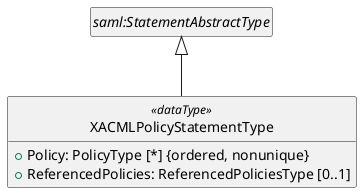
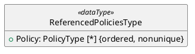
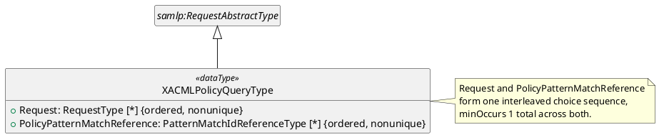

---
# Document metadata processed by Pandoc:
logo: |
  
# Original logo: http://docs.oasis-open.org/templates/OASISLogo-v3.0.png
title: ACAL v1.0 SAML Profile Version 1.0
subtitle: Committee Specification Draft 01
version: "1.0"
stage_revision: csd01 # [stage-abbrev][revisionNumber] as defined in https://docs.oasis-open.org/specGuidelines/ndr/namingDirectives.html
lang: en
keywords: ["access", "authorization", "ABAC", "policylanguage", "SAML", "SOAP", "policy", "standard"]
# date metadata is set automatically to current date, unless specified on pandoc commandline: --metadata date="..."

# If metadata 'x' is a string, any placeholder %x% will be replaced with the value of metadata 'x' (using meta_vars.lua filter), e.g. %version% will be replaced with the version metadata value.
---

### This version

- https://docs.oasis-open.org/xacml/acal/acal/profiles/saml/v%version%/%stage_revision%/acal-saml-v%version%-%stage_revision%.html (Authoritative)
- https://docs.oasis-open.org/xacml/acal/acal/profiles/saml/v%version%/%stage_revision%/acal-saml-v%version%-%stage_revision%.pdf
- https://docs.oasis-open.org/xacml/acal/acal/profiles/saml/v%version%/%stage_revision%/acal-saml-v%version%-%stage_revision%.md


### Previous version


N/A

### Latest version


- https://docs.oasis-open.org/xacml/acal/acal/profiles/saml/v1.0/acal-saml-v1.0.html (Authoritative)
- https://docs.oasis-open.org/xacml/acal/acal/profiles/saml/v1.0/acal-saml-v1.0.pdf
- https://docs.oasis-open.org/xacml/acal/acal/profiles/saml/v1.0/acal-saml-v1.0.md


### Technical Committee


[OASIS eXtensible Access Control Markup Language (XACML) TC](https://groups.oasis-open.org/communities/tc-community-home2?CommunityKey=67afe552-0921-49b7-9a85-018dc7d3ef1d)


### Chairs


- Bill Parducci (bill@parducci.net), Individual


### Secretaries


- Bill Parducci (bill@parducci.net), Individual


### Editors


- Steven Legg (steven.legg@viewds.com), [ViewDS Identity Solutions](https://www.viewds.com/)
- Cyril Dangerville (cyril.dangerville@thalesgroup.com), [THALES](https://www.thalesgroup.com/)


### Abstract


This specification is a profile of ACAL that defines a SAML 2.0 extension type and protocol element for conveying, storing, and querying ACAL policies as SAML assertions and protocol messages. This version covers the policy-conveyance mechanism only; see [Section 4.2](#42-changes-from-the-previous-version) for what is out of scope and why.


### Citation Format


When referencing this document, the following citation format should be used:

**[ACAL-SAML-1.0]**
_%title%_.
Edited by Steven Legg and Cyril Dangerville. %date%. OASIS %subtitle%. https://docs.oasis-open.org/xacml/acal/acal/profiles/saml/v%version%/%stage_revision%/acal-saml-v%version%-%stage_revision%.html . Latest stage: https://docs.oasis-open.org/xacml/acal/acal/profiles/saml/v1.0/acal-saml-v1.0.html .


### Related Work

This document is related to:

- _Attribute-Centric Authorization Language (ACAL) Version 1.0_.
- _eXtensible Access Control Markup Language (XACML) Version 4.0_ (the XML representation of ACAL).


## License, Document Status, and Notices


Copyright © OASIS Open 2026. All Rights Reserved.  For license and copyright information, and complete status, please see Annex A which contains the License, Document Status and Notices.

---


## Table of Contents

- [1 Scope](#1-scope)
- [2 Definitions and Acronyms](#2-definitions-and-acronyms)
  - [2.1 Definitions](#21-definitions)
    - [2.1.1 Terms Defined Elsewhere](#211-terms-defined-elsewhere)
    - [2.1.2 Terms Defined in this Document](#212-terms-defined-in-this-document)
    - [2.1.3 Related terms](#213-related-terms)
  - [2.2 Abbreviations and Acronyms](#22-abbreviations-and-acronyms)
- [3 Document Conventions](#3-document-conventions)
  - [3.1 Key Words](#31-key-words)
  - [3.2 Typographical Conventions](#32-typographical-conventions)
- [4 Introduction (non-normative)](#4-introduction-non-normative)
  - [4.1 Background](#41-background)
  - [4.2 Changes From the Previous Version](#42-changes-from-the-previous-version)
- [5 Policies](#5-policies)
  - [5.1 Namespaces](#51-namespaces)
  - [5.2 XACMLPolicyStatementType](#52-xacmlpolicystatementtype)
  - [5.3 ReferencedPoliciesType](#53-referencedpoliciestype)
  - [5.4 XACMLPolicyQueryType](#54-xacmlpolicyquerytype)
  - [5.5 XACMLPolicy Response Requirements](#55-xacmlpolicy-response-requirements)
- [6 Examples (non-normative)](#6-examples-non-normative)
  - [6.1 An XACMLPolicy Response](#61-an-xacmlpolicy-response)
  - [6.2 An XACMLPolicyQuery Using a Pattern-Matched Reference](#62-an-xacmlpolicyquery-using-a-pattern-matched-reference)
- [7 Safety, Security, and Data Protection Considerations](#7-safety-security-and-data-protection-considerations)
- [8 Conformance](#8-conformance)
  - [8.1 Introduction](#81-introduction)
  - [8.2 Conformance Tables](#82-conformance-tables)
    - [8.2.1 Object Types](#821-object-types)
    - [8.2.2 Profile Identifiers](#822-profile-identifiers)
- [Annex A License, Document Status and Notices](#annex-a-license-document-status-and-notices)
  - [A.1 Document Status](#a1-document-status)
  - [A.2 License and Notices](#a2-license-and-notices)
- [Annex B References](#annex-b-references)
  - [B.1 Normative References](#b1-normative-references)
  - [B.2 Informative References](#b2-informative-references)
- [Annex C ACAL Identifiers](#annex-c-acal-identifiers)
  - [C.1 ACAL Namespaces](#c1-acal-namespaces)
  - [C.2 Profile Identifiers](#c2-profile-identifiers)
- [Annex D How to generate HTML and PDF versions](#annex-d-how-to-generate-html-and-pdf-versions)
- [Appendix 1 Acknowledgments](#appendix-1-acknowledgments)
  - [Leadership](#leadership)
  - [Special Thanks](#special-thanks)
  - [Participants](#participants)
- [Appendix 2 Changes From Previous Version](#appendix-2-changes-from-previous-version)
  - [Revision History](#revision-history)

---


# 1 Scope

This ACAL profile defines a SAML 2.0 [[SAML2](#saml2)] extension complex type, `XACMLPolicyStatementType`, and a SAML 2.0 protocol extension element, `XACMLPolicyQuery`, that together allow XACML/ACAL systems to use SAML 2.0 assertions and protocol messages to convey, store, and query for ACAL policies ([Section 5](#5-policies)).

This version of the profile is deliberately narrow: it ports only the policy-conveyance mechanism of its XACML 3.0 predecessor, not that predecessor's SOAP attribute bindings, authorization-decision query/response mechanism, WS-Trust alternative, Advice usage, or authorization-token usage. See [Section 4.2](#42-changes-from-the-previous-version) for the full scope rationale and what is deferred. This profile is XML-only in its entirety — SAML 2.0, which it extends directly, is an XML standard, so no JSON or YAML representation of this profile is coherent or defined. Neither this version nor its source document's Policies mechanism requires any particular message transport (such as SOAP); a `saml:Assertion`, `samlp:Response`, or `XACMLPolicyQuery` instance defined by this profile MAY be carried over any transport binding SAML 2.0 itself supports.

---


# 2 Definitions and Acronyms


## 2.1 Definitions


### 2.1.1 Terms Defined Elsewhere


This document uses the following terms defined elsewhere:

See Section 2 of [[ACAL-Core-1.0](#acal-core-10)]. See also the Glossary of [[SAML2](#saml2)] for SAML-specific terms (*Assertion*, *Statement*, *Issuer*, and similar) that this document uses without redefining.

### 2.1.2 Terms Defined in this Document

`XACMLPolicy Statement`

: A `saml:Statement` element ([[SAML2](#saml2)]) whose `xsi:type` is `XACMLPolicyStatementType` ([Section 5.2](#52-xacmlpolicystatementtype)).

`XACMLPolicy Assertion`

: A `saml:Assertion` element ([[SAML2](#saml2)]) containing one or more XACMLPolicy Statements.

`XACMLPolicy Query`

: An `XACMLPolicyQuery` element ([Section 5.4](#54-xacmlpolicyquerytype)).

`XACMLPolicy Response`

: A `samlp:Response` element ([[SAML2](#saml2)]) containing an XACMLPolicy Assertion, used as the response to an XACMLPolicy Query.

### 2.1.3 Related terms

None.


## 2.2 Abbreviations and Acronyms

`PAP`

: Policy Administration Point.

`SOAP`

: Simple Object Access Protocol.

---


# 3 Document Conventions


## 3.1 Key Words


The key words "**MUST**", "**MUST NOT**", "**REQUIRED**", "**SHALL**", "**SHALL NOT**", "**SHOULD**", "**SHOULD NOT**", "**RECOMMENDED**", "**NOT RECOMMENDED**", "**MAY**", and "**OPTIONAL**" in this document are to be interpreted as described in BCP 14 [RFC2119] [RFC8174] when, and only when, they appear in all capitals, as shown here.


## 3.2 Typographical Conventions


None.

---


# 4 Introduction (non-normative)


## 4.1 Background

XACML defines the `Policy` object type for expressing policies. In many environments, policy instances need to be stored or transmitted between entities in a XACML/ACAL system, and may need to be signed or associated with a validity period. SAML 2.0 provides this functionality for security-related assertions generally, but does not itself define any protocol or assertion elements specific to policies. This profile defines a SAML extension type and a SAML protocol extension element so that a XACML/ACAL system can use standard SAML assertions and protocols to store, transmit, and query for ACAL policies, carried unmodified inside the SAML wrapper.

## 4.2 Changes From the Previous Version

This is the first ACAL version of this profile, ported from the Policies mechanism (Section 6, plus the `ReferencedPoliciesType` definition Section 6 shares with Section 4.10) of _XACML SAML Profile Version 2.0_, **Committee Specification 02, 19 August 2014** [[XACML-SAML-2.0](#xacml-saml-20)]. The following substantive changes and decisions apply relative to the XACML 3.0 source:

- **Scope: this version ports only the Policies mechanism, not the full eight-section source document.** [XACML SAML Profile 2.0](#xacml-saml-20) also defines a SAML Attribute Assertion mapping (its Section 2), two SOAP bindings for conveying attributes (Section 3), a SAML-based authorization-decision query/response mechanism (Section 4, except the `ReferencedPoliciesType` definition it shares with Section 6, which this version does port), a WS-Trust alternative to that mechanism (Section 5), use of XACML authorization decisions or policies as SAML Advice (Section 7), and use of XACML authorization decisions as SOAP security tokens (Section 8). None of that material is ported by this version. This scoping decision was made deliberately, not by oversight: the sole issue motivating this profile's authoring session (issue #60) is a narrow schema defect in the Policies mechanism specifically — the source document's `<xacml:PolicySetIdReference>`/`<xacml:PolicyIdReference>` choice in `XACMLPolicyQueryType` has no coherent ACAL equivalent, because ACAL Core's own policy-reference redesign (issue #16) removed `PolicySet` and replaced `IdReferenceType` with a small type hierarchy (`ExactMatchIdReferenceType`, `PatternMatchIdReferenceType`, `PolicyReferenceType` — see [[ACAL-Core-1.0](#acal-core-10)] Section 7.8–7.11). Porting the remaining seven-eighths of the source document was judged, and confirmed with the user/TC, to be out of proportion to that motivation, and is expected to be addressed by later, separately-scoped profile work.
- **`PolicySet` removed throughout.** [XACML SAML Profile 2.0](#xacml-saml-20)'s `XACMLPolicyStatementType` and `ReferencedPoliciesType` each alternate between a `<xacml:Policy>` and an `<xacml:PolicySet>` branch wherever a policy can appear. ACAL Core's issue #16 redesign merged `Policy` and `PolicySet` into a single `PolicyType` (a policy can nest other policies via its own `CombinerInput` property — see [[ACAL-Core-1.0](#acal-core-10)] Section 7.4), so every such branch in this profile's schema is a single, repeated `Policy` element, not a choice.
- **`PolicyIdReference` replaced by `PolicyPatternMatchReference`.** [XACML SAML Profile 2.0](#xacml-saml-20)'s `XACMLPolicyQueryType` choice included a bare `<xacml:PolicyIdReference>` (old `IdReferenceType`: an identifier plus optional version-pattern match attributes, with no argument support) for requesting policies by pattern-matched identifier and version. ACAL Core's `IdReferenceType` hierarchy has no directly equivalent standalone type — `PolicyReferenceType` (the closest by name) additionally carries the parameterized-policy `Argument` machinery this query use case does not need — so this profile defines a new element, `PolicyPatternMatchReference`, of ACAL Core's existing `PatternMatchIdReferenceType` ([[ACAL-Core-1.0](#acal-core-10)] Section 7.10), which provides the same identifier-plus-optional-version-pattern selection semantics the old type provided, though the two are not a byte-for-byte identical shape (the old `IdReferenceType` carried its identifier as element content; `PatternMatchIdReferenceType` carries it as an `Id` property/attribute). The element name and base type are the resolution issue #60's own comment thread converged on, quoted verbatim: `<xs:element name="PolicyPatternMatchReference" type="core:PatternMatchIdReferenceType" />`.
- **`PolicySetIdReference` dropped, with no replacement.** With `PolicySet` gone, the choice branch that referenced one by identifier has nothing left to reference.
- **The `xacml-context` namespace, and the XACML 1.0/1.1/2.0 compatibility it exists for, is dropped.** [XACML SAML Profile 2.0](#xacml-saml-20) Section 1.6 defines four version-dependent value sets for its `xacml`/`xacml-context`/`xacml-saml`/`xacml-samlp` namespace prefixes, one for each XACML version (1.0, 1.1, 2.0, 3.0) the source document supports — because XACML 1.0–2.0 used a separate context schema from the policy schema, while XACML 3.0 unified them into one. ACAL, built on the unified XACML 3.0/4.0 model, has no reason to carry the older, split-schema compatibility forward: this profile references `RequestType`/`Policy` ([[ACAL-Core-1.0](#acal-core-10)] Section 7.31/7.4, embodied in the single ACAL Core XML schema) directly, with a single fixed `xacml` namespace prefix and no `xacml-context` prefix at all, no version-dependent value sets, and no separate `wd-14`-suffixed identifier per XACML version.
- **The source document's separate `xacml-saml` (assertion) and `xacml-samlp` (protocol) extension namespaces are preserved as two namespaces in this profile, not unified into one.** The source document splits its SAML extensions across two namespaces/schema documents because it, in turn, extends SAML 2.0's own two-schema (assertion/protocol) split; issue #60's own comment thread was written assuming that split still holds — its agreed fragment declares `PolicyPatternMatchReference` in the protocol-side namespace (prefix `samlp` in the thread's own fragment), not a shared or assertion-side one. An earlier draft of this profile considered unifying both into one namespace, on the reasoning that ACAL Core unified XACML 3.0's separate policy and context schemas into one ([[ACAL-Core-1.0](#acal-core-10)] Section 5, and see the `xacml-context` point above); that analogy does not hold, since ACAL Core's merge was of schemas ACAL Core itself owns, where SAML 2.0's assertion/protocol split belongs to an external, frozen 2005 standard this profile only extends, and no other SAML profile's extension schema is known to merge the two. This document therefore preserves the split: `XACMLPolicyStatementType` and `ReferencedPoliciesType` are declared in an assertion-side namespace, `urn:oasis:names:tc:xacml:4.0:profile:saml2.0:schema:assertion` (`acal-saml-assertion-xml-v4.0-schema.xsd`); `XACMLPolicyQueryType` and `PolicyPatternMatchReference` are declared in a protocol-side namespace, `urn:oasis:names:tc:xacml:4.0:profile:saml2.0:schema:protocol` (`acal-saml-protocol-xml-v4.0-schema.xsd`) — matching, element for element, the placement issue #60's own agreed fragment already assumed. See [Section 5.1](#51-namespaces).
- **Renames**, consistent with ACAL Core: `<xacml:Policy>`/`<xacml:PolicySet>` → `Policy` (see above); `<xacml-context:Request>` → `Request` (see the `xacml-context` point above).
- **`[XACML-Core-4.0]` is a Normative Reference in this document, unlike in the Hierarchical Resource and Multiple Decision Profiles.** Those two profiles are representation-neutral — expressible identically in XML, JSON, or YAML — so `[XACML-Core-4.0]`, `[JACAL-Core-1.0]`, and `[YACAL-Core-1.0]` are each classified Informative there, per [`representation-specific-core-citations-are-informative-because-only-one-is-required`], because a reader conforming to any *one* of the three representations is conformant and never needs to open the other two. That reasoning does not hold for this profile: it is XML-only by its nature (see [Section 1](#1-scope)), so exactly one representation-specific Core document — `[XACML-Core-4.0]`, the XML representation — is unconditionally required by every conformant implementation, not merely by implementations that happen to choose XML. See [Annex B.1](#b1-normative-references).
- **New schema artifacts.** Unlike the Hierarchical Resource and Multiple Decision Profiles, this profile does define new schema: `acal-saml-assertion-xml-v4.0-schema.xsd` and `acal-saml-protocol-xml-v4.0-schema.xsd`, described in [Section 5](#5-policies).

---


# 5 Policies

This section defines the SAML extension type and protocol element by which a XACML/ACAL system stores, conveys, or queries for ACAL `Policy` objects ([[ACAL-Core-1.0](#acal-core-10)] Section 7.4) using SAML 2.0 assertions and protocol messages. The type `Policy` used in this section is defined in [[ACAL-Core-1.0](#acal-core-10)]. This profile is XML-only ([Section 1](#1-scope)); the definitions below are given directly in terms of the XML representation of ACAL, unlike this profile's siblings, which give an abstract, representation-neutral model first and add XML/JSON/YAML worked examples afterward.

## 5.1 Namespaces

This profile's two new schema artifacts are each declared in their own XML namespace, matching the source document's own assertion/protocol split ([Section 4.2](#42-changes-from-the-previous-version)): `acal-saml-assertion-xml-v4.0-schema.xsd` in `urn:oasis:names:tc:xacml:4.0:profile:saml2.0:schema:assertion`, and `acal-saml-protocol-xml-v4.0-schema.xsd` in `urn:oasis:names:tc:xacml:4.0:profile:saml2.0:schema:protocol`. ([Annex C.1](#c1-acal-namespaces) gives this profile's own ACAL identifiers naming these two schemas, distinct from these XML namespace values, following the same convention the ACAL XPath Profile's own Annex D.1 uses.) The examples and normative text in this section use the following namespace prefixes:

| Prefix | Namespace |
| :--- | :--- |
| `xacml` | `urn:oasis:names:tc:xacml:4.0:core:schema` (ACAL Core, [[ACAL-Core-1.0](#acal-core-10)]/[[XACML-Core-4.0](#xacml-core-40)]) |
| `acal-saml` | `urn:oasis:names:tc:xacml:4.0:profile:saml2.0:schema:assertion` (this profile, assertion-side) |
| `acal-samlp` | `urn:oasis:names:tc:xacml:4.0:profile:saml2.0:schema:protocol` (this profile, protocol-side) |
| `saml` | `urn:oasis:names:tc:SAML:2.0:assertion` ([[SAML2](#saml2)]) |
| `samlp` | `urn:oasis:names:tc:SAML:2.0:protocol` ([[SAML2](#saml2)]) |

## 5.2 XACMLPolicyStatementType

An `XACMLPolicyStatementType` object contains ACAL `Policy` objects and, optionally, referenced policies. A `saml:Statement` element ([[SAML2](#saml2)]) whose `xsi:type` is `XACMLPolicyStatementType` is called an *XACMLPolicy Statement* in this profile; no new top-level SAML element is declared for it — an instance sets `xsi:type="acal-saml:XACMLPolicyStatementType"` directly on the SAML-defined `saml:Statement` element, which is of the abstract type `saml:StatementAbstractType` that `XACMLPolicyStatementType` extends. An XACMLPolicy Statement MUST be enclosed in a `saml:Assertion` element; a `saml:Assertion` element containing one or more XACMLPolicy Statements is called an *XACMLPolicy Assertion*. `saml:Subject` MUST NOT be included in an XACMLPolicy Assertion — the subjects relevant to an enclosed `Policy` object are expressed within that `Policy` object itself, not via the enclosing assertion's own `saml:Subject`.

UML definition (class diagram):


The `XACMLPolicyStatementType` object type extends the SAML-defined `saml:StatementAbstractType` with the following properties:

`Policy` [Any Number]

: A sequence of `Policy` objects ([[ACAL-Core-1.0](#acal-core-10)] Section 7.4). If the XACMLPolicy Statement is a response to an XACMLPolicy Query ([Section 5.4](#54-xacmlpolicyquerytype)), the enclosing XACMLPolicy Assertion MUST contain exactly one XACMLPolicy Statement, this SHALL contain exactly one `Policy` object for every policy that satisfies the query, and the responder MUST return all policies available to it that satisfy the query and that the requester is authorized to receive; if no policy satisfies the query, the response MUST contain exactly one XACMLPolicy Statement with an empty `Policy` sequence. Where it is not possible to return all satisfying policies, [Section 5.5](#55-xacmlpolicy-response-requirements) states the required response status. Otherwise, this MAY contain an arbitrary sequence of `Policy` objects.

`ReferencedPolicies` [Optional]

: A `ReferencedPoliciesType` object ([Section 5.3](#53-referencedpoliciestype)) — subject to the receiver's authorization, copies of policies needed to resolve `PolicyReference` properties ([[ACAL-Core-1.0](#acal-core-10)] Section 7.4) within the `Policy` objects of this Statement, including references within the `ReferencedPolicies` object's own contents.

An XACMLPolicy Statement enclosed in a signed `saml:Assertion` MAY be used as a method of authentication of the enclosed policies. In this case the `Policy` objects MUST NOT set a `PolicyIssuer` property; instead, a PDP SHALL derive one from the certificate or other security token associated with the signature, mapped to the `urn:oasis:names:tc:acal:1.0:subject:subject-id` attribute (see [[ACAL-Core-1.0](#acal-core-10)] Section 7.4 for `PolicyIssuer`). This does not require that the issuer name be taken verbatim from the security token — only that the PDP perform some mapping from the claims in the token to determine the issuer.

## 5.3 ReferencedPoliciesType

A `ReferencedPoliciesType` object holds copies of referenced policies. It is used by `XACMLPolicyStatementType` ([Section 5.2](#52-xacmlpolicystatementtype)); a future version of this profile that ports the source document's Authorization Decisions mechanism (see [Section 4.2](#42-changes-from-the-previous-version)) is expected to reuse this same definition for that mechanism's analogous need, rather than redefine it. In the source document, `ReferencedPoliciesType` is defined once, in Section 4.10, and consumed by two sections: Section 6.1 (`XACMLPolicyStatementType`, ported here) and Section 4.4 (`XACMLAuthzDecisionQueryType`, part of the deferred Authorization Decisions mechanism).

UML definition (class diagram):


`Policy` [Any Number]

: A sequence of `Policy` objects ([[ACAL-Core-1.0](#acal-core-10)] Section 7.4), each a policy referenced (directly or transitively, including from within this same sequence) by a `PolicyReference` property of a `Policy` object elsewhere in the enclosing XACMLPolicy Statement. (`ReferencedPolicies` is used by `XACMLPolicyStatementType` only — `XACMLPolicyQueryType` carries no `Policy` or `PolicyReference` property for it to resolve against; see [Section 5.4](#54-xacmlpolicyquerytype).) The `PolicyId` property of each included `Policy` object MUST exactly match the `Id` property of the corresponding `PolicyReference` object that refers to it; where that `PolicyReference` object's `Version` property is present, the included `Policy` object's `Version` MUST match it, in the pattern-match sense `PatternMatchIdReferenceType` itself defines ([[ACAL-Core-1.0](#acal-core-10)] Section 7.10) — not byte-for-byte string equality, since `Version` there is a version-match pattern, not a concrete version.
: There are three classes of policy a reference may resolve against: policies already in this XACMLPolicy Statement's own `Policy` sequence, other policies within this same `ReferencedPolicies` sequence, and policies already available to the PDP by other means. Where a policy is both already available to the PDP and present in a `ReferencedPolicies` object, the supplied copy takes precedence — see [Section 7](#7-safety-security-and-data-protection-considerations) for the security consideration this raises. How a reference is resolved across these three classes otherwise depends on the particular case a given XACMLPolicy Statement is used for, and is implementation-defined.

## 5.4 XACMLPolicyQueryType

An `XACMLPolicyQueryType` object requests ACAL `Policy` objects from a PAP or other entity, either by supplying a `Request` to be evaluated for applicable policies, or by pattern-matched policy identifier and version. The `XACMLPolicyQuery` element, of this type, MAY be used by a PDP or application to request policies from an online Policy Administration Point; a `samlp:Response` containing an XACMLPolicy Assertion MUST be used as the response (an *XACMLPolicy Response*).

UML definition (class diagram):


The `XACMLPolicyQueryType` object type extends the SAML-defined `samlp:RequestAbstractType` with the following properties, given as a choice repeated one or more times (in any combination and order):

`Request` [Any Number]

: An ACAL `RequestType` object ([[ACAL-Core-1.0](#acal-core-10)] Section 7.31). All `Policy` objects potentially applicable to this request that the requester is authorized to receive MUST be returned; a superset of applicable policies MAY be returned (for example, all policies whose `Target` matches the request).

`PolicyPatternMatchReference` [Any Number]

: A `PatternMatchIdReferenceType` object ([[ACAL-Core-1.0](#acal-core-10)] Section 7.10) identifying a `Policy` to be returned, by identifier and, optionally, a version-match pattern (see [Section 4.2](#42-changes-from-the-previous-version) for why this replaces the source document's bare identifier reference).

: Non-normative note: this query mechanism is not intended as a robust provisioning protocol.

## 5.5 XACMLPolicy Response Requirements

A `samlp:Response` element containing an XACMLPolicy Assertion is an *XACMLPolicy Response*. No new type is declared for it — it uses the SAML-defined `samlp:Response` element directly. Where an XACMLPolicy Response is issued in response to an XACMLPolicy Query, it is subject to the following requirements, in addition to those [[SAML2](#saml2)] states generally for `samlp:Response`:

- The response MUST contain exactly one `saml:Assertion` element that is an XACMLPolicy Assertion representing the response to that query. (Where an XACMLPolicy Response is not issued in response to a query, it MAY instead contain any number of XACMLPolicy Assertions, alongside other SAML or XACML assertions.)
- Where it is not possible to return all policies that satisfy the query — for example, because there are more than the responder is willing or able to return in one response — the response's `samlp:Status` element MUST carry the `urn:oasis:names:tc:SAML:2.0:status:TooManyResponses` status code, rather than the response silently returning a partial result.
- The response's `InResponseTo` XML attribute MUST equal the `ID` XML attribute of the XACMLPolicy Query it responds to, so the requester can correlate the response with its query.

---


# 6 Examples (non-normative)

This section gives two worked, self-contained examples: an XACMLPolicy Response conveying a policy ([Section 6.1](#61-an-xacmlpolicy-response)), and an XACMLPolicy Query requesting a policy by pattern-matched reference ([Section 6.2](#62-an-xacmlpolicyquery-using-a-pattern-matched-reference)). Both examples are XML; per [Section 1](#1-scope), no JSON or YAML representation of this profile exists. Neither example shows a specific transport binding (such as a SOAP envelope) — see [Section 1](#1-scope).

## 6.1 An XACMLPolicy Response

A `samlp:Response` conveying a single ACAL policy, permitting a person to read any medical record for which they are the designated patient — the same policy from [[ACAL-Core-1.0](#acal-core-10)] Section 6.2.4.1, conveyed here as an XACMLPolicy Response rather than by out-of-band distribution.

**Plain language**: In response to a request for policies, return the policy governing patient access to their own medical record.

---

```xml
<samlp:Response
    xmlns:samlp="urn:oasis:names:tc:SAML:2.0:protocol"
    xmlns:saml="urn:oasis:names:tc:SAML:2.0:assertion"
    xmlns:acal-saml="urn:oasis:names:tc:xacml:4.0:profile:saml2.0:schema:assertion"
    xmlns:xacml="urn:oasis:names:tc:xacml:4.0:core:schema"
    xmlns:xsi="http://www.w3.org/2001/XMLSchema-instance"
    ID="_r350c9b8-response" Version="2.0" IssueInstant="2026-08-25T14:02:00Z"
    InResponseTo="_q8a41f02-query">
    <saml:Issuer>https://pap.med.example.com</saml:Issuer>
    <samlp:Status>
        <samlp:StatusCode Value="urn:oasis:names:tc:SAML:2.0:status:Success" />
    </samlp:Status>
    <saml:Assertion
        Version="2.0" ID="_a1d2e3f4-assertion" IssueInstant="2026-08-25T14:02:00Z">
        <saml:Issuer>https://pap.med.example.com</saml:Issuer>
        <saml:Conditions NotBefore="2026-08-25T14:02:00Z" NotOnOrAfter="2026-08-25T15:02:00Z" />
        <saml:Statement xsi:type="acal-saml:XACMLPolicyStatementType">
            <xacml:Policy
                PolicyId="urn:oasis:names:tc:acal:1.0:example:policyid:1"
                Version="1.0"
                CombiningAlgId="deny-overrides">
                <xacml:ShortIdSetReference>urn:oasis:names:tc:acal:1.0:example:identifiers</xacml:ShortIdSetReference>
                <xacml:Target>
                    <xacml:Apply FunctionId="anyURI-is-in">
                        <xacml:Value DataType="anyURI">http://www.med.example.com/springfield-hospital</xacml:Value>
                        <xacml:AttributeDesignator
                            Category="resource"
                            AttributeId="collection"
                            DataType="anyURI" />
                    </xacml:Apply>
                </xacml:Target>
                <xacml:Rule Id="Rule1" Effect="Permit">
                    <xacml:Description>A person may read any medical record for which he or she is the designated patient.</xacml:Description>
                    <xacml:Condition>
                        <xacml:Apply FunctionId="and">
                            <xacml:Apply FunctionId="any-of">
                                <xacml:Function Id="string-equal" />
                                <xacml:Value>read</xacml:Value>
                                <xacml:AttributeDesignator
                                    Category="action"
                                    AttributeId="action-id"
                                    DataType="string" />
                            </xacml:Apply>
                            <xacml:Apply FunctionId="string-equal">
                                <xacml:Apply FunctionId="string-one-and-only">
                                    <xacml:AttributeDesignator
                                        Category="access-subject"
                                        AttributeId="patient-number"
                                        DataType="string" />
                                </xacml:Apply>
                                <xacml:Apply FunctionId="string-one-and-only">
                                    <xacml:AttributeDesignator
                                        Category="resource"
                                        AttributeId="patient-number"
                                        DataType="string" />
                                </xacml:Apply>
                            </xacml:Apply>
                        </xacml:Apply>
                    </xacml:Condition>
                </xacml:Rule>
            </xacml:Policy>
        </saml:Statement>
    </saml:Assertion>
</samlp:Response>
```

**What this shows**

- `xsi:type="acal-saml:XACMLPolicyStatementType"` is set directly on the SAML-defined `saml:Statement` element — no new top-level element is declared for the assertion side of this profile (see [Section 5.2](#52-xacmlpolicystatementtype)).
- `xacml:Policy` is the ACAL Core policy element, embedded inside the SAML wrapper via the `xacml` namespace prefix — this example declares no default namespace at all, so every element (SAML, this profile's own, and ACAL Core's) is explicitly prefixed. The policy is embedded as ordinary ACAL Core XML content, without any profile-specific wrapping or transformation of the policy itself. It is the same one-rule example [[ACAL-Core-1.0](#acal-core-10)] Section 6.2.4.1 uses to introduce variable definitions and conditions, with its `VariableDefinition`/`VariableReference` indirection inlined directly into the rule's `Condition` (so the `and`/`any-of` action check and the `patient-number` comparison are both present, just not factored through a named variable) — its `ShortIdSetReference` is carried unchanged, since the inlined form still relies on the same short identifiers.
- `samlp:Status`, required by the real SAML 2.0 protocol schema's `StatusResponseType`, is included for a fully valid example, even though the source document's own illustrative examples omit it.
- No `ReferencedPolicies` element is present — this policy has no `PolicyReference` properties to resolve.

## 6.2 An XACMLPolicyQuery Using a Pattern-Matched Reference

An `XACMLPolicyQuery` requesting the policy conveyed in [Section 6.1](#61-an-xacmlpolicy-response), by identifier rather than by evaluating a request against it, with no version-match pattern given — so any version is acceptable, and the most recent (latest) version SHOULD be returned.

**Plain language**: Return the policy identified by `urn:oasis:names:tc:acal:1.0:example:policyid:1`, preferring its most recent version.

---

```xml
<acal-samlp:XACMLPolicyQuery
    xmlns:acal-samlp="urn:oasis:names:tc:xacml:4.0:profile:saml2.0:schema:protocol"
    xmlns:saml="urn:oasis:names:tc:SAML:2.0:assertion"
    ID="_q8a41f02-query" Version="2.0" IssueInstant="2026-08-25T14:01:55Z">
    <saml:Issuer>https://pdp.med.example.com</saml:Issuer>
    <acal-samlp:PolicyPatternMatchReference Id="urn:oasis:names:tc:acal:1.0:example:policyid:1" />
</acal-samlp:XACMLPolicyQuery>
```

**What this shows**

- `XACMLPolicyQuery` is a top-level element declared directly in this profile's own protocol-side namespace (unlike `XACMLPolicyStatementType`'s `xsi:type` idiom, above, which uses the assertion-side namespace) — `samlp:RequestAbstractType`, which it extends, is abstract with no non-abstract SAML-defined element to substitute for via `xsi:type`. `PolicyPatternMatchReference` is declared in this same protocol-side namespace, matching the placement issue #60's own agreed fragment used ([Section 4.2](#42-changes-from-the-previous-version)).
- `PolicyPatternMatchReference`'s `Id` attribute is inherited unchanged from ACAL Core's `PatternMatchIdReferenceType` ([[ACAL-Core-1.0](#acal-core-10)] Section 7.10); no `Version` attribute is given, so any version of the policy is acceptable and, per that type's own definition, the most recent (latest) version SHOULD be used — matching this example's "preferring its most recent version" plain-language intent without an explicit version-match pattern.
- The response to this query is exactly [Section 6.1](#61-an-xacmlpolicy-response)'s example, correlated via that response's `InResponseTo` attribute matching this query's `ID`.

---


# 7 Safety, Security, and Data Protection Considerations

Refer to [[ACAL-Core-1.0](#acal-core-10)] Section 11.

A relying party SHOULD verify any `ds:Signature` present on an XACMLPolicy Assertion or on the enclosing XACMLPolicy Response itself ([Section 5.5](#55-xacmlpolicy-response-requirements)), and SHOULD NOT act on a `Policy` object obtained from an unsigned or unverified XACMLPolicy Assertion/Response unless it has some other basis for trusting the message's source — a `Policy` object conveyed this way is exactly as authoritative as its transport is trustworthy, and a PDP that evaluates a substituted or tampered policy makes decisions on a false basis. Where a `saml:Conditions` element's `NotBefore`/`NotOnOrAfter` XML attributes are present, a relying party SHOULD ensure a `Policy` object taken from the XACMLPolicy Assertion is used only during the assertion's stated validity period; where a `PolicyIssuer` is derived from an assertion's signer rather than stated explicitly ([Section 5.2](#52-xacmlpolicystatementtype)), that derivation is only as trustworthy as the signature verification it depends on.

[Section 5.3](#53-referencedpoliciestype)'s rule that a supplied `ReferencedPolicies` copy takes precedence over a policy already available to the PDP is a deliberate convenience — it lets a requester supply a complete, self-contained bundle without the PDP needing to separately resolve every reference — but it is also a substitution point: an entity that can inject or alter a `ReferencedPolicies` object can cause the PDP to evaluate a different policy than the one its own identifier and version would otherwise resolve to, for any consumer that does not itself independently verify the reference. Implementations accepting `ReferencedPolicies` objects from a source they do not fully trust SHOULD apply the same signature-verification and validity-period discipline described above to the enclosing XACMLPolicy Assertion as a whole, since `ReferencedPolicies` has no independent signing or validity mechanism of its own.

---


# 8 Conformance

## 8.1 Introduction

This profile defines one optional mechanism — conveying, storing, and querying for ACAL policies via SAML 2.0 assertions and protocol messages. An implementation claiming this profile MUST support every object type and requirement in [Section 5](#5-policies) marked `M` below; `ReferencedPoliciesType` ([Section 5.3](#53-referencedpoliciestype)) is the one part of the mechanism an implementation MAY omit, since the source and this document both state its use as `MAY` rather than as part of the mechanism's required core.

## 8.2 Conformance Tables

This section lists those portions of the specification that MUST be included in an implementation of a PDP or PAP that claims to conform to this profile.

: Note: "M" means mandatory-to-implement. "O" means optional.

The implementation MUST follow [Section 5](#5-policies) and [Annex C](#annex-c-acal-identifiers) where they apply to implemented items in the following tables.

### 8.2.1 Object Types

The implementation MUST support the object types that are marked `M`.

| Object Type | M/O |
| :--- | :--- |
| XACMLPolicyStatementType | M |
| XACMLPolicyQueryType | M |
| ReferencedPoliciesType | O |

Note: `ReferencedPoliciesType` is `O` because [Section 5.2](#52-xacmlpolicystatementtype)/[Section 5.3](#53-referencedpoliciestype) state its use as `MAY`; an XACMLPolicy Statement or Response is fully valid without it.

### 8.2.2 Profile Identifiers

The implementation MUST support the mechanism associated with the following identifier if it claims this profile.

| Identifier | M/O | Deprecated Identifier |
| :--- | :--- | :--- |
| urn:oasis:names:tc:acal:1.0:profile:saml:policies | O | urn:oasis:names:tc:xacml:3.0:profile:saml2.0:v2:policies |

Note: `O` because, as with every ACAL profile, claiming this profile at all is itself optional.

---


# Annex A License, Document Status and Notices


(This annex forms an integral part of this Specification.)


## A.1 Document Status


This document was last revised or approved by the OASIS eXtensible Access Control Markup Language (XACML) TC on the above date. The level of approval is also listed above. Check the "Latest version" location noted above for possible later revisions of this document. Any other numbered Versions and other technical work produced by the Technical Committee (TC) are listed at https://groups.oasis-open.org/communities/tc-community-home2?CommunityKey=67afe552-0921-49b7-9a85-018dc7d3ef1d#technical.


TC members should send comments on this document to the TC's email list. Others should send comments to the TC's public comment list, after subscribing to it by following the instructions at the "Send A Comment" button on the TC's web page at https://www.oasis-open.org/committees/xacml/.


NOTE: any machine-readable content (Computer Language Definitions) declared Normative for this Work Product is provided in separate plain text files. In the event of a discrepancy between any such plain text file and display content in the Work Product's prose narrative document(s), the content in the separate plain text file prevails.


## A.2 License and Notices


Copyright © OASIS Open 2026. All Rights Reserved.


All capitalized terms in the following text have the meanings assigned to them in the OASIS Intellectual Property Rights Policy (the "OASIS IPR Policy"). The full Policy, which governs the licensure of this document, may be found at the OASIS website: [[https://www.oasis-open.org/policies-guidelines/ipr/](https://www.oasis-open.org/policies-guidelines/ipr/)]


This document and translations of it may be copied and furnished to others, and derivative works that comment on or otherwise explain it or assist in its implementation may be prepared, copied, published, and distributed, in whole or in part, without restriction of any kind, provided that the above copyright notice and this section are included on all such copies and derivative works. However, this document itself may not be modified in any way, including by removing the copyright notice or references to OASIS, except as needed for the purpose of developing any document or deliverable produced by an OASIS Technical Committee (in which case the rules applicable to copyrights, as set forth in the OASIS IPR Policy, must be followed) or as required to translate it into languages other than English.


The limited permissions granted above are perpetual and will not be revoked by OASIS or its successors or assigns, as provided in the OASIS IPR Policy.


This document is provided under the [RF on Limited Terms](https://www.oasis-open.org/policies-guidelines/ipr/#RF-on-Limited-Mode) IPR mode that was chosen when the project was established, as defined in the IPR Policy. For information on whether any patents have been disclosed that may be essential to implementing this document, and any offers of patent licensing terms, please refer to the Intellectual Property Rights section of the project's web page ([XACML IPR Policy](https://www.oasis-open.org/committees/xacml/ipr.php)).


This document and the information contained herein is provided on an "AS IS" basis and OASIS DISCLAIMS ALL WARRANTIES, EXPRESS OR IMPLIED, INCLUDING BUT NOT LIMITED TO ANY WARRANTY THAT THE USE OF THE INFORMATION HEREIN WILL NOT INFRINGE ANY OWNERSHIP RIGHTS OR ANY IMPLIED WARRANTIES OF MERCHANTABILITY OR FITNESS FOR A PARTICULAR PURPOSE. OASIS AND ITS MEMBERS WILL NOT BE LIABLE FOR ANY DIRECT, INDIRECT, SPECIAL OR CONSEQUENTIAL DAMAGES ARISING OUT OF ANY USE OF THIS DOCUMENT OR ANY PART THEREOF.


As stated in the OASIS IPR Policy, the following three paragraphs in brackets apply to OASIS Standards Final Deliverable documents (Committee Specifications, OASIS Standards, or Approved Errata).


OASIS requests that any OASIS Party or any other party that believes it has patent claims that would necessarily be infringed by implementations of this OASIS Standards Final Deliverable, to notify OASIS TC Administrator and provide an indication of its willingness to grant patent licenses to such patent claims in a manner consistent with the IPR Mode of the OASIS Technical Committee that produced this deliverable.


OASIS invites any party to contact the OASIS TC Administrator if it is aware of a claim of ownership of any patent claims that would necessarily be infringed by implementations of this OASIS Standards Final Deliverable by a patent holder that is not willing to provide a license to such patent claims in a manner consistent with the IPR Mode of the OASIS Technical Committee that produced this OASIS Standards Final Deliverable. OASIS may include such claims on its website, but disclaims any obligation to do so.


OASIS takes no position regarding the validity or scope of any intellectual property or other rights that might be claimed to pertain to the implementation or use of the technology described in this OASIS Standards Final Deliverable or the extent to which any license under such rights might or might not be available; neither does it represent that it has made any effort to identify any such rights. Information on OASIS' procedures with respect to rights in any document or deliverable produced by an OASIS Technical Committee can be found on the OASIS website. Copies of claims of rights made available for publication and any assurances of licenses to be made available, or the result of an attempt made to obtain a general license or permission for the use of such proprietary rights by implementers or users of this OASIS Standards Final Deliverable, can be obtained from the OASIS TC Administrator. OASIS makes no representation that any information or list of intellectual property rights will at any time be complete, or that any claims in such list are, in fact, Essential Claims.


The name "OASIS" is a trademark of OASIS, the owner and developer of this document, and should be used only to refer to the organization and its official outputs. OASIS welcomes reference to, and implementation and use of, its documents, while reserving the right to enforce its marks against misleading uses. Please see [OASIS Trademark Policy](https://www.oasis-open.org/policies-guidelines/trademark/) for guidance.


---


# Annex B References


(This annex forms an integral part of this Specification.)


This section contains the normative and informative references that are used in this document.


Normative references are specific (identified by date of publication and/or edition number or version number) and Informative references are either specific or non-specific. For specific references, only the cited version applies. For non-specific references, the latest version of the reference document (including any amendments) applies. While any hyperlinks included in this section were valid at the time of publication, OASIS cannot guarantee their long term validity.


## B.1 Normative References


The following documents are referenced in such a way that some or all of their content constitutes requirements of this document.

###### [ACAL-Core-1.0]

Attribute-Centric Authorization Language (ACAL) Version 1.0. Edited by Steven Legg and Cyril Dangerville. 18 February 2026. OASIS Committee Specification Draft 01.

###### [XACML-Core-4.0]

_eXtensible Access Control Markup Language (XACML) Version 4.0_. Edited by Steven Legg and Cyril Dangerville. 18 February 2026. OASIS Committee Specification Draft 01. https://docs.oasis-open.org/xacml/acal/xacml/core/v4.0/csd01/acal-core-xml-v4.0-csd01.html. Latest stage: https://docs.oasis-open.org/xacml/acal/xacml/core/v4.0/csd01/acal-core-xml-v4.0-csd01.html.

: Unlike in the Hierarchical Resource and Multiple Decision Profiles, this reference is Normative here — see [Section 4.2](#42-changes-from-the-previous-version) for why this profile's XML-only nature makes this citation's status differ from those representation-neutral profiles.

###### [XACML-SAML-2.0]

XACML SAML Profile Version 2.0. Edited by Erik Rissanen. 19 August 2014. OASIS Committee Specification 02. http://docs.oasis-open.org/xacml/xacml-saml-profile/v2.0/cs02/xacml-saml-profile-v2.0-cs02.html. Latest version: http://docs.oasis-open.org/xacml/xacml-saml-profile/v2.0/xacml-saml-profile-v2.0.html.

###### [SAML2]

Assertions and Protocols for the OASIS Security Assertion Markup Language (SAML) V2.0. Edited by Scott Cantor, John Kemp, Rob Philpott, and Eve Maler. 15 March 2005. OASIS Standard. http://docs.oasis-open.org/security/saml/v2.0/saml-core-2.0-os.pdf.

###### [RFC2119]

RFC 2119, *Key Words for Use in RFCs to Indicate Requirement Levels*, BCP 14, RFC 2119, March 1997. [Online]. Available: https://www.rfc-editor.org/info/rfc2119

###### [RFC8174]

RFC 8174, *Ambiguity of Uppercase vs Lowercase in RFC 2119 Key Words*, BCP 14, RFC 8174, May 2017. [Online]. Available: https://www.rfc-editor.org/info/rfc8174


## B.2 Informative References


The following referenced documents are not required for the application of this document but may assist the reader with regard to a particular subject area.

###### [XACML]

_eXtensible Access Control Markup Language (XACML) Version 3.0 Plus Errata 01_. Edited by Erik Rissanen. OASIS Standard incorporating Approved Errata. https://docs.oasis-open.org/xacml/3.0/xacml-3.0-core-spec-en.html.


---


# Annex C ACAL Identifiers


(This annex forms an integral part of this Specification.)

This section defines standard identifiers for commonly used definitions.

## C.1 ACAL Namespaces

This ACAL Profile is defined using these two identifiers, one per schema artifact ([Section 5.1](#51-namespaces)):

`urn:oasis:names:tc:acal:1.0:saml:schema:assertion` (`acal-saml-assertion-xml-v4.0-schema.xsd`)

`urn:oasis:names:tc:acal:1.0:saml:schema:protocol` (`acal-saml-protocol-xml-v4.0-schema.xsd`)

These are this profile's own ACAL-namespace identifiers, each distinct from the actual XML namespace its corresponding schema artifact declares (`urn:oasis:names:tc:xacml:4.0:profile:saml2.0:schema:assertion` and `urn:oasis:names:tc:xacml:4.0:profile:saml2.0:schema:protocol` respectively) — the same two-identifier-per-schema pattern [[ACAL-Core-1.0](#acal-core-10)]'s and the ACAL XPath Profile's own schema namespaces already use.

## C.2 Profile Identifiers

See [Section 8.2.2](#822-profile-identifiers) for the profile identifier this document defines, its meaning, and its deprecated XACML 3.0 equivalent.

---

# Annex D How to generate HTML and PDF versions

## Online generation

HTML/PDF versions are generated automatically online via Github Actions after each update pushed to the main branch of [OASIS XACML TC Github repository](https://github.com/oasis-tcs/xacml-spec/). Go to  Github Actions on the github repository, then go to the latest workflow run, and, if the run succeeded, the summary should display the links to the generated HTML/PDF documents.

## Offline generation

### Prerequisites

Install Pandoc **v3.2.1 or later** ( [latest release](https://github.com/jgm/pandoc/releases/latest) ), Graphviz and PlantUML on your system; or simply use Docker with the following shell alias:
```
$ alias pandoc='docker run --rm --volume "$(pwd):/data" ghcr.io/oasis-tcs/pandoc-plantuml'
```
_The Dockerfile (named `Dockerfile`) of the docker image used in the alias above is provided in the [pandoc](pandoc) folder next to this markdown file for your convenience if you wish to build it yourself._

Git clone or get a local copy of [OASIS XACML TC Github repository](https://github.com/oasis-tcs/xacml-spec/), open a terminal and **change your working directory to the root directory of your local copy of the repository**.

### CSS stylesheet

The generation command uses a CSS stylesheet file (`-c` argument) provided by OASIS. It may be changed to one of these (or the local version in the `styles` folder) to get a different style of output:
- https://docs.oasis-open.org/templates/css/markdown-styles-v1.7.3.css
- https://docs.oasis-open.org/templates/css/markdown-styles-v1.7.3a.css (this one produces HTML that resembles the github display more closely, especially for blocks of code) This template already includes a reference (in HTML code) to this .css file.
- https://docs.oasis-open.org/templates/css/markdown-styles-v1.8.1-cn_final.css

### HTML generation

Run the following command line to generate the HTML from this markdown file (input file specified as last argument):

```console
$ pandoc/mkdocs.sh --output /tmp acal-saml-v%version%.md
```
The `--output` option sets the output directory, and the output filename is the same as the input file (last argument) except `.md` extension is replaced with `.html`.

Do not add `--number-lines`: this document has no `{.numberLines}` code fences, and the flag switches pandoc's markdown reader in a way that strips the leading section-number segment from every auto-generated heading anchor (`#1-scope` becomes `#scope`), breaking this document's own cross-references.

The publication date is automatically set to the current date by default (using Lua filter `pandoc/meta_vars.lua`). However, you may set a specific date of your choice instead, by adding the argument `--metadata date="My date in the form DD Month YYYY"` at the end of the command.

### PDF generation

For PDF output, add the `--pdf` option as follows:

```console
$ pandoc/mkdocs.sh --pdf --output /tmp acal-saml-v%version%.md
```

The HTML file is generated like the previous command and, in addition, a PDF file is generated with the same name as the input file except the `.md` extension is replaced with `.pdf` in this case.


# Appendix 1 Acknowledgments


(This appendix does not form an integral part of this Specification and is informational.)


## Leadership


The following individuals have had significant leadership positions during the development of this document, not just this version of the document, and they are gratefully acknowledged:


- Chairs
  - Bill Parducci, Individual
- Secretaries
  - Bill Parducci, Individual
- Editors
  - Steven Legg, ViewDS Identity Solutions
  - Cyril Dangerville, THALES


## Special Thanks


The following individuals have made substantial contributions to this document, not just this version of the document, and their contributions are gratefully acknowledged:

- Steven Legg, ViewDS Identity Solutions
- Cyril Dangerville, THALES


## Participants


The following individuals were members of this committee during the creation of this document, not just this version of the document, and their contributions are gratefully acknowledged:

**XACML TC Members:**

- Hal Lockhart, Individual
- Bill Parducci, Individual
- Steven Legg, ViewDS Identity Solutions
- Cyril Dangerville, THALES


---


# Appendix 2 Changes From Previous Version


(This appendix does not form an integral part of this Specification and is informational.)

This is the first version of this profile. See [Section 4.2](#42-changes-from-the-previous-version) for the changes relative to its XACML 3.0 predecessor.

## Revision History

Latest revision history can be obtained from [OASIS XACML TC's github repository](https://github.com/oasis-tcs/xacml-spec/blob/v%version%-%stage_revision%/acal-saml-v%version%-%stage_revision%.md).

<!-- The following centered line represents the end of the document -->
\_\_\_\_\_\_\_\_\_\_\_\_\_\_\_\_\_\_\_\_\_\_\_\_\_\_\_\_\_\_\_\_\_\_\_\_\_\_\_\_
