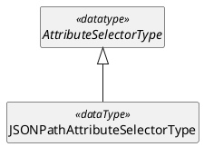
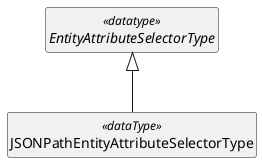




---


# ACAL v1.0 JSONPath Profile Version 1.0


## Committee Specification Draft 01


## 15 January 2026


### This version


- [ link to authoritative version of the published document ] (Authoritative)  
- [ links to one or more other versions of the published document (e.g., MD, PDF, Word, HTML, etc.) ] 


### Previous version


- [ link to authoritative version of the published document ] (Authoritative)  
- [ links to one or more other versions of the published document (e.g., MD, PDF, Word, HTML, etc.) ] 


### Latest version


- [ link to authoritative version of the published document ] (Authoritative)  
- [ links to one or more other versions of the published document (e.g., MD, PDF, Word, HTML, etc.) ] 


### Technical Committee

[OASIS eXtensible Access Control Markup Language (XACML) TC](https://groups.oasis-open.org/communities/tc-community-home2?CommunityKey=67afe552-0921-49b7-9a85-018dc7d3ef1d)


### Chairs


- Bill Parducci (bill@parducci.net), Individual


### Secretaries


- Bill Parducci (bill@parducci.net), Individual 


### Editors


- Steven Legg (steven.legg@viewds.com), [ViewDS Identity Solutions](https://www.viewds.com/)
- Cyril Dangerville (cyril.dangerville@thalesgroup.com), [THALES](https://www.thalesgroup.com/)
- Bill Parducci (bill@parducci.net), Individual


### Abstract


This specification is a profile of ACAL that provides ACAL extensions based on the JSONPath standard, such as JSONPath-based AttributeSelector. 


### Citation Format


When referencing this document, the following citation format should be used:


_ACAL v1.0 JSONPath Profile Version 1.0_.
Edited by Steven Legg and Cyril Dangerville. 15 January 2026. OASIS Committee Specification Draft 01.


### Related Work

This document is related to:

- _Attribute-Centric Authorization Language (ACAL) Version 1.0_.


## License, Document Status, and Notices


Copyright © OASIS Open 2026. All Rights Reserved.  For license and copyright information, and complete status, please see Annex A which contains the License, Document Status and Notices.

## How to generate HTML and PDF versions

### Online generation

HTML/PDF versions are generated automatically online via Github Actions after each update pushed to the main branch of [OASIS XACML TC Github repository](https://github.com/oasis-tcs/xacml-spec/). Go to  Github Actions on the github repository, then go to the latest workflow run, and, if the run succeeded, the summary should display the links to the generated HTML/PDF documents.

### Offline generation

#### Prerequisites

Install Pandoc, Graphviz and PlantUML on your system; or simply use Docker with the following shell alias:
```
$ alias pandoc='docker run --rm --volume "$(pwd):/data" cdang/pandoc-plantuml'
```
_The Dockerfile (named `Dockerfile`) of the docker image used in the alias above is provided in the same folder as this markdown file for your convenience if you wish to build it yourself._  

OASIS staff are currently using pandoc 3.0 from https://github.com/jgm/pandoc/releases/tag/3.0.

Git clone or get a local copy of [OASIS XACML TC Github repository](https://github.com/oasis-tcs/xacml-spec/), open a terminal and **change your working directory to the root directory of your local copy of the repository**.

#### CSS stylesheet

The generation command uses a CSS stylesheet file (`-c` argument) provided by OASIS. It may be changed to one of these (or the local version in the `styles` folder) to get a different style of output:
- https://docs.oasis-open.org/templates/css/markdown-styles-v1.7.3.css
- https://docs.oasis-open.org/templates/css/markdown-styles-v1.7.3a.css (this one produces HTML that resembles the github display more closely, especially for blocks of code) This template already includes a reference (in HTML code) to this .css file.

#### HTML generation

Run the following command line to generate HTML from this markdown file (named `acal-v1.0-jsonpath.md`), :

```console
$ pandoc -f gfm+definition_lists -t html acal-v1.0-jsonpath.md -c styles/markdown-styles-v1.7.3a.css \ 
         -s --lua-filter diagram.lua --embed-resources \
         --metadata title="ACAL v1.0 JSONPath Profile Version 1.0" \
         -o acal-v1.0-jsonpath.html
```

Note this command generates a Table of Contents (TOC) in HTML which is located at the top of the HTML document, and which requires additional editing in order to be published in the expected OASIS style. This editing will be handled by OASIS staff during publication.

#### PDF generation

For PDF output, the command line is the following (different `-t` and `-H` arguments):

```console
$ pandoc -f gfm+definition_lists -t pdf acal-v1.0-jsonpath.md -c styles/markdown-styles-v1.7.3a.css \
         -H custom_latex_header_for_pandoc_pdf_output.tex -s -L diagram.lua \
         --metadata title="ACAL v1.0 JSONPath Profile Version 1.0" --embed-resources \
         -o acal-v1.0-jsonpath.pdf 
```

---


## Table of Contents
<!-- ToC template from OASIS Open Specification Template Instructions:

- [1 Scope](#1-scope)
- [2 Definitions and Acronyms](#2-definitions-and-acronyms)
  - [2.1 Definitions](#2.1-definitions)
    - [2.1.1 Terms Defined Elsewhere](#2.1.1-terms-defined-elsewhere)
    - [2.1.2 Terms Defined in this Document](#2.1.2-terms-defined-in-this-document)
  - [2.2 Abbreviations and Acronyms](#2.2-abbreviations-and-acronyms)
- [3 Document Conventions](#3-document-conventions)
  - [3.1 Key Words](#3.1-key-words)
  - [3.2 Typographical Conventions](#3.2-typographical-conventions)
- [4 Introduction](#4-introduction)
  - [4.1 Any Additional Introduction Subsections That are Needed](#4.1-any-additional-introduction-subsections-that-are-needed)
  - [4.2 Changes From the Previous Version](#4.2-changes-from-the-previous-version)
- [5 Level 1 Section Header](#5-level-1-section-header)
  - [5.1 Level 2 Section Header](#5.1-level-2-section-header)
    - [5.1.1 Level 3 Section Header](#5.1.1-level-3-section-header)
      - [5.1.1.1 Level 4 Section Header](#5.1.1.1-level-4-section-header)
        - [5.1.1.1.1 Level 5 Section Header](#5.1.1.1.1-level-5-section-header)
          - [5.1.1.1.1.1 Level 6 Section Header](#5.1.1.1.1.1-level-6-section-header)
- [6 Additional Sections as Needed](#6-additional-sections-as-needed)
- [7 Safety, Security, and Data Protection Considerations](#7-safety,-security,-and-data-protection-considerations)
- [8 Conformance](#8-conformance)
- [Annex A License, Document Status and Notices](#annex-a-license,-document-status-and-notices)
  - [A.1 Document Status](#a.1-document-status)
  - [A.2 License and Notices](#a.2-license-and-notices)
- [Annex B References](#annex-b-references)
  - [B.1 Normative References](#b.1-normative-references)
  - [B.2 Informative References](#b.2-informative-references)
- [Annex C Additional Annex as Needed](#annex-c-additional-annex-as-needed)
  - [C.1 Subsection Title](#c.1-subsection-title)
  - [C.1.1 Sub-subsection](#c.1.1-sub-subsection)
- [Appendix 1 Acknowledgments](#appendix-1-acknowledgments
  - [Leadership](#leadership)
  - [Special Thanks](#special-thanks)
  - [Participants](#participants)
- [Appendix 2 Changes From Previous Version](#appendix-2-changes-from-previous-version)
  - [Revision History](#revision-history)
- [Appendix 3 Additional Appendix as Needed](#appendix-3-additional-appendix-as-needed)
  - [Subsection Title](#subsection-title)
- [Sub-subsection](#sub-subsection)
-->

<!-- Generated ToC -->
- [1 Scope](#1-scope)
- [2 Definitions and Acronyms](#2-definitions-and-acronyms)
  - [2.1 Definitions](#21-definitions)
    - [2.1.1 Terms Defined Elsewhere](#211-terms-defined-elsewhere)
    - [2.1.2 Terms Defined in this Document](#212-terms-defined-in-this-document)
    - [2.1.3 Related terms](#213-related-terms)
  - [2.2 Abbreviations and Acronyms](#22-abbreviations-and-acronyms)
- [3 Document Conventions](#3-document-conventions)
  - [3.1 Key Words](#31-key-words)
  - [3.2 Typographical Conventions](#32-typographical-conventions)
- [4 Introduction (non-normative)](#4-introduction-non-normative)
  - [4.1 Requirements](#41-requirements)
  - [4.2 Policies Based on Subject and Resource Attributes](#42-policies-based-on-subject-and-resource-attributes)
  - [4.3 Changes From the Previous Version](#43-changes-from-the-previous-version)
- [5 Structures](#5-structures)
  - [5.1 ContentType restrictions](#51-contenttype-restrictions) 
  - [5.2 ACAL extensions](#52-acal-extensions)
    - [5.2.1 AttributeSelectorType extension - JSONPathAttributeSelectorType](#521-attributeselectortype-extension---jsonpathattributeselectortype)
    - [5.2.2 EntityAttributeSelectorType extension - JSONPathEntityAttributeSelectorType (optional)](#522-entityattributeselectortype-extension---jsonpathentityattributeselectortype)
- [6 Attribute Selector Evaluation](#6-attribute-selector-evaluation)
- [7 Safety, Security, and Data Protection Considerations](#7-safety-security-and-data-protection-considerations)
- [8 Conformance](#8-conformance)
  - [8.1 Introduction](#81-introduction)
  - [8.2 Conformance Tables](#82-conformance-tables)
    - [8.2.1 Object Types](#821-object-types)
- [Annex A License, Document Status and Notices](#annex-a-license-document-status-and-notices)
  - [A.1 Document Status](#a1-document-status)
  - [A.2 License and Notices](#a2-license-and-notices)
- [Annex B References](#annex-b-references)
  - [B.1 Normative References](#b1-normative-references)
  - [B.2 Informative References](#b2-informative-references)
- [Annex C. ACAL Identifiers](#annex-c-acal-identifiers)
  - [C.1 ACAL Namespaces](#c1-acal-namespaces)
- [Appendix 1 Acknowledgments](#appendix-1-acknowledgments)
  - [Leadership](#leadership)
  - [Special Thanks](#special-thanks)
  - [Participants](#participants)
- [Appendix 2 Changes From Previous Version](#appendix-2-changes-from-previous-version)
  - [Revision History](#revision-history)
- [Appendix 3 OASIS Open Specification Template Instructions](#appendix-3-oasis-open-specification-template-instructions)
  - [General Template Instructions](#general-template-instructions)
  - [Formatting Instructions](#formatting-instructions)
  - [Extra Items Instructions](#extra-items-instructions)
  - [**Listing 1.1** Sample Title](#listing-11-sample-title)
  - [**Code 1.1** Sample Title](#code-11-sample-title)
  - [Other Instructions](#other-instructions)
- [Appendix 4 Additional Appendix as Needed](#appendix-4-additional-appendix-as-needed)
  - [Subsection Title](#subsection-title)
    - [Sub-subsection](#sub-subsection)


---


# 1 Scope

<!-- OASIS Open Specification Template Instructions: 

What is the purpose and scope of this document?   
Best practices: 

- Expect this text to be reused in multiple other places to explain the specification in summary form.  
- This is not the TC or OP scope (which is an IPR and rules boundary);  rather, this section is the summary intended purpose of this specification.  
- Short is better; four paragraphs or less is recommended.  
- If use of this spec is deliberately created to rely on or complement another standard, consider briefly mentioning that here as context.  
- To the extent that discussion of the larger context of the spec, or its history, or the circumstances that led to its creation or revision, are necessary, they belong in the Introduction, not here. 

-->

This ACAL profile defines concrete types of [ACAL] `AttributeSelector` and `EntityAttributeSelector` using JSONPath [[RFC9535]](#rfc9535) expressions to extract attributes from ACAL Request's `Content`.

Concrete representations (data formats) are to be provided as separate specifications and therefore out of scope of this document.

---


# 2 Definitions and Acronyms


## 2.1 Definitions


### 2.1.1 Terms Defined Elsewhere


This document uses the following terms defined elsewhere:

<!-- The following syntax (: definition) for definition lists requires the 'definition_lists' extension enabled in the pandoc command (-f gfm+definition_lists) to be rendered properly. -->
See Section 2 of [ACAL].

### 2.1.2 Terms Defined in this Document

None.

### 2.1.3 Related terms

None.


## 2.2 Abbreviations and Acronyms

None.

---


# 3 Document Conventions


## 3.1 Key Words


The key words "**MUST**", "**MUST NOT**", "**REQUIRED**", "**SHALL**", "**SHALL NOT**", "**SHOULD**", "**SHOULD NOT**", "**RECOMMENDED**", "**NOT RECOMMENDED**", "**MAY**", and "**OPTIONAL**" in this document are to be interpreted as described in BCP 14 [RFC2119] [RFC8174] when, and only when, they appear in all capitals, as shown here.


## 3.2 Typographical Conventions

<!-- From OASIS Open Specification Template Instructions: Describe any standards or typographical conventions that were followed when writing this document, such as fonts or highlighting that have special significance. If there are no typographical conventions than one is to put "None". -->
None.

---


# 4 Introduction (non-normative)


## 4.1 Requirements

JSON is a common format to represent structured objects that may be supplied by the PEP as subject attribute or resource attribute's Content inside the Request to the PDP, typically a JSON Web token (JWT) in the case of subject attributes (JWT is commonly used in OpenID Connect and OAuth protocols), or any JSON document as resource data. JSON is a common data exchange format used by Web APIs. For such cases, supporting JSONPath [RFC9535] expressions in ACAL is the standard way and therefore a must-have to extract the necessary values from the JSON content for policy evaluation. For instance, a common rule of a privacy policy is that a person should be allowed to read records (in JSON) for which he or she is the subject. The corresponding policy must contain a reference - JSONPath expression - to the subject identified in the information resource - JSON record - itself.

## 4.2 Policies Based on Subject and Resource Attributes

Attribute selectors (`AttributeSelectorType` objects) defined by this profile use a JSONPath expression [RFC9535] over the `ContentType` object of the subject (resp. resource) to identify a particular subject (resp. resource) attribute value by its location in the context (see Section 4.11 of [ACAL] for an explanation of context).


## 4.3 Changes From the Previous Version


<!-- From OASIS Open Specification Template Instructions: This section is **REQUIRED** and **MUST** be the last numbered subsection in this section. -->

None. This is the first version of this profile.

---

# 5 Structures

## 5.1 ContentType restrictions

This profile applies to a `Content` object (defined in [ACAL]) in the Request if and only if:
- The `MediaType` property is set to `application/json`.
- The `Body` property value is a JSON object. *Note that it is always possible to encapsulate a JSON array inside a JSON object if a JSON array is really needed.*

## 5.2 ACAL extensions

The structures in this profile are extensions to [ACAL] model and described here in abstract terms. The concrete representations of these structures are defined for a variety of syntaxes each in a separate profile.

The types `AttributeSelectorType` and `EntityAttributeSelectorType` used in the next UML models are defined in [ACAL].

### 5.2.1 AttributeSelectorType extension - JSONPathAttributeSelectorType

A `JSONPathAttributeSelectorType` object is a concrete type of `AttributeSelectorType` from [ACAL](#acal) that uses JSONPath ([RFC9535](#rfc9535)) for `Path` expressions and expects a JSON object as value of the `Body` property of a `RequestEntityType` object's `Content` object. More precisely, the returned values shall be constructed from the node(s) selected by applying the JSONPath expression given by the attribute selector's `Path` property to the JSON object in the `Body` property of the `Content` object in the `RequestEntityType` object matching the attribute selector's `Category` property. 

See the section 9 for details of attribute selector evaluation.

UML definition (class diagram):


In the context of this profile, the required `Path` property inherited from the supertype `AttributeSelectorType` SHALL be a JSONPath expression [RFC9535](#rfc9535).


## 5.2.2 EntityAttributeSelectorType extension - JSONPathEntityAttributeSelectorType

A `JSONPathEntityAttributeSelectorType` object is a concrete type of `EntityAttributeSelectorType` [ACAL](#acal) that uses JSONPath [RFC9535](#rfc9535) for `Path` expressions and expects a JSON object in the value returned by the attribute selector's `Expression` property. In other words, the values shall be constructed from the node(s) selected by applying the JSONPath expression given by the entity attribute selector's `Path` property to the JSON object of the `Body` property of the `Content` object in either an attribute category in the request context (`RequestEntity`) or the value of the `urn:oasis:names:tc:acal:1.0:data-type:entity` data type returned by its `Expression` evaluation.

See the Section 9 for details of entity attribute selector evaluation.

UML definition (class diagram):


The `Path` property is also defined the same as in `JSONPathAttributeSelectorType`.

---


# 6 Attribute Selector Evaluation


A `JSONPathAttributeSelectorType` or `JSONPathEntityAttributeSelector` object SHALL be evaluated according to the following processing model.

: Note: It is not necessary for an implementation to exactly follow this model. It is only necessary to produce results identical to those that would be produced by following this model.

The first steps are already described in [ACAL] section 9.4.7 and provided here as a reminder:

- If the attribute category given by the `Category` property is not found or does not have a `Content` property, then the return value is either `Indeterminate` or an empty bag as determined by the `MustBePresent` property.

- If the `Expression` property of an `JSONPathEntityAttributeSelector` object evaluates to a value of the `urn:oasis:names:tc:acal:1.0:data-type:entity` data type and that value does not have a `Content` property, then the return value is either `Indeterminate` or an empty bag as determined by the `MustBePresent` property.

- If the `Expression` property of an `JSONPathEntityAttributeSelector` object evaluates to a value of the `urn:oasis:names:tc:acal:1.0:data-type:anyURI` data type and an attribute category with that value as its `Category` is not found or does not have a `Content` property, then the return value is either `Indeterminate` or an empty bag as determined by the `MustBePresent` property.

If the designated attribute category or entity value has a `Content` property, then follow the steps below:

1. Construct a JSON object (RFC 8259) from the value of the `Body` property of the `Content` property. If the content is not a valid JSON object, then the attribute selector MUST return `Indeterminate` with status code `urn:oasis:names:tc:acal:1.0:status:syntax-error`.

2. The root node of the data structure (JSON object) shall be used as context node of evaluation (JSONPath *query argument*).

3. Evaluate the JSONPath expression given in the `Path` property against the context node selected in the previous step, according to the syntax and semantics of the JSONPath standard [RFC9535].

4. The result of the previous step is a nodelist that is converted to a bag of values of the data type specified by the `DataType` property. In most cases the conversion depends on the string value of a node's JSON value, defined as follows:

    * The string value of a JSON string value is the sequence of Unicode characters represented by the text _between_ the surrounding double quotes, i.e., with each escape sequence replaced with its equivalent Unicode character.

    * The string value of the special JSON value `true`, `false` or `null` is the equivalent sequence of Unicode characters.

    * The string value of a JSON number is the equivalent sequence of Unicode characters.

    * The string value of a JSON array is the empty string.

    * The string value of a JSON object is the empty string.

&nbsp;
: The nodelist is converted to a bag of values of the data type specified by the `DataType` property as follows:

&nbsp;
: If the specified data type is `urn:oasis:names:tc:acal:1.0:data-type:boolean`, then convert the string value of each node using the `xs:boolean()` constructor function from [[XF](#xf)] Section 18.1.

&nbsp;
: If the specified data type is `urn:oasis:names:tc:acal:1.0:data-type:string`, then convert the string value of each node using the `xs:string()` constructor function from [[XF](#xf)] Section 18.1.

&nbsp;
: If the specified data type is `urn:oasis:names:tc:acal:1.0:data-type:integer`, then convert the string value of each node using the `xs:integer()` constructor function from [[XF](#xf)] Section 18.1.

&nbsp;
: If the specified data type is `urn:oasis:names:tc:acal:1.0:data-type:double`, then convert the string value of each node using the `xs:double()` constructor function from [[XF](#xf)] Section 18.1.

&nbsp;
: If the specified data type is `urn:oasis:names:tc:acal:1.0:data-type:dateTime`, then convert the string value of each node using the `xs:dateTime()` constructor function from [[XF](#xf)] Section 18.1.

&nbsp;
: If the specified data type is `urn:oasis:names:tc:acal:1.0:data-type:date`, then convert the string value of each node using the `xs:date()` constructor function from [[XF](#xf)] Section 18.1.

&nbsp;
: If the specified data type is `urn:oasis:names:tc:acal:1.0:data-type:time`, then convert the string value of each node using the `xs:time()` constructor function from [[XF](#xf)] Section 18.1.

&nbsp;
: If the specified data type is `urn:oasis:names:tc:acal:1.0:data-type:hexBinary`, then convert the string value of each node using the `xs:hexBinary()` constructor function from [[XF](#xf)] Section 18.1.

&nbsp;
: If the specified data type is `urn:oasis:names:tc:acal:1.0:data-type:base64Binary`, then convert the string value of each node using the `xs:base64Binary()` constructor function from [[XF](#xf)] Section 18.1.

&nbsp;
: If the specified data type is `urn:oasis:names:tc:acal:1.0:data-type:anyURI`, then convert the string value of each node using the `xs:anyURI()` constructor function from [[XF](#xf)] Section 18.1.

&nbsp;
: If the specified data type is `urn:oasis:names:tc:acal:1.0:data-type:yearMonthDuration`, then convert the string value of each node using the `xs:yearMonthDuration()` constructor function from [[XF](#xf)] Section 18.1.

&nbsp;
: If the specified data type is `urn:oasis:names:tc:acal:1.0:data-type:dayTimeDuration`, then convert the string value of each node using the `xs:dayTimeDuration()` constructor function from [[XF](#xf)] Section 18.1.

&nbsp;
: If the specified data type is `urn:oasis:names:tc:acal:1.0:data-type:entity` and the value of every node in the nodelist is a JSON object, then convert each node to an ACAL `EntityType` object. Each `EntityType` object SHALL have a `Content` property and SHALL NOT have an `Attribute` property. The `Content` property SHALL have a `MediaType` property set to `application/json` and the value of the `Body` property SHALL be a copy of the JSON object.

&nbsp;
: If the data type is one of the types referred to above and the result of step 3 does not satisfy any of the cases, then the attribute selector MUST return `Indeterminate` with status code `urn:oasis:names:tc:acal:1.0:status:syntax-error`.

&nbsp;
: If the data type is not one of the types referred to above, then the return values shall be constructed from the nodelist in a manner specified by the particular data type extension specification. If the data type extension does not specify an appropriate conversion function, then the attribute selector MUST return `Indeterminate` with status code `urn:oasis:names:tc:acal:1.0:status:syntax-error`.

&nbsp;
: If an error occurs when converting the values returned by the expression to the specified data type, then the result of the attribute selector MUST be `Indeterminate`, with status code `urn:oasis:names:tc:acal:1.0:status:processing-error`

&nbsp;
: If the result of step 3 is an empty nodelist, then the return value is either `Indeterminate` with status code `urn:oasis:names:tc:acal:1.0:status:syntax-error`, or an empty bag, as determined by the `MustBePresent` property.

An implementation can be optimized to emit errors without going to the effort of generating the string value of node values. For example, the string value of a JSON number will never have the correct format for a `urn:oasis:names:tc:acal:1.0:data-type:dateTime` ACAL value, so this combination will always produce an error.

---


# 7 Safety, Security, and Data Protection Considerations


<!-- From OASIS Open Specification Template Instructions:

This section is **REQUIRED** and **MUST** be the second to last numbered section in the document, right before Conformance. This section contains information about safety, security, data protection, and privacy considerations. These can be divided up into separate subsections as desired. All documents **SHOULD** have at least a security and data protection considerations section, and otherwise **MUST** have a blank section indicating “None.” Any other considerations **MAY** also be added.


Please note that any specification that will need to register something with IANA or has plans to go on to ITU/ISO/IEC **MUST** have this section filled out. For an example please see the following section in the CACAO specification here [https://docs.oasis-open.org/cacao/security-playbooks/v2.0/cs01/security-playbooks-v2.0-cs01.html\#\_Toc152256574](https://docs.oasis-open.org/cacao/security-playbooks/v2.0/cs01/security-playbooks-v2.0-cs01.html#_Toc152256574) 

-->

Refer to [ACAL](#acal) section 10, and Section 4 (Security Considerations) of [RFC 9535](#rfc9535).

---


# 8 Conformance


<!-- From OASIS Open Specification Template Instructions: 


This section is **REQUIRED** and **MUST** be the last numbered section in the document. 


-->

## 8.1 Introduction

The specification addresses the following aspect of conformance:

The specification defines a number of functions, etc. that have somewhat special applications, therefore they are not required to be implemented in an implementation that claims to conform with to this specification.

## 8.2 Conformance Tables

This section lists those portions of the specification that MUST be included in an implementation of a PDP that claims to conform to this profile.

: Note: "M" means mandatory-to-implement. "O" means optional.

The implementation MUST follow [Section 5](#5-structures), [Section 6](#6-attribute-selector-evaluation) and [Annex D](#annex-c-acal-identifiers) where they apply to implemented items in the following tables.

Many of these items are associated with versions of XACML preceding ACAL but have been assigned new identifiers with the `urn:oasis:names:tc:acal:1.0:` prefix. The older XACML identifiers have been listed in the tables as deprecated identifiers. Implementations MUST support a new identifier defined in this specification but MAY recognize the corresponding deprecated identifier as equivalent. It is RECOMMENDED that these deprecated identifiers not be used in new policies and requests; they are planned to be removed in a subsequent version of ACAL. Note that some items appear to be carried over from a preceding version of XACML but do not list the XACML identifier. This is because ACAL has redefined the item in some way that means it is no longer identical to the original definition in XACML, and so the identifiers can no longer be considered equivalent. Items new to ACAL 1.0 will also not list an XACML identifier.

### 8.2.1 Object Types

The implementation MUST support the object types that are marked `M`.

| Object Type | M/O |
| :--- | :--- |
| JSONPathAttributeSelectorType | M |
| JSONPathEntityAttributeSelectorType | O |

---


# Annex A License, Document Status and Notices


(This annex forms an integral part of this Specification.)


## A.1 Document Status


This document was last revised or approved by the OASIS eXtensible Access Control Markup Language (XACML) TC on the above date. The level of approval is also listed above. Check the "Latest version" location noted above for possible later revisions of this document. Any other numbered Versions and other technical work produced by the Technical Committee (TC) are listed at https://groups.https:communities/tc-community-home2?CommunityKey=67afe552-0921-49b7-9a85-018dc7d3ef1d#technical.


TC members should send comments on this document to the TC's email list. Others should send comments to the TC's public comment list, after subscribing to it by following the instructions at the "Send A Comment" button on the TC's web page at https://www.oasis-open.org/committees/xacml/.


NOTE: any machine-readable content (Computer Language Definitions) declared Normative for this Work Product is provided in separate plain text files. In the event of a discrepancy between any such plain text file and display content in the Work Product's prose narrative document(s), the content in the separate plain text file prevails.


## A.2 License and Notices


Copyright © OASIS Open 2026. All Rights Reserved.


All capitalized terms in the following text have the meanings assigned to them in the OASIS Intellectual Property Rights Policy (the "OASIS IPR Policy"). The full Policy, which governs the licensure of this document, may be found at the OASIS website: [[https://www.oasis-open.org/policies-guidelines/ipr/](https://www.oasis-open.org/policies-guidelines/ipr/)]


This document and translations of it may be copied and furnished to others, and derivative works that comment on or otherwise explain it or assist in its implementation may be prepared, copied, published, and distributed, in whole or in part, without restriction of any kind, provided that the above copyright notice and this section are included on all such copies and derivative works. However, this document itself may not be modified in any way, including by removing the copyright notice or references to OASIS, except as needed for the purpose of developing any document or deliverable produced by an OASIS Technical Committee (in which case the rules applicable to copyrights, as set forth in the OASIS IPR Policy, must be followed) or as required to translate it into languages other than English.


The limited permissions granted above are perpetual and will not be revoked by OASIS or its successors or assigns, as provided in the OASIS IPR Policy.


This document is provided under the [RF on Limited Terms](https://www.https:policies-guidelines/ipr/#RF-on-Limited-Mode) IPR mode that was chosen when the project was established, as defined in the IPR Policy. For information on whether any patents have been disclosed that may be essential to implementing this document, and any offers of patent licensing terms, please refer to the Intellectual Property Rights section of the project’s web page ([https://www.oasis-open.org/committees/xacml/ipr.php](https://www.oasis-open.org/committees/xacml/ipr.php)).


This document and the information contained herein is provided on an "AS IS" basis and OASIS DISCLAIMS ALL WARRANTIES, EXPRESS OR IMPLIED, INCLUDING BUT NOT LIMITED TO ANY WARRANTY THAT THE USE OF THE INFORMATION HEREIN WILL NOT INFRINGE ANY OWNERSHIP RIGHTS OR ANY IMPLIED WARRANTIES OF MERCHANTABILITY OR FITNESS FOR A PARTICULAR PURPOSE. OASIS AND ITS MEMBERS WILL NOT BE LIABLE FOR ANY DIRECT, INDIRECT, SPECIAL OR CONSEQUENTIAL DAMAGES ARISING OUT OF ANY USE OF THIS DOCUMENT OR ANY PART THEREOF.


As stated in the OASIS IPR Policy, the following three paragraphs in brackets apply to OASIS Standards Final Deliverable documents (Committee Specifications, OASIS Standards, or Approved Errata).


OASIS requests that any OASIS Party or any other party that believes it has patent claims that would necessarily be infringed by implementations of this OASIS Standards Final Deliverable, to notify OASIS TC Administrator and provide an indication of its willingness to grant patent licenses to such patent claims in a manner consistent with the IPR Mode of the OASIS Technical Committee that produced this deliverable.


OASIS invites any party to contact the OASIS TC Administrator if it is aware of a claim of ownership of any patent claims that would necessarily be infringed by implementations of this OASIS Standards Final Deliverable by a patent holder that is not willing to provide a license to such patent claims in a manner consistent with the IPR Mode of the OASIS Technical Committee that produced this OASIS Standards Final Deliverable. OASIS may include such claims on its website, but disclaims any obligation to do so.


OASIS takes no position regarding the validity or scope of any intellectual property or other rights that might be claimed to pertain to the implementation or use of the technology described in this OASIS Standards Final Deliverable or the extent to which any license under such rights might or might not be available; neither does it represent that it has made any effort to identify any such rights. Information on OASIS' procedures with respect to rights in any document or deliverable produced by an OASIS Technical Committee can be found on the OASIS website. Copies of claims of rights made available for publication and any assurances of licenses to be made available, or the result of an attempt made to obtain a general license or permission for the use of such proprietary rights by implementers or users of this OASIS Standards Final Deliverable, can be obtained from the OASIS TC Administrator. OASIS makes no representation that any information or list of intellectual property rights will at any time be complete, or that any claims in such list are, in fact, Essential Claims.


The name "OASIS" is a trademark of OASIS, the owner and developer of this document, and should be used only to refer to the organization and its official outputs. OASIS welcomes reference to, and implementation and use of, its documents, while reserving the right to enforce its marks against misleading uses. Please see [https://www.oasis-open.org/policies-guidelines/trademark/](https://www.oasis-open.org/policies-guidelines/trademark/) for guidance.


---


# Annex B References


(This annex forms an integral part of this Specification.)


This section contains the normative and informative references that are used in this document. 


Normative references are specific (identified by date of publication and/or edition number or version number) and Informative references are either specific or non-specific. For specific references, only the cited version applies. For non-specific references, the latest version of the reference document (including any amendments) applies. While any hyperlinks included in this section were valid at the time of publication, OASIS cannot guarantee their long term validity.


## B.1 Normative References


The following documents are referenced in such a way that some or all of their content constitutes requirements of this document.

######  [ACAL]

Attribute-Centric Authorization Language (ACAL) Version 1.0. Edited by Steven Legg and Cyril Dangerville. 15 January 2026. OASIS Committee Specification Draft 01.


###### [CMF]

Martin J. Dürst et al, eds., Character Model for the World Wide Web 1.0: Fundamentals, W3C Recommendation 15 February 2005, https://www.w3.org/TR/2005/REC-charmod-20050215/

###### [DS]

D. Eastlake et al., XML-Signature Syntax and Processing, https://www.w3.org/TR/xmldsig-core/, World Wide Web Consortium.

###### [exc-c14n]

J. Boyer et al, eds., Exclusive XML Canonicalization, Version 1.0, W3C Recommendation 18 July 2002, https://www.w3.org/TR/2002/REC-xml-exc-c14n-20020718/

###### [Hancock]

Hancock, Polymorphic Type Checking, in Simon L. Peyton Jones, Implementation of Functional Programming Languages, Section 8, Prentice-Hall International, 1987.

###### [Hier]

XACML v3.0 Hierarchical Resource Profile Version 1.0. 11 March 2010. Committee Specification Draft 03. https://docs.oasis-open.org/xacml/3.0/xacml-3.0-hierarchical-v1-spec-cd-03-en.html

###### [IEEE754]

IEEE Standard for Binary Floating-Point Arithmetic 1985, ISBN 1-5593-7653-8, IEEE Product No. SH10116-TBR.

###### [INFOSET]

XML Information Set (Second Edition), W3C Recommendation, 4 February 2004, https://www.w3.org/TR/xml-infoset/

###### [ISO10181-3]

ISO/IEC 10181-3:1996 Information technology – Open Systems Interconnection -- Security frameworks for open systems: Access control framework.

###### [Kudo00]

Kudo M and Hada S, XML document security based on provisional authorization, Proceedings of the Seventh ACM Conference on Computer and Communications Security, Nov 2000, Athens, Greece, pp 87-96.

###### [LDAP-1]

RFC 2256, A summary of the X500(96) User Schema for use with LDAPv3, Section 5, M Wahl, December 1997, https://www.ietf.org/rfc/rfc2256.txt

###### [LDAP-2]

RFC 2798, Definition of the inetOrgPerson, M. Smith, April 2000, https://www.ietf.org/rfc/rfc2798.txt

###### [MathML]

Mathematical Markup Language (MathML), Version 2.0, W3C Recommendation, 21 October 2003, https://www.w3.org/TR/2003/REC-MathML2-20031021/

###### [Multi]

OASIS Committee Draft 03, XACML v3.0 Multiple Decision Profile Version 1.0, 11 March 2010, https://docs.oasis-open.org/xacml/3.0/xacml-3.0-multiple-v1-spec-cd-03-en.doc

###### [Perritt93]

Perritt, H. Knowbots, Permissions Headers and Contract Law, Conference on Technological Strategies for Protecting Intellectual Property in the Networked Multimedia Environment, April 1993. Available at: https://www.cni.org/resources/historical-resources/technological-strategies-for-protecting-intellectual-property-in-the-networked-multimedia-environment/permission-headers-and-contract-law

###### [RBAC]

David Ferraiolo and Richard Kuhn, Role-Based Access Controls, 15th National Computer Security Conference, 1992.

###### [RFC2119]

*Key Words for Use in RFCs to Indicate Requirement Levels*, BCP 14, RFC 2119, March 1997. [Online]. Available: https://www.rfc-editor.org/info/rfc2119

###### [RFC2396]

RFC 2396, Berners-Lee T, Fielding R, Masinter L, Uniform Resource Identifiers (URI): Generic Syntax, https://www.ietf.org/rfc/rfc2396.txt

###### [RFC2732]

Hinden R, Carpenter B, Masinter L, Format for Literal IPv6 Addresses in URL's,  https://www.ietf.org/rfc/rfc2732.txt

###### [RFC3198]

IETF RFC 3198: Terminology for Policy-Based Management, November 2001. https://www.ietf.org/rfc/rfc3198.txt

###### [RFC8174]

*Ambiguity of Uppercase vs Lowercase in RFC 2119 Key Words*, BCP 14, RFC 8174, May 2017. [Online]. Available: https://www.rfc-editor.org/info/rfc8174

###### [RFC9535]

RFC 9535, *JSONPath: Query Expressions for JSON*, February 2024. [Online]. Available: https://datatracker.ietf.org/doc/html/rfc9535

###### [UAX15]

Mark Davis, Martin Dürst, Unicode Standard Annex #15: Unicode Normalization Forms, Unicode 5.1, https://unicode.org/reports/tr15/

###### [UTR36]

Davis, Mark, Suignard, Michel, Unicode Technical Report #36: Unicode Security Considerations, https://www.unicode.org/reports/tr36/

###### [XACMLAdmin]

OASIS Committee Draft 03, XACML v3.0 Administration and Delegation Profile Version 1.0. 11 March 2010, https://docs.oasis-open.org/xacml/3.0/xacml-3.0-administration-v1-spec-cd-03-en.doc

###### [XF]

XPath and XQuery Functions and Operators 3.1, 21 March 2017, https://www.w3.org/TR/2017/REC-xpath-functions-31-20170321/

###### [XML]

Bray, Tim, et.al. eds, Extensible Markup Language (XML) 1.0 (Fifth Edition), W3C Recommendation 26 November 2008, https://www.w3.org/TR/2008/REC-xml-20081126/

###### [XMLid]

Marsh, Jonathan, et.al. eds, xml:id Version 1.0. W3C Recommendation 9 September 2005, https://www.w3.org/TR/2005/REC-xml-id-20050909/

###### [XS]

XML Schema 1.1, parts 1 and 2. Available at: https://www.w3.org/TR/xmlschema11-1/ and https://www.w3.org/TR/xmlschema11-2/

###### [XPath]

XML Path Language (XPath) 3.1, W3C Recommendation 21 March 2017, https://www.w3.org/TR/xpath-31/

###### [XPathFunc]

W3C XQuery, XPath, and XSLT Functions and Operators Namespace Document (XPath and XQuery Functions and Operators 3.1) 21 March 2017, https://www.w3.org/2005/xpath-functions/

###### [XSLT]

XSL Transformations (XSLT) Version 1.0, W3C Recommendation 16 November 1999, https://www.w3.org/TR/xslt/


## B.2 Informative References


The following referenced documents are not required for the application of this document but may assist the reader with regard to a particular subject area.

###### [CM]

Character Model for the World Wide Web: String Matching W3C Working Group Note 11 August 2021, https://www.w3.org/TR/charmod-norm/, World Wide Web Consortium.

###### [Hinton94]

Hinton, H, M, Lee, E, S, The Compatibility of Policies, Proceedings 2nd ACM Conference on Computer and Communications Security, Nov 1994, Fairfax, Virginia, USA.

###### [NISTIR8318] 

Black, P. (2020), DADS: The On-Line Dictionary of Algorithms and Data Structures, NIST Interagency/Internal Report (NISTIR), National Institute of Standards and Technology, Gaithersburg, MD, [online](https://doi.org/10.6028/NIST.IR.8318) (Accessed December 16, 2025) 

###### [Sloman94]

Sloman, M. Policy Driven Management for Distributed Systems. Journal of Network and Systems Management, Volume 2, part 4. Plenum Press. 1994.

###### [XACML]

_eXtensible Access Control Markup Language (XACML) Version 3.0 Plus Errata 01_. Edited by Erik Rissanen. OASIS Standard incorporating Approved Errata. https://docs.https:xacml/3.0/xacml-3.0-core-spec-en.html.

###### [ENTITIES]

_XACML v3.0 Related and Nested Entities Profile Version 1.0_. Edited by Steven Legg. 16 February 2021. OASIS Committee Specification 02. https://docs.oasis-open.org/xacml/xacml-3.0-related-entities/v1.0/cs02/xacml-3.0-related-entities-v1.0-cs02.html. Latest stage: https://docs.oasis-open.org/xacml/xacml-3.0-related-entities/v1.0/xacml-3.0-related-entities-v1.0.html.


---


# Annex C. ACAL Identifiers


(This annex forms an integral part of this Specification.)

This section defines standard identifiers for commonly used definitions.

## C.1 ACAL Namespaces

This ACAL Profile is defined using this identifier.

`urn:oasis:names:tc:acal:1.0:jsonpath:schema`

---


# Appendix 1 Acknowledgments


(This appendix does not form an integral part of this Specification and is informational.)


<!-- From OASIS Open Specification Template Instructions:


All parts in this appendix are optional to the TC. Individuals or companies, past or present, may request that their name and/or affiliation is not included in this list. 


-->


## Leadership


The following individuals have had significant leadership positions during the development of this document, not just this version of the document, and they are gratefully acknowledged:


<!-- From OASIS Open Specification Template Instructions:


This section **SHOULD** include the leadership (chairs, sub committees chairs, secretaries, editors, etc.) of this document, and not just for this version of the document, even if they are no longer members of the TC.

- Position, First Name Last Name, Company, [optional time frames] 

-->


- Chairs
  - Bill | Parducci, Individual
- Secretaries
  - Bill | Parducci, Individual
- Editors
  - Steven Legg, ViewDS Identity Solutions
  - Cyril Dangerville, THALES


## Special Thanks


The following individuals have made substantial contributions to this document, not just this version of the document, and their contributions are gratefully acknowledged:
<!-- From OASIS Open Specification Template Instructions:


This section **SHOULD** include individuals that have made significant contributions to this document, and not just this version of the document, even if they are no longer members of the TC or were never members of the TC but sent in a contribution through one of the public comment methods. 

-->

- Steven Legg, ViewDS Identity Solutions
- Cyril Dangerville, THALES


## Participants


The following individuals were members of this committee during the creation of this document, not just this version of the document, and their contributions are gratefully acknowledged:

**XACML TC Members:**

- Bill | Parducci, Individual
- Steven Legg, ViewDS Identity Solutions
- Cyril Dangerville, THALES


---


# Appendix 2 Changes From Previous Version


(This appendix does not form an integral part of this Specification and is informational.)

<!-- From OASIS Open Specification Template Instructions: 

The appendix **SHOULD** contain any explanatory text about the reason for this version including any major changes. The level of detail that is included in this appendix is up to the editors and chairs of the TC to determine. This appendix is **REQUIRED**, if there are no changes then one is to put "None." In addition to any descriptive text, all major changes **SHOULD** be in a bulleted list so that reviewers and implementers can easily understand what they need to know.

-->

This is the first version of this profile.

## Revision History


- \< Date in yyyy-mm-dd format \>, \< Revision number \>  
- \< Date in yyyy-mm-dd format \>, \< Revision number \>


---

# Appendix 3 OASIS Open Specification Template Instructions

(This appendix does not form an integral part of this Specification and is informational.)


## General Template Instructions


**Template Instructions:** All template instructions are included within angle brackets and need to be deleted prior to publication. This includes these five pages.


**Square Brackets**: Nearly all text within square brackets needs to be updated or replaced, except for any reference tokens that also use square brackets. For formats that support it, this text will be highlighted in yellow to make it easier to see.


**Additional Versions**: The editors of the document **MUST** produce all additional desired or required formats (HTML, PDF, etc) before sending this for publication.


**Names, Organizations, and Emails**: Individuals or companies, past or present, may request that their name and/or affiliation and/or email address be not included in any of the acknowledgments and or leadership positions. 


## Formatting Instructions


**Paragraph Spacing**: There **SHOULD** be a single empty line between paragraphs. In some cases, editors may add additional spacing to improve readability and the cosmetic look of the section, especially around figures, tables, and charts.


**Quotes:** Straight "quotes" **SHOULD** be used, not “smart quotes” or curly quotes. This can be set as a persistent preference in most writing tools.


**Document Date**: At the top of the document on the first page is a date, this date **MUST** be the date that the document was approved. 


**Document Title and Subtitle:** The title of the document **SHOULD** be written in title case, meaning all words that have four or more letters **SHOULD** be capitalized.


**Headings**: While various editors and formats support up to 6 levels of nested headers it is generally advised to structure the document to minimize the number of nested sections. A best practice is to try and keep nesting to no greater than 3 levels of headings. All headings **SHOULD** be written in title case, meaning all words that have four or more letters **SHOULD** be capitalized. 


**Tables**: Text presented in tables **SHOULD** be no smaller in font size than the body copy text.


## Extra Items Instructions


All equations, listings, code snippets, figures (Fig. 1), tables (Table I), etc., need to be referenced in the text (preferably before their appearance).


**Mathematical Syntax and Equations:** Editors **SHOULD** consider using simple text (with the Markdown Blockquotes feature designated by the following angle bracket \>) or images to create mathematical representations. All equations, listings, code snippets, figures (Fig. 1), tables (Table 1), etc., need to be referenced in the text (preferably before their appearance). 


**Equations:** All equations **MUST** use the Markdown Blockquotes feature, **MUST** be numbered, **MAY** use a section number dot equation number (see example below) to track the equations within a particular section, and **SHOULD** be numbered consecutively where the number is in parentheses and appears after the formula. All symbols in the equation **SHOULD** be defined before the equation appears in the text. When referring to an equation or formula, use for example "Eq. 1.1".


> y2 \= x3 \+ ax \+ b (Eq. 1.1)


**Listings:** All algorithms and pseudo code **MUST** use the Markdown Fenced Code Blocks feature, **MUST** be numbered, **MAY** use a section number dot listing number (see example below) to track the listing within a particular section, **SHOULD** be numbered consecutively, and **SHOULD** include a short title forming a header. There **SHOULD** be a line above and below the header and a line at the bottom of the algorithm. Editors **SHOULD** use the markdown 


---


**Listing 1.1** Sample Title  
---


```
currentMax ← A[0]  
    for i ← 1 to n \-1 do  
        if A[i] \> currentMax then  
            currentMax ← A[i]  
    { increment counter i }  
    return currentMax  
```


---


**Code Snippets**: Actual code samples and snippets **MUST** be numbered, **MAY** use a section number followed by a dot which is then followed by a code sample number (see example below) to track the code samples within a particular section, **SHOULD** be numbered consecutively, and **SHOULD** include a short title forming a header. There **SHOULD** be a line above and below the header. A single header **MAY** be used for multiple code samples in a block, but in this case, each sample **SHOULD** individually be numbered as shown below. The code itself **SHOULD** use the Markdown Fenced Code Blocks feature and programming language designator to style the code snippet. Meaning that the first code line will start with three back tick characters (\`\`\`) followed by the language (e.g., json, yaml, cpp, go, etc) and the last line starts with three back tick characters (\`\`\`).


---


**Code 1.1** Sample Title  
---


*Some subheading (e.g., Example 1.1.1 \- Some example code)*  
```json  
{  
  "Some key": "some value"  
}  
```


*Some subheading (e.g., Example 1.1.2 \- Some other example code)*  
```xml 
<your xml> 
```


**Figures and Tables**: All figures **MUST** be numbered and **MAY** use a section number followed by a hyphen which is then followed by a figure number (see example below) to track the figures within a particular section. When referencing a figure or table please use the abbreviation "Fig." for figures and "Table" for tables. Tables **SHOULD** be numbered with Roman numerals.


Figure 2-1  

**Fig. 2-1.** This is a sample of a figure caption.


Table I  
This is a Sample of a Table Title


|  Name  | \#1 | \#2 | \#3 | \#4 | \#5 |
|:------:|:---:|:---:|:---:|:---:|:---:|
| **AB** |  3  |  3  |  6  | 11  |  9  |
| **BC** |  7  |  7  |  4  | 12  |  9  |
| **CD** | 10  |  3  |  3  |  9  |  7  |
| **DE** |  3  |  7  | 10  |  5  |  6  |
| **DF** |  7  |  1  | 12  |  1  |  3  |
| **ZZ** |  5  | 12  | 11  |  9  |  8  |


**Table I:** This table contains information about x and y and z.


## Other Instructions


**References:** OASIS uses the IEEE Reference format for citations. However, unlike the IEEE Reference format the in-line tokens can be either named or a number; in either case they are enclosed in square braces. Editors **SHOULD** be consistent in the body of the document and use either named tokens "[RFC2119]" or numbered "[1]" tokens, but not both. Any named tokens that are used in the template front matter do not impact the decision about named or numbered in the body of the document. All other rules about in-line use and style **MUST** follow the IEEE Reference format found here: [https://journals.ieeeauthorcenter.ieee.org/wp-content/uploads/sites/7/IEEE\_Reference\_Guide.pdf](https://journals.ieeeauthorcenter.ieee.org/wp-content/uploads/sites/7/IEEE_Reference_Guide.pdf)


**Definitions and Terms:** It is generally more consistent to refer to an existing official definition in other open standards or readily-available nonproprietary reference documents, rather than to redefine a term. It is a best practice to refer to the specific version or date of the source document for a definition, either explicitly or by a reference link to the specific version (not a ‘current version’ link). Normally, terms defined elsewhere will simply refer to the defining document. In certain cases, it may be desirable to quote the definition to allow for a stand-alone document. Before defining a new term, verify whether it has already been defined in an official document elsewhere such as in another OASIS Standard, the ITU terminology database ([https://www.itu.int/br\_tsb\_terms/\#/](https://www.itu.int/br_tsb_terms/#/)), ISO terms ([https://www.iso.org/obp/ui](https://www.iso.org/obp/ui)), IEEE/IEC electropedia ([https://www.electropedia.org/IEEE](https://www.electropedia.org/IEEE)), IETF, CEN/CENELEC, or NIST ([https://csrc.nist.gov/glossary](https://csrc.nist.gov/glossary)).


**Annex vs Appendix:** An annex is considered normative, meaning that it **MUST** be included with the document and its contents form an integral part of the document. Whereas an Appendix is purely informational content and is not required to be included with the document.


Under the heading of each Annex the following text **MUST** be present:  
(This annex forms an integral part of this Specification.)


Under the heading of each Appendix the following text **MUST** be present:  
(This appendix does not form an integral part of this Specification and is informational.)


- Annex A **MUST** be the License, Document Status and Notices information.  
- Annex B **MUST** be the References information.  
- Annex C+ can be whatever is needed  
- Appendix 1 **MUST** be the Acknowledgments information  
- Appendix 2 **MUST** be the Changes From Previous Version information  
- Appendix 3+ can be whatever is needed


# Appendix 4 Additional Appendix as Needed


(This appendix does not form an integral part of this Specification and is informational.)


## Subsection Title


### Sub-subsection


<!-- The following centered line represents the end of the document -->  
\_\_\_\_\_\_\_\_\_\_\_\_\_\_\_\_\_\_\_\_\_\_\_\_\_\_\_\_\_\_\_\_\_\_\_\_\_\_\_\_
