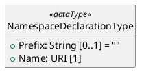
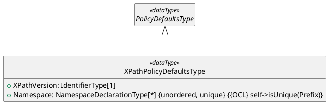
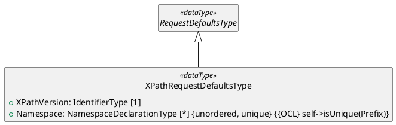
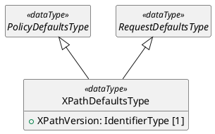
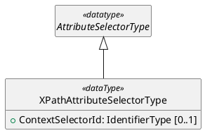
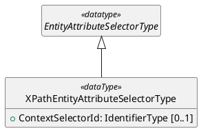
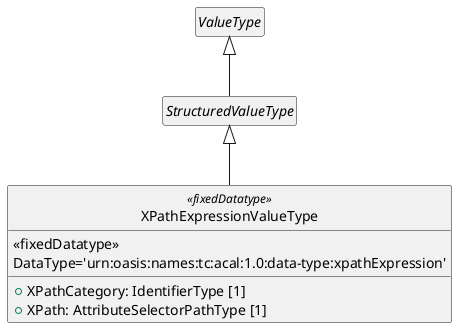




---


# ACAL v1.0 XPath Profile Version 1.0


## Committee Specification Draft 01


## 17 February 2026


### This version

<!-- TODO: update the links -->
- [ link to authoritative version of the published document ] (Authoritative)  
- [ links to one or more other versions of the published document (e.g., MD, PDF, Word, HTML, etc.) ] 


### Previous version


- [ link to authoritative version of the published document ] (Authoritative)  
- [ links to one or more other versions of the published document (e.g., MD, PDF, Word, HTML, etc.) ] 


### Latest version


- [ link to authoritative version of the published document ] (Authoritative)  
- [ links to one or more other versions of the published document (e.g., MD, PDF, Word, HTML, etc.) ] 


### Technical Committee

[OASIS eXtensible Access Control Markup Language (XACML) TC](https://groups.oasis-open.org/communities/tc-community-home2?CommunityKey=67afe552-0921-49b7-9a85-018dc7d3ef1d)


### Chairs


- Bill Parducci (bill@parducci.net), Individual


### Secretaries


- Bill Parducci (bill@parducci.net), Individual 


### Editors


- Steven Legg (steven.legg@viewds.com), [ViewDS Identity Solutions](https://www.viewds.com/)
- Cyril Dangerville (cyril.dangerville@thalesgroup.com), [THALES](https://www.thalesgroup.com/)


### Abstract


This specification is a profile of ACAL that provides ACAL extensions based on the XPath standard, such as XPath expression data-type, XPath-based functions and AttributeSelector. 


### Citation Format


When referencing this document, the following citation format should be used:


_ACAL v1.0 XPath Profile Version 1.0_.
Edited by Steven Legg and Cyril Dangerville. 17 February 2026. OASIS Committee Specification Draft 01.


### Related Work

This document is related to:

- _Attribute-Centric Authorization Language (ACAL) Version 1.0_.


## License, Document Status, and Notices


Copyright © OASIS Open 2026. All Rights Reserved.  For license and copyright information, and complete status, please see Annex A which contains the License, Document Status and Notices.

## How to generate HTML and PDF versions

### Online generation

HTML/PDF versions are generated automatically online via Github Actions after each update pushed to the main branch of [OASIS XACML TC Github repository](https://github.com/oasis-tcs/xacml-spec/). Go to  Github Actions on the github repository, then go to the latest workflow run, and, if the run succeeded, the summary should display the links to the generated HTML/PDF documents.

### Offline generation

#### Prerequisites

The following tools are required:

- [Pandoc](https://pandoc.org/);
- [Pandoc-include filter](https://github.com/DCsunset/pandoc-include).
- [PlantUML](https://plantuml.com/starting)

Either install them on your system or, if you have Docker installed already, simply use the following shell alias:

Install Pandoc, Graphviz and PlantUML on your system; or simply use Docker with the following shell alias:
```
$ alias pandoc='docker run --rm --volume "$(pwd):/data" cdang/pandoc-plantuml'
```
_The Dockerfile (named `Dockerfile`) of the docker image used in the alias above is provided in the [pandoc](pandoc) folder next to this markdown file for your convenience if you wish to build it yourself._  

OASIS staff are currently using pandoc 3.0 from https://github.com/jgm/pandoc/releases/tag/3.0.

Git clone or get a local copy of [OASIS XACML TC Github repository](https://github.com/oasis-tcs/xacml-spec/), open a terminal and **change your working directory to the root directory of your local copy of the repository**.

#### CSS stylesheet

The generation command uses a CSS stylesheet file (`-c` argument) provided by OASIS. It may be changed to one of these (or the local version in the `styles` folder) to get a different style of output:
- https://docs.oasis-open.org/templates/css/markdown-styles-v1.7.3.css
- https://docs.oasis-open.org/templates/css/markdown-styles-v1.7.3a.css (this one produces HTML that resembles the github display more closely, especially for blocks of code) This template already includes a reference (in HTML code) to this .css file.

#### HTML generation

Run the following command line to generate HTML from this markdown file (`acal-v1.0-xpath.md`) to an output file `/tmp/acal-v1.0-xpath.html`:

<!-- fenced_code_attributes pandoc extension is used for numberine lines in code blocks; fenced_code_attributes is not supported for 'gfm' format. Using 'markdown' instead. -->
```console
$ pandoc -f markdown+definition_lists+fenced_code_attributes -c styles/markdown-styles-v1.7.3a.css --standalone --filter pandoc-include --lua-filter pandoc/diagram.lua --defaults pandoc/defaults.yaml --embed-resources --metadata title="ACAL v1.0 XPath Profile Version 1.0" -t html -o /tmp/acal-v1.0-xpath.html acal-v1.0-xpath.md 
```

Note this command generates a Table of Contents (TOC) in HTML which is located at the top of the HTML document, and which requires additional editing in order to be published in the expected OASIS style. This editing will be handled by OASIS staff during publication.

#### PDF generation

For PDF output (file `/tmp/acal-v1.0-xpath.pdf`), the command line is the following (different `-t` and `-H` arguments):

<!-- fenced_code_attributes pandoc extension is used for numberine lines in code blocks; fenced_code_attributes is not supported for 'gfm' format. Using 'markdown' instead. -->
```console
$ pandoc -f markdown+definition_lists+fenced_code_attributes -c styles/markdown-styles-v1.7.3a.css -H custom_latex_header_for_pandoc_pdf_output.tex --standalone --filter pandoc-include --lua-filter pandoc/diagram.lua --defaults pandoc/defaults.yaml --embed-resources --metadata title="ACAL v1.0 XPath Profile Version 1.0" -t pdf -o /tmp/acal-v1.0-xpath.pdf acal-v1.0-xpath.md
```

---


## Table of Contents
<!-- ToC template from OASIS Open Specification Template Instructions:

- [1 Scope](#1-scope)
- [2 Definitions and Acronyms](#2-definitions-and-acronyms)
  - [2.1 Definitions](#2.1-definitions)
    - [2.1.1 Terms Defined Elsewhere](#2.1.1-terms-defined-elsewhere)
    - [2.1.2 Terms Defined in this Document](#2.1.2-terms-defined-in-this-document)
  - [2.2 Abbreviations and Acronyms](#2.2-abbreviations-and-acronyms)
- [3 Document Conventions](#3-document-conventions)
  - [3.1 Key Words](#3.1-key-words)
  - [3.2 Typographical Conventions](#3.2-typographical-conventions)
- [4 Introduction](#4-introduction)
  - [4.1 Any Additional Introduction Subsections That are Needed](#4.1-any-additional-introduction-subsections-that-are-needed)
  - [4.2 Changes From the Previous Version](#4.2-changes-from-the-previous-version)
- [5 Level 1 Section Header](#5-level-1-section-header)
  - [5.1 Level 2 Section Header](#5.1-level-2-section-header)
    - [5.1.1 Level 3 Section Header](#5.1.1-level-3-section-header)
      - [5.1.1.1 Level 4 Section Header](#5.1.1.1-level-4-section-header)
        - [5.1.1.1.1 Level 5 Section Header](#5.1.1.1.1-level-5-section-header)
          - [5.1.1.1.1.1 Level 6 Section Header](#5.1.1.1.1.1-level-6-section-header)
- [6 Additional Sections as Needed](#6-additional-sections-as-needed)
- [7 Safety, Security, and Data Protection Considerations](#7-safety,-security,-and-data-protection-considerations)
- [8 Conformance](#8-conformance)
- [Annex A License, Document Status and Notices](#annex-a-license,-document-status-and-notices)
  - [A.1 Document Status](#a.1-document-status)
  - [A.2 License and Notices](#a.2-license-and-notices)
- [Annex B References](#annex-b-references)
  - [B.1 Normative References](#b.1-normative-references)
  - [B.2 Informative References](#b.2-informative-references)
- [Annex C Additional Annex as Needed](#annex-c-additional-annex-as-needed)
  - [C.1 Subsection Title](#c.1-subsection-title)
  - [C.1.1 Sub-subsection](#c.1.1-sub-subsection)
- [Appendix 1 Acknowledgments](#appendix-1-acknowledgments
  - [Leadership](#leadership)
  - [Special Thanks](#special-thanks)
  - [Participants](#participants)
- [Appendix 2 Changes From Previous Version](#appendix-2-changes-from-previous-version)
  - [Revision History](#revision-history)
- [Appendix 3 Additional Appendix as Needed](#appendix-3-additional-appendix-as-needed)
  - [Subsection Title](#subsection-title)
- [Sub-subsection](#sub-subsection)
-->

<!-- Generated ToC -->
- [1 Scope](#scope)
- [2 Definitions and Acronyms](#definitions-and-acronyms)
  - [2.1 Definitions](#definitions)
    - [2.1.1 Terms Defined Elsewhere](#terms-defined-elsewhere)
    - [2.1.2 Terms Defined in this Document](#terms-defined-in-this-document)
    - [2.1.3 Related terms](#related-terms)
  - [2.2 Abbreviations and Acronyms](#abbreviations-and-acronyms)
- [3 Document Conventions](#document-conventions)
  - [3.1 Key Words](#key-words)
  - [3.2 Typographical Conventions](#typographical-conventions)
- [4 Introduction (non-normative)](#introduction-non-normative)
  - [4.1 Requirements](#requirements)
  - [4.2 Policies Based on Subject and Resource Attributes](#policies-based-on-subject-and-resource-attributes)
  - [4.3 Operators](#operators)
  - [4.4 Example](#example)
  - [4.5 Changes From the Previous Version](#changes-from-the-previous-version)
- [5 Structures](#structures)
  - [5.1 Content type restrictions](#contenttype-restrictions)
  - [5.2 NamespaceDeclarationType](#namespacedeclarationtype-optional)
  - [5.3 ACAL extension types](#acal-extension-types)
    - [5.3.1 Policy DefaultsType extension - XPathPolicyDefaultsType](#policydefaultstype-extension---xpathpolicydefaultstype)
    - [5.3.2 RequestDefaultsType extension - XPathRequestDefaultsType](#requestdefaultstype-extension---xpathrequestdefaultstype)
    - [5.3.3 AttributeSelectorType extension - XPathAttributeSelectorType](#attributeselectortype-extension---xpathattributeselectortype)
    - [5.3.4 EntityAttributeSelectorType extension -XPathEntityAttributeSelectorType](#entityattributeselectortype-extension---xpathentityattributeselectortype)
    - [5.3.5 DataType extension - XPathExpressionValueType](#datatype-extension---xpathexpressionvaluetype)
- [6 XPath Definitions](#xpath-definitions)
  - [Supported XPath versions](#supported-xpath-versions)
  - [XPath 2.0 Implementation-Defined Items](#xpath-20-implementation-defined-items)
  - [XPath 3.0 additional implementation-defined items](#xpath-30-additional-implementation-defined-items)
  - [XPath 3.1 additional implementation-defined items](#xpath-31-additional-implementation-defined-items)
- [7 Attribute Selector Evaluation](#attribute-selector-evaluation)
- [8 Safety, Security, and Data Protection Considerations](#safety-security-and-data-protection-considerations)
- [9 Conformance](#conformance)
  - [9.1 Introduction](#introduction)
  - [9.2 Conformance Tables](#conformance-tables)
    - [9.2.1 Object Types](#object-types)
    - [9.2.2 Data Types](#data-types)
    - [9.2.3 Functions](#functions)
- [Annex A License, Document Status and Notices](#annex-a-license-document-status-and-notices)
  - [A.1 Document Status](#a.1-document-status)
  - [A.2 License and Notices](#a.2-license-and-notices)
- [Annex B References](#annex-b-references)
  - [B.1 Normative References](#b.1-normative-references)
  - [B.2 Informative References](#b.2-informative-references)
- [Annex C Data Types and Functions](#annex-c-data-types-and-functions)
  - [C.1 Introduction](#c.1-introduction)
  - [C.2 Data Types](#c.2-data-types)
    - [C.2.1 XPath Expression](#c.2.1-xpath-expression)
  - [C.3 Functions](#c.3-functions)
    - [C.3.1 XPath-based Functions](#c.3.1-xpath-based-functions)
- [Annex D ACAL Identifiers](#annex-d-acal-identifiers)
  - [D.1 ACAL Namespaces](#d.1-acal-namespaces)
  - [D.2 Data Types](#d.2-data-types)
- [Appendix 1 Acknowledgments](#appendix-1-acknowledgments)
  - [Leadership](#leadership)
  - [Special Thanks](#special-thanks)
  - [Participants](#participants)
- [Appendix 2 Changes From Previous Version](#appendix-2-changes-from-previous-version)
  - [Revision History](#revision-history)

---


# 1 Scope

<!-- OASIS Open Specification Template Instructions: 

What is the purpose and scope of this document?   
Best practices: 

- Expect this text to be reused in multiple other places to explain the specification in summary form.  
- This is not the TC or OP scope (which is an IPR and rules boundary);  rather, this section is the summary intended purpose of this specification.  
- Short is better; four paragraphs or less is recommended.  
- If use of this spec is deliberately created to rely on or complement another standard, consider briefly mentioning that here as context.  
- To the extent that discussion of the larger context of the spec, or its history, or the circumstances that led to its creation or revision, are necessary, they belong in the Introduction, not here. 

-->

This ACAL profile defines an ACAL data-type for XPath expressions, ACAL functions based on XPath, concrete types of `AttributeSelector` and `EntityAttributeSelector` using XPath expressions to extract attributes from ACAL Request's `Content`, as well as default values for XPath evaluation, i.e. concrete types of `RequestDefaults` and `PolicyDefaults`.

Concrete representations (data formats) are to be provided as separate specifications and therefore out of scope of this document.

---


# 2 Definitions and Acronyms


## 2.1 Definitions


### 2.1.1 Terms Defined Elsewhere


This document uses the following terms defined elsewhere:

<!-- The following syntax (: definition) for definition lists requires the 'definition_lists' extension enabled in the pandoc command (-f gfm+definition_lists) to be rendered properly. -->
See Section 2 of [ACAL].

### 2.1.2 Terms Defined in this Document

None.

### 2.1.3 Related terms

None.


## 2.2 Abbreviations and Acronyms

None.

---


# 3 Document Conventions


## 3.1 Key Words


The key words "**MUST**", "**MUST NOT**", "**REQUIRED**", "**SHALL**", "**SHALL NOT**", "**SHOULD**", "**SHOULD NOT**", "**RECOMMENDED**", "**NOT RECOMMENDED**", "**MAY**", and "**OPTIONAL**" in this document are to be interpreted as described in BCP 14 [RFC2119] [RFC8174] when, and only when, they appear in all capitals, as shown here.


## 3.2 Typographical Conventions

<!-- From OASIS Open Specification Template Instructions: Describe any standards or typographical conventions that were followed when writing this document, such as fonts or highlighting that have special significance. If there are no typographical conventions than one is to put "None". -->
None.

---


# 4 Introduction (non-normative)


## 4.1 Requirements

XML is a common format to represent complex structured documents that may be supplied by the PEP as subject attribute or resource attribute's Content inside the Request to the PDP, typically a SAML token in the case of subject attribute, or any XML document as resource data. For such cases, supporting XPath expressions in ACAL is the standard way and therefore a must-have to extract the necessary values from the XML content for policy evaluation. For instance, a common rule of a privacy policy is that a person should be allowed to read records (in XML) for which he or she is the subject. The corresponding policy must contain a reference - XPath expression - to the subject identified in the information resource - XML record - itself.

## 4.2 Policies Based on Subject and Resource Attributes

Attribute selectors (`AttributeSelectorType` objects) defined by this profile use an XPath expression over the `ContentType` object of the subject (resp. resource) to identify a particular subject (resp. resource) attribute value by its location in the context (see Section 4.11 of [ACAL] for an explanation of context).

## 4.3 Operators

The ACAL method of representing XPath-based functions borrows from the XPath and XQuery Functions and Operators 3.1 specification [[XF](#xf)].

## 4.4 Example

This section contains an example XML document, an example request *context* and example ACAL *rules* illustrating the use of XPathAttributeSelectors and xpathExpression data-type defined in this Profile. The XML document is a medical record. Four separate *rules* are defined.

### 4.4.1 Example medical record instance

The following is an instance of a medical record to which the example ACAL *rules* can be applied.  The `<record>` schema is defined in the registered namespace administered by Medi Corp.

```xml {.numberLines}
!include examples/medical_record.xml
```

### 4.4.2 Example request context

The following example illustrates a request *context*, using XACML representation (XML representation of ACAL), to which the example *rules* may be applicable. It represents a request by the physician Julius Hibbert to read the patient date of birth in the record of Bartholomew Simpson.

```xml {.numberLines}
!include examples/Request.xml
```

Lines 21-34: Resource content. The XML resource instance, access to all or part of which may be requested, is placed here. The xpathExpression value(s) in the Request and in the Rules, as well as XPathAttributeSelectors in the Rules will apply to that content.

Lines 35-40: The identifier of the Resource instance for which access is requested, which is an XPath expression into the `<Content>` element that selects the data to be accessed.

Here is the equivalent example using JACAL representation (JSON representation of ACAL):

```json {.numberLines}
!include examples/Request.json
```


### 4.4.3 Example plain-language rules

The following plain-language rules are to be enforced:

- Rule 1: A person, identified by his or her patient number, may read any record for which he or she is the designated patient.

- Rule 2: A person may read any record for which he or she is the designated parent or guardian, and for which the patient is under 16 years of age.

- Rule 3: A physician may write to any medical element for which he or she is the designated primary care physician, provided an email is sent to the patient.

These rules may be written by different PAPs operating independently, or by a single PAP.

### 4.4.4 Example ACAL rule instances

#### 4.4.4.1 Rule 1

The following ACAL `<Rule>` instance expresses *Rule* 1:

```xml {.numberLines}
!include examples/Rule1.xml
```

Line 8: XPath expressions in the policy are to be interpreted according to the 2.0 version of the XPath specification.

Line 17: The `<XPathAttributeSelector>` element selects a bag of values from the resource content using a free-form XPath expression. In this case, it selects the value of the patient-number in the resource.  Note that the namespace prefixes in the XPath expression are resolved with the standard XML namespace declarations.

Lines 41-48: This Apply expression compares the results of two XPath expressions applied to the `<Content>` element of the resource category in the Request earlier. The second XPath expression is the location path to the requested XML element and the first XPath expression is the literal value `md:record`. The `xpath-node-match` function evaluates to `True` if the requested XML element is below the `md:record` element.

Here is the equivalent example in JACAL syntax (JSON representation of ACAL):

```json {.numberLines}
!include examples/Rule1.json
```

#### 4.4.4.2 Rule 2

The following ACAL `<Rule>` instance expresses *Rule* 2:

```xml {.numberLines}
!include examples/Rule2.xml
```

Line 18: The `<XPathAttributeSelector>` element selects the patient's date of birth by taking the XPath expression over the resource content.

Line 59: The second argument selects the value of the `<md:parentGuardianId>` element from the resource content using the `<XPathAttributeSelector>` element. This element contains a free-form XPath expression, pointing into the `<Content>` element of the resource category. Note that all namespace prefixes in the XPath expression are resolved with standard namespace declarations. The AttributeSelector evaluates to the bag of values of type `urn:oasis:names:tc:acal:1.0:data-type:string`.

Here is the equivalent example in JACAL syntax (JSON representation of ACAL):

```json {.numberLines}
!include examples/Rule2.json
```

#### 4.4.4.3 Rule 3

The following ACAL `<Rule>` instance expresses *Rule* 3:

```xml {.numberLines}
!include examples/Rule3.xml
```

Lines 28-35: The `<Apply>` element targets resources that match the XPath expression `md:record/md:medical`.

Lines 59-64: The first parameter of the obligation indicates where the PEP will find the email address in the resource. The PDP will evaluate the `<XPathAttributeSelector>` and return the result to the PEP inside the resulting obligation.

Here is the equivalent example in JACAL syntax (JSON representation of ACAL):

```json {.numberLines}
!include examples/Rule3.json
```

## 4.5 Changes From the Previous Version


<!-- From OASIS Open Specification Template Instructions: This section is **REQUIRED** and **MUST** be the last numbered subsection in this section. -->

None. This is the first version of this profile.

---

# 5 Structures

## 5.1 ContentType restrictions

This profile applies to a `Content` object (defined in [ACAL]) in the Request if and only if:
- The `MediaType` property is set to `application/xml`.
- The `Body` property value is a XML document.

## 5.2 NamespaceDeclarationType (optional)

A `NamespaceDeclarationType` object describes a single XML namespace declaration [NAMESPACES] that is usable in any XPath expression property specified in this profile, i.e. in `XPathAttributeSelectorType`, `XPathEntityAttributeSelectorType` objects, and `xpathExpression` values. This object type is not used in the XML representation of ACAL (XACML) which has native support for XML namespaces. However, it is useful in any non-XML representation of ACAL that does not support namespaces (e.g. JSON) in a standard native way.

UML definition (class diagram):


A `NamespaceDeclarationType` object contains the following properties:

`Prefix` [Optional, Default `""`]

: This property defines the namespace prefix. In the case of a namespace declaration for the default namespace, the value SHALL be omitted (default value is the empty string) or set to the empty string.

`Name` [Required]

: This property defines the namespace name (URI) itself to which the prefix is mapped. The `URI` datatype is defined in [ACAL].

## 5.3 ACAL extension types

The structures in this section are extensions to [ACAL] model and described here in abstract terms. The concrete representations of these structures are defined for a variety of syntaxes each in a separate profile.

The types `IdentifierType`, `ValueType`, `SimpleValueType`, `PolicyDefaultsType` and `RequestDefaultsType`, `AttributeSelectorType` and `EntityAttributeSelectorType` used in the next UML models are defined in [ACAL].

### 5.3.1 PolicyDefaultsType extension - XPathPolicyDefaultsType

A `XPathPolicyDefaultsType` object extends `PolicyDefaultsType` from [ACAL] to specify default XPath settings that apply to the evaluation of `XPathAttributeSelectorType` and `XPathEntityAttributeSelectorType` objects, `xpathExpression` values and XPath-based functions in the enclosing `PolicyType` object.

UML definition (class diagram):


A `XPathDefaultsType` object contains the following properties:

`XPathVersion` [Required]

: An `IdentifierType` value specifying the XPath version for XPath expressions occurring in the policy. XPath expressions are used by attribute selectors and as arguments to XPath-based functions. See the Supported XPath versions in [XPath Definitions] section.

`Namespace` [Any number]

: Optional collection of XML namespace declaration(s) (zero or more) that SHALL contain a `NamespaceDeclarationType` object for each of the namespace prefixes used in the XPath expression(s) ocurring in the Policy. There SHALL NOT be more than one `NamespaceDeclarationType` object for the same namespace prefix (`Prefix` property). In other words, each `Prefix` SHALL be unique.


### 5.3.2 RequestDefaultsType extension - XPathRequestDefaultsType

A `XPathRequestDefaultsType` object extends `RequestDefaultsType` from [ACAL] to specify default XPath settings that apply to the evaluation of `XPathAttributeSelectorType` and `XPathEntityAttributeSelectorType` objects, `xpathExpression` values and XPath-based functions in the enclosing `RequestType` object.

UML definition (class diagram):


Same property(ies) as `XPathPolicyDefaultsType` in the previous section.

<!--
The alternative based on multiple-inheritance, i.e. `XPathDefaultsType` extending both `PolicyDefaultsType` and `RequestDefaultsType` at the same time, might be useful in the future as JSON schema and XSD 1.1 have a way of supporting this feature (XSD 1.1 can have multivalued substitutionGroups). So this text is kept as backup for future use. 

### 5.3.2 Multiple-inheritance alternative - XPathDefaultsType

A `XPathDefaultsType` object extends `PolicyDefaultsType` and `RequestDefaultsType` from [ACAL] to specify default XPath settings that apply to the evaluation of `XPathAttributeSelectorType` and `XPathEntityAttributeSelectorType` objects, `xpathExpression` values and XPath-based functions in the enclosing `PolicyType` or `RequestType` object.

UML definition (class diagram):


Concrete data representation formats which do not support multiple inheritance cannot use this model as is, in which case they should use the alternative model presented in the next section.

A `XPathDefaultsType` object contains the following property:

`XPathVersion` [Required]

: An `IdentifierType` value specifying the XPath version for XPath expressions occurring in the policy. XPath expressions are used by attribute selectors and as arguments to XPath-based functions. See the section 6 for the supported `XPathVersion` values.
-->

### 5.3.3 AttributeSelectorType extension - XPathAttributeSelectorType

An `XPatAttributeSelectorType` object is a concrete type of `AttributeSelectorType` from [ACAL] that uses [XPath] for `Path` expressions and expect an XML document in the `Body` property of the `Content` object of the `RequestEntityType` object matching the `Category` property. More precisely, the returned values shall be constructed from the node(s) selected by applying the XPath expression given by the attribute selector's `Path` property to the XML document in the `Body` property of the `Content` object of the `RequestEntityType` object matching the attribute selector's `Category` property. 

See the section 9 for details of attribute selector evaluation.

UML definition (class diagram):


The `XPathAttributeSelectorType` object type extends the `AttributeSelectorType` object type with the following property:

`ContextSelectorId` [Optional]

: An `IdentifierType` value specifying an ACAL attribute (by its `AttributeId`) in the attribute category (`RequestEntityType` object with `Category` matching this attribute selector's `Category`) containing the XML content. The referenced attribute MUST have a single value of data type `urn:oasis:names:tc:acal:1.0:data-type:xpathExpression` (see Annex C) and the XPath expression represented by that value must select a single node in the XML content. The `XPathCategory` property of the referenced ACAL attribute value SHALL be ignored.

More importantly, in the context of this profile, the value of the `Path` property inherited from supertype `AttributeSelectorType` SHALL be an XPath expression [XPath]. In addition, this XPath expression may reference one or more XPath variables, in which case each XPath variable's value(s) is taken(s) from the corresponding so-called *ACAL variable*, i.e. the variable defined by a `<VariableDefinition>` with a `VariableId` matching the XPath variable name, in the scope of this element. Only XPath variables of primitive atomic type or array of primitive atomic type are allowed in this XPath expression; in the first case (respectively the second case), the corresponding ACAL variable must return a single value (respectively a bag) of a primitive datatype that is convertible to that XPath atomic type. How to do this conversion is described in section 8.4.7 of [ACAL].

For example, in the following `XPathAttributeSelectorType` object in XML representation format:

   ```xml
   <XPathAttributeSelector 
    Path="if ($classif_name = 'SECRET') then 3 else if ($classif_name = 'CONFIDENTIAL') then 2 else if ($classif_name = 'RESTRICTED ') then 1 else 0" 
    Category="urn:oasis:names:tc:acal:1.0:attribute-category:resource" 
    DataType="urn:oasis:names:tc:acal:1.0:data-type:integer" 
    MustBePresent="true" />
   ```
   The XPath expression references the XPath variable `classif_name`, which requires a `<VariableDefinition VariableId="classif_name">some_expression</VariableDefinition>` to be defined in the enclosing `Policy`, where `some_expression` is any Expression of returning a value of type `urn:oasis:names:tc:acal:1.0:data-type:string`.

If no such variable is found (in the current scope) or the datatype is incompatible (ACAL-to-XPath type conversion is not possible), the XPath expression and therefore this `Path` attribute must be considered invalid and a syntax error returned (status code `urn:oasis:names:tc:acal:1.0:status:syntax-error`). See [Section 7](#attribute-selector-evaluation) for more details. 


**The namespace context for the value of the Path attribute is given by the [in-scope namespaces] [[INFOSET](#infoset)] of the `<XPathAttributeSelector>` element.**


### 5.3.4 EntityAttributeSelectorType extension - XPathEntityAttributeSelectorType

An `XPathEntityAttributeSelectorType` object is a concrete type of `EntityAttributeSelectorType` [ACAL] that uses [XPath] for `Path` expressions and expects XML content in the value returned by the attribute selector's `Expression` property. In other words, the values shall be constructed from the node(s) selected by applying the XPath expression given by the entity attribute selector's `Path` property to the XML document in the `Body` property of the `Content` property in either an attribute category in the request context (`RequestEntity`) or the value of the `urn:oasis:names:tc:acal:1.0:data-type:entity` data type returned by its `Expression` evaluation. 

See the Section 9 for details of entity attribute selector evaluation.

UML definition (class diagram):


The `XPathEntityAttributeSelectorType` object type extends the `EntityAttributeSelectorType` object type with the same `ContextSelectorId` property as `XPathAttributeSelectorType`. 
The `Path` property is also defined the same as in `XPathAttributeSelectorType`.

## 5.3.5 DataType extension - XPathExpressionValueType

The `urn:oasis:names:tc:acal:1.0:data-type:xpathExpression` values (Annex C) can be modeled as a subtype of `SimpleValueType` [ACAL] called `XPathExpressionValueType`.

UML model (class diagram):


A `XPathExpressionValueType` object has the following properties:

`Value` [Required]

: The XPath expression (the `AttributeSelectorPathType` is defined in [ACAL])

`XPathCategory` [Required]

: The `Category` of the `RequestEntityType` object containing the XML `Content` to which the XPath expression applies.

---


# 6 XPath Definitions

## Supported XPath versions

The `XPathVersion` property in a `XPathDefaultsType`, `XPathPolicyDefaultsType` or `XPathRequestDefaultsType` object contains an `IdentifierType` value that specifies the XPath version that applies for a policy or request, respectively.

To specify XPath 2.0 the `IdentifierType` value MUST evaluate to `https://www.w3.org/TR/xpath20/`.

To specify XPath 3.0, the `IdentifierType` value MUST evaluate to `http://www.w3.org/TR/xpath-30/`. 

To specify XPath 3.1, the `IdentifierType` value MUST evaluate to `http://www.w3.org/TR/xpath-31/`.

XPath 1.0 , and therefore the XPath 1.0 identifier `https://www.w3.org/TR/1999/REC-xpath-19991116/`, is deprecated.

The XPath specification leaves a number of aspects of behavior implementation-defined. The following sections defines how XPath 2.0 and later versions SHALL behave in an ACAL implementation.

## XPath 2.0 Implementation-Defined Items

[XPath 2.0 - Appendix D](https://www.w3.org/TR/xpath20/#id-impl-defined-items) defines the following items:

1. The version of Unicode that is used to construct expressions.

    : ACAL leaves this implementation defined. It is RECOMMENDED that the latest version is used.

2. The statically-known collations.

    : ACAL leaves this implementation defined.

3. The implicit timezone.

    : ACAL defines the implicit time zone as UTC.

4. The circumstances in which warnings are raised, and the ways in which warnings are handled.

    : ACAL leaves this implementation defined.

5. The method by which errors are reported to the external processing environment.

    : An XPath error in the evaluation of an attribute selector causes the result to be `Indeterminate`. The status code SHALL be `urn:oasis:names:tc:acal:1.0:status:processing-error`. Implementations MAY provide additional details about the error in the response or by some other means.

6. Whether the implementation is based on the rules of XML 1.0 or 1.1.

    : ACAL is based on XML 1.0.

7. Whether the implementation supports the namespace axis.

    : ACAL leaves this implementation defined. It is RECOMMENDED that users of ACAL do not make use of the namespace axis.

8. Any static typing extensions supported by the implementation, if the Static Typing Feature is supported.

    : ACAL leaves this implementation defined.

[XPath 2.0 Data Model - Appendix F](https://www.w3.org/TR/2007/REC-xpath-datamodel-20070123/#implementation-defined) defines the following items:

1. Support for additional user-defined or implementation-defined types is implementation-defined.

    : It is RECOMMENDED that implementations of ACAL do not define any additional types and it is RECOMMENDED that users of ACAL do not make use of any additional types.

2. Some typed values in the data model are undefined. Attempting to access an undefined property is always an error. Behavior in these cases is implementation-defined and the host language is responsible for determining the result.

    : An XPath error in the evaluation of an attribute selector causes the result to be `Indeterminate`. The status code SHALL be `urn:oasis:names:tc:acal:1.0:status:processing-error`. Implementations MAY provide additional details about the error in the response or by some other means.

[XPath Functions](https://www.w3.org/TR/xpath-functions/#impl-def) defines the following items:

1. The destination of the trace output is implementation-defined.

    : ACAL leaves this implementation defined.

2. For `xs:integer` operations, implementations that support limited-precision integer operations must either raise an error [err:FOAR0002] or provide an implementation-defined mechanism that allows users to choose between raising an error and returning a result that is modulo the largest representable integer value.

    : ACAL leaves this implementation defined. If an implementation chooses to raise an error, the status code SHALL be `urn:oasis:names:tc:acal:1.0:status:processing-error`. Implementations MAY provide additional details about the error in the response or by some other means.

3. For `xs:decimal` values the number of digits of precision returned by the numeric operators is implementation-defined.

    : ACAL leaves this implementation defined.

4. If the number of digits in the result of a numeric operation exceeds the number of digits that the implementation supports, the result is truncated or rounded in an implementation-defined manner.

    : ACAL leaves this implementation defined.

5. It is implementation-defined which version of Unicode is supported.

    : ACAL leaves this implementation defined. It is RECOMMENDED that the latest version is used.

6. For `fn:normalize-unicode`, conforming implementations must support normalization form "NFC" and may support normalization forms "NFD", "NFKC", "NFKD", "FULLY-NORMALIZED". They may also support other normalization forms with implementation-defined semantics.

    : ACAL leaves this implementation defined.

7. The ability to decompose strings into collation units suitable for substring matching is an implementation-defined property of a collation.

    : ACAL leaves this implementation defined.

8. All minimally conforming processors must support year values with a minimum of 4 digits (i.e., YYYY) and a minimum fractional second precision of 1 millisecond or three digits (i.e., s.sss). However, conforming processors may set larger implementation-defined limits on the maximum number of digits they support in these two situations.

    : ACAL leaves this implementation defined, and it is RECOMMENDED that users of ACAL do not expect greater limits and precision.

9. The result of casting a string to `xs:decimal`, when the resulting value is not too large or too small but nevertheless has too many decimal digits to be accurately represented, is implementation-defined.

    : ACAL leaves this implementation defined.

10. Various aspects of the processing provided by `fn:doc` are implementation-defined. Implementations may provide external configuration options that allow any aspect of the processing to be controlled by the user.

    : ACAL leaves this implementation defined.

11. The manner in which implementations provide options to weaken the stable characteristic of `fn:collection` and `fn:doc` are implementation-defined.

    : ACAL leaves this implementation defined.

## XPath 3.0 additional implementation-defined items

[XPath 3.0](https://www.w3.org/TR/xpath-30/#id-impl-defined-items) Appendix D defines the following additional items to XPath 2.0 items:

1. How XDM instances are created from sources other than an Infoset or PSVI.

   : ACAL implementations should not have to create XDM instances from sources other than an Infoset or PSVI.

1. The signatures of functions provided by the implementation or via an implementation-defined API. 

   : It is RECOMMENDED that implementations of ACAL do not define any additional XPath functions and it is RECOMMENDED that users of ACAL do not make use of any additional XPath functions.

1. Any environment variables provided by the implementation.

   : It is RECOMMENDED that users of ACAL use ACAL-defined VariableDefinitions (based on AttributeDesignator and appropriate PIP to obtain the values) in order to capture environment variables, then use the ACAL-defined Variables as XPath variables in XPath expressions, as specified by ACAL. If this is hardly feasible, as an alternative, ACAL users may use implementation-defined environment variables in their XPath expressions only if they are standard, e.g. POSIX environment variables. 

[XQuery and XPath Data Model (XDM) 3.0](https://www.w3.org/TR/xpath-datamodel-30/#implementation-defined) - Appendix F.1 defines the following additional item(s):

1. When converting from an xs:string to an xs:float or xs:double, it is implementation-defined whether the lexical value `-0` (and similar forms such as `-0.0`) convert to negative zero or to positive zero in the value space.

   : ACAL leaves this implementation-defined.

[XQuery and XPath Functions and Operators 3.0](https://www.w3.org/TR/xpath-functions-30/#impl-def) (Appendix D) defines the following additional items:

1. Item #39: implementations SHALL apply schema validation to ACAL documents instead of DTD validation.
2. Item #44: implementations SHALL invoke schema validation instead of DTD validation, and use an XML 1.0 parser.
3. Item #45: implementations SHALL use an XML 1.0 parser.
4. Item #50: implementations SHALL support (at least) version [2025b](https://lists.iana.org/hyperkitty/list/tz-announce@iana.org/thread/6JVHNHLB6I2WAYTQ75L6KEPEQHFXAJK3/) of the *tz* timezone database. <!-- 2025b is the latest version supported by JAVA as of writing: https://www.oracle.com/java/technologies/tzdata-versions.html -->
1. ACAL leaves other features of Appendix D implementation-defined, unless otherwise specified by the previous section (XPath 2.0 implementation-defined items).

## XPath 3.1 additional implementation-defined items

For addressing Implementation-Defined Items sections of [XPath 3.1 standard, Appendix D](https://www.w3.org/TR/xpath-31/#id-impl-defined-items) and [XQuery and XPath Data Model 3.1](https://www.w3.org/TR/xpath-datamodel-31/#implementation-defined), refer to the previous sections for XPath 2.0 and 3.0.

[XQuery and XPath Functions and Operators 3.1](https://www.w3.org/TR/xpath-functions-31/#impl-def) (Appendix E) defines the following additional item(s):

1. Item #45: schema validation SHALL be applied to the source document.
2. Items #52, #53: schema validation SHALL be invoked and an XML 1.0 parser SHALL be used.
3. Item #66: implementations SHALL support (at least) version [2025b](https://lists.iana.org/hyperkitty/list/tz-announce@iana.org/thread/6JVHNHLB6I2WAYTQ75L6KEPEQHFXAJK3/) of the *tz* timezone database. <!-- 2025b is the latest version supported by JAVA as of writing: https://www.oracle.com/java/technologies/tzdata-versions.html -->
1. ACAL leaves other features of Appendix E implementation-defined, unless otherwise specified by the previous section (XPath 2.0 and 3.0 implementation-defined items).

---


# 7 Attribute Selector Evaluation


An `XPathAttributeSelectorType` or `XPathEntityAttributeSelector` object SHALL be evaluated according to the following processing model.

: Note: It is not necessary for an implementation to exactly follow this model. It is only necessary to produce results identical to those that would be produced by following this model.

The first steps are already described in [ACAL] section 8.4.7 (Attribute selector evaluation) and provided here as a reminder:

- If the attribute category given by the `Category` property is not found or does not have a `Content` property, then the return value is either `Indeterminate` or an empty bag as determined by the `MustBePresent` property.

- If the `Expression` property of an `XPathEntityAttributeSelector` object evaluates to a value of the `urn:oasis:names:tc:acal:1.0:data-type:entity` data type and that value does not have a `Content` property, then the return value is either `Indeterminate` or an empty bag as determined by the `MustBePresent` property.

- If the `Expression` property of an `XPathEntityAttributeSelector` object evaluates to a value of the `urn:oasis:names:tc:acal:1.0:data-type:anyURI` data type and an attribute category with that value as its `Category` is not found or does not have a `Content` property, then the return value is either `Indeterminate` or an empty bag as determined by the `MustBePresent` property.

If the designated attribute category or entity value has a `Content` property, then follow the steps below:

1. Construct an XML data structure suitable for XPath processing from the value of the `Body` property of the `Content` object. The data structure shall be constructed so that the document node of this structure contains a single document element which corresponds to the single child element of the `Body` property. The constructed data structure shall be equivalent to one that would result from parsing a stand-alone XML document consisting of the contents of the `Body` property (including any comment and processing-instruction markup). **In a XML representation, namespace declarations from the `<Body>` element and its ancestor elements for namespace prefixes that are "visibly utilized", as defined by [[exc-c14n](#exc-c14n)], within the contents MUST be present.** Namespace declarations from the single child element or its ancestor elements for namespace prefixes that are not "visibly utilized" MAY be present. The data structure must meet the requirements of the applicable XPath version.

2. If there is a `ContextSelectorId` property, the context node shall be the node selected by applying the XPath expression given in the attribute value of the designated ACAL attribute. It shall be an error if this evaluation returns no node or more than one node, in which case the return value MUST be `Indeterminate` with status code `urn:oasis:names:tc:acal:1.0:status:syntax-error`. If there is no `ContextSelectorId` property, then the document node of the data structure shall be the context node.

3. Evaluate the XPath expression given in the `Path` property against the context node selected in the previous step, according to the [XPath] standard in the version indicated in the `PolicyDefaults` property for this profile. This XPath expression may reference one or more XPath variables, in which case each XPath variable's value(s) is taken(s) from the corresponding so-called *ACAL variable*, i.e. the variable defined by a `<VariableDefinition>` with a `VariableId` matching the XPath variable name, in the scope of this element. Only XPath variables of primitive atomic type or array of primitive atomic type are allowed in this XPath expression; in the first case (respectively the second case), the corresponding ACAL variable must return a single value (respectively a bag) of a primitive datatype that is convertible to that XPath atomic type. How to do this conversion is the same as in step 4 below. If no such variable is found (in the current scope) or the datatype is incompatible (ACAL-to-XPath type conversion is not possible), the XPath expression and therefore this `Path` attribute must be considered invalid and a syntax error returned (status code `urn:oasis:names:tc:acal:1.0:status:syntax-error`).

4. The result of step 3 is converted to ACAL value(s) according to the same rules as in the last step of [ACAL] section 8.4.7 (Attribute Selector evaluation).

---


# 8 Safety, Security, and Data Protection Considerations


<!-- From OASIS Open Specification Template Instructions:

This section is **REQUIRED** and **MUST** be the second to last numbered section in the document, right before Conformance. This section contains information about safety, security, data protection, and privacy considerations. These can be divided up into separate subsections as desired. All documents **SHOULD** have at least a security and data protection considerations section, and otherwise **MUST** have a blank section indicating `None.` Any other considerations **MAY** also be added.


Please note that any specification that will need to register something with IANA or has plans to go on to ITU/ISO/IEC **MUST** have this section filled out. For an example please see the following section in the CACAO specification here [https://docs.oasis-open.org/cacao/security-playbooks/v2.0/cs01/security-playbooks-v2.0-cs01.html\#\_Toc152256574](https://docs.oasis-open.org/cacao/security-playbooks/v2.0/cs01/security-playbooks-v2.0-cs01.html#_Toc152256574) 

-->

Refer to [ACAL] section 11.

---


# 9 Conformance


<!-- From OASIS Open Specification Template Instructions: 


This section is **REQUIRED** and **MUST** be the last numbered section in the document. 


-->

## 9.1 Introduction

The specification addresses the following aspect of conformance:

The specification defines a number of functions, etc. that have somewhat special applications, therefore they are not required to be implemented in an implementation that claims to conform with to this specification.

## 9.2 Conformance Tables

This section lists those portions of the specification that MUST be included in an implementation of a PDP that claims to conform to this profile.

: Note: "M" means mandatory-to-implement. "O" means optional.

The implementation MUST follow [Section 5](#structures), [Section 6](#xpath-definitions), [Section 7](#attribute-selector-evaluation), [Annex C](#annex-c-data-types-and-functions), [Annex D](#annex-d-acal-identifiers) where they apply to implemented items in the following tables.

Many of these items are associated with versions of XACML preceding ACAL but have been assigned new identifiers with the `urn:oasis:names:tc:acal:1.0:` prefix. The older XACML identifiers have been listed in the tables as deprecated identifiers. Implementations MUST support a new identifier defined in this specification but MAY recognize the corresponding deprecated identifier as equivalent. It is RECOMMENDED that these deprecated identifiers not be used in new policies and requests; they are planned to be removed in a subsequent version of ACAL. Note that some items appear to be carried over from a preceding version of XACML but do not list the XACML identifier. This is because ACAL has redefined the item in some way that means it is no longer identical to the original definition in XACML, and so the identifiers can no longer be considered equivalent. Items new to ACAL 1.0 will also not list an XACML identifier.

### 9.2.1 Object Types

The implementation MUST support the object types that are marked `M`.

| Object Type | M/O |
| :--- | :--- |
| XPathAttributeSelectorType | M |
| XPathEntityAttributeSelectorType | O |
| XPathExpressionValueType | O |
| XPathPolicyDefaultsType or XPathDefaultsType | M |
| XPathRequestDefaultsType or XPathDefaultsType | M |

### 9.2.2 Data Types

The implementation MUST support the data types associated with the following identifiers marked `M`.

| Identifier | M/O | Deprecated Identifier |
| :--- | :--- | :--- |
| urn:oasis:names:tc:acal:1.0:data-type:xpathExpression | O | urn:oasis:names:tc:xacml:3.0:data-type:xpathExpression |

### 9.2.3 Functions

The implementation MUST properly process those functions associated with the identifiers marked with an `M`.

| Function | M/O | Deprecated Identifier |
| :--- | :--- | :--- |
| urn:oasis:names:tc:acal:1.0:function:xpath-node-count | O | urn:oasis:names:tc:xacml:3.0:function:xpath-node-count |
| urn:oasis:names:tc:acal:1.0:function:xpath-node-equal | O | urn:oasis:names:tc:xacml:3.0:function:xpath-node-equal |
| urn:oasis:names:tc:acal:1.0:function:xpath-node-match | O | urn:oasis:names:tc:xacml:3.0:function:xpath-node-match |

---


# Annex A License, Document Status and Notices


(This annex forms an integral part of this Specification.)


## A.1 Document Status


This document was last revised or approved by the OASIS eXtensible Access Control Markup Language (XACML) TC on the above date. The level of approval is also listed above. Check the "Latest version" location noted above for possible later revisions of this document. Any other numbered Versions and other technical work produced by the Technical Committee (TC) are listed at https://groups.oasis-open.org/communities/tc-community-home2?CommunityKey=67afe552-0921-49b7-9a85-018dc7d3ef1d#technical.


TC members should send comments on this document to the TC's email list. Others should send comments to the TC's public comment list, after subscribing to it by following the instructions at the "Send A Comment" button on the TC's web page at https://www.oasis-open.org/committees/xacml/.


NOTE: any machine-readable content (Computer Language Definitions) declared Normative for this Work Product is provided in separate plain text files. In the event of a discrepancy between any such plain text file and display content in the Work Product's prose narrative document(s), the content in the separate plain text file prevails.


## A.2 License and Notices


Copyright © OASIS Open 2026. All Rights Reserved.


All capitalized terms in the following text have the meanings assigned to them in the OASIS Intellectual Property Rights Policy (the "OASIS IPR Policy"). The full Policy, which governs the licensure of this document, may be found at the OASIS website: [[https://www.oasis-open.org/policies-guidelines/ipr/](https://www.oasis-open.org/policies-guidelines/ipr/)]


This document and translations of it may be copied and furnished to others, and derivative works that comment on or otherwise explain it or assist in its implementation may be prepared, copied, published, and distributed, in whole or in part, without restriction of any kind, provided that the above copyright notice and this section are included on all such copies and derivative works. However, this document itself may not be modified in any way, including by removing the copyright notice or references to OASIS, except as needed for the purpose of developing any document or deliverable produced by an OASIS Technical Committee (in which case the rules applicable to copyrights, as set forth in the OASIS IPR Policy, must be followed) or as required to translate it into languages other than English.


The limited permissions granted above are perpetual and will not be revoked by OASIS or its successors or assigns, as provided in the OASIS IPR Policy.


This document is provided under the [RF on Limited Terms](https://www.oasis-open.org/policies-guidelines/ipr/#RF-on-Limited-Mode) IPR mode that was chosen when the project was established, as defined in the IPR Policy. For information on whether any patents have been disclosed that may be essential to implementing this document, and any offers of patent licensing terms, please refer to the Intellectual Property Rights section of the project's web page ([https://www.oasis-open.org/committees/xacml/ipr.php](https://www.oasis-open.org/committees/xacml/ipr.php)).


This document and the information contained herein is provided on an "AS IS" basis and OASIS DISCLAIMS ALL WARRANTIES, EXPRESS OR IMPLIED, INCLUDING BUT NOT LIMITED TO ANY WARRANTY THAT THE USE OF THE INFORMATION HEREIN WILL NOT INFRINGE ANY OWNERSHIP RIGHTS OR ANY IMPLIED WARRANTIES OF MERCHANTABILITY OR FITNESS FOR A PARTICULAR PURPOSE. OASIS AND ITS MEMBERS WILL NOT BE LIABLE FOR ANY DIRECT, INDIRECT, SPECIAL OR CONSEQUENTIAL DAMAGES ARISING OUT OF ANY USE OF THIS DOCUMENT OR ANY PART THEREOF.


As stated in the OASIS IPR Policy, the following three paragraphs in brackets apply to OASIS Standards Final Deliverable documents (Committee Specifications, OASIS Standards, or Approved Errata).


OASIS requests that any OASIS Party or any other party that believes it has patent claims that would necessarily be infringed by implementations of this OASIS Standards Final Deliverable, to notify OASIS TC Administrator and provide an indication of its willingness to grant patent licenses to such patent claims in a manner consistent with the IPR Mode of the OASIS Technical Committee that produced this deliverable.


OASIS invites any party to contact the OASIS TC Administrator if it is aware of a claim of ownership of any patent claims that would necessarily be infringed by implementations of this OASIS Standards Final Deliverable by a patent holder that is not willing to provide a license to such patent claims in a manner consistent with the IPR Mode of the OASIS Technical Committee that produced this OASIS Standards Final Deliverable. OASIS may include such claims on its website, but disclaims any obligation to do so.


OASIS takes no position regarding the validity or scope of any intellectual property or other rights that might be claimed to pertain to the implementation or use of the technology described in this OASIS Standards Final Deliverable or the extent to which any license under such rights might or might not be available; neither does it represent that it has made any effort to identify any such rights. Information on OASIS' procedures with respect to rights in any document or deliverable produced by an OASIS Technical Committee can be found on the OASIS website. Copies of claims of rights made available for publication and any assurances of licenses to be made available, or the result of an attempt made to obtain a general license or permission for the use of such proprietary rights by implementers or users of this OASIS Standards Final Deliverable, can be obtained from the OASIS TC Administrator. OASIS makes no representation that any information or list of intellectual property rights will at any time be complete, or that any claims in such list are, in fact, Essential Claims.


The name "OASIS" is a trademark of OASIS, the owner and developer of this document, and should be used only to refer to the organization and its official outputs. OASIS welcomes reference to, and implementation and use of, its documents, while reserving the right to enforce its marks against misleading uses. Please see [https://www.oasis-open.org/policies-guidelines/trademark/](https://www.oasis-open.org/policies-guidelines/trademark/) for guidance.


---


# Annex B References


(This annex forms an integral part of this Specification.)


This section contains the normative and informative references that are used in this document. 


Normative references are specific (identified by date of publication and/or edition number or version number) and Informative references are either specific or non-specific. For specific references, only the cited version applies. For non-specific references, the latest version of the reference document (including any amendments) applies. While any hyperlinks included in this section were valid at the time of publication, OASIS cannot guarantee their long term validity.


## B.1 Normative References


The following documents are referenced in such a way that some or all of their content constitutes requirements of this document.

######  [ACAL]

Attribute-Centric Authorization Language (ACAL) Version 1.0. Edited by Steven Legg and Cyril Dangerville. 17 February 2026. OASIS Committee Specification Draft 01.


###### [CMF]

Martin J. Dürst et al, eds., Character Model for the World Wide Web 1.0: Fundamentals, W3C Recommendation 15 February 2005, https://www.w3.org/TR/2005/REC-charmod-20050215/

###### [DS]

D. Eastlake et al., XML-Signature Syntax and Processing, https://www.w3.org/TR/xmldsig-core/, World Wide Web Consortium.

###### [exc-c14n]

J. Boyer et al, eds., Exclusive XML Canonicalization, Version 1.0, W3C Recommendation 18 July 2002, https://www.w3.org/TR/2002/REC-xml-exc-c14n-20020718/

###### [Hancock]

Hancock, Polymorphic Type Checking, in Simon L. Peyton Jones, Implementation of Functional Programming Languages, Section 8, Prentice-Hall International, 1987.

###### [Hier]

XACML v3.0 Hierarchical Resource Profile Version 1.0. 11 March 2010. Committee Specification Draft 03. https://docs.oasis-open.org/xacml/3.0/xacml-3.0-hierarchical-v1-spec-cd-03-en.html

###### [IEEE754]

IEEE Standard for Binary Floating-Point Arithmetic 1985, ISBN 1-5593-7653-8, IEEE Product No. SH10116-TBR.

###### [INFOSET]

XML Information Set (Second Edition), W3C Recommendation, 4 February 2004, https://www.w3.org/TR/xml-infoset/

###### [ISO10181-3]

ISO/IEC 10181-3:1996 Information technology – Open Systems Interconnection -- Security frameworks for open systems: Access control framework.

###### [Kudo00]

Kudo M and Hada S, XML document security based on provisional authorization, Proceedings of the Seventh ACM Conference on Computer and Communications Security, Nov 2000, Athens, Greece, pp 87-96.

###### [LDAP-1]

RFC 2256, A summary of the X500(96) User Schema for use with LDAPv3, Section 5, M Wahl, December 1997, https://www.ietf.org/rfc/rfc2256.txt

###### [LDAP-2]

RFC 2798, Definition of the inetOrgPerson, M. Smith, April 2000, https://www.ietf.org/rfc/rfc2798.txt

###### [MathML]

Mathematical Markup Language (MathML), Version 2.0, W3C Recommendation, 21 October 2003, https://www.w3.org/TR/2003/REC-MathML2-20031021/

###### [Multi]

OASIS Committee Draft 03, XACML v3.0 Multiple Decision Profile Version 1.0, 11 March 2010, https://docs.oasis-open.org/xacml/3.0/xacml-3.0-multiple-v1-spec-cd-03-en.doc

###### [NAMESPACES]

Bray, Tim, et.al. eds, Namespaces in XML 1.0 (Third Edition), W3C Recommendation 8 December 2009, available at http://www.w3.org/TR/2009/REC-xml-names-20091208/


###### [Perritt93]

Perritt, H. Knowbots, Permissions Headers and Contract Law, Conference on Technological Strategies for Protecting Intellectual Property in the Networked Multimedia Environment, April 1993. Available at: https://www.cni.org/resources/historical-resources/technological-strategies-for-protecting-intellectual-property-in-the-networked-multimedia-environment/permission-headers-and-contract-law

###### [RBAC]

David Ferraiolo and Richard Kuhn, Role-Based Access Controls, 15th National Computer Security Conference, 1992.

###### [RFC2119]

RFC 2119, *Key Words for Use in RFCs to Indicate Requirement Levels*, BCP 14, RFC 2119, March 1997. [Online]. Available: https://www.rfc-editor.org/info/rfc2119

###### [RFC2396]

Berners-Lee T, Fielding R, Masinter L, Uniform Resource Identifiers (URI): Generic Syntax, https://www.ietf.org/rfc/rfc2396.txt

###### [RFC2732]

RFC 2732, Hinden R, Carpenter B, Masinter L, Format for Literal IPv6 Addresses in URL's,  https://www.ietf.org/rfc/rfc2732.txt

###### [RFC3198]

IETF RFC 3198: Terminology for Policy-Based Management, November 2001. https://www.ietf.org/rfc/rfc3198.txt

###### [RFC8174]

RFC 8174, *Ambiguity of Uppercase vs Lowercase in RFC 2119 Key Words*, BCP 14, RFC 8174, May 2017. [Online]. Available: https://www.rfc-editor.org/info/rfc8174

###### [UAX15]

Mark Davis, Martin Dürst, Unicode Standard Annex #15: Unicode Normalization Forms, Unicode 5.1, https://unicode.org/reports/tr15/

###### [UTR36]

Davis, Mark, Suignard, Michel, Unicode Technical Report #36: Unicode Security Considerations, https://www.unicode.org/reports/tr36/

###### [XACMLAdmin]

OASIS Committee Draft 03, XACML v3.0 Administration and Delegation Profile Version 1.0. 11 March 2010, https://docs.oasis-open.org/xacml/3.0/xacml-3.0-administration-v1-spec-cd-03-en.doc

###### [XF]

XPath and XQuery Functions and Operators 3.1, 21 March 2017, https://www.w3.org/TR/2017/REC-xpath-functions-31-20170321/

###### [XML]

Bray, Tim, et.al. eds, Extensible Markup Language (XML) 1.0 (Fifth Edition), W3C Recommendation 26 November 2008, https://www.w3.org/TR/2008/REC-xml-20081126/

###### [XMLid]

Marsh, Jonathan, et.al. eds, xml:id Version 1.0. W3C Recommendation 9 September 2005, https://www.w3.org/TR/2005/REC-xml-id-20050909/

###### [XS]

XML Schema 1.1, parts 1 and 2. Available at: https://www.w3.org/TR/xmlschema11-1/ and https://www.w3.org/TR/xmlschema11-2/

###### [XPath]

XML Path Language (XPath) 3.1, W3C Recommendation 21 March 2017, https://www.w3.org/TR/xpath-31/

###### [XPathFunc]

W3C XQuery, XPath, and XSLT Functions and Operators Namespace Document (XPath and XQuery Functions and Operators 3.1) 21 March 2017, https://www.w3.org/2005/xpath-functions/

###### [XSLT]

XSL Transformations (XSLT) Version 1.0, W3C Recommendation 16 November 1999, https://www.w3.org/TR/xslt/


## B.2 Informative References


The following referenced documents are not required for the application of this document but may assist the reader with regard to a particular subject area.

###### [CM]

Character Model for the World Wide Web: String Matching W3C Working Group Note 11 August 2021, https://www.w3.org/TR/charmod-norm/, World Wide Web Consortium.

###### [Hinton94]

Hinton, H, M, Lee, E, S, The Compatibility of Policies, Proceedings 2nd ACM Conference on Computer and Communications Security, Nov 1994, Fairfax, Virginia, USA.

###### [NISTIR8318] 

Black, P. (2020), DADS: The On-Line Dictionary of Algorithms and Data Structures, NIST Interagency/Internal Report (NISTIR), National Institute of Standards and Technology, Gaithersburg, MD, [online](https://doi.org/10.6028/NIST.IR.8318) (Accessed December 16, 2025) 

###### [Sloman94]

Sloman, M. Policy Driven Management for Distributed Systems. Journal of Network and Systems Management, Volume 2, part 4. Plenum Press. 1994.

###### [XACML]

_eXtensible Access Control Markup Language (XACML) Version 3.0 Plus Errata 01_. Edited by Erik Rissanen. OASIS Standard incorporating Approved Errata. https://docs.oasis-open.org/xacml/3.0/xacml-3.0-core-spec-en.html.

###### [ENTITIES]

_XACML v3.0 Related and Nested Entities Profile Version 1.0_. Edited by Steven Legg. 16 February 2021. OASIS Committee Specification 02. https://docs.oasis-open.org/xacml/xacml-3.0-related-entities/v1.0/cs02/xacml-3.0-related-entities-v1.0-cs02.html. Latest stage: https://docs.oasis-open.org/xacml/xacml-3.0-related-entities/v1.0/xacml-3.0-related-entities-v1.0.html.


---


# Annex C Data Types and Functions


(This annex forms an integral part of this Specification.)


## C.1 Introduction

This section specifies the data types and functions used in ACAL to create predicates for conditions and targets.

This specification combines the various standards set forth by IEEE and ANSI for string representation of numeric values, as well as the evaluation of arithmetic functions. The standard functions are named and their operational semantics are described.

## C.2 Data Types

Although a syntactic representation of ACAL objects may represent most data types as strings, an ACAL PDP must operate on types of data that, while they have string representations, are not just strings. Types such as `Boolean`, `Integer`, and `Double` MUST be converted from their string representations to values that can be compared with values in their domain of discourse, such as numbers. The following data types are specified for use with ACAL and have explicit data representations:

* `urn:oasis:names:tc:acal:1.0:data-type:xpathExpression`.


### C.2.1 XPath Expression

_**Support for this data-type is OPTIONAL.**_

_This section needs to be aligned with the JSON profile's handling of values of the xpathExpression data type._

The `urn:oasis:names:tc:acal:1.0:data-type:xpathExpression` data type represents an XPath expression over the XML in a `ContentType` object. The syntax is defined by the XPath W3C recommendation. The content of this data-type also includes the context in which namespaces prefixes in the expression are resolved, which distinguishes it from a plain string and the ACAL attribute category of the `ContentType` object to which it applies. When the value is encoded in a `ValueType` object, the namespace context is given by the [in-scope namespaces] (see [INFOSET]) of the `ValueType` object for the XML representation, or, for non-XML representations, the `Namespaces` property in the Request's `XPathRequestDefaults` property or the Policy's `XPathPolicyDefaults`, and an XML attribute called `XPathCategory` gives the category of the `ContentType` object where the expression applies.

The XPath expression MUST be evaluated in a context which is equivalent of a stand alone XML document with the only child of the `ContentType` object's `Body` property value as the document element. The context node of the XPath expression is the document node of this standalone document. Namespace declarations from the `ContentType` object and its ancestor elements for namespace prefixes that are "visibly utilized", as defined by [[exc-c14n](#exc-c14n)], within the contents MUST be present. **In a XML representation, namespace declarations from the `<Body>` element or its ancestor elements for namespace prefixes that are not "visibly utilized" MAY be present.**

## C.3 Functions

Unless otherwise specified, if an argument of one of these functions were to evaluate to `Indeterminate`, then the function SHALL evaluates to `Indeterminate`.

Note that in each case an implementation is conformant as long as it produces the same result as is specified here, regardless of how and in what order the implementation behaves internally.


### C.3.1 XPath-based Functions

_**Supporting these functions is optional.**_

This section specifies functions that take XPath expressions for arguments. An XPath expression evaluates to a node-set, which is a set of XML nodes that match the expression. A node or node-set is not in the formal data type system of ACAL. All comparison or other operations on node-sets are performed in isolation of the particular function specified. The context nodes and namespace mappings of the XPath expressions are defined by the XPath data type, see [Annex C.2.1](#c21-xpath-expression). The following functions are defined:

`urn:oasis:names:tc:acal:1.0:function:xpath-node-count`

: This function SHALL take an `urn:oasis:names:tc:acal:1.0:data-type:xpathExpression` as an argument and evaluates to an `urn:oasis:names:tc:acal:1.0:data-type:integer`. The value returned from the function SHALL be the count of the nodes within the node-set that match the given XPath expression. If the `ContentType` object of the category to which the XPath expression applies is not present in the request, this function SHALL return a value of zero.

`urn:oasis:names:tc:acal:1.0:function:xpath-node-equal`

: This function SHALL take two `urn:oasis:names:tc:acal:1.0:data-type:xpathExpression` arguments and SHALL return an `urn:oasis:names:tc:acal:1.0:data-type:boolean`. The function SHALL return `true` if any of the XML nodes in the node-set matched by the first argument equals any of the XML nodes in the node-set matched by the second argument. Two nodes are considered equal if they have the same identity. If the `ContentType` object of the category to which either XPath expression applies is not present in the request, this function SHALL return a value of `false`.

`urn:oasis:names:tc:acal:1.0:function:xpath-node-match`

: This function SHALL take two `urn:oasis:names:tc:acal:1.0:data-type:xpathExpression` arguments and SHALL return an `urn:oasis:names:tc:acal:1.0:data-type:boolean`. This function SHALL evaluate to `true` if one of the following two conditions is satisfied: (1) Any of the XML nodes in the node-set matched by the first argument is equal to any of the XML nodes in the node-set matched by the second argument; (2) any node below any of the XML nodes in the node-set matched by the first argument is equal to any of the XML nodes in the node-set matched by the second argument. Two nodes are considered equal if they have the same identity. If the `ContentType` object of the category to which either XPath expression applies is not present in the request, this function SHALL return a value of `false`. Note: The first condition is equivalent to `xpath-node-equal`, and guarantees that `xpath-node-equal` is a special case of `xpath-node-match`.


# Annex D ACAL Identifiers


(This annex forms an integral part of this Specification.)

This section defines standard identifiers for commonly used definitions.

## D.1 ACAL Namespaces

This ACAL Profile is defined using this identifier.

`urn:oasis:names:tc:acal:1.0:xpath:schema`

## D.2 Data Types

The following identifiers indicate data types that are defined in [Annex C.2](#c2-data-types):

* `urn:oasis:names:tc:acal:1.0:data-type:xpathExpression`.

---


# Appendix 1 Acknowledgments


(This appendix does not form an integral part of this Specification and is informational.)


<!-- From OASIS Open Specification Template Instructions:


All parts in this appendix are optional to the TC. Individuals or companies, past or present, may request that their name and/or affiliation is not included in this list. 


-->


## Leadership


The following individuals have had significant leadership positions during the development of this document, not just this version of the document, and they are gratefully acknowledged:


<!-- From OASIS Open Specification Template Instructions:


This section **SHOULD** include the leadership (chairs, sub committees chairs, secretaries, editors, etc.) of this document, and not just for this version of the document, even if they are no longer members of the TC.

- Position, First Name Last Name, Company, [optional time frames] 

-->


- Chairs
  - Bill Parducci, Individual
- Secretaries
  - Bill Parducci, Individual
- Editors
  - Steven Legg, ViewDS Identity Solutions
  - Cyril Dangerville, THALES


## Special Thanks


The following individuals have made substantial contributions to this document, not just this version of the document, and their contributions are gratefully acknowledged:
<!-- From OASIS Open Specification Template Instructions:


This section **SHOULD** include individuals that have made significant contributions to this document, and not just this version of the document, even if they are no longer members of the TC or were never members of the TC but sent in a contribution through one of the public comment methods. 

-->

- Steven Legg, ViewDS Identity Solutions
- Cyril Dangerville, THALES


## Participants


The following individuals were members of this committee during the creation of this document, not just this version of the document, and their contributions are gratefully acknowledged:

**XACML TC Members:**

- Hal Lockhart, Individual
- Bill Parducci, Individual
- Steven Legg, ViewDS Identity Solutions
- Cyril Dangerville, THALES


---


# Appendix 2 Changes From Previous Version


(This appendix does not form an integral part of this Specification and is informational.)

<!-- From OASIS Open Specification Template Instructions: 

The appendix **SHOULD** contain any explanatory text about the reason for this version including any major changes. The level of detail that is included in this appendix is up to the editors and chairs of the TC to determine. This appendix is **REQUIRED**, if there are no changes then one is to put "None." In addition to any descriptive text, all major changes **SHOULD** be in a bulleted list so that reviewers and implementers can easily understand what they need to know.

-->

This ACAL Profile is a successor to the set of XPath-based features of XACML 3.0. This profile differs from XACML 3.0 original XPath features in the following ways:

- Like [ACAL] core model, this profile's constructs can be represented in JSON, YAML or XML at the implementor's discretion.

- `AttributeSelector` has become abstract to support other kinds of AttributeSelector (e.g. JSONPath-based) and the former XPath-based AttributeSelectorType becomes the subtype `XPathAttributeSelectorType`
- Compared to XACML 3.0 AttributeSelectorType, `XPathAttributeSelectorType` supports a new feature:
  
   * `Path` expression (XPath) can use *ACAL* variables from `VariableDefinition`s as XPath variables.

- XPath versions: deprecated XPath version 1.0; added support for XPath 3.0 and 3.1.

- Deprecated prefixes `urn:oasis:names:tc:xacml:` and `https://www.w3.org/2001/XMLSchema#` in favor of `urn:oasis:names:tc:acal:` for all standard identifiers (algorithms, status codes, data-types, functions, attributes and categories)

- Namespaces (prefix-to-namespace bindings) may be be declared as part of `XPathRequestDefaultsType`/`XPathPolicyDefaultsType` to allow using namespace prefixes in non-XML representations of ACAL (e.g. JSON) like it was the case for Requests in JSON Profile of XACML 3.0.

## Revision History

Latest revision history can be obtained from [OASIS XACML TC's code repository](https://github.com/oasis-tcs/xacml-spec/commits/main/acal-v1.0-xpath.md).

<!--
- \< Date in yyyy-mm-dd format \>, \< Revision number \>  
- \< Date in yyyy-mm-dd format \>, \< Revision number \>
-->

---

<!--
# Appendix 3 OASIS Open Specification Template Instructions

(This appendix does not form an integral part of this Specification and is informational.)


## General Template Instructions


**Template Instructions:** All template instructions are included within angle brackets and need to be deleted prior to publication. This includes these five pages.


**Square Brackets**: Nearly all text within square brackets needs to be updated or replaced, except for any reference tokens that also use square brackets. For formats that support it, this text will be highlighted in yellow to make it easier to see.


**Additional Versions**: The editors of the document **MUST** produce all additional desired or required formats (HTML, PDF, etc) before sending this for publication.


**Names, Organizations, and Emails**: Individuals or companies, past or present, may request that their name and/or affiliation and/or email address be not included in any of the acknowledgments and or leadership positions. 


## Formatting Instructions


**Paragraph Spacing**: There **SHOULD** be a single empty line between paragraphs. In some cases, editors may add additional spacing to improve readability and the cosmetic look of the section, especially around figures, tables, and charts.


**Quotes:** Straight "quotes" **SHOULD** be used, not “smart quotes” or curly quotes. This can be set as a persistent preference in most writing tools.


**Document Date**: At the top of the document on the first page is a date, this date **MUST** be the date that the document was approved. 


**Document Title and Subtitle:** The title of the document **SHOULD** be written in title case, meaning all words that have four or more letters **SHOULD** be capitalized.


**Headings**: While various editors and formats support up to 6 levels of nested headers it is generally advised to structure the document to minimize the number of nested sections. A best practice is to try and keep nesting to no greater than 3 levels of headings. All headings **SHOULD** be written in title case, meaning all words that have four or more letters **SHOULD** be capitalized. 


**Tables**: Text presented in tables **SHOULD** be no smaller in font size than the body copy text.


## Extra Items Instructions


All equations, listings, code snippets, figures (Fig. 1), tables (Table I), etc., need to be referenced in the text (preferably before their appearance).


**Mathematical Syntax and Equations:** Editors **SHOULD** consider using simple text (with the Markdown Blockquotes feature designated by the following angle bracket \>) or images to create mathematical representations. All equations, listings, code snippets, figures (Fig. 1), tables (Table 1), etc., need to be referenced in the text (preferably before their appearance). 


**Equations:** All equations **MUST** use the Markdown Blockquotes feature, **MUST** be numbered, **MAY** use a section number dot equation number (see example below) to track the equations within a particular section, and **SHOULD** be numbered consecutively where the number is in parentheses and appears after the formula. All symbols in the equation **SHOULD** be defined before the equation appears in the text. When referring to an equation or formula, use for example "Eq. 1.1".


> y2 \= x3 \+ ax \+ b (Eq. 1.1)


**Listings:** All algorithms and pseudo code **MUST** use the Markdown Fenced Code Blocks feature, **MUST** be numbered, **MAY** use a section number dot listing number (see example below) to track the listing within a particular section, **SHOULD** be numbered consecutively, and **SHOULD** include a short title forming a header. There **SHOULD** be a line above and below the header and a line at the bottom of the algorithm. Editors **SHOULD** use the markdown 


---


**Listing 1.1** Sample Title  
---


```
currentMax ← A[0]  
    for i ← 1 to n \-1 do  
        if A[i] \> currentMax then  
            currentMax ← A[i]  
    { increment counter i }  
    return currentMax  
```


---


**Code Snippets**: Actual code samples and snippets **MUST** be numbered, **MAY** use a section number followed by a dot which is then followed by a code sample number (see example below) to track the code samples within a particular section, **SHOULD** be numbered consecutively, and **SHOULD** include a short title forming a header. There **SHOULD** be a line above and below the header. A single header **MAY** be used for multiple code samples in a block, but in this case, each sample **SHOULD** individually be numbered as shown below. The code itself **SHOULD** use the Markdown Fenced Code Blocks feature and programming language designator to style the code snippet. Meaning that the first code line will start with three back tick characters (\`\`\`) followed by the language (e.g., json, yaml, cpp, go, etc) and the last line starts with three back tick characters (\`\`\`).


---


**Code 1.1** Sample Title  
---


*Some subheading (e.g., Example 1.1.1 \- Some example code)*  
```json  
{  
  "Some key": "some value"  
}  
```


*Some subheading (e.g., Example 1.1.2 \- Some other example code)*  
```xml 
<your xml> 
```


**Figures and Tables**: All figures **MUST** be numbered and **MAY** use a section number followed by a hyphen which is then followed by a figure number (see example below) to track the figures within a particular section. When referencing a figure or table please use the abbreviation "Fig." for figures and "Table" for tables. Tables **SHOULD** be numbered with Roman numerals.

```md
Figure 2-1  

**Fig. 2-1.** This is a sample of a figure caption.
```

Table I  
This is a Sample of a Table Title


|  Name  | \#1 | \#2 | \#3 | \#4 | \#5 |
|:------:|:---:|:---:|:---:|:---:|:---:|
| **AB** |  3  |  3  |  6  | 11  |  9  |
| **BC** |  7  |  7  |  4  | 12  |  9  |
| **CD** | 10  |  3  |  3  |  9  |  7  |
| **DE** |  3  |  7  | 10  |  5  |  6  |
| **DF** |  7  |  1  | 12  |  1  |  3  |
| **ZZ** |  5  | 12  | 11  |  9  |  8  |


**Table I:** This table contains information about x and y and z.


## Other Instructions


**References:** OASIS uses the IEEE Reference format for citations. However, unlike the IEEE Reference format the in-line tokens can be either named or a number; in either case they are enclosed in square braces. Editors **SHOULD** be consistent in the body of the document and use either named tokens "[RFC2119]" or numbered "[1]" tokens, but not both. Any named tokens that are used in the template front matter do not impact the decision about named or numbered in the body of the document. All other rules about in-line use and style **MUST** follow the IEEE Reference format found here: [https://journals.ieeeauthorcenter.ieee.org/wp-content/uploads/sites/7/IEEE\_Reference\_Guide.pdf](https://journals.ieeeauthorcenter.ieee.org/wp-content/uploads/sites/7/IEEE_Reference_Guide.pdf)


**Definitions and Terms:** It is generally more consistent to refer to an existing official definition in other open standards or readily-available nonproprietary reference documents, rather than to redefine a term. It is a best practice to refer to the specific version or date of the source document for a definition, either explicitly or by a reference link to the specific version (not a *current version* link). Normally, terms defined elsewhere will simply refer to the defining document. In certain cases, it may be desirable to quote the definition to allow for a stand-alone document. Before defining a new term, verify whether it has already been defined in an official document elsewhere such as in another OASIS Standard, the ITU terminology database ([https://www.itu.int/br\_tsb\_terms/\#/](https://www.itu.int/br_tsb_terms/#/)), ISO terms ([https://www.iso.org/obp/ui](https://www.iso.org/obp/ui)), IEEE/IEC electropedia ([https://www.electropedia.org/IEEE](https://www.electropedia.org/IEEE)), IETF, CEN/CENELEC, or NIST ([https://csrc.nist.gov/glossary](https://csrc.nist.gov/glossary)).


**Annex vs Appendix:** An annex is considered normative, meaning that it **MUST** be included with the document and its contents form an integral part of the document. Whereas an Appendix is purely informational content and is not required to be included with the document.


Under the heading of each Annex the following text **MUST** be present:  
(This annex forms an integral part of this Specification.)


Under the heading of each Appendix the following text **MUST** be present:  
(This appendix does not form an integral part of this Specification and is informational.)


- Annex A **MUST** be the License, Document Status and Notices information.  
- Annex B **MUST** be the References information.  
- Annex C+ can be whatever is needed  
- Appendix 1 **MUST** be the Acknowledgments information  
- Appendix 2 **MUST** be the Changes From Previous Version information  
- Appendix 3+ can be whatever is needed


# Appendix 4 Additional Appendix as Needed


(This appendix does not form an integral part of this Specification and is informational.)


## Subsection Title


### Sub-subsection
-->

<!-- The following centered line represents the end of the document -->  
\_\_\_\_\_\_\_\_\_\_\_\_\_\_\_\_\_\_\_\_\_\_\_\_\_\_\_\_\_\_\_\_\_\_\_\_\_\_\_\_
