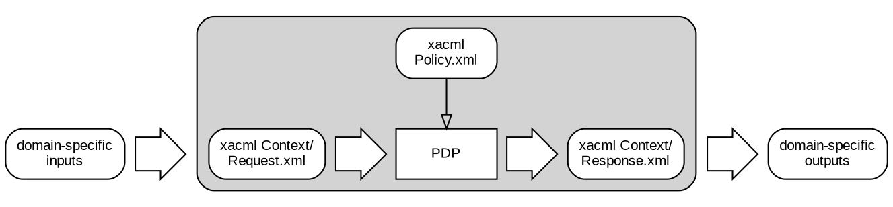
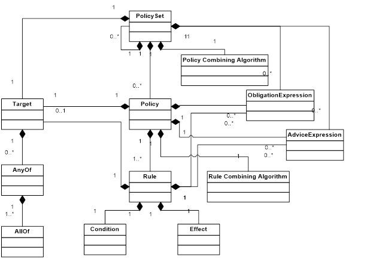
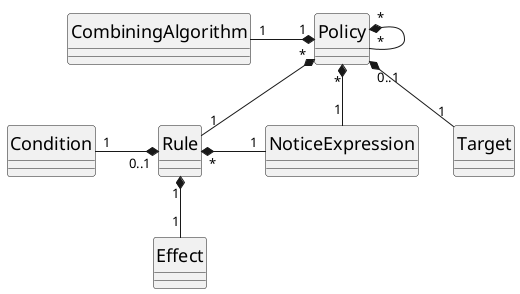

\<

# OASIS Open Specification Template Instructions


## General Template Instructions


**Template Instructions:** All template instructions are included within angle brackets and need to be deleted prior to publication. This includes these five pages.


**Square Brackets**: Nearly all text within square brackets needs to be updated or replaced, except for any reference tokens that also use square brackets. For formats that support it, this text will be highlighted in yellow to make it easier to see.


**Additional Versions**: The editors of the document **MUST** produce all additional desired or required formats (HTML, PDF, etc) before sending this for publication.


**Names, Organizations, and Emails**: Individuals or companies, past or present, may request that their name and/or affiliation and/or email address be not included in any of the acknowledgments and or leadership positions. 


## Formatting Instructions


**Paragraph Spacing**: There **SHOULD** be a single empty line between paragraphs. In some cases, editors may add additional spacing to improve readability and the cosmetic look of the section, especially around figures, tables, and charts.


**Quotes:** Straight "quotes" **SHOULD** be used, not “smart quotes” or curly quotes. This can be set as a persistent preference in most writing tools.


**Document Date**: At the top of the document on the first page is a date, this date **MUST** be the date that the document was approved. 


**Document Title and Subtitle:** The title of the document **SHOULD** be written in title case, meaning all words that have four or more letters **SHOULD** be capitalized.


**Headings**: While various editors and formats support up to 6 levels of nested headers it is generally advised to structure the document to minimize the number of nested sections. A best practice is to try and keep nesting to no greater than 3 levels of headings. All headings **SHOULD** be written in title case, meaning all words that have four or more letters **SHOULD** be capitalized. 


**Tables**: Text presented in tables **SHOULD** be no smaller in font size than the body copy text.


## Extra Items Instructions


All equations, listings, code snippets, figures (Fig. 1), tables (Table I), etc., need to be referenced in the text (preferably before their appearance).


**Mathematical Syntax and Equations:** Editors **SHOULD** consider using simple text (with the Markdown Blockquotes feature designated by the following angle bracket \>) or images to create mathematical representations. All equations, listings, code snippets, figures (Fig. 1), tables (Table 1), etc., need to be referenced in the text (preferably before their appearance). 


**Equations:** All equations **MUST** use the Markdown Blockquotes feature, **MUST** be numbered, **MAY** use a section number dot equation number (see example below) to track the equations within a particular section, and **SHOULD** be numbered consecutively where the number is in parentheses and appears after the formula. All symbols in the equation **SHOULD** be defined before the equation appears in the text. When referring to an equation or formula, use for example "Eq. 1.1".


> y2 \= x3 \+ ax \+ b (Eq. 1.1)


**Listings:** All algorithms and pseudo code **MUST** use the Markdown Fenced Code Blocks feature, **MUST** be numbered, **MAY** use a section number dot listing number (see example below) to track the listing within a particular section, **SHOULD** be numbered consecutively, and **SHOULD** include a short title forming a header. There **SHOULD** be a line above and below the header and a line at the bottom of the algorithm. Editors **SHOULD** use the markdown 


---


**Listing 1.1** Sample Title  
---


```
currentMax ← A[0]  
    for i ← 1 to n \-1 do  
        if A[i] \> currentMax then  
            currentMax ← A[i]  
    { increment counter i }  
    return currentMax  
```


---


**Code Snippets**: Actual code samples and snippets **MUST** be numbered, **MAY** use a section number followed by a dot which is then followed by a code sample number (see example below) to track the code samples within a particular section, **SHOULD** be numbered consecutively, and **SHOULD** include a short title forming a header. There **SHOULD** be a line above and below the header. A single header **MAY** be used for multiple code samples in a block, but in this case, each sample **SHOULD** individually be numbered as shown below. The code itself **SHOULD** use the Markdown Fenced Code Blocks feature and programming language designator to style the code snippet. Meaning that the first code line will start with three back tick characters (\`\`\`) followed by the language (e.g., json, yaml, cpp, go, etc) and the last line starts with three back tick characters (\`\`\`).


---


**Code 1.1** Sample Title  
---


*Some subheading (e.g., Example 1.1.1 \- Some example code)*  
```json  
{  
  "Some key": "some value"  
}  
```


*Some subheading (e.g., Example 1.1.2 \- Some other example code)*  
```xml 
<your xml> 
```


**Figures and Tables**: All figures **MUST** be numbered and **MAY** use a section number followed by a hyphen which is then followed by a figure number (see example below) to track the figures within a particular section. When referencing a figure or table please use the abbreviation "Fig." for figures and "Table" for tables. Tables **SHOULD** be numbered with Roman numerals.


Figure 2-1  

**Fig. 2-1.** This is a sample of a figure caption.


Table I  
This is a Sample of a Table Title


|  Name  | \#1 | \#2 | \#3 | \#4 | \#5 |
|:------:|:---:|:---:|:---:|:---:|:---:|
| **AB** |  3  |  3  |  6  | 11  |  9  |
| **BC** |  7  |  7  |  4  | 12  |  9  |
| **CD** | 10  |  3  |  3  |  9  |  7  |
| **DE** |  3  |  7  | 10  |  5  |  6  |
| **DF** |  7  |  1  | 12  |  1  |  3  |
| **ZZ** |  5  | 12  | 11  |  9  |  8  |


**Table I:** This table contains information about x and y and z.


## Other Instructions


**References:** OASIS uses the IEEE Reference format for citations. However, unlike the IEEE Reference format the in-line tokens can be either named or a number; in either case they are enclosed in square braces. Editors **SHOULD** be consistent in the body of the document and use either named tokens "[RFC2119]" or numbered "[1]" tokens, but not both. Any named tokens that are used in the template front matter do not impact the decision about named or numbered in the body of the document. All other rules about in-line use and style **MUST** follow the IEEE Reference format found here: [https://journals.ieeeauthorcenter.ieee.org/wp-content/uploads/sites/7/IEEE\_Reference\_Guide.pdf](https://journals.ieeeauthorcenter.ieee.org/wp-content/uploads/sites/7/IEEE_Reference_Guide.pdf)


**Definitions and Terms:** It is generally more consistent to refer to an existing official definition in other open standards or readily-available nonproprietary reference documents, rather than to redefine a term. It is a best practice to refer to the specific version or date of the source document for a definition, either explicitly or by a reference link to the specific version (not a ‘current version’ link). Normally, terms defined elsewhere will simply refer to the defining document. In certain cases, it may be desirable to quote the definition to allow for a stand-alone document. Before defining a new term, verify whether it has already been defined in an official document elsewhere such as in another OASIS Standard, the ITU terminology database ([https://www.itu.int/br\_tsb\_terms/\#/](https://www.itu.int/br_tsb_terms/#/)), ISO terms ([https://www.iso.org/obp/ui](https://www.iso.org/obp/ui)), IEEE/IEC electropedia ([https://www.electropedia.org/IEEE](https://www.electropedia.org/IEEE)), IETF, CEN/CENELEC, or NIST ([https://csrc.nist.gov/glossary](https://csrc.nist.gov/glossary)).


**Annex vs Appendix:** An annex is considered normative, meaning that it **MUST** be included with the document and its contents form an integral part of the document. Whereas an Appendix is purely informational content and is not required to be included with the document.


Under the heading of each Annex the following text **MUST** be present:  
(This annex forms an integral part of this Specification.)


Under the heading of each Appendix the following text **MUST** be present:  
(This appendix does not form an integral part of this Specification and is informational.)


- Annex A **MUST** be the License, Document Status and Notices information.  
- Annex B **MUST** be the References information.  
- Annex C+ can be whatever is needed  
- Appendix 1 **MUST** be the Acknowledgments information  
- Appendix 2 **MUST** be the Changes From Previous Version information  
- Appendix 3+ can be whatever is needed


\>


---


# Attribute-Centric Authorization Language (ACAL) Version 1.0


## Committee Specification Draft 01


## 7 November 2025


### This version


- [ link to authoritative version of the published document ] (Authoritative)  
- [ links to one or more other versions of the published document (e.g., MD, PDF, Word, HTML, etc.) ] 


### Previous version


- [ link to authoritative version of the published document ] (Authoritative)  
- [ links to one or more other versions of the published document (e.g., MD, PDF, Word, HTML, etc.) ] 


### Latest version


- [ link to authoritative version of the published document ] (Authoritative)  
- [ links to one or more other versions of the published document (e.g., MD, PDF, Word, HTML, etc.) ] 


### Technical Committee

[OASIS eXtensible Access Control Markup Language (XACML) TC](https://groups.oasis-open.org/communities/tc-community-home2?CommunityKey=67afe552-0921-49b7-9a85-018dc7d3ef1d)


### Chairs


Bill Parducci (bill@parducci.net), Individual


### Secretaries


- [ First Name Last Name (email), Company ]   
- [ First Name Last Name (email), Company ] 


### Editors


Steven Legg (steven.legg@viewds.com), [ViewDS Identity Solutions](https://www.viewds.com/) \
Cyril Dangerville (cyril.dangerville@thalesgroup.com), [THALES](https://www.thalesgroup.com/) \
Bill Parducci (bill@parducci.net), Individual


### Abstract


This specification defines Version 1.0 of the Attribute-Centric Authorization Language.


### Citation Format


When referencing this document, the following citation format should be used:


_Attribute-Centric Authorization Language (ACAL) Version 1.0_.
Edited by Steven Legg and Cyril Dangerville. 22 August 2025. OASIS Committee Specification Draft 01.


### Related Work


This document replaces or supersedes:


- _eXtensible Access Control Markup Language (XACML) Version 3.0 Plus Errata 01_. Edited by Erik Rissanen. OASIS Standard incorporating Approved Errata. https://docs.https:xacml/3.0/xacml-3.0-core-spec-en.html.


This document is related to:


- [ The full reference to the related document in IEEE reference format ] 
- _JACAL: The JSON representation of the Attribute-Centric Authorization Language (ACAL) Version 1.0_.
- _XACML Version 4.0: The XML representation of the Attribute-Centric Authorization Language (ACAL)_.
- _YACAL: The YAML representation of the Attribute-Centric Authorization Language (ACAL) Version 1.0_.


## License, Document Status, and Notices


Copyright © OASIS Open 2025. All Rights Reserved.  For license and copyright information, and complete status, please see Annex A which contains the License, Document Status and Notices.


---


## Table of Contents


- [1 Scope](#1-scope)
- [2 Definitions and Acronyms](#2-definitions-and-acronyms)
  - [2.1 Definitions](#2.1-definitions)
    - [2.1.1 Terms Defined Elsewhere](#2.1.1-terms-defined-elsewhere)
    - [2.1.2 Terms Defined in this Document](#2.1.2-terms-defined-in-this-document)
  - [2.2 Abbreviations and Acronyms](#2.2-abbreviations-and-acronyms)
- [3 Document Conventions](#3-document-conventions)
  - [3.1 Key Words](#3.1-key-words)
  - [3.2 Typographical Conventions](#3.2-typographical-conventions)
- [4 Introduction](#4-introduction)
  - [4.1 Any Additional Introduction Subsections That are Needed](#4.1-any-additional-introduction-subsections-that-are-needed)
  - [4.2 Changes From the Previous Version](#4.2-changes-from-the-previous-version)
- [5 Level 1 Section Header](#5-level-1-section-header)
  - [5.1 Level 2 Section Header](#5.1-level-2-section-header)
    - [5.1.1 Level 3 Section Header](#5.1.1-level-3-section-header)
      - [5.1.1.1 Level 4 Section Header](#5.1.1.1-level-4-section-header)
        - [5.1.1.1.1 Level 5 Section Header](#5.1.1.1.1-level-5-section-header)
          - [5.1.1.1.1.1 Level 6 Section Header](#5.1.1.1.1.1-level-6-section-header)
- [6 Additional Sections as Needed](#6-additional-sections-as-needed)
- [7 Safety, Security, and Data Protection Considerations](#7-safety,-security,-and-data-protection-considerations)
- [8 Conformance](#8-conformance)
- [Annex A License, Document Status and Notices](#annex-a-license,-document-status-and-notices)
  - [A.1 Document Status](#a.1-document-status)
  - [A.2 License and Notices](#a.2-license-and-notices)
- [Annex B References](#annex-b-references)
  - [B.1 Normative References](#b.1-normative-references)
  - [B.2 Informative References](#b.2-informative-references)
- [Annex C Additional Annex as Needed](#annex-c-additional-annex-as-needed)
  - [C.1 Subsection Title](#c.1-subsection-title)
  - [C.1.1 Sub-subsection](#c.1.1-sub-subsection)
- [Appendix 1 Acknowledgments](#appendix-1-acknowledgments)
  - [Leadership](#leadership)
  - [Special Thanks](#special-thanks)
  - [Participants](#participants)
- [Appendix 2 Changes From Previous Version](#appendix-2-changes-from-previous-version)
  - [Revision History](#revision-history)
- [Appendix 3 Additional Appendix as Needed](#appendix-3-additional-appendix-as-needed)
  - [Subsection Title](#subsection-title)
- [Sub-subsection](#sub-subsection)


---


# 1 Scope


\<


What is the purpose and scope of this document?   
Best practices: 


- Expect this text to be reused in multiple other places to explain the specification in summary form.  
- This is not the TC or OP scope (which is an IPR and rules boundary);  rather, this section is the summary intended purpose of this specification.  
- Short is better; four paragraphs or less is recommended.  
- If use of this spec is deliberately created to rely on or complement another standard, consider briefly mentioning that here as context.  
- To the extent that discussion of the larger context of the spec, or its history, or the circumstances that led to its creation or revision, are necessary, they belong in the Introduction, not here. 


\>


---


# 2 Definitions and Acronyms


## 2.1 Definitions


### 2.1.1 Terms Defined Elsewhere


This document uses the following terms defined elsewhere:


- Term 1: [Reference]: optional quoted definition.  
- Term 2: [Reference]: optional quoted definition.
- etc


### 2.1.2 Terms Defined in this Document


This document defines the following terms:


- Term 1: some definition.  
- Term 2: some definition.  
- etc


## 2.2 Abbreviations and Acronyms


This document uses the following abbreviations and acronyms:


- Term 1: expanded form.  
- Term 2: expanded form.  
- etc


---


# 3 Document Conventions


## 3.1 Key Words


The key words "**MUST**", "**MUST NOT**", "**REQUIRED**", "**SHALL**", "**SHALL NOT**", "**SHOULD**", "**SHOULD NOT**", "**RECOMMENDED**", "**NOT RECOMMENDED**", "**MAY**", and "**OPTIONAL**" in this document are to be interpreted as described in BCP 14 [RFC2119] [RFC8174] when, and only when, they appear in all capitals, as shown here.


## 3.2 Typographical Conventions


\< Describe any standards or typographical conventions that were followed when writing this document, such as fonts or highlighting that have special significance. If there are no typographical conventions than one is to put "None". \>


---


# 4 Introduction (non-normative)


The "economics of scale" have driven computing platform vendors to develop products with very generalized functionality, so that they can be used in the widest possible range of situations. "Out of the box", these products have the maximum possible privilege for accessing data and executing software, so that they can be used in as many application environments as possible, including those with the most permissive security policies. In the more common case of a relatively restrictive security policy, the platform's inherent privileges must be constrained by configuration.

The security policy of a large enterprise has many elements and many points of enforcement. Elements of policy may be managed by the Information Systems department, by Human Resources, by the Legal department and by the Finance department. And the policy may be enforced by the extranet, mail, WAN, and remote-access systems; platforms which inherently implement a permissive security policy. The current practice is to manage the configuration of each point of enforcement independently in order to implement the security policy as accurately as possible. Consequently, it is an expensive and unreliable proposition to modify the security policy. Moreover, it is virtually impossible to obtain a consolidated view of the safeguards in effect throughout the enterprise to enforce the policy. At the same time, there is increasing pressure on corporate and government executives from consumers, shareholders, and regulators to demonstrate "best practice" in the protection of the information assets of the enterprise and its customers.

For these reasons, there is a pressing need for a common language for expressing security policy. If implemented throughout an enterprise, a common policy language allows the enterprise to manage the enforcement of all the elements of its security policy in all the components of its information systems. Managing security policy may include some or all of the following steps: writing, reviewing, testing, approving, issuing, combining, analyzing, modifying, withdrawing, retrieving, and enforcing policy.

This specification defines the concepts and processing models for such a common language but leaves the concrete syntactic representation to separate specifications. ACAL offers a choice of syntaxes and implementations are free to choose any one or more of these syntaxes to support. 


## 4.1 Requirements


The basic requirements of a policy language for expressing information system security policy are:

* To provide a method for combining individual rules and policies into a single policy that applies to a particular decision request.

* To provide a method for flexible definition of the procedure by which rules and policies are combined.

* To provide a method for dealing with multiple subjects acting in different capacities.

* To provide a method for basing an authorization decision on attributes of the subject and resource.

* To provide a method for dealing with multi-valued attributes.

* To provide a method for basing an authorization decision on the contents of an information resource.

* To provide a set of logical and mathematical operators on attributes of the subject, resource and environment.

* To provide a method for handling a distributed set of policy components, while abstracting the method for locating, retrieving and authenticating the policy components.

* To provide a method for rapidly identifying the policy that applies to a given action, based upon the values of attributes of the subjects, resource and action.

* To provide an abstraction-layer that insulates the policy-writer from the details of the application environment.

* To provide a method for specifying a set of actions that must be performed in conjunction with policy enforcement.

The motivation behind ACAL is to express these well-established ideas in the field of access control policy. The ACAL solutions for each of these requirements are discussed in the following sections.

## 4.2 Rule and Policy Combining

The complete policy applicable to a particular decision request may be composed of a number of individual rules or policies. For instance, in a personal privacy application, the owner of the personal information may define certain aspects of disclosure policy, whereas the enterprise that is the custodian of the information may define certain other aspects. In order to render an authorization decision, it must be possible to combine the two separate policies to form the single policy applicable to the request.

A rule contains a Boolean expression that can be evaluated in isolation, but that is not intended to be accessed in isolation by a PDP. So, it is not intended to form the basis of an authorization decision by itself. It is intended to exist in isolation only within an ACAL PAP, where it may form the basic unit of management.

A policy contains a set of rules and/or other policies and a specified procedure for combining the results of their evaluation. It is the basic unit of policy used by the PDP, and so it is intended to form the basis of an authorization decision. It is also the standard means for combining separate policies into a single combined policy.

Hinton et al [[Hinton94](#hinton94)] discuss the question of the compatibility of separate policies applicable to the same decision request.

## 4.3 Combining Algorithms

ACAL defines a number of combining algorithms that each define a procedure for arriving at an authorization decision given the individual results of evaluation of a set of rules and policies. Some examples of standard combining algorithms are (see [Annex E](#annex-e-combining-algorithms) for a full list of standard combining algorithms):

* `deny-overrides` (ordered and unordered),

* `permit-overrides` (ordered and unordered) and

* `first-applicable`

In the case of the `deny-overrides` algorithm, if a single rule or policy is encountered that evaluates to `Deny`, then, regardless of the evaluation result of the other rules or policies in the applicable policy, the combined result is `Deny`.

Likewise, in the case of the `permit-overrides` algorithm, if a single `Permit` result is encountered, then the combined result is `Permit`.

In the case of the `first-applicable` combining algorithm, the combined result is the same as the result of the first rule or policy in the list of rules and policies that is applicable to the decision request.

Policies may take parameters that modify the behavior of the combining algorithms. However, none of the standard combining algorithms are affected by parameters.

Users of this specification may, if necessary, define their own combining algorithms.

## 4.4 Multiple Subjects

Access control policies often place requirements on the actions of more than one subject. For instance, the policy governing the execution of a high-value financial transaction may require the approval of more than one individual, acting in different capacities. Therefore, ACAL recognizes that there may be more than one subject relevant to a decision request. Different attribute categories are used to differentiate between subjects acting in different capacities. Some standard values for these attribute categories are specified, and users may define additional ones.

## 4.5 Policies Based on Subject and Resource Attributes

Another common requirement is to base an authorization decision on some characteristic of the subject other than its identity. Perhaps, the most common application of this idea is the subject's role [[RBAC](#rbac)]. ACAL provides facilities to support this approach. Attributes of subjects contained in the request context may be identified by an attribute designator. Alternatively, an attribute selector may contain an XPath expression over the `ContentType` object of the subject to identify a particular subject attribute value by its location in the context (see [Section 4.11](#411-abstraction-layer) for an explanation of context).

ACAL provides a standard way to reference the attributes defined in the LDAP series of specifications [[LDAP-1](#ldap-1)], [[LDAP-2](#ldap-2)]. This is intended to encourage implementers to use standard attribute identifiers for some common subject attributes.

Another common requirement is to base an authorization decision on some characteristic of the resource other than its identity. ACAL provides facilities to support this approach. Attributes of the resource may be identified by an attribute designator. Alternatively, an attribute selector may contain an XPath expression over the `ContentType` object of the resource to identify a particular resource attribute value by its location in the context.

## 4.6 Multi-Valued Attributes

The most common techniques for communicating attributes (LDAP, XPath, SAML, etc.) support multiple values per attribute. Therefore, when an ACAL PDP retrieves the value of a named attribute, the result may contain multiple values. A collection of such values is called a bag. A bag differs from a set in that it may contain duplicate values, whereas a set may not. Sometimes this situation represents an error. Sometimes the ACAL rule is satisfied if any one of the attribute values meets the criteria expressed in the rule.

ACAL provides a set of functions that allow a policy writer to be absolutely clear about how the PDP should handle the case of multiple attribute values. These are the "higher-order" functions (see [Annex C.3](#c3-functions)).

## 4.7 Policies Based on Resource Contents

In many applications, it is required to base an authorization decision on data contained in the information resource to which access is requested. For instance, a common component of privacy policy is that a person should be allowed to read records for which he or she is the subject. The corresponding policy must contain a reference to the subject identified in the information resource itself.

ACAL provides facilities for doing this when the information resource can be represented as an XML or JSON document. The `AttributeSelectorType` object may contain an XPath or JSONPath expression over the `ContentType` object of the resource to identify data in the information resource to be used in the policy evaluation.

In cases where the information resource is not an XML or JSON document, specified attributes of the resource can be referenced, as described in [Section 4.5](#45-policies-based-on-subject-and-resource-attributes).

## 4.8 Operators

Information security policies operate upon attributes of subjects, the resource, the action and the environment in order to arrive at an authorization decision. In the process of arriving at the authorization decision, attributes of many different types may have to be compared or computed. For instance, in a financial application, a person's available credit may have to be calculated by adding their credit limit to their account balance. The result may then have to be compared with the transaction value. This sort of situation gives rise to the need for arithmetic operations on attributes of the subject (account balance and credit limit) and the resource (transaction value).

Even more commonly, a policy may identify the set of roles that are permitted to perform a particular action. The corresponding operation involves checking whether there is a non-empty intersection between the set of roles occupied by the subject and the set of roles identified in the policy; hence the need for set operations.

ACAL includes a number of built-in functions and a method of adding non-standard functions. These functions may be nested to build arbitrarily complex expressions. This is achieved with `ApplyType` objects. An `ApplyType` object has a property called `FunctionId` that identifies the function to be applied to the contents of the object, i.e., the arguments of the function. Each standard function is defined for specific argument data type combinations, and its return data type is also specified. Therefore, data type consistency of the policy can be checked at the time the policy is written or parsed. And, the types of the data values presented in the request context can be checked against the values expected by the policy to ensure a predictable outcome.

In addition to operators on numerical and set arguments, operators are defined for date, time and duration arguments.

Relationship operators (equality and comparison) are also defined for a number of data types, including the RFC822 and X.500 name-forms, strings, URIs, etc.

Also noteworthy are the operators over Boolean data types, which permit the logical combination of predicates in a rule. For example, a rule may contain the statement that access may be permitted during business hours AND from a terminal on business premises.

The ACAL method of representing functions borrows from MathML [[MathML](#mathml)] and from the XPath and XQuery Functions and Operators 3.1 specification [[XF](#xf)].

## 4.9 Policy Distribution

In a distributed system, individual policy statements may be written by several policy writers and enforced at several enforcement points. In addition to facilitating the collection and combination of independent policy components, this approach allows policies to be updated as required. ACAL policy statements may be distributed in any one of a number of ways. But, ACAL does not describe any normative way to do this. Regardless of the means of distribution, PDPs are expected to confirm, by examining the policy's target that the policy is applicable to the decision request that it is processing.

Policies may be attached to the information resources to which they apply, as described by Perritt [[Perritt93](#perritt93)]. Alternatively, policies may be maintained in one or more locations from which they are retrieved for evaluation. In such cases, the applicable policy may be referenced by an identifier or locator closely associated with the information resource.

## 4.10 Policy Indexing

For efficiency of evaluation and ease of management, the overall security policy in force across an enterprise may be expressed as multiple independent policy components. In this case, it is necessary to identify and retrieve the applicable policy statement and verify that it is the correct one for the requested action before evaluating it. This is the purpose of the policy target in ACAL.

Two approaches are supported:

1. Policy statements may be stored in a database. In this case, the PDP should form a database query to retrieve just those policies that are applicable to the set of decision requests to which it expects to respond. Additionally, the PDP should evaluate the target of the retrieved policy statements as defined by the ACAL specification.

2. Alternatively, the PDP may be loaded with all available policies and evaluate their targets in the context of a particular decision request, in order to identify the policies that are applicable to that request.

The use of constraints limiting the applicability of a policy was described by Sloman [[Sloman94](#sloman94)].

## 4.11 Abstraction Layer

PEPs come in many forms. For instance, a PEP may be part of a remote-access gateway, part of a Web server or part of an email user-agent, etc. It is unrealistic to expect that all PEPs in an enterprise do currently, or will in the future, issue decision requests to a PDP in a common format. Nevertheless, a particular policy may have to be enforced by multiple PEPs. It would be inefficient to force a policy writer to write the same policy several different ways in order to accommodate the format requirements of each PEP. Similarly attributes may be contained in various envelope types (e.g. X.509 attribute certificates, SAML attribute assertions, etc.). Therefore, there is a need for a canonical form of the request and response handled by an ACAL PDP. This canonical form is called the ACAL context. Its syntax is defined in XML schema.

Naturally, ACAL-conformant PEPs may issue requests and receive responses in the form of an ACAL context. But, where this situation does not exist, an intermediate step is required to convert between the request/response format understood by the PEP and the ACAL context format understood by the PDP.

The benefit of this approach is that policies may be written and analyzed independently of the specific environment in which they are to be enforced.

In the case where the native request/response format is specified in XML Schema (e.g. a SAML-conformant PEP), the transformation between the native format and the ACAL context may be specified in the form of an Extensible Stylesheet Language Transformation [[XSLT](#xslt)].

Similarly, in the case where the resource to which access is requested is an XML document, the resource itself may be included in, or referenced by, the request context. Then, through the use of XPath expressions [[XPath](#xpath)] in the policy, values in the resource may be included in the policy evaluation.

## 4.12 Actions Performed in Conjunction with Enforcement

In many applications, policies specify actions that MUST be performed, either instead of, or in addition to, actions that MAY be performed. This idea was described by Sloman [[Sloman94](#sloman94)]. ACAL provides facilities to specify actions that MUST be performed in conjunction with policy evaluation through obligation notices. This idea was described as a provisional action by Kudo [[Kudo00](#kudo00)]. There are no standard definitions for these actions in version 3.0 of ACAL. Therefore, bilateral agreement between a PAP and the PEP that will enforce its policies is required for correct interpretation. PEPs that conform to v3.0 of ACAL are required to deny access unless they understand and can discharge all of the obligation notices associated with the applicable policy. Obligation notices are returned to the PEP for enforcement.

## 4.13 Supplemental Information About a Decision

In some applications it is helpful to specify supplemental information about a decision. ACAL provides facilities to specify supplemental information about a decision through advice notices. Such advice may be safely ignored by the PEP.


## 4.14 Changes From the Previous Version


\< This section is **REQUIRED** and **MUST** be the last numbered subsection in this section. \>

The list of changes from the previous version and any revision history can be found in [Appendix 2](#appendix-2-changes-from-previous-version).


---


# 5 Models (non-normative)

The data-flow model and language model of ACAL are described in the following sub-sections.

## 5.1 Data-Flow Model

The major actors in the ACAL domain are shown in the data-flow diagram of [Figure 1](#figure-1---data-flow-diagram).

###### Figure 1 - Data-Flow Diagram

```dot
// do not use strict keyword to allow multiple edges between PDP and context handler
digraph Fig1 {
    compound=true // Allow links to/from/between PEP/PDP/PIP boxes)
    splines=false // Straight links (avoid curves whenever possible)
    fontname=Arial
    newrank=true // Allows to enforce rank constraints (horizontal alignment) across clusters (PEP/PDP/PIP boxes)
    ranksep=0.02
    //nodesep=1 // more space between nodes on the same rank (horizontally aligned)
    // Default parameters for nodes
    node [shape=box, style=rounded, width=2, height=0.5, fontname=Arial, fontsize=14.0]
    // Default parameters for links (smaller font than nodes)
    edge [fontname=Arial, fontsize=10.0]
    
    
    // TODO: remove group attributes to see if this makes a difference
    
    // BEGIN LEFT PART 
    // Define the Access requester, PDP and PAP boxes, then link them together in order to be aligned vertically by Graphviz dot engine.
    
    // Access requester box
    AR [label="access\nrequester"/*, group=left*/]
    
    // PDP box
    subgraph pdp {
        /*
        The PDP box is a cluster of 3 nodes in descending vertical order:
        - 1 top node (invisible), used only as connection point for the links of "flows 4-5" from/to the context handler
        - 1 node in-between for the box label "PDP"
        - 1 bottom node (invisible), used only as connection point for the links of "flows 10-11" from/to the context handler
        Having two separate connector nodes (top and bottom) is a way to space out the two pairs of links, i.e. prevent flows 10-11 to overlap flows 4-5.
        An alternative would be to use node ports (https://graphviz.org/docs/attr-types/portPos/), e.g. north-east / south-east, but it does not look nice, esp. with rounded corners. The link heads/tails don't reach the box corners.   
        */
        cluster=true
        style=rounded
        // Increase the margin if the bottom link (flow 11) is too low
        //margin="40"
        
        // Top connector node that will connect to the top-left part of the context handler (ch_top_left node). Make it invisible and small (empty label, zero height).
        // (width ajusted to make the PDP box as wide as access requester / PAP boxes)
        pdp_top [label="", shape=plaintext, height=0, width=1.8, /*style=invis*/]
        
        // between label and top node
        pdp_middle_up [label="", shape=plaintext, height=0, width=1.8, /*style=invis*/]
        
        // Center node for a label "PDP" centered in the box (width ajusted to make the PDP box as wide as access requester / PAP boxes)
        pdp_label [label="PDP", shape=plaintext, height=0, width=1.8]
        
        // between label and bottom node
        pdp_middle_down [label="", shape=plaintext, height=0, width=1.8, /*style=invis*/]
        
        // Bottom connector node that will connect to the bottom-left part of the context handler (ch_bottom_left node). Make it invisible and small (empty label, zero height).
        pdp_bottom [label="",shape=plaintext,  height=0, width=1.8, /*style=invis*/]
        
        // Link the nodes to force vertical alignment from top to bottom and make the links invisible
        // NB: changing minlen to 0 to reduce edge length screws up everything, don't do it.
        pdp_top -> pdp_middle_up -> pdp_label -> pdp_middle_down -> pdp_bottom [style=invis]
    }
    
    // Link AR and PAP boxes with PDP box to align them vertically from top to bottom
    AR -> pdp_top [style="invis"] // link not visible, just for alignment
    
    // PDP - PAP link (PAP box is created implicitly when creating this link)
    pdp_bottom -> PAP [dir=back, label="  1. policy",ltail=pdp]
    // END LEFT PART
	
	// BEGIN MIDDLE PART
	// Define the PEP, context handler, PIP and subjects boxes, then link them together in order to be aligned vertically by Graphviz dot engine.
	
	// PEP box
	subgraph pep {
	    /*
        The PEP box is a cluster of 3 nodes aligned hotizontally:
        - 1 left node (invisible), used primarily as connection point for the link of "flow 3" to the context handler
        - 1 node in-between for the box label "PEP"
        - 1 right node (invisible), used primarily as connection point for the link of "flow 12" from the context handler
        Having two separate connector nodes (left and right) is a way to space out the two links, i.e. prevent flow 3 to be too close to flow 12.
        An alternative would be to use node ports (https://graphviz.org/docs/attr-types/portPos/), e.g. north-east / south-east, but it does not look nice, esp. with rounded corners. The link heads/tails don't reach the box corners.
        */
	    cluster=true
        style=rounded
        // Assign pep_left to same group as ch_top_left to make sure they are aligned vertically
        pep_left [label="",  shape=plaintext, height=0, width=0.5, group=middle_left, style=invis]
        pep_label [label="PEP",shape=plaintext, height=0, width=0, style=""]
        pep_right [label="",  shape=plaintext, height=0, width=0.5, style=invis]
    }

    // Context handler box
    subgraph ch {
        /*
        This box is defined very similary to the PDP box but with two extra connector nodes on the right for the flows 8 and 12 respectively
        */
        cluster=true
        style=rounded
        //margin=10
        
        // Top connector node that will connect to the top-left part of the context handler (ch_top_left node). Make it invisible and small (empty label, zero height).
        ch_top_left [label="",  shape=plaintext, height=0, width=0.5, group=middle_left, /*style=invis*/]
        // This node adds enough space between ch_top_left and ch_top_right to make sure they are aligned with pep_left and pep_right nodes to have straight vertical links (width must be the same as pep_label node)
        ch_top_middle[label="", shape=plaintext,  height=0, width=0.6, /*style=invis*/]
        ch_top_right [label="", shape=plaintext,  height=0, width=0.5, /*style=invis*/]
        // between ch_top_left and ch_label
        ch_middle_up [label="",  shape=plaintext, height=0, width=2.1, /*style=invis*/]
        
        // Set same width as pdp_label to make PDP and context handler boxes the same size
        ch_label [label="context\nhandler", shape=plaintext, height=0, width=2.1, style=""]
        
        // between label and bottom nodes
        ch_middle_down [label="",  shape=plaintext, height=0, width=2.1, /*style=invis*/]
        ch_bottom_left [label="", shape=plaintext, height=0, width=0.5, group=middle_left, /*style=invis*/]
        // This node adds enough space between ch_bottom_left and ch_bottom_right to make sure they are aligned with pip_top_left and pip_top_right nodes to have straight vertical links (width must be the same as pip_label node)
        ch_bottom_middle[label="", shape=plaintext, height=0, width=0.6, /*style=invis*/]
        ch_bottom_right [label="", shape=plaintext, height=0, width=0.5, /*style=invis*/]
        
        // Link the nodes to force vertical alignment from top to bottom and make the links invisible
        // NB: changing minlen to 0 to reduce edge length screws up everything, don't do it.
        ch_top_left -> ch_middle_up [style=invis]
        ch_top_middle -> ch_middle_up -> ch_label -> ch_middle_down -> ch_bottom_middle [style=invis]
        ch_top_right -> ch_middle_up [style=invis]
        ch_middle_down -> ch_bottom_left [style=invis]
        ch_middle_down -> ch_bottom_right [style=invis]
    }
    
    // PEP - Context-handler links
    pep_left -> ch_top_left [label="  3. request\n\n ", ltail=pep, lhead=ch]
    // try xlabel instead of label
    pep_right -> ch_top_right [xlabel="12. response ", dir=back, ltail=pep, lhead=ch]
    
    // PIP box
    subgraph pip {
        cluster=true
        style=rounded
        // Assign pip_top_left to same group as ch_bottom_left for vertical alignment
        pip_top_left [label="", shape=plaintext, height=0, width=0.5, group=middle_left, style=invis]
        // This node adds enough space between pip_top_left and pip_top_right to make sure they are aligned with ch_bottom_left and ch_bottom_right nodes to have straight vertical links (width must be the same as ch_label node)
        pip_top_middle [label="",  shape=plaintext, height=0, width=0.6, style=invis]
        pip_top_right [label="",  shape=plaintext, height=0, width=0.5, style=invis]
        // Set same width as ch_label to make PIP, context handler and subjects boxes the same size
        pip_label [label="PIP", shape=plaintext, height=0, width=2.1, style=""]
        pip_bottom [label="",  shape=plaintext, height=0, width=2.1, style=invis]
        
        // Link the nodes to force vertical alignment from top to bottom and make the links invisible
        // NB: changing minlen to 0 to reduce edge length screws up everything, don't do it.
        pip_top_left -> pip_label [style=invis]
        pip_top_middle -> pip_label -> pip_bottom [style=invis]
        pip_top_right -> pip_label [style=invis]
    }
    
    // Context-handler - PIP links
    ch_bottom_left -> pip_top_left [label="  6. attribute\nquery", ltail=ch,lhead=pip]
    ch_bottom_right -> pip_top_right [xlabel="8. attribute  ", dir=back, ltail=ch, lhead=pip]
    
    // PIP - subjects link (subjects box is created implicitly when creating this link)
    pip_bottom -> subjects [dir=back, label="   7a. subject\nattributes", ltail=pip]
    // END MIDDLE PART
    
    // Horizontal links between left and middle parts
    AR -> pep_left [label="2. access request  ", lhead=pep, constraint=false]
    pdp_top -> ch_top_left [label="4. request notification", dir=back, constraint=false, ltail=pdp, lhead=ch]
    pdp_middle_up -> ch_middle_up [label="5. attribute queries",constraint=false, ltail=pdp, lhead=ch]
    pdp_middle_down -> ch_middle_down [label=" 10. attributes ", dir=back, constraint=false, ltail=pdp, lhead=ch]
    pdp_bottom -> ch_bottom_left [label="11. response context",constraint=false, ltail=pdp, lhead=ch]
    
    // BEGIN RIGHT PART
    // Assign the same group to all boxes to make sure they are aligned vertically
    // Obligations service box
    OS [label="obligations\nservice", group=right]
    resource [group=right]
    // Node for labeling flows 7b./7c and work as the link angle
    label7c [label="7c. resource\nattributes", shape=plaintext,fontsize=10.0, height=0, width=1, group=right]
    label7b [label="7b. environment\nattributes", shape=plaintext,fontsize=10.0, height=0, width=1, group=right]
    
    // Link OS, resource, label7b label7c and environment boxes in order to align them vertically from top to bottom
    // (Resource box created with the link)
    OS -> resource [style="invis"] // link not visible, just for alignment
    resource -> label7c [arrowhead=none]
    label7c -> label7b [style=invis]
    label7b -> environment [arrowhead=none]
    // END RIGHT PART
    
    // Horizontal links between middle and right parts
    pep_right -> OS [label=" 13. obligations", ltail=pep, constraint=false]
    ch_label -> resource [label="9. resource\ncontent", dir=back, ltail=ch]
    pip_top_right -> label7c [dir=back,ltail=pip]
    pip_bottom -> label7b [dir=back,ltail=pip]
    
    // Align certain boxes horizontally
	{rank=same; AR; pep_left; pep_right; OS;}
	{rank=same; pdp_top; ch_top_left;ch_top_right;}
	{rank=same; pdp_label; ch_label;resource;}
	{rank=same; pdp_bottom; ch_bottom_left;ch_bottom_right;}
	{rank=same; pip_top_right; label7c;}
	{rank=same; pip_bottom; label7b;}
	{rank=same; PAP; subjects; environment;}
    
}
```

<!--  -->



<span> </span>
: Note: some of the data-flows shown in the diagram may be facilitated by a repository. For instance, the communications between the context handler and the PIP or the communications between the PDP and the PAP may be facilitated by a repository. The ACAL specification is not intended to place restrictions on the location of any such repository, or indeed to prescribe a particular communication protocol for any of the data-flows.

The model operates by the following steps.

1. PAPs write policies and make them available to the PDP. These policies represent the complete policy for a specified target.
2. The access requester sends a request for access to the PEP.
3. The PEP sends the request for access to the context handler in its native request format, optionally including attributes of the subjects, resource, action, environment and other categories.
4. The context handler constructs an ACAL request context, optionally adds attributes, and sends it to the PDP.
5. The PDP requests any additional subject, resource, action, environment and other categories (not shown) attributes from the context handler.
6. The context handler requests the attributes from a PIP.
7. The PIP obtains the requested attributes.
8. The PIP returns the requested attributes to the context handler.
9. Optionally, the context handler includes the resource in the context.
10. The context handler sends the requested attributes and (optionally) the resource to the PDP. The PDP evaluates the policy.
11. The PDP returns the response context (including the authorization decision) to the context handler.
12. The context handler translates the response context to the native response format of the PEP. The context handler returns the response to the PEP.
13. The PEP fulfills the obligation notices.
14. (Not shown) If access is permitted, then the PEP permits access to the resource; otherwise, it denies access.

## 5.2 ACAL Context

ACAL is intended to be suitable for a variety of application environments. The core language is insulated from the application environment by the ACAL context, as shown in [Figure 2](#figure-2---acal-context), in which the scope of the ACAL specification is indicated by the shaded area. The ACAL context is defined in XML schema, describing a canonical representation for the inputs and outputs of the PDP. Attributes referenced by an instance fof ACAL policy may be in the form of XPath expressions over the `ContentType` objects of the context, or attribute designators that identify the attribute by its category, identifier, data type and (optionally) its issuer. Implementations must convert between the attribute representations in the application environment (e.g., SAML, J2SE, CORBA, and so on) and the attribute representations in the ACAL context. How this is achieved is outside the scope of the ACAL specification. In some cases, such as SAML, this conversion may be accomplished in an automated way through the use of an XSLT transformation.

###### Figure 2 - ACAL Context

<!--  -->


<span> </span>
: Note: The PDP is not required to operate directly on the ACAL representation of a policy. It may operate directly on an alternative representation.

Typical categories of attributes in the context are the subject, resource, action and environment, but users may define their own categories as needed. See [Annex D.2](#d2-attribute-categories) for suggested attribute categories.

See [Section 9.4.5](#945-attribute-retrieval) for a more detailed discussion of the request context.

## 5.3 Policy Language Model

The policy language model is shown in [Figure 3](#figure-3---policy-language-model). The main components of the model are:

* Rule; and

* Policy.

These are described in the following sub-sections.

###### Figure 3 - Policy Language Model

<!--  -->
<div style="text-align: center;">


</div>

### 5.3.1 Rule

A rule is the most elementary unit of policy. It may exist in isolation only within one of the major actors of the ACAL domain. In order to exchange rules between major actors, they must be encapsulated in a policy. A rule can be evaluated on the basis of its contents. The main components of a rule are:

* an effect,

* a condition, and

* notice expressions.

These are discussed in the following sub-sections.

#### 5.3.1.1 Condition

The condition defines the set of requests to which the rule is intended to apply in the form of a logical expression on attributes in the request. If the rule is intended to apply to all entities of a particular data type, then the corresponding entity is omitted from the condition. An ACAL PDP verifies that the matches defined by the condition are satisfied by the attributes in the request context.

The condition may be absent from a rule. In this case, the condition of the rule is the same as the target of the parent policy.

Certain subject name-forms, resource name-forms and certain types of resource are internally structured. For instance, the X.500 directory name-form and RFC 822 name-form are structured subject name-forms, whereas an account number commonly has no discernible structure. UNIX file-system path-names and URIs are examples of structured resource name-forms. An XML document is an example of a structured resource.

Generally, the name of a node (other than a leaf node) in a structured name-form is also a legal instance of the name-form. So, for instance, the RFC822 name `med.example.com` is a legal RFC822 name identifying the set of mail addresses hosted by the med.example.com mail server. The XPath value md:record/md:patient/ is a legal XPath value identifying a node-set in an XML document.

The question arises: how should a name that identifies a set of subjects or resources be interpreted by the PDP, whether it appears in a policy or a request context? Are they intended to represent just the node explicitly identified by the name, or are they intended to represent the entire sub-tree subordinate to that node?

In the case of subjects, there is no real entity that corresponds to such a node. So, names of this type always refer to the set of subjects subordinate in the name structure to the identified node. Consequently, non-leaf subject names should not be used in equality functions, only in match functions, such as `urn:oasis:names:tc:acal:1.0:function:rfc822Name-match` <!-- Newline to fit on PDF page -->
instead of `urn:oasis:names:tc:acal:1.0:function:rfc822Name-equal` (see [Annex C.3.15](#c315-special-match-functions)).

#### 5.3.1.2 Effect

The effect of the rule indicates the rule-writer's intended consequence of a `true` evaluation for the condition. Two values are allowed: `Permit` and `Deny`.

#### 5.3.1.4 Notice Expressions

Notice expressions may be added by the writer of the rule.

When a PDP evaluates a rule containing notice expressions, it evaluates the notice expressions into notices and returns certain of those notices to the PEP in the response context. [Section 9.18](#918-notices) explains which notices are to be returned.

In contrast to obligation notices, advice notices may be safely ignored by the PEP.

### 5.3.2 Policy

From the data-flow model one can see that rules are not exchanged amongst system entities. Therefore, a PAP combines rules in a policy. A policy comprises four main components:

* a target;

* a combining algorithm identifier;

* a set of rules and policies and

* notice expressions.

Rules are described above. The remaining components are described in the following sub-sections.

#### 5.3.2.1 Policy Target

An ACAL policy contains a target that specifies the set of requests to which it applies. The target of a policy may be declared by the writer of the policy, or it may be calculated from the targets and conditions of the policies and rules (respectively) that it contains.

A system entity that calculates a target in this way is not defined by ACAL, but there are two logical methods that might be used. In one method, the target of the outer policy (the "outer component") is calculated as the union of all the targets of the referenced policies and the conditions of the referenced rules (the "inner components"). In another method, the target of the outer component is calculated as the intersection of all the targets and conditions of the inner components. The results of evaluation in each case will be very different: in the first case, the target of the outer component makes it applicable to any decision request that matches the target or condition of at least one inner component; in the second case, the target of the outer component makes it applicable only to decision requests that match the target or condition of every inner component.

In cases where the target of a policy is declared by the policy writer, any component rules in the policy that have the same condition as the target may omit the condition. Such rules inherit the target of the policy in which they are contained.

#### 5.3.2.2 Combining Algorithm

The combining algorithm specifies the procedure by which the results of evaluating the component rules and policies are combined when evaluating the policy, i.e. the `Decision` value placed in the response context by the PDP is the result of evaluating the policy, as defined by the combining algorithm. A policy may have combining parameters that affect the operation of the combining algorithm.

See [Annex E](#annex-e-combining-algorithms) for definitions of the standard combining algorithms.

#### 5.3.2.3 Notice Expressions

The writer of a policy may add notice expressions to the policy, in addition to those contained in the component rules and policies.

When a PDP evaluates a policy containing notice expressions, it evaluates the notice expressions into notices and returns certain of those notices to the PEP in the response context. [Section 9.18](#918-notices) explains which notices are to be returned. In contrast to obligation notices, advice notices may be safely ignored by the PEP.


---


# 6 Examples (non-normative)

This section contains two examples of the use of ACAL for illustrative purposes. The first example is a relatively simple one to illustrate the use of target, context, matching functions and subject attributes. The second example additionally illustrates the use of the combining algorithm, conditions and notices.

## 6.1 Example One

_To be provided._

### 6.1.1 Example Policy

_To be provided._

### 6.1.2 Example Request Context

_To be provided._

### 6.1.3 Example Response Context

_To be provided._

## 6.2 Example Two

### 6.2.1 Example Medical Record Instance

_To be provided._

### 6.2.2 Example Request Context

_To be provided._

### 6.2.3 Example Plain-Language Rules

The following plain-language rules are to be enforced.

Rule 1:

: A person, identified by his or her patient number, may read any record for which he or she is the designated patient.

Rule 2:

: A person may read any record for which he or she is the designated parent or guardian, and for which the patient is under 16 years of age.

Rule 3:

: A physician may write to any medical element for which he or she is the designated primary care physician, provided an email is sent to the patient.

Rule 4:

: An administrator shall not be permitted to read or write to medical elements of a patient record.

These rules may be written by different PAPs operating independently, or by a single PAP.

### 6.2.4 Example Short Identifier Set

Policy writers are able to define sets of short identifiers to provide simple alias names to use in place of URIs. A set with the identifier `urn:oasis:names:tc:acal:1.0:core:identifiers` is defined by ACAL for the various identifiers assigned by this specification. However, a deployment will usually have need for additional identifiers, especially for locally-defined attributes, so it is usually desirable to define a set of additional short identifiers to use in the deployment.

The following short identifier set, in both the XML and JSON representations, defines short identifiers for the additional attributes in this example and also imports the standardized set.

```xml
<ShortIdSet xmlns="urn:oasis:names:tc:xacml:4.0:core:schema"
  Id="urn:oasis:names:tc:acal:1.0:example:identifiers"/>

  <!-- Include the short identifiers for standard URIs. -->
  <ShortIdSetReference>urn:oasis:names:tc:acal:1.0:core:identifiers</ShortIdSetReference>

  <!-- These are the short identifiers specific to the deployment. -->

  <!-- Attributes -->
  <ShortId Name="patient-number" Value="urn:oasis:names:tc:acal:1.0:example:attribute:patient-number"/>
  <ShortId Name="collection" Value="urn:oasis:names:tc:acal:1.0:example:attribute:collection"/>

</ShortIdSet>
```

```json
{
  "Id":"urn:oasis:names:tc:acal:1.0:example:identifiers",
  "ShortIdSetReference":["urn:oasis:names:tc:acal:1.0:core:identifiers"],
  "ShortId":[
    { "Name":"patient-number", "Value":"urn:oasis:names:tc:acal:1.0:example:attribute:patient-number" },
    { "Name":"collection", "Value":"urn:oasis:names:tc:acal:1.0:example:attribute:collection" }
  ]
}
```

### 6.2.5 Example ACAL Rule Instances

#### 6.2.5.1 Rule 1

Rule 1 illustrates a policy with a simple rule containing a condition. It also illustrates the use of a variable definition to define an expression that may be used throughout the policy. The following ACAL policy, represented in XML and JSON, contains a rule instance expressing Rule 1 (the numbers in square brackets on the left-hand side are for referencing purposes and are not part of the policy in either representation):

```
[01] <?xml version="1.0" encoding="UTF-8"?>
[02] <Policy
[03]   xmlns="urn:oasis:names:tc:xacml:4.0:core:schema"
[04]   PolicyId="urn:oasis:names:tc:acal:1.0:example:policyid:1"
[05]   CombiningAlgId="deny-overrides"
[06]   Version="1.0">
[07]   <ShortIdSetReference>urn:oasis:names:tc:acal:1.0:example:identifiers</ShortIdSetReference>
[08]   <VariableDefinition VariableId="17590034">
[11]     <Apply FunctionId="string-equal">
[14]       <Apply FunctionId="string-one-and-only">
[17]         <AttributeDesignator
[18]           Category="access-subject"
[19]           AttributeId="patient-number"
[20]           DataType="string"/>
[23]       </Apply>
[25]       <Apply FunctionId="string-one-and-only">
[28]         <AttributeDesignator
[29]           Category="resource"
[30]           AttributeId="patient-number"
[31]           DataType="string"/>
[34]       </Apply>
[36]     </Apply>
[38]   </VariableDefinition>
[41]   <Rule Id="Rule 1" Effect="Permit">
[44]     <Description>A person may read any medical record in the http://www.med.example.com/springfield-hospital collection for which he or she is the designated patient.</Description>
[45]     <Condition>
[46]       <Apply FunctionId="and">
[49]         <Apply FunctionId="any-of">
[52]           <Function Id="anyURI-equal"/>
[56]           <Value DataType="anyURI"
[58]             >http://www.med.example.com/springfield-hospital</Value>
[61]           <AttributeDesignator
[62]             Category="resource"
[63]             AttributeId="collection"
[64]             DataType="anyURI"/>
[67]         </Apply>
[69]         <Apply FunctionId="any-of">
[72]           <Function Id="string-equal"/>
[76]           <Value DataType="string">read</Value>
[81]           <AttributeDesignator
[82]             Category="action"
[83]             AttributeId="action-id"
[84]             DataType="string"/>
[87]         </Apply>
[89]         <VariableReference VariableId="17590034"/>
[93]       </Apply>
[94]     </Condition>
[95]   </Rule>
[97] </Policy>
```

```
[02] {
[04]   "PolicyId":"urn:oasis:names:tc:acal:1.0:example:policyid:1",
[05]   "CombiningAlgId":"deny-overrides",
[06]   "Version":"1.0",
[07]   "ShortIdSetReference":["urn:oasis:names:tc:acal:1.0:example:identifiers"],
[08]   "VariableDefinition":[{
[09]     "VariableId":"17590034",
[10]     "Expression":{
[11]       "Apply":{
[12]         "FunctionId":"string-equal",
[13]         "Argument":[{
[14]           "Apply":{
[15]             "FunctionId":"string-one-and-only",
[16]             "Argument":[{
[17]               "AttributeDesignator":{
[18]                 "Category":"access-subject",
[19]                 "AttributeId":"patient-number",
[20]                 "DataType":"string"
[21]               }
[22]             }]
[23]           }
[24]         },{
[25]           "Apply":{
[26]             "FunctionId":"string-one-and-only",
[27]             "Argument":[{
[28]               "AttributeDesignator":{
[29]                 "Category":"resource",
[30]                 "AttributeId":"patient-number",
[31]                 "DataType":"string"
[32]               }
[33]             }]
[34]           }
[35]         }]
[36]       }
[37]     }]
[38]   }],
[39]   "CombinerInput":[{
[41]     "Rule":{
[42]       "Id":"Rule 1",
[43]       "Effect":"Permit",
[44]       "Description":"A person may read any medical record in the http://www.med.example.com/springfield-hospital collection for which he or she is the designated patient",
[45]       "Condition":{
[46]         "Apply":{
[47]           "FunctionId":"and",
[48]           "Argument":[{
[49]             "Apply":{
[50]               "FunctionId":"any-of",
[51]               "Argument":[{
[52]                 "Function":{
[54]                   "Id":"anyURI-equal"
[54]                 }
[55]               },{
[56]                 "Value":{
[57]                   "DataType":"anyURI",
[58]                   "Value":"http://www.med.example.com/springfield-hospital"
[59]                 }
[60]               },{
[61]                 "AttributeDesignator":{
[62]                   "Category":"resource",
[63]                   "AttributeId":"collection",
[64]                   "DataType":"anyURI"
[65]                 }
[66]               }]
[67]             }
[68]           },{
[69]             "Apply":{
[70]               "FunctionId":"any-of",
[71]               "Argument":[{
[72]                 "Function":{
[73]                   "Id":"string-equal"
[74]                 }
[75]               },{
[76]                 "Value":{
[77]                   "DataType":"string",
[78]                   "Value":"read"
[79]                 }
[80]               },{
[81]                 "AttributeDesignator":{
[82]                   "Category":"action",
[83]                   "AttributeId":"action-id",
[84]                   "DataType":"string"
[85]                 }
[86]               }]
[87]             }
[88]           },{
[89]             "VariableReference":{
[90]               "VariableId":"17590034"
[91]             }
[92]           }]
[93]         }
[94]       }
[95]     }
[96]   }]
[97] }
```

[07] A reference to a short identifier set imported into the policy. The names of the short identifiers in the set are available to use in this policy.

[08] - [38] A variable definition. It defines an expression that evaluates the truth of the statement: the patient-number subject attribute is equal to the patient-number attribute in the resource.

[11] - [12] The `FunctionId` component names the function to be used for comparison. In this case, the function is nominated with the short identifier name `string-equal`, which evaluates to `urn:oasis:names:tc:acal:1.0:function:string-equal` using the imported short identifier set. This function takes two arguments of type `urn:oasis:names:tc:acal:1.0:data-type:string`.

[17] - [21] An attribute designator that selects a bag of values for the patient-number subject attribute in the request context.

[18] The `Category` component names the category from which the desired attribute will be obtained. In this case, the category is nominated with the short identifier name `access-subject`, which evaluates to `urn:oasis:names:tc:acal:1.0:subject-category:access-subject` using the imported short identifier set.

[19] The `AttributeId` component nominates the patient-number attribute with the short identifier name `patient-number`, which evaluates to `urn:oasis:names:tc:acal:1.0:example:attribute:patient-number` using the imported short identifier set.

[20] The `DataType` component specifies the data type of the attribute. In this case, the data type is nominated with the short identifier name `string`, which evaluates to `urn:oasis:names:tc:acal:1.0:data-type:string` using the imported short identifier set.

[14] - [15] The attribute designator returns a bag of attribute values but the `urn:oasis:names:tc:acal:1.0:function:string-equal` function takes arguments that are single attribute values. The `FunctionId` component here names a function to convert the bag of values to a single value. The function is nominated with the short identifier name `string-one-and-only`, which evaluates to `urn:oasis:names:tc:acal:1.0:function:string-one-and-only` using the imported short identifier set. This function generates an `Indeterminate` result if its argument is not a bag with exactly one value.

[28] - [32] An attribute designator that selects a bag of values for the patient-number resource attribute in the request context. This attribute designator differs from the previous one in that it selects the attribute from the resource category, `urn:oasis:names:tc:acal:1.0:attribute-category:resource`, nominated with the short identifier name `resource`.

[25] - [26] The result of the second attribute designator must also be converted to a single value for comparison.

[41] - [43] The beginning of a rule definition. The `Id` component assigns a string identifier for the rule. The `Effect` component specifies the value the rule emits when it evaluates to `true`.

[44] A free-form description of the rule.

[45] - [94] A condition, which must evaluate to `true` for the rule to be applicable.

[46] - [93] The expression for the condition.

[46] - [47] The expression for the condition is a conjunction of three terms. The `FunctionId` component specifies a conjunction using the `urn:oasis:names:tc:acal:1.0:function:and` function nominated with the short identifier name `and`.

[49] - [57] The first term is a function.

[49] - [50] The `FunctionId` component specifies the `urn:oasis:names:tc:acal:1.0:function:any-of` function using the short identifier name `any-of`. This function compares a attribute value to each of the attribute values in a bag according to a matching function that is specified in the first argument. The bag of values can be either the second or third argument. In this case it is the third argument. The function evaluates to `true` if any value in the bag matches the second argument according to the matching function.

[52] - [54] The first argument: the matching function. The `Id` component specifies that the matching function is `urn:oasis:names:tc:acal:1.0:function:anyURI-equal` using the short identifier name `anyURI-equal`.

[56] - [59] The second argument: an attribute value. It is a literal URI to be matched, specifically `http://www.med.example.com/springfield-hospital`. The `DataType` component indicates that the data type of the value is `urn:oasis:names:tc:acal:1.0:data-type:anyURI` using the short identifier name `anyURI`.

[61] - [65] The third argument: the bag of values. It is an attribute designator that selects a bag of `urn:oasis:names:tc:acal:1.0:data-type:anyURI` values from the `urn:oasis:names:tc:acal:1.0:example:attribute:collection` (short identifier name `collection`) attribute in the `urn:oasis:names:tc:acal:1.0:attribute-category:resource` category.

[69] - [87] The second term is another instance of the `urn:oasis:names:tc:acal:1.0:function:any-of`. The matching function is `urn:oasis:names:tc:acal:1.0:function:string-equal`. The second argument is the literal value `read` of the `urn:oasis:names:tc:acal:1.0:data-type:string` data type. The third argument is an attribute designator that selects a bag of `urn:oasis:names:tc:acal:1.0:data-type:string` values from the `urn:oasis:names:tc:acal:1.0:action:action-id` attribute in the `urn:oasis:names:tc:acal:1.0:attribute-category:action` category.

[89] - [91] The third term is a reference to a variable definition defined elsewhere in the policy.

#### 6.2.5.2 Rule 2

#### 6.2.5.3 Rule 3

_Note: this section is referenced._

#### 6.2.5.4 Rule 4

#### 6.2.5.5 Example Policy with Nested Policies


---


# 7 Structures

_XML Schema fragments are non-normative and will be replaced with UML diagrams._

## 7.1 Introduction

The structures in ACAL are described here in abstract terms. The concrete representations of these structures are defined for a variety of syntaxes each in a separate profile.

### 7.1.1 Object Type

The ACAL structures are objects that each conform to a specific object type. Objects of the same kind conform to a specific, named object type, which describes a set of properties that an object of the type is permitted to have and for each property whether it is required or optional.

A property has a unique name (unique among the object's properties) and a value, where the value conforms to a specific type, either a simple type, an object type, or a sequence of such values.

### 7.1.2 Simple Types

The simple types are:

* `String` : A sequence of characters that may be constrained to a particular pattern.

* `URI` : A sequence of characters representing a Uniform Resource Identifier according to RFC 3986.

* `Boolean` : Either `true` or `false`.

* `Integer` : An integer number that may be constrained to a particular range.

### 7.1.3 Relationship to Concrete Representations

In the JSON representation, an object maps to a JSON object and a property of that object maps to a JSON member (a name/value pair). An object type is formally defined by a JSON subschema.

In the XML representation, a property corresponds to an XML element or XML attribute, an object corresponds to element content and an object type is formally defined by an XML Schema complex type.

## 7.2 ShortIdSetType

A `ShortIdSetType` object defines a set of short identifiers. It contains its own short identifiers as well as references to other short identifier sets, which are imported (recursively) into this set.

```xml
<xs:element name="ShortIdSet" type="xacml:ShortIdSetType"/>
<xs:complexType name="ShortIdSetType">
   <xs:sequence>
      <xs:element ref="xacml:ShortIdSetReference" minOccurs="0" maxOccurs="unbounded"/>
      <xs:element ref="xacml:ShortId" minOccurs="0" maxOccurs="unbounded"/>
   </xs:sequence>
   <xs:attribute name="Id" type="xs:anyURI" use="required"/>
</xs:complexType>
<xs:element name="ShortIdSetReference" type="xs:anyURI"/>
```

A `ShortIdSetType` object contains the following properties:

`Id` [Required]

: The identifier for this short identifier set. It is the responsibility of the PAP to ensure that no two short identifier sets visible to the PDP have the same identifier. This MAY be achieved by following a predefined URN or URI scheme. If the identifier is in the form of a URL, then it MAY be resolvable.

`ShortIdSetReference` [Any Number]

: A sequence of `URI` values referencing other short identifier sets. The short identifiers of the referenced sets are included in this set. This applies recursively to the sets referenced by a referenced set. This set SHALL NOT reference itself and SHALL NOT reference a set that directly or indirectly references this set. This set SHALL NOT directly or indirectly reference any other set more than once.

`ShortId` [Any Number]

: A sequence of `ShortIdType` objects, each defining a short identifier in this set.

A predefined set of short identifiers for the URIs defined in this specification is provided as a convenience, in both XML (`xacml-core-v4-identifiers.xml`) and JSON (`xacml-core-v4-identifiers.json`) representations. Use of this set is OPTIONAL.

## 7.3 ShortIdType

A `ShortIdType` object defines a single short identifier. Attribute categories, attributes, data types, functions, combining algorithms and other artifacts in ACAL are ultimately identified by URIs. A short identifier provides a simple alias name to use when composing and displaying policies and protocol messages instead of using the full URI.

```xml
<xs:element name="ShortId" type="xacml:ShortIdType"/>
<xs:complexType name="ShortIdType">
   <xs:attribute name="Name" type="xacml:ShortIdNameType" use="required"/>
   <xs:attribute name="Value" type="xs:string" use="required"/>
</xs:complexType>

<xs:simpleType name="ShortIdNameType">
   <xs:restriction base="xs:string">
      <xs:pattern value="[A-Za-z][0-9A-Za-z]*(-[0-9A-Za-z]+)*"/>
         <!-- The exact pattern is still open for discussion. -->
   </xs:restriction>
</xs:simpleType>

```

A `ShortIdType` object contains the following properties:

`Name` [Required]

: A simple alias name that stands for a URI or a part thereof.

`Value` [Required]

: The character string used to replace the simple alias name when a value of `IdentifierType` is evaluated to produce a complete URI; see [Section 9.3](#93-identifier-evaluation).

The value of the `Value` property SHALL be either one of the following:
* a character string with only characters allowed in a URI [RFC3986] (curly brackets are not allowed) or

* a character string with one or more references to other short identifiers in the form of the short identifier name enclosed in curly brackets (i.e., `{` and `}`; U+007B and U+007D) optionally preceded, followed and/or separated by other characters allowed in a URI (this excludes curly brackets, which means that the curly bracket characters are not permitted in the value other than to enclose a short identifier name). In addition, the following restrictions apply:

  * the value SHALL NOT reference this short identifier (i.e., shall not contain any `{s}` where `s` matches the value of the `Name` property),

  * the value SHALL NOT reference a short identifier that directly or indirectly references this short identifier and

  * the referenced short identifiers MUST each either precede this short identifier in the same short identifier set or be defined in one of the short identifier sets referenced by the containing short identifier set.

The name of the short identifier MUST NOT be the same as the name of any other short identifier in the same short identifier set or the same as the name of any other short identifier defined in one of the short identifier sets referenced by the containing short identifier set.

## 7.4 IdentifierType

A value of the `IdentifierType` simple type refers to a specific attribute category, attribute, data type, function, notice, status code, combining algorithm or XPath version.

```xml
<xs:simpleType name="IdentifierType">
   <xs:restriction base="xs:string">
      <xs:pattern value="[^{}]*({[A-Za-z][0-9A-Za-z]*(-[0-9A-Za-z]+)*}[^{}]*)*"/>
   </xs:restriction>
</xs:simpleType>

```

A value of this simple type is either:
* an absolute URI [[RFC2396](#rfc2396)],
* the name of a short identifier or
* a character string with one or more short identifier names enclosed by curly brackets (i.e., `{` and `}`; U+007B and U+007D) optionally preceded, followed and/or separated by other characters allowed in a URI.

A short identifier name appearing in the second and third cases MUST be the name of a member of a short identifier set referenced by the containing policy, request or response.

Note that the three cases can be distinguished from each other syntactically in a valid, correctly formatted value. If the value contains curly brackets, then the third case must apply since the curly bracket characters are not legal characters for an absolute URI or a short identifier name; otherwise, if the value matches the pattern for a short identifier name, then the second case applies since an absolute URI begins with a scheme name and a colon character (i.e., `:`; U+003A) and the colon character is not a legal character for a short identifier name; otherwise, the value is an absolute URI.

The conversion of a value of the `IdentifierType` simple type into an absolute URI is detailed in [Section 9.3](#93-identifier-evaluation).

## 7.5 PolicyType

A `PolicyType` object describes a policy: an aggregation of rules and other policies. Policies MAY be included in an enclosing `PolicyType` object either directly using the `Policy` property or indirectly using the `PolicyReference` property.

A `PolicyType` object may be evaluated, in which case the evaluation procedure defined in [Section 9.12](#912-policy-evaluation) SHALL be used.

The main components of this object type are the `CombiningAlgId`, `Target`, `Policy`, `Rule`, `VariableDefinition` and `NoticeExpression` properties.

If a `PolicyType` object contains references to other policies in the form of URLs, then these references MAY be resolvable.

The results of evaluating the policies and rules included in a `PolicyType` object MUST be combined using the algorithm identified by the `CombiningAlgId` property.

A `PolicyType` object MAY contain a `PolicyIssuer` property. The interpretation of the `PolicyIssuer` property is explained in the separate administrative policy profile [[XACMLAdmin](#xacmladmin)].

The `Target` property defines the applicability of the `PolicyType` object to a set of decision requests. If the `Target` property within the `PolicyType` object matches the request context, then the `PolicyType` object may be used by the PDP in making its authorization decision. See [Section 9.12](#912-policy-evaluation).

Any `NoticeExpressionType` objects may be evaluated into notices by the PDP. Any resulting obligation notices MUST be fulfilled by the PEP in conjunction with the authorization decision. If the PEP does not understand or cannot fulfill any of the obligation notices, then it MUST act according to the PEP bias. See [Section 9.2](#92-policy-enforcement-point) and [Section 9.18](#918-notices). Any resulting advice notices MAY be safely ignored by the PEP.

```xml
<xs:element name="Policy" type="xacml:PolicyType"/>
   <xs:unique name="policyShortIdSetReferenceUniqueness">
      <xs:selector xpath="xacml:ShortIdSetReference"/>
      <xs:field xpath="."/>
   </xs:unique>
   <xs:unique name="policyParameterNameUniqueness">
      <xs:selector xpath="xacml:PolicyParameter"/>
      <xs:field xpath="@ParameterName"/>
   </xs:unique>
   <xs:unique name="policyVariableIdUniqueness">
      <xs:selector xpath="xacml:VariableDefinition"/>
      <xs:field xpath="@VariableId"/>
   </xs:unique>
   <xs:unique name="policyIdUniqueness">
      <xs:selector xpath="xacml:Policy"/>
      <xs:field xpath="@PolicyId"/>
   </xs:unique>
      <xs:unique name="ruleIdUniqueness">
      <xs:selector xpath="xacml:Rule"/>
      <xs:field xpath="@Id"/>
   </xs:unique>
</xs:element>
<xs:complexType name="PolicyType">
   <xs:sequence>
      <xs:element ref="xacml:ShortIdSetReference" minOccurs="0" maxOccurs="unbounded"/>
      <xs:element ref="xacml:Description" minOccurs="0"/>
      <xs:element ref="xacml:PolicyIssuer" minOccurs="0"/>
      <xs:element ref="xacml:PolicyDefaults" minOccurs="0"/>
      <xs:element ref="xacml:PolicyParameter" minOccurs="0" maxOccurs="unbounded"/>
      <xs:element ref="xacml:VariableDefinition" minOccurs="0" maxOccurs="unbounded"/>
      <xs:element ref="xacml:Target" minOccurs="0"/>
      <xs:choice minOccurs="0" maxOccurs="unbounded">
         <xs:element ref="xacml:Policy"/>
         <xs:element ref="xacml:Rule"/>
         <xs:element ref="xacml:PolicyReference"/>
      </xs:choice>
      <xs:element ref="xacml:NoticeExpression" minOccurs="0" maxOccurs="unbounded"/>
   </xs:sequence>
   <xs:attribute name="PolicyId" type="xs:anyURI" use="required"/>
   <xs:attribute name="Version" type="xacml:VersionType" use="required"/>
   <xs:attribute name="CombiningAlgId" type="xacml:IdentifierType" use="required"/>
   <xs:attribute name="MaxDelegationDepth" type="xs:integer" use="optional"/>
</xs:complexType>

<xs:element name="Target" type="xacml:BooleanExpressionType"/>
<xs:element name="Description" type="xs:string"/>
```

A `PolicyType` object contains the following properties:

`PolicyId` [Required]

: A `URI` value specifying an identifier for the policy. It is the responsibility of the PAP to ensure that no two policies visible to the PDP have the same identifier. This MAY be achieved by following a predefined URN or URI scheme. If the policy identifier is in the form of a URL, then it MAY be resolvable.

`Version` [Required]

: A `VersionType` value specifying the version number of the Policy.

`CombiningAlgId` [Required]

: An `IdentifierType` value identifying the combining algorithm by which the `PolicyType` and `RuleType` objects MUST be combined. Standard combining algorithms are listed in [Annex E](#annex-e-combining-algorithms). Standard combining algorithm identifiers are listed in [Annex D.9](#d9-combining-algorithms).

`MaxDelegationDepth` [Optional]

: If present, an `Integer` that limits the depth of delegation which is authorized by this policy. See the delegation profile [[XACMLAdmin](#xacmladmin)].

`ShortIdSetReference` [Any Number]

: A sequence of `URI` values referencing short identifier sets. The short identifiers used by the policy MUST be ones defined in the referenced sets or in any further sets referenced by the referenced sets (recursively). The policy set SHALL NOT directly or indirectly reference any short identifier set more than once.

`Description` [Optional]

: A free-form `String` description of the policy.

`PolicyIssuer` [Optional]

: A `PolicyIssuerType` object containing attributes of the issuer of the policy.

`PolicyDefaults` [Optional]

: A `DefaultsType` object containing a set of default values applicable to the policy, such as the XPath version. The scope of the `PolicyDefaults` property SHALL be the enclosing policy. The `PolicyDefaults` property is REQUIRED if the enclosing policy contains attribute selectors or expressions applying XPath-based functions.

`PolicyParameter` [Any Number]

: A sequence of `PolicyParameterType` objects declaring the parameters for a parameterized policy.

`VariableDefinition` [Any Number]

: A sequence of `VariableDefinitionType` objects, each defining an expression that can be referenced from anywhere in a contained policy or rule where an expression can appear.

`Target` [Optional]

: A `BooleanExpressionType` object that determines the set of decision requests to which the parent policy is applicable. If this property is omitted from the `PolicyType` object, then the policy applies to all decision requests. Evaluation of the `Target` property is described in [Section 9.7](#97-target-evaluation).

`NoticeExpression` [Any Number]

: A sequence of `NoticeExpressionType` objects to be evaluated into notices by the PDP. See [Section 7.33](#733-noticeexpressiontype). See [Section 9.18](#918-notices) for a description of how the notices to be returned by the PDP are determined.

`CombinerInput` [Any Number]

: An ordered sequence of `CombinerInputType` objects, which are combined according to the combining algorithm specified by the `CombiningAlgId` property.

Each `CombinerInputType` object contains exactly one of the following properties:

`Policy`

: A `PolicyType` object defining a nested policy that is included in this policy. A policy whose target matches the decision request MUST be considered. A policy whose target does not match the decision request SHALL be ignored.

`PolicyReference`

: A `PolicyReferenceType` object referencing a separate policy that is included in this policy. If the `Id` property of the `PolicyReferenceType` object is a URL, then it MAY be resolvable. A policy whose target matches the decision request MUST be considered. A policies whose target does not match the decision request SHALL be ignored.

`Rule`

: A `RuleType` object defining a nested rule that is included in this policy. A rule whose condition matches the decision request MUST be considered. A rule whose condition does not match the decision request SHALL be ignored.

## 7.6 PolicyIssuerType

A `PolicyIssuerType` object contains ACAL attributes describing the issuer of the policy. The use of the `PolicyIssuerType` object is defined in a separate administration profile [[XACMLAdmin](#xacmladmin)]. A PDP which does not implement the administration profile MUST report an error or return an `Indeterminate` result if it encounters this object.

```xml
<xs:element name="PolicyIssuer" type="xacml:EntityType">
   <xs:unique name="attributeUniqueness">
      <xs:selector xpath="xacml:Attribute"/>
      <xs:field xpath="@AttributeId"/>
      <xs:field xpath="@Issuer"/>
   </xs:unique>
</xs:element>
```

A `PolicyIssuerType` object contains the following properties:

`Content` [Optional]

: Free form XML describing the issuer. See [Section 7.38](#738-contenttype).

`Attribute` [Zero to many]

: A sequence of `AttributeType` objects, each holding an ACAL attribute of the issuer. See [Section 7.39](#739-attributetype).

## 7.7 DefaultsType

A `DefaultsType` object specifies default values that apply to the enclosing `PolicyType` object.

```xml
<xs:element name="PolicyDefaults" type="xacml:DefaultsType"/>
<xs:complexType name="DefaultsType">
   <xs:sequence>
      <xs:choice>
         <xs:element ref="xacml:XPathVersion"/>
      </xs:choice>
   </xs:sequence>
</xs:complexType>
<xs:element name="XPathVersion" type="xacml:IdentifierType"/>
```

A `DefaultsType` object contains the following property:

`XPathVersion` [Required]

: An `IdentifierType` value specifying the XPath version for XPath expressions occurring in the policy. XPath expressions are used by attribute selectors and as arguments to XPath-based functions.

## 7.8 PolicyParameterType

A `PolicyParameterType` object declares a single parameter for a parameterized policy.

```xml
<xs:element name ="PolicyParameter" type="xacml:PolicyParameterType"/>
<xs:complexType name="PolicyParameterType">
   <xs:sequence>
      <xs:element ref="xacml:Description" minOccurs="0"/>
      <xs:element ref="xacml:Expression" minOccurs="0"/>
   </xs:sequence>
   <xs:attribute name="ParameterName" type="xacml:PolicyInternalIdentifierType" use="required"/>
   <xs:attribute name="DataType" type="xs:anyURI" use="optional" default="urn:oasis:names:tc:acal:1.0:data-type:string"/>
   <xs:attribute name="IsBag" type="xs:boolean" use="optional" default="false"/>
</xs:complexType>
<xs:simpleType name="PolicyInternalIdentifierType">
   <xs:restriction base="xs:string">
      <xs:pattern value="_?[A-Za-z]([-._]?[A-Za-z0-9]+)*"/>
   </xs:restriction>
</xs:simpleType>
```

A `PolicyParameterType` object contains the following properties:

`ParameterName` [Required]

: The name of the parameter. The value of the parameter MAY be referenced within an expression contained within the policy using a `VariableReferenceType` object with its `VariableId` property set to this name.

`DataType` [Optional]

: An `IdentifierType` value specifying the data type of the parameter. If this property is omitted, then it is treated as being set to `urn:oasis:names:tc:acal:1.0:data-type:string`.

`IsBag` [Optional]

: A `Boolean` value that specifies whether the parameter takes a single value (set to `false`) or a bag of values (set to `true`). If this property is omitted, then it is treated as being set to `false`.

`Description` [Optional]

: A free-form `String` description of the parameter.

`Expression` [Optional]

: An expression that evaluates to a default value (`Isbag` is `false`) or bag of values (`IsBag` is true`) for the parameter that is used when a `PolicyReferenceType` object does not provide an argument for the parameter.

## 7.9 BooleanExpressionType

A `BooleanExpressionType` object contains one ACAL expression, with the restriction that the expression's return data type MUST be `urn:oasis:names:tc:acal:1.0:data-type:boolean`.

```xml
<xs:complexType name="BooleanExpressionType">
   <xs:sequence>
      <xs:element ref="xacml:Expression"/>
   </xs:sequence>
</xs:complexType>
```

The `Target` and `Condition` properties are of this type.

Expression evaluation is described in [Section 9.5](#95-expression-evaluation).

## 7.10 PolicyReferenceType

A `PolicyReferenceType` object is used to reference a policy by identifier and version.

```xml
<xs:element name="PolicyReference" type="xacml:PolicyReferenceType"/>

<xs:complexType name="PolicyReferenceType">
   <xs:complexContent>
      <xs:extension base="xacml:PatternMatchIdReferenceType">
         <xs:sequence>
            <xs:element ref="xacml:Expression" minOccurs="0" maxOccurs="unbounded"/>
         </xs:sequence>
      </xs:extension>
   </xs:complexContent>
</xs:complexType>

<xs:complexType name="PatternMatchIdReferenceType">
   <xs:complexContent>
      <xs:extension base="xacml:IdReferenceType">
         <xs:attribute name="Version" type="xacml:VersionMatchType" use="optional"/>
         <xs:attribute name="EarliestVersion" type="xacml:VersionMatchType" use="optional"/>
         <xs:attribute name="LatestVersion" type="xacml:VersionMatchType" use="optional"/>
      </xs:extension>
   </xs:complexContent>
</xs:complexType>

<xs:complexType name="IdReferenceType" abstract="true">
   <xs:attribute name="Id" type="xs:anyURI" use="required"/>
</xs:complexType>
```

The `PolicyReferenceType` object type extends the `PatternMatchIdReferenceType` object type with the following properties:

`Expression` [Any Number]

: Arguments for a parameterized policy.

The `PatternMatchIdReferenceType` object type extends the `IdReferenceType` object type with the following properties:

`Version` [Optional]

: Specifies a matching expression for an acceptable version of the policy referenced.

`EarliestVersion` [Optional]

: Specifies a matching expression for the earliest acceptable version of the policy referenced.

`LatestVersion` [Optional]

: Specifies a matching expression for the latest acceptable version of the policy referenced.

The matching operation is defined in [Section 7.12](#712-versionmatchtype). Any combination of these properties MAY be present in a `PatternMatchIdReferenceType` object. The referenced policy MUST match all expressions. If none of these properties are present, then any version of the policy is acceptable. In the case that more than one matching version can be obtained, then the most recent one SHOULD be used.

The `IdReferenceType` object type contains the following property:

`Id` [Required]

: A URI being the `PolicyId` of the referenced policy. If the URI is a URL, then it MAY be resolvable to the policy. However, the mechanism for resolving a policy reference to the corresponding policy is outside the scope of this specification.

## 7.11 VersionType

A value of this simple type specifies the version number of a policy.

```xml
<xs:simpleType name="VersionType">
   <xs:restriction base="xs:string">
      <xs:pattern value="(\d+\.)*\d+"/>
   </xs:restriction>
</xs:simpleType>
```

The version number is expressed as a sequence of decimal numbers, each separated by a period (.). `d+` represents a sequence of one or more decimal digits.

## 7.12 VersionMatchType

Properties of this type SHALL contain a restricted regular expression matching a version number (see [Section 7.11](#711-versiontype)). The expression SHALL match versions of a referenced policy that are acceptable for inclusion in the referencing policy.

```xml
<xs:simpleType name="VersionMatchType">
   <xs:restriction base="xs:string">
      <xs:pattern value="((\d+|\*)\.)*(\d+|\*|\+)"/>
   </xs:restriction>
</xs:simpleType>
```

A version match is `.`-separated, like a version string. A number represents a direct numeric match. A `\*` means that any single number is valid. A `+` means that any number, and any subsequent numbers, are valid. In this manner, the following four patterns would all match the version string `1.2.3`: `1.2.3`, `1.\*.3`, `1.2.\*` and `1.+`.

## 7.16 RuleType

A `RuleType` object defines an individual rule in a policy. The main components of an object of this type are the `Condition`, `NoticeExpression` and `Effect` properties.

A `RuleType` object may be evaluated, in which case the evaluation procedure defined in [Section 9.11](#911-rule-evaluation) SHALL be used.

```xml
<xs:element name="Rule" type="xacml:RuleType">
   <xs:unique name="ruleVariableIdUniqueness">
      <xs:selector xpath="xacml:VariableDefinition"/>
      <xs:field xpath="@VariableId"/>
   </xs:unique>
   <xs:unique name="noticeExpressionIdUniqueness">
      <xs:selector xpath="xacml:NoticeExpression"/>
      <xs:field xpath="@Id"/>
   </xs:unique>
</xs:element>
<xs:complexType name="RuleType">
   <xs:sequence>
      <xs:element ref="xacml:Description" minOccurs="0"/>
      <xs:element ref="xacml:VariableDefinition" minOccurs="0" maxOccurs="unbounded"/>
      <xs:element ref="xacml:Condition" minOccurs="0"/>
      <xs:element ref="xacml:NoticeExpression" minOccurs="0" maxOccurs="unbounded"/>
   </xs:sequence>
   <xs:attribute name="Id" type="xs:NCName" use="required"/>
   <xs:attribute name="Effect" type="xacml:EffectType" use="required"/>
</xs:complexType>
```

A `RuleType` object contains the following properties:

`Id` [Required]

: A restricted `String` identifier for this rule. It is the responsibility of the PAP to ensure that no two rules in the same policy have the same identifier.

`Effect` [Required]

: An `EffectType` value specifying the effect of the rule when its condition is satisfied; either `Permit` or `Deny`.

`Description` [Optional]

: A free-form `String` description of the rule.

`VariableDefinition` [Any Number]

: A sequence of `VariableDefinitionType` objects, each defining an expression that can be referenced from anywhere in the rule where an expression can appear.

`Condition` [Optional]

: A `BooleanExpressionType` object holding an expression that MUST be satisfied for the rule to be assigned its `Effect` value. Evaluation of the `Condition` property is described in [Section 9.9](#99-condition-evaluation).

`NoticeExpression` [Any Number]

: A sequence of `NoticeExpressionType` objects, each defining a notice expression potentially evaluated into a notice by the PDP. See [Section 7.33](#733-noticeexpressiontype). See [Section 9.18](#918-notices) for a description of how the notices to be returned by the PDP shall be determined. See [Section 9.2](#92-policy-enforcement-point) about enforcement of obligation notices.

## 7.17 EffectType

The `EffectType` simple type defines the values allowed for the `Effect` property of a `RuleType` object and for the `AppliesTo` property of the `NoticeExpressionType` objects; either `Permit` or `Deny`.

```xml
<xs:simpleType name="EffectType">
   <xs:restriction base="xs:string">
      <xs:enumeration value="Permit"/>
      <xs:enumeration value="Deny"/>
   </xs:restriction>
</xs:simpleType>
```

## 7.18 VariableDefinitionType

A `VariableDefinitionType` object is used to define a value or a bag of values that MAY be referenced by one or more `VariableReference` properties within the same enclosing policy. The name supplied for its `VariableId` property SHALL NOT occur in the `VariableId` property of any other `VariableDefinitionType` object within the enclosing policy. A `VariableDefinitionType` object MAY contain undefined `VariableReferenceType` objects, but if it does, a corresponding `VariableDefinitionType` object MUST be defined later in the same sequence of `VariableDefinitionType` objects.

```xml
<xs:element name="VariableDefinition" type="xacml:VariableDefinitionType"/>
<xs:complexType name="VariableDefinitionType">
   <xs:sequence>
      <xs:element ref="xacml:Expression"/>
   </xs:sequence>
   <xs:attribute name="VariableId" type="xs:NCName" use="required"/>
   <xs:assert test="not(xacml:Value) or xacml:Value/@DataType"/>
</xs:complexType>
```

A `VariableDefinitionType` object has the following properties:

`Expression` [Required]

: An `ExpressionType` object. The value of the variable definition is the result of evaluating the `ExpressionType` object.

`VariableId` [Required]

: A restricted `String` name for the variable definition.

## 7.19 ExpressionType

An `ExpressionType` object defines an ACAL expression. Expression evaluation is defined in [Section 9.5](#95-expression-evaluation).

```xml
<xs:element name="Expression" type="xacml:ExpressionType" abstract="true"/>
<xs:complexType name="ExpressionType" abstract="true"/>
```

An `ExpressionType` object contains exactly one of the following properties:

`Apply`

: An `ApplyType` object.

`Function`

: A `FunctionType` object.

`AttributeDesignator`

: An `AttributeDesignatorType` object.

`EntityAttributeDesignator`

: An `EntityAttributeDesignatorType` object.

`AttributeSelector`

: An `AttributeSelectorType` object.

`EntityAttributeSelector`

: An `EntityAttributeSelectorType` object.

`Value`

: A `ValueType` object.

`VariableReference`

: A `VariableReferenceType` object.

`ForAny`

: A `QuantifiedExpressionType` object specifying existential quantification.

`ForAll`

: A `QuantifiedExpressionType` object specifying universal quantification.

`Select`

: A `QuantifiedExpressionType` object specifying filtering of an input bag of values.

`Map`

: A `QuantifiedExpressionType` object specifying transformation of an input bag of values.

## 7.20 ApplyType

An `ApplyType` object is a kind of expression that denotes application of a function to its arguments, which are also expressions, thus encoding a function call.

```xml
<xs:element name="Apply" type="xacml:ApplyType" substitutionGroup="xacml:Expression"/>
<xs:complexType name="ApplyType">
   <xs:complexContent>
      <xs:extension base="xacml:ExpressionType">
         <xs:sequence>
            <xs:element ref="xacml:Description" minOccurs="0"/>
            <xs:element ref="xacml:Expression" minOccurs="0" maxOccurs="unbounded"/>
         </xs:sequence>
         <xs:attribute name="FunctionId" type="xacml:IdentifierType" use="required"/>
       </xs:extension>
   </xs:complexContent>
</xs:complexType>
```

An `ApplyType` object contains the following properties:

`FunctionId` [Required]

: An `IdentifierType` value identifying the function to be applied to the arguments. ACAL-defined functions are described in [Annex C.3](#c3-functions).

`Description` [Optional]

: A free-form `String` description of the `ApplyType` object.

`Expression` [Any Number]

: A sequence of `ExpressionType` objects, each defining an expression as an argument to the function.

## 7.21 FunctionType

A `FunctionType` object is a kind of expression used to identify a function as an argument to the function defined by the argument's parent `ApplyType` object.

```xml
<xs:element name="Function" type="xacml:FunctionType" substitutionGroup="xacml:Expression"/>
<xs:complexType name="FunctionType">
   <xs:complexContent>
          <xs:extension base="xacml:ExpressionType">
                <xs:attribute name="Id" type="xacml:IdentifierType" use="required"/>
          </xs:extension>
   </xs:complexContent>
</xs:complexType>
```

A `FunctionType` object contains the following property:

`Id` [Required]

: An `IdentifierType` value identifying a function.

## 7.22 BaseAttributeDesignatorType

The `BaseAttributeDesignatorType` object type is an abstract object type that specifies a named attribute for the retrieval of a bag of attribute values from a source of attributes. The object types derived from `BaseAttributeDesignatorType` determine the source of attributes: an `AttributeDesignatorType` object (an attribute designator) specifies a named attribute in the request context and an `EntityAttributeDesignatorType` object (an entity attribute designator) specifies a named attribute in either the request context or a value of the `urn:oasis:names:tc:acal:1.0:data-type:entity` data type.

Evaluation of an `AttributeDesignatorType` or `EntityAttributeDesignatorType` object returns a bag containing all the ACAL attribute values that are matched by the named attribute, or an error. In the event that no matching attribute is present in the source of attributes, the `MustBePresent` property governs whether this evaluation returns an empty bag or `Indeterminate`. See [Section 9.4.5](#945-attribute-retrieval).

```
<xs:complexType name="BaseAttributeDesignatorType" abstract="true">
   <xs:complexContent>
      <xs:extension base="xacml:ExpressionType">
         <xs:attribute name="AttributeId" type="xacml:IdentifierType" use="required"/>
         <xs:attribute name="DataType" type="xacml:IdentifierType" use="optional" default="urn:oasis:names:tc:acal:1.0:data-type:string"/>
         <xs:attribute name="Issuer" type="xs:Name" use="optional"/>
         <xs:attribute name="MustBePresent" type="xs:boolean" use="optional" default="false"/>
      </xs:extension>
   </xs:complexContent>
</xs:complexType>
```

A `BaseAttributeDesignatorType` object contains the following properties:

`AttributeId` [Required]

: An `IdentifierType` value specifying the `AttributeId` of the named attribute.

`DataType` [Required]

: An `IdentifierType` value specifying the `DataType` of the named attribute. The bag returned by the designator SHALL contain values of this data type. If this property is omitted, then it is treated as being set to `urn:oasis:names:tc:acal:1.0:data-type:string`.

`Issuer` [Optional]

: A restricted `String` value which, if supplied, specifies the `Issuer` of the named attribute.

`MustBePresent` [Optional, Default false]

: A `Boolean` value that governs whether the designator returns `Indeterminate` or an empty bag in the event the named attribute is absent from the source of attributes. See [Section 9.4.5](#945-attribute-retrieval). Also see [Section 9.19.2](#9192-syntax-and-type-errors) and [Section 9.19.3](#9193-missing-attributes). If this property is omitted, then it is treated as being set to `false`.

A named attribute SHALL be considered present if there is at least one attribute in the source of attributes that matches the criteria set out below.

A named attribute matches an attribute in the source of attributes if the values of their respective `AttributeId`, `DataType` and `Issuer` properties match. The attribute designator's `AttributeId` property MUST match, by identifier equality, the `AttributeId` property of the attribute. The attribute designator's `DataType` property MUST match, by identifier equality, the `DataType` property of the same attribute.

If the `Issuer` property is present in the attribute designator, then it MUST match, using the `urn:oasis:names:tc:acal:1.0:function:string-equal` function, the `Issuer` property of the same attribute. If the `Issuer` property is not present in the attribute designator, then the matching of the attribute to the named attribute SHALL be governed by `AttributeId` and `DataType` properties alone.

## 7.23 AttributeDesignatorType

An `AttributeDesignatorType` object is a kind of expression that defines an attribute designator. An attribute designator retrieves a bag of values for a named attribute from the request context.

```
<xs:element name="AttributeDesignator" type="xacml:AttributeDesignatorType" substitutionGroup="xacml:Expression"/>
<xs:complexType name="AttributeDesignatorType">
   <xs:complexContent>
      <xs:extension base="xacml:BaseAttributeDesignatorType">
         <xs:attribute name="Category" type="xacml:IdentifierType" use="required"/>
      </xs:extension>
   </xs:complexContent>
</xs:complexType>

```

The `AttributeDesignatorType` object type extends the `BaseAttributeDesignatorType` object type with the following property:

`Category` [Required]

: An `IdentifierType` value specifying an attribute category in the request context from which values of the named attribute are retrieved.

The properties inherited from `BaseAttributeDesignatorType` specify the named attribute. The attribute designator retrieves values from attributes matching the named attribute that are present in the `RequestEntityType` object having a `Category` property that matches, by identifier equality, the `Category` property of the attribute designator.

## 7.24 EntityAttributeDesignatorType

An `EntityAttributeDesignatorType` object is a kind of expression that defines an entity attribute designator. An entity attribute designator retrieves a bag of values for a named attribute from either the request context or a value of the `urn:oasis:names:tc:acal:1.0:data-type:entity` data type.

```xml
<xs:element name="EntityAttributeDesignator" type="xacml:EntityAttributeDesignatorType" substitutionGroup="xacml:Expression"/>
<xs:complexType name="EntityAttributeDesignatorType">
   <xs:complexContent>
      <xs:extension base="xacml:BaseAttributeDesignatorType">
         <xs:sequence>
            <xs:element ref="xacml:Expression"/>
         </xs:sequence>
      </xs:extension>
   </xs:complexContent>
</xs:complexType>
```

The `EntityAttributeDesignatorType` object type extends the `BaseAttributeDesignatorType` object type with the following property:

`Expression` [Required]

: An `ExpressionType` object defining an expression that MUST evaluate to either a single value of the `urn:oasis:names:tc:acal:1.0:data-type:entity` data type or a single value of the `urn:oasis:names:tc:acal:1.0:data-type:anyURI` data type.

The properties inherited from `BaseAttributeDesignatorType` specify the named attribute.

If the expression evaluates to a value of the `urn:oasis:names:tc:acal:1.0:data-type:entity` data type, then the entity attribute designator retrieves values from attributes matching the named attribute that are present in the value of the expression.

If the expression evaluates to a value of the `urn:oasis:names:tc:acal:1.0:data-type:anyURI` data type, then the entity attribute designator retrieves values from attributes matching the named attribute that are present in the `RequestEntityType` object having a `Category` property that matches, by identifier equality, the value of the expression. In this case the entity attribute designator emulates an attribute designator.

## 7.25 BaseAttributeSelectorType

The `BaseAttributeSelectorType` object type is an abstract object type that specifies an XPath expression for the production of a bag of ACAL attribute values from XML content. The object types derived from `BaseAttributeSelectorType` determine the source of the XML content: an `AttributeSelectorType` object (an attribute selector) specifies the `Content` property of an attribute category in the request context and an `EntityAttributeSelectorType` object (an entity attribute selector) specifies the `Content` property in either an attribute category in the request context or a value of the `urn:oasis:names:tc:acal:1.0:data-type:entity` data type.

Evaluation of an `AttributeSelectorType` or `EntityAttributeSelectorType` object returns a bag of unnamed and uncategorized ACAL attribute values, or an error. Support for attribute selectors and entity attribute selectors is OPTIONAL.

See [Section 9.4.7](#947-selector-evaluation) for details of attribute selector and entity attribute selector evaluation.

```xml
<xs:complexType name="BaseAttributeSelectorType">
   <xs:complexContent>
      <xs:extension base="xacml:ExpressionType">
         <xs:attribute name="ContextSelectorId" type="xacml:IdentifierType" use="optional"/>
         <xs:attribute name="Path" type="xs:string" use="required"/>
         <xs:attribute name="DataType" type="xacml:IdentifierType" use="optional" default="urn:oasis:names:tc:acal:1.0:data-type:string"/>
         <xs:attribute name="MustBePresent" type="xs:boolean" use="optional" default="false"/>
       </xs:extension>
   </xs:complexContent>
</xs:complexType>
```

A `BaseAttributeSelectorType` object has the following properties:

`ContextSelectorId` [Optional]

: An `IdentifierType` value specifying an ACAL attribute (by its `AttributeId`) in the attribute category or `urn:oasis:names:tc:acal:1.0:data-type:entity` value containing the XML content. The referenced attribute MUST have a single value of data type `urn:oasis:names:tc:acal:1.0:data-type:xpathExpression` and the XPath expression represented by that value must select a single node in the XML content. The `XPathCategory` property of the referenced ACAL attribute value SHALL be ignored.

`Path` [Required]

: A `String` value that contains an XPath expression to be evaluated against the specified XML content. See [Section 9.4.7](#947-selector-evaluation) for details of the XPath evaluation during attribute selector and entity attribute selector processing. The namespace context for the value of the `Path` property is given by the [in-scope namespaces] [[INFOSET](#infoset)] of the `BaseAttributeSelectorType` object.

  _The namespaces will need to be handled in a manner similar to how namespaces are handled in the JSON profile for values of the xpathexpression data type._

`DataType` [Optional]

: An `IdentifierType` value specifying the data type of the values returned from the evaluation of the attribute selector or entity attribute selector. If this property is omitted, then it is treated as being set to `urn:oasis:names:tc:acal:1.0:data-type:string`.

`MustBePresent` [Optional, Default false]

: A `Boolean` value that governs whether the attribute selector or entity attribute selector returns `Indeterminate` or an empty bag in the event that the specified XML content does not exist, or the XML content does exist but the XPath expression selects no node. See [Section 9.4.5](#945-attribute-retrieval). Also see [Section 9.19.2](#9192-syntax-and-type-errors) and [Section 9.19.3](#9193-missing-attributes). If this property is omitted, then it is treated as being set to `false`.

## 7.26 AttributeSelectorType

An `AttributeSelectorType` object is a kind of expression that defines an attribute selector. An attribute selector produces a bag of unnamed and uncategorized ACAL attribute values. The values shall be constructed from the node(s) selected by applying the XPath expression given by the attribute selector's `Path` property to the XML content indicated by the attribute selector's `Category` property. Support for attribute selectors is OPTIONAL.

See [Section 9.4.7](#947-selector-evaluation) for details of attribute selector evaluation.

```xml
<xs:element name="AttributeSelector" type="xacml:AttributeSelectorType" substitutionGroup="xacml:Expression"/>
<xs:complexType name="AttributeSelectorType">
   <xs:complexContent>
      <xs:extension base="xacml:BaseAttributeSelectorType">
         <xs:attribute name="Category" type="xacml:IdentifierType" use="required"/>
      </xs:extension>
   </xs:complexContent>
</xs:complexType>
```

The `AttributeSelectorType` object type extends the `BaseAttributeSelectorType` object type with the following property:

`Category` [Required]

: An `IdentifierType` value specifying an attribute category in the request context. The `Content` property of that attribute categeory contains the XML from which nodes will be selected. The `Category` property also indicates the attribute category containing the ACAL attribute nominated by the `ContextSelectorId` property, if the object includes a `ContextSelectorId` property.

## 7.27 EntityAttributeSelectorType

An `EntityAttributeSelectorType` object is a kind of expression that defines an entity attribute selector. An entity attribute selector produces a bag of unnamed and uncategorized ACAL attribute values. The values shall be constructed from the node(s) selected by applying the XPath expression given by the entity attribute selector's `Path` property to the XML content in the `Content` property in either an attribute category in the request context or a value of the `urn:oasis:names:tc:acal:1.0:data-type:entity` data type. Support for entity attribute selectors is OPTIONAL.

See [Section 9.4.7](#947-selector-evaluation) for details of entity attribute selector evaluation.

```xml
<xs:element name="EntityAttributeSelector" type="xacml:EntityAttributeSelectorType" substitutionGroup="xacml:Expression"/>
<xs:complexType name="EntityAttributeSelectorType">
   <xs:complexContent>
      <xs:extension base="xacml:BaseAttributeSelectorType">
         <xs:sequence>
            <xs:element ref="xacml:Expression"/>
         </xs:sequence>
       </xs:extension>
   </xs:complexContent>
</xs:complexType>
```

The `EntityAttributeSelectorType` object type extends the `BaseAttributeSelectorType` object type with the following property:

`Expression` [Required]

: An `ExpressionType` object defining an expression that MUST evaluate to either a single value of the `urn:oasis:names:tc:acal:1.0:data-type:entity` data type or a single value of the `urn:oasis:names:tc:acal:1.0:data-type:anyURI` data type.

If the expression evaluates to a value of the `urn:oasis:names:tc:acal:1.0:data-type:entity` data type, then the entity attribute selector applies the XPath expression given by the entity attribute selector's `Path` property to the XML content in the `Content` property of that value. The ACAL attribute nominated by the `ContextSelectorId` property, if any, is obtained from this same value.

If the expression evaluates to a value of the `urn:oasis:names:tc:acal:1.0:data-type:anyURI` data type, then the entity attribute selector applies the XPath expression given by the entity attribute selector's `Path` property to the XML content in the `Content` property of the `RequestEntityType` object having a `Category` property that matches, by identifier equality, the value of the expression. In this case the entity attribute selector emulates an attribute selector. The ACAL attribute nominated by the `ContextSelectorId` property, if any, is obtained from this same object.

## 7.28 ValueType

A `ValueType` object is a kind of expression that contains a literal ACAL attribute value.

```xml
<xs:element name="Value" type="xacml:ValueType" substitutionGroup="xacml:Expression"/>
<xs:complexType name="ValueType" mixed="true">
   <xs:complexContent mixed="true">
      <xs:extension base="xacml:ExpressionType">
         <xs:sequence>
            <xs:any namespace="##any" processContents="lax" minOccurs="0" maxOccurs="unbounded"/>
         </xs:sequence>
         <xs:attribute name="DataType" type="xacml:IdentifierType" use="optional"/>
         <xs:anyAttribute namespace="##any" processContents="lax"/>
       </xs:extension>
   </xs:complexContent>
</xs:complexType>
```

A `ValueType` object has the following properties:

`DataType` [Optional]

: An `IdentifierType` value specifying the data type of the attribute value. If this property is omitted, then it is treated as being set to `urn:oasis:names:tc:acal:1.0:data-type:string`.

## 7.29 VariableReferenceType

A `VariableReferenceType` object is a kind of expression used to reference a value defined within the same enclosing `PolicyType` object. The `VariableReference` property SHALL refer to the `VariableDefinitionType` object by identifier equality on the value of their respective `VariableId` properties. One and only one `VariableDefinitionType` object MUST exist within the same encompassing `PolicyType` object to which the `VariableReference` property refers. Multiple `VariableDefinitionType` objects MAY refer to the same `VariableDefinitionType` object. A `VariableDefinitionType` object MAY have no references.

```xml
<xs:element name="VariableReference" type="xacml:VariableReferenceType" substitutionGroup="xacml:Expression"/>
<xs:complexType name="VariableReferenceType">
   <xs:complexContent>
      <xs:extension base="xacml:ExpressionType">
         <xs:attribute name="VariableId" type="xs:NCName" use="required"/>
      </xs:extension>
   </xs:complexContent>
</xs:complexType>
```

A `VariableReferenceType` object contains the following property:

`VariableId` [Required]

: The name used to refer to the value defined in a `VariableDefinitionType` object.

## 7.30 QuantifiedExpressionType

A `QuantifiedExpressionType` object is a kind of expression that represents one of four kinds of quantified expression. The kind of quantified expression is determined by the name of the property that holds the object, either `ForAny`, `ForAll`, `Select` or `Map`. There are some common requirements for all four kinds of quantified expressions.

```xml
<xs:complexType name="QuantifiedExpressionType">
  <xs:complexContent>
    <xs:extension base="xacml:ExpressionType">
      <xs:sequence>
        <xs:element ref="xacml:Expression"/>
        <xs:element ref="xacml:Expression"/>
      </xs:sequence>
      <xs:attribute name="VariableId" type="xs:string" use="required"/>
    </xs:extension>
  </xs:complexContent>
</xs:complexType>
```

A `QuantifiedExpressionType` object contains the following properties:

`VariableId` [Required]

: A `String` value naming the quantified variable that will be used by the quantified expression. The quantified variable does not have a corresponding variable definition. A quantified expression SHALL NOT use the same `VariableId` as a variable definition of an enclosing `PolicyType` or `RuleType` object.

`Domain` [Required]

: An `ExpressionType` object defining an expression. This expression is called the domain. The domain SHALL be an expression that evaluates to a bag of values of the same data type, or `Indeterminate` in the case of an error. The bag MAY be empty.

`Iterant` [Required]

: An `ExpressionType` object defining an expression. This expression is called the iterant expression. The iterant expression SHALL be an expression that evaluates to a single value (for all but one kind of quantified expression the data type of that value is `urn:oasis:names:tc:acal:1.0:data-type:boolean`).

Quantified expressions MAY be nested in either or both of the domain and the iterant expression. A nested quantified expression SHALL NOT use the same `VariableId` as an enclosing quantified expression.

The evaluation of a quantified expression begins with the evaluation of the domain expression. The iterant expression is then evaluated once for each value from the domain with the quantified variable set to that value, except that evaluation of the quantified expression may terminate before considering all the values from the domain if the final result of the quantified expression has already been determined. The conditions for early termination are specified for each kind of quantified expression. The effect of the result of the iterant expression on the overall result of the quantified expression depends on the kind of quantified expression. Bags of values are unordered so there is no constraint on the order in which an implementation chooses to consider values from the domain.

The value of the quantified variable, i.e., the particular value from the domain, MAY be referenced one or more times from within the iterant expression using a `VariableReferenceType` object. It is not an error if the quantified variable is not referenced at all. The quantified variable SHALL NOT be referenced from within the domain of the quantified expression to which it belongs. A quantified variable MAY be referenced from within the domain of another quantified expression nested within the iterant expression.

### 7.30.1 ForAny Expression

The ForAny quantified expression tests whether any value of a bag satisfies the iterant expression. It is represented by a `ForAny` property, which is of the `QuantifiedExpressionType` object type.

```xml
<xs:element name="ForAny" type="xacml:QuantifiedExpressionType"
  substitutionGroup="xacml:Expression"/>
```

The iterant expression of a ForAny expression SHALL be an expression that evaluates to a value of the `urn:oasis:names:tc:acal:1.0:data-type:boolean` data type.

The result of a ForAny expression SHALL be a value of the `urn:oasis:names:tc:acal:1.0:data-type:boolean` data type or `Indeterminate`.

The ForAny expression evaluates to `true` if the iterant expression evaluates to `true` for any value from the domain; otherwise, the expression evaluates to `Indeterminate` if the iterant expression evaluates to `Indeterminate` for any value from the domain; otherwise, the expression evaluates to `false`. Note that the ForAny expression evaluates to `false` if the domain is an empty bag. Evaluation of the expression MAY terminate whenever the iterant expression evaluates to `true`.

### 7.30.2 ForAll Expression

The ForAll quantified expression tests whether all values of a bag satisfy the iterant expression. It is represented by the `ForAll` property, which is of the `QuantifiedExpressionType` object type.

```xml
<xs:element name="ForAll" type="xacml:QuantifiedExpressionType"
  substitutionGroup="xacml:Expression"/>
```

The iterant expression of a ForAll expression SHALL be an expression that evaluates to a value of the `urn:oasis:names:tc:acal:1.0:data-type:boolean` data type.

The result of a ForAll expression SHALL be a value of the `urn:oasis:names:tc:acal:1.0:data-type:boolean` data type or `Indeterminate`.

The ForAll expression evaluates to `false` if the iterant expression evaluates to `false` for any value from the domain; otherwise, the expression evaluates to `Indeterminate` if the iterant expression evaluates to `Indeterminate` for any value from the domain; otherwise, the expression evaluates to `true`. Note that the ForAll expression evaluates to `true` if the domain is an empty bag. Evaluation of the expression MAY terminate whenever the iterant expression evaluates to `false`.

### 7.30.3 Map Expression

The Map quantified expression converts a bag of values to another bag of values. It is represented by the `Map` property, which is of the `QuantifiedExpressionType` object type.

```xml
<xs:element name="Map" type="xacml:QuantifiedExpressionType"
  substitutionGroup="xacml:Expression"/>
```

The iterant expression of a Map expression SHALL be an expression that evaluates to a single value (not necessarily of the same data type as the values in the domain).

The result of the Map expression SHALL be a bag of values of the same data type as the iterant expression or `Indeterminate`.

If the iterant expression evaluates to `Indeterminate` for any value from the domain, then the result of the Map expression is `Indeterminate`; otherwise, the result bag contains the values resulting from the evaluation of the iterant expression for each value from the domain. The Map expression evaluates to an empty bag if the domain is an empty bag. Evaluation of the Map expression MAY terminate whenever the iterant expression evaluates to `Indeterminate`.

### 7.30.4 Select Expression

The Select quantified expression returns a bag containing the values from the domain that satisfy the iterant expression. That is, the result is a subset of, or equal to, the domain. The Select expression is represented by the `Select` property, which is of the `QuantifiedExpressionType` object type.

```xml
<xs:element name="Select" type="xacml:QuantifiedExpressionType"
  substitutionGroup="xacml:Expression"/>
```

The iterant expression of a Select expression SHALL be an expression that evaluates to a value of the `urn:oasis:names:tc:acal:1.0:data-type:boolean` data type.

The result of a Select expression SHALL be a bag of values of the same data type as the values from the domain or `Indeterminate`.

If the iterant expression evaluates to `Indeterminate` for any value from the domain, then the result of the Select expression is `Indeterminate`; otherwise, the result bag contains each value from the domain for which the iterant expression evaluates to `true`. The Select expression evaluates to an empty bag if the domain is an empty bag. Evaluation of the Select expression MAY terminate whenever the iterant expression evaluates to `Indeterminate`.

## 7.31 NoticeType

A `NoticeType` object contains an identifier for a notice and a list of attribute assignments that form arguments of the notice.

```xml
<xs:element name="Notice" type="xacml:NoticeType">
   <xs:unique name="attributeAssignmentUniqueness">
      <xs:selector xpath="xacml:AttributeAssignment"/>
      <xs:field xpath="@AttributeId"/>
      <xs:field xpath="@Category"/>
      <xs:field xpath="@Issuer"/>
   </xs:unique>
</xs:element>
<xs:complexType name="NoticeType">
   <xs:sequence>
      <xs:element ref="xacml:AttributeAssignment" minOccurs="0" maxOccurs="unbounded"/>
   </xs:sequence>
   <xs:attribute name="Id" type="xacml:IdentifierType" use="required"/>
   <xs:attribute name="IsObligation" type="xs:boolean" use="optional" default="false"/>
</xs:complexType>
```

See [Section 9.18](#918-notices) for a description of how the list of notices to be returned by the PDP is determined.

A `NoticeType` object contains the following properties:

`Id` [Required]

: An `IdentifierType` value specifying an identifier for the notice that the PEP associates with particular processing requirements or informational content.

`IsObligation` [Optional]

: A `Boolean` value which if present and set to `true` indicates the notice is an obligation; otherwise, the notice is advice.

`AttributeAssignment` [Any Number]

: A sequence of `AttributeAssignmentType` objects, each an attribute assignment for forming the arguments of the notice.

## 7.32 AttributeAssignmentType

An `AttributeAssignmentType` object is used in a notice expression to include an attribute in a notice. The `AttributeAssignmentType` object type extends the `AttributeType` definition by adding a `Category` property.

The attribute specified SHALL be understood by the PEP, but it is not further specified by ACAL. See [Section 9.18](#918-notices). [Section 6.2.5.3](#6253-rule-3) provides a number of examples of attribute assignments included in notices.

```xml
<xs:element name="AttributeAssignment" type="xacml:AttributeAssignmentType"/>
<xs:complexType name="AttributeAssignmentType">
   <xs:complexContent>
      <xs:extension base="xacml:AttributeType">
         <xs:attribute name="Category" type="xacml:IdentifierType" use="optional"/>
         <xs:assert test="not(xacml:Value/@DataType)"/>
      </xs:extension>
   </xs:complexContent>
</xs:complexType>
```

The `AttributeAssignmentType` object type extends the `AttributeType` object type with the following property:

`Category` [Optional]

: An `IdentifierType` value specifying the category of the attribute. If this property is absent, the attribute has no category. The PEP SHALL interpret the significance and meaning of any `Category` property. Non-normative note: an expected use of the category is to disambiguate attributes that are relayed from the request.

## 7.33 NoticeExpressionType

A `NoticeExpressionType` object defines a notice expression that is potentially evaluated into a notice. A notice expression contains an identifier for the notice and a set of expressions that form arguments of the notice. The `AppliesTo` property indicates the effect for which this notice is eligible to be provided to the PEP. If the `AppliesTo` property is absent, then this notice is eligible to be provided to the PEP if the effect is either `Permit` or `Deny`. See [Section 9.18](#918-notices) for a description of how the list of notices to be returned by the PDP is determined.

```xml
<xs:element name="NoticeExpression" type="xacml:NoticeExpressionType">
   <xs:unique name="attributeAssignmentExpressionUniqueness">
      <xs:selector xpath="xacml:AttributeAssignmentExpression"/>
      <xs:field xpath="@AttributeId"/>
      <xs:field xpath="@Category"/>
      <xs:field xpath="@Issuer"/>
   </xs:unique>
</xs:element>
<xs:complexType name="NoticeExpressionType">
   <xs:sequence>
      <xs:element ref="xacml:Condition" minOccurs="0"/>
      <xs:element ref="xacml:AttributeAssignmentExpression" minOccurs="0" maxOccurs="unbounded"/>
   </xs:sequence>
   <xs:attribute name="Id" type="xacml:IdentifierType" use="required"/>
   <xs:attribute name="IsObligation" type="xs:boolean" use="optional"/>
   <xs:attribute name="AppliesTo" type="xacml:EffectType" use="optional"/>
</xs:complexType>
```

A `NoticeExpressionType` object contains the following properties:

`Id` [Required]

: An `IdentifierType` value nominating the identifier for the notice that the PEP associates with particular processing requirements or informational content.

`IsObligation` [Optional]

: A `Boolean` value that determines the setting for the `IsObligation` property of the notice. If `IsObligation` is present, then the `IsObligation` property of the notice is set to the same value; otherwise, the `IsObligation` property is omitted, then from the notice.

`AppliesTo` [Optional]

: An `EffectType` value that specifies the effect for which this notice is eligible to be provided to the PEP, or if absent, either `Permit` or `Deny`.

`Condition` [Optional]

: A `BooleanExpressionType` object holding an expression that must be satisfied for this notice to be provided to the PEP. An absent condition is treated as unconditionally satisfied. Evaluation of the `Condition` property is described in [Section 9.9](#99-condition-evaluation).

`AttributeAssignmentExpression` [Any Number]

: A sequence of `AttributeAssignmentExpressionType` objects, each specifying a notice argument in the form of an expression. The expressions SHALL be evaluated by the PDP to constant `ValueType` objects or bags, which shall be the attribute assignments in the notice returned to the PEP. If an `AttributeAssignmentExpressionType` object evaluates to an atomic attribute value, then there MUST be one resulting `AttributeAssignmentType` object which MUST contain this single attribute value. If the `AttributeAssignmentExpressionType` object evaluates to a bag, then there MUST be a resulting `AttributeAssignmentType` object for each of the values in the bag. If the bag is empty, there shall be no `AttributeAssignmentType` objects from this `AttributeAssignmentExpressionType` object. The values of the notice arguments SHALL be interpreted by the PEP.

## 7.34 AttributeAssignmentExpressionType

An `AttributeAssignmentExpressionType` object is used to include an argument in a notice. It SHALL contain an `AttributeId` property and an expression which SHALL be evaluated into the corresponding attribute value. The value specified SHALL be understood by the PEP, but it is not further specified by ACAL. See [Section 9.18](#918-notices). [Section 6.2.5.3](#6253-rule-3) provides a number of examples of attribute assignment expressions included in notice expressions.

```xml
<xs:element name="AttributeAssignmentExpression" type="xacml:AttributeAssignmentExpressionType"/>
<xs:complexType name="AttributeAssignmentExpressionType">
   <xs:sequence>
      <xs:element ref="xacml:Expression"/>
   </xs:sequence>
   <xs:attribute name="AttributeId" type="xacml:IdentifierType" use="required"/>
   <xs:attribute name="Category" type="xacml:IdentifierType" use="optional"/>
   <xs:attribute name="Issuer" type="xs:string" use="optional"/>
   <xs:assert test="not(xacml:Value) or xacml:Value/@DataType"/>
</xs:complexType>
```

An `AttributeAssignmentExpressionType` object contains the following properties:

`Expression` [Required]

: An `ExpressionType` object defining an expression which evaluates to a constant attribute value or a bag of zero or more attribute values. See [Section 7.19](#719-expressiontype).

`AttributeId` [Required]

: An `IdentifierType` value specifying the identifier of the attribute. The value of the `AttributeId` property in the resulting `AttributeAssignmentType` object MUST be equal to this value.

`Category` [Optional]

: An `IdentifierType` value specifying the category of the attribute. If this property is missing, the attribute has no category. The value of the `Category` property in the resulting `AttributeAssignmentType` object MUST be equal to this value.

`Issuer` [Optional]

: A `String` value specifying the issuer of the attribute. If this property is absent, the attribute has no issuer. The value of the `Issuer` property in the resulting `AttributeAssignmentType` object MUST be equal to this value.

## 7.35 RequestType

The `RequestType` object type is an abstraction layer used by the policy language. For simplicity of expression, this document describes policy evaluation in terms of operations on the context. However a conforming PDP is not required to actually instantiate the context in any particular syntactic form. But, any system conforming to the ACAL specification MUST produce exactly the same authorization decisions as if all the inputs had been transformed into the form of a `RequestType` object.

```xml
<xs:element name="Request" type="xacml:RequestType">
   <xs:unique name="shortIdSetReferenceUniqueness">
      <xs:selector xpath="xacml:ShortIdSetReference"/>
      <xs:field xpath="."/>
   </xs:unique>
   <xs:unique name="requestEntityIdUniqueness">
      <xs:selector xpath="xacml:RequestEntity"/>
      <xs:field xpath="@Id"/>
   </xs:unique>
</xs:element>
<xs:complexType name="RequestType">
   <xs:sequence>
      <xs:element ref="xacml:ShortIdSetReference" minOccurs="0" maxOccurs="unbounded"/>
      <xs:element ref="xacml:RequestDefaults" minOccurs="0"/>
      <xs:element ref="xacml:RequestEntity" maxOccurs="unbounded"/>
      <xs:element ref="xacml:MultiRequests" minOccurs="0"/>
   </xs:sequence>
   <xs:attribute name="ReturnPolicyIdList" type="xs:boolean" use="optional" default="false"/>
   <xs:attribute name="CombinedDecision" type="xs:boolean" use="optional" default="false"/>
</xs:complexType>
```

A `RequestType` object contains the following properties:

`ReturnPolicyIdList` [Optional]

: A `Boolean` value that is used to request that the PDP return a list of all fully applicable policies which were used in the decision as a part of the decision response. If this property is omitted, then it is treated as being set to `false`.

`CombinedDecision` [Optional]

: A `Boolean` value that is used to request that the PDP combines multiple decisions into a single decision. The use of this property is specified in [[Multi](#multi)]. If the PDP does not implement the relevant functionality in [[Multi](#multi)], then the PDP must return an `Indeterminate` decision with a status code of `urn:oasis:names:tc:acal:1.0:status:processing-error` if it receives a request with this property set to `true`. If this property is omitted, then it is treated as being set to `false`.

`ShortIdSetReference` [Any Number]

: A sequence of `URI` values referencing short identifier sets. The short identifiers used by the request MUST be ones defined in the referenced sets.

`RequestDefaults` [Optional]

: A `RequestDefaultsType` object containing default values for the request, such as the XPath version. See [Section 7.36](#736-requestdefaultstype). The `RequestDefaults` property is REQUIRED if the request contains values of the `urn:oasis:names:tc:acal:1.0:data-type:xpathExpression` data type.

`RequestEntity` [One to Many]

: A sequence of `RequestEntityType` objects, each containing a sequence of `RequestAttributeType` objects associated with an attribute category of the request context. Different `RequestEntityType` objects with different category identifiers are used to represent information about the subject, resource, action, environment or other categories of the access request. There may be multiple `RequestEntityType` objects with the same `Category` property value if the PDP implements the multiple decision profile, see [[Multi](#multi)]. Under other conditions, it is a syntax error if there are multiple `RequestEntityType` objects with the same `Category` (see [Section 9.19.2](#9192-syntax-and-type-errors) for error codes).

`MultiRequests` [Optional]

: A `MultiRequestsType` object listing multiple request contexts using references to the `RequestEntityType` objects. Implementation of this property is optional. The semantics of this property are defined in [[Multi](#multi)]. If the implementation does not implement this property, it MUST return an `Indeterminate` result if it encounters this property. See [Section 7.43](#743-multirequeststype).

## 7.36 RequestDefaultsType

A `RequestDefaultsType` object specifies default values that apply to the parent `RequestType` object.

```xml
<xs:element name="RequestDefaults" type="xacml:RequestDefaultsType"/>
<xs:complexType name="RequestDefaultsType">
   <xs:sequence>
      <xs:choice>
         <xs:element ref="xacml:XPathVersion"/>
      </xs:choice>
   </xs:sequence>
</xs:complexType>
```

A `RequestDefaultsType` object contains the following properties:

`XPathVersion` [Optional]

: An `IdentifierType` value specifying the XPath version for XPath expressions occurring in the request as values of the `urn:oasis:names:tc:acal:1.0:data-type:xpathExpression` data type.

## 7.37 RequestEntityType

A `RequestEntityType` object specifies ACAL attributes of a subject, resource, action, environment or another category using a sequence of `RequestAttributeType` objects.

```xml
<xs:element name="RequestEntity" type="xacml:RequestEntityType"/>
<xs:complexType name="RequestEntityType">
   <xs:sequence>
      <xs:element ref="xacml:Content" minOccurs="0"/>
      <xs:element ref="xacml:RequestAttribute" minOccurs="0" maxOccurs="unbounded"/>
   </xs:sequence>
   <xs:attribute name="Category" type="xacml:IdentifierType" use="required"/>
   <xs:attribute name="Id" type="xs:ID" use="optional"/>
</xs:complexType>
```

A `RequestEntityType` object contains the following properties:

`Category` [Required]

: An `IdentifierType` value indicating which attribute category the contained attributes belong to, and it is used to differentiate between attributes of subject, resource, action, environment or other categories.

`Id` [Optional]

: A unique `String` identifier for this `RequestEntityType` object, similar to [[XMLid](#xmlid)]. It is primarily intended to be referenced in multiple requests. See [[Multi](#multi)].

`Content` [Optional]

: A `ContentType` object specifying additional sources of attributes in JSON or XML document format which can be referenced using attribute selectors and entity attribute selectors.

`RequestAttribute` [Any Number]

: A sequence of `RequestAttributeType` objects associated with the attribute category of the request.

## 7.38 ContentType

A `ContentType` object is a notional placeholder for additional attributes, typically the content of the resource.

```xml
<xs:element name="Content" type="xacml:ContentType"/>
<xs:complexType name="ContentType" mixed="true">
   <xs:sequence>
      <xs:any namespace="##any" processContents="lax"/>
   </xs:sequence>
</xs:complexType>
```

A `ContentType` object has exactly one arbitrary type child element.

_This needs to be aligned with the way the JSON profile handles the Content member of a category._

## 7.39 RequestAttributeType

A `RequestAttributeType` object describes an ACAL attribute in the request context.

```xml
<xs:element name="RequestAttribute" type="xacml:RequestAttributeType"/>
<xs:complexType name="RequestAttributeType">
   <xs:complexContent mixed="false">
      <xs:extension base="xacml:AttributeType">
         <xs:attribute name="IncludeInResult" type="xs:boolean" use="optional" default="false"/>
      </xs:extension>
   </xs:complexContent>
</xs:complexType>
```

The `RequestAttributeType` object type extends the `AttributeType` object type with the following property:

`IncludeInResult` [Optional, Default false]

: A `Boolean` value that governs whether this ACAL attribute is included in the result. This is useful to correlate requests with their responses in the case of multiple requests. If this property is omitted, then it is treated as being set to `false`. Note that ACAL attributes appear in the result as `AttributeType` objects.

## 7.40 ResponseType

The `ResponseType` object type is an abstraction layer used by the policy language. Any proprietary system using the ACAL specification MUST transform an ACAL context `ResponseType` object into the form of its authorization decision.

A `ResponseType` object encapsulates the authorization decision produced by the PDP. It includes a sequence of one or more results, with one `ResultType` object per requested resource. Multiple results MAY be returned by some implementations, in particular those that support the ACAL Profile for Requests for Multiple Resources [[Multi](#multi)]. Support for multiple results is OPTIONAL.

```xml
<xs:element name="Response" type="xacml:ResponseType">
   <xs:unique name="responseShortIdSetReferenceUniqueness">
      <xs:selector xpath="xacml:ShortIdSetReference"/>
      <xs:field xpath="."/>
   </xs:unique>
</xs:element>
<xs:complexType name="ResponseType">
   <xs:sequence>
      <xs:element ref="xacml:ShortIdSetReference" minOccurs="0" maxOccurs="unbounded"/>
      <xs:element ref="xacml:Result" maxOccurs="unbounded"/>
   </xs:sequence>
</xs:complexType>
```

A `ResponseType` object contains the following properties:

`ShortIdSetReference` [Any Number]

: A sequence of `URI` values referencing short identifier sets. The short identifiers used by the response MUST be ones defined in the referenced sets.

`Result` [One to Many]

: A sequence of `ResultType` objects, each an authorization decision result. See [Section 7.41](#741-resulttype).

## 7.41 ResultType

A `ResultType` object represents an authorization decision result. It MAY include a list of notices. If the PEP does not understand or cannot fulfill an obligation notice, then the action of the PEP is determined by its bias, see [Section 9.2](#92-policy-enforcement-point). Any advice notices MAY be safely ignored by the PEP.

```xml
<xs:element name="Result" type="xacml:ResultType">
   <xs:unique name="resultEntityCategoryUniqueness">
      <xs:selector xpath="xacml:ResultEntity"/>
      <xs:field xpath="@Category"/>
   </xs:unique>
</xs:element>
<xs:complexType name="ResultType">
   <xs:sequence>
      <xs:element ref="xacml:Decision"/>
      <xs:element ref="xacml:Status" minOccurs="0"/>
      <xs:element ref="xacml:Notice" minOccurs="0" maxOccurs="unbounded"/>
      <xs:element ref="xacml:ResultEntity" minOccurs="0" maxOccurs="unbounded"/>
      <xs:element ref="xacml:ApplicablePolicyReference" minOccurs="0" maxOccurs="unbounded"/>
   </xs:sequence>
</xs:complexType>
```

A `ResultType` object contains the following properties:

`Decision` [Required]

: A `DecisionType` value indicating the authorization decision: `Permit`, `Deny`, `Indeterminate` or `NotApplicable`.

`Status` [Optional]

: A `StatusType` object indicating whether errors occurred during evaluation of the decision request, and optionally, information about those errors. If the `ResponseType` object contains `ResultType` objects whose `StatusType` objects are all identical, and the `ResponseType` object is contained in a protocol wrapper that can convey status information, then the common status information MAY be placed in the protocol wrapper and this `StatusType` object MAY be omitted from all the `ResultType` objects.

`Notice` [any Number]

: A sequence of `NoticeType` objects, each a notice to be interpreted by the PEP. See [Section 7.31](#731-noticetype). If the PEP does not understand or cannot fulfill an obligation notice, then the action of the PEP is determined by its bias, see [Section 9.2](#92-policy-enforcement-point). If the PEP does not understand an advice notice, the PEP may safely ignore the notice. See [Section 9.18](#918-notices) for a description of how the list of notices to be returned by the PDP is determined.

`ResultEntity` [Optional]

: A sequence of `ResultEntityType` objects, each an attribute category containing attributes that were part of the request. The choice of which attributes are included here is made with the `IncludeInResult` property of the `RequestAttributeType` objects of the request. See [Section 7.51](#751-attributetype).

`ApplicablePolicyReference` [Optional]

: A sequence of `ExactMatchIdReferenceType` objects. If the `ReturnPolicyIdList` property in the `RequestType` object is `true` (see [Section 7.35](#735-requesttype)), a PDP that implements this optional feature MUST return a sequence that includes the identifiers of all policies which were found to be fully applicable, whether or not the effect (after rule combining) was the same or different from the decision. The sequence is unordered. The sequence MAY include the identifiers of other policies that are currently in force, as long as no policies required for the decision are omitted. A PDP MAY satisfy this requirement by including all policies currently in force, or by including all policies which were evaluated in making the decision, or by including all policies which did not evaluate to `NotApplicable`, or by any other algorithm which does not omit any policies which contributed to the decision. However, a decision which returns `NotApplicable` MUST return an empty list.

## 7.42 ExactMatchIdReferenceType

An `ExactMatchIdReferenceType` object contains the policy identifier of a policy that has been applicable to a request.

```xml
<xs:element name="ApplicablePolicyReference" type="xacml:ExactMatchIdReferenceType"/>
<xs:complexType name="ExactMatchIdReferenceType">
   <xs:complexContent>
      <xs:extension base="xacml:IdReferenceType">
         <xs:attribute name="Version" type="xacml:VersionType" use="required"/>
      </xs:extension>
   </xs:complexContent>
</xs:complexType>
```

The `ExactMatchIdReferenceType` object type extends the `IdReferenceType` object type with the following property:

`Version` [Required]

: A `VersionType` value indicating the version of a policy that was applicable to the request. See [Section 7.10](#710-policyreferencetype).

## 7.43 MultiRequestsType

A `MultiRequestsType` object contains a list of requests by reference to `RequestEntityType` objects in the enclosing `RequestType` object. The `MultiRequests` property is of `MultiRequestsType` object type. The semantics of this property are defined in [[Multi](#multi)]. Support for this property is optional. If an implementation does not support this property, but receives it, the implementation MUST generate an `Indeterminate` response.

```xml
<xs:element name="MultiRequests" type="xacml:MultiRequestsType"/>
<xs:complexType name="MultiRequestsType">
   <xs:sequence>
      <xs:element ref="xacml:RequestReference" maxOccurs="unbounded"/>
   </xs:sequence>
</xs:complexType>
```

A `MultiRequestsType` object contains the following properties.

`RequestReference` [one to many]

: A sequence of `RequestReferenceType` objects, each defining a request instance by reference to `RequestEntityType` objects in the enclosing `RequestType` object. See [Section 7.44](#744-requestreferencetype).

## 7.44 RequestReferenceType

A `RequestReferenceType` object defines an instance of a request in terms of references to `RequestEntityType` objects. The semantics of this object type are defined in [[Multi](#multi)]. Support for this object type is optional.

```xml
<xs:element name="RequestReference" type="xacml:RequestReferenceType">
   <xs:unique name="requestEntityReferenceUniqueness">
      <xs:selector xpath="xacml:RequestEntityReference"/>
      <xs:field xpath="@Id"/>
   </xs:unique>
</xs:element>
<xs:complexType name="RequestReferenceType">
   <xs:sequence>
      <xs:element ref="xacml:RequestEntityReference" maxOccurs="unbounded"/>
   </xs:sequence>
</xs:complexType>
```

A `RequestReferenceType` object contains the following properties.

`RequestEntityReference` [one to many]

: A sequence of RequestEntityReferenceType` objects, each a reference to a `RequestEntityType` object in the enclosing `RequestType` object. See [Section 7.45](#745-requestcategoryreferencetype).

## 7.45 RequestEntityReferenceType

A `RequestEntityReferenceType` object makes a reference to a `RequestEntityType` object. The meaning of this object is defined in [[Multi](#multi)]. Support for this object is optional.

```xml
<xs:element name="RequestEntityReference" type="xacml:RequestEntityReferenceType"/>
<xs:complexType name="RequestEntityReferenceType">
   <xs:attribute name="Id" type="xs:IDREF" use="required"/>
</xs:complexType>
```

A `RequestEntityReferenceType` object contains the following properties.

`Id` [required]

: A `String` value referencing a `RequestEntityType` object in the enclosing `RequestType` object by the value of its `Id` property.

## 7.46 DecisionType

A `DecisionType` value indicates the result of policy evaluation.

```xml
<xs:element name="Decision" type="xacml:DecisionType"/>
<xs:simpleType name="DecisionType">
   <xs:restriction base="xs:string">
      <xs:enumeration value="Permit"/>
      <xs:enumeration value="Deny"/>
      <xs:enumeration value="Indeterminate"/>
      <xs:enumeration value="NotApplicable"/>
   </xs:restriction>
</xs:simpleType>
```

The values of `DecisionType` have the following meanings:

: `Permit`: the requested access is permitted.

: `Deny`: the requested access is denied.

: `Indeterminate`: the PDP is unable to evaluate the requested access. Reasons for such inability include: missing attributes, network errors while retrieving policies, division by zero during policy evaluation, syntax errors in the decision request or in the policy, etc.

: `NotApplicable`: the PDP does not have any policy that applies to this decision request.

## 7.47 StatusType

A `StatusType` object represents the status of the authorization decision result.

```xml
<xs:element name="Status" type="xacml:StatusType"/>
<xs:complexType name="StatusType">
   <xs:sequence>
      <xs:element ref="xacml:StatusCode"/>
      <xs:element ref="xacml:StatusMessage" minOccurs="0"/>
      <xs:element ref="xacml:StatusDetail" minOccurs="0"/>
   </xs:sequence>
</xs:complexType>
```

A `StatusType` object contains the following properties:

`StatusCode` [Required]

: A `StatusCodeType` object.

`StatusMessage` [Optional]

: A free-form `String` description of the status code.

`StatusDetail` [Optional]

: A `StatusDetailType` object containing additional status information.

## 7.48 StatusCodeType

A `StatusCodeType` object contains a major status code value and an optional recursive series of minor status codes.

```xml
<xs:element name="StatusCode" type="xacml:StatusCodeType"/>
<xs:complexType name="StatusCodeType">
   <xs:sequence>
      <xs:element ref="xacml:StatusCode" minOccurs="0"/>
   </xs:sequence>
   <xs:attribute name="Value" type="xacml:IdentifierType" use="required"/>
</xs:complexType>
```

A `StatusCodeType` object contains the following properties:

`Value` [Required]

: See [Annex D.8](#d8-status-codes) for a list of values.

`StatusCode` [Any Number]

: A sequence of `StatusCodeType` objects describing minor status codes. Each minor status code qualifies its parent status code.

## 7.49 StatusDetailType

A `StatusDetailType` object qualifies its parent `StatusType` object with additional information.

```xml
<xs:element name="StatusDetail" type="xacml:StatusDetailType"/>
<xs:complexType name="StatusDetailType">
   <xs:sequence>
      <xs:any namespace="##any" processContents="lax" minOccurs="0" maxOccurs="unbounded"/>
   </xs:sequence>
</xs:complexType>
```

A `StatusDetailType` object allows arbitrary XML content.

Inclusion of a `StatusDetailType` object is optional. However, if a PDP returns one of the following ACAL-defined status code values, then the following rules apply.

```
urn:oasis:names:tc:acal:1.0:status:ok
```

A PDP MUST NOT return a `StatusDetail` property in conjunction with the `ok` status value.

```
urn:oasis:names:tc:acal:1.0:status:missing-attribute
```

A PDP MAY choose not to return any `StatusDetailType` object or MAY choose to return a `StatusDetailType` object containing one or more `MissingAttributeDetailType` objects.

```
urn:oasis:names:tc:acal:1.0:status:syntax-error
```

A PDP MUST NOT return a `StatusDetailType` object in conjunction with the `syntax-error` status value. A syntax error may represent either a problem with the policy being used or with the request context. The PDP MAY return a `StatusMessage` property describing the problem.

```
urn:oasis:names:tc:acal:1.0:status:processing-error
```

A PDP MUST NOT return a `StatusDetailType` object in conjunction with the `processing-error` status value. This status code indicates an internal problem in the PDP. For security reasons, the PDP MAY choose to return no further information to the PEP. In the case of a divide-by-zero error or other computational error, the PDP MAY return a `StatusMessage` property describing the nature of the error.

## 7.50 MissingAttributeDetailType

A `MissingAttributeDetailType` object conveys information about attributes required for policy evaluation that were missing from the request context.

```xml
<xs:element name="MissingAttributeDetail" type="xacml:MissingAttributeDetailType"/>
<xs:complexType name="MissingAttributeDetailType">
   <xs:sequence>
      <xs:element ref="xacml:Value" minOccurs="0" maxOccurs="unbounded"/>
   </xs:sequence>
   <xs:attribute name="Category" type="xacml:IdentifierType" use="required"/>
   <xs:attribute name="AttributeId" type="xacml:IdentifierType" use="required"/>
   <xs:attribute name="DataType" type="xacml:IdentifierType" use="required"/>
   <xs:attribute name="Issuer" type="xs:string" use="optional"/>
   <xs:assert test="not(xacml:Value/@DataType)"/>
</xs:complexType>
```

A `MissingAttributeDetailType` object contains the following properties:

`Value` [Optional]

: A `ValueType` object specifying the required value of the missing attribute.

`Category` [Required]

: An `IdentifierType` value indicating the category of the missing attribute.

`AttributeId` [Required]

: An `IdentifierType` value indicating the attribute identifier of the missing attribute.

`DataType` [Required]

: An `IdentifierType` value indicating the data type of the missing attribute.

`Issuer` [Optional]

: A `String` value, which if supplied, specifies the required `Issuer` of the missing attribute.

If the PDP includes `ValueType` objects in the `MissingAttributeDetailType` object, then this indicates the acceptable values for that attribute. If no `ValueType` objects are included, then the 1MissingAttributeDetailType` object indicates the names of attributes that the PDP failed to resolve during its evaluation. The list of attributes may be partial or complete. There is no guarantee by the PDP that supplying the missing values or attributes will be sufficient to satisfy the policy.

## 7.51 AttributeType

_This definition should appear earlier._

An `AttributeType` object contains attribute meta-data and one or more attribute values. The attribute meta-data comprises the attribute identifier and the attribute issuer. Attribute designators in a policy MAY refer to attributes by means of this meta-data.

```xml
<xs:element name="Attribute" type="xacml:AttributeType"/>
<xs:complexType name="AttributeType">
   <xs:sequence>
      <xs:element ref="xacml:Value" maxOccurs="unbounded"/>
   </xs:sequence>
   <xs:attribute name="AttributeId" type="xacml:IdentifierType" use="required"/>
   <xs:attribute name="Issuer" type="xs:string" use="optional"/>
   <xs:attribute name="DataType" type="xacml:IdentifierType" use="optional" default="urn:oasis:names:tc:acal:1.0:data-type:string"/>
   <xs:assert test="not(xacml:Value/@DataType)"/>
</xs:complexType>
```

An `AttributeType` object contains the following properties:

`AttributeId` [Required]

: An `IdentifierType` value identifying the attribute. A number of identifiers are reserved by ACAL to denote commonly used attributes. See [Annex D](#annex-d-acal-identifiers).

`Issuer` [Optional]

: A `String` value specifying the issuer of the attribute. For example, this attribute value may be an `x500Name` that binds to a public key, or it may be some other identifier exchanged out-of-band by issuing and relying parties.

`DataType` [Optional]

: An `IdentifierType` value specifying the data type of the attribute's values. If this property is omitted, then it is treated as being set to `urn:oasis:names:tc:acal:1.0:data-type:string`.

`Value` [One to Many]

: A sequence of `ValueType` objects, each denoting an ACAL attribute value. Duplicated attribute values are permitted.

## 7.52 ResultEntityType

A `ResultEntityType` object contains a sequence of `AttributeType` objects reflecting `RequestAttributeType` objects in a given attribute category from the request that had their `IncludeInResult` properties set to `true`. The `ResultEntityType` objects only appear in a result.

```xml
<xs:element name="ResultEntity" type="xacml:ResultEntityType">
   <xs:unique name="attributeIdUniqueness">
      <xs:selector xpath="xacml:Attribute"/>
      <xs:field xpath="@Id"/>
   </xs:unique>
</xs:element>
<xs:complexType name="ResultEntityType">
   <xs:sequence>
      <xs:element ref="xacml:Attribute" minOccurs="1" maxOccurs="unbounded"/>
   </xs:sequence>
   <xs:attribute name="Category" type="xacml:IdentifierType" use="required"/>
   <xs:attribute name="Id" type="xs:ID" use="optional"/>
</xs:complexType>
```

A `ResultEntityType` object contains the following properties:

`Category` [Required]

: An `IdentifierType` value indicating which attribute category the contained attributes belong to.

`Id` [Optional]

: A `String` identifier matching the `Id` property of the corresponding `RequestEntityType` object in the request from which the reflected attributes are obtained.

`Attribute` [Any Number]

: A sequence of `AttributeType` objects representing `RequestAttributeType` objects from the same attribute category in the request.

## 7.53 EntityType

The `EntityType` object class defines the structure of values of the `urn:oasis:names:tc:acal:1.0:data-type:entity` data type. An `EntityType` object contains a sequence of `AttributeType` objects and/or syntax-specific content (i.e., XML or JSON). The `EntityType` object type is similar to the `RequestEntityType` object type but omits the `Category` property; values of the `urn:oasis:names:tc:acal:1.0:data-type:entity` data type don't self-identify with any particular attribute category.

```xml
<xs:complexType name="EntityType">
   <xs:sequence>
      <xs:element ref="xacml:Content" minOccurs="0"/>
      <xs:element ref="xacml:Attribute" minOccurs="0" maxOccurs="unbounded"/>
   </xs:sequence>
</xs:complexType>
```

An `EntityType` object contains the following properties:

`Content` [Optional]

: A `ContentType` object specifying additional sources of attributes in JSON or XML document format which can be referenced using entity attribute selectors.

`Attribute` [Any Number]

: A sequence of `AttributeType` objects.


---


# 8 XPath Definitions

_This section will migrate to a separate document._

The `XPathVersion` property in a `DefaultsType` or `RequestDefaultsType` object contains an `IdentifierType` value that specifies the XPath version that applies for a policy or request, respectively.

To specify XPath 1.0 the `IdentifierType` value MUST evaluate to `https://www.w3.org/TR/1999/REC-xpath-19991116/`.

To specify XPath 2.0 the `IdentifierType` value MUST evaluate to `https://www.w3.org/TR/xpath20/`.

The XPath 2.0 specification leaves a number of aspects of behavior implementation defined. This section defines how XPath 2.0 SHALL behave when hosted in ACAL.

`https://www.w3.org/TR/xpath20/#id-impl-defined-items` defines the following items:

1. The version of Unicode that is used to construct expressions.

    : ACAL leaves this implementation defined. It is RECOMMENDED that the latest version is used.

2. The statically-known collations.

    : ACAL leaves this implementation defined.

3. The implicit timezone.

    : ACAL defines the implicit time zone as UTC.

4. The circumstances in which warnings are raised, and the ways in which warnings are handled.

    : ACAL leaves this implementation defined.

5. The method by which errors are reported to the external processing environment.

    : An XPath error in the evaluation of an attribute selector causes the result to be `Indeterminate`. The status code SHALL be `urn:oasis:names:tc:acal:1.0:status:processing-error`. Implementations MAY provide additional details about the error in the response or by some other means.

6. Whether the implementation is based on the rules of XML 1.0 or 1.1.

    : ACAL is based on XML 1.0.

7. Whether the implementation supports the namespace axis.

    : ACAL leaves this implementation defined. It is RECOMMENDED that users of ACAL do not make use of the namespace axis.

8. Any static typing extensions supported by the implementation, if the Static Typing Feature is supported.

    : ACAL leaves this implementation defined.

`https://www.w3.org/TR/2007/REC-xpath-datamodel-20070123/#implementation-defined` defines the following items:

1. Support for additional user-defined or implementation-defined types is implementation-defined.

    : It is RECOMMENDED that implementations of ACAL do not define any additional types and it is RECOMMENDED that users of ACAL do not make use of any additional types.

2. Some typed values in the data model are undefined. Attempting to access an undefined property is always an error. Behavior in these cases is implementation-defined and the host language is responsible for determining the result.

    : An XPath error in the evaluation of an attribute selector causes the result to be `Indeterminate`. The status code SHALL be `urn:oasis:names:tc:acal:1.0:status:processing-error`. Implementations MAY provide additional details about the error in the response or by some other means.

`https://www.w3.org/TR/xpath-functions/#impl-def` defines the following items:

1. The destination of the trace output is implementation-defined.

    : ACAL leaves this implementation defined.

2. For `xs:integer` operations, implementations that support limited-precision integer operations must either raise an error [err:FOAR0002] or provide an implementation-defined mechanism that allows users to choose between raising an error and returning a result that is modulo the largest representable integer value.

    : ACAL leaves this implementation defined. If an implementation chooses to raise an error, the status code SHALL be `urn:oasis:names:tc:acal:1.0:status:processing-error`. Implementations MAY provide additional details about the error in the response or by some other means.

3. For `xs:decimal` values the number of digits of precision returned by the numeric operators is implementation-defined.

    : ACAL leaves this implementation defined.

4. If the number of digits in the result of a numeric operation exceeds the number of digits that the implementation supports, the result is truncated or rounded in an implementation-defined manner.

    : ACAL leaves this implementation defined.

5. It is implementation-defined which version of Unicode is supported.

    : ACAL leaves this implementation defined. It is RECOMMENDED that the latest version is used.

6. For `fn:normalize-unicode`, conforming implementations must support normalization form "NFC" and may support normalization forms "NFD", "NFKC", "NFKD", "FULLY-NORMALIZED". They may also support other normalization forms with implementation-defined semantics.

    : ACAL leaves this implementation defined.

7. The ability to decompose strings into collation units suitable for substring matching is an implementation-defined property of a collation.

    : ACAL leaves this implementation defined.

8. All minimally conforming processors must support year values with a minimum of 4 digits (i.e., YYYY) and a minimum fractional second precision of 1 millisecond or three digits (i.e., s.sss). However, conforming processors may set larger implementation-defined limits on the maximum number of digits they support in these two situations.

    : ACAL leaves this implementation defined, and it is RECOMMENDED that users of ACAL do not expect greater limits and precision.

9. The result of casting a string to `xs:decimal`, when the resulting value is not too large or too small but nevertheless has too many decimal digits to be accurately represented, is implementation-defined.

    : ACAL leaves this implementation defined.

10. Various aspects of the processing provided by `fn:doc` are implementation-defined. Implementations may provide external configuration options that allow any aspect of the processing to be controlled by the user.

    : ACAL leaves this implementation defined.

11. The manner in which implementations provide options to weaken the stable characteristic of `fn:collection` and `fn:doc` are implementation-defined.

    : ACAL leaves this implementation defined.


---


# 9 Functional Requirements

This section specifies certain functional requirements that are not directly associated with the production or consumption of a particular ACAL object.

Note that in each case an implementation is conformant as long as it produces the same result as is specified here, regardless of how and in what order the implementation behaves internally.

## 9.1 Unicode Issues

### 9.1.1 Normalization

In Unicode, some equivalent characters can be represented by more than one different Unicode character sequence. See [[CMF](#cmf)]. The process of converting Unicode strings into equivalent character sequences is called "normalization" [[UAX15](#uax15)]. Some operations, such as string comparison, are sensitive to normalization. An operation is normalization-sensitive if its output(s) are different depending on the state of normalization of the input(s); if the output(s) are textual, they are deemed different only if they would remain different were they to be normalized.

For more information on normalization see [[CM](#cm)].

An ACAL implementation MUST behave as if each normalization-sensitive operation normalizes input strings into Unicode Normalization Form C ("NFC"). An implementation MAY use some other form of internal processing (such as using a non-Unicode, "legacy" character encoding) as long as the externally visible results are identical to this specification.

### 9.1.2 Version of Unicode

The version of Unicode used by ACAL is implementation defined. It is RECOMMENDED that the latest version is used. Also note security issues in [Section 11.3](#113-unicode-security-issues).

## 9.2 Policy Enforcement Point

This section describes the requirements for the PEP.

An application functions in the role of the PEP if it guards access to a set of resources and asks the PDP for an authorization decision. The PEP MUST abide by the authorization decision as described in one of the following sub-sections

In any case any advice in the decision may be safely ignored by the PEP.

### 9.2.1 Base PEP

If the decision is `Permit`, then the PEP SHALL permit access. If obligation notices accompany the decision, then the PEP SHALL permit access only if it understands and it can and will discharge those obligations.

If the decision is `Deny`, then the PEP SHALL deny access. If obligation notices accompany the decision, then the PEP shall deny access only if it understands, and it can and will discharge those obligations.

If the decision is `Not Applicable`, then the PEP's behavior is undefined.

If the decision is `Indeterminate`, then the PEP's behavior is undefined.

### 9.2.2 Deny-Biased PEP

If the decision is `Permit`, then the PEP SHALL permit access. If obligation notices accompany the decision, then the PEP SHALL permit access only if it understands and it can and will discharge those obligations.

All other decisions SHALL result in the denial of access.

: Note: other actions, e.g. consultation of additional PDPs, reformulation/resubmission of the decision request, etc., are not prohibited.

### 9.2.3 Permit-Biased PEP

If the decision is `Deny`, then the PEP SHALL deny access. If obligation notices accompany the decision, then the PEP shall deny access only if it understands, and it can and will discharge those obligations.

All other decisions SHALL result in the permission of access.

: Note: other actions, e.g. consultation of additional PDPs, reformulation/resubmission of the decision request, etc., are not prohibited.

## 9.3 Identifier Evaluation

Various ACAL artifacts are uniquely identified by URI [[RFC2396](#rfc2396)]. This includes attribute categories, attributes, data types, functions, notices, status codes, combining algorithms and XPath versions. Values of the `IdentifierType` simple type are used to refer to such artifacts, possibly using short identifier names, which are not themselves URIs. Therefore an `IdentifierType` value containing short identifier names must undergo evaluation to convert the value to an absolute URI.

The value of a short identifier may also contain short identifier names. The _expanded value_ of the short identifier is the value of the short identifier with any reference to another short identifier (including the curly brackets) replaced by the _expanded value_ of the referenced short identifier (thus the expansion is applied recursively).

In the case where the `IdentifierType` value is already an absolute URI then the result of evaluation is that URI.

In the case where the `IdentifierType` value is just a short identifier name then the result of evaluation is the _expanded value_ of that short identifier.

In the case where the `IdentifierType` value contains curly brackets then the result of evaluation is the value with any reference to a short identifier replaced by the _expanded value_ of the referenced short identifier.

The end result of evaluation MUST be an absolute URI.

### 9.3.1 Identifier Examples (non-normative)

Given the following short identifiers:
```xml
<ShortId Name="xs" Value="urn:oasis:names:tc:acal:1.0:data-type:"/>
<ShortId Name="string" Value="{xs}string"/>
```

these `IdentifierType` values are all equivalent and evaluate to the URI of the string data type:
```
"urn:oasis:names:tc:acal:1.0:data-type:string"
"string"
"{string}"
"{xs}string"
```

### 9.3.2 Short Identifier Set Usage (non-normative)

The predefined short identifier set is not expected to contain short identifier definitions for all the identifiers an implementation or a deployment of that implementation will be using. In particular, a deployment is likely to have a number of custom ACAL attributes holding information specific to that deployment. Deployments may be part of a community of interest making use of common attributes and categories. Implementations may take advantage of the extension points in ACAL to define proprietary functions and data types, and may define custom categories and custom attributes that are appropriate for their user base. One aim of this specification is give implementors and users the ability to define their own short identifiers to use in these cases. Future ACAL extensions may also provide additional, predefined short identifier sets for any identifiers they introduce.

Ideally, all the short identifiers that a deployment intends to use would be available to a policy or a request by referencing a _single_ short identifier set. Because a short identifier set cannot validly be included directly or indirectly more than once, specifications and implementations should avoid creating short identifier sets that reference short identifier sets outside of their purview and instead leave deployments to create the single short identifier set that references all the sets that are relevant to it.

Short identifier names are not globally unique, so implementations should not hard-wire specific short identifiers or short identifier sets so that users have the flexibility to compose and use alternative short identifier sets to work around any name clashes that arise from attempting to incorporate sets from various, independent sources.

The predefined short identifier set is not required to be used but its use is recommended to promote a common understanding of identifiers between deployments. For this reason, the use of alternative names should be minimized, and preferably allowed _in addition to_ the predefined set. Users should not exclude the standard set and assign any short identifier names from that set to different URIs.

## 9.4 Attribute Evaluation

Attributes are represented in the request context by the context handler, regardless of whether or not they appeared in the original decision request, and are referred to in the policy by attribute designators and attribute selectors. A named attribute is the term used for the criteria that the specific attribute designators use to refer to particular attributes in the `RequestEntityType` objects of the request context.

### 9.4.1 Structured Attributes

`ValueType` objects MAY contain an instance of a structured XML data type, for example `<ds:KeyInfo>`. ACAL 1.0 supports several ways for comparing the contents of such elements.

1. In some cases, such elements MAY be compared using one of the ACAL string functions, such as `string-regexp-match`, described below. This requires that the element be given the data type `urn:oasis:names:tc:acal:1.0:data-type:string`. For example, a structured data type that is actually a `ds:KeyInfo/KeyName` would appear in the context as:

```xml
    <Value DataType="urn:oasis:names:tc:acal:1.0:data-type:string">
       &lt;ds:KeyName&gt;jhibbert-key&lt;/ds:KeyName&gt;
    </Value>
```

In general, this method will not be adequate unless the structured data type is quite simple.

2. The structured attribute MAY be made available in the `Content` property of the appropriate attribute category and an attribute selector MAY be used to select the contents of a leaf sub-element of the structured data type by means of an XPath expression. That value MAY then be compared using one of the supported ACAL functions appropriate for its data type. This method requires support by the PDP for the optional XPath expressions feature.

3. The structured attribute MAY be made available in the `Content` property of the appropriate attribute category and an attribute selector MAY be used to select any node in the structured data type by means of an XPath expression. This node MAY then be compared using one of the XPath-based functions described in [Annex C.3.16](#c316-xpath-based-functions). This method requires support by the PDP for the optional XPath expressions and XPath functions features.

### 9.4.2 Attribute Bags

ACAL defines implicit collections of its data types. ACAL refers to a collection of values that are of a single data type as a bag. Bags of data types are needed because selections of nodes from an XML resource or ACAL request context may return more than one value.

An attribute selector uses an XPath expression to specify the selection of data from free-form XML. The result of an XPath expression is termed a node-set, which contains all the nodes from the XML content that match the predicate in the XPath expression. Based on the various indexing functions provided in the XPath specification, it SHALL be implied that a resultant node-set is the collection of the matching nodes. ACAL also defines attribute designators to have the same matching methodology for attributes in the ACAL request context.

The values in a bag are not ordered, and some of the values may be duplicates. There SHALL be no notion of a bag containing bags, or a bag containing values of differing types; i.e., a bag in ACAL SHALL contain only values that are of the same data type.

### 9.4.3 Multivalued Attributes

If a single attribute in a request context contains multiple attribute values, then the bag of values resulting from evaluation of the attribute MUST be identical to the bag of values that results from evaluating a context in which each attribute value appears in a separate attribute, with each separate attribute carrying identical meta-data.

### 9.4.4 Attribute Matching

A named attribute includes specific criteria with which to match attributes in the context. An attribute specifies a `Category`, `AttributeId` and `DataType`, and a named attribute also specifies the `Issuer`. A named attribute SHALL match an attribute if the values of their respective `Category`, `AttributeId`, `DataType` and optional `Issuer` properties match. The `Category` property of the named attribute MUST match, by identifier equality, the `Category` property of the corresponding context attribute. The `AttributeId` property of the named attribute MUST match, by identifier equality, the `AttributeId` property of the corresponding context attribute. The `DataType` property of the named attribute MUST match, by identifier equality, the `DataType` property of the corresponding context attribute. If the `Issuer` property is supplied in the named attribute, then it MUST match, using the `urn:oasis:names:tc:acal:1.0:function:string-equal` function, the `Issuer` property of the corresponding context attribute. If the `Issuer` property is not supplied in the named attribute, then the matching of the context attribute to the named attribute SHALL be governed by the `AttributeId` and `DataType` properties alone, regardless of the presence, absence, or actual value of `Issuer` property in the corresponding context attribute. In the case of an attribute selector, the matching of the attribute to the named attribute SHALL be governed by the XPath expression and `DataType` property.

### 9.4.5 Attribute Retrieval

The PDP SHALL request the values of attributes in the request context from the context handler. The context handler MAY also add attributes to the request context without the PDP requesting them. The PDP SHALL reference the attributes as if they were in a physical request context document, but the context handler is responsible for obtaining and supplying the requested values by whatever means it deems appropriate, including by retrieving them from one or more Policy Information Points. The context handler SHALL return the values of attributes that match the attribute designator or attribute selector and form them into a bag of values with the specified data type. If no attributes from the request context match, then the attribute SHALL be considered missing. If the attribute is missing, then the `MustBePresent` property governs whether the attribute designator or attribute selector returns an empty bag or an `Indeterminate` result. If the `MustBePresent` property is `false` (default value), then a missing attribute SHALL result in an empty bag. If the `MustBePresent` property is `true`, then a missing attribute SHALL result in `Indeterminate`. This `Indeterminate` result SHALL be handled in accordance with the specification of the encompassing expressions, rules and policies. If the result is `Indeterminate`, then the `AttributeId`, `DataType` and `Issuer` properties of the attribute MAY be listed in the authorization decision as described in [Section 9.17](#917-authorization-decision). However, a PDP MAY choose not to return such information for security reasons.

Regardless of any dynamic modifications of the request context during policy evaluation, the PDP SHALL behave as if each bag of attribute values is fully populated in the context before it is first tested, and is thereafter immutable during evaluation. That is, every subsequent test of that attribute shall use the same bag of values that was initially tested.

### 9.4.6 Environment Attributes

Standard environment attributes are listed in [Annex D.7](#d7-environment-attributes). If a value for one of these attributes is supplied in the decision request, then the context handler SHALL use that value. Otherwise, the context handler SHALL supply a value. In the case of date and time attributes, the supplied value SHALL have the semantics of the "date and time that apply to the decision request".

### 9.4.7 Selector Evaluation

An `AttributeSelectorType` or `EntityAttributeSelector` object will be evaluated according to the following processing model.

: Note: It is not necessary for an implementation to exactly follow this model. It is only necessary to produce results identical to those that would be produced by following this model.

If the attribute category given by the `Category` property of an `AttributeSelectorType` object is not found or does not have a `Content` property, then the return value is either `Indeterminate` or an empty bag as determined by the `MustBePresent` property.

If the `Expression` property of an `EntityAttributeSelectorType` object evaluates to a value of the `urn:oasis:names:tc:acal:1.0:data-type:entity` data type and that value does not have a `Content` property, then the return value is either `Indeterminate` or an empty bag as determined by the `MustBePresent` property.

If the `Expression` property of an `EntityAttributeSelectorType` object evaluates to a value of the `urn:oasis:names:tc:acal:1.0:data-type:anyURI` data type and an attribute category with that value as its `Category` is not found or does not have a `Content` property, then the return value is either `Indeterminate` or an empty bag as determined by the `MustBePresent` property.

If the designated attribute category or entity value has a `Content` property, then follow these steps:

1. Construct an XML data structure suitable for xpath processing from the value of the `Content` property. The data structure shall be constructed so that the document node of this structure contains a single document element which corresponds to the single child element of the `Content` property. The constructed data structure shall be equivalent to one that would result from parsing a stand-alone XML document consisting of the contents of the `Content` property (including any comment and processing-instruction markup). Namespace declarations from the `<Content>` element and its ancestor elements for namespace prefixes that are "visibly utilized", as defined by [[exc-c14n](#exc-c14n)], within the contents MUST be present. Namespace declarations from the single child element or its ancestor elements for namespace prefixes that are not "visibly utilized" MAY be present. The data structure must meet the requirements of the applicable XPath version.

2. Select a context node for XPath processing from this data structure. If there is a `ContextSelectorId` property, the context node shall be the node selected by applying the XPath expression given in the attribute value of the designated ACAL attribute. It shall be an error if this evaluation returns no node or more than one node, in which case the return value MUST be `Indeterminate` with status code `urn:oasis:names:tc:acal:1.0:status:syntax-error`. If there is no `ContextSelectorId` property, then the document node of the data structure shall be the context node.

3. Evaluate the XPath expression given in the `Path` property against the context node selected in the previous step.

4. The result of step 3 is converted to a bag of values of the data type specified by the `DataType` property as follows:

<span> </span>
: If the result is a Boolean and the specified data type is `urn:oasis:names:tc:acal:1.0:data-type:boolean`, then convert the result using the `xs:boolean()` constructor function from [[XF](#xf)] Section 5.

&nbsp;
: If the result is a string and the specified data type is `urn:oasis:names:tc:acal:1.0:data-type:string`, then convert the result using the `xs:string()` constructor function from [[XF](#xf)] Section 5.

&nbsp;
: If the result is a number and the specified data type is `urn:oasis:names:tc:acal:1.0:data-type:integer`, then convert the result using the `xs:integer()` constructor function from [[XF](#xf)] Section 5.

&nbsp;
: If the result is a number and the specified data type is `urn:oasis:names:tc:acal:1.0:data-type:double`, then convert the result using the `xs:double()` constructor function from [[XF](#xf)] Section 5.

&nbsp;
: If the result is a node-set and the specified data type is `urn:oasis:names:tc:acal:1.0:data-type:boolean`, then convert the string value of each node using the `xs:boolean()` constructor function from [[XF](#xf)] Section 5.

&nbsp;
: If the result is a node-set and the specified data type is `urn:oasis:names:tc:acal:1.0:data-type:string`, then convert the string value of each node using the `xs:string()` constructor function from [[XF](#xf)] Section 5.

&nbsp;
: If the result is a node-set and the specified data type is `urn:oasis:names:tc:acal:1.0:data-type:integer`, then convert the string value of each node using the `xs:integer()` constructor function from [[XF](#xf)] Section 5.

&nbsp;
: If the result is a node-set and the specified data type is `urn:oasis:names:tc:acal:1.0:data-type:double`, then convert the string value of each node using the `xs:double()` constructor function from [[XF](#xf)] Section 5.

&nbsp;
: If the result is a node-set and the specified data type is `urn:oasis:names:tc:acal:1.0:data-type:dateTime`, then convert the string value of each node using the `xs:dateTime()` constructor function from [[XF](#xf)] Section 5.

&nbsp;
: If the result is a node-set and the specified data type is `urn:oasis:names:tc:acal:1.0:data-type:date`, then convert the string value of each node using the `xs:date()` constructor function from [[XF](#xf)] Section 5.

&nbsp;
: If the result is a node-set and the specified data type is `urn:oasis:names:tc:acal:1.0:data-type:time`, then convert the string value of each node using the `xs:time()` constructor function from [[XF](#xf)] Section 5.

&nbsp;
: If the result is a node-set and the specified data type is `urn:oasis:names:tc:acal:1.0:data-type:hexBinary`, then convert the string value of each node using the `xs:hexBinary()` constructor function from [[XF](#xf)] Section 5.

&nbsp;
: If the result is a node-set and the specified data type is `urn:oasis:names:tc:acal:1.0:data-type:base64Binary`, then convert the string value of each node using the `xs:base64Binary()` constructor function from [[XF](#xf)] Section 5.

&nbsp;
: If the result is a node-set and the specified data type is `urn:oasis:names:tc:acal:1.0:data-type:anyURI`, then convert the string value of each node using the `xs:anyURI()` constructor function from [[XF](#xf)] Section 5.

&nbsp;
: If the result is a node-set and the specified data type is `urn:oasis:names:tc:acal:1.0:data-type:yearMonthDuration`, then convert the string value of each node using the `xs:yearMonthDuration()` constructor function from [[XF](#xf)] Section 5.

&nbsp;
: If the result is a node-set and the specified data type is `urn:oasis:names:tc:acal:1.0:data-type:dayTimeDuration`, then convert the string value of each node using the `xs:dayTimeDuration()` constructor function from [[XF](#xf)] Section 5.

&nbsp;
: If the result is a node-set and every node is an element node and the specified data type is `urn:oasis:names:tc:acal:1.0:data-type:entity`, then convert each node to an `EntityType` object. Each object SHALL have a `Content` property and SHALL NOT have an `Attribute` property. The child element of the `Content` property SHALL be a copy of the element corresponding to the node, along with its entire content, plus whatever namespace declarations from ancestor elements as are required to define namespace prefixes used in the content. Namespace declarations from ancestor elements that are not visibly used in the content MAY be added.

&nbsp;
: If the data type is one of the types referred to above and the result of step 3 does not satisfy any of the cases, then the attribute selector MUST return `Indeterminate` with status code `urn:oasis:names:tc:acal:1.0:status:syntax-error`.

&nbsp;
: If the data type is not one of the types referred to above, then the return values shall be constructed from the node-set in a manner specified by the particular data type extension specification. If the data type extension does not specify an appropriate constructor function, then the attribute selector MUST return `Indeterminate` with status code `urn:oasis:names:tc:acal:1.0:status:syntax-error`.

&nbsp;
: If an error occurs when converting the values returned by the XPath expression to the specified data type, then the result of the attribute selector MUST be `Indeterminate`, with status code `urn:oasis:names:tc:acal:1.0:status:processing-error`

&nbsp;
: If the result of step 3 is an empty node-set, then the return value is either `Indeterminate` with status code `urn:oasis:names:tc:acal:1.0:status:syntax-error`, or an empty bag, as determined by the `MustBePresent` property.

## 9.5 Expression Evaluation

ACAL specifies expressions in terms of objects of the object types listed below, of which the `ApplyType` objects recursively compose greater expressions. Expressions SHALL be type correct and satisfy cardinality requirements (i.e., single value versus bag). This means that the types of each of the objects contained within an `ApplyType` object SHALL agree with the respective argument types and cardinalities of the function that is named by the `FunctionId` property. The resultant type and cardinality of the `ApplyType` object SHALL be the resultant type and cardinality of the function. ACAL defines an evaluation result of `Indeterminate`, which is said to be the result of an invalid expression, or an operational error occurring during the evaluation of the expression.

An ACAL expression is a choice between the following object types:

* `ValueType`
* `AttributeDesignatorType`
* `EntityAttributeDesignatorType`
* `AttributeSelectorType`
* `EntityAttributeSelectorType`
* `ApplyType`
* `FunctionType`
* `VariableReferenceType`
* `QuantifiedExpressionType`

## 9.6 Arithmetic Evaluation

IEEE 754 [[IEEE754](#ieee754)] specifies how to evaluate arithmetic functions in a context, which specifies defaults for precision, rounding, etc. ACAL SHALL use this specification for the evaluation of all integer and double functions relying on the Extended Default Context, enhanced with double precision:

: flags -  all set to 0

: trap-enablers -  all set to 0 (IEEE 854 §7) with the exception of the "division-by-zero" trap enabler, which SHALL be set to 1

: precision - is set to the designated double precision

: rounding -  is set to round-half-even (IEEE 854 §4.1)

## 9.7 Target Evaluation

The target value SHALL be `Match` if the `Target` property is absent or the expression specified in the target evaluates to `true`. Otherwise, if the expression evaluates to `false`, then the target SHALL be `No Match`. Otherwise, the target SHALL be `Indeterminate`. The target match table is shown in Table 1.

###### Table 1 Target Match Table

| Expression value | Target value |
| :--- | :--- |
| `true` | `Match` |
| `false` | `No Match` |
| `Indeterminate` | `Indeterminate` |

## 9.8 VariableReference Evaluation

A `VariableReferenceType` object references a single `VariableDefinitionType` object contained within the same `PolicyType` object. A `VariableReferenceType` object that does not reference a particular `VariableDefinitionType` object within the encompassing `PolicyType` object is called an undefined reference. Policies with undefined references are invalid.

In any place where a `VariableReferenceType` object occurs, it has the effect as if the text of the `ExpressionType` object defined in the `VariableDefinitionType` object replaces the `VariableReferenceType` object. Any evaluation scheme that preserves this semantic is acceptable. For instance, the expression in the `VariableDefinitionType` object may be evaluated to a particular value and cached for multiple references without consequence (i.e., the value of an `ExpressionType` object remains the same for the entire policy evaluation). This characteristic is one of the benefits of ACAL being a declarative language.

A variable reference containing circular references is invalid. The PDP MUST detect circular references either at policy loading time or during runtime evaluation. If the PDP detects a circular reference during runtime the variable reference evaluates to `Indeterminate` with status code `urn:oasis:names:tc:acal:1.0:status:processing-error`.

## 9.9 Condition Evaluation

The condition value SHALL be `true` if the `Condition` property is absent, or if the expression contained in the `Condition` property evaluates to `true`. Its value SHALL be `false` if the expression evaluates to `false`. The condition value SHALL be `Indeterminate`, if the expression evaluates to `Indeterminate.`

## 9.10 Extended Indeterminate

Some combining algorithms are defined in terms of an extended set of `Indeterminate` values. The extended set associated with the `Indeterminate` contains the potential effect values which could have occurred if there would not have been an error causing the `Indeterminate`. The possible extended set `Indeterminate` values are

* `Indeterminate{D}`: an `Indeterminate` from a policy or rule which could have evaluated to `Deny`, but not `Permit`

* `Indeterminate{P}`: an `Indeterminate` from a policy or rule which could have evaluated to `Permit`, but not `Deny`

* `Indeterminate{DP}`: an `Indeterminate` from a policy or rule which could have evaluated to `Deny` or `Permit`.

The combining algorithms that are defined in terms of the extended `Indeterminate` make use of the additional information to allow for better treatment of errors in the processing.

The final decision returned by a PDP cannot be an extended `Indeterminate`. Any such decision at the top level policy is returned as a plain `Indeterminate` in the response from the PDP.

The tables in the following four sections define how extended `Indeterminate` values are produced during rule and policy evaluation.

## 9.11 Rule Evaluation

A rule has a value that can be calculated by evaluating the rule's condition. The rule truth table is shown in Table 4.

###### Table 4 Rule Truth Table

| Condition | Rule Value |
| :--- | :--- |
| `true` | Effect |
| `false` | `NotApplicable` |
| `Indeterminate` | `Indeterminate{P}` if the Effect is Permit, or `Indeterminate{D}` if the Effect is Deny |

## 9.12 Policy Evaluation

The value of a policy SHALL be determined only by its contents, considered in relation to the contents of the request context. A policy's value SHALL be determined by evaluation of the policy's target and evaluation of the specified combining algorithm on the contained policies and rules.

The policy truth table is shown in Table 5.

###### Table 5 Policy Truth Table

| Target | Combining Algorithm Value | Policy Value |
| :--- | :--- | :--- |
| `Match` | `NotApplicable`  | `NotApplicable`  |
| `Match` | `Permit` | `Permit` |
| `Match` | `Deny` | `Deny` |
| `Match` | `Indeterminate` | `Indeterminate{DP}` |
| `Match` | `Indeterminate{DP}` | `Indeterminate{DP}` |
| `Match`| `Indeterminate{P}` | `Indeterminate{P}` |
| `Match`| `Indeterminate{D}` | `Indeterminate{D}` |
| `No-match` | Don't care | `NotApplicable` |
| `Indeterminate` | `NotApplicable`  | `NotApplicable`  |
| `Indeterminate` | `Permit` | `Indeterminate{P}` |
| `Indeterminate` | `Deny` | `Indeterminate{D}` |
| `Indeterminate` | `Indeterminate` | `Indeterminate{DP}` |
| `Indeterminate` | `Indeterminate{DP}` | `Indeterminate{DP}` |
| `Indeterminate`| `Indeterminate{P}` | `Indeterminate{P}` |
| `Indeterminate`| `Indeterminate{D}` | `Indeterminate{D}` |

## 9.15 PolicyReference Evaluation

A policy reference is evaluated by resolving the reference and evaluating the referenced policy.

If resolving the reference fails, the reference evaluates to `Indeterminate` with status code: <!--Newline to fit on PDF page -->
`urn:oasis:names:tc:acal:1.0:status:processing-error`.

A policy reference containing circular references is invalid. The PDP MUST detect circular references either at policy loading time or during runtime evaluation. If the PDP detects a circular reference during runtime the reference evaluates to `Indeterminate` with status code `urn:oasis:names:tc:acal:1.0:status:processing-error`.

## 9.16 Hierarchical Resources

It is often the case that a resource is organized as a hierarchy (e.g., file system, XML document). ACAL provides several optional mechanisms for supporting hierarchical resources. These are described in the ACAL Profile for Hierarchical Resources [[Hier](#hier)] and in the ACAL Profile for Requests for Multiple Resources [[Multi](#multi)].

## 9.17 Authorization Decision

In relation to a particular decision request, the PDP is defined by a combining algorithm and a set of policies. The PDP SHALL return a response context as if it had evaluated a single policy consisting of this combining algorithm and the set of policies.

The PDP MUST evaluate the policy as specified in [Section 7](#7-structures) and [Section 9](#9-functional-requirements). The PDP MUST return a response context, with one `Decision` property of value `Permit`, `Deny`, `Indeterminate` or `NotApplicable`.

If the PDP cannot make a decision, then an `Indeterminate` `Decision` property SHALL be returned.

## 9.18 Notices

A rule or policy may contain one or more notice expressions. When such a rule or policy is evaluated, the notice expression SHALL be evaluated to a notice, which SHALL be passed up to the next level of evaluation (the enclosing or referencing policy or authorization decision) only if the result of the rule or policy being evaluated matches the value of the `AppliesTo` property of the notice (or matches either `Permit` or `Deny` if the `AppliesTo` property is absent) and the notice expression does not have a condition or it has a condition that evaluates to `true`. If the condition in a notice expression with a matching `AppliesTo` property evaluates to `Indeterminate`, then the whole rule or policy SHALL be `Indeterminate`. If the condition is absent or evaluates to `true` and any of the attribute assignment expressions in the notice expression evaluates to `Indeterminate`, then the whole rule or policy SHALL be `Indeterminate`. If the `AppliesTo` property is present and does not match the result of the combining algorithm or the rule evaluation, then any `Indeterminate` evaluation in a notice expression has no effect.

As a consequence of this procedure, notices SHALL NOT be returned to the PEP if the rules or policies from which they are drawn are not evaluated, or if their evaluated result is `Indeterminate` or `NotApplicable`, or if the decision resulting from evaluating the rule or policy does not match the decision resulting from evaluating an enclosing policy, or if the notice expression has a condition that evaluates to `false`.

If the PDP's evaluation is viewed as a tree of rules and policies, each of which returns `Permit` or `Deny`, then the collection of notices returned by the PDP to the PEP will include only the notices associated with those paths where the result at each level of evaluation is the same as the result being returned by the PDP. In situations where any lack of determinism is unacceptable, a deterministic combining algorithm, such as ordered-deny-overrides, should be used.

Also see [Section 9.2](#92-policy-enforcement-point).

## 9.19 Exception Handling

ACAL specifies behavior for the PDP in the following situations.

### 9.19.1 Unsupported Functionality

If the PDP attempts to evaluate a policy that contains an optional object type or function that the PDP does not support, then the PDP SHALL return a `DecisionType` value of `Indeterminate`. If a `StatusCodeType` object is also returned, then its Value property SHALL be `urn:oasis:names:tc:acal:1.0:status:syntax-error` in the case of an unsupported object type, and `urn:oasis:names:tc:acal:1.0:status:processing-error` in the case of an unsupported function.

### 9.19.2 Syntax and Type Errors

If a policy that contains invalid syntax is evaluated by the ACAL PDP at the time a decision request is received, then the result of that policy SHALL be `Indeterminate` with a status code of `urn:oasis:names:tc:acal:1.0:status:syntax-error`.

If a policy that contains invalid static data types is evaluated by the ACAL PDP at the time a decision request is received, then the result of that policy SHALL be `Indeterminate` with a status code of `urn:oasis:names:tc:acal:1.0:status:processing-error`.

### 9.19.3 Missing Attributes

The absence of matching attributes in the request context for any of the attribute designators or attribute selectors that are found in the policy potentially results in the policy evaluating to `Indeterminate`, if the designator or selector has the `MustBePresent` property set to `true`, as described in [Section 7.22](#722-baseattributedesignatortype) and [Section 7.25](#725-baseattributeselectortype) and potentially results in a `Decision` property containing the `Indeterminate` value. In this case, if a status code is supplied, then the value

`urn:oasis:names:tc:acal:1.0:status:missing-attribute`

SHALL be used, to indicate that more information is needed in order for a definitive decision to be rendered. In this case, the `StatusType` object MAY list the names and data types of any attributes that are needed by the PDP to refine its decision (see [Section 7.50](#750-missingattributedetailtype)). A PEP MAY resubmit a refined request context in response to a `Decision` property contents of `Indeterminate` with a status code of

`urn:oasis:names:tc:acal:1.0:status:missing-attribute`

by adding attribute values for the attribute names that were listed in the previous response. When the PDP returns a `Decision` property contents of `Indeterminate`, with a status code of

`urn:oasis:names:tc:acal:1.0:status:missing-attribute`,

it MUST NOT list the names and data types of any attribute for which values were supplied in the original request. Note, this requirement forces the PDP to eventually return an authorization decision of `Permit`, `Deny`, or `Indeterminate` with some other status code, in response to successively-refined requests.

## 9.20 Identifier Equality

ACAL makes use of URIs and strings as identifiers. When such identifiers are compared for equality, the comparison MUST be done so that the identifiers are equal if they have the same length and the characters in the two identifiers are equal codepoint by codepoint.

Values of the `IdentifierType` simple type may use short identifiers names as aliases for URIs. Where it is necessary to determine identifier equality, values of the `IdentifierType` simple type MUST first be evaluated according to [Section 9.3](#93-identifier-evaluation) and then the comparison SHALL be performed using the resulting URI. This applies to all instances of `IdentifierType`.

This definition of equality MUST also be used by the following URI identifiers (that are not instances of `IdentifierType`):

* the `PolicyId` property in a `PolicyType` object and

* the `Id` property in an `IdReferenceType` object.

The following is a list of the string identifiers that MUST use this definition of equality:

* the `Issuer` property in a `BaseAttributeDesignatorType` object,

* the `Issuer` property in a `MissingAttributeDetailType` object,

* the `Issuer` property in an `AttributeType` object,

* the `Issuer` property in an `AttributeAssignmentExpressionType` object,

* the `Id` property in a `RuleType` object,

* the `VariableId` property in a `VariableDefinitionType` object and

* the `VariableId` property in a `VariableReferenceType` object.

It is RECOMMENDED that extensions to ACAL use the same definition of identifier equality for similar identifiers.

It is RECOMMENDED that extensions which define identifiers do not define identifiers which could be easily misinterpreted by people as being subject to other kind of processing, such as URL character escaping, before matching.

## 9.21 Short Identifiers in Responses

A `ResponseType` object may contain references to short identifier sets, and short identifier names from those sets may be used within the response. The PDP can freely choose what short identifier sets it uses in the response, if any. There are two cases that require special care.

ACAL attributes in the request that have the `IncludeInResult` property set to `true` are duplicated in the response. If those attributes contain short identifier names, then those short identifier names are interpreted with respect to the short identifier sets referenced by the request, which may be different from the short identifier sets chosen by the PDP for the response.

Notices in the response originate from notice expressions in policies. If those notice expressions contain short identifier names, then those short identifier names are interpreted with respect to the short identifier sets referenced by the policies, which may also be different from the short identifier sets chosen by the PDP for the response.

The PDP is responsible for ensuring that any short identifier names in the response reflect the correct URI when they are evaluated according to [Section 9.3](#93-identifier-evaluation) in the presence of the short identifier sets it has chosen. An implementation strategy for achieving this is for the PDP and context handler to evaluate any `IdentifierType` values as they are encountered and store them in internal memory as absolute URIs. Then when the response is composed the absolute URIs can be replaced by appropriate short identifier names from the short identifier sets chosen by the PDP.

If the PDP chooses the same short identifier sets referenced by the request, then it has the advantage that they are sets known by the PEP and any attributes included in the result are more likely to have their original short identifier names restored.


---


# 10 ACAL Extensibility Points (non-normative)

This section describes the points within the ACAL model and schema where extensions can be added.

## 10.1 Extensible Properties

The following `IdentifierType` properties have values that evaluate to URIs. They may be extended by the creation of new URIs associated with new semantics. \
`Category`, \
`AttributeId`, \
`DataType`, \
`FunctionId` and the `Id` property of `FunctionType`, \
the `Id` property of `NoticeType` and `NoticeExpressionType`, \
`CombiningAlgId`, \
`StatusCode`.

See [Section 7](#7-structures) for definitions of these properties.

## 10.2 Structured Attributes

_This section needs a major rewrite to de-emphasize XML and incorporate the entity data type._

A `ValueType` object MAY contain an instance of a structured XML data type. [Section 9.4.1](#941-structured-attributes) describes a number of standard techniques to identify data items within such a structured attribute. Listed here are some additional techniques that require ACAL extensions.

1. For a given structured data type, a community of ACAL users MAY define new attribute identifiers for each leaf sub-element of the structured data type that has a type conformant with one of the ACAL-defined data types. Using these new attribute identifiers, the PEPs or context handlers used by that community of users can flatten instances of the structured data type into a sequence of individual `AttributeType` objects. Each such `AttributeType` object can be compared using the ACAL-defined functions. Using this method, the structured data type itself never appears in a `ValueType` object.

2. A community of ACAL users MAY define a new function that can be used to compare a value of the structured data type against some other value. This method may only be used by PDPs that support the new function.


---


# 11 Safety, Security, and Data Protection Considerations


\< 


This section is **REQUIRED** and **MUST** be the second to last numbered section in the document, right before Conformance. This section contains information about safety, security, data protection, and privacy considerations. These can be divided up into separate subsections as desired. All documents **SHOULD** have at least a security and data protection considerations section, and otherwise **MUST** have a blank section indicating “None.” Any other considerations **MAY** also be added.


Please note that any specification that will need to register something with IANA or has plans to go on to ITU/ISO/IEC **MUST** have this section filled out. For an example please see the following section in the CACAO specification here [https://docs.oasis-open.org/cacao/security-playbooks/v2.0/cs01/security-playbooks-v2.0-cs01.html\#\_Toc152256574](https://docs.oasis-open.org/cacao/security-playbooks/v2.0/cs01/security-playbooks-v2.0-cs01.html#_Toc152256574) 


\>

This section identifies possible security and privacy compromise scenarios that should be considered when implementing an ACAL-based system. The section is informative only. It is left to the implementer to decide whether these compromise scenarios are practical in their environment and to select appropriate safeguards.

## 11.1 Threat Model

We assume here that the adversary has access to the communication channel between the ACAL actors and is able to interpret, insert, delete, and modify messages or parts of messages.

Additionally, an actor may use information from a former message maliciously in subsequent transactions. It is further assumed that rules and policies are only as reliable as the actors that create and use them. Thus it is incumbent on each actor to establish appropriate trust in the other actors upon which it relies. Mechanisms for trust establishment are outside the scope of this specification.

The messages that are transmitted between the actors in the ACAL model are susceptible to attack by malicious third parties. Other points of vulnerability include the PEP, the PDP, and the PAP. While some of these entities are not strictly within the scope of this specification, their compromise could lead to the compromise of access control enforced by the PEP.

It should be noted that there are other components of a distributed system that may be compromised, such as an operating system and the domain-name system (DNS) that are outside the scope of this discussion of threat models. Compromise in these components may also lead to a policy violation.

The following sections detail specific compromise scenarios that may be relevant to an ACAL system.

### 11.1.1 Unauthorized Disclosure

ACAL does not specify any inherent mechanisms to protect the confidentiality of the messages exchanged between actors. Therefore, an adversary could observe the messages in transit. Under certain security policies, disclosure of this information is a violation. Disclosure of attributes or the types of decision requests that a subject submits may be a breach of privacy policy. In the commercial sector, the consequences of unauthorized disclosure of personal data may range from embarrassment to the custodian, to imprisonment and/or large fines in the case of medical or financial data.

Unauthorized disclosure is addressed by confidentiality safeguards.

### 11.1.2 Message Replay

A message replay attack is one in which the adversary records and replays legitimate messages between ACAL actors. This attack may lead to denial of service, the use of out-of-date information or impersonation.

Prevention of replay attacks requires the use of message freshness safeguards.

Note that encryption of the message does not mitigate a replay attack since the message is simply replayed and does not have to be understood by the adversary.

### 11.1.3 Message Insertion

A message insertion attack is one in which the adversary inserts messages in the sequence of messages between ACAL actors.

The solution to a message insertion attack is to use mutual authentication and message sequence integrity safeguards between the actors. It should be noted that just using SSL mutual authentication is not sufficient. This only proves that the other party is the one identified by the subject of the X.509 certificate. In order to be effective, it is necessary to confirm that the certificate subject is authorized to send the message.

### 11.1.4 Message Deletion

A message deletion attack is one in which the adversary deletes messages in the sequence of messages between ACAL actors. Message deletion may lead to denial of service. However, a properly designed ACAL system should not render an incorrect authorization decision as a result of a message deletion attack.

The solution to a message deletion attack is to use message sequence integrity safeguards between the actors.

### 11.1.5 Message Modification

If an adversary can intercept a message and change its contents, then they may be able to alter an authorization decision. A message integrity safeguard can prevent a successful message modification attack.

### 11.1.6 NotApplicable Results

A result of `NotApplicable` means that the PDP could not locate a policy whose target matched the information in the decision request. In general, it is highly recommended that a `Deny` effect policy be used, so that when a PDP would have returned `NotApplicable`, a result of `Deny` is returned instead.

In some security models, however, such as those found in many web servers, an authorization decision of `NotApplicable` is treated as equivalent to `Permit`. There are particular security considerations that must be taken into account for this to be safe. These are explained in the following paragraphs.

If `NotApplicable` is to be treated as `Permit`, it is vital that the matching algorithms used by the policy to match attributes in the decision request be closely aligned with the data syntax used by the applications that will be submitting the decision request. A failure to match will result in `NotApplicable` and be treated as `Permit`. So an unintended failure to match may allow unintended access.

Commercial http responders allow a variety of syntaxes to be treated equivalently. The `%` can be used to represent characters by hex value. The URL path `/../` provides multiple ways of specifying the same value. Multiple character sets may be permitted and, in some cases, the same printed character can be represented by different binary values. Unless the matching algorithm used by the policy is sophisticated enough to catch these variations, unintended access may be permitted.

It may be safe to treat `NotApplicable` as `Permit` only in a closed environment where all applications that formulate a decision request can be guaranteed to use the exact syntax expected by the policies. In a more open environment, where decision requests may be received from applications that use any legal syntax, it is strongly recommended that `NotApplicable` NOT be treated as `Permit` unless matching rules have been very carefully designed to match all possible applicable inputs, regardless of syntax or type variations. Note, however, that according to [Section 9.2](#92-policy-enforcement-point), a PEP must deny access unless it receives an explicit `Permit` authorization decision.

### 11.1.7 Negative Rules

A negative rule is one that is based on a predicate not being `true`. If not used with care, negative rules can lead to policy violations, therefore some authorities recommend that they not be used. However, negative rules can be extremely efficient in certain cases, so ACAL has chosen to include them. Nevertheless, it is recommended that they be used with care and avoided if possible.

A common use for negative rules is to deny access to an individual or subgroup when their membership in a larger group would otherwise permit them access. For example, we might want to write a rule that allows all vice presidents to see the unpublished financial data, except for Joe, who is only a ceremonial vice president and can be indiscreet in his communications. If we have complete control over the administration of subject attributes, a superior approach would be to define `Vice President` and `Ceremonial Vice President` as distinct groups and then define rules accordingly. However, in some environments this approach may not be feasible. (It is worth noting in passing that referring to individuals in rules does not scale well. Generally, shared attributes are preferred.)

If not used with care, negative rules can lead to policy violations in two common cases: when attributes are suppressed and when the base group changes. An example of suppressed attributes would be if we have a policy that access should be permitted, unless the subject is a credit risk. If it is possible that the attribute of being a credit risk may be unknown to the PDP for some reason, then unauthorized access may result. In some environments, the subject may be able to suppress the publication of attributes by the application of privacy controls, or the server or repository that contains the information may be unavailable for accidental or intentional reasons.

An example of a changing base group would be if there is a policy that everyone in the engineering department may change software source code, except for secretaries. Suppose now that the department was to merge with another engineering department and the intent is to maintain the same policy. However, the new department also includes individuals identified as administrative assistants, who ought to be treated in the same way as secretaries. Unless the policy is altered, they will unintentionally be permitted to change software source code. Problems of this type are easy to avoid when one individual administers all policies, but when administration is distributed, as ACAL allows, this type of situation must be explicitly guarded against.

### 11.1.8 Denial of Service

A denial of service attack is one in which the adversary overloads an ACAL actor with excessive computations or network traffic such that legitimate users cannot access the services provided by the actor.

The `urn:oasis:names:tc:acal:1.0:function:access-permitted` function may lead to hard to predict behavior in the PDP. It is possible that the function is invoked during the recursive invocations of the PDP such that loops are formed. Such loops may in some cases lead to large numbers of requests to be generated before the PDP can detect the loop and abort evaluation. Such loops could cause a denial of service at the PDP, either because of a malicious policy or because of a mistake in a policy.

## 11.2 Safeguards

### 11.2.1 Authentication

Authentication provides the means for one party in a transaction to determine the identity of the other party in the transaction. Authentication may be in one direction, or it may be bilateral.

Given the sensitive nature of access control systems, it is important for a PEP to authenticate the identity of the PDP to which it sends decision requests. Otherwise, there is a risk that an adversary could provide false or invalid authorization decisions, leading to a policy violation.

It is equally important for a PDP to authenticate the identity of the PEP and assess the level of trust to determine what, if any, sensitive data should be passed. One should keep in mind that even simple `Permit` or `Deny` responses could be exploited if an adversary were allowed to make unlimited requests to a PDP.

Many different techniques may be used to provide authentication, such as co-located code, a private network, a VPN, or digital signatures. Authentication may also be performed as part of the communication protocol used to exchange the contexts. In this case, authentication may be performed either at the message level or at the session level.

### 11.2.2 Policy Administration

If the contents of policies are exposed outside of the access control system, potential subjects may use this information to determine how to gain unauthorized access.

To prevent this threat, the repository used for the storage of policies may itself require access control. In addition, the `StatusType` object should be used to return values of missing attributes only when exposure of the identities of those attributes will not compromise security.

### 11.2.3 Confidentiality

Confidentiality mechanisms ensure that the contents of a message can be read only by the desired recipients and not by anyone else who encounters the message while it is in transit. There are two areas in which confidentiality should be considered: one is confidentiality during transmission; the other is confidentiality within a policy.

#### 11.2.3.1 Communication Confidentiality

In some environments it is deemed good practice to treat all data within an access control system as confidential. In other environments, policies may be made freely available for distribution, inspection, and audit. The idea behind keeping policy information secret is to make it more difficult for an adversary to know what steps might be sufficient to obtain unauthorized access. Regardless of the approach chosen, the security of the access control system should not depend on the secrecy of the policy.

Any security considerations related to transmitting or exchanging ACAL policies are outside the scope of the ACAL standard. While it is important to ensure that the integrity and confidentiality of policies is maintained when they are exchanged between two parties, it is left to the implementers to determine the appropriate mechanisms for their environment.

Communications confidentiality can be provided by a confidentiality mechanism, such as SSL. Using a point-to-point scheme like SSL may lead to other vulnerabilities when one of the end-points is compromised.

#### 11.2.3.2 Statement Level Confidentiality

In some cases, an implementation may want to encrypt only parts of an ACAL policy.

Where the policy is represented in XML the XML Encryption Syntax and Processing Candidate Recommendation from W3C can be used to encrypt all or parts of an XML document. This specification is recommended for use with ACAL.

It should go without saying that if a repository is used to facilitate the communication of cleartext (i.e., unencrypted) policy between the PAP and PDP, then a secure repository should be used to store this sensitive data.

### 11.2.4 Policy Integrity

ACAL policies used by the PDP to evaluate the request context are the heart of the system. Therefore, maintaining their integrity is essential. There are two aspects to maintaining the integrity of the policies. One is to ensure that the policies have not been altered since they were originally created by the PAP. The other is to ensure that policies have not been inserted or deleted from the set of policies.

In many cases, both aspects can be achieved by ensuring the integrity of the actors and implementing session-level mechanisms to secure the communication between actors. The selection of the appropriate mechanisms is left to the implementers. However, when policy is distributed between organizations to be acted on at a later time, or when the policy travels with the protected resource, it would be useful to sign the policy. In these cases, the XML Signature Syntax and Processing standard from W3C is recommended to be used with ACAL policies represented in XML.

Digital signatures should only be used to ensure the integrity of the statements. Digital signatures should not be used as a method of selecting or evaluating policy. That is, the PDP should not request a policy based on who signed it or whether or not it has been signed (as such a basis for selection would, itself, be a matter of policy). However, the PDP must verify that the key used to sign the policy is one controlled by the purported issuer of the policy. The means to do this are dependent on the specific signature technology chosen and are outside the scope of this document.

### 11.2.5 Policy Identifiers

Since policies can be referenced by their identifiers, it is the responsibility of the PAP to ensure that these are unique. Confusion between identifiers could lead to misidentification of the applicable policy. This specification is silent on whether a PAP must generate a new identifier when a policy is modified or may use the same identifier in the modified policy. This is a matter of administrative practice. However, care must be taken in either case. If the identifier is reused, there is a danger that other policies that reference it may be adversely affected. Conversely, if a new identifier is used, these other policies may continue to use the prior policy, unless it is deleted. In either case the results may not be what the policy administrator intends.

If a PDP is provided with policies from distinct sources which might not be fully trusted, as in the use of the administration profile [XACMLAdmin], there is a concern that someone could intentionally publish a policy with an id which collides with another policy. This could cause policy references that point to the wrong policy, and may cause other unintended consequences in an implementation which is predicated upon having unique policy identifiers.

If this issue is a concern it is RECOMMENDED that distinct policy issuers or sources are assigned distinct namespaces for policy identifiers. One method is to make sure that the policy identifier begins with a string which has been assigned to the particular policy issuer or source. The remainder of the policy identifier is an issuer-specific unique part. For instance, Alice from Example Inc. could be assigned the policy identifiers which begin with `https://example.com/xacml/policyId/alice/`. The PDP or another trusted component can then verify that the authenticated source of the policy is Alice at Example Inc, or otherwise reject the policy. Anyone else will be unable to publish policies with identifiers which collide with the policies of Alice.

### 11.2.6 Trust Model

Discussions of authentication, integrity and confidentiality safeguards necessarily assume an underlying trust model: how can one actor come to believe that a given key is uniquely associated with a specific, identified actor so that the key can be used to encrypt data for that actor or verify signatures (or other integrity structures) from that actor? Many different types of trust models exist, including strict hierarchies, distributed authorities, the Web, the bridge, and so on.

It is worth considering the relationships between the various actors of the access control system in terms of the interdependencies that do and do not exist.

* None of the entities of the authorization system are dependent on the PEP. They may collect data from it, (for example authentication data) but are responsible for verifying it themselves.

* The correct operation of the system depends on the ability of the PEP to actually enforce policy decisions.

* The PEP depends on the PDP to correctly evaluate policies. This in turn implies that the PDP is supplied with the correct inputs. Other than that, the PDP does not depend on the PEP.

* The PDP depends on the PAP to supply appropriate policies. The PAP is not dependent on other components.

### 11.2.7 Privacy

It is important to be aware that any transactions that occur with respect to access control may reveal private information about the actors. For example, if an ACAL policy states that certain data may only be read by subjects with `Gold Card Member` status, then any transaction in which a subject is permitted access to that data leaks information to an adversary about the subject's status. Privacy considerations may therefore lead to encryption and/or to access control requirements surrounding the enforcement of ACAL policy instances themselves: confidentiality-protected channels for the request/response protocol messages, protection of subject attributes in storage and in transit, and so on.

Selection and use of privacy mechanisms appropriate to a given environment are outside the scope of ACAL. The decision regarding whether, how, and when to deploy such mechanisms is left to the implementers associated with the environment.

## 11.3 Unicode Security Issues

There are many security considerations related to use of Unicode. An ACAL implementation SHOULD follow the advice given in the relevant version of [UTR36].

## 11.4 Identifier Equality

[Section 9.20](#920-identifier-equality) defines the identifier equality operation for ACAL. This definition of equality does not do any kind of canonicalization or escaping of characters. The identifiers defined in the ACAL specification have been selected to not include any ambiguity regarding these aspects. It is RECOMMENDED that identifiers defined by extensions also do not introduce any identifiers which might be mistaken for being subject to processing, like for instance URL character encoding using `%`.


---


# 12 Conformance


\< 


This section is **REQUIRED** and **MUST** be the last numbered section in the document. 


\>

## 12.1 Introduction

The ACAL specification addresses the following aspect of conformance:

The ACAL specification defines a number of functions, etc. that have somewhat special applications, therefore they are not required to be implemented in an implementation that claims to conform with to this specification.

## 12.2 Conformance Tables

This section lists those portions of the specification that MUST be included in an implementation of a PDP that claims to conform to ACAL 1.0. A set of test cases has been created to assist in this process. These test cases can be located from the OASIS XACML TC Web page. The site hosting the test cases contains a full description of the test cases and how to execute them.

: Note: "M" means mandatory-to-implement. "O" means optional.

The implementation MUST follow [Section 7](#7-structures), [Section 8](#8-xpath-definitions), [Section 9](#9-functional-requirements), [Annex C](#annex-c-data-types-and-functions), [Annex D](#annex-d-acal-identifiers) and [Annex E](#annex-e-combining-algorithms) where they apply to implemented items in the following tables.

Many of these items are associated with versions of XACML preceding ACAL but have been assigned new identifiers with the `urn:oasis:names:tc:acal:1.0:` prefix. The older XACML identifiers have been listed in the tables as deprecated identifiers. Implementations MUST support a new identifier defined in this specification but MAY recognize the corresponding deprecated identifier as equivalent. It is RECOMMENDED that these deprecated identifiers not be used in new policies and requests; they are planned to be removed in a subsequent version of ACAL. Note that some items appear to be carried over from a preceding version of XACML but do not list the XACML identifier. This is because ACAL has redefined the item in some way that means it is no longer identical to the original definition in XACML, and so the identifiers can no longer be considered equivalent. Items new to ACAL 1.0 will also not list an XACML identifier.

### 12.2.1 Object Types

The implementation MUST support the object types that are marked `M`.

| Object Type | M/O |
| :--- | :--- |
| ApplyType | M |
| AttributeType | M |
| AttributeAssignmentType | M |
| AttributeAssignmentExpressionType | M |
| AttributeDesignatorType | M |
| AttributeSelectorType | O |
| AttributesReferenceType | O |
| BaseAttributeDesignatorType | M |
| BaseAttributeSelectorType | O |
| BooleanExpressionType | M |
| ContentType | O |
| DecisionType | M |
| DescriptionType | M |
| EntityAttributeDesignatorType | M |
| EntityAttributeSelectorType | O |
| EntityType | M |
| ExpressionType | M |
| FunctionType | M |
| MissingAttributeDetailType | M |
| MultiRequestsType | O |
| NoticeType | M |
| NoticeExpressionType | M |
| PolicyType | M |
| DefaultsType | O |
| PolicyIdentifierListType | O |
| PolicyReferenceType | M |
| PolicyIssuerType | O |
| RequestAttributeType | M |
| RequestEntityType | M |
| RequestType | M |
| RequestDefaultsType | O |
| RequestReferenceType | O |
| ResponseType | M |
| ResultEntityType | M |
| ResultType | M |
| RuleType | M |
| StatusType | M |
| StatusCodeType | M |
| StatusDetailType | O |
| ValueType | M |
| VariableDefinitionType | M |
| VariableReferenceType | M |

### 12.2.2 Identifier Prefixes

The following identifier prefixes are reserved by ACAL.

| Prefix |
| :--- |
| urn:oasis:names:tc:acal:1.0 |
| urn:oasis:names:tc:xacml:4.0 |
| urn:oasis:names:tc:xacml:3.0 |
| urn:oasis:names:tc:xacml:2.0 |
| urn:oasis:names:tc:xacml:1.0 |

### 12.2.3 Algorithms

The implementation MUST include the combining algorithms associated with the following identifiers that are marked `M`

| Algorithm | M/O |
| :--- | :--- |
| urn:oasis:names:tc:acal:1.0:combining-algorithm:deny-overrides | M |
| urn:oasis:names:tc:acal:1.0:combining-algorithm:permit-overrides | M |
| urn:oasis:names:tc:acal:1.0:combining-algorithm:first-applicable | M |
| urn:oasis:names:tc:acal:1.0:combining-algorithm:ordered-deny-overrides | M |
| urn:oasis:names:tc:acal:1.0:combining-algorithm:ordered-permit-overrides | M |
| urn:oasis:names:tc:acal:1.0:combining-algorithm:deny-unless-permit | M |
| urn:oasis:names:tc:acal:1.0:combining-algorithm:permit-unless-deny | M |

### 12.2.4 Status Codes

Implementation support for the `StatusCodeType` object is optional, but if the object is supported, then the following status codes must be supported and must be used in the way ACAL has specified.

| Identifier | M/O | Deprecated Identifier |
| :--- | :--- | :--- |
| urn:oasis:names:tc:acal:1.0:status:missing-attribute | M | urn:oasis:names:tc:xacml:1.0:status:missing-attribute |
| urn:oasis:names:tc:acal:1.0:status:ok | M | urn:oasis:names:tc:xacml:1.0:status:ok |
| urn:oasis:names:tc:acal:1.0:status:processing-error | M | urn:oasis:names:tc:xacml:1.0:status:processing-error |
| urn:oasis:names:tc:acal:1.0:status:syntax-error | M | urn:oasis:names:tc:xacml:1.0:status:syntax-error |

### 12.2.5 Environment Attributes

The implementation MUST support the attributes associated with the following identifiers as specified by ACAL. If values for these attributes are not present in the decision request, then their values MUST be supplied by the context handler. So, unlike most other attributes, their semantics are not transparent to the PDP.

| Identifier | M/O | Deprecated Identifier |
| :--- | :--- | :--- |
| urn:oasis:names:tc:acal:1.0:environment:current-time | M | urn:oasis:names:tc:xacml:1.0:environment:current-time |
| urn:oasis:names:tc:acal:1.0:environment:current-date | M | urn:oasis:names:tc:xacml:1.0:environment:current-date |
| urn:oasis:names:tc:acal:1.0:environment:current-dateTime | M | urn:oasis:names:tc:xacml:1.0:environment:current-dateTime |

### 12.2.6 Attributes and Categories

The implementation MUST use the attributes or attribute categories associated with the following identifiers in the way ACAL has defined. This requirement pertains primarily to implementations of a PAP or PEP that uses ACAL, since the semantics of the attributes are transparent to the PDP.

| Identifier | M/O | Deprecated Identifier |
| :--- | :--- | :--- |
| urn:oasis:names:tc:acal:1.0:subject:authn-locality:dns-name | O | urn:oasis:names:tc:xacml:1.0:subject:authn-locality:dns-name |
| urn:oasis:names:tc:acal:1.0:subject:authn-locality:ip-address | O | urn:oasis:names:tc:xacml:1.0:subject:authn-locality:ip-address |
| urn:oasis:names:tc:acal:1.0:subject:authentication-method | O | urn:oasis:names:tc:xacml:1.0:subject:authentication-method |
| urn:oasis:names:tc:acal:1.0:subject:authentication-time | O | urn:oasis:names:tc:xacml:1.0:subject:authentication-time |
| urn:oasis:names:tc:acal:1.0:subject:key-info | O | urn:oasis:names:tc:xacml:1.0:subject:key-info |
| urn:oasis:names:tc:acal:1.0:subject:request-time | O | urn:oasis:names:tc:xacml:1.0:subject:request-time |
| urn:oasis:names:tc:acal:1.0:subject:session-start-time | O | urn:oasis:names:tc:xacml:1.0:subject:session-start-time |
| urn:oasis:names:tc:acal:1.0:subject:subject-id | O | urn:oasis:names:tc:xacml:1.0:subject:subject-id |
| urn:oasis:names:tc:acal:1.0:subject:subject-id-qualifier | O | urn:oasis:names:tc:xacml:1.0:subject:subject-id-qualifier |
| urn:oasis:names:tc:acal:1.0:resource:resource-location | O | urn:oasis:names:tc:xacml:1.0:resource:resource-location |
| urn:oasis:names:tc:acal:1.0:resource:resource-id | M | urn:oasis:names:tc:xacml:1.0:resource:resource-id |
| urn:oasis:names:tc:acal:1.0:resource:simple-file-name | O | urn:oasis:names:tc:xacml:1.0:resource:simple-file-name |
| urn:oasis:names:tc:acal:1.0:resource:target-namespace | O | urn:oasis:names:tc:xacml:2.0:resource:target-namespace |
| urn:oasis:names:tc:xacml:1.0:action:action-id | O | urn:oasis:names:tc:xacml:1.0:action:action-id |
| urn:oasis:names:tc:xacml:1.0:action:action-namespace | O | urn:oasis:names:tc:xacml:1.0:action:action-namespace |
| urn:oasis:names:tc:xacml:1.0:action:implied-action | O | urn:oasis:names:tc:xacml:1.0:action:implied-action |

| Identifier | M/O | Deprecated Identifier |
| :--- | :--- | :--- |
| urn:oasis:names:tc:acal:1.0:subject-category:access-subject | M | urn:oasis:names:tc:xacml:1.0:subject-category:access-subject |
| urn:oasis:names:tc:acal:1.0:subject-category:codebase | O | urn:oasis:names:tc:xacml:1.0:subject-category:codebase |
| urn:oasis:names:tc:acal:1.0:subject-category:intermediary-subject | O | urn:oasis:names:tc:xacml:1.0:subject-category:intermediary-subject |
| urn:oasis:names:tc:acal:1.0:subject-category:recipient-subject | O | urn:oasis:names:tc:xacml:1.0:subject-category:recipient-subject |
| urn:oasis:names:tc:acal:1.0:subject-category:requesting-machine | O | urn:oasis:names:tc:xacml:1.0:subject-category:requesting-machine |

### 12.2.7 Data Types

The implementation MUST support the data types associated with the following identifiers marked `M`.

| Identifier | M/O | Deprecated Identifier |
| :--- | :--- | :--- |
| urn:oasis:names:tc:acal:1.0:data-type:string | M | https://www.w3.org/2001/XMLSchema#string |
| urn:oasis:names:tc:acal:1.0:data-type:boolean | M | https://www.w3.org/2001/XMLSchema#boolean |
| urn:oasis:names:tc:acal:1.0:data-type:integer | M | https://www.w3.org/2001/XMLSchema#integer |
| urn:oasis:names:tc:acal:1.0:data-type:double | M | https://www.w3.org/2001/XMLSchema#double |
| urn:oasis:names:tc:acal:1.0:data-type:time | M | https://www.w3.org/2001/XMLSchema#time |
| urn:oasis:names:tc:acal:1.0:data-type:date | M | https://www.w3.org/2001/XMLSchema#date |
| urn:oasis:names:tc:acal:1.0:data-type:dateTime | M | https://www.w3.org/2001/XMLSchema#dateTime |
| urn:oasis:names:tc:acal:1.0:data-type:dayTimeDuration | M | https://www.w3.org/2001/XMLSchema#dayTimeDuration |
| urn:oasis:names:tc:acal:1.0:data-type:yearMonthDuration | M | https://www.w3.org/2001/XMLSchema#yearMonthDuration |
| urn:oasis:names:tc:acal:1.0:data-type:anyURI | M | https://www.w3.org/2001/XMLSchema#anyURI |
| urn:oasis:names:tc:acal:1.0:data-type:hexBinary | M | https://www.w3.org/2001/XMLSchema#hexBinary |
| urn:oasis:names:tc:acal:1.0:data-type:base64Binary | M | https://www.w3.org/2001/XMLSchema#base64Binary |
| urn:oasis:names:tc:acal:1.0:data-type:rfc822Name | M | urn:oasis:names:tc:xacml:1.0:data-type:rfc822Name |
| urn:oasis:names:tc:acal:1.0:data-type:x500Name | M | urn:oasis:names:tc:xacml:1.0:data-type:x500Name |
| urn:oasis:names:tc:acal:1.0:data-type:xpathExpression | O | urn:oasis:names:tc:xacml:3.0:data-type:xpathExpression |
| urn:oasis:names:tc:acal:1.0:data-type:ipAddress | M | urn:oasis:names:tc:xacml:2.0:data-type:ipAddress |
| urn:oasis:names:tc:acal:1.0:data-type:dnsName | M | urn:oasis:names:tc:xacml:2.0:data-type:dnsName |
| urn:oasis:names:tc:acal:1.0:data-type:entity | M | urn:oasis:names:tc:xacml:3.0:data-type:entity |

### 12.2.8 Functions

The implementation MUST properly process those functions associated with the identifiers marked with an `M`.

| Function | M/O | Deprecated Identifier |
| :--- | :--- | :--- |
| urn:oasis:names:tc:acal:1.0:function:string-equal | M | urn:oasis:names:tc:xacml:1.0:function:string-equal |
| urn:oasis:names:tc:acal:1.0:function:boolean-equal | M | urn:oasis:names:tc:xacml:1.0:function:boolean-equal |
| urn:oasis:names:tc:acal:1.0:function:integer-equal | M | urn:oasis:names:tc:xacml:1.0:function:integer-equal |
| urn:oasis:names:tc:acal:1.0:function:double-equal | M | urn:oasis:names:tc:xacml:1.0:function:double-equal |
| urn:oasis:names:tc:acal:1.0:function:date-equal | M | urn:oasis:names:tc:xacml:1.0:function:date-equal |
| urn:oasis:names:tc:acal:1.0:function:time-equal | M | urn:oasis:names:tc:xacml:1.0:function:time-equal |
| urn:oasis:names:tc:acal:1.0:function:dateTime-equal | M | urn:oasis:names:tc:xacml:1.0:function:dateTime-equal |
| urn:oasis:names:tc:acal:1.0:function:dayTimeDuration-equal | M | urn:oasis:names:tc:xacml:3.0:function:dayTimeDuration-equal |
| urn:oasis:names:tc:acal:1.0:function:yearMonthDuration-equal | M | urn:oasis:names:tc:xacml:3.0:function:yearMonthDuration-equal |
| urn:oasis:names:tc:acal:1.0:function:string-equal-ignore-case | M | urn:oasis:names:tc:xacml:3.0:function:string-equal-ignore-case |
| urn:oasis:names:tc:acal:1.0:function:anyURI-equal | M | urn:oasis:names:tc:xacml:1.0:function:anyURI-equal |
| urn:oasis:names:tc:acal:1.0:function:x500Name-equal | M | urn:oasis:names:tc:xacml:1.0:function:x500Name-equal |
| urn:oasis:names:tc:acal:1.0:function:rfc822Name-equal | M | urn:oasis:names:tc:xacml:1.0:function:rfc822Name-equal |
| urn:oasis:names:tc:acal:1.0:function:hexBinary-equal | M | urn:oasis:names:tc:xacml:1.0:function:hexBinary-equal |
| urn:oasis:names:tc:acal:1.0:function:base64Binary-equal | M | urn:oasis:names:tc:xacml:1.0:function:base64Binary-equal |
| urn:oasis:names:tc:acal:1.0:function:integer-add | M | urn:oasis:names:tc:xacml:1.0:function:integer-add |
| urn:oasis:names:tc:acal:1.0:function:double-add | M | urn:oasis:names:tc:xacml:1.0:function:double-add |
| urn:oasis:names:tc:acal:1.0:function:integer-subtract | M | urn:oasis:names:tc:xacml:1.0:function:integer-subtract |
| urn:oasis:names:tc:acal:1.0:function:double-subtract | M | urn:oasis:names:tc:xacml:1.0:function:double-subtract |
| urn:oasis:names:tc:acal:1.0:function:integer-multiply | M | urn:oasis:names:tc:xacml:1.0:function:integer-multiply |
| urn:oasis:names:tc:acal:1.0:function:double-multiply | M | urn:oasis:names:tc:xacml:1.0:function:double-multiply |
| urn:oasis:names:tc:acal:1.0:function:integer-divide | M | urn:oasis:names:tc:xacml:1.0:function:integer-divide |
| urn:oasis:names:tc:acal:1.0:function:double-divide | M | urn:oasis:names:tc:xacml:1.0:function:double-divide |
| urn:oasis:names:tc:acal:1.0:function:integer-mod | M | urn:oasis:names:tc:xacml:1.0:function:integer-mod |
| urn:oasis:names:tc:acal:1.0:function:integer-abs | M | urn:oasis:names:tc:xacml:1.0:function:integer-abs |
| urn:oasis:names:tc:acal:1.0:function:double-abs | M | urn:oasis:names:tc:xacml:1.0:function:double-abs |
| urn:oasis:names:tc:acal:1.0:function:round | M | urn:oasis:names:tc:xacml:1.0:function:round |
| urn:oasis:names:tc:acal:1.0:function:floor | M | urn:oasis:names:tc:xacml:1.0:function:floor |
| urn:oasis:names:tc:acal:1.0:function:string-normalize-space | M | urn:oasis:names:tc:xacml:1.0:function:string-normalize-space |
| urn:oasis:names:tc:acal:1.0:function:string-normalize-to-lower-case | M | urn:oasis:names:tc:xacml:1.0:function:string-normalize-to-lower-case |
| urn:oasis:names:tc:acal:1.0:function:double-to-integer | M | urn:oasis:names:tc:xacml:1.0:function:double-to-integer |
| urn:oasis:names:tc:acal:1.0:function:integer-to-double | M | urn:oasis:names:tc:xacml:1.0:function:integer-to-double |
| urn:oasis:names:tc:acal:1.0:function:or | M | |
| urn:oasis:names:tc:acal:1.0:function:and | M | |
| urn:oasis:names:tc:acal:1.0:function:n-of | M | |
| urn:oasis:names:tc:acal:1.0:function:not | M | urn:oasis:names:tc:xacml:1.0:function:not |
| urn:oasis:names:tc:acal:1.0:function:ternary-if | M | |
| urn:oasis:names:tc:acal:1.0:function:integer-greater-than | M | urn:oasis:names:tc:xacml:1.0:function:integer-greater-than |
| urn:oasis:names:tc:acal:1.0:function:integer-greater-than-or-equal | M | urn:oasis:names:tc:xacml:1.0:function:integer-greater-than-or-equal |
| urn:oasis:names:tc:acal:1.0:function:integer-less-than | M | urn:oasis:names:tc:xacml:1.0:function:integer-less-than |
| urn:oasis:names:tc:acal:1.0:function:integer-less-than-or-equal | M | urn:oasis:names:tc:xacml:1.0:function:integer-less-than-or-equal |
| urn:oasis:names:tc:acal:1.0:function:double-greater-than | M | urn:oasis:names:tc:xacml:1.0:function:double-greater-than |
| urn:oasis:names:tc:acal:1.0:function:double-greater-than-or-equal | M | urn:oasis:names:tc:xacml:1.0:function:double-greater-than-or-equal |
| urn:oasis:names:tc:acal:1.0:function:double-less-than | M | urn:oasis:names:tc:xacml:1.0:function:double-less-than |
| urn:oasis:names:tc:acal:1.0:function:double-less-than-or-equal | M | urn:oasis:names:tc:xacml:1.0:function:double-less-than-or-equal |
| urn:oasis:names:tc:acal:1.0:function:dateTime-add-dayTimeDuration | M | urn:oasis:names:tc:xacml:3.0:function:dateTime-add-dayTimeDuration |
| urn:oasis:names:tc:acal:1.0:function:dateTime-add-yearMonthDuration | M | urn:oasis:names:tc:xacml:3.0:function:dateTime-add-yearMonthDuration |
| urn:oasis:names:tc:acal:1.0:function:dateTime-subtract-dayTimeDuration | M | urn:oasis:names:tc:xacml:3.0:function:dateTime-subtract-dayTimeDuration |
| urn:oasis:names:tc:acal:1.0:function:dateTime-subtract-yearMonthDuration | M | urn:oasis:names:tc:xacml:3.0:function:dateTime-subtract-yearMonthDuration |
| urn:oasis:names:tc:acal:1.0:function:date-add-yearMonthDuration | M | urn:oasis:names:tc:xacml:3.0:function:date-add-yearMonthDuration |
| urn:oasis:names:tc:acal:1.0:function:date-subtract-yearMonthDuration | M | urn:oasis:names:tc:xacml:3.0:function:date-subtract-yearMonthDuration |
| urn:oasis:names:tc:acal:1.0:function:string-greater-than | M | urn:oasis:names:tc:xacml:1.0:function:string-greater-than |
| urn:oasis:names:tc:acal:1.0:function:string-greater-than-or-equal | M | urn:oasis:names:tc:xacml:1.0:function:string-greater-than-or-equal |
| urn:oasis:names:tc:acal:1.0:function:string-less-than | M | urn:oasis:names:tc:xacml:1.0:function:string-less-than |
| urn:oasis:names:tc:acal:1.0:function:string-less-than-or-equal | M | urn:oasis:names:tc:xacml:1.0:function:string-less-than-or-equal |
| urn:oasis:names:tc:acal:1.0:function:time-greater-than | M | urn:oasis:names:tc:xacml:1.0:function:time-greater-than |
| urn:oasis:names:tc:acal:1.0:function:time-greater-than-or-equal | M | urn:oasis:names:tc:xacml:1.0:function:time-greater-than-or-equal |
| urn:oasis:names:tc:acal:1.0:function:time-less-than | M | urn:oasis:names:tc:xacml:1.0:function:time-less-than |
| urn:oasis:names:tc:acal:1.0:function:time-less-than-or-equal | M | urn:oasis:names:tc:xacml:1.0:function:time-less-than-or-equal |
| urn:oasis:names:tc:acal:1.0:function:time-in-range | M | urn:oasis:names:tc:xacml:2.0:function:time-in-range |
| urn:oasis:names:tc:acal:1.0:function:dateTime-greater-than | M | urn:oasis:names:tc:xacml:1.0:function:dateTime-greater-than |
| urn:oasis:names:tc:acal:1.0:function:dateTime-greater-than-or-equal | M | urn:oasis:names:tc:xacml:1.0:function:dateTime-greater-than-or-equal |
| urn:oasis:names:tc:acal:1.0:function:dateTime-less-than | M | urn:oasis:names:tc:xacml:1.0:function:dateTime-less-than |
| urn:oasis:names:tc:acal:1.0:function:dateTime-less-than-or-equal | M | urn:oasis:names:tc:xacml:1.0:function:dateTime-less-than-or-equal |
| urn:oasis:names:tc:acal:1.0:function:date-greater-than | M | urn:oasis:names:tc:xacml:1.0:function:date-greater-than |
| urn:oasis:names:tc:acal:1.0:function:date-greater-than-or-equal | M | urn:oasis:names:tc:xacml:1.0:function:date-greater-than-or-equal |
| urn:oasis:names:tc:acal:1.0:function:date-less-than | M | urn:oasis:names:tc:xacml:1.0:function:date-less-than |
| urn:oasis:names:tc:acal:1.0:function:date-less-than-or-equal | M | urn:oasis:names:tc:xacml:1.0:function:date-less-than-or-equal |
| urn:oasis:names:tc:acal:1.0:function:string-one-and-only | M | urn:oasis:names:tc:xacml:1.0:function:string-one-and-only |
| urn:oasis:names:tc:acal:1.0:function:string-bag-size | M | urn:oasis:names:tc:xacml:1.0:function:string-bag-size |
| urn:oasis:names:tc:acal:1.0:function:string-is-in | M | urn:oasis:names:tc:xacml:1.0:function:string-is-in |
| urn:oasis:names:tc:acal:1.0:function:string-bag | M | urn:oasis:names:tc:xacml:1.0:function:string-bag |
| urn:oasis:names:tc:acal:1.0:function:boolean-one-and-only | M | urn:oasis:names:tc:xacml:1.0:function:boolean-one-and-only |
| urn:oasis:names:tc:acal:1.0:function:boolean-bag-size | M | urn:oasis:names:tc:xacml:1.0:function:boolean-bag-size |
| urn:oasis:names:tc:acal:1.0:function:boolean-is-in | M | urn:oasis:names:tc:xacml:1.0:function:boolean-is-in |
| urn:oasis:names:tc:acal:1.0:function:boolean-bag | M | urn:oasis:names:tc:xacml:1.0:function:boolean-bag |
| urn:oasis:names:tc:acal:1.0:function:integer-one-and-only | M | urn:oasis:names:tc:xacml:1.0:function:integer-one-and-only |
| urn:oasis:names:tc:acal:1.0:function:integer-bag-size | M | urn:oasis:names:tc:xacml:1.0:function:integer-bag-size |
| urn:oasis:names:tc:acal:1.0:function:integer-is-in | M | urn:oasis:names:tc:xacml:1.0:function:integer-is-in |
| urn:oasis:names:tc:acal:1.0:function:integer-bag | M | urn:oasis:names:tc:xacml:1.0:function:integer-bag |
| urn:oasis:names:tc:acal:1.0:function:double-one-and-only | M | urn:oasis:names:tc:xacml:1.0:function:double-one-and-only |
| urn:oasis:names:tc:acal:1.0:function:double-bag-size | M | urn:oasis:names:tc:xacml:1.0:function:double-bag-size |
| urn:oasis:names:tc:acal:1.0:function:double-is-in | M | urn:oasis:names:tc:xacml:1.0:function:double-is-in |
| urn:oasis:names:tc:acal:1.0:function:double-bag | M | urn:oasis:names:tc:xacml:1.0:function:double-bag |
| urn:oasis:names:tc:acal:1.0:function:time-one-and-only | M | urn:oasis:names:tc:xacml:1.0:function:time-one-and-only |
| urn:oasis:names:tc:acal:1.0:function:time-bag-size | M | urn:oasis:names:tc:xacml:1.0:function:time-bag-size |
| urn:oasis:names:tc:acal:1.0:function:time-is-in | M | urn:oasis:names:tc:xacml:1.0:function:time-is-in |
| urn:oasis:names:tc:acal:1.0:function:time-bag | M | urn:oasis:names:tc:xacml:1.0:function:time-bag |
| urn:oasis:names:tc:acal:1.0:function:date-one-and-only | M | urn:oasis:names:tc:xacml:1.0:function:date-one-and-only |
| urn:oasis:names:tc:acal:1.0:function:date-bag-size | M | urn:oasis:names:tc:xacml:1.0:function:date-bag-size |
| urn:oasis:names:tc:acal:1.0:function:date-is-in | M | urn:oasis:names:tc:xacml:1.0:function:date-is-in |
| urn:oasis:names:tc:acal:1.0:function:date-bag | M | urn:oasis:names:tc:xacml:1.0:function:date-bag |
| urn:oasis:names:tc:acal:1.0:function:dateTime-one-and-only | M | urn:oasis:names:tc:xacml:1.0:function:dateTime-one-and-only |
| urn:oasis:names:tc:acal:1.0:function:dateTime-bag-size | M | urn:oasis:names:tc:xacml:1.0:function:dateTime-bag-size |
| urn:oasis:names:tc:acal:1.0:function:dateTime-is-in | M | urn:oasis:names:tc:xacml:1.0:function:dateTime-is-in |
| urn:oasis:names:tc:acal:1.0:function:dateTime-bag | M | urn:oasis:names:tc:xacml:1.0:function:dateTime-bag |
| urn:oasis:names:tc:acal:1.0:function:anyURI-one-and-only | M | urn:oasis:names:tc:xacml:1.0:function:anyURI-one-and-only |
| urn:oasis:names:tc:acal:1.0:function:anyURI-bag-size | M | urn:oasis:names:tc:xacml:1.0:function:anyURI-bag-size |
| urn:oasis:names:tc:acal:1.0:function:anyURI-is-in | M | urn:oasis:names:tc:xacml:1.0:function:anyURI-is-in |
| urn:oasis:names:tc:acal:1.0:function:anyURI-bag | M | urn:oasis:names:tc:xacml:1.0:function:anyURI-bag |
| urn:oasis:names:tc:acal:1.0:function:hexBinary-one-and-only | M | urn:oasis:names:tc:xacml:1.0:function:hexBinary-one-and-only |
| urn:oasis:names:tc:acal:1.0:function:hexBinary-bag-size | M | urn:oasis:names:tc:xacml:1.0:function:hexBinary-bag-size |
| urn:oasis:names:tc:acal:1.0:function:hexBinary-is-in | M | urn:oasis:names:tc:xacml:1.0:function:hexBinary-is-in |
| urn:oasis:names:tc:acal:1.0:function:hexBinary-bag | M | urn:oasis:names:tc:xacml:1.0:function:hexBinary-bag |
| urn:oasis:names:tc:acal:1.0:function:base64Binary-one-and-only | M | urn:oasis:names:tc:xacml:1.0:function:base64Binary-one-and-only |
| urn:oasis:names:tc:acal:1.0:function:base64Binary-bag-size | M | urn:oasis:names:tc:xacml:1.0:function:base64Binary-bag-size |
| urn:oasis:names:tc:xacml:1.0:function:base64Binary-is-in | M | urn:oasis:names:tc:xacml:1.0:function:base64Binary-is-in |
| urn:oasis:names:tc:acal:1.0:function:base64Binary-bag | M | urn:oasis:names:tc:xacml:1.0:function:base64Binary-bag |
| urn:oasis:names:tc:acal:1.0:function:dayTimeDuration-one-and-only | M | urn:oasis:names:tc:xacml:3.0:function:dayTimeDuration-one-and-only |
| urn:oasis:names:tc:acal:1.0:function:dayTimeDuration-bag-size | M | urn:oasis:names:tc:xacml:3.0:function:dayTimeDuration-bag-size |
| urn:oasis:names:tc:acal:1.0:function:dayTimeDuration-is-in | M | urn:oasis:names:tc:xacml:3.0:function:dayTimeDuration-is-in |
| urn:oasis:names:tc:acal:1.0:function:dayTimeDuration-bag | M | urn:oasis:names:tc:xacml:3.0:function:dayTimeDuration-bag |
| urn:oasis:names:tc:acal:1.0:function:yearMonthDuration-one-and-only | M | urn:oasis:names:tc:xacml:3.0:function:yearMonthDuration-one-and-only |
| urn:oasis:names:tc:acal:1.0:function:yearMonthDuration-bag-size | M | urn:oasis:names:tc:xacml:3.0:function:yearMonthDuration-bag-size |
| urn:oasis:names:tc:acal:1.0:function:yearMonthDuration-is-in | M | urn:oasis:names:tc:xacml:3.0:function:yearMonthDuration-is-in |
| urn:oasis:names:tc:acal:1.0:function:yearMonthDuration-bag | M | urn:oasis:names:tc:xacml:3.0:function:yearMonthDuration-bag |
| urn:oasis:names:tc:acal:1.0:function:x500Name-one-and-only | M | urn:oasis:names:tc:xacml:1.0:function:x500Name-one-and-only |
| urn:oasis:names:tc:acal:1.0:function:x500Name-bag-size | M | urn:oasis:names:tc:xacml:1.0:function:x500Name-bag-size |
| urn:oasis:names:tc:acal:1.0:function:x500Name-is-in | M | urn:oasis:names:tc:xacml:1.0:function:x500Name-is-in |
| urn:oasis:names:tc:acal:1.0:function:x500Name-bag | M | urn:oasis:names:tc:xacml:1.0:function:x500Name-bag |
| urn:oasis:names:tc:acal:1.0:function:rfc822Name-one-and-only | M | urn:oasis:names:tc:xacml:1.0:function:rfc822Name-one-and-only |
| urn:oasis:names:tc:acal:1.0:function:rfc822Name-bag-size | M | urn:oasis:names:tc:xacml:1.0:function:rfc822Name-bag-size |
| urn:oasis:names:tc:acal:1.0:function:rfc822Name-is-in | M | urn:oasis:names:tc:xacml:1.0:function:rfc822Name-is-in |
| urn:oasis:names:tc:acal:1.0:function:rfc822Name-bag | M | urn:oasis:names:tc:xacml:1.0:function:rfc822Name-bag |
| urn:oasis:names:tc:acal:1.0:function:ipAddress-one-and-only | M | urn:oasis:names:tc:xacml:2.0:function:ipAddress-one-and-only |
| urn:oasis:names:tc:acal:1.0:function:ipAddress-bag-size | M | urn:oasis:names:tc:xacml:2.0:function:ipAddress-bag-size |
| urn:oasis:names:tc:acal:1.0:function:ipAddress-bag | M | urn:oasis:names:tc:xacml:2.0:function:ipAddress-bag |
| urn:oasis:names:tc:acal:1.0:function:dnsName-one-and-only | M | urn:oasis:names:tc:xacml:2.0:function:dnsName-one-and-only |
| urn:oasis:names:tc:acal:1.0:function:dnsName-bag-size | M | urn:oasis:names:tc:xacml:2.0:function:dnsName-bag-size |
| urn:oasis:names:tc:acal:1.0:function:dnsName-bag | M | urn:oasis:names:tc:xacml:2.0:function:dnsName-bag |
| urn:oasis:names:tc:acal:1.0:function:entity-one-and-only | M | urn:oasis:names:tc:xacml:3.0:function:entity-one-and-only |
| urn:oasis:names:tc:acal:1.0:function:entity-bag-size | M | urn:oasis:names:tc:xacml:3.0:function:entity-bag-size |
| urn:oasis:names:tc:acal:1.0:function:entity-bag | M | urn:oasis:names:tc:xacml:3.0:function:entity-bag |
| urn:oasis:names:tc:acal:1.0:function:string-concatenate | M | urn:oasis:names:tc:xacml:2.0:function:string-concatenate |
| urn:oasis:names:tc:acal:1.0:function:boolean-from-string | M | urn:oasis:names:tc:xacml:3.0:function:boolean-from-string |
| urn:oasis:names:tc:acal:1.0:function:string-from-boolean | M | urn:oasis:names:tc:xacml:3.0:function:string-from-boolean |
| urn:oasis:names:tc:acal:1.0:function:integer-from-string | M | urn:oasis:names:tc:xacml:3.0:function:integer-from-string |
| urn:oasis:names:tc:acal:1.0:function:string-from-integer | M | urn:oasis:names:tc:xacml:3.0:function:string-from-integer |
| urn:oasis:names:tc:acal:1.0:function:double-from-string | M | urn:oasis:names:tc:xacml:3.0:function:double-from-string |
| urn:oasis:names:tc:acal:1.0:function:string-from-double | M | urn:oasis:names:tc:xacml:3.0:function:string-from-double |
| urn:oasis:names:tc:acal:1.0:function:time-from-string | M | urn:oasis:names:tc:xacml:3.0:function:time-from-string |
| urn:oasis:names:tc:acal:1.0:function:string-from-time | M | urn:oasis:names:tc:xacml:3.0:function:string-from-time |
| urn:oasis:names:tc:acal:1.0:function:date-from-string | M | urn:oasis:names:tc:xacml:3.0:function:date-from-string |
| urn:oasis:names:tc:acal:1.0:function:string-from-date | M | urn:oasis:names:tc:xacml:3.0:function:string-from-date |
| urn:oasis:names:tc:acal:1.0:function:dateTime-from-string | M | urn:oasis:names:tc:xacml:3.0:function:dateTime-from-string |
| urn:oasis:names:tc:acal:1.0:function:string-from-dateTime | M | urn:oasis:names:tc:xacml:3.0:function:string-from-dateTime |
| urn:oasis:names:tc:acal:1.0:function:anyURI-from-string | M | urn:oasis:names:tc:xacml:3.0:function:anyURI-from-string |
| urn:oasis:names:tc:acal:1.0:function:string-from-anyURI | M | urn:oasis:names:tc:xacml:3.0:function:string-from-anyURI |
| urn:oasis:names:tc:acal:1.0:function:dayTimeDuration-from-string | M | urn:oasis:names:tc:xacml:3.0:function:dayTimeDuration-from-string |
| urn:oasis:names:tc:acal:1.0:function:string-from-dayTimeDuration | M | urn:oasis:names:tc:xacml:3.0:function:string-from-dayTimeDuration |
| urn:oasis:names:tc:acal:1.0:function:yearMonthDuration-from-string | M | urn:oasis:names:tc:xacml:3.0:function:yearMonthDuration-from-string |
| urn:oasis:names:tc:acal:1.0:function:string-from-yearMonthDuration | M | urn:oasis:names:tc:xacml:3.0:function:string-from-yearMonthDuration |
| urn:oasis:names:tc:acal:1.0:function:x500Name-from-string | M | urn:oasis:names:tc:xacml:3.0:function:x500Name-from-string |
| urn:oasis:names:tc:acal:1.0:function:string-from-x500Name | M | urn:oasis:names:tc:xacml:3.0:function:string-from-x500Name |
| urn:oasis:names:tc:acal:1.0:function:rfc822Name-from-string | M | urn:oasis:names:tc:xacml:3.0:function:rfc822Name-from-string |
| urn:oasis:names:tc:acal:1.0:function:string-from-rfc822Name | M | urn:oasis:names:tc:xacml:3.0:function:string-from-rfc822Name |
| urn:oasis:names:tc:acal:1.0:function:ipAddress-from-string | M | urn:oasis:names:tc:xacml:3.0:function:ipAddress-from-string |
| urn:oasis:names:tc:acal:1.0:function:string-from-ipAddress | M | urn:oasis:names:tc:xacml:3.0:function:string-from-ipAddress |
| urn:oasis:names:tc:acal:1.0:function:dnsName-from-string | M | urn:oasis:names:tc:xacml:3.0:function:dnsName-from-string |
| urn:oasis:names:tc:acal:1.0:function:string-from-dnsName | M | urn:oasis:names:tc:xacml:3.0:function:string-from-dnsName |
| urn:oasis:names:tc:acal:1.0:function:string-starts-with | M | urn:oasis:names:tc:xacml:3.0:function:string-starts-with |
| urn:oasis:names:tc:acal:1.0:function:anyURI-starts-with | M | urn:oasis:names:tc:xacml:3.0:function:anyURI-starts-with |
| urn:oasis:names:tc:acal:1.0:function:string-ends-with | M | urn:oasis:names:tc:xacml:3.0:function:string-ends-with |
| urn:oasis:names:tc:acal:1.0:function:anyURI-ends-with | M | urn:oasis:names:tc:xacml:3.0:function:anyURI-ends-with |
| urn:oasis:names:tc:acal:1.0:function:string-contains | M | urn:oasis:names:tc:xacml:3.0:function:string-contains |
| urn:oasis:names:tc:acal:1.0:function:anyURI-contains | M | urn:oasis:names:tc:xacml:3.0:function:anyURI-contains |
| urn:oasis:names:tc:acal:1.0:function:string-substring | M | urn:oasis:names:tc:xacml:3.0:function:string-substring |
| urn:oasis:names:tc:acal:1.0:function:anyURI-substring | M | urn:oasis:names:tc:xacml:3.0:function:anyURI-substring |
| urn:oasis:names:tc:acal:1.0:function:any-of | M | urn:oasis:names:tc:xacml:3.0:function:any-of |
| urn:oasis:names:tc:acal:1.0:function:all-of | M | urn:oasis:names:tc:xacml:3.0:function:all-of |
| urn:oasis:names:tc:acal:1.0:function:any-of-any | M | urn:oasis:names:tc:xacml:3.0:function:any-of-any |
| urn:oasis:names:tc:acal:1.0:function:all-of-any | M | urn:oasis:names:tc:xacml:1.0:function:all-of-any |
| urn:oasis:names:tc:acal:1.0:function:any-of-all | M | urn:oasis:names:tc:xacml:1.0:function:any-of-all |
| urn:oasis:names:tc:acal:1.0:function:all-of-all | M | urn:oasis:names:tc:xacml:1.0:function:all-of-all |
| urn:oasis:names:tc:acal:1.0:function:map | M | urn:oasis:names:tc:xacml:3.0:function:map |
| urn:oasis:names:tc:acal:1.0:function:x500Name-match | M | urn:oasis:names:tc:xacml:1.0:function:x500Name-match |
| urn:oasis:names:tc:acal:1.0:function:rfc822Name-match | M | urn:oasis:names:tc:xacml:1.0:function:rfc822Name-match |
| urn:oasis:names:tc:acal:1.0:function:string-regexp-match | M | urn:oasis:names:tc:xacml:1.0:function:string-regexp-match |
| urn:oasis:names:tc:acal:1.0:function:anyURI-regexp-match | M | urn:oasis:names:tc:xacml:2.0:function:anyURI-regexp-match |
| urn:oasis:names:tc:acal:1.0:function:ipAddress-regexp-match | M | urn:oasis:names:tc:xacml:2.0:function:ipAddress-regexp-match |
| urn:oasis:names:tc:acal:1.0:function:dnsName-regexp-match | M | urn:oasis:names:tc:xacml:2.0:function:dnsName-regexp-match |
| urn:oasis:names:tc:acal:1.0:function:rfc822Name-regexp-match | M | urn:oasis:names:tc:xacml:2.0:function:rfc822Name-regexp-match |
| urn:oasis:names:tc:acal:1.0:function:x500Name-regexp-match | M | urn:oasis:names:tc:xacml:2.0:function:x500Name-regexp-match |
| urn:oasis:names:tc:acal:1.0:function:xpath-node-count | O | urn:oasis:names:tc:xacml:3.0:function:xpath-node-count |
| urn:oasis:names:tc:acal:1.0:function:xpath-node-equal | O | urn:oasis:names:tc:xacml:3.0:function:xpath-node-equal |
| urn:oasis:names:tc:acal:1.0:function:xpath-node-match | O | urn:oasis:names:tc:xacml:3.0:function:xpath-node-match |
| urn:oasis:names:tc:acal:1.0:function:string-intersection | M | urn:oasis:names:tc:xacml:1.0:function:string-intersection |
| urn:oasis:names:tc:acal:1.0:function:string-at-least-one-member-of | M | urn:oasis:names:tc:xacml:1.0:function:string-at-least-one-member-of |
| urn:oasis:names:tc:acal:1.0:function:string-union | M | urn:oasis:names:tc:xacml:1.0:function:string-union |
| urn:oasis:names:tc:acal:1.0:function:string-subset | M | urn:oasis:names:tc:xacml:1.0:function:string-subset |
| urn:oasis:names:tc:acal:1.0:function:string-set-equals | M | urn:oasis:names:tc:xacml:1.0:function:string-set-equals |
| urn:oasis:names:tc:acal:1.0:function:boolean-intersection | M | urn:oasis:names:tc:xacml:1.0:function:boolean-intersection |
| urn:oasis:names:tc:acal:1.0:function:boolean-at-least-one-member-of | M | urn:oasis:names:tc:xacml:1.0:function:boolean-at-least-one-member-of |
| urn:oasis:names:tc:acal:1.0:function:boolean-union | M | urn:oasis:names:tc:xacml:1.0:function:boolean-union |
| urn:oasis:names:tc:acal:1.0:function:boolean-subset | M | urn:oasis:names:tc:xacml:1.0:function:boolean-subset |
| urn:oasis:names:tc:acal:1.0:function:boolean-set-equals | M | urn:oasis:names:tc:xacml:1.0:function:boolean-set-equals |
| urn:oasis:names:tc:acal:1.0:function:integer-intersection | M | urn:oasis:names:tc:xacml:1.0:function:integer-intersection |
| urn:oasis:names:tc:acal:1.0:function:integer-at-least-one-member-of | M | urn:oasis:names:tc:xacml:1.0:function:integer-at-least-one-member-of |
| urn:oasis:names:tc:acal:1.0:function:integer-union | M | urn:oasis:names:tc:xacml:1.0:function:integer-union |
| urn:oasis:names:tc:acal:1.0:function:integer-subset | M | urn:oasis:names:tc:xacml:1.0:function:integer-subset |
| urn:oasis:names:tc:acal:1.0:function:integer-set-equals | M | urn:oasis:names:tc:xacml:1.0:function:integer-set-equals |
| urn:oasis:names:tc:acal:1.0:function:double-intersection | M | urn:oasis:names:tc:xacml:1.0:function:double-intersection |
| urn:oasis:names:tc:acal:1.0:function:double-at-least-one-member-of | M | urn:oasis:names:tc:xacml:1.0:function:double-at-least-one-member-of |
| urn:oasis:names:tc:acal:1.0:function:double-union | M | urn:oasis:names:tc:xacml:1.0:function:double-union |
| urn:oasis:names:tc:acal:1.0:function:double-subset | M | urn:oasis:names:tc:xacml:1.0:function:double-subset |
| urn:oasis:names:tc:acal:1.0:function:double-set-equals | M | urn:oasis:names:tc:xacml:1.0:function:double-set-equals |
| urn:oasis:names:tc:acal:1.0:function:time-intersection | M | urn:oasis:names:tc:xacml:1.0:function:time-intersection |
| urn:oasis:names:tc:acal:1.0:function:time-at-least-one-member-of | M | urn:oasis:names:tc:xacml:1.0:function:time-at-least-one-member-of |
| urn:oasis:names:tc:acal:1.0:function:time-union | M | urn:oasis:names:tc:xacml:1.0:function:time-union |
| urn:oasis:names:tc:acal:1.0:function:time-subset | M | urn:oasis:names:tc:xacml:1.0:function:time-subset |
| urn:oasis:names:tc:acal:1.0:function:time-set-equals | M | urn:oasis:names:tc:xacml:1.0:function:time-set-equals |
| urn:oasis:names:tc:acal:1.0:function:date-intersection | M | urn:oasis:names:tc:xacml:1.0:function:date-intersection |
| urn:oasis:names:tc:acal:1.0:function:date-at-least-one-member-of | M | urn:oasis:names:tc:xacml:1.0:function:date-at-least-one-member-of |
| urn:oasis:names:tc:acal:1.0:function:date-union | M | urn:oasis:names:tc:xacml:1.0:function:date-union |
| urn:oasis:names:tc:acal:1.0:function:date-subset | M | urn:oasis:names:tc:xacml:1.0:function:date-subset |
| urn:oasis:names:tc:acal:1.0:function:date-set-equals | M | urn:oasis:names:tc:xacml:1.0:function:date-set-equals |
| urn:oasis:names:tc:acal:1.0:function:dateTime-intersection | M | urn:oasis:names:tc:xacml:1.0:function:dateTime-intersection |
| urn:oasis:names:tc:acal:1.0:function:dateTime-at-least-one-member-of | M | urn:oasis:names:tc:xacml:1.0:function:dateTime-at-least-one-member-of |
| urn:oasis:names:tc:acal:1.0:function:dateTime-union | M | urn:oasis:names:tc:xacml:1.0:function:dateTime-union |
| urn:oasis:names:tc:acal:1.0:function:dateTime-subset | M | urn:oasis:names:tc:xacml:1.0:function:dateTime-subset |
| urn:oasis:names:tc:acal:1.0:function:dateTime-set-equals | M | urn:oasis:names:tc:xacml:1.0:function:dateTime-set-equals |
| urn:oasis:names:tc:acal:1.0:function:anyURI-intersection | M | urn:oasis:names:tc:xacml:1.0:function:anyURI-intersection |
| urn:oasis:names:tc:acal:1.0:function:anyURI-at-least-one-member-of | M | urn:oasis:names:tc:xacml:1.0:function:anyURI-at-least-one-member-of |
| urn:oasis:names:tc:acal:1.0:function:anyURI-union | M | urn:oasis:names:tc:xacml:1.0:function:anyURI-union |
| urn:oasis:names:tc:acal:1.0:function:anyURI-subset | M | urn:oasis:names:tc:xacml:1.0:function:anyURI-subset |
| urn:oasis:names:tc:acal:1.0:function:anyURI-set-equals | M | urn:oasis:names:tc:xacml:1.0:function:anyURI-set-equals |
| urn:oasis:names:tc:acal:1.0:function:hexBinary-intersection | M | urn:oasis:names:tc:xacml:1.0:function:hexBinary-intersection |
| urn:oasis:names:tc:acal:1.0:function:hexBinary-at-least-one-member-of | M | urn:oasis:names:tc:xacml:1.0:function:hexBinary-at-least-one-member-of |
| urn:oasis:names:tc:acal:1.0:function:hexBinary-union | M | urn:oasis:names:tc:xacml:1.0:function:hexBinary-union |
| urn:oasis:names:tc:acal:1.0:function:hexBinary-subset | M | urn:oasis:names:tc:xacml:1.0:function:hexBinary-subset |
| urn:oasis:names:tc:acal:1.0:function:hexBinary-set-equals | M | urn:oasis:names:tc:xacml:1.0:function:hexBinary-set-equals |
| urn:oasis:names:tc:acal:1.0:function:base64Binary-intersection | M | urn:oasis:names:tc:xacml:1.0:function:base64Binary-intersection |
| urn:oasis:names:tc:acal:1.0:function:base64Binary-at-least-one-member-of | M | urn:oasis:names:tc:xacml:1.0:function:base64Binary-at-least-one-member-of |
| urn:oasis:names:tc:acal:1.0:function:base64Binary-union | M | urn:oasis:names:tc:xacml:1.0:function:base64Binary-union |
| urn:oasis:names:tc:acal:1.0:function:base64Binary-subset | M | urn:oasis:names:tc:xacml:1.0:function:base64Binary-subset |
| urn:oasis:names:tc:acal:1.0:function:base64Binary-set-equals | M | urn:oasis:names:tc:xacml:1.0:function:base64Binary-set-equals |
| urn:oasis:names:tc:acal:1.0:function:dayTimeDuration-intersection | M | urn:oasis:names:tc:xacml:3.0:function:dayTimeDuration-intersection |
| urn:oasis:names:tc:acal:1.0:function:dayTimeDuration-at-least-one-member-of | M | urn:oasis:names:tc:xacml:3.0:function:dayTimeDuration-at-least-one-member-of |
| urn:oasis:names:tc:acal:1.0:function:dayTimeDuration-union | M | urn:oasis:names:tc:xacml:3.0:function:dayTimeDuration-union |
| urn:oasis:names:tc:acal:1.0:function:dayTimeDuration-subset | M | urn:oasis:names:tc:xacml:3.0:function:dayTimeDuration-subset |
| urn:oasis:names:tc:acal:1.0:function:dayTimeDuration-set-equals | M | urn:oasis:names:tc:xacml:3.0:function:dayTimeDuration-set-equals |
| urn:oasis:names:tc:acal:1.0:function:yearMonthDuration-intersection | M | urn:oasis:names:tc:xacml:3.0:function:yearMonthDuration-intersection |
| urn:oasis:names:tc:acal:1.0:function:yearMonthDuration-at-least-one-member-of | M | urn:oasis:names:tc:xacml:3.0:function:yearMonthDuration-at-least-one-member-of |
| urn:oasis:names:tc:acal:1.0:function:yearMonthDuration-union | M | urn:oasis:names:tc:xacml:3.0:function:yearMonthDuration-union |
| urn:oasis:names:tc:acal:1.0:function:yearMonthDuration-subset | M | urn:oasis:names:tc:xacml:3.0:function:yearMonthDuration-subset |
| urn:oasis:names:tc:acal:1.0:function:yearMonthDuration-set-equals | M | urn:oasis:names:tc:xacml:3.0:function:yearMonthDuration-set-equals |
| urn:oasis:names:tc:acal:1.0:function:x500Name-intersection | M | urn:oasis:names:tc:xacml:1.0:function:x500Name-intersection |
| urn:oasis:names:tc:acal:1.0:function:x500Name-at-least-one-member-of | M | urn:oasis:names:tc:xacml:1.0:function:x500Name-at-least-one-member-of |
| urn:oasis:names:tc:acal:1.0:function:x500Name-union | M | urn:oasis:names:tc:xacml:1.0:function:x500Name-union |
| urn:oasis:names:tc:acal:1.0:function:x500Name-subset | M | urn:oasis:names:tc:xacml:1.0:function:x500Name-subset |
| urn:oasis:names:tc:acal:1.0:function:x500Name-set-equals | M | urn:oasis:names:tc:xacml:1.0:function:x500Name-set-equals |
| urn:oasis:names:tc:acal:1.0:function:rfc822Name-intersection | M | urn:oasis:names:tc:xacml:1.0:function:rfc822Name-intersection |
| urn:oasis:names:tc:acal:1.0:function:rfc822Name-at-least-one-member-of | M | urn:oasis:names:tc:xacml:1.0:function:rfc822Name-at-least-one-member-of |
| urn:oasis:names:tc:acal:1.0:function:rfc822Name-union | M | urn:oasis:names:tc:xacml:1.0:function:rfc822Name-union |
| urn:oasis:names:tc:acal:1.0:function:rfc822Name-subset | M | urn:oasis:names:tc:xacml:1.0:function:rfc822Name-subset |
| urn:oasis:names:tc:acal:1.0:function:rfc822Name-set-equals | M | urn:oasis:names:tc:xacml:1.0:function:rfc822Name-set-equals |
| urn:oasis:names:tc:acal:1.0:function:string-minimum | O | |
| urn:oasis:names:tc:acal:1.0:function:string-maximum | O | |
| urn:oasis:names:tc:acal:1.0:function:integer-minimum | O | |
| urn:oasis:names:tc:acal:1.0:function:integer-maximum | O | |
| urn:oasis:names:tc:acal:1.0:function:integer-sum | O | |
| urn:oasis:names:tc:acal:1.0:function:integer-average | O | |
| urn:oasis:names:tc:acal:1.0:function:double-minimum | O | |
| urn:oasis:names:tc:acal:1.0:function:double-maximum | O | |
| urn:oasis:names:tc:acal:1.0:function:double-sum | O | |
| urn:oasis:names:tc:acal:1.0:function:double-average | O | |
| urn:oasis:names:tc:acal:1.0:function:dateTime-minimum | O | |
| urn:oasis:names:tc:acal:1.0:function:dateTime-maximum | O | |
| urn:oasis:names:tc:acal:1.0:function:date-minimum | O | |
| urn:oasis:names:tc:acal:1.0:function:date-maximum | O | |
| urn:oasis:names:tc:acal:1.0:function:time-minimum | O | |
| urn:oasis:names:tc:acal:1.0:function:time-maximum | O | |
| urn:oasis:names:tc:acal:1.0:function:access-permitted | O | urn:oasis:names:tc:xacml:3.0:function:access-permitted |


---


# Annex A License, Document Status and Notices


(This annex forms an integral part of this Specification.)


## A.1 Document Status


This document was last revised or approved by the [ full project name e.g., OASIS Collaborative Automated Course of Action Operations (CACAO) for Cyber Security TC ] on the above date. The level of approval is also listed above. Check the "Latest version" location noted above for possible later revisions of this document. Any other numbered Versions and other technical work produced by the Technical Committee (TC) are listed at [ project publication page e.g., https://www.oasis-open.org/committees/tc\_home.php?wg\_abbrev=cacao\#technical ].


TC members should send comments on this document to the TC's email list. Others should send comments to the TC's public comment list, after subscribing to it by following the instructions at the "Send A Comment" button on the TC's web page at [ project home page e.g., https://www.oasis-open.org/committees/cacao/ ].


NOTE: any machine-readable content (Computer Language Definitions) declared Normative for this Work Product is provided in separate plain text files. In the event of a discrepancy between any such plain text file and display content in the Work Product's prose narrative document(s), the content in the separate plain text file prevails.


## A.2 License and Notices


Copyright © OASIS Open 2025. All Rights Reserved.


All capitalized terms in the following text have the meanings assigned to them in the OASIS Intellectual Property Rights Policy (the "OASIS IPR Policy"). The full Policy, which governs the licensure of this document, may be found at the OASIS website: [[https://www.oasis-open.org/policies-guidelines/ipr/](https://www.oasis-open.org/policies-guidelines/ipr/)]


This document and translations of it may be copied and furnished to others, and derivative works that comment on or otherwise explain it or assist in its implementation may be prepared, copied, published, and distributed, in whole or in part, without restriction of any kind, provided that the above copyright notice and this section are included on all such copies and derivative works. However, this document itself may not be modified in any way, including by removing the copyright notice or references to OASIS, except as needed for the purpose of developing any document or deliverable produced by an OASIS Technical Committee (in which case the rules applicable to copyrights, as set forth in the OASIS IPR Policy, must be followed) or as required to translate it into languages other than English.


The limited permissions granted above are perpetual and will not be revoked by OASIS or its successors or assigns, as provided in the OASIS IPR Policy.


This document is provided under the [ add IPR Mode, e.g., “Non-Assertion” ] IPR mode that was chosen when the project was established, as defined in the IPR Policy. For information on whether any patents have been disclosed that may be essential to implementing this document, and any offers of patent licensing terms, please refer to the Intellectual Property Rights section of the project’s web page ( [ e.g., [https://www.oasis-open.org/committees/cacao/ipr.php](https://www.oasis-open.org/committees/cacao/ipr.php) ] ).


This document and the information contained herein is provided on an "AS IS" basis and OASIS DISCLAIMS ALL WARRANTIES, EXPRESS OR IMPLIED, INCLUDING BUT NOT LIMITED TO ANY WARRANTY THAT THE USE OF THE INFORMATION HEREIN WILL NOT INFRINGE ANY OWNERSHIP RIGHTS OR ANY IMPLIED WARRANTIES OF MERCHANTABILITY OR FITNESS FOR A PARTICULAR PURPOSE. OASIS AND ITS MEMBERS WILL NOT BE LIABLE FOR ANY DIRECT, INDIRECT, SPECIAL OR CONSEQUENTIAL DAMAGES ARISING OUT OF ANY USE OF THIS DOCUMENT OR ANY PART THEREOF.


As stated in the OASIS IPR Policy, the following three paragraphs in brackets apply to OASIS Standards Final Deliverable documents (Committee Specifications, OASIS Standards, or Approved Errata).


OASIS requests that any OASIS Party or any other party that believes it has patent claims that would necessarily be infringed by implementations of this OASIS Standards Final Deliverable, to notify OASIS TC Administrator and provide an indication of its willingness to grant patent licenses to such patent claims in a manner consistent with the IPR Mode of the OASIS Technical Committee that produced this deliverable.


OASIS invites any party to contact the OASIS TC Administrator if it is aware of a claim of ownership of any patent claims that would necessarily be infringed by implementations of this OASIS Standards Final Deliverable by a patent holder that is not willing to provide a license to such patent claims in a manner consistent with the IPR Mode of the OASIS Technical Committee that produced this OASIS Standards Final Deliverable. OASIS may include such claims on its website, but disclaims any obligation to do so.


OASIS takes no position regarding the validity or scope of any intellectual property or other rights that might be claimed to pertain to the implementation or use of the technology described in this OASIS Standards Final Deliverable or the extent to which any license under such rights might or might not be available; neither does it represent that it has made any effort to identify any such rights. Information on OASIS' procedures with respect to rights in any document or deliverable produced by an OASIS Technical Committee can be found on the OASIS website. Copies of claims of rights made available for publication and any assurances of licenses to be made available, or the result of an attempt made to obtain a general license or permission for the use of such proprietary rights by implementers or users of this OASIS Standards Final Deliverable, can be obtained from the OASIS TC Administrator. OASIS makes no representation that any information or list of intellectual property rights will at any time be complete, or that any claims in such list are, in fact, Essential Claims.


The name "OASIS" is a trademark of OASIS, the owner and developer of this document, and should be used only to refer to the organization and its official outputs. OASIS welcomes reference to, and implementation and use of, its documents, while reserving the right to enforce its marks against misleading uses. Please see [https://www.oasis-open.org/policies-guidelines/trademark/](https://www.oasis-open.org/policies-guidelines/trademark/) for guidance.


---


# Annex B References


(This annex forms an integral part of this Specification.)


This section contains the normative and informative references that are used in this document. 


Normative references are specific (identified by date of publication and/or edition number or version number) and Informative references are either specific or non-specific. For specific references, only the cited version applies. For non-specific references, the latest version of the reference document (including any amendments) applies. While any hyperlinks included in this section were valid at the time of publication, OASIS cannot guarantee their long term validity.


## B.1 Normative References


The following documents are referenced in such a way that some or all of their content constitutes requirements of this document.


**[RFC8174]** *Ambiguity of Uppercase vs Lowercase in RFC 2119 Key Words*, BCP 14, RFC 8174, May 2017. [Online]. Available: https://www.rfc-editor.org/info/rfc8174


**[Reference]** Reference Details


###### [CMF]

Martin J. Dürst et al, eds., Character Model for the World Wide Web 1.0: Fundamentals, W3C Recommendation 15 February 2005, https://www.w3.org/TR/2005/REC-charmod-20050215/

###### [DS]

D. Eastlake et al., XML-Signature Syntax and Processing, https://www.w3.org/TR/xmldsig-core/, World Wide Web Consortium.

###### [exc-c14n]

J. Boyer et al, eds., Exclusive XML Canonicalization, Version 1.0, W3C Recommendation 18 July 2002, https://www.w3.org/TR/2002/REC-xml-exc-c14n-20020718/

###### [Hancock]

Hancock, Polymorphic Type Checking, in Simon L. Peyton Jones, Implementation of Functional Programming Languages, Section 8, Prentice-Hall International, 1987.

###### [Hier]

XACML v3.0 Hierarchical Resource Profile Version 1.0. 11 March 2010. Committee Specification Draft 03. https://docs.oasis-open.org/xacml/3.0/xacml-3.0-hierarchical-v1-spec-cd-03-en.html

###### [IEEE754]

IEEE Standard for Binary Floating-Point Arithmetic 1985, ISBN 1-5593-7653-8, IEEE Product No. SH10116-TBR.

###### [INFOSET]

XML Information Set (Second Edition), W3C Recommendation, 4 February 2004, https://www.w3.org/TR/xml-infoset/

###### [ISO10181-3]

ISO/IEC 10181-3:1996 Information technology – Open Systems Interconnection -- Security frameworks for open systems: Access control framework.

###### [Kudo00]

Kudo M and Hada S, XML document security based on provisional authorization, Proceedings of the Seventh ACM Conference on Computer and Communications Security, Nov 2000, Athens, Greece, pp 87-96.

###### [LDAP-1]

RFC2256, A summary of the X500(96) User Schema for use with LDAPv3, Section 5, M Wahl, December 1997, https://www.ietf.org/rfc/rfc2256.txt

###### [LDAP-2]

RFC2798, Definition of the inetOrgPerson, M. Smith, April 2000, https://www.ietf.org/rfc/rfc2798.txt

###### [MathML]

Mathematical Markup Language (MathML), Version 2.0, W3C Recommendation, 21 October 2003, https://www.w3.org/TR/2003/REC-MathML2-20031021/

###### [Multi]

OASIS Committee Draft 03, XACML v3.0 Multiple Decision Profile Version 1.0, 11 March 2010, https://docs.oasis-open.org/xacml/3.0/xacml-3.0-multiple-v1-spec-cd-03-en.doc

###### [Perritt93]

Perritt, H. Knowbots, Permissions Headers and Contract Law, Conference on Technological Strategies for Protecting Intellectual Property in the Networked Multimedia Environment, April 1993. Available at: https://www.cni.org/resources/historical-resources/technological-strategies-for-protecting-intellectual-property-in-the-networked-multimedia-environment/permission-headers-and-contract-law

###### [RBAC]

David Ferraiolo and Richard Kuhn, Role-Based Access Controls, 15th National Computer Security Conference, 1992.

###### [RFC2119]

**[RFC2119]** *Key Words for Use in RFCs to Indicate Requirement Levels*, BCP 14, RFC 2119, March 1997. [Online]. Available: https://www.rfc-editor.org/info/rfc2119

###### [RFC2396]

Berners-Lee T, Fielding R, Masinter L, Uniform Resource Identifiers (URI): Generic Syntax, https://www.ietf.org/rfc/rfc2396.txt

###### [RFC2732]

Hinden R, Carpenter B, Masinter L, Format for Literal IPv6 Addresses in URL's,  https://www.ietf.org/rfc/rfc2732.txt

###### [RFC3198]

IETF RFC 3198: Terminology for Policy-Based Management, November 2001. https://www.ietf.org/rfc/rfc3198.txt

###### [RFC8174]

**[RFC8174]** *Ambiguity of Uppercase vs Lowercase in RFC 2119 Key Words*, BCP 14, RFC 8174, May 2017. [Online]. Available: https://www.rfc-editor.org/info/rfc8174

###### [UAX15]

Mark Davis, Martin Dürst, Unicode Standard Annex #15: Unicode Normalization Forms, Unicode 5.1, https://unicode.org/reports/tr15/

###### [UTR36]

Davis, Mark, Suignard, Michel, Unicode Technical Report #36: Unicode Security Considerations, https://www.unicode.org/reports/tr36/

###### [XACMLAdmin]

OASIS Committee Draft 03, XACML v3.0 Administration and Delegation Profile Version 1.0. 11 March 2010, https://docs.oasis-open.org/xacml/3.0/xacml-3.0-administration-v1-spec-cd-03-en.doc

###### [XF]

W3C XQuery, XPath, and XSLT Functions and Operators Namespace Document (XPath and XQuery Functions and Operators 3.1) 21 March 2017, https://www.w3.org/2005/xpath-functions/

###### [XML]

Bray, Tim, et.al. eds, Extensible Markup Language (XML) 1.0 (Fifth Edition), W3C Recommendation 26 November 2008, https://www.w3.org/TR/2008/REC-xml-20081126/

###### [XMLid]

Marsh, Jonathan, et.al. eds, xml:id Version 1.0. W3C Recommendation 9 September 2005, https://www.w3.org/TR/2005/REC-xml-id-20050909/

###### [XS]

XML Schema, parts 1 and 2. Available at: https://www.w3.org/TR/xmlschema-1/ and https://www.w3.org/TR/xmlschema-2/

###### [XPath]

XML Path Language (XPath) 3.1, W3C Recommendation 21 March 2017, https://www.w3.org/TR/xpath-31/

###### [XPathFunc]

W3C XQuery, XPath, and XSLT Functions and Operators Namespace Document (XPath and XQuery Functions and Operators 3.1) 21 March 2017, https://www.w3.org/2005/xpath-functions/

###### [XSLT]

XSL Transformations (XSLT) Version 1.0, W3C Recommendation 16 November 1999, https://www.w3.org/TR/xslt/


## B.2 Informative References


The following referenced documents are not required for the application of this document but may assist the reader with regard to a particular subject area.


**[Reference 1]** Reference Details

###### [CM]

Character Model for the World Wide Web: String Matching W3C Working Group Note 11 August 2021, https://www.w3.org/TR/charmod-norm/, World Wide Web Consortium.

###### [Hinton94]

Hinton, H, M, Lee, E, S, The Compatibility of Policies, Proceedings 2nd ACM Conference on Computer and Communications Security, Nov 1994, Fairfax, Virginia, USA.

###### [Sloman94]

Sloman, M. Policy Driven Management for Distributed Systems. Journal of Network and Systems Management, Volume 2, part 4. Plenum Press. 1994.

###### [XACML]

_eXtensible Access Control Markup Language (XACML) Version 3.0 Plus Errata 01_. Edited by Erik Rissanen. OASIS Standard incorporating Approved Errata. https://docs.https:xacml/3.0/xacml-3.0-core-spec-en.html.

###### [ENTITIES]

_XACML v3.0 Related and Nested Entities Profile Version 1.0_. Edited by Steven Legg. 16 February 2021. OASIS Committee Specification 02. https://docs.oasis-open.org/xacml/xacml-3.0-related-entities/v1.0/cs02/xacml-3.0-related-entities-v1.0-cs02.html. Latest stage: https://docs.oasis-open.org/xacml/xacml-3.0-related-entities/v1.0/xacml-3.0-related-entities-v1.0.html.


---


# Annex C. Data Types and Functions


(This annex forms an integral part of this Specification.)


## C.1 Introduction

This section specifies the data types and functions used in ACAL to create predicates for conditions and targets.

This specification combines the various standards set forth by IEEE and ANSI for string representation of numeric values, as well as the evaluation of arithmetic functions. The standard functions are named and their operational semantics are described.

## C.2 Data Types

Although a syntactic representation of ACAL objects may represent most data types as strings, an ACAL PDP must operate on types of data that, while they have string representations, are not just strings. Types such as `Boolean`, `Integer`, and `Double` MUST be converted from their string representations to values that can be compared with values in their domain of discourse, such as numbers. The following data types are specified for use with ACAL and have explicit data representations:

* `urn:oasis:names:tc:acal:1.0:data-type:string`

* `urn:oasis:names:tc:acal:1.0:data-type:boolean`

* `urn:oasis:names:tc:acal:1.0:data-type:integer`

* `urn:oasis:names:tc:acal:1.0:data-type:double`

* `urn:oasis:names:tc:acal:1.0:data-type:time`

* `urn:oasis:names:tc:acal:1.0:data-type:date`

* `urn:oasis:names:tc:acal:1.0:data-type:dateTime`

* `urn:oasis:names:tc:acal:1.0:data-type:anyURI`

* `urn:oasis:names:tc:acal:1.0:data-type:hexBinary`

* `urn:oasis:names:tc:acal:1.0:data-type:base64Binary`

* `urn:oasis:names:tc:acal:1.0:data-type:dayTimeDuration`

* `urn:oasis:names:tc:acal:1.0:data-type:yearMonthDuration`

* `urn:oasis:names:tc:acal:1.0:data-type:x500Name`

* `urn:oasis:names:tc:acal:1.0:data-type:rfc822Name`

* `urn:oasis:names:tc:acal:1.0:data-type:ipAddress`

* `urn:oasis:names:tc:acal:1.0:data-type:dnsName`

* `urn:oasis:names:tc:acal:1.0:data-type:xpathExpression`

For the sake of improved interoperability, it is RECOMMENDED that all time references be in UTC time.

An ACAL PDP SHALL be capable of converting string representations into various data types. For double values, implementations SHALL use the conversions described in [IEEE754].

ACAL defines four data types representing identifiers for subjects or resources; these are:

* `urn:oasis:names:tc:acal:1.0:data-type:x500Name`,

* `urn:oasis:names:tc:acal:1.0:data-type:rfc822Name`,

* `urn:oasis:names:tc:acal:1.0:data-type:ipAddress` and

* `urn:oasis:names:tc:acal:1.0:data-type:dnsName`.

These types appear in several standard applications, such as TLS/SSL and electronic mail.

ACAL defines a data type for representing structured data:

* `urn:oasis:names:tc:acal:1.0:data-type:entity`

### C.2.1 X.500 Directory Name

The `urn:oasis:names:tc:acal:1.0:data-type:x500Name` data type represents an ITU-T Rec. X.520 Distinguished Name. The valid syntax for such a name is described in IETF RFC 2253 "Lightweight Directory Access Protocol (v3): UTF-8 String Representation of Distinguished Names".

### C.2.2 RFC 822 Name

The `urn:oasis:names:tc:acal:1.0:data-type:rfc822Name` data type represents an electronic mail address. The valid syntax for such a name is described in IETF RFC 2821, Section 4.1.2, Command Argument Syntax, under the term "Mailbox".

### C.2.3 IP Address

The `urn:oasis:names:tc:acal:1.0:data-type:ipAddress` data type represents an IPv4 or IPv6 network address, with optional mask and optional port or port range. The syntax SHALL be:

```
ipAddress = address [ `/` mask ] [ `:` [ portrange ] ]
```

For an IPv4 address, the address and mask are formatted in accordance with the syntax for a "host" in IETF RFC 2396 "Uniform Resource Identifiers (URI): Generic Syntax", section 3.2.

For an IPv6 address, the address and mask are formatted in accordance with the syntax for an "ipv6reference" in IETF RFC 2732 "Format for Literal IPv6 Addresses in URL's". (Note that an IPv6 address or mask, in this syntax, is enclosed in literal `[` `]` brackets.)

### C.2.4 DNS Name

The `urn:oasis:names:tc:acal:1.0:data-type:dnsName` data type represents a Domain Name Service (DNS) host name, with optional port or port range. The syntax SHALL be:

```
dnsName = hostname [ `:` portrange ]
```

The hostname is formatted in accordance with IETF RFC 2396 "Uniform Resource Identifiers (URI): Generic Syntax", section 3.2, except that a wildcard `*` may be used in the left-most component of the hostname to indicate "any subdomain" under the domain specified to its right.

For both the `urn:oasis:names:tc:acal:1.0:data-type:ipAddress` and <!-- Newline added to fit on PDF page -->
`urn:oasis:names:tc:acal:1.0:data-type:dnsName` data types, the port or port range syntax SHALL be

```
portrange = portnumber | `-`portnumber | portnumber`-`[portnumber]
```

where `portnumber` is a decimal port number. If the port number is of the form `-x`, where `x` is a port number, then the range is all ports numbered `x` and below. If the port number is of the form `x-`, then the range is all ports numbered `x` and above. [This syntax is taken from the Java SocketPermission.]

### C.2.5 XPath Expression

_This section needs to be aligned with the JSON profile's handling of values of the xpathExpression data type._

The `urn:oasis:names:tc:acal:1.0:data-type:xpathExpression` data type represents an XPath expression over the XML in a `ContentType` object. The syntax is defined by the XPath W3C recommendation. The content of this data-type also includes the context in which namespaces prefixes in the expression are resolved, which distinguishes it from a plain string and the ACAL attribute category of the `ContentType` object to which it applies. When the value is encoded in a `ValueType` object, the namespace context is given by the [in-scope namespaces] (see [INFOSET]) of the `ValueType` object, and an XML attribute called XPathCategory gives the category of the `ContentType` object where the expression applies.

The XPath expression MUST be evaluated in a context which is equivalent of a stand alone XML document with the only child of the `ContentType` object as the document element. The context node of the XPath expression is the document node of this stand alone document. Namespace declarations from the `ContentType` object and its ancestor elements for namespace prefixes that are "visibly utilized", as defined by [[exc-c14n](#exc-c14n)], within the contents MUST be present. Namespace declarations from the `<Content>` element or its ancestor elements for namespace prefixes that are not "visibly utilized" MAY be present.

### C.2.6 Entity

The `urn:oasis:names:tc:acal:1.0:data-type:entity` data type is used to represent an entity nested within another entity. Values of this data type are objects of the `EntityType` object type [Section 7.53](#753-entitytype).

## C.3 Functions

ACAL specifies the following functions. Unless otherwise specified, if an argument of one of these functions were to evaluate to `Indeterminate`, then the function SHALL evaluates to `Indeterminate`.

Note that in each case an implementation is conformant as long as it produces the same result as is specified here, regardless of how and in what order the implementation behaves internally.

### C.3.1 Equality Predicates

The following functions are the equality functions for the various data types. Each function for a particular data type follows a specified standard convention for that data type.

`urn:oasis:names:tc:acal:1.0:function:string-equal`

: This function SHALL take two arguments of data type `urn:oasis:names:tc:acal:1.0:data-type:string` and SHALL return an `urn:oasis:names:tc:acal:1.0:data-type:boolean`. The function SHALL return `true` if and only if the value of both of its arguments are of equal length and each string is determined to be equal. Otherwise, it SHALL return `false`. The comparison SHALL use Unicode codepoint collation, as defined for the identifier `https://www.w3.org/2005/xpath-functions/collation/codepoint/` by [[XF](#xf)].

`urn:oasis:names:tc:acal:1.0:function:string-equal-ignore-case`

: This function SHALL take two arguments of data type `urn:oasis:names:tc:acal:1.0:data-type:string` and SHALL return an `urn:oasis:names:tc:acal:1.0:data-type:boolean`. The result SHALL be `true` if and only if the two strings are equal as defined by `urn:oasis:names:tc:acal:1.0:function:string-equal` after they have both been converted to lower case with `urn:oasis:names:tc:acal:1.0:function:string-normalize-to-lower-case`.

`urn:oasis:names:tc:acal:1.0:function:boolean-equal`

: This function SHALL take two arguments of data type `urn:oasis:names:tc:acal:1.0:data-type:boolean` and SHALL return an `urn:oasis:names:tc:acal:1.0:data-type:boolean`. The function SHALL return `true` if and only if the arguments are equal. Otherwise, it SHALL return `false`.

`urn:oasis:names:tc:acal:1.0:function:integer-equal`

: This function SHALL take two arguments of data type `urn:oasis:names:tc:acal:1.0:data-type:integer` and SHALL return an `urn:oasis:names:tc:acal:1.0:data-type:boolean`. The function SHALL return `true` if and only if the two arguments represent the same number.

`urn:oasis:names:tc:acal:1.0:function:double-equal`

: This function SHALL take two arguments of data type `urn:oasis:names:tc:acal:1.0:data-type:double` and SHALL return an `urn:oasis:names:tc:acal:1.0:data-type:boolean`. It SHALL perform its evaluation on doubles according to IEEE 754 [IEEE754].

`urn:oasis:names:tc:acal:1.0:function:date-equal`

: This function SHALL take two arguments of data type `urn:oasis:names:tc:acal:1.0:data-type:date` and SHALL return an `urn:oasis:names:tc:acal:1.0:data-type:boolean`. It SHALL perform its evaluation according to the `op:date-equal` function [[XF](#xf)] Section 10.4.9.

`urn:oasis:names:tc:acal:1.0:function:time-equal`

: This function SHALL take two arguments of data type `urn:oasis:names:tc:acal:1.0:data-type:time` and SHALL return an `urn:oasis:names:tc:acal:1.0:data-type:boolean`. It SHALL perform its evaluation according to the `op:time-equal` function [[XF](#xf)] Section 10.4.12.

`urn:oasis:names:tc:acal:1.0:function:dateTime-equal`

: This function SHALL take two arguments of data type `urn:oasis:names:tc:acal:1.0:data-type:dateTime` and SHALL return an `urn:oasis:names:tc:acal:1.0:data-type:boolean`. It SHALL perform its evaluation according to the `op:dateTime-equal` function [[XF](#xf)] Section 10.4.6.

`urn:oasis:names:tc:acal:1.0:function:dayTimeDuration-equal`

: This function SHALL take two arguments of data type `urn:oasis:names:tc:acal:1.0:data-type:dayTimeDuration` and SHALL return an `urn:oasis:names:tc:acal:1.0:data-type:boolean`. This function shall perform its evaluation according to the `op:duration-equal` function [[XF](#xf)] Section 10.4.5. Note that the lexical representation of each argument MUST be converted to a value expressed in fractional seconds [[XF](#xf)] Section 10.3.2.

`urn:oasis:names:tc:acal:1.0:function:yearMonthDuration-equal`

: This function SHALL take two arguments of data type `urn:oasis:names:tc:acal:1.0:data-type:yearMonthDuration` and SHALL return an `urn:oasis:names:tc:acal:1.0:data-type:boolean`. This function shall perform its evaluation according to the `op:duration-equal` function [[XF](#xf)] Section 10.4.5. Note that the lexical representation of each argument MUST be converted to a value expressed in fractional seconds [[XF](#xf)] Section 10.3.2.

`urn:oasis:names:tc:acal:1.0:function:anyURI-equal`

: This function SHALL take two arguments of data type `urn:oasis:names:tc:acal:1.0:data-type:anyURI` and SHALL return an `urn:oasis:names:tc:acal:1.0:data-type:boolean`. The function SHALL convert the arguments to strings with urn:oasis:names:tc:acal:1.0:function:string-from-anyURI and return `true` if and only if the values of the two arguments are equal on a codepoint-by-codepoint basis.

`urn:oasis:names:tc:acal:1.0:function:x500Name-equal`

: This function SHALL take two arguments of `urn:oasis:names:tc:acal:1.0:data-type:x500Name` and SHALL return an `urn:oasis:names:tc:acal:1.0:data-type:boolean`. It SHALL return `true` if and only if each Relative Distinguished Name (RDN) in the two arguments matches. Otherwise, it SHALL return `false`. Two RDNs shall be said to match if and only if the result of the following operations is `true` .

    1. Normalize the two arguments according to IETF RFC 2253 `Lightweight Directory Access Protocol (v3): UTF-8 String Representation of Distinguished Names`.

    2. If any RDN contains multiple attributeTypeAndValue pairs, re-order the Attribute ValuePairs in that RDN in ascending order when compared as octet strings (described in ITU-T Rec. X.690 (1997 E) Section 11.6 `Set-of components`).

    3. Compare RDNs using the rules in IETF RFC 3280 `Internet X.509 Public Key Infrastructure Certificate and Certificate Revocation List (CRL) Profile`, Section 4.1.2.4 `Issuer`.

`urn:oasis:names:tc:acal:1.0:function:rfc822Name-equal`

: This function SHALL take two arguments of data type `urn:oasis:names:tc:acal:1.0:data-type:rfc822Name` and SHALL return an `urn:oasis:names:tc:acal:1.0:data-type:boolean`. It SHALL return `true` if and only if the two arguments are equal. Otherwise, it SHALL return `false`. An RFC822 name consists of a local-part followed by `@` followed by a domain-part. The local-part is case-sensitive, while the domain-part (which is usually a DNS host name) is not case-sensitive. Perform the following operations:

    1. Normalize the domain-part of each argument to lower case.

    2. Compare the expressions by applying the function `urn:oasis:names:tc:acal:1.0:function:string-equal` to the normalized arguments.

`urn:oasis:names:tc:acal:1.0:function:hexBinary-equal`

: This function SHALL take two arguments of data type `urn:oasis:names:tc:acal:1.0:data-type:hexBinary` and SHALL return an `urn:oasis:names:tc:acal:1.0:data-type:boolean`. It SHALL return `true` if the octet sequences represented by the value of both arguments have equal length and are equal in a conjunctive, point-wise, comparison using the `urn:oasis:names:tc:acal:1.0:function:integer-equal` function. Otherwise, it SHALL return `false`. The conversion from the string representation to an octet sequence SHALL be as specified in [[XS](#xs)] Section 3.2.15.

`urn:oasis:names:tc:acal:1.0:function:base64Binary-equal`

: This function SHALL take two arguments of data type `urn:oasis:names:tc:acal:1.0:data-type:base64Binary` and SHALL return an `urn:oasis:names:tc:acal:1.0:data-type:boolean`. It SHALL return `true` if the octet sequences represented by the value of both arguments have equal length and are equal in a conjunctive, point-wise, comparison using the `urn:oasis:names:tc:acal:1.0:function:integer-equal` function. Otherwise, it SHALL return `false`. The conversion from the string representation to an octet sequence SHALL be as specified in [[XS](#xs)] Section 3.2.16.

### C.3.2 Arithmetic Functions

All of the following functions SHALL take two arguments of the specified data type, integer, or double, and SHALL return a value of integer or double data type, respectively. However, the `add` and `multiply` functions MAY take more than two arguments. Each function evaluation operating on doubles SHALL proceed as specified by their logical counterparts in IEEE 754 [IEEE754]. For all of these functions, if any argument is `Indeterminate`, then the function SHALL evaluate to `Indeterminate`. In the case of the divide functions, if the divisor is zero, then the function SHALL evaluate to `Indeterminate`.

`urn:oasis:names:tc:acal:1.0:function:integer-add`

: This function MUST accept two or more arguments.

`urn:oasis:names:tc:acal:1.0:function:double-add`

: This function MUST accept two or more arguments.

`urn:oasis:names:tc:acal:1.0:function:integer-subtract`

: The result is the second argument subtracted from the first argument.

`urn:oasis:names:tc:acal:1.0:function:double-subtract`

: The result is the second argument subtracted from the first argument.

`urn:oasis:names:tc:acal:1.0:function:integer-multiply`

: This function MUST accept two or more arguments.

`urn:oasis:names:tc:acal:1.0:function:double-multiply`

: This function MUST accept two or more arguments.

`urn:oasis:names:tc:acal:1.0:function:integer-divide`

: The result is the first argument divided by the second argument.

`urn:oasis:names:tc:acal:1.0:function:double-divide`

: The result is the first argument divided by the second argument.

`urn:oasis:names:tc:acal:1.0:function:integer-mod`

: The result is the remainder of the first argument divided by the second argument.

The following functions SHALL take a single argument of the specified data type. The round and floor functions SHALL take a single argument of data type `urn:oasis:names:tc:acal:1.0:data-type:double` and return a value of the data type `urn:oasis:names:tc:acal:1.0:data-type:double`.

* `urn:oasis:names:tc:acal:1.0:function:integer-abs`

* `urn:oasis:names:tc:acal:1.0:function:double-abs`

* `urn:oasis:names:tc:acal:1.0:function:round`

* `urn:oasis:names:tc:acal:1.0:function:floor`

### C.3.3 String Conversion Functions

The following functions convert between values of the data type `urn:oasis:names:tc:acal:1.0:data-type:string` data type.

`urn:oasis:names:tc:acal:1.0:function:string-normalize-space`

: This function SHALL take one argument of data type `urn:oasis:names:tc:acal:1.0:data-type:string` and SHALL normalize the value by stripping off all leading and trailing white space characters. The whitespace characters are defined in the metasymbol S (Production 3) of [XML].

`urn:oasis:names:tc:acal:1.0:function:string-normalize-to-lower-case`

: This function SHALL take one argument of data type `urn:oasis:names:tc:acal:1.0:data-type:string` and SHALL normalize the value by converting each upper case character to its lower case equivalent. Case mapping shall be done as specified for the fn:lower-case function in [[XF](#xf)] with no tailoring for particular languages or environments.

### C.3.4 Numeric Data Type Conversion Functions

The following functions convert values between the `urn:oasis:names:tc:acal:1.0:data-type:integer` and` urn:oasis:names:tc:acal:1.0:data-type:double` data types.

`urn:oasis:names:tc:acal:1.0:function:double-to-integer`

: This function SHALL take one argument of data type `urn:oasis:names:tc:acal:1.0:data-type:double` and SHALL truncate its numeric value to a whole number and return a value of data type `urn:oasis:names:tc:acal:1.0:data-type:integer`.

`urn:oasis:names:tc:acal:1.0:function:integer-to-double`

: This function SHALL take one argument of data type `urn:oasis:names:tc:acal:1.0:data-type:integer` and SHALL promote its value to a value of data type `urn:oasis:names:tc:acal:1.0:data-type:double` with the same numeric value. If the integer argument is outside the range that can be represented by a double, the result SHALL be `Indeterminate,` with status code <!-- Newline added to fit on PDF page -->
`urn:oasis:names:tc:acal:1.0:status:processing-error`.

### C.3.5 Logical Functions

This section contains the specification for logical functions that operate on arguments of data type `urn:oasis:names:tc:acal:1.0:data-type:boolean`.

`urn:oasis:names:tc:acal:1.0:function:or`

: This function SHALL take zero or more arguments of data type `urn:oasis:names:tc:acal:1.0:data-type:boolean`.

: This function returns `true` if at least one of its arguments evaluates to `true`; otherwise, the function returns `Indeterminate` if any argument evaluates to `Indeterminate`; otherwise, the function returns `false` (which applies in the case of zero arguments). The order of evaluation SHALL be from the first argument to the last and SHALL stop immediately if any argument evaluates to `true`, leaving the rest of the arguments unevaluated.

`urn:oasis:names:tc:acal:1.0:function:and`

: This function SHALL take zero or more arguments of data type `urn:oasis:names:tc:acal:1.0:data-type:boolean`.

: This function returns `false` if at least one of its arguments evaluates to `false`; otherwise, the function returns `Indeterminate` if any argument evaluates to `Indeterminate`; otherwise, the function returns `true` (which applies in the case of zero arguments). The order of evaluation SHALL be from the first argument to the last and SHALL stop immediately if any argument evaluates to `false`, leaving the rest of the arguments unevaluated.

`urn:oasis:names:tc:acal:1.0:function:n-of`

: The first argument to this function SHALL be of data type `urn:oasis:names:tc:acal:1.0:data-type:integer`. The remaining arguments (the Boolean arguments) SHALL be of data type `urn:oasis:names:tc:acal:1.0:data-type:boolean`. The first argument specifies the minimum number of the Boolean arguments that must evaluate to `true` for the expression to be considered `true`.

: Let N be the value of the first argument and let M be the number of Boolean arguments. This functions returns `Indeterminate` if N is `Indeterminate`; otherwise, the function returns `true` if N is less than or equal to 0; otherwise, the function returns `false` if N is greater than M; otherwise, the function returns `true` if at least N of the Boolean arguments evaluate to `true`; otherwise, the function return `false` if at least (M + 1 - N) of the Boolean arguments evaluate to `false`; otherwise, the function returns `Indeterminate`.

: The order of evaluation SHALL be: evaluate the first argument and if it is not `Indeterminate`, then evaluate each Boolean argument in order. The evaluation SHALL stop immediately leaving the rest of the Boolean arguments unevaluated if the requirements to return `true` or `false` have been satisfied or if there are insufficient remaining Boolean arguments to satisfy the requirements to return either `true` or `false`.

: Note that this function differs from the similarly named function in XACML [[XACML](#xacml)], which returned `Indeterminate` if N was less than zero or greater than M.

`urn:oasis:names:tc:acal:1.0:function:not`

: This function SHALL take one argument of data type `urn:oasis:names:tc:acal:1.0:data-type:boolean`. This function returns `true` if the argument evaluates to `false`; otherwise, the function returns `false` if the argument evaluates to `true`; otherwise, the function returns `Indeterminate`.

`urn:oasis:names:tc:acal:1.0:function:ternary-if`

: This function SHALL take three arguments of data type `urn:oasis:names:tc:acal:1.0:data-type:boolean`. If the first argument evaluates to `true`, then the function returns the result of evaluating the second argument and the third argument need not be evaluated; otherwise, if the first argument evaluates to `false`, then the function returns the result of evaluating the third argument and the second argument need not be evaluated; otherwise, the function returns `Indeterminate`.

### C.3.6 Numeric Comparison Functions

These functions form a minimal set for comparing two numbers, yielding a Boolean result. For doubles they SHALL comply with the rules governed by IEEE 754 [IEEE754].

* `urn:oasis:names:tc:acal:1.0:function:integer-greater-than`

* `urn:oasis:names:tc:acal:1.0:function:integer-greater-than-or-equal`

* `urn:oasis:names:tc:acal:1.0:function:integer-less-than`

* `urn:oasis:names:tc:acal:1.0:function:integer-less-than-or-equal`

* `urn:oasis:names:tc:acal:1.0:function:double-greater-than`

* `urn:oasis:names:tc:acal:1.0:function:double-greater-than-or-equal`

* `urn:oasis:names:tc:acal:1.0:function:double-less-than`

* `urn:oasis:names:tc:acal:1.0:function:double-less-than-or-equal`

### C.3.7 Date and Time Arithmetic Functions

These functions perform arithmetic operations with date and time.

`urn:oasis:names:tc:acal:1.0:function:dateTime-add-dayTimeDuration`

: This function SHALL take two arguments, the first SHALL be of data type <!-- Line break added for the previous line to fit on a PDF page -->
`urn:oasis:names:tc:acal:1.0:data-type:dateTime` and the second SHALL be of data type <!-- Line break added for the previous line to fit on PDF page -->
`urn:oasis:names:tc:acal:1.0:data-type:dayTimeDuration`. It SHALL return a result of <!-- Line break added for the previous line to fit on a PDF page -->
`urn:oasis:names:tc:acal:1.0:data-type:dateTime`. This function SHALL return the value by adding the second argument to the first argument according to the specification of adding durations to date and time [[XS](#xs)] Appendix E.

`urn:oasis:names:tc:acal:1.0:function:dateTime-add-yearMonthDuration`

: This function SHALL take two arguments, the first SHALL be a `urn:oasis:names:tc:acal:1.0:data-type:dateTime` and the second SHALL be a `urn:oasis:names:tc:acal:1.0:data-type:yearMonthDuration`. It SHALL return a result of `urn:oasis:names:tc:acal:1.0:data-type:dateTime`. This function SHALL return the value by adding the second argument to the first argument according to the specification of adding durations to date and time [[XS](#xs)] Appendix E.

`urn:oasis:names:tc:acal:1.0:function:dateTime-subtract-dayTimeDuration`

: This function SHALL take two arguments, the first SHALL be a `urn:oasis:names:tc:acal:1.0:data-type:dateTime` and the second SHALL be a `urn:oasis:names:tc:acal:1.0:data-type:dayTimeDuration`. It SHALL return a result of `urn:oasis:names:tc:acal:1.0:data-type:dateTime`. If the second argument is a positive duration, then this function SHALL return the value by adding the corresponding negative duration, as per the specification [[XS](#xs)] Appendix E. If the second argument is a negative duration, then the result SHALL be as if the function `urn:oasis:names:tc:acal:1.0:function:dateTime-add-dayTimeDuration` had been applied to the corresponding positive duration.

`urn:oasis:names:tc:acal:1.0:function:dateTime-subtract-yearMonthDuration`

: This function SHALL take two arguments, the first SHALL be a `urn:oasis:names:tc:acal:1.0:data-type:dateTime` and the second SHALL be a `urn:oasis:names:tc:acal:1.0:data-type:yearMonthDuration`. It SHALL return a result of `urn:oasis:names:tc:acal:1.0:data-type:dateTime`. If the second argument is a positive duration, then this function SHALL return the value by adding the corresponding negative duration, as per the specification [[XS](#xs)] Appendix E. If the second argument is a negative duration, then the result SHALL be as if the function `urn:oasis:names:tc:acal:1.0:function:dateTime-add-yearMonthDuration` had been applied to the corresponding positive duration.

`urn:oasis:names:tc:acal:1.0:function:date-add-yearMonthDuration`

: This function SHALL take two arguments, the first SHALL be a `urn:oasis:names:tc:acal:1.0:data-type:date` and the second SHALL be a `urn:oasis:names:tc:acal:1.0:data-type:yearMonthDuration`. It SHALL return a result of `urn:oasis:names:tc:acal:1.0:data-type:date`. This function SHALL return the value by adding the second argument to the first argument according to the specification of adding duration to date [[XS](#xs)] Appendix E.

`urn:oasis:names:tc:acal:1.0:function:date-subtract-yearMonthDuration`

: This function SHALL take two arguments, the first SHALL be a `urn:oasis:names:tc:acal:1.0:data-type:date` and the second SHALL be a `urn:oasis:names:tc:acal:1.0:data-type:yearMonthDuration`. It SHALL return a result of `urn:oasis:names:tc:acal:1.0:data-type:date`. If the second argument is a positive duration, then this function SHALL return the value by adding the corresponding negative duration, as per the specification [[XS](#xs)] Appendix E. If the second argument is a negative duration, then the result SHALL be as if the function `urn:oasis:names:tc:acal:1.0:function:date-add-yearMonthDuration` had been applied to the corresponding positive duration.

### C.3.8 Non-numeric Comparison Functions

These functions perform comparison operations on two arguments of non-numerical types.

`urn:oasis:names:tc:acal:1.0:function:string-greater-than`

: This function SHALL take two arguments of data type `urn:oasis:names:tc:acal:1.0:data-type:string` and SHALL return an `urn:oasis:names:tc:acal:1.0:data-type:boolean`. It SHALL return `true` if and only if the first argument is lexicographically strictly greater than the second argument. Otherwise, it SHALL return `false`. The comparison SHALL use Unicode codepoint collation, as defined for the identifier `https://www.w3.org/2005/xpath-functions/collation/codepoint/` by [[XF](#xf)].

`urn:oasis:names:tc:acal:1.0:function:string-greater-than-or-equal`

: This function SHALL take two arguments of data type `urn:oasis:names:tc:acal:1.0:data-type:string` and SHALL return an `urn:oasis:names:tc:acal:1.0:data-type:boolean`. It SHALL return `true` if and only if the first argument is lexicographically greater than or equal to the second argument. Otherwise, it SHALL return `false`. The comparison SHALL use Unicode codepoint collation, as defined for the identifier `https://www.w3.org/2005/xpath-functions/collation/codepoint/` by [[XF](#xf)].

`urn:oasis:names:tc:acal:1.0:function:string-less-than`

: This function SHALL take two arguments of data type `urn:oasis:names:tc:acal:1.0:data-type:string` and SHALL return an `urn:oasis:names:tc:acal:1.0:data-type:boolean`. It SHALL return `true` if and only the first argument is lexicographically strictly less than the second argument. Otherwise, it SHALL return `false`. The comparison SHALL use Unicode codepoint collation, as defined for the identifier `https://www.w3.org/2005/xpath-functions/collation/codepoint/` by [[XF](#xf)].

`urn:oasis:names:tc:acal:1.0:function:string-less-than-or-equal`

: This function SHALL take two arguments of data type `urn:oasis:names:tc:acal:1.0:data-type:string` and SHALL return an `urn:oasis:names:tc:acal:1.0:data-type:boolean`. It SHALL return `true` if and only the first argument is lexicographically less than or equal to the second argument. Otherwise, it SHALL return `false`. The comparison SHALL use Unicode codepoint collation, as defined for the identifier `https://www.w3.org/2005/xpath-functions/collation/codepoint/` by [[XF](#xf)].

`urn:oasis:names:tc:acal:1.0:function:time-greater-than`

: This function SHALL take two arguments of data type `urn:oasis:names:tc:acal:1.0:data-type:time` and SHALL return an `urn:oasis:names:tc:acal:1.0:data-type:boolean`. It SHALL return `true` if and only if the first argument is greater than the second argument according to the order relation specified for `https://www.w3.org/2001/XMLSchema#time` by [[XS](#xs)] part 2, Section 3.2.8. Otherwise, it SHALL return `false`. Note: it is illegal to compare a time that includes a time-zone value with one that does not. In such cases, the `time-in-range` function should be used.

`urn:oasis:names:tc:acal:1.0:function:time-greater-than-or-equal`

: This function SHALL take two arguments of data type `urn:oasis:names:tc:acal:1.0:data-type:time` and SHALL return an `urn:oasis:names:tc:acal:1.0:data-type:boolean`. It SHALL return `true` if and only if the first argument is greater than or equal to the second argument according to the order relation specified for `https://www.w3.org/2001/XMLSchema#time` by [[XS](#xs)] part 2, Section 3.2.8. Otherwise, it SHALL return `false`. Note: it is illegal to compare a time that includes a time-zone value with one that does not. In such cases, the `time-in-range` function should be used.

`urn:oasis:names:tc:acal:1.0:function:time-less-than`

: This function SHALL take two arguments of data type `urn:oasis:names:tc:acal:1.0:data-type:time` and SHALL return an `urn:oasis:names:tc:acal:1.0:data-type:boolean`. It SHALL return `true` if and only if the first argument is less than the second argument according to the order relation specified for `https://www.w3.org/2001/XMLSchema#time` by [[XS](#xs)] part 2, Section 3.2.8. Otherwise, it SHALL return `false`. Note: it is illegal to compare a time that includes a time-zone value with one that does not. In such cases, the `time-in-range` function should be used.

`urn:oasis:names:tc:acal:1.0:function:time-less-than-or-equal`

: This function SHALL take two arguments of data type `urn:oasis:names:tc:acal:1.0:data-type:time` and SHALL return an `urn:oasis:names:tc:acal:1.0:data-type:boolean`. It SHALL return `true` if and only if the first argument is less than or equal to the second argument according to the order relation specified for `https://www.w3.org/2001/XMLSchema#time` by [[XS](#xs)] part 2, Section 3.2.8. Otherwise, it SHALL return `false`. Note: it is illegal to compare a time that includes a time-zone value with one that does not. In such cases, the `time-in-range` function should be used.

`urn:oasis:names:tc:acal:1.0:function:time-in-range`

: This function SHALL take three arguments of data type `urn:oasis:names:tc:acal:1.0:data-type:time` and SHALL return an `urn:oasis:names:tc:acal:1.0:data-type:boolean`. It SHALL return `true` if the first argument falls in the range defined inclusively by the second and third arguments. Otherwise, it SHALL return `false`. Regardless of its value, the third argument SHALL be interpreted as a time that is equal to, or later than by less than twenty-four hours, the second argument. If no time zone is provided for the first argument, it SHALL use the default time zone at the context handler. If no time zone is provided for the second or third arguments, then they SHALL use the time zone from the first argument.

`urn:oasis:names:tc:acal:1.0:function:dateTime-greater-than`

: This function SHALL take two arguments of data type `urn:oasis:names:tc:acal:1.0:data-type:dateTime` and SHALL return an `urn:oasis:names:tc:acal:1.0:data-type:boolean`. It SHALL return `true` if and only if the first argument is greater than the second argument according to the order relation specified for `https://www.w3.org/2001/XMLSchema#dateTime` by [[XS](#xs)] part 2, Section 3.2.7. Otherwise, it SHALL return `false`. Note: if a dateTime value does not include a time-zone value, then an implicit time-zone value SHALL be assigned, as described in [[XS](#xs)].

`urn:oasis:names:tc:acal:1.0:function:dateTime-greater-than-or-equal`

: This function SHALL take two arguments of data type `urn:oasis:names:tc:acal:1.0:data-type:dateTime` and SHALL return an `urn:oasis:names:tc:acal:1.0:data-type:boolean`. It SHALL return `true` if and only if the first argument is greater than or equal to the second argument according to the order relation specified for `https://www.w3.org/2001/XMLSchema#dateTime` by [[XS](#xs)] part 2, Section 3.2.7. Otherwise, it SHALL return `false`. Note: if a dateTime value does not include a time-zone value, then an implicit time-zone value SHALL be assigned, as described in [[XS](#xs)].

`urn:oasis:names:tc:acal:1.0:function:dateTime-less-than`

: This function SHALL take two arguments of data type `urn:oasis:names:tc:acal:1.0:data-type:dateTime` and SHALL return an `urn:oasis:names:tc:acal:1.0:data-type:boolean`. It SHALL return `true` if and only if the first argument is less than the second argument according to the order relation specified for `urn:oasis:names:tc:acal:1.0:data-type:dateTime` by [XS, part 2, section 3.2.7]. Otherwise, it SHALL return `false`. Note: if a dateTime value does not include a time-zone value, then an implicit time-zone value SHALL be assigned, as described in [[XS](#xs)].

`urn:oasis:names:tc:acal:1.0:function:dateTime-less-than-or-equal`

: This function SHALL take two arguments of data type `urn:oasis:names:tc:acal:1.0:data-type: dateTime` and SHALL return an `urn:oasis:names:tc:acal:1.0:data-type:boolean`. It SHALL return `true` if and only if the first argument is less than or equal to the second argument according to the order relation specified for `https://www.w3.org/2001/XMLSchema#dateTime` by [[XS](#xs)] part 2, Section 3.2.7. Otherwise, it SHALL return `false`. Note: if a dateTime value does not include a time-zone value, then an implicit time-zone value SHALL be assigned, as described in [[XS](#xs)].

`urn:oasis:names:tc:acal:1.0:function:date-greater-than`

: This function SHALL take two arguments of data type `urn:oasis:names:tc:acal:1.0:data-type:date` and SHALL return an `urn:oasis:names:tc:acal:1.0:data-type:boolean`. It SHALL return `true` if and only if the first argument is greater than the second argument according to the order relation specified for `https://www.w3.org/2001/XMLSchema#date` by [[XS](#xs)] part 2, Section 3.2.9. Otherwise, it SHALL return `false`. Note: if a date value does not include a time-zone value, then an implicit time-zone value SHALL be assigned, as described in [[XS](#xs)].

`urn:oasis:names:tc:acal:1.0:function:date-greater-than-or-equal`

: This function SHALL take two arguments of data type `urn:oasis:names:tc:acal:1.0:data-type:date` and SHALL return an `urn:oasis:names:tc:acal:1.0:data-type:boolean`. It SHALL return `true` if and only if the first argument is greater than or equal to the second argument according to the order relation specified for `https://www.w3.org/2001/XMLSchema#date` by [[XS](#xs)] part 2, Section 3.2.9. Otherwise, it SHALL return `false`. Note: if a date value does not include a time-zone value, then an implicit time-zone value SHALL be assigned, as described in [[XS](#xs)].

`urn:oasis:names:tc:acal:1.0:function:date-less-than`

: This function SHALL take two arguments of data type `urn:oasis:names:tc:acal:1.0:data-type:date` and SHALL return an `urn:oasis:names:tc:acal:1.0:data-type:boolean`. It SHALL return `true` if and only if the first argument is less than the second argument according to the order relation specified for `https://www.w3.org/2001/XMLSchema#date` by [[XS](#xs)] part 2, Section 3.2.9. Otherwise, it SHALL return `false`. Note: if a date value does not include a time-zone value, then an implicit time-zone value SHALL be assigned, as described in [[XS](#xs)].

`urn:oasis:names:tc:acal:1.0:function:date-less-than-or-equal`

: This function SHALL take two arguments of data type `urn:oasis:names:tc:acal:1.0:data-type:date` and SHALL return an `urn:oasis:names:tc:acal:1.0:data-type:boolean`. It SHALL return `true` if and only if the first argument is less than or equal to the second argument according to the order relation specified for `https://www.w3.org/2001/XMLSchema#date` by [[XS](#xs)] part 2, Section 3.2.9. Otherwise, it SHALL return `false`. Note: if a date value does not include a time-zone value, then an implicit time-zone value SHALL be assigned, as described in [[XS](#xs)].

### C.3.9 String Functions

The following functions operate on strings and convert to and from other data types.

`urn:oasis:names:tc:acal:1.0:function:string-concatenate`

: This function SHALL take two or more arguments of data type `urn:oasis:names:tc:acal:1.0:data-type:string` and SHALL return a `urn:oasis:names:tc:acal:1.0:data-type:string`. The result SHALL be the concatenation, in order, of the arguments.

`urn:oasis:names:tc:acal:1.0:function:boolean-from-string`

: This function SHALL take one argument of data type `urn:oasis:names:tc:acal:1.0:data-type:string`, and SHALL return an `urn:oasis:names:tc:acal:1.0:data-type:boolean`. The result SHALL be the string converted to a Boolean. If the argument is not a valid lexical representation of a Boolean, then the result SHALL be `Indeterminate` with status code `urn:oasis:names:tc:acal:1.0:status:syntax-error`.

`urn:oasis:names:tc:acal:1.0:function:string-from-boolean`

: This function SHALL take one argument of data type `urn:oasis:names:tc:acal:1.0:data-type:boolean`, and SHALL return an `urn:oasis:names:tc:acal:1.0:data-type:string`. The result SHALL be the Boolean converted to a string in the canonical form specified in [[XS](#xs)].

`urn:oasis:names:tc:acal:1.0:function:integer-from-string`

: This function SHALL take one argument of data type `urn:oasis:names:tc:acal:1.0:data-type:string`, and SHALL return an `urn:oasis:names:tc:acal:1.0:data-type:integer`. The result SHALL be the string converted to an integer. If the argument is not a valid lexical representation of an integer, then the result SHALL be `Indeterminate` with status code `urn:oasis:names:tc:acal:1.0:status:syntax-error`.

`urn:oasis:names:tc:acal:1.0:function:string-from-integer`

: This function SHALL take one argument of data type `urn:oasis:names:tc:acal:1.0:data-type:integer`, and SHALL return an `urn:oasis:names:tc:acal:1.0:data-type:string`. The result SHALL be the integer converted to a string in the canonical form specified in [[XS](#xs)].

`urn:oasis:names:tc:acal:1.0:function:double-from-string`

: This function SHALL take one argument of data type `urn:oasis:names:tc:acal:1.0:data-type:string`, and SHALL return an `urn:oasis:names:tc:acal:1.0:data-type:double`. The result SHALL be the string converted to a double. If the argument is not a valid lexical representation of a double, then the result SHALL be `Indeterminate` with status code `urn:oasis:names:tc:acal:1.0:status:syntax-error`.

`urn:oasis:names:tc:acal:1.0:function:string-from-double`

: This function SHALL take one argument of data type `urn:oasis:names:tc:acal:1.0:data-type:double`, and SHALL return an `urn:oasis:names:tc:acal:1.0:data-type:string`. The result SHALL be the double converted to a string in the canonical form specified in [[XS](#xs)].

`urn:oasis:names:tc:acal:1.0:function:time-from-string`

: This function SHALL take one argument of data type `urn:oasis:names:tc:acal:1.0:data-type:string`, and SHALL return an `urn:oasis:names:tc:acal:1.0:data-type:time`. The result SHALL be the string converted to a time. If the argument is not a valid lexical representation of a time, then the result SHALL be `Indeterminate` with status code `urn:oasis:names:tc:acal:1.0:status:syntax-error`.

`urn:oasis:names:tc:acal:1.0:function:string-from-time`

: This function SHALL take one argument of data type `urn:oasis:names:tc:acal:1.0:data-type:time`, and SHALL return an `urn:oasis:names:tc:acal:1.0:data-type:string`. The result SHALL be the time converted to a string in the canonical form specified in [[XS](#xs)].

`urn:oasis:names:tc:acal:1.0:function:date-from-string`

: This function SHALL take one argument of data type `urn:oasis:names:tc:acal:1.0:data-type:string`, and SHALL return an `urn:oasis:names:tc:acal:1.0:data-type:date`. The result SHALL be the string converted to a date. If the argument is not a valid lexical representation of a date, then the result SHALL be `Indeterminate` with status code `urn:oasis:names:tc:acal:1.0:status:syntax-error`.

`urn:oasis:names:tc:acal:1.0:function:string-from-date`

: This function SHALL take one argument of data type `urn:oasis:names:tc:acal:1.0:data-type:date`, and SHALL return an `urn:oasis:names:tc:acal:1.0:data-type:string`. The result SHALL be the date converted to a string in the canonical form specified in [[XS](#xs)].

`urn:oasis:names:tc:acal:1.0:function:dateTime-from-string`

: This function SHALL take one argument of data type `urn:oasis:names:tc:acal:1.0:data-type:string`, and SHALL return an `urn:oasis:names:tc:acal:1.0:data-type:dateTime`. The result SHALL be the string converted to a dateTime. If the argument is not a valid lexical representation of a dateTime, then the result SHALL be `Indeterminate` with status code `urn:oasis:names:tc:acal:1.0:status:syntax-error`.

`urn:oasis:names:tc:acal:1.0:function:string-from-dateTime`

: This function SHALL take one argument of data type `urn:oasis:names:tc:acal:1.0:data-type:dateTime`, and SHALL return an `urn:oasis:names:tc:acal:1.0:data-type:string`. The result SHALL be the dateTime converted to a string in the canonical form specified in [[XS](#xs)].

`urn:oasis:names:tc:acal:1.0:function:anyURI-from-string`

: This function SHALL take one argument of data type `urn:oasis:names:tc:acal:1.0:data-type:string`, and SHALL return a `urn:oasis:names:tc:acal:1.0:data-type:anyURI`. The result SHALL be the URI constructed by converting the argument to a URI. If the argument is not a valid lexical representation of a URI, then the result SHALL be `Indeterminate` with status code `urn:oasis:names:tc:acal:1.0:status:syntax-error`.

`urn:oasis:names:tc:acal:1.0:function:string-from-anyURI`

: This function SHALL take one argument of data type `urn:oasis:names:tc:acal:1.0:data-type:anyURI`, and SHALL return an `urn:oasis:names:tc:acal:1.0:data-type:string`. The result SHALL be the URI converted to a string in the form it was originally represented.

`urn:oasis:names:tc:acal:1.0:function:dayTimeDuration-from-string`

: This function SHALL take one argument of data type `urn:oasis:names:tc:acal:1.0:data-type:string`, and SHALL return an `urn:oasis:names:tc:acal:1.0:data-type:dayTimeDuration`. The result SHALL be the string converted to a dayTimeDuration. If the argument is not a valid lexical representation of a dayTimeDuration, then the result SHALL be `Indeterminate` with status code `urn:oasis:names:tc:acal:1.0:status:syntax-error`.

`urn:oasis:names:tc:acal:1.0:function:string-from-dayTimeDuration`

: This function SHALL take one argument of data type `urn:oasis:names:tc:acal:1.0:data-type:dayTimeDuration`, and SHALL return an `urn:oasis:names:tc:acal:1.0:data-type:string`. The result SHALL be the dayTimeDuration converted to a string in the canonical form specified in [XPathFunc].

`urn:oasis:names:tc:acal:1.0:function:yearMonthDuration-from-string`

: This function SHALL take one argument of data type `urn:oasis:names:tc:acal:1.0:data-type:string`, and SHALL return an `urn:oasis:names:tc:acal:1.0:data-type:yearMonthDuration`. The result SHALL be the string converted to a yearMonthDuration. If the argument is not a valid lexical representation of a yearMonthDuration, then the result SHALL be `Indeterminate` with status code `urn:oasis:names:tc:acal:1.0:status:syntax-error`.

`urn:oasis:names:tc:acal:1.0:function:string-from-yearMonthDuration`

: This function SHALL take one argument of data type `urn:oasis:names:tc:acal:1.0:data-type:yearMonthDuration`, and SHALL return an `urn:oasis:names:tc:acal:1.0:data-type:string`. The result SHALL be the yearMonthDuration converted to a string in the canonical form specified in [XPathFunc].

`urn:oasis:names:tc:acal:1.0:function:x500Name-from-string`

: This function SHALL take one argument of data type `urn:oasis:names:tc:acal:1.0:data-type:string`, and SHALL return an `urn:oasis:names:tc:acal:1.0:data-type:x500Name`. The result SHALL be the string converted to an x500Name. If the argument is not a valid lexical representation of a X500Name, then the result SHALL be `Indeterminate` with status code `urn:oasis:names:tc:acal:1.0:status:syntax-error`.

`urn:oasis:names:tc:acal:1.0:function:string-from-x500Name`

: This function SHALL take one argument of data type `urn:oasis:names:tc:acal:1.0:data-type:x500Name`, and SHALL return an `urn:oasis:names:tc:acal:1.0:data-type:string`. The result SHALL be the x500Name converted to a string in the form it was originally represented.

`urn:oasis:names:tc:acal:1.0:function:rfc822Name-from-string`

: This function SHALL take one argument of data type `urn:oasis:names:tc:acal:1.0:data-type:string`, and SHALL return an `urn:oasis:names:tc:acal:1.0:data-type:rfc822Name`. The result SHALL be the string converted to an rfc822Name. If the argument is not a valid lexical representation of an rfc822Name, then the result SHALL be `Indeterminate` with status code `urn:oasis:names:tc:acal:1.0:status:syntax-error`.

`urn:oasis:names:tc:acal:1.0:function:string-from-rfc822Name`

: This function SHALL take one argument of data type `urn:oasis:names:tc:acal:1.0:data-type:rfc822Name`, and SHALL return an `urn:oasis:names:tc:acal:1.0:data-type:string`. The result SHALL be the rfc822Name converted to a string in the form it was originally represented.

`urn:oasis:names:tc:acal:1.0:function:ipAddress-from-string`

: This function SHALL take one argument of data type `urn:oasis:names:tc:acal:1.0:data-type:string`, and SHALL return an `urn:oasis:names:tc:acal:1.0:data-type:ipAddress`. The result SHALL be the string converted to an ipAddress. If the argument is not a valid lexical representation of an ipAddress, then the result SHALL be `Indeterminate` with status code `urn:oasis:names:tc:acal:1.0:status:syntax-error`.

`urn:oasis:names:tc:acal:1.0:function:string-from-ipAddress`

: This function SHALL take one argument of data type `urn:oasis:names:tc:acal:1.0:data-type:ipAddress`, and SHALL return an `urn:oasis:names:tc:acal:1.0:data-type:string`. The result SHALL be the ipAddress converted to a string in the form it was originally represented.

`urn:oasis:names:tc:acal:1.0:function:dnsName-from-string`

: This function SHALL take one argument of data type `urn:oasis:names:tc:acal:1.0:data-type:string`, and SHALL return an `urn:oasis:names:tc:acal:1.0:data-type:dnsName`. The result SHALL be the string converted to a dnsName. If the argument is not a valid lexical representation of a dnsName, then the result SHALL be `Indeterminate` with status code `urn:oasis:names:tc:acal:1.0:status:syntax-error`.

`urn:oasis:names:tc:acal:1.0:function:string-from-dnsName`

: This function SHALL take one argument of data type `urn:oasis:names:tc:acal:1.0:data-type:dnsName`, and SHALL return an `urn:oasis:names:tc:acal:1.0:data-type:string`. The result SHALL be the dnsName converted to a string in the form it was originally represented.

`urn:oasis:names:tc:acal:1.0:function:string-starts-with`

: This function SHALL take two arguments of data type `urn:oasis:names:tc:acal:1.0:data-type:string` and SHALL return a `urn:oasis:names:tc:acal:1.0:data-type:boolean`. The result SHALL be `true` if the second string begins with the first string, and `false` otherwise. Equality testing SHALL be done as defined for `urn:oasis:names:tc:acal:1.0:function:string-equal`.

`urn:oasis:names:tc:acal:1.0:function:anyURI-starts-with`

: This function SHALL take a first argument of data type`urn:oasis:names:tc:acal:1.0:data-type:string` and an a second argument of data type `urn:oasis:names:tc:acal:1.0:data-type:anyURI` and SHALL return a `urn:oasis:names:tc:acal:1.0:data-type:boolean`. The result SHALL be `true` if the URI converted to a string with `urn:oasis:names:tc:acal:1.0:function:string-from-anyURI` begins with the string, and `false` otherwise. Equality testing SHALL be done as defined for `urn:oasis:names:tc:acal:1.0:function:string-equal`.

`urn:oasis:names:tc:acal:1.0:function:string-ends-with`

: This function SHALL take two arguments of data type `urn:oasis:names:tc:acal:1.0:data-type:string` and SHALL return a `urn:oasis:names:tc:acal:1.0:data-type:boolean`. The result SHALL be `true` if the second string ends with the first string, and `false` otherwise. Equality testing SHALL be done as defined for `urn:oasis:names:tc:acal:1.0:function:string-equal`.

`urn:oasis:names:tc:acal:1.0:function:anyURI-ends-with`

: This function SHALL take a first argument of data type `urn:oasis:names:tc:acal:1.0:data-type:string` and an a second argument of data type `urn:oasis:names:tc:acal:1.0:data-type:anyURI` and SHALL return a `urn:oasis:names:tc:acal:1.0:data-type:boolean`. The result SHALL be `true` if the URI converted to a string with `urn:oasis:names:tc:acal:1.0:function:string-from-anyURI` ends with the string, and `false` otherwise. Equality testing SHALL be done as defined for `urn:oasis:names:tc:acal:1.0:function:string-equal`.

`urn:oasis:names:tc:acal:1.0:function:string-contains`

: This function SHALL take two arguments of data type `urn:oasis:names:tc:acal:1.0:data-type:string` and SHALL return a `urn:oasis:names:tc:acal:1.0:data-type:boolean`. The result SHALL be `true` if the second string contains the first string, and `false` otherwise. Equality testing SHALL be done as defined for `urn:oasis:names:tc:acal:1.0:function:string-equal`.

`urn:oasis:names:tc:acal:1.0:function:anyURI-contains`

: This function SHALL take a first argument of data type `urn:oasis:names:tc:acal:1.0:data-type:string` and an a second argument of data type `urn:oasis:names:tc:acal:1.0:data-type:anyURI` and SHALL return a `urn:oasis:names:tc:acal:1.0:data-type:boolean`. The result SHALL be `true` if the URI converted to a string with `urn:oasis:names:tc:acal:1.0:function:string-from-anyURI` contains the string, and `false` otherwise. Equality testing SHALL be done as defined for `urn:oasis:names:tc:acal:1.0:function:string-equal`.

`urn:oasis:names:tc:acal:1.0:function:string-substring`

: This function SHALL take a first argument of data type `urn:oasis:names:tc:acal:1.0:data-type:string` and a second and a third argument of type `urn:oasis:names:tc:acal:1.0:data-type:integer` and SHALL return a `urn:oasis:names:tc:acal:1.0:data-type:string`. The result SHALL be the substring of the first argument beginning at the position given by the second argument and ending at the position before the position given by the third argument. The first character of the string has position zero. The negative integer value -1 given for the third arguments indicates the end of the string. If the second or third arguments are out of bounds, then the function MUST evaluate to `Indeterminate` with a status code of `urn:oasis:names:tc:acal:1.0:status:processing-error`.

`urn:oasis:names:tc:acal:1.0:function:anyURI-substring`

: This function SHALL take a first argument of data type `urn:oasis:names:tc:acal:1.0:data-type:anyURI` and a second and a third argument of type `urn:oasis:names:tc:acal:1.0:data-type:integer` and SHALL return a `urn:oasis:names:tc:acal:1.0:data-type:string`. The result SHALL be the substring of the first argument converted to a string with `urn:oasis:names:tc:acal:1.0:function:string-from-anyURI` beginning at the position given by the second argument and ending at the position before the position given by the third argument. The first character of the URI converted to a string has position zero. The negative integer value -1 given for the third arguments indicates the end of the string. If the second or third arguments are out of bounds, then the function MUST evaluate to `Indeterminate` with a status code of `urn:oasis:names:tc:acal:1.0:status:processing-error`. If the resulting substring is not syntactically a valid URI, then the function MUST evaluate to `Indeterminate` with a status code of `urn:oasis:names:tc:acal:1.0:status:processing-error`.

### C.3.10 Bag Functions

These functions operate on a bag of `type` values, where `type` is one of the ACAL data types, and x.x is a version of XACML where the function has been defined. Some additional conditions defined for each function below SHALL cause the expression to evaluate to `Indeterminate` if not satisfied.

`urn:oasis:names:tc:acal:1.0:function:type-one-and-only`

: This function SHALL take a bag of `type` values as an argument and SHALL return a value of `type`. It SHALL return the only value in the bag. If the bag does not have one and only one value, then the expression SHALL evaluate to `Indeterminate`.

`urn:oasis:names:tc:acal:1.0:function:type-bag-size`

: This function SHALL take a bag of `type` values as an argument and SHALL return an <!-- Line break added for the previous line to fit on a PDF page -->
`urn:oasis:names:tc:acal:1.0:data-type:integer` indicating the number of values in the bag.

`urn:oasis:names:tc:acal:1.0:function:type-is-in`

: This function SHALL take an argument of `type` as the first argument and a bag of `type` values as the second argument and SHALL return an `urn:oasis:names:tc:acal:1.0:data-type:boolean`. The function SHALL evaluate to `true` if and only if the first argument matches by <!-- Line break added for the previous line to fit on a PDF page -->
`urn:oasis:names:tc:acal:1.0:function:type-equal` any value in the bag. Otherwise, it SHALL return `false`.

`urn:oasis:names:tc:acal:1.0:function:type-bag`

: This function SHALL take any number of arguments of `type` and return a bag of `type` values containing the values of the arguments. An application of this function to zero arguments SHALL produce an empty bag of the specified data type.

### C.3.11 Set Functions

These functions operate on bags mimicking sets by eliminating duplicate values from the bag.

`urn:oasis:names:tc:acal:1.0:function:type-intersection`

: This function SHALL take two arguments that are both a bag of `type` values. It SHALL return a bag of `type` values such that it contains only values that are common between the two bags, which is determined by `urn:oasis:names:tc:acal:1.0:function:type-equal`. Duplicates, as determined by `urn:oasis:names:tc:acal:1.0:function:type-equal`, SHALL NOT exist in the result.

`urn:oasis:names:tc:acal:1.0:function:type-at-least-one-member-of`

: This function SHALL take two arguments that are both a bag of `type` values. It SHALL return a `urn:oasis:names:tc:acal:1.0:data-type:boolean`. The function SHALL evaluate to `true` if and only if at least one value of the first argument is contained in the second argument as determined by `urn:oasis:names:tc:acal:1.0:function:type-is-in`.

`urn:oasis:names:tc:acal:1.0:function:type-union`

: This function SHALL take two or more arguments that are both a bag of `type` values. The expression SHALL return a bag of `type` such that it contains all the values of all the argument bags. Duplicates, as determined by `urn:oasis:names:tc:acal:1.0:function:type-equal`, SHALL NOT exist in the result.

`urn:oasis:names:tc:acal:1.0:function:type-subset`

: This function SHALL take two arguments that are both a bag of `type` values. It SHALL return a `urn:oasis:names:tc:acal:1.0:data-type:boolean`. It SHALL return `true` if and only if the first argument is a subset of the second argument. Each argument SHALL be considered to have had its duplicates removed, as determined by `urn:oasis:names:tc:acal:1.0:function:type-equal`, before the subset calculation.

`urn:oasis:names:tc:acal:1.0:function:type-set-equals`

: This function SHALL take two arguments that are both a bag of `type` values. It SHALL return a `urn:oasis:names:tc:acal:1.0:data-type:boolean`. It SHALL return the result of applying `urn:oasis:names:tc:acal:1.0:function:and` to the application of <!-- Line break added for the previous line to fit on a PDF page -->
`urn:oasis:names:tc:acal:1.0:function:type-subset` to the first and second arguments and the application of `urn:oasis:names:tc:acal:1.0:function:type-subset` to the second and first arguments.

### C.3.12 Higher-order Bag Functions

This section describes functions in ACAL that perform operations on bags such that functions may be applied to the bags in general.

Examples in this section are presented in both the XML and JSON representations and assume the use of the standardized short identifier set `urn:oasis:names:tc:acal:1.0:core:identifiers`.

* `urn:oasis:names:tc:acal:1.0:function:any-of`

  This function applies a Boolean function between single values and a bag of values, and SHALL return `true` if and only if the function is `true` for at least one value in the bag.

  This function SHALL take n+1 arguments, where n is one or greater. The first argument SHALL be a `FunctionType` object that names a Boolean function that takes n single value arguments. Under the remaining n arguments, n-1 arguments SHALL be single values and one SHALL be a bag of values. The expression SHALL be evaluated as if the function named in the `FunctionType` object were applied to the n-1 single value arguments and each value in the bag argument and the results are combined with `urn:oasis:names:tc:acal:1.0:function:or`.

  For example, the following expression evaluates to `true`:

  ```xml
  <Apply FunctionId="any-of">
    <Function Id="string-equal"/>
    <Value>Paul</Value>
    <Apply FunctionId="string-bag">
      <Value>John</Value>
      <Value>Paul</Value>
      <Value>George</Value>
      <Value>Ringo</Value>
    </Apply>
  </Apply>
  ```

  ```json
  "Apply":{
    "FunctionId":"any-of",
    "Argument":[
      { "Function":{ "Id":"string-equal" } },
      { "Value":{ "Value":"Paul" } },
      { "Apply":{
        "FunctionId":"string-bag",
        "Argument":[
          { "Value":{ "Value":"John" } },
          { "Value":{ "Value":"Paul" } },
          { "Value":{ "Value":"George" } },
          { "Value":{ "Value":"Ringo" } }
        ]
      }
    ]
  }
  ```

<span> </span>
:  This expression is `true` because the first argument is equal to at least one of the values in the bag, according to the function.

* `urn:oasis:names:tc:acal:1.0:function:all-of`

  This function applies a Boolean function between single values and a bag of values, and returns `true` if and only if the function is `true` for every value in the bag.

  This function SHALL take n+1 arguments, where n is one or greater. The first argument SHALL be a `FunctionType` object that names a Boolean function that takes n single value arguments. Under the remaining n arguments, n-1 arguments SHALL be single values and one SHALL be a bag of values. The expression SHALL be evaluated as if the function named in the `FunctionType` object were applied to the n-1 single-value arguments and each value of the bag argument and the results are combined with `urn:oasis:names:tc:acal:1.0:function:and`.

  For example, the following expression evaluates to `true`:

  ```xml
  <Apply FunctionId="all-of">
    <Function Id="integer-greater-than"/>
    <Value>10</Value>
    <Apply FunctionId="integer-bag">
      <Value>9</Value>
      <Value>3</Value>
      <Value>4</Value>
      <Value>2</Value>
    </Apply>
  </Apply>
  ```

  ```json
  "Apply":{
    "FunctionId":"all-of",
    "Argument":[
      { "Function":{ "Id":"integer-greater-than" } },
      { "Value":{ "Value":10 } },
      { "Apply":{
        "FunctionId":"integer-bag",
        "Argument":[
          { "Value":{ "Value":9 } },
          { "Value":{ "Value":3 } },
          { "Value":{ "Value":4 } },
          { "Value":{ "Value":2 } }
        ]
      }
    ]
  }
  ```

<span> </span>
:  The expression is `true` because the first argument (10) is greater than all of the values in the bag (9, 3, 4 and 2).

* `urn:oasis:names:tc:acal:1.0:function:any-of-any`

  This function applies a Boolean function on each tuple from the cross product on all bag arguments, and returns `true` if and only if the function is `true` for at least one inside-function call.

  This function SHALL take n+1 arguments, where n is one or greater. The first argument SHALL be an `FunctionType` object that names a Boolean function that takes n single-value arguments. The remaining arguments are either single values or bags of values. The expression SHALL be evaluated as if the function named in the `FunctionType` object was applied between every tuple of the cross product on all bags and single values, and the results were combined using `urn:oasis:names:tc:acal:1.0:function:or`. The semantics are that the result of the expression SHALL be `true` if and only if the applied function is `true` for at least one function call on the tuples from the bags and single values.

  For example, the following expression evaluates to `true`:

  ```xml
  <Apply FunctionId="any-of-any">
    <Function Id="string-equal"/>
    <Apply FunctionId="string-bag">
      <Value>Ringo</Value>
      <Value>Mary</Value>
    </Apply>
    <Apply FunctionId="string-bag">
      <Value>John</Value>
      <Value>Paul</Value>
      <Value>George</Value>
      <Value>Ringo</Value>
    </Apply>
  </Apply>
  ```

  ```json
  "Apply":{
    "FunctionId":"any-of-any",
    "Argument":[
      { "Function":{ "Id":"string-equal" } },
      { "Apply":{
        "FunctionId":"string-bag",
        "Argument":[
          { "Value":{ "Value":"Ringo" } },
          { "Value":{ "Value":"Mary" } }
        ]
      },
      { "Apply":{
        "FunctionId":"string-bag",
        "Argument":[
          { "Value":{ "Value":"John" } },
          { "Value":{ "Value":"Paul" } },
          { "Value":{ "Value":"George" } },
          { "Value":{ "Value":"Ringo" } }
        ]
      }
    ]
  }
  ```

<span> </span>
:  The expression is `true` because at least one of the values of the first bag, namely `Ringo`, is equal to at least one of the values of the second bag.

* `urn:oasis:names:tc:acal:1.0:function:all-of-any`

  This function applies a Boolean function between the values of two bags. The expression SHALL be `true` if and only if the supplied function is `true` between each value of the first bag and any value of the second bag.

  This function SHALL take three arguments. The first argument SHALL be a `FunctionType` object that names a Boolean function that takes two single-value arguments. The second argument SHALL be a bag of values. The third argument SHALL be a bag of values. The expression SHALL be evaluated as if the `urn:oasis:names:tc:acal:1.0:function:any-of` function had been applied to each value of the first bag and the whole of the second bag using the supplied function, and the results were then combined using `urn:oasis:names:tc:acal:1.0:function:and`.

  For example, the following expression evaluates to `true`:

  ```xml
  <Apply FunctionId="all-of-any">
    <Function Id="integer-greater-than"/>
    <Apply FunctionId="integer-bag">
      <Value>10</Value>
      <Value>20</Value>
    </Apply>
    <Apply FunctionId="integer-bag">
      <Value>1</Value>
      <Value>3</Value>
      <Value>5</Value>
      <Value>19</Value>
    </Apply>
  </Apply>
  ```

  ```json
  "Apply":{
    "FunctionId":"all-of-any",
    "Argument":[
      { "Function":{ "Id":"integer-greater-than" } },
      { "Apply":{
        "FunctionId":"integer-bag",
        "Argument":[
          { "Value":{ "Value":10 } },
          { "Value":{ "Value":20 } }
        ]
      },
      { "Apply":{
        "FunctionId":"integer-bag",
        "Argument":[
          { "Value":{ "Value":1 } },
          { "Value":{ "Value":3 } },
          { "Value":{ "Value":5 } },
          { "Value":{ "Value":19 } }
        ]
      }
    ]
  }
  ```

<span> </span>
:  The expression is `true` because each of the values of the first bag is greater than at least one of the values of the second bag.

* `urn:oasis:names:tc:acal:1.0:function:any-of-all`

  This function applies a Boolean function between the values of two bags. The expression SHALL be `true` if and only if the supplied function is `true` between each value of the second bag and any value of the first bag.

  This function SHALL take three arguments. The first argument SHALL be a `FunctionType` object that names a Boolean function that takes two single-value arguments. The second argument SHALL be a bag of values. The third argument SHALL be a bag of values. The expression SHALL be evaluated as if the `urn:oasis:names:tc:acal:1.0:function:any-of` function had been applied to each value of the second bag and the whole of the first bag using the supplied function, and the results were then combined using `urn:oasis:names:tc:acal:1.0:function:and`.

  For example, the following expression evaluates to `true`:

  ```xml
  <Apply FunctionId="any-of-all">
    <Function Id="integer-greater-than"/>
    <Apply FunctionId="integer-bag">
      <Value>3</Value>
      <Value>5</Value>
    </Apply>
    <Apply FunctionId="integer-bag">
      <Value>1</Value>
      <Value>2</Value>
      <Value>3</Value>
      <Value>4</Value>
    </Apply>
  </Apply>
  ```

  ```json
  "Apply":{
    "FunctionId":"any-of-all",
    "Argument":[
      { "Function":{ "Id":"integer-greater-than" } },
      { "Apply":{
        "FunctionId":"integer-bag",
        "Argument":[
          { "Value":{ "Value":3 } },
          { "Value":{ "Value":5 } }
        ]
      },
      { "Apply":{
        "FunctionId":"integer-bag",
        "Argument":[
          { "Value":{ "Value":1 } },
          { "Value":{ "Value":2 } },
          { "Value":{ "Value":3 } },
          { "Value":{ "Value":4 } }
        ]
      }
    ]
  }
  ```

<span> </span>
:  The expression is `true` because, for all of the values in the second bag, there is a value in the first bag that is greater.

* `urn:oasis:names:tc:acal:1.0:function:all-of-all`

  This function applies a Boolean function between the values of two bags. The expression SHALL be `true` if and only if the supplied function is `true` between each and every value of the first bag collectively against all the values of the second bag.

  This function SHALL take three arguments. The first argument SHALL be an `FunctionType` object that names a Boolean function that takes two single-value arguments. The second argument SHALL be a bag of values. The third argument SHALL be a bag of values. The expression is evaluated as if the function named in the `FunctionType` object were applied between every value in the second argument and every value in the third argument and the results were combined using `urn:oasis:names:tc:acal:1.0:function:and`. The semantics are that the result of the expression is `true` if and only if the applied function is `true` for all the values of the first bag compared to all the values of the second bag.

  For example, the following expression evaluates to `true`:

  ```xml
  <Apply FunctionId="all-of-all">
    <Function Id="integer-greater-than"/>
    <Apply FunctionId="integer-bag">
      <Value>6</Value>
      <Value>5</Value>
    </Apply>
    <Apply FunctionId="integer-bag">
      <Value>1</Value>
      <Value>2</Value>
      <Value>3</Value>
      <Value>4</Value>
    </Apply>
  </Apply>
  ```

  ```json
  "Apply":{
    "FunctionId":"all-of-all",
    "Argument":[
      { "Function":{ "Id":"integer-greater-than" } },
      { "Apply":{
        "FunctionId":"integer-bag",
        "Argument":[
          { "Value":{ "Value":6 } },
          { "Value":{ "Value":5 } }
        ]
      },
      { "Apply":{
        "FunctionId":"integer-bag",
        "Argument":[
          { "Value":{ "Value":1 } },
          { "Value":{ "Value":2 } },
          { "Value":{ "Value":3 } },
          { "Value":{ "Value":4 } }
        ]
      }
    ]
  }
  ```

<span> </span>
:  The expression is `true` because all values of the first bag, i.e., `5` and `6`, are each greater than all of the integer values `1`, `2`, `3`, `4` of the second bag.

* `urn:oasis:names:tc:acal:1.0:function:map`

  This function converts a bag of values to another bag of values.

  This function SHALL take n+1 arguments, where n is one or greater. The first argument SHALL be a `FunctionType` object naming a function that takes n single-value arguments and returns a single value. Under the remaining n arguments, n-1 arguments SHALL be single values and one SHALL be a bag of values. The expression SHALL be evaluated as if the function named in the `FunctionType` object were applied to the n-1 single-value arguments and each value in the bag argument and resulting in a bag of the converted values. The result SHALL be a bag of the data type that is returned by the function named in the `FunctionType` object.

  For example, the following expression,

  ```xml
  <Apply FunctionId="map">
    <Function Id="string-normalize-to-lower-case"/>
    <Apply FunctionId="string-bag">
      <Value>Hello</Value>
      <Value>World!</Value>
    </Apply>
  </Apply>
  ```

  ```json
  "Apply":{
    "FunctionId":"map",
    "Argument":[
      { "Function":{ "Id":"string-normalize-to-lower-case" } },
      { "Apply":{
        "FunctionId":"string-bag",
        "Argument":[
          { "Value":{ "Value":"Hello" } },
          { "Value":{ "Value":"World!" } }
        ]
      }
    ]
  }
  ```

<span> </span>
:  evaluates to a bag containing `hello` and `world!`.

### C.3.13 Regular-Expression-Based Functions

These functions operate on various types using regular expressions and evaluate to <!-- Line break added for the previous line to fit on a PDF page -->
`urn:oasis:names:tc:acal:1.0:data-type:boolean`.

* `urn:oasis:names:tc:acal:1.0:function:string-regexp-match`

  This function decides a regular expression match. It SHALL take two arguments of <!-- Line break added for the previous line to fit on a PDF page -->
  `urn:oasis:names:tc:acal:1.0:data-type:string` and SHALL return an
  `urn:oasis:names:tc:acal:1.0:data-type:boolean`. The first argument SHALL be a regular expression and the second argument SHALL be a general string. The function specification SHALL be that of the `xf:matches` function with the arguments reversed [[XF](#xf)] Section 7.6.2.

* `urn:oasis:names:tc:acal:1.0:function:anyURI-regexp-match`

  This function decides a regular expression match. It SHALL take two arguments; the first is of type `urn:oasis:names:tc:acal:1.0:data-type:string` and the second is of type <!-- Line break added for the previous line to fit on a PDF page -->
  `urn:oasis:names:tc:acal:1.0:data-type:anyURI`. It SHALL return an <!-- Line break added for the previous line to fit on a PDF page -->
  `urn:oasis:names:tc:acal:1.0:data-type:boolean`. The first argument SHALL be a regular expression and the second argument SHALL be a URI. The function SHALL convert the second argument to type `urn:oasis:names:tc:acal:1.0:data-type:string` with <!-- Line break added for the previous line to fit on a PDF page -->
  `urn:oasis:names:tc:acal:1.0:function:string-from-anyURI`, then apply <!-- Line break added for the previous line to fit on a PDF page -->
  `urn:oasis:names:tc:acal:1.0:function:string-regexp-match`.

* `urn:oasis:names:tc:acal:1.0:function:ipAddress-regexp-match`

  This function decides a regular expression match. It SHALL take two arguments; the first is of type `urn:oasis:names:tc:acal:1.0:data-type:string` and the second is of type <!-- Line break added for the previous line to fit on a PDF page -->
  `urn:oasis:names:tc:acal:1.0:data-type:ipAddress`. It SHALL return an <!-- Line break added for the previous line to fit on a PDF page -->
  `urn:oasis:names:tc:acal:1.0:data-type:boolean`. The first argument SHALL be a regular expression and the second argument SHALL be an IPv4 or IPv6 address. The function SHALL convert the second argument to type `urn:oasis:names:tc:acal:1.0:data-type:string` with <!-- Line break added for the previous line to fit on a PDF page -->
  `urn:oasis:names:tc:acal:1.0:function:string-from-ipAddress`, then apply <!-- Line break added for the previous line to fit on a PDF page -->
  `urn:oasis:names:tc:acal:1.0:function:string-regexp-match`.

* `urn:oasis:names:tc:acal:1.0:function:dnsName-regexp-match`

  This function decides a regular expression match. It SHALL take two arguments; the first is of type `urn:oasis:names:tc:acal:1.0:data-type:string` and the second is of type <!-- Line break added for the previous line to fit on a PDF page -->
  `urn:oasis:names:tc:acal:1.0:data-type:dnsName`. It SHALL return an <!-- Line break added for the previous line to fit on a PDF page -->
  `urn:oasis:names:tc:acal:1.0:data-type:boolean`. The first argument SHALL be a regular expression and the second argument SHALL be a DNS name. The function SHALL convert the second argument to type `urn:oasis:names:tc:acal:1.0:data-type:string` with `urn:oasis:names:tc:acal:1.0:function:string-from-dnsName`, then apply <!-- Line break added for the previous line to fit on a PDF page -->
  `urn:oasis:names:tc:acal:1.0:function:string-regexp-match`.

* `urn:oasis:names:tc:acal:1.0:function:rfc822Name-regexp-match`

  This function decides a regular expression match. It SHALL take two arguments; the first is of type `urn:oasis:names:tc:acal:1.0:data-type:string` and the second is of type <!-- Line break added for the previous line to fit on a PDF page -->
  `urn:oasis:names:tc:acal:1.0:data-type:rfc822Name`. It SHALL return an <!-- Line break added for the previous line to fit on a PDF page -->
  `urn:oasis:names:tc:acal:1.0:data-type:boolean`. The first argument SHALL be a regular expression and the second argument SHALL be an RFC 822 name. The function SHALL convert the second argument to type `urn:oasis:names:tc:acal:1.0:data-type:string` with <!-- Line break added for the previous line to fit on a PDF page -->
  `urn:oasis:names:tc:acal:1.0:function:string-from-rfc822Name`, then apply <!-- Line break added for the previous line to fit on a PDF page -->
  `urn:oasis:names:tc:acal:1.0:function:string-regexp-match`.

* `urn:oasis:names:tc:acal:1.0:function:x500Name-regexp-match`

  This function decides a regular expression match. It SHALL take two arguments; the first is of type `urn:oasis:names:tc:acal:1.0:data-type:string` and the second is of type <!-- Line break added for the previous line to fit on a PDF page -->
  `urn:oasis:names:tc:acal:1.0:data-type:x500Name`. It SHALL return an <!-- Line break added for the previous line to fit on a PDF page -->
  `urn:oasis:names:tc:acal:1.0:data-type:boolean`. The first argument SHALL be a regular expression and the second argument SHALL be an X.500 directory name. The function SHALL convert the second argument to type `urn:oasis:names:tc:acal:1.0:data-type:string` with <!-- Line break added for the previous line to fit on a PDF page -->
  `urn:oasis:names:tc:acal:1.0:function:string-from-x500Name`, then apply <!-- Line break added for the previous line to fit on a PDF page -->
  `urn:oasis:names:tc:acal:1.0:function:string-regexp-match`.

### C.3.14 Aggregate Functions

These functions perform a calculation on a bag of values to produce a summary result as a single value.

`urn:oasis:names:tc:acal:1.0:function:string-minimum`

: This function returns the lexicographically least value in a bag of strings. The function takes one or two arguments. The first argument MUST be a bag of the `urn:oasis:names:tc:acal:1.0:data-type:string` data type. The second argument, if present, MUST be a value of the `urn:oasis:names:tc:acal:1.0:data-type:string` data type. If the first argument evaluates to a bag with at least one value then the function SHALL return the lexicographically least value in the bag, which may occur more than once. The comparison SHALL use Unicode codepoint collation, as defined for the identifier `https://www.w3.org/2005/xpath-functions/collation/codepoint/` by [[XF](#xf)]. If the first argument evaluates to an empty bag and the second argument is present, then the function SHALL return the value of the second argument. If the first argument evaluates to an empty bag and the second argument is absent, then the function SHALL return `Indeterminate`.

`urn:oasis:names:tc:acal:1.0:function:string-maximum`

: This function returns the lexicographically greatest value in a bag of strings. The function takes one or two arguments. The first argument MUST be a bag of the `urn:oasis:names:tc:acal:1.0:data-type:string` data type. The second argument, if present, MUST be a value of the `urn:oasis:names:tc:acal:1.0:data-type:string` data type. If the first argument evaluates to a bag with at least one value then the function SHALL return the lexicographically greatest value in the bag, which may occur more than once. The comparison SHALL use Unicode codepoint collation, as defined for the identifier `https://www.w3.org/2005/xpath-functions/collation/codepoint/` by [[XF](#xf)]. If the first argument evaluates to an empty bag and the second argument is present, then the function SHALL return the value of the second argument. If the first argument evaluates to an empty bag and the second argument is absent, then the function SHALL return `Indeterminate`.

`urn:oasis:names:tc:acal:1.0:function:integer-minimum`

: This function returns the least integer value in a bag of integers. The function takes one or two arguments. The first argument MUST be a bag of the `urn:oasis:names:tc:acal:1.0:data-type:integer` data type. The second argument, if present, MUST be a value of the `urn:oasis:names:tc:acal:1.0:data-type:integer` data type. If the first argument evaluates to a bag with at least one value then the function SHALL return the least integer value in the bag, which may occur more than once. If the first argument evaluates to an empty bag and the second argument is present, then the function SHALL return the value of the second argument. If the first argument evaluates to an empty bag and the second argument is absent, then the function SHALL return `Indeterminate`.

`urn:oasis:names:tc:acal:1.0:function:integer-maximum`

: This function returns the greatest integer value in a bag of integers. The function takes one or two arguments. The first argument MUST be a bag of the `urn:oasis:names:tc:acal:1.0:data-type:integer` data type. The second argument, if present, MUST be a value of the `urn:oasis:names:tc:acal:1.0:data-type:integer` data type. If the first argument evaluates to a bag with at least one value then the function SHALL return the greatest integer value in the bag, which may occur more than once. If the first argument evaluates to an empty bag and the second argument is present, then the function SHALL return the value of the second argument. If the first argument evaluates to an empty bag and the second argument is absent, then the function SHALL return `Indeterminate`.

`urn:oasis:names:tc:acal:1.0:function:integer-sum`

: This function returns the sum of a bag of integers. The function takes one argument, which MUST be a bag of the `urn:oasis:names:tc:acal:1.0:data-type:integer` data type. If the argument evaluates to a bag with at least one value then the function SHALL return the sum of the values in the bag as a value of the `urn:oasis:names:tc:acal:1.0:data-type:integer` data type. If the argument evaluates to an empty bag, then the function SHALL return zero as an `urn:oasis:names:tc:acal:1.0:data-type:integer` value.

`urn:oasis:names:tc:acal:1.0:function:integer-average`

: This function returns the average of a bag of integers. The function takes one or two arguments. The first argument MUST be a bag of the `urn:oasis:names:tc:acal:1.0:data-type:integer` data type. The second argument, if present, MUST be a value of the `urn:oasis:names:tc:acal:1.0:data-type:double` data type. If the first argument evaluates to a bag with at least one value then the function SHALL return the average of the values in the bag as a value of the `urn:oasis:names:tc:acal:1.0:data-type:double` data type. If the first argument evaluates to an empty bag and the second argument is present, then the function SHALL return the value of the second argument. If the first argument evaluates to an empty bag and the second argument is absent, then the function SHALL return `Indeterminate`.

`urn:oasis:names:tc:acal:1.0:function:double-minimum`

: This function returns the least numeric value in a bag of floating-point numbers. The function takes one or two arguments. The first argument MUST be a bag of the `urn:oasis:names:tc:acal:1.0:data-type:double` data type. The second argument, if present, MUST be a value of the `urn:oasis:names:tc:acal:1.0:data-type:double` data type. If the first argument evaluates to a bag with at least one value then the function SHALL return the least numeric value in the bag, which may occur more than once. If the first argument evaluates to an empty bag and the second argument is present, then the function SHALL return the value of the second argument. If the first argument evaluates to an empty bag and the second argument is absent, then the function SHALL return `Indeterminate`.

`urn:oasis:names:tc:acal:1.0:function:double-maximum`

: This function returns the greatest numeric value in a bag of floating-point numbers. The function takes one or two arguments. The first argument MUST be a bag of the `urn:oasis:names:tc:acal:1.0:data-type:double` data type. The second argument, if present, MUST be a value of the `urn:oasis:names:tc:acal:1.0:data-type:double` data type. If the first argument evaluates to a bag with at least one value then the function SHALL return the greatest numeric value in the bag, which may occur more than once. If the first argument evaluates to an empty bag and the second argument is present, then the function SHALL return the value of the second argument. If the first argument evaluates to an empty bag and the second argument is absent, then the function SHALL return `Indeterminate`.

`urn:oasis:names:tc:acal:1.0:function:double-sum`

: This function returns the sum of a bag of floating-point numbers. The function takes one argument, which MUST be a bag of the `urn:oasis:names:tc:acal:1.0:data-type:double` data type. If the argument evaluates to a bag with at least one value then the function SHALL return the sum of the values in the bag as a value of the `urn:oasis:names:tc:acal:1.0:data-type:double` data type. If the argument evaluates to an empty bag, then the function SHALL return zero as an `urn:oasis:names:tc:acal:1.0:data-type:double` value.

`urn:oasis:names:tc:acal:1.0:function:double-average`

: This function returns the average of a bag of floating-point numbers. The function takes one or two arguments. The first argument MUST be a bag of the `urn:oasis:names:tc:acal:1.0:data-type:double` data type. The second argument, if present, MUST be a value of the `urn:oasis:names:tc:acal:1.0:data-type:double` data type. If the first argument evaluates to a bag with at least one value then the function SHALL return the average of the values in the bag as a value of the `urn:oasis:names:tc:acal:1.0:data-type:double` data type. If the first argument evaluates to an empty bag and the second argument is present, then the function SHALL return the value of the second argument. If the first argument evaluates to an empty bag and the second argument is absent, then the function SHALL return `Indeterminate`.

`urn:oasis:names:tc:acal:1.0:function:dateTime-minimum`

: This function returns the earliest dateTime in a bag of dateTime values. The function takes one or two arguments. The first argument MUST be a bag of the `urn:oasis:names:tc:acal:1.0:data-type:dateTime` data type. The second argument, if present, MUST be a value of the `urn:oasis:names:tc:acal:1.0:data-type:dateTime` data type. If the first argument evaluates to a bag with at least one value then the function SHALL return the least value in the bag, which may occur more than once. The comparison SHALL use the order relation specified for `https://www.w3.org/2001/XMLSchema#dateTime` by [[XS](#xs)], part 2, Section 3.2.7]. Note: if a dateTime value does not include a time-zone value, then an implicit time-zone value SHALL be assigned, as described in [[XS](#xs)]. If the first argument evaluates to an empty bag and the second argument is present, then the function SHALL return the value of the second argument. If the first argument evaluates to an empty bag and the second argument is absent, then the function SHALL return `Indeterminate`.

`urn:oasis:names:tc:acal:1.0:function:dateTime-maximum`

: This function returns the latest dateTime in a bag of dateTime values. The function takes one or two arguments. The first argument MUST be a bag of the `urn:oasis:names:tc:acal:1.0:data-type:dateTime` data type. The second argument, if present, MUST be a value of the `urn:oasis:names:tc:acal:1.0:data-type:dateTime` data type. If the first argument evaluates to a bag with at least one value then the function SHALL return the greatest value in the bag, which may occur more than once. The comparison SHALL use the order relation specified for `https://www.w3.org/2001/XMLSchema#dateTime` by [[XS](#xs)] part 2, Section 3.2.7]. Note: if a dateTime value does not include a time-zone value, then an implicit time-zone value SHALL be assigned, as described in [[XS](#xs)]. If the first argument evaluates to an empty bag and the second argument is present, then the function SHALL return the value of the second argument. If the first argument evaluates to an empty bag and the second argument is absent, then the function SHALL return `Indeterminate`.

`urn:oasis:names:tc:acal:1.0:function:date-minimum`

: This function returns the earliest date in a bag of date values. The function takes one or two arguments. The first argument MUST be a bag of the `urn:oasis:names:tc:acal:1.0:data-type:date` data type. The second argument, if present, MUST be a value of the `urn:oasis:names:tc:acal:1.0:data-type:date` data type. If the first argument evaluates to a bag with at least one value then the function SHALL return the least value in the bag, which may occur more than once. The comparison SHALL use the order relation specified for `https://www.w3.org/2001/XMLSchema#date` by [[XS](#xs)] part 2, Section 3.2.9]. Note: if a date value does not include a time-zone value, then an implicit time-zone value SHALL be assigned, as described in [[XS](#xs)]. If the first argument evaluates to an empty bag and the second argument is present, then the function SHALL return the value of the second argument. If the first argument evaluates to an empty bag and the second argument is absent, then the function SHALL return `Indeterminate`.

`urn:oasis:names:tc:acal:1.0:function:date-maximum`

: This function returns the latest date in a bag of date values. The function takes one or two arguments. The first argument MUST be a bag of the `urn:oasis:names:tc:acal:1.0:data-type:date` data type. The second argument, if present, MUST be a value of the `urn:oasis:names:tc:acal:1.0:data-type:date` data type. If the first argument evaluates to a bag with at least one value then the function SHALL return the greatest value in the bag, which may occur more than once. The comparison SHALL use the order relation specified for `https://www.w3.org/2001/XMLSchema#date` by [[XS](#xs)] part 2, Section 3.2.9]. Note: if a date value does not include a time-zone value, then an implicit time-zone value SHALL be assigned, as described in [[XS](#xs)]. If the first argument evaluates to an empty bag and the second argument is present, then the function SHALL return the value of the second argument. If the first argument evaluates to an empty bag and the second argument is absent, then the function SHALL return `Indeterminate`.

`urn:oasis:names:tc:acal:1.0:function:time-minimum`

: _As discussed in the Time Extensions Profile, the ordering relation for time values is quite strange. The definition for this function requires more thought._

`urn:oasis:names:tc:acal:1.0:function:time-maximum`

: _As discussed in the Time Extensions Profile, the ordering relation for time values is quite strange. The definition for this function requires more thought._

### C.3.15 Special Match Functions

These functions operate on various types and evaluate to `urn:oasis:names:tc:acal:1.0:data-type:boolean` based on the specified standard matching algorithm.

`urn:oasis:names:tc:acal:1.0:function:x500Name-match`

: This function shall take two arguments of `urn:oasis:names:tc:acal:1.0:data-type:x500Name` and shall return an `urn:oasis:names:tc:acal:1.0:data-type:boolean`. It shall return `true` if and only if the first argument matches some terminal sequence of RDNs from the second argument when compared using `x500Name-equal`.

: As an example (non-normative), if the first argument is `O=Medico Corp,C=US` and the second argument is `cn=John Smith,o=Medico Corp, c=US`, then the function will return `true`.

`urn:oasis:names:tc:acal:1.0:function:rfc822Name-match`

: This function SHALL take two arguments, the first is of data type `urn:oasis:names:tc:acal:1.0:data-type:string` and the second is of data type `urn:oasis:names:tc:acal:1.0:data-type:rfc822Name` and SHALL return an `urn:oasis:names:tc:acal:1.0:data-type:boolean`. This function SHALL evaluate to `true` if the first argument matches the second argument according to the following specification.

: An RFC822 name consists of a local-part followed by `@` followed by a domain-part. The local-part is case-sensitive, while the domain-part (which is usually a DNS name) is not case-sensitive.

: The second argument contains a complete rfc822Name. The first argument is a complete or partial rfc822Name used to select appropriate values in the second argument as follows.

: In order to match a particular address in the second argument, the first argument must specify the complete mail address to be matched. For example, if the first argument is `Anderson@sun.com`, this matches a value in the second argument of `Anderson@sun.com` and `Anderson@SUN.COM`, but not `Anne.Anderson@sun.com`, `anderson@sun.com` or `Anderson@east.sun.com`.

: In order to match any address at a particular domain in the second argument, the first argument must specify only a domain name (usually a DNS name). For example, if the first argument is `sun.com`, this matches a value in the second argument of `Anderson@sun.com` or `Baxter@SUN.COM`, but not `Anderson@east.sun.com`.

: In order to match any address in a particular domain in the second argument, the first argument must specify the desired domain-part with a leading `.`. For example, if the first argument is `.east.sun.com`, this matches a value in the second argument of `Anderson@east.sun.com` and `anne.anderson@ISRG.EAST.SUN.COM` but not `Anderson@sun.com`.

### C.3.16 XPath-based Functions

This section specifies functions that take XPath expressions for arguments. An XPath expression evaluates to a node-set, which is a set of XML nodes that match the expression. A node or node-set is not in the formal data type system of ACAL. All comparison or other operations on node-sets are performed in isolation of the particular function specified. The context nodes and namespace mappings of the XPath expressions are defined by the XPath data type, see [Annex C.2.5](#c25-xpath-expression). The following functions are defined:

`urn:oasis:names:tc:acal:1.0:function:xpath-node-count`

: This function SHALL take an `urn:oasis:names:tc:acal:1.0:data-type:xpathExpression` as an argument and evaluates to an `urn:oasis:names:tc:acal:1.0:data-type:integer`. The value returned from the function SHALL be the count of the nodes within the node-set that match the given XPath expression. If the `ContentType` object of the category to which the XPath expression applies is not present in the request, this function SHALL return a value of zero.

`urn:oasis:names:tc:acal:1.0:function:xpath-node-equal`

: This function SHALL take two `urn:oasis:names:tc:acal:1.0:data-type:xpathExpression` arguments and SHALL return an `urn:oasis:names:tc:acal:1.0:data-type:boolean`. The function SHALL return `true` if any of the XML nodes in the node-set matched by the first argument equals any of the XML nodes in the node-set matched by the second argument. Two nodes are considered equal if they have the same identity. If the `ContentType` object of the category to which either XPath expression applies is not present in the request, this function SHALL return a value of `false`.

`urn:oasis:names:tc:acal:1.0:function:xpath-node-match`

: This function SHALL take two `urn:oasis:names:tc:acal:1.0:data-type:xpathExpression` arguments and SHALL return an `urn:oasis:names:tc:acal:1.0:data-type:boolean`. This function SHALL evaluate to `true` if one of the following two conditions is satisfied: (1) Any of the XML nodes in the node-set matched by the first argument is equal to any of the XML nodes in the node-set matched by the second argument; (2) any node below any of the XML nodes in the node-set matched by the first argument is equal to any of the XML nodes in the node-set matched by the second argument. Two nodes are considered equal if they have the same identity. If the `ContentType` object of the category to which either XPath expression applies is not present in the request, this function SHALL return a value of `false`. Note: The first condition is equivalent to `xpath-node-equal`, and guarantees that `xpath-node-equal` is a special case of `xpath-node-match`.

### C.3.17 Other Functions

`urn:oasis:names:tc:acal:1.0:function:access-permitted`

: _This function should be redesigned to take a value of the entity data type as the second argument. An entity value already has the structure of an attribute category in the same representation (XML, JSON or YAML), including a `Content` property to hold arbitrary XML or JSON._

: This function SHALL take an `urn:oasis:names:tc:acal:1.0:data-type:anyURI` and an <!-- Line break added for the previous line to fit on a PDF page -->
`urn:oasis:names:tc:acal:1.0:data-type:string` as arguments. The first argument SHALL be interpreted as an attribute category. The second argument SHALL be interpreted as the XML content of a `RequestEntityType` object with `Category` property equal to the first argument. The function evaluates to an `urn:oasis:names:tc:acal:1.0:data-type:boolean`. This function SHALL return `true` if and only if the policy evaluation described below returns the value of `Permit`.

: The following evaluation is described as if the context is actually instantiated, but it is only required that an equivalent result be obtained.

: The function SHALL construct a new context, by copying all the information from the current context, omitting any `RequestEntityType` object with `Category` property equal to the first argument. The second function argument SHALL be added to the context as the content of a `RequestEntityType` object with `Category` property equal to the first argument.

: The function SHALL invoke a complete policy evaluation using the newly constructed context. This evaluation SHALL be completely isolated from the evaluation which invoked the function, but shall use all current policies and combining algorithms, including any per request policies.

: The PDP SHALL detect any loop which may occur if successive evaluations invoke this function by counting the number of total invocations of any instance of this function during any single initial invocation of the PDP. If the total number of invocations exceeds the bound for such invocations, the initial invocation of this function evaluates to `Indeterminate` with a `urn:oasis:names:tc:acal:1.0:status:processing-error` status code. Also, see the security considerations in [Section 11.1.8](#1118-denial-of-service).

### C.3.18 Extension Functions and Data Types

Functions and data types are specified by string identifiers allowing for the introduction of functions in addition to those specified by ACAL. This approach allows one to extend the ACAL module with special functions and special data types.

In order to preserve the integrity of the ACAL evaluation strategy, the result of an extension function SHALL depend only on the values of its arguments. Global and hidden parameters SHALL NOT affect the evaluation of an expression. Functions SHALL NOT have side effects, as evaluation order cannot be guaranteed in a standard way.


# Annex D. ACAL Identifiers


(This annex forms an integral part of this Specification.)

This section defines standard identifiers for commonly used definitions.

## D.1 ACAL Namespaces

ACAL 1.0 is defined using this identifier.

`urn:oasis:names:tc:acal:1.0:core:schema`

## D.2 Attribute Categories

The following attribute category identifiers MUST be used when an XACML 2.0 or earlier policy or request is translated into ACAL 1.0.

Attributes previously placed in the Resource, Action, and Environment sections of a request are placed in an attribute category with the following identifiers respectively. It is RECOMMENDED that they are used to list attributes of resources, actions, and the environment respectively when authoring ACAL policies or requests.

`urn:oasis:names:tc:acal:1.0:attribute-category:resource`

`urn:oasis:names:tc:acal:1.0:attribute-category:action`

`urn:oasis:names:tc:acal:1.0:attribute-category:environment`

Attributes previously placed in the Subject section of a request are placed in an attribute category which is identical to the subject category in XACML 2.0, as defined below. It is RECOMMENDED that they are used to list attributes of subjects when authoring ACAL 1.0 policies or requests.

This identifier indicates the system entity that initiated the access request. That is, the initial entity in a request chain. If subject category is not specified in XACML 2.0, this is the default translation value.

`urn:oasis:names:tc:acal:1.0:subject-category:access-subject`

This identifier indicates the system entity that will receive the results of the request (used when it is distinct from the access-subject).

`urn:oasis:names:tc:acal:1.0:subject-category:recipient-subject`

This identifier indicates a system entity through which the access request was passed.

`urn:oasis:names:tc:acal:1.0:subject-category:intermediary-subject`

This identifier indicates a system entity associated with a local or remote codebase that generated the request. Corresponding subject attributes might include the URL from which it was loaded and/or the identity of the code-signer.

`urn:oasis:names:tc:acal:1.0:subject-category:codebase`

This identifier indicates a system entity associated with the computer that initiated the access request. An example would be an IPsec identity.

`urn:oasis:names:tc:acal:1.0:subject-category:requesting-machine`

## D.3 Data Types

The following identifiers indicate data types that are defined in [Annex C.2](#c2-data-types):

* `urn:oasis:names:tc:acal:1.0:data-type:x500Name`

* `urn:oasis:names:tc:acal:1.0:data-type:rfc822Name`

* `urn:oasis:names:tc:acal:1.0:data-type:ipAddress`

* `urn:oasis:names:tc:acal:1.0:data-type:dnsName`

* `urn:oasis:names:tc:acal:1.0:data-type:xpathExpression`.

The following data type identifiers are defined by XML Schema [[XS](#xs)]:

* `urn:oasis:names:tc:acal:1.0:data-type:string`

* `urn:oasis:names:tc:acal:1.0:data-type:boolean`

* `urn:oasis:names:tc:acal:1.0:data-type:integer`

* `urn:oasis:names:tc:acal:1.0:data-type:double`

* `urn:oasis:names:tc:acal:1.0:data-type:time`

* `urn:oasis:names:tc:acal:1.0:data-type:date`

* `urn:oasis:names:tc:acal:1.0:data-type:dateTime`

* `urn:oasis:names:tc:acal:1.0:data-type:anyURI`

* `urn:oasis:names:tc:acal:1.0:data-type:hexBinary`

* `urn:oasis:names:tc:acal:1.0:data-type:base64Binary`.

The following data type identifiers correspond to the dayTimeDuration and yearMonthDuration data types defined in [[XF](#xf)] Sections 10.3.2 and 10.3.1, respectively:

* `urn:oasis:names:tc:acal:1.0:data-type:dayTimeDuration`

* `urn:oasis:names:tc:acal:1.0:data-type:yearMonthDuration`.

## D.4 Subject Attributes

These identifiers indicate attributes of a subject. When used, it is RECOMMENDED that they appear within a `RequestEntityType` object of the request context with a subject category (see [Annex D.2](#d2-attribute-categories)).

At most one of each of these attributes is associated with each subject. Each attribute associated with authentication included within a single `RequestEntityType` object relates to the same authentication event.

This identifier indicates the name of the subject.

`urn:oasis:names:tc:acal:1.0:subject:subject-id`

This identifier indicates the security domain of the subject. It identifies the administrator and policy that manages the name-space in which the subject id is administered.

`urn:oasis:names:tc:acal:1.0:subject:subject-id-qualifier`

This identifier indicates a public key used to confirm the subject's identity.

`urn:oasis:names:tc:acal:1.0:subject:key-info`

This identifier indicates the time at which the subject was authenticated.

`urn:oasis:names:tc:acal:1.0:subject:authentication-time`

This identifier indicates the method used to authenticate the subject.

`urn:oasis:names:tc:acal:1.0:subject:authentication-method`

This identifier indicates the time at which the subject initiated the access request, according to the PEP.

`urn:oasis:names:tc:acal:1.0:subject:request-time`

This identifier indicates the time at which the subject's current session began, according to the PEP.

`urn:oasis:names:tc:acal:1.0:subject:session-start-time`

The following identifiers indicate the location where authentication credentials were activated.

This identifier indicates that the location is expressed as an IP address.

`urn:oasis:names:tc:acal:1.0:subject:authn-locality:ip-address`

The corresponding attribute SHALL be of data type `urn:oasis:names:tc:acal:1.0:data-type:ipAddress`.

This identifier indicates that the location is expressed as a DNS name.

`urn:oasis:names:tc:acal:1.0:subject:authn-locality:dns-name`

The corresponding attribute SHALL be of data type `urn:oasis:names:tc:acal:1.0:data-type:dnsName`.

Where a suitable attribute is already defined in LDAP [LDAP-1], [LDAP-2], the ACAL identifier SHALL be the OID of the LDAP attribute represented as a URN. For example, the ACAL attribute identifier for the LDAP `title` attribute defined in RFC 2256 with the OID `2.5.4.12` would be `urn:oid:2.5.4.12`.

Short identifiers can be used to improve readability. For example `title` could be defined as a short identifier name for `urn:oid:2.5.4.12`.

## D.5 Resource Attributes

These identifiers indicate attributes of the resource. When used, it is RECOMMENDED they appear within the `RequestEntityType` object of the request context with the `Category` property that evaluates to <!-- Line break added for the previous line to fit on a PDF page -->
`urn:oasis:names:tc:acal:1.0:attribute-category:resource`.

This attribute identifies the resource to which access is requested.

`urn:oasis:names:tc:acal:1.0:resource:resource-id`

This attribute identifies the namespace of the top element(s) of the contents of the `ContentType` object. In the case where the resource content is supplied in the request context and the resource namespaces are defined in the resource, the PEP MAY provide this attribute in the request to indicate the namespaces of the resource content. In this case there SHALL be one value of this attribute for each unique namespace of the top level elements in the `ContentType` object. The data type of the corresponding attribute SHALL be `urn:oasis:names:tc:acal:1.0:data-type:anyURI`.

`urn:oasis:names:tc:acal:1.0:resource:target-namespace`

This attribute is used to identify the location of a resource, such as a file path or a network address.

`urn:oasis:names:tc:acal:1.0:resource:resource-location`

This attribute indicates the last (rightmost) component of a file name identifying the resource. For example, if the URI is `file://home/my/status#pointer`, then the simple file name is "status".

`urn:oasis:names:tc:acal:1.0:resource:simple-file-name`

## D.6 Action Attributes

These identifiers indicate attributes of the action being requested. When used, it is RECOMMENDED they appear within the `RequestEntityType` object of the request context with the `Category` property that evaluates to `urn:oasis:names:tc:acal:1.0:attribute-category:action`.

This attribute identifies the action for which access is requested.

`urn:oasis:names:tc:acal:1.0:action:action-id`

Where the action is implicit, the value of the action-id attribute SHALL be

`urn:oasis:names:tc:acal:1.0:action:implied-action`

This attribute identifies the namespace in which the action-id attribute is defined.

`urn:oasis:names:tc:acal:1.0:action:action-namespace`

## D.7 Environment Attributes

These identifiers indicate attributes of the environment within which the decision request is to be evaluated. When used in the decision request, it is RECOMMENDED they appear in the `RequestEntityType` object of the request context with the `Category` property that evaluates to `urn:oasis:names:tc:acal:1.0:attribute-category:environment`.

This identifier indicates the current time at the context handler. In practice it is the time at which the request context was created. For this reason, if these identifiers appear in multiple places within a policy, then the same value SHALL be assigned to each occurrence in the evaluation procedure, regardless of how much time elapses between the processing of the occurrences.

`urn:oasis:names:tc:acal:1.0:environment:current-time`

The corresponding attribute SHALL be of data type `urn:oasis:names:tc:acal:1.0:data-type:time`.

`urn:oasis:names:tc:acal:1.0:environment:current-date`

The corresponding attribute SHALL be of data type `urn:oasis:names:tc:acal:1.0:data-type:date`.

`urn:oasis:names:tc:acal:1.0:environment:current-dateTime`

The corresponding attribute SHALL be of data type `urn:oasis:names:tc:acal:1.0:data-type:dateTime`.

## D.8 Status Codes

The following status code values are defined.

This identifier indicates success.

`urn:oasis:names:tc:acal:1.0:status:ok`

This identifier indicates that all the attributes necessary to make a policy decision were not available (see [Section 7.50](#750-missingattributedetailtype)).

`urn:oasis:names:tc:acal:1.0:status:missing-attribute`

This identifier indicates that some attribute value contained a syntax error, such as a letter in a numeric field.

`urn:oasis:names:tc:acal:1.0:status:syntax-error`

This identifier indicates that an error occurred during policy evaluation. An example would be division by zero.

`urn:oasis:names:tc:acal:1.0:status:processing-error`

## D.9 Combining Algorithms

The deny-overrides combining algorithm has the following value for the `CombiningAlgId` property:

`urn:oasis:names:tc:acal:1.0:combining-algorithm:deny-overrides`

The permit-overrides combining algorithm has the following value for the `CombiningAlgId` property:

`urn:oasis:names:tc:acal:1.0:combining-algorithm:permit-overrides`

The first-applicable combining algorithm has the following value for the `CombiningAlgId` property:

`urn:oasis:names:tc:acal:1.0:combining-algorithm:first-applicable`

The ordered-deny-overrides combining algorithm has the following value for the `CombiningAlgId` property:

`urn:oasis:names:tc:acal:1.0:combining-algorithm:ordered-deny-overrides`

The ordered-permit-overrides combining algorithm has the following value for the `CombiningAlgId` property:

`urn:oasis:names:tc:acal:1.0:combining-algorithm:ordered-permit-overrides`

The deny-unless-permit combining algorithm has the following value for the `CombiningAlgId` property:

`urn:oasis:names:tc:acal:1.0:combining-algorithm:deny-unless-permit`

The permit-unless-deny combining algorithm has the following value for the `CombiningAlgId` property:

`urn:oasis:names:tc:acal:1.0:combining-algorithm:permit-unless-deny`


---

# Annex E. Combining Algorithms


(This annex forms an integral part of this Specification.)

This section contains a description of the combining algorithms specified by ACAL. Pseudo code is normative, descriptions in English are non-normative.

Note that in each case an implementation is conformant as long as it produces the same result as is specified here, regardless of how and in what order the implementation behaves internally.

## E.1 Extended Indeterminate Values

Some combining algorithms are defined in terms of an extended set of `Indeterminate` values. See [Section 9.10](#910-extended-indeterminate) for the definition of the Extended Indeterminate values. For these algorithms, the PDP MUST keep track of the extended set of `Indeterminate` values during rule and policy combining.

The output of a combining algorithm which does not track the extended set of `Indeterminate` values MUST be treated as `Indeterminate{DP}` for the value `Indeterminate` by a combining algorithm which tracks the extended set of `Indeterminate` values.

A combining algorithm which does not track the extended set of `Indeterminate` values MUST treat the output of a combining algorithm which tracks the extended set of `Indeterminate` values as an `Indeterminate` for any of the possible values of the extended set of `Indeterminate`.

## E.2 Deny Overrides

This section defines the `deny-overrides` combining algorithm of a policy.

This combining algorithm makes use of the extended `Indeterminate`.

The combining algorithm defined here has the following identifier:

`urn:oasis:names:tc:acal:1.0:combining-algorithm:deny-overrides`

The following is a non-normative description of this combining algorithm. The `deny-overrides` combining algorithm is intended for those cases where a `Deny` decision should have priority over a `Permit` decision. This algorithm has the following behavior.

1. If any decision is `Deny`, the result is `Deny`.

2. Otherwise, if any decision is `Indeterminate{DP}`, the result is `Indeterminate{DP}`.

3. Otherwise, if any decision is `Indeterminate{D}` and another decision is `Indeterminate{P} or `Permit`, the result is `Indeterminate{DP}`.

4. Otherwise, if any decision is `Indeterminate{D}`, the result is `Indeterminate{D}`.

5. Otherwise, if any decision is `Permit`, the result is `Permit`.

6. Otherwise, if any decision is `Indeterminate{P}`, the result is `Indeterminate{P}`.

7. Otherwise, the result is `NotApplicable`.

The following pseudo-code represents the normative specification of this combining algorithm. The algorithm is presented here in a form where the input to it is an array with children (the policies or rules) of the policy. The children may be processed in any order, so the list of notices provided by this algorithm is not deterministic.

```java
Decision denyOverridesCombiningAlgorithm(Node[] children)
{
   Boolean atLeastOneErrorD  = false;
   Boolean atLeastOneErrorP  = false;
   Boolean atLeastOneErrorDP  = false;
   Boolean atLeastOnePermit = false;
   for( i=0 ; i < lengthOf(children) ; i++ )
   {
          Decision decision = children[i].evaluate();
          if (decision == Deny)
          {
                return Deny;
          }
          if (decision == Permit)
          {
                atLeastOnePermit = true;
                continue;
          }
          if (decision == NotApplicable)
          {
                continue;
          }
          if (decision == Indeterminate{D})
          {
                atLeastOneErrorD = true;
                continue;
          }
          if (decision == Indeterminate{P})
          {
                atLeastOneErrorP = true;
                continue;
          }
          if (decision == Indeterminate{DP})
          {
                atLeastOneErrorDP = true;
                continue;
          }
   }
   if (atLeastOneErrorDP)
   {
          return Indeterminate{DP};
   }
   if (atLeastOneErrorD && (atLeastOneErrorP || atLeastOnePermit))
   {
          return Indeterminate{DP};
   }
   if (atLeastOneErrorD)
   {
          return Indeterminate{D};
   }
   if (atLeastOnePermit)
   {
          return Permit;
   }
   if (atLeastOneErrorP)
   {
          return Indeterminate{P};
   }
   return NotApplicable;
}
```

Notices SHALL be combined as described in [Section 9.18](#918-notices).

## E.3 Ordered Deny Overrides

The following specification defines the `ordered-deny-overrides` combining algorithm of a policy. The behavior of this algorithm is identical to that of the `deny-overrides` combining algorithm with one exception: the order in which the collection of policies and rules is evaluated SHALL match the order as listed in the policy.

The combining algorithm defined here has the following identifier:

`urn:oasis:names:tc:acal:1.0:combining-algorithm:ordered-deny-overrides`

## E.4 Permit Overrides

This section defines the `permit-overrides` combining algorithm of a policy.

This combining algorithm makes use of the extended `Indeterminate`.

The combining algorithm defined here has the following identifier:

`urn:oasis:names:tc:acal:1.0:combining-algorithm:permit-overrides`

The following is a non-normative informative description of this combining algorithm. The `permit-overrides` combining algorithm is intended for those cases where a `Permit` decision should have priority over a `Deny` decision. This algorithm has the following behavior.

1. If any decision is `Permit`, the result is `Permit`.

2. Otherwise, if any decision is `Indeterminate{DP}`, the result is `Indeterminate{DP}`.

3. Otherwise, if any decision is `Indeterminate{P}` and another decision is `Indeterminate{D}` or `Deny`, the result is `Indeterminate{DP}`.

4. Otherwise, if any decision is `Indeterminate{P}`, the result is `Indeterminate{P}`.

5. Otherwise, if any decision is `Deny`, the result is `Deny`.

6. Otherwise, if any decision is `Indeterminate{D}`, the result is `Indeterminate{D}`.

7. Otherwise, the result is `NotApplicable`.

The following pseudo-code represents the normative specification of this combining algorithm. The algorithm is presented here in a form where the input to it is an array with all children (the policies or rules) of the policy. The children may be processed in any order, so the list of notices provided by this algorithm is not deterministic.

```java
Decision permitOverridesCombiningAlgorithm(Node[] children)
{
   Boolean atLeastOneErrorD  = false;
   Boolean atLeastOneErrorP  = false;
   Boolean atLeastOneErrorDP  = false;
   Boolean atLeastOneDeny = false;
   for( i=0 ; i < lengthOf(children) ; i++ )
   {
          Decision decision = children[i].evaluate();
          if (decision == Deny)
          {
                atLeastOneDeny = true;
                continue;
          }
          if (decision == Permit)
          {
                return Permit;
          }
          if (decision == NotApplicable)
          {
                continue;
          }
          if (decision == Indeterminate{D})
          {
                atLeastOneErrorD = true;
                continue;
          }
          if (decision == Indeterminate{P})
          {
                atLeastOneErrorP = true;
                continue;
          }
          if (decision == Indeterminate{DP})
          {
                atLeastOneErrorDP = true;
                continue;
          }
   }
   if (atLeastOneErrorDP)
   {
          return Indeterminate{DP};
   }
   if (atLeastOneErrorP && (atLeastOneErrorD || atLeastOneDeny))
   {
          return Indeterminate{DP};
   }
   if (atLeastOneErrorP)
   {
          return Indeterminate{P};
   }
   if (atLeastOneDeny)
   {
          return Deny;
   }
   if (atLeastOneErrorD)
   {
          return Indeterminate{D};
   }
   return NotApplicable;
}
```

Notices SHALL be combined as described in [Section 9.18](#918-notices).

## E.5 Ordered Permit Overrides

The following specification defines the `ordered-permit-overrides` combining algorithm of a policy. The behavior of this algorithm is identical to that of the `permit-overrides` combining algorithm with one exception: the order in which the collection of policies and rules is evaluated SHALL match the order as listed in the policy.

The combining algorithm defined here has the following identifier:

`urn:oasis:names:tc:acal:1.0:combining-algorithm:ordered-permit-overrides`

## E.6 Deny Unless Permit

This section defines the `deny-unless-permit` combining algorithm of a policy.

The combining algorithm defined here has the following identifier:

`urn:oasis:names:tc:acal:1.0:combining-algorithm:deny-unless-permit`

The following is a non-normative informative description of this combining algorithm. The `deny-unless-permit` combining algorithm is intended for those cases where a `Permit` decision should have priority over a `Deny` decision, and an `Indeterminate` or `NotApplicable` must never be the result. It is particularly useful at the top level in a policy structure to ensure that a PDP will always return a definite `Permit` or `Deny` result. This algorithm has the following behavior.

1. If any decision is `Permit`, the result is `Permit`.

2. Otherwise, the result is `Deny`.

The following pseudo-code represents the normative specification of this combining algorithm. The algorithm is presented here in a form where the input to it is an array with all the children (the policies or rules) of the policy. The children may be processed in any order, so the list of notices provided by this algorithm is not deterministic.

```java
Decision denyUnlessPermitCombiningAlgorithm(Node[] children)
{
   for( i=0 ; i < lengthOf(children) ; i++ )
   {
          if (children[i].evaluate() == Permit)
          {
                return Permit;
          }
   }
   return Deny;
}
```

Notices SHALL be combined as described in [Section 9.18](#918-notices).

## E.7 Permit Unless Deny

This section defines the `permit-unless-deny` combining algorithm of a policy.

The combining algorithm defined here has the following identifier:

`urn:oasis:names:tc:acal:1.0:combining-algorithm:permit-unless-deny`

The following is a non-normative informative description of this combining algorithm. The `permit-unless-deny` combining algorithm is intended for those cases where a `Deny` decision should have priority over a `Permit` decision, and an `Indeterminate` or `NotApplicable` must never be the result. It is particularly useful at the top level in a policy structure to ensure that a PDP will always return a definite `Permit` or `Deny` result. This algorithm has the following behavior.

1. If any decision is `Deny`, the result is `Deny`.

2. Otherwise, the result is `Permit`.

The following pseudo-code represents the normative specification of this combining algorithm. The algorithm is presented here in a form where the input to it is an array with all the children (the policies or rules) of the policy. The children may be processed in any order, so the list of notices provided by this algorithm is not deterministic.

```java
Decision permitUnlessDenyCombiningAlgorithm(Node[] children)
{
   for( i=0 ; i < lengthOf(children) ; i++ )
   {
          if (children[i].evaluate() == Deny)
          {
                return Deny;
          }
   }
   return Permit;
}
```

Notices SHALL be combined as described in [Section 9.18](#918-notices).

## E.8 First Applicable

This section defines the `first-applicable` combining algorithm of a policy.

The combining algorithm defined here has the following identifier:

`urn:oasis:names:tc:acal:1.0:combining-algorithm:first-applicable`

The following is a non-normative informative description of the `first-Applicable` combining algorithm of a policy.

For a particular child policy or rule, if that policy or rule evaluates to `Permit`, `Deny` or `Indeterminate`, then the evaluation SHALL halt and the enclosing policy shall evaluate to the value of that policy or rule. If the policy or rule evaluates to `NotApplicable`, then the next child policy or rule in the order SHALL be evaluated. If no further child policy or rule exists in the order, then the enclosing policy shall evaluate to `NotApplicable`. If an error occurs while evaluating a policy or rule, or a policy reference is considered invalid, then the evaluation SHALL halt, and the enclosing policy shall evaluate to `Indeterminate`, with the appropriate error status.

The following pseudo-code represents the normative specification of this combining algorithm.

```java
Decision firstApplicableEffectRuleCombiningAlgorithm(Node[] children)
{
   for( i = 0 ; i < lengthOf(children) ; i++ )
   {
          Decision decision = children[i].evaluate();
          if (decision == Deny)
          {
                return Deny;
          }
          if (decision == Permit)
          {
                return Permit;
          }
          if (decision == NotApplicable)
          {
                continue;
          }
          if (decision == Indeterminate)
          {
                return Indeterminate;
          }
   }
   return NotApplicable;
}
```

Notices SHALL be combined as described in [Section 9.18](#918-notices).


---


# Appendix 1 Acknowledgments


(This appendix does not form an integral part of this Specification and is informational.)


\< 


All parts in this appendix are optional to the TC. Individuals or companies, past or present, may request that their name and/or affiliation is not included in this list. 


\>


## Leadership


The following individuals have had significant leadership positions during the development of this document, not just this version of the document, and they are gratefully acknowledged:


\< 


This section **SHOULD** include the leadership (chairs, sub committees chairs, secretaries, editors, etc.) of this document, and not just for this version of the document, even if they are no longer members of the TC.


\>


- Chairs
  - Position, First Name Last Name, Company, [optional time frames]  
  - Bill | Parducci, Individual
- Secretaries
  - Position, First Name Last Name, Company, [optional time frames]
- Editors
  - Position, First Name Last Name, Company, [optional time frames]
  - Steven Legg, ViewDS Identity Solutions
  - Cyril Dangerville, THALES


## Special Thanks


The following individuals have made substantial contributions to this document, not just this version of the document, and their contributions are gratefully acknowledged:


\< 


This section **SHOULD** include individuals that have made significant contributions to this document, and not just this version of the document, even if they are no longer members of the TC or were never members of the TC but sent in a contribution through one of the public comment methods. 


\>


- Steven Legg, ViewDS Identity Solutions
- Cyril Dangerville, THALES


## Participants


The following individuals were members of this committee during the creation of this document, not just this version of the document, and their contributions are gratefully acknowledged:


- Hal Lochhart, Individual
- Bill | Parducci, Individual
- Steven Legg, ViewDS Identity Solutions
- Cyril Dangerville, THALES


---


# Appendix 2 Changes From Previous Version


(This appendix does not form an integral part of this Specification and is informational.)


\< 


The appendix **SHOULD** contain any explanatory text about the reason for this version including any major changes. The level of detail that is included in this appendix is up to the editors and chairs of the TC to determine. This appendix is **REQUIRED**, if there are no changes then one is to put "None." In addition to any descriptive text, all major changes **SHOULD** be in a bulleted list so that reviewers and implementers can easily understand what they need to know.


\>


ACAL 1.0 is a successor to XACML 3.0. ACAL 1.0 differs from XACML 3.0 in the following ways:

- ACAL constructs can be represented in JSON, YAML or XML at the implementor's discretion.

- The policy and policy set constructs have been merged into a single construct which is known as a policy in ACAL 1.0.

  - Compared to XACML 3.0, the `<PolicySet>`, `<PolicySetIdReference>`, `<PolicySetCombinerParameters>` and `<PolicySetDefaults>` elements and `PolicySet` type no longer appear.

  - Compared to XACML 3.0, the `PolicyType` type now allows child `<Policy>` and `<PolicyReference>` (was `PolicyIdReference`) elements.

  - Separate rule and policy combining algorithms have been replaced with a single collection of combining algorithms. Legacy combining algorithms have been removed. The `only-one-applicable` policy combining algorithm has been removed.

- The target of a policy has been changed to have the same structure as the condition of a rule (i.e., a single Boolean expression). From the XML perspective, this means that the `<AnyOf>`, `<AllOf>` and `<Match>` elements no longer appear.

- Rules no longer have a target.

- Obligations and advice no longer have distinct syntactic representations. Instead they now share the common `NoticeType` object type. The difference between obligations and advice is indicated by an `IsObligation` property.

- Combiner parameters are no longer supported and the `<CombinerParameter>`, `<CombinerParameters>`, `<PolicyCombinerParameters>` and `<RuleCombinerParameters>` elements no longer appear.

- Users are able to define short identifiers, which provide simple alias names to use in place of absolute URIs to refer to ACAL definitions. A predefined set of short identifiers for standard-defined URIs is also provided.

- The `IncludeInResult` XML attribute of the `<Attribute>` element has been prohibited in results and entity data type values. It is meaningless in these cases.

- Different types are now used to represent attribute categories in a request versus a response. Categories in the result don't have the `Content` property, since there is no mechanism to request their inclusion, and their attributes don't have the `IncludeInResult` property because it is meaningless in that context. Categories in the request have both `Content` properties and attributes with `IncludeInResult` properties. Attribute categories in the request are `RequestEntityType` objects and attributes in the response are `ResultEntityType` objects. These types supercede the XML Schema `AttributesType` complex type.

- The `xml:id` attribute for an attribute category is replaced by a generic 'Id' property so that all ACAL representation formats are on an equal footing.

- The quantified expressions (`ForAny`, `ForAll`, `Select` and `Map`) and the entity data type from the XACML 3.0 Entities Profile [[ENTITIES](#entities)] have been incorporated in ACAL version 1.0. The `attribute-designator` function from the profile has been reinvented as the `EntityAttributeDesignatorType` expression object type and the `attribute-selector` function from the the profile has been reinvented as the `EntityAttributeSelectorType` expression object type.


## Revision History


- \< Date in yyyy-mm-dd format \>, \< Revision number \>  
- \< Date in yyyy-mm-dd format \>, \< Revision number \>


---


# Appendix 3 Additional Appendix as Needed


(This appendix does not form an integral part of this Specification and is informational.)


## Subsection Title


### Sub-subsection


\< The following centered line represents the end of the document \>  
\_\_\_\_\_\_\_\_\_\_\_\_\_\_\_\_\_\_\_\_\_\_\_\_\_\_\_\_\_\_\_\_\_\_\_\_\_\_\_\_
