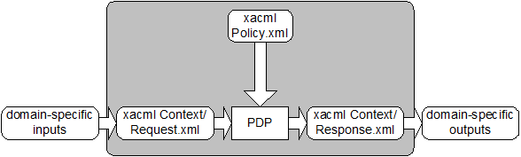

<link rel="stylesheet" href="https://docs.https:templates/css/markdown-styles-v1.7.3a.css" />


<hr style="page-break-before: avoid" />

# eXtensible Access Control Markup Language (XACML) Version 4.0

## Committee Specification Draft 01

## 09 September 2024

&nbsp;

#### This stage:

https://docs.https:xacml/xacml/v4.0/csd01/xacml-v4.0-csd01.md (Authoritative) \
https://docs.https:xacml/xacml/v4.0/csd01/xacml-v4.0-csd01.html \
https://docs.https:xacml/xacml/v4.0/csd01/xacml-v4.0-csd01.pdf

#### Previous stage:

N/A

#### Latest stage:

https://docs.https:xacml/xacml/v4.0/xacml-v4.0.md (Authoritative) \
https://docs.https:xacml/xacml/v4.0/xacml-v4.0.html \
https://docs.https:xacml/xacml/v4.0/xacml-v4.0.pdf

#### Technical Committee:

[OASIS eXtensible Access Control Markup Language (XACML) TC](https://groups.https:communities/tc-community-home2?CommunityKey=67afe552-0921-49b7-9a85-018dc7d3ef1d)

#### Chairs:

Hal Lochhart (harold.w.lochhart@gmail.com), Individual \
Bill Parducci (bill@parducci.net), Individual

#### Editors:

Steven Legg (steven.legg@viewds.com), [ViewDS Identity Solutions](https://www.viewds.com/) \
Cyril Dangerville (cyril.dangerville@thalesgroup.com), [THALES](https://www.thalesgroup.com/)

#### Additional artifacts:

This document is one component of a Work Product that also includes:
* XML schema:  https://docs.https:xacml/xacml/v4.0/csd01/schema/xacml-core-v4-schema-wd-01.xsd.
* Short identifier set: xacml-core-v4-identifiers.xml
* Short identifier set: xacml-core-v4-identifiers.json
* `(Note: Any normative computer language definitions that are part of the Work Product, such as XML instances, schemas and Java(TM) code, including fragments of such, must be (a) well formed and valid, (b) provided in separate plain text files, (c) referenced from the Work Product; and (d) where any definition in these separate files disagrees with the definition found in the specification, the definition in the separate file prevails. Remove this note before submitting for publication.)`

#### Related work:

This specification replaces or supersedes:
* _eXtensible Access Control Markup Language (XACML) Version 3.0 Plus Errata 01_. Edited by Erik Rissanen. OASIS Standard incorporating Approved Errata. https://docs.https:xacml/3.0/xacml-3.0-core-spec-en.html.

This specification is related to:
* Related specifications (include hyperlink, preferably to HTML format) \
`(remove "Related work" section or the "replaces" or "related" subsections if no entries)`

#### Declared XML namespaces:

* `urn:oasis:names:tc:xacml:4.0:core:schema`

#### Abstract:

This specification defines Version 4.0 of the eXtensible Access Control Markup Language.

#### Status:

This document was last revised or approved by the OASIS eXtensible Access Control Markup Language (XACML) TC on the above date. The level of approval is also listed above. Check the "Latest stage" location noted above for possible later revisions of this document. Any other numbered Versions and other technical work produced by the Technical Committee (TC) are listed at https://groups.https:communities/tc-community-home2?CommunityKey=67afe552-0921-49b7-9a85-018dc7d3ef1d#technical.

TC members should send comments on this specification to the TC's email list. 
<!-- text below is not yet supported
Others should send comments to the TC's public comment list at oasis-xacml-comment@connectedcommunity.org.
-->
<!-- text bellow is in use as of June 2024 -->
Others should send comments to the OASIS TC comment list at Technical-Committee-Comments@oasis-open.org.

This specification is provided under the [RF on Limited Terms Mode](https://www.https:policies-guidelines/ipr/#RF-on-Limited-Mode)
 of the [OASIS IPR Policy](https://www.oasis-open.org/policies-guidelines/ipr/), the mode chosen when the Technical Committee was established. For information on whether any patents have been disclosed that may be essential to implementing this specification, and any offers of patent licensing terms, please refer to the Intellectual Property Rights section of the TC's web page (https://www.oasis-open.org/committees/xacml/ipr.php).

Note that any machine-readable content ([Computer Language Definitions](https://www.oasis-open.org/policies-guidelines/tc-process-2017-05-26/#wpComponentsCompLang)) declared Normative for this Work Product is provided in separate plain text files. In the event of a discrepancy between any such plain text file and display content in the Work Product's prose narrative document(s), the content in the separate plain text file prevails.

#### Key words:

The key words "MUST", "MUST NOT", "REQUIRED", "SHALL", "SHALL NOT", "SHOULD", "SHOULD NOT", "RECOMMENDED", "NOT RECOMMENDED", "MAY", and "OPTIONAL" in this document are to be interpreted as described in BCP 14 [[RFC2119](#rfc2119)] and [[RFC8174](#rfc8174)] when, and only when, they appear in all capitals, as shown here.

#### Citation format:

When referencing this specification the following citation format should be used:

**[XACML-v4.0]**

_eXtensible Access Control Markup Language (XACML) Version 4.0_.
Edited by Steven Legg and Cyril Dangerville. 9 September 2024. OASIS Committee Specification Draft 01.
https://docs.oasis-open.org/xacml/xacml/v4.0/csd01/xacml-v4.0-csd01.html.
Latest stage: https://docs.oasis-open.org/xacml/xacml/v4.0/xacml-v4.0.html.

#### Notices

Copyright &copy; OASIS Open 2024. All Rights Reserved.

Distributed under the terms of the OASIS [IPR Policy](https://www.oasis-open.org/policies-guidelines/ipr/).

For complete copyright information please see the full Notices section in an Appendix below.

-------

# Table of Contents

[TOC will be inserted here]

-------

# 1 Introduction

<!-- All text is normative unless otherwise labeled -->

Here is a customized command line which will generate HTML from this markdown file (named `xacml-v4.0-csd01.md`):

```shell
$ pandoc -f gfm+definition_lists -t html xacml-v4.0-csd01.md -c styles/markdown-styles-v1.7.3a.css --toc --toc-depth=5 \ 
         -s --lua-filter diagram.lua --embed-resources \
         --metadata title="eXtensible Access Control Markup Language (XACML) Version 4.0" \
         -o xacml-v4.0-csd01.html
 ```
**N.B.:** before running this command, you must either install Pandoc, Graphviz and PlantUML on your system; or else simply use Docker with the following shell alias:
```
$ alias pandoc='docker run --rm --volume "$(pwd):/data" cdang/pandoc-plantuml'
```
_The Dockerfile (named `Dockerfile`) of the docker image used in the alias above is provided with this markdown file for your convenience if you wish to build it yourself._  

OASIS staff are currently using pandoc 3.0 from https://github.com/jgm/pandoc/releases/tag/3.0.

Generating HTML in OASIS style requires a reference to a .css file containing the HTML styles. The .css file may be either included with the markdown file (like styles/markdown-styles-v1.7.3.css) or a reference to one of the online stylesheets:
- https://docs.oasis-open.org/templates/css/markdown-styles-v1.7.3.css
- https://docs.oasis-open.org/templates/css/markdown-styles-v1.7.3a.css (this one produces HTML that resembles the github display more closely, especially for blocks of code) This template already includes a reference (in HTML code) to this .css file.

Note this command generates a Table of Contents (TOC) in HTML which is located at the top of the HTML document, and which requires additional editing in order to be published in the expected OASIS style. This editing will be handled by OASIS staff during publication.
A TC may use other ways to generate HTML from markdown, which may generate a TOC in a different way. For instance, github can build a TOC.

For PDF output, the command line is the following (different `-t` and `-H` arguments):

```shell
$ pandoc -f gfm+definition_lists -t pdf xacml-v4.0-csd01.md -c styles/markdown-styles-v1.7.3a.css \
         -H custom_latex_header_for_pandoc_pdf_output.tex --toc --toc-depth=5 -s -L diagram.lua \
         --metadata title="eXtensible Access Control Markup Language (XACML) Version 4.0" --embed-resources \
         -o /tmp/xacml-v4.0-csd01.pdf 
```

## 1.1 Changes from earlier Versions

XACML 4.0 differs from XACML 3.0 in the following ways:

* The policy and policy set constructs have been merged into a single construct which is known as a **_policy_** in XACML 4.0.

  * The `<PolicySet>`, `<PolicySetIdReference>`, `<PolicySetCombinerParameters>` and `<PolicySetDefaults>` elements and `PolicySet` type no longer appear.

  * The `PolicyType` type now allows child `<Policy>`, `<PolicyReference>` (was `PolicyIdReference`) and `<PolicyCombinerParameters>` elements.

  * Separate rule and policy **_combining algorithms_** have been replaced with a single collection of **_combining algorithms_**. Legacy **_combining algorithms_** have been removed. The only-one-applicable policy **_combining algorithm_** has been removed.

* The `<Target>` element's type has been changed to be the same as the `<Condition>` element's type (a single Boolean expression). The `<AnyOf>`, `<AllOf>` and `<Match>` elements have been removed.

* The `<Target>` element has been removed from `RuleType`.

* **_Obligations_** and **_advice_** no longer have distinct element definitions. Instead they now share the common `<Notice>` element definition. The difference between **_obligations_** and **_advice_** is indicated by an `IsObligation` XML attribute.

* Users are able to define **_short identifiers_**, which provide simple alias names to use in place of absolute URIs to refer to XACML definitions. A predefined set of **_short identifiers_** for standard-defined URIs is also provided.

* `Attribute` elements in the `Result` no longer have the `IncludeInResult` attribute since it is only used in the `Request`. To differentiate from the `Attribute` elements in the `Request`, these are renamed to `RequestAttribute`. 

* As a result of the previous change, the definition of the `Attributes` element in the `Request` does not apply to `Result` anymore. The `Attributes` element in `Request` (resp. `Result`) becomes `RequestCategory` (resp. `Category`), and contains the new `RequestAttribute` elements with 
  `IncludeInResult` (resp. `Attribute` without `IncludeInResult`). 

* `xml:id` attribute is renamed to 'Id' to have the same XML-agnostic name in all XACML 4.0 / ACAL representation formats including JSON. 

## 1.2 Glossary

<!-- Optional section with suggested subsections -->

### 1.2.1 Definitions of terms

<!-- The following syntax (: definition) for definition lists requires the 'definition_lists' extension enabled in the pandoc command (-f gfm+definition_lists) to be rendered properly. -->

**Access**

: Performing an **_action_**.

**Access control**

: Controlling **_access_** in accordance with a **_policy_**.

**Action**

: An operation on a **_resource_**.

**Advice**

: A **_notice_** providing supplementary information to the **_PEP_** about a **_decision_** from the **_PDP_**.

**Applicable policy**

: The set of **_policies_** that governs **_access_** for a specific **_decision request_**.

**Attribute**

: Characteristic of a **_subject_**, **_resource_**, **_action_** or **_environment_** that may be referenced in a **_predicate_** (see also – **_named attribute_**).

**Authorization decision**

: The result of evaluating **_applicable policy_**, returned by the **_PDP_** to the **_PEP_**. A function that evaluates to `Permit`, `Deny`, `Indeterminate` or `NotApplicable`, and (optionally) a list of **_notices_**.

<!-- For some reason, if the line below is only 'Bag', the line break is missing from the PDF output -->
**Bag (a.k.a. _multiset_)**

: An unordered collection of values, in which there may be duplicate values.

**Combining algorithm**

: The procedure for combining the **_decision_** and **_notices_** from multiple **_policies_** and **_rules_**.

**Condition**

: An expression of **_predicates_**. A function that evaluates to `True`, `False` or `Indeterminate`.

**Conjunctive sequence**

: A sequence of **_predicates_** combined using the logical `AND` operation.

**Context**

: The canonical representation of a **_decision request_** and an **_authorization decision_**.

**Context handler**

: The system entity that converts **_decision requests_** in the native request format to the XACML canonical form, coordinates with Policy Information Points to add attribute values to the request **_context_**, and converts **_authorization decisions_** in the XACML canonical form to the native response format.

**Decision**

: The result of evaluating a **_rule_** or **_policy_**.

**Decision request**

: The request by a **_PEP_** to a **_PDP_** to render an **_authorization decision_**.

**Disjunctive sequence**

: A sequence of **_predicates_** combined using the logical `OR` operation.

**Effect**

: The intended consequence of a satisfied **_rule_** (either `Permit` or `Deny`).

**Environment**

: The set of **_attributes_** that are relevant to an **_authorization decision_** and are independent of a particular **_subject_**, **_resource_** or **_action_**.

**Identifier equality**

: The identifier equality operation which is defined in [Section 7.20](#720-identifier-equality).

**Issuer**

: A set of **_attributes_** describing the source of a **_policy_**.

**Named attribute**

: A specific instance of an **_attribute_**, determined by the **_attribute_** name and type, the identity of the **_attribute_** holder (which may be of type: **_subject_**, **_resource_**, **_action_** or **_environment_**) and (optionally) the identity of the issuing authority.

**Notice**

: An additional information item provided to the **_PEP_** alongside a **_decision_** from the **_PDP_**. A **_notice_** is either an **_obligation_** or **_advice_**. **_Notices_** are potentially generated by **_rules_** and **_policies_** during their evaluation by the **_PDP_**.

**Obligation**

: A **_notice_** specifying an operation that should be performed by the **_PEP_** in conjunction with the enforcement of an **_authorization decision_**.

**Policy**

: A set of **_rules_**, other **_policies_**, an identifier for the **_combining algorithm_** and (optionally) a list of **_notice_** expressions. May be a component of another **_policy_**.

**Policy administration point (PAP)**

: The system entity that creates a **_policy_**.

**Policy decision point (PDP)**

: The system entity that evaluates **_applicable policy_** and renders an **_authorization decision_**. This term is defined in a joint effort by the IETF Policy Framework Working Group and the Distributed Management Task Force (DMTF)/Common Information Model (CIM) in [[RFC3198](#rfc3198)]. This term corresponds to "Access Decision Function" (ADF) in [[ISO10181-3](#iso10181-3)].

**Policy enforcement point (PEP)**

: The system entity that performs **_access control_**, by making **_decision requests_** and enforcing **_authorization decisions_**. This term is defined in a joint effort by the IETF Policy Framework Working Group and the Distributed Management Task Force (DMTF)/Common Information Model (CIM) in [[RFC3198](#rfc3198)]. This term corresponds to "Access Enforcement Function" (AEF) in [[ISO10181-3](#iso10181-3)].

**Policy information point (PIP)**

: The system entity that acts as a source of **_attribute_** values.

**Predicate**

: A statement about **_attributes_** whose truth can be evaluated.

**Resource**

: Data, service or system component.

**Rule**

: An **_effect_**, a **_condition_** and (optionally) a list of **_notice_** expressions. A component of a **_policy_**.

**Short identifier**

: A binding of a simple alias name to a URI or a part thereof.

**Subject**

: An actor whose **_attributes_** may be referenced by a **_predicate_**.

**Target**

: An element of an XACML **_policy_** which matches specified values of **_resource_**, **_subject_**, **_environment_**, **_action_**, or other custom **_attributes_** against those provided in the request **_context_** as a part of the process of determining whether the **_policy_** is applicable to the current decision.

**Type Unification**

: The method by which two type expressions are "unified". The type expressions are matched along their structure. Where a type variable appears in one expression it is then "unified" to represent the corresponding structure element of the other expression, be it another variable or subexpression. All variable assignments must remain consistent in both structures. Unification fails if the two expressions cannot be aligned, either by having dissimilar structure, or by having instance conflicts, such as a variable needs to represent both `xs:string` and `xs:integer`. For a full explanation of **_type unification_**, please see [[Hancock](#hancock)].

### 1.2.2 Related terms

In the field of **_access control_** and authorization there are several closely related terms in common use. For purposes of precision and clarity, certain of these terms are not used in this specification.

For instance, the term **_attribute_** is used in place of the terms: group and role.

In place of the terms: privilege, permission, authorization, entitlement and right, we use the term **_rule_**.

The term object is also in common use, but we use the term **_resource_** in this specification.

Requestors and initiators are covered by the term **_subject_**.

### 1.2.3 Document conventions

This specification contains schema conforming to W3C XML Schema and normative text to describe the syntax and semantics of XML-encoded **_policy_** statements.
```
Listings of XACML schema and code listings appear like this.
```

Conventional XML namespace prefixes are used throughout the listings in this specification to stand for their respective namespaces as follows, whether or not a namespace declaration is present in the example:

* The prefix `xacml:` stands for the XACML 4.0 namespace.

* The prefix `ds:` stands for the W3C XML Signature namespace [[DS](#ds)].

* The prefix `xs:` stands for the W3C XML Schema namespace [[XS](#xs)].

* The prefix `xf:` stands for the XPath and XQuery Functions and Operators 3.1 specification namespace [[XF](#xf)].

* The prefix `xml:` stands for the XML namespace https://www.w3.org/XML/1998/namespace.

This specification uses the following typographical conventions in text: `<XACMLElement>`, `<ns:ForeignElement>`, `Attribute`, `Datatype`, `OtherCode`. Terms in **_bold-face italic_** are intended to have the meaning defined in the Glossary.

## 1.3 Schema organization and namespaces

The XACML syntax is defined in a schema associated with the following XML namespace:
<!-- Newline to fit on PDF page -->
`urn:oasis:names:tc:xacml:4.0:core:schema`

-------

# 2 Background (non-normative)
The "economics of scale" have driven computing platform vendors to develop products with very generalized functionality, so that they can be used in the widest possible range of situations. "Out of the box", these products have the maximum possible privilege for accessing data and executing software, so that they can be used in as many application environments as possible, including those with the most permissive security policies. In the more common case of a relatively restrictive security policy, the platform's inherent privileges must be constrained by configuration.

The security policy of a large enterprise has many elements and many points of enforcement. Elements of policy may be managed by the Information Systems department, by Human Resources, by the Legal department and by the Finance department. And the policy may be enforced by the extranet, mail, WAN, and remote-access systems; platforms which inherently implement a permissive security policy. The current practice is to manage the configuration of each point of enforcement independently in order to implement the security policy as accurately as possible. Consequently, it is an expensive and unreliable proposition to modify the security policy. Moreover, it is virtually impossible to obtain a consolidated view of the safeguards in effect throughout the enterprise to enforce the policy. At the same time, there is increasing pressure on corporate and government executives from consumers, shareholders, and regulators to demonstrate "best practice" in the protection of the information assets of the enterprise and its customers.

For these reasons, there is a pressing need for a common language for expressing security policy. If implemented throughout an enterprise, a common policy language allows the enterprise to manage the enforcement of all the elements of its security policy in all the components of its information systems. Managing security policy may include some or all of the following steps: writing, reviewing, testing, approving, issuing, combining, analyzing, modifying, withdrawing, retrieving, and enforcing policy.

XML is a natural choice as the basis for the common security-policy language, due to the ease with which its syntax and semantics can be extended to accommodate the unique requirements of this application, and the widespread support that it enjoys from all the main platform and tool vendors.

## 2.1 Requirements

The basic requirements of a policy language for expressing information system security policy are:

* To provide a method for combining individual **_rules_** and **_policies_** into a single **_policy_** that applies to a particular **_decision request_**.

* To provide a method for flexible definition of the procedure by which **_rules_** and **_policies_** are combined.

* To provide a method for dealing with multiple **_subjects_** acting in different capacities.

* To provide a method for basing an **_authorization decision_** on **_attributes_** of the **_subject_** and **_resource_**.

* To provide a method for dealing with multi-valued **_attributes_**.

* To provide a method for basing an **_authorization decision_** on the contents of an information **_resource_**.

* To provide a set of logical and mathematical operators on **_attributes_** of the **_subject_**, **_resource_** and **_environment_**.

* To provide a method for handling a distributed set of **_policy_** components, while abstracting the method for locating, retrieving and authenticating the **_policy_** components.

* To provide a method for rapidly identifying the **_policy_** that applies to a given **_action_**, based upon the values of **_attributes_** of the **_subjects_**, **_resource_** and **_action_**.

* To provide an abstraction-layer that insulates the **_policy_**-writer from the details of the application environment.

* To provide a method for specifying a set of **_actions_** that must be performed in conjunction with **_policy_** enforcement.

The motivation behind XACML is to express these well-established ideas in the field of **_access control_** policy using an extension language of XML. The XACML solutions for each of these requirements are discussed in the following sections.

## 2.2 Rule and policy combining

The complete **_policy_** applicable to a particular **_decision_** request may be composed of a number of individual **_rules_** or **_policies_**. For instance, in a personal privacy application, the owner of the personal information may define certain aspects of disclosure policy, whereas the enterprise that is the custodian of the information may define certain other aspects. In order to render an **_authorization decision_**, it must be possible to combine the two separate **_policies_** to form the single **_policy_** applicable to the request.

XACML defines two top-level **_policy_** elements: `<Rule>` and `<Policy>`. The `<Rule>` element contains a Boolean expression that can be evaluated in isolation, but that is not intended to be accessed in isolation by a **_PDP_**. So, it is not intended to form the basis of an **_authorization decision_** by itself. It is intended to exist in isolation only within an XACML **_PAP_**, where it may form the basic unit of management.

The `<Policy>` element contains a set of `<Rule>` or other `<Policy>` elements and a specified procedure for combining the results of their evaluation. It is the basic unit of **_policy_** used by the **_PDP_**, and so it is intended to form the basis of an **_authorization decision_**. It is also the standard means for combining separate **_policies_** into a single combined **_policy_**.

Hinton et al [[Hinton94](#hinton94)] discuss the question of the compatibility of separate **_policies_** applicable to the same **_decision request_**.

## 2.3 Combining algorithms

XACML defines a number of **_combining algorithms_** that can be identified by a `CombiningAlgId` attribute of the `<Policy>` element. The **_combining algorithm_** defines a procedure for arriving at an **_authorization decision_** given the individual results of evaluation of a set of **_rules_** and **_policies_**. Some examples of standard **_combining algorithms_** are (see [Appendix G](#appendix-g-combining-algorithms-normative) for a full list of standard **_combining algorithms_**):

* Deny-overrides (Ordered and Unordered),

* Permit-overrides (Ordered and Unordered) and

* First-applicable

In the case of the Deny-overrides algorithm, if a single `<Rule>` or `<Policy>` element is encountered that evaluates to `Deny`, then, regardless of the evaluation result of the other `<Rule>` or `<Policy>` elements in the **_applicable policy_**, the combined result is `Deny`.

Likewise, in the case of the Permit-overrides algorithm, if a single `Permit` result is encountered, then the combined result is `Permit`.

In the case of the `First-applicable` **_combining algorithm_**, the combined result is the same as the result of the first `<Rule>` or `<Policy>` element in the list of **_rules_** and **_policies_** that is applicable to the **_decision request_**.

**_Policies_** may take parameters that modify the behavior of the **_combining algorithms_**. However, none of the standard **_combining algorithms_** is affected by parameters.

Users of this specification may, if necessary, define their own **_combining algorithms_**.

## 2.4 Multiple subjects

**_Access control policies_** often place requirements on the **_actions_** of more than one **_subject_**. For instance, the **_policy_** governing the execution of a high-value financial transaction may require the approval of more than one individual, acting in different capacities. Therefore, XACML recognizes that there may be more than one **_subject_** relevant to a **_decision request_**. Different **_attribute_** categories are used to differentiate between **_subjects_** acting in different capacities. Some standard values for these **_attribute_** categories are specified, and users may define additional ones.

## 2.5 Policies based on subject and resource attributes

Another common requirement is to base an **_authorization_** decision on some characteristic of the **_subject_** other than its identity. Perhaps, the most common application of this idea is the **_subject_**'s role [[RBAC](#rbac)]. XACML provides facilities to support this approach. **_Attributes_** of **_subjects_** contained in the request **_context_** may be identified by the `<AttributeDesignator>` element. This element contains a URN that identifies the **_attribute_**. Alternatively, the `<AttributeSelector>` element may contain an XPath expression over the `<Content>` element of the **_subject_** to identify a particular **_subject attribute_** value by its location in the **_context_** (see [Section 2.11](#211-abstraction-layer) for an explanation of **_context_**).

XACML provides a standard way to reference the **_attributes_** defined in the LDAP series of specifications [[LDAP-1](#ldap-1)], [[LDAP-2](#ldap-2)]. This is intended to encourage implementers to use standard **_attribute_** identifiers for some common **_subject attributes_**.

Another common requirement is to base an **_authorization decision_** on some characteristic of the **_resource_** other than its identity. XACML provides facilities to support this approach. **_Attributes_** of the **_resource_** may be identified by the `<AttributeDesignator>` element. This element contains a URN that identifies the **_attribute_**. Alternatively, the `<AttributeSelector>` element may contain an XPath expression over the `<Content>` element of the **_resource_** to identify a particular **_resource attribute_** value by its location in the **_context_**.

## 2.6 Multi-valued attributes

The most common techniques for communicating **_attributes_** (LDAP, XPath, SAML, etc.) support multiple values per **_attribute_**. Therefore, when an XACML **_PDP_** retrieves the value of a **_named attribute_**, the result may contain multiple values. A collection of such values is called a **_bag_**. A **_bag_** differs from a set in that it may contain duplicate values, whereas a set may not. Sometimes this situation represents an error. Sometimes the XACML **_rule_** is satisfied if any one of the **_attribute_** values meets the criteria expressed in the **_rule_**.

XACML provides a set of functions that allow a **_policy_** writer to be absolutely clear about how the **_PDP_** should handle the case of multiple **_attribute_** values. These are the "higher-order" functions (see [Appendix E.3](#e3-functions)).

## 2.7 Policies based on resource contents

In many applications, it is required to base an **_authorization decision_** on data contained in the information **_resource_** to which **_access_** is requested. For instance, a common component of privacy policy is that a person should be allowed to read records for which he or she is the **_subject_**. The corresponding **_policy_** must contain a reference to the **_subject_** identified in the information **_resource_** itself.

XACML provides facilities for doing this when the information **_resource_** can be represented as an XML document. The `<AttributeSelector>` element may contain an XPath expression over the `<Content>` element of the **_resource_** to identify data in the information **_resource_** to be used in the **_policy_** evaluation.

In cases where the information **_resource_** is not an XML document, specified **_attributes_** of the **_resource_** can be referenced, as described in [Section 2.5](#25-policies-based-on-subject-and-resource-attributes).

## 2.8 Operators

Information security **_policies_** operate upon **_attributes_** of **_subjects_**, the **_resource_**, the **_action_** and the **_environment_** in order to arrive at an **_authorization decision_**. In the process of arriving at the **_authorization decision_**, **_attributes_** of many different types may have to be compared or computed. For instance, in a financial application, a person's available credit may have to be calculated by adding their credit limit to their account balance. The result may then have to be compared with the transaction value. This sort of situation gives rise to the need for arithmetic operations on **_attributes_** of the **_subject_** (account balance and credit limit) and the **_resource_** (transaction value).

Even more commonly, a **_policy_** may identify the set of roles that are permitted to perform a particular **_action_**. The corresponding operation involves checking whether there is a non-empty intersection between the set of roles occupied by the **_subject_** and the set of roles identified in the **_policy_**; hence the need for set operations.

XACML includes a number of built-in functions and a method of adding non-standard functions. These functions may be nested to build arbitrarily complex expressions. This is achieved with the `<Apply>` element. The `<Apply>` element has an XML attribute called `FunctionId` that identifies the function to be applied to the contents of the element. Each standard function is defined for specific argument data-type combinations, and its return data-type is also specified. Therefore, data-type consistency of the **_policy_** can be checked at the time the **_policy_** is written or parsed. And, the types of the data values presented in the request **_context_** can be checked against the values expected by the **_policy_** to ensure a predictable outcome.

In addition to operators on numerical and set arguments, operators are defined for date, time and duration arguments.

Relationship operators (equality and comparison) are also defined for a number of data-types, including the RFC822 and X.500 name-forms, strings, URIs, etc.

Also noteworthy are the operators over Boolean data-types, which permit the logical combination of **_predicates_** in a **_rule_**. For example, a **_rule_** may contain the statement that **_access_** may be permitted during business hours AND from a terminal on business premises.

The XACML method of representing functions borrows from MathML [[MathML](#mathml)] and from the XPath and XQuery Functions and Operators 3.1 specification [[XF](#xf)].

## 2.9 Policy distribution

In a distributed system, individual **_policy_** statements may be written by several **_policy_** writers and enforced at several enforcement points. In addition to facilitating the collection and combination of independent **_policy_** components, this approach allows **_policies_** to be updated as required. XACML **_policy_** statements may be distributed in any one of a number of ways. But, XACML does not describe any normative way to do this. Regardless of the means of distribution, **_PDPs_** are expected to confirm, by examining the **_policy_**'s `<Target>` element that the **_policy_** is applicable to the **_decision request_** that it is processing.

`<Policy>` elements may be attached to the information **_resources_** to which they apply, as described by Perritt [[Perritt93](#perritt93)]. Alternatively, `<Policy>` elements may be maintained in one or more locations from which they are retrieved for evaluation. In such cases, the **_applicable policy_** may be referenced by an identifier or locator closely associated with the information **_resource_**.

## 2.10 Policy indexing

For efficiency of evaluation and ease of management, the overall security policy in force across an enterprise may be expressed as multiple independent **_policy_** components. In this case, it is necessary to identify and retrieve the **_applicable policy_** statement and verify that it is the correct one for the requested **_action_** before evaluating it. This is the purpose of the `<Target>` element in XACML.

Two approaches are supported:

1. **_Policy_** statements may be stored in a database. In this case, the **_PDP_** should form a database query to retrieve just those **_policies_** that are applicable to the set of **_decision requests_** to which it expects to respond. Additionally, the **_PDP_** should evaluate the `<Target>` element of the retrieved **_policy_** statements as defined by the XACML specification.
2. Alternatively, the **_PDP_** may be loaded with all available **_policies_** and evaluate their `<Target>` elements in the context of a particular **_decision request_**, in order to identify the **_policies_** that are applicable to that request.

The use of constraints limiting the applicability of a policy was described by Sloman [[Sloman94](#sloman94)].

## 2.11 Abstraction layer

**_PEPs_** come in many forms. For instance, a **_PEP_** may be part of a remote-access gateway, part of a Web server or part of an email user-agent, etc. It is unrealistic to expect that all **_PEPs_** in an enterprise do currently, or will in the future, issue **_decision requests_** to a **_PDP_** in a common format. Nevertheless, a particular **_policy_** may have to be enforced by multiple **_PEPs_**. It would be inefficient to force a **_policy_** writer to write the same **_policy_** several different ways in order to accommodate the format requirements of each **_PEP_**. Similarly **_attributes_** may be contained in various envelope types (e.g. X.509 attribute certificates, SAML attribute assertions, etc.). Therefore, there is a need for a canonical form of the request and response handled by an XACML **_PDP_**. This canonical form is called the XACML **_context_**. Its syntax is defined in XML schema.

Naturally, XACML-conformant **_PEPs_** may issue requests and receive responses in the form of an XACML **_context_**. But, where this situation does not exist, an intermediate step is required to convert between the request/response format understood by the **_PEP_** and the XACML **_context_** format understood by the **_PDP_**.

The benefit of this approach is that **_policies_** may be written and analyzed independently of the specific environment in which they are to be enforced.

In the case where the native request/response format is specified in XML Schema (e.g. a SAML-conformant **_PEP_**), the transformation between the native format and the XACML **_context_** may be specified in the form of an Extensible Stylesheet Language Transformation [[XSLT](#xslt)].

Similarly, in the case where the **_resource_** to which **_access_** is requested is an XML document, the **_resource_** itself may be included in, or referenced by, the request **_context_**. Then, through the use of XPath expressions [[XPath](#xpath)] in the **_policy_**, values in the **_resource_** may be included in the **_policy_** evaluation.

## 2.12 Actions performed in conjunction with enforcement

In many applications, **_policies_** specify actions that MUST be performed, either instead of, or in addition to, actions that MAY be performed. This idea was described by Sloman [[Sloman94](#sloman94)]. XACML provides facilities to specify actions that MUST be performed in conjunction with **_policy_** evaluation through **_obligation_** **_notices_**. This idea was described as a provisional action by Kudo [[Kudo00](#kudo00)]. There are no standard definitions for these actions in version 3.0 of XACML. Therefore, bilateral agreement between a **_PAP_** and the **_PEP_** that will enforce its **_policies_** is required for correct interpretation. **_PEPs_** that conform to v3.0 of XACML are required to deny **_access_** unless they understand and can discharge all of the **_obligation_** **_notices_** associated with the **_applicable policy_**. **_Obligation_** **_notices_** are returned to the **_PEP_** for enforcement.

## 2.13 Supplemental information about a decision

In some applications it is helpful to specify supplemental information about a decision. XACML provides facilities to specify supplemental information about a decision through **_advice_** **_notices_**. Such **_advice_** may be safely ignored by the **_PEP_**.

-------

# 3 Models (non-normative)

The data-flow model and language model of XACML are described in the following sub-sections.

## 3.1 Data-flow model

The major actors in the XACML domain are shown in the data-flow diagram of [Figure 1](#figure-1---data-flow-diagram).

###### Figure 1 - Data-flow diagram

<!--  -->


<span> </span>
: Note: some of the data-flows shown in the diagram may be facilitated by a repository. For instance, the communications between the **_context handler_** and the **_PIP_** or the communications between the **_PDP_** and the **_PAP_** may be facilitated by a repository. The XACML specification is not intended to place restrictions on the location of any such repository, or indeed to prescribe a particular communication protocol for any of the data-flows.

The model operates by the following steps.

1. **_PAPs_** write **_policies_** and make them available to the **_PDP_**. These **_policies_** represent the complete **_policy_** for a specified **_target_**.
2. The **_access_** requester sends a request for **_access_** to the **_PEP_**.
3. The **_PEP_** sends the request for **_access_** to the **_context handler_** in its native request format, optionally including **_attributes_** of the **_subjects_**, **_resource_**, **_action_**, **_environment_** and other categories.
4. The **_context handler_** constructs an XACML request **_context_**, optionally adds **_attributes_**, and sends it to the **_PDP_**.
5. The **_PDP_** requests any additional **_subject_**, **_resource_**, **_action_**, **_environment_** and other categories (not shown) **_attributes_** from the **_context handler_**.
6. The **_context handler_** requests the **_attributes_** from a **_PIP_**.
7. The **_PIP_** obtains the requested **_attributes_**.
8. The **_PIP_** returns the requested **_attributes_** to the **_context handler_**.
9. Optionally, the **_context handler_** includes the **_resource_** in the **_context_**.
10. The **_context handler_** sends the requested **_attributes_** and (optionally) the **_resource_** to the **_PDP_**. The **_PDP_** evaluates the **_policy_**.
11. The **_PDP_** returns the response **_context_** (including the **_authorization decision_**) to the **_context handler_**.
12. The **_context handler_** translates the response **_context_** to the native response format of the **_PEP_**. The **_context handler_** returns the response to the **_PEP_**.
13. The **_PEP_** fulfills the **_obligation_** **_notices_**.
14. (Not shown) If **_access_** is permitted, then the **_PEP_** permits **_access_** to the **_resource_**; otherwise, it denies **_access_**.

## 3.2 XACML context

XACML is intended to be suitable for a variety of application environments. The core language is insulated from the application environment by the XACML **_context_**, as shown in [Figure 2](#figure-2---xacml-context), in which the scope of the XACML specification is indicated by the shaded area. The XACML **_context_** is defined in XML schema, describing a canonical representation for the inputs and outputs of the **_PDP_**. **_Attributes_** referenced by an instance fof XACML **_policy_** may be in the form of XPath expressions over the `<Content>` elements of the **_context_**, or **_attribute_** designators that identify the **_attribute_** by its category, identifier, data-type and (optionally) its issuer. Implementations must convert between the **_attribute_** representations in the application environment (e.g., SAML, J2SE, CORBA, and so on) and the **_attribute_** representations in the XACML **_context_**. How this is achieved is outside the scope of the XACML specification. In some cases, such as SAML, this conversion may be accomplished in an automated way through the use of an XSLT transformation.

###### Figure 2 - XACML context

<!--  -->


<span> </span>
: Note: The **_PDP_** is not required to operate directly on the XACML representation of a **_policy_**. It may operate directly on an alternative representation.

Typical categories of **_attributes_** in the **_context_** are the **_subject_**, **_resource_**, **_action_** and **_environment_**, but users may define their own categories as needed. See [Appendix F.2](#f2-attribute-categories) for suggested **_attribute_** categories.

See [Section 7.4.5](#745-attribute-retrieval) for a more detailed discussion of the request **_context_**.

## 3.3 Policy language model

The **_policy_** language model is shown in [Figure 3](#figure-3---policy-language-model). The main components of the model are:

* **_Rule_**; and

* **_Policy_**.

These are described in the following sub-sections.

###### Figure 3 - Policy language model

<!--  -->
<div style="text-align: center;">


</div>

### 3.3.1 Rule

A **_rule_** is the most elementary unit of **_policy_**. It may exist in isolation only within one of the major actors of the XACML domain. In order to exchange **_rules_** between major actors, they must be encapsulated in a **_policy_**. A **_rule_** can be evaluated on the basis of its contents. The main components of a **_rule_** are:

* an **_effect_**,

* a **_condition_**, and

* **_notice_** expressions.

These are discussed in the following sub-sections.

#### 3.3.1.1 Condition

The **_condition_** defines the set of requests to which the **_rule_** is intended to apply in the form of a logical expression on **_attributes_** in the request. If the **_rule_** is intended to apply to all entities of a particular data-type, then the corresponding entity is omitted from the **_condition_**. An XACML **_PDP_** verifies that the matches defined by the **_condition_** are satisfied by the **_attributes_** in the request **_context_**.

The `<Condition>` element may be absent from a `<Rule>`. In this case, the **_condition_** of the `<Rule>` is the same as the **_target_** of the parent `<Policy>` element.

Certain **_subject_** name-forms, **_resource_** name-forms and certain types of **_resource_** are internally structured. For instance, the X.500 directory name-form and RFC 822 name-form are structured **_subject_** name-forms, whereas an account number commonly has no discernible structure. UNIX file-system path-names and URIs are examples of structured **_resource_** name-forms. An XML document is an example of a structured **_resource_**.

Generally, the name of a node (other than a leaf node) in a structured name-form is also a legal instance of the name-form. So, for instance, the RFC822 name `med.example.com` is a legal RFC822 name identifying the set of mail addresses hosted by the med.example.com mail server. The XPath value md:record/md:patient/ is a legal XPath value identifying a node-set in an XML document.

The question arises: how should a name that identifies a set of **_subjects_** or **_resources_** be interpreted by the **_PDP_**, whether it appears in a **_policy_** or a request **_context_**? Are they intended to represent just the node explicitly identified by the name, or are they intended to represent the entire sub-tree subordinate to that node?

In the case of **_subjects_**, there is no real entity that corresponds to such a node. So, names of this type always refer to the set of **_subjects_** subordinate in the name structure to the identified node. Consequently, non-leaf **_subject_** names should not be used in equality functions, only in match functions, such as `urn:oasis:names:tc:xacml:1.0:function:rfc822Name-match` 
<!-- Newline to fit on PDF page -->
instead of `urn:oasis:names:tc:xacml:1.0:function:rfc822Name-equal` (see [Appendix E.3.14](#e314-special-match-functions)).

#### 3.3.1.2 Effect

The **_effect_** of the **_rule_** indicates the **_rule_**-writer's intended consequence of a `True` evaluation for the **_condition_**. Two values are allowed: `Permit` and `Deny`.

#### 3.3.1.4 Notice expressions

**_Notice_** expressions may be added by the writer of the **_rule_**.

When a **_PDP_** evaluates a **_rule_** containing **_notice_** expressions, it evaluates the **_notice_** expressions into **_notices_** and returns certain of those **_notices_** to the **_PEP_** in the response **_context_**. [Section 7.18](#718-notices) explains which **_notices_** are to be returned.

In contrast to **_obligation_** **_notices_**, **_advice_** **_notices_** may be safely ignored by the **_PEP_**.

### 3.3.2 Policy

From the data-flow model one can see that **_rules_** are not exchanged amongst system entities. Therefore, a **_PAP_** combines **_rules_** in a **_policy_**. A **_policy_** comprises four main components:

* a **_target_**;

* a **_combining algorithm_** identifier;

* a set of **_rules_** and **_policies_** and

* **_notice_** expressions.

**_Rules_** are described above. The remaining components are described in the following sub-sections.

#### 3.3.2.1 Policy target

An XACML `<Policy>` element contains a `<Target>` element that specifies the set of requests to which it applies. The `<Target>` of a `<Policy>` may be declared by the writer of the `<Policy>`, or it may be calculated from the `<Target>` and `<Condition>` elements of the `<Policy>` and `<Rule>` elements (respectively) that it contains.

A system entity that calculates a `<Target>` in this way is not defined by XACML, but there are two logical methods that might be used. In one method, the `<Target>` element of the outer `<Policy>` (the "outer component") is calculated as the union of all the `<Target>` elements of the referenced `<Policy>` elements and the `<Condition>` elements of the referenced `<Rule>` elements (the "inner components"). In another method, the `<Target>` element of the outer component is calculated as the intersection of all the `<Target>` and `<Condition>` elements of the inner components. The results of evaluation in each case will be very different: in the first case, the `<Target>` element of the outer component makes it applicable to any **_decision request_** that matches the `<Target>` or `<Condition>` element of at least one inner component; in the second case, the `<Target>` element of the outer component makes it applicable only to **_decision requests_** that match the `<Target>` and `<Condition>` elements of every inner component. Note that computing the intersection of a set of `<Target>` and `<Condition>` elements is likely only practical if the data-model is relatively simple.

In cases where the `<Target>` of a `<Policy>` is declared by the **_policy_** writer, any component `<Rule>` elements in the `<Policy>` that have the same `<Condition>` element as the `<Target>` element may omit the `<Condition>` element. Such `<Rule>` elements inherit the `<Target>` of the `<Policy>` in which they are contained.

#### 3.3.2.2 Combining algorithm

The **_combining algorithm_** specifies the procedure by which the results of evaluating the component **_rules_** and **_policies_** are combined when evaluating the **_policy_**, i.e. the `Decision` value placed in the response **_context_** by the **_PDP_** is the result of evaluating the **_policy_**, as defined by the **_combining algorithm_**. A **_policy_** may have combining parameters that affect the operation of the **_combining algorithm_**.

See [Appendix G](#appendix-g-combining-algorithms-normative) for definitions of the normative **_combining algorithms_**.

#### 3.3.2.3 Notice expressions

The writer of a **_policy_** may add **_notice_** expressions to the **_policy_**, in addition to those contained in the component **_rules_** and **_policies_**.

When a **_PDP_** evaluates a **_policy_** containing **_notice_** expressions, it evaluates the **_notice_** expressions into **_notices_** and returns certain of those **_notices_** to the **_PEP_** in the response **_context_**. [Section 7.18](#718-notices) explains which **_notices_** are to be returned. In contrast to **_obligation_** **_notices_**, **_advice_** **_notices_** may be safely ignored by the **_PEP_**.

-------

# 4 Examples (non-normative)

This section contains two examples of the use of XACML for illustrative purposes. The first example is a relatively simple one to illustrate the use of **_target_**, **_context_**, matching functions and **_subject attributes_**. The second example additionally illustrates the use of the **_combining algorithm_**, **_conditions_** and **_notices_**.

## 4.1 Example one

_To be provided._

### 4.1.1 Example policy

_To be provided._

### 4.1.2 Example request context

_To be provided._

### 4.1.3 Example response context

_To be provided._

## 4.2 Example two

### 4.2.1 Example medical record instance

_To be provided._

### 4.2.2 Example request context

_To be provided._

### 4.2.3 Example plain-language rules

The following plain-language rules are to be enforced.

Rule 1:

: A person, identified by his or her patient number, may read any record for which he or she is the designated patient.

Rule 2:

: A person may read any record for which he or she is the designated parent or guardian, and for which the patient is under 16 years of age.

Rule 3:

: A physician may write to any medical element for which he or she is the designated primary care physician, provided an email is sent to the patient.

Rule 4:

: An administrator shall not be permitted to read or write to medical elements of a patient record.

These **_rules_** may be written by different **_PAPs_** operating independently, or by a single **_PAP_**.

### 4.2.4 Example short identifier set

Policy writers are able to define sets of **_short identifiers_** to provide simple alias names to use in place of URIs. A set with the identifier `urn:oasis:names:tc:xacml:4.0:core:identifiers` is defined by XACML for the various identifiers assigned by this specification. However, a deployment will usually have need for additional identifiers, especially for locally-defined **_attributes_**, so it is usually desirable to define a set of additional **_short identifiers_** to use in the deployment.

The following **_short identifier_** set, in both the XML and JSON representations, defines **_short identifiers_** for the additional **_attributes_** in this example and also imports the standardized set.

```
<ShortIdSet xmlns="urn:oasis:names:tc:xacml:4.0:core:schema"
  ShortIdSetId="urn:oasis:names:tc:xacml:4.0:example:identifiers"/>

  <!-- Include the short identifiers for standard URIs. -->
  <ShortIdSetReference>urn:oasis:names:tc:xacml:4.0:core:identifiers</ShortIdSetReference>

  <!-- These are the short identifiers specific to the deployment. -->

  <!-- Attributes -->
  <ShortId Name="patient-number" Value="urn:oasis:names:tc:xacml:4.0:example:attribute:patient-number"/>
  <ShortId Name="collection" Value="urn:oasis:names:tc:xacml:4.0:example:attribute:collection"/>

</ShortIdSet>
```

```
{
  "ShortIdSetId":"urn:oasis:names:tc:xacml:4.0:example:identifiers",
  "ShortIdSetReference":["urn:oasis:names:tc:xacml:4.0:core:identifiers"],
  "ShortId":[
    { "Name":"patient-number", Value="urn:oasis:names:tc:xacml:4.0:example:attribute:patient-number" },
    { "Name":"collection", Value="urn:oasis:names:tc:xacml:4.0:example:attribute:collection" }
  ]
}
```

### 4.2.5 Example XACML rule instances

#### 4.2.5.1 Rule 1

Rule 1 illustrates a **_policy_** with a simple **_rule_** containing a `<Condition>` element. It also illustrates the use of the `<VariableDefinition>` element to define an expression that may be used throughout the **_policy_**. The following XACML **_policy_**, respectively in XML and JSON, contains a **_rule_** instance expressing Rule 1 (the numbers in square brackets on the left-hand side are for referencing purposes and are not part of the **_policy_** in either representation):

```
[01] <?xml version="1.0" encoding="UTF-8"?>
[02] <Policy
[03]   xmlns="urn:oasis:names:tc:xacml:4.0:core:schema"
[04]   PolicyId="urn:oasis:names:tc:xacml:4.0:example:policyid:1"
[05]   CombiningAlgId="deny-overrides"
[06]   Version="1.0">
[07]   <ShortIdSetReference>urn:oasis:names:tc:xacml:4.0:example:identifiers</ShortIdSetReference>
[08]   <VariableDefinition VariableId="17590034">
[11]     <Apply FunctionId="string-equal">
[14]       <Apply FunctionId="string-one-and-only">
[17]         <AttributeDesignator
[18]           Category="access-subject"
[19]           AttributeId="patient-number"
[20]           DataType="string"/>
[23]       </Apply>
[25]       <Apply FunctionId="string-one-and-only">
[28]         <AttributeDesignator
[29]           Category="resource"
[30]           AttributeId="patient-number"
[31]           DataType="string"/>
[34]       </Apply>
[36]     </Apply>
[38]   </VariableDefinition>
[41]   <Rule RuleId="Rule 1" Effect="Permit">
[44]     <Description>A person may read any medical record in the http://www.med.example.com/springfield-hospital collection for which he or she is the designated patient.</Description>
[45]     <Condition>
[46]       <Apply FunctionId="and">
[49]         <Apply FunctionId="any-of">
[52]           <Function FunctionId="anyURI-equal"/>
[56]           <AttributeValue DataType="anyURI"
[58]             >http://www.med.example.com/springfield-hospital</AttributeValue>
[61]           <AttributeDesignator
[62]             Category="resource"
[63]             AttributeId="collection"
[64]             DataType="anyURI"/>
[67]         </Apply>
[69]         <Apply FunctionId="any-of">
[72]           <Function FunctionId="string-equal"/>
[76]           <AttributeValue DataType="string">read</AttributeValue>
[81]           <AttributeDesignator
[82]             Category="action"
[83]             AttributeId="action-id"
[84]             DataType="string"/>
[87]         </Apply>
[89]         <VariableReference VariableId="17590034"/>
[93]       </Apply>
[94]     </Condition>
[95]   </Rule>
[97] </Policy>
```

```
[02] {
[04]   "PolicyId":"urn:oasis:names:tc:xacml:4.0:example:policyid:1",
[05]   "CombiningAlgId":"deny-overrides",
[06]   "Version":"1.0",
[07]   "ShortIdSetReference":["urn:oasis:names:tc:xacml:4.0:example:identifiers"],
[08]   "VariableDefinition":[{
[09]     "VariableId":"17590034",
[10]     "Expression":{
[11]       "Apply":{
[12]         "FunctionId":"string-equal",
[13]         "Argument":[{
[14]           "Apply":{
[15]             "FunctionId":"string-one-and-only",
[16]             "Argument":[{
[17]               "AttributeDesignator":{
[18]                 "Category":"access-subject",
[19]                 "AttributeId":"patient-number",
[20]                 "DataType":"string"
[21]               }
[22]             }]
[23]           }
[24]         },{
[25]           "Apply":{
[26]             "FunctionId":"string-one-and-only",
[27]             "Argument":[{
[28]               "AttributeDesignator":{
[29]                 "Category":"resource",
[30]                 "AttributeId":"patient-number",
[31]                 "DataType":"string"
[32]               }
[33]             }]
[34]           }
[35]         }]
[36]       }
[37]     }]
[38]   }],
[39]   "ToBeCombined":[{
[41]     "Rule":{
[42]       "RuleId":"Rule 1",
[43]       "Effect":"Permit",
[44]       "Description":"A person may read any medical record in the http://www.med.example.com/springfield-hospital collection for which he or she is the designated patient",
[45]       "Condition":{
[46]         "Apply":{
[47]           "FunctionId":"and",
[48]           "Argument":[{
[49]             "Apply":{
[50]               "FunctionId":"any-of",
[51]               "Argument":[{
[52]                 "Function":{
[54]                   "FunctionId":"anyURI-equal"
[54]                 }
[55]               },{
[56]                 "TypedValue":{
[57]                   "DataType":"anyURI",
[58]                   "Value":"http://www.med.example.com/springfield-hospital"
[59]                 }
[60]               },{
[61]                 "AttributeDesignator":{
[62]                   "Category":"resource",
[63]                   "AttributeId":"collection",
[64]                   "DataType":"anyURI"
[65]                 }
[66]               }]
[67]             }
[68]           },{
[69]             "Apply":{
[70]               "FunctionId":"any-of",
[71]               "Argument":[{
[72]                 "Function":{
[73]                   "FunctionId":"string-equal"
[74]                 }
[75]               },{
[76]                 "TypedValue":{
[77]                   "DataType":"string",
[78]                   "Value":"read"
[79]                 }
[80]               },{
[81]                 "AttributeDesignator":{
[82]                   "Category":"action",
[83]                   "AttributeId":"action-id",
[84]                   "DataType":"string"
[85]                 }
[86]               }]
[87]             }
[88]           },{
[89]             "VariableReference":{
[90]               "VariableId":"17590034"
[91]             }
[92]           }]
[93]         }
[94]       }
[95]     }
[96]   }]
[97] }
```

[07] A reference to a **_short identifier_** set imported into the **_policy_**. The names of the **_short identifiers_** in the set are available to use in this **_policy_**.

[08] - [38] A variable definition. It defines an expression that evaluates the truth of the statement: the patient-number **_subject attribute_** is equal to the patient-number **_attribute_** in the **_resource_**.

[11] - [12] The `FunctionId` component names the function to be used for comparison. In this case, the function is nominated with the **_short identifier_** name `string-equal`, which evaluates to `urn:oasis:names:tc:xacml:1.0:function:string-equal` using the imported **_short identifier_** set. This function takes two arguments of type `http://www.w3.org/2001/XMLSchema#string`.

[17] - [21] An attribute designator that selects a **_bag_** of values for the patient-number **_subject attribute_** in the request **_context_**.

[18] The `Category` component names the category from which the desired **_attribute_** will be obtained. In this case, the category is nominated with the **_short identifier_** name `access-subject`, which evaluates to `urn:oasis:names:tc:xacml:1.0:subject-category:access-subject` using the imported **_short identifier_** set.

[19] The `AttributeId` component nominates the patient-number **_attribute_** with the **_short identifier_** name `patient-number`, which evaluates to `urn:oasis:names:tc:xacml:3.0:example:attribute:patient-number` using the imported **_short identifier_** set.

[20] The `DataType` component specifies the data type of the **_attribute_**. In this case, the data type is nominated with the **_short identifier_** name `string`, which evaluates to `https://www.w3.org/2001/XMLSchema#string` using the imported **_short identifier_** set.

[14] - [15] The attribute designator returns a **_bag_** of **_attribute_** values but the `urn:oasis:names:tc:xacml:1.0:function:string-equal` function takes arguments that are single **_attribute_** values. The `FunctionId` component here names a function to convert the **_bag_** of values to a single value. The function is nominated with the **_short identifier_** name `string-one-and-only`, which evaluates to `urn:oasis:names:tc:xacml:1.0:function:string-one-and-only` using the imported **_short identifier_** set. This function generates an `Indeterminate` result if its argument is not a **_bag_** with exactly one value.

[28] - [32] An attribute designator that selects a **_bag_** of values for the patient-number **_resource attribute_** in the request **_context_**. This attribute designator differs from the previous one in that it selects the **_attribute_** from the **_resource_** category, `urn:oasis:names:tc:xacml:3.0:attribute-category:resource`, nominated with the **_short identifier_** name `resource`.

[25] - [26] The result of the second attribute designator must also be converted to a single value for comparison.

[41] - [43] The beginning of a **_rule_** definition. The `RuleId` component assigns a string identifier for the **_rule_**. The `Effect` component specifies the value the **_rule_** emits when it evaluates to `True`.

[44] A free form description of the rule.

[45] - [94] A **_condition_**, which must evaluate to `True` for the **_rule_** to be applicable.

[46] - [93] The expression for the **_condition_**.

[46] - [47] The expression for the **_condition_** is a conjunction of three terms. The `FunctionId` component specifies a conjunction using the `urn:oasis:names:tc:xacml:1.0:function:and` function nominated with the **_short identifier_** name `and`.

[49] - [57] The first term is a function.

[49] - [50] The `FunctionId` component specifies the `urn:oasis:names:tc:xacml:3.0:function:any-of` function using the **_short identifier_** name `any-of`. This function compares a **_attribute_** value to each of the **_attribute_** values in a **_bag_** according to a matching function that is specified in the first argument. The **_bag_** of values can be either the second or third argument. In this case it is the third argument. The function evaluates to `True` if any value from the **_bag_** matches the second argument according to the matching function.

[52] - [54] The first argument: the matching function. The `FunctionId` component specifies that the matching function is `urn:oasis:names:tc:xacml:1.0:function:anyURI-equal` using the **_short identifier_** name `anyURI-equal`.

[56] - [59] The second argument: an **_attribute_** value. It is a literal URI to be matched, specifically `http://www.med.example.com/springfield-hospital`. The `DataType` component indicates that the data type of the value is `https://www.w3.org/2001/XMLSchema#anyURI` using the **_short identifier_** name `anyURI`.

[61] - [65] The third argument: the **_bag_** of values. It is an attribute designator that selects a **_bag_** of `https://www.w3.org/2001/XMLSchema#anyURI` values from the `urn:oasis:names:tc:xacml:4.0:example:attribute:collection` (**_short identifier_** name `collection`) **_attribute_** in the `urn:oasis:names:tc:xacml:3.0:attribute-category:resource` category.

[69] - [87] The second term is another instance of the `urn:oasis:names:tc:xacml:3.0:function:any-of`. The matching function is `urn:oasis:names:tc:xacml:1.0:function:string-equal`. The second argument is the literal value `read` of the `https://www.w3.org/2001/XMLSchema#string` data type. The third argument is an attribute designator that selects a **_bag_** of `https://www.w3.org/2001/XMLSchema#string` values from the `urn:oasis:names:tc:xacml:1.0:action:action-id` **_attribute_** in the `urn:oasis:names:tc:xacml:3.0:attribute-category:action` category.

[89] - [91] The third term is a reference to a variable definition defined elsewhere in the **_policy_**.

#### 4.2.5.2 Rule 2

#### 4.2.5.3 Rule 3

_Note: this section is referenced._

#### 4.2.5.4 Rule 4

#### 4.2.5.5 Example policy with nested policies

-------

# 5 Syntax (normative, with the exception of the schema fragments)

## 5.1 Element \<ShortIdSet>

The `<ShortIdSet>` element defines a set of **_short identifiers_**. It contains its own **_short identifiers_** as well as references to other **_short identifier_** sets, which are imported (recursively) into this set.

```xml
<xs:element name="ShortIdSet" type="xacml:ShortIdSetType"/>
<xs:complexType name="ShortIdSetType">
   <xs:sequence>
      <xs:element ref="xacml:ShortIdSetReference" minOccurs="0" maxOccurs="unbounded"/>
      <xs:element ref="xacml:ShortId" minOccurs="0" maxOccurs="unbounded"/>
   </xs:sequence>
   <xs:attribute name="ShortIdSetId" type="xs:anyURI" use="required"/>
</xs:complexType>
```

The `<ShortIdSet>` element is of `ShortIdSetType` complex type.

The `<ShortIdSet>` element contains the following attributes and elements:

`ShortIdSetId` [Required]

: The identifier for this **_short identifier_** set. It is the responsibility of the **_PAP_** to ensure that no two **_short identifier_** sets visible to the **_PDP_** have the same identifier. This MAY be achieved by following a predefined URN or URI scheme. If the identifier is in the form of a URL, then it MAY be resolvable.

`<ShortIdSetReference>` [Any Number]

: A reference to another **_short identifier_** set. The **_short identifiers_** of the referenced set are included in this set. This applies recursively to the sets referenced by a referenced set. This set SHALL NOT reference itself and SHALL NOT reference a set that directly or indirectly references this set. This set SHALL NOT directly or indirectly reference any other set more than once.

`<ShortId>` [Any Number]

: A **_short identifier_** that is defined in this set.

A predefined set of **_short identifiers_** for the URIs defined in this specification is provided as a convenience, in both XML (xacml-core-v4-identifiers.xml) and JSON (xacml-core-v4-identifiers.json) representations. Use of this set is OPTIONAL.

## 5.2 Element \<ShortIdSetReference>

The `<ShortIdSetReference>` element is used to reference a **_short identifier_** set by URI.

```xml
<xs:element name="ShortIdSetReference" type="xs:anyURI"/>
```

## 5.3 Element \<ShortId>

The `<ShortId>` element defines a single **_short identifier_**. **_Attribute_** categories, **_attributes_**, data types, functions, **_combining algorithms_** and other artifacts in XACML are ultimately identified by URIs. A **_short identifier_** provides a simple alias name to use when composing and displaying policies and protocol messages instead of using the full URI.

```xml
<xs:element name="ShortId" type="xacml:ShortIdType"/>
<xs:complexType name="ShortIdType">
   <xs:attribute name="Name" type="xacml:ShortIdNameType" use="required"/>
   <xs:attribute name="Value" type="xs:string" use="required"/>
</xs:complexType>

<xs:simpleType name="ShortIdNameType">
   <xs:restriction base="xs:string">
      <xs:pattern value="[A-Za-z][0-9A-Za-z]*(-[0-9A-Za-z]+)*"/>
         <!-- The exact pattern is still open for discussion. -->
   </xs:restriction>
</xs:simpleType>

```

The `<ShortId>` element is of `ShortIdType` complex type.

The `<ShortId>` element contains the following attributes:

`Name` [Required]

: A simple alias name that stands for a URI or a part thereof.

`Value` [Required]

: The character string used to replace the simple alias name when a value of `IdentifierType` is evaluated to produce a complete URI; see [Section 7.3](#73-identifier-evaluation).

The value of the `Value` attribute SHALL be either one of the following:
* a character string with only characters allowed in a URI [RFC3986] (curly brackets are not allowed) or

* a character string with one or more references to other **_short identifiers_** in the form of the **_short identifier_** name enclosed in curly brackets (i.e., `{` and `}`; U+007B and U+007D) optionally preceded, followed and/or separated by other characters allowed in a URI (this excludes curly brackets, which means that the curly bracket characters are not permitted in the value other than to enclose a **_short identifier_** name). In addition, the following restrictions apply:

  * the value SHALL NOT reference this **_short identifier_** (i.e., shall not contain any `{s}` where `s` matches the value of the `Name` attribute),

  * the value SHALL NOT reference a **_short identifier_** that directly or indirectly references this **_short identifier_** and

  * the referenced **_short identifiers_** MUST either precede this **_short identifier_** in the same **_short identifier_** set or be defined in one of the **_short identifier_** sets referenced by the containing **_short identifier_** set.

The name of the **_short identifier_** MUST NOT be the same as the name of any other **_short identifier_** in the same **_short identifier_** set or the same as the name of any other **_short identifier_** defined in one of the **_short identifier_** sets referenced by the containing **_short identifier_** set.

## 5.4 Simple type IdentifierType

A value of the `IdentifierType` simple type refers to a specific **_attribute_** category, **_attribute_**, data type, function, **_notice_**, status code, **_combining algorithm_** or XPath version.

```xml
<xs:simpleType name="IdentifierType">
   <xs:restriction base="xs:string">
      <xs:pattern value="[^{}]*({[A-Za-z][0-9A-Za-z]*(-[0-9A-Za-z]+)*}[^{}]*)*"/>
   </xs:restriction>
</xs:simpleType>

```

A value of this simple type is either:
* an absolute URI [[RFC2396](#rfc2396)],
* the name of a **_short identifier_** or
* a character string with one or more **_short identifier_** names enclosed by curly brackets (i.e., `{` and `}`; U+007B and U+007D) optionally preceded, followed and/or separated by other characters allowed in a URI.

A **_short identifier_** name appearing in the second and third cases MUST be the name of a member of a **_short identifier_** set referenced by the containing **_policy_**, request or response.

Note that the three cases can be distinguished from each other syntactically in a valid, correctly formatted value. If the value contains curly brackets then the third case must apply since the curly bracket characters are not legal characters for an absolute URI or a **_short identifier_** name; otherwise, if the value matches the pattern for a **_short identifier_** name then the second case applies since an absolute URI begins with a scheme name and a colon character (i.e., `:`; U+003A) and the colon character is not a legal character for a **_short identifier_** name; otherwise, the value is an absolute URI.

The conversion of a value of the `IdentifierType` simple type into an absolute URI is detailed in [Section 7.3](#73-identifier-evaluation).

## 5.5 Element \<Policy>

The `<Policy>` element is a top-level element in the XACML **_policy_** schema. `<Policy>` is an aggregation of **_rules_** and other **_policies_**. **_Policies_** MAY be included in an enclosing `<Policy>` element either directly using the `<Policy>` element or indirectly using the `<PolicyReference>` element.

A `<Policy>` element may be evaluated, in which case the evaluation procedure defined in [Section 7.12](#712-policy-evaluation) SHALL be used.

The main components of this element are the `<Target>`, `<Policy>`, `<Rule>`, `<CombinerParameters>`, `<PolicyCombinerParameters>`, `<RuleCombinerParameters>`, `<VariableDefinition>` and `<NoticeExpression>` elements and the `CombiningAlgId` attribute.

If a `<Policy>` element contains references to other **_policies_** in the form of URLs, then these references MAY be resolvable.

**_Policies_** and **_rules_** included in a `<Policy>` element MUST be combined using the algorithm identified by the CombiningAlgId attribute.

A `<Policy>` element MAY contain a `<PolicyIssuer>` element. The interpretation of the `<PolicyIssuer>` element is explained in the separate administrative **_policy_** profile [[XACMLAdmin](#xacmladmin)].

The `<Target>` element defines the applicability of the `<Policy>` element to a set of **_decision requests_**. If the `<Target>` element within the `<Policy>` element matches the request **_context_**, then the `<Policy>` element MAY be used by the **_PDP_** in making its **_authorization decision_**. See [Section 7.12](#712-policy-evaluation).

The `<NoticeExpression>` elements MUST be evaluated into **_notices_** by the **_PDP_**. Any resulting **_obligation_** **_notices_** MUST be fulfilled by the **_PEP_** in conjunction with the **_authorization decision_**. If the **_PEP_** does not understand or cannot fulfill any of the **_obligation_** **_notices_**, then it MUST act according to the **_PEP_** bias. See [Section 7.2](#72-policy-enforcement-point) and [Section 7.18](#718-notices). Any resulting **_advice_** **_notices_** MAY be safely ignored by the **_PEP_**.

```xml
<xs:element name="Policy" type="xacml:PolicyType"/>
<xs:complexType name="PolicyType">
   <xs:sequence>
      <xs:element ref="xacml:ShortIdSetReference" minOccurs="0" maxOccurs="unbounded"/>
      <xs:element ref="xacml:Description" minOccurs="0"/>
      <xs:element ref="xacml:PolicyIssuer" minOccurs="0"/>
      <xs:element ref="xacml:PolicyDefaults" minOccurs="0"/>
      <xs:element ref="xacml:VariableDefinition" minOccurs="0" maxOccurs="unbounded"/>
      <xs:element ref="xacml:Target" minOccurs="0"/>
      <xs:choice minOccurs="0" maxOccurs="unbounded">
         <xs:element ref="xacml:Policy"/>
         <xs:element ref="xacml:PolicyReference"/>
         <xs:element ref="xacml:CombinerParameters"/>
         <xs:element ref="xacml:PolicyCombinerParameters"/>
		 <xs:element ref="xacml:RuleCombinerParameters"/>
         <xs:element ref="xacml:Rule"/>
      </xs:choice>
      <xs:element ref="xacml:NoticeExpression" minOccurs="0" maxOccurs="unbounded"/>
   </xs:sequence>
   <xs:attribute name="PolicyId" type="xs:anyURI" use="required"/>
   <xs:attribute name="Version" type="xacml:VersionType" use="required"/>
   <xs:attribute name="CombiningAlgId" type="xacml:IdentifierType" use="required"/>
   <xs:attribute name="MaxDelegationDepth" type="xs:integer" use="optional"/>
</xs:complexType>
```

The `<Policy>` element is of `PolicyType` complex type.

The `<Policy>` element contains the following attributes and elements:

`PolicyId` [Required]

: **_Policy_** identifier. It is the responsibility of the **_PAP_** to ensure that no two **_policies_** visible to the **_PDP_** have the same identifier. This MAY be achieved by following a predefined URN or URI scheme. If the **_policy_** identifier is in the form of a URL, then it MAY be resolvable.

`Version` [Required]

: The version number of the Policy.

`CombiningAlgId` [Required]

: The identifier of the **_combining algorithm_** by which the `<Policy>`, `<Rule>`, `<CombinerParameters>`, `<PolicyCombinerParameters>` and `<RuleCombinerParameters>` components MUST be combined. Standard **_combining algorithms_** are listed in [Appendix G](#appendix-g-combining-algorithms-normative). Standard **_combining algorithm_** identifiers are listed in [Appendix F.9](#f9-combining-algorithms).

`MaxDelegationDepth` [Optional]

: If present, limits the depth of delegation which is authorized by this **_policy_**. See the delegation profile [[XACMLAdmin](#xacmladmin)].

`<ShortIdSetReference>` [Any Number]

: A reference to a **_short identifier_** set. The **_short identifiers_** used by the **_policy_** MUST be defined in the referenced sets or in any further sets referenced by the referenced sets (recursively). The policy set SHALL NOT directly or indirectly reference any **_short identifier_** set more than once.

`<Description>` [Optional]

: A free-form description of the **_policy_**.

`<PolicyIssuer>` [Optional]

: **_Attributes_** of the **_issuer_** of the **_policy_**.

`<PolicyDefaults>` [Optional]

: A set of default values applicable to the **_policy_**. The scope of the `<PolicyDefaults>` element SHALL be the enclosing **_policy_**.

`<Target>` [Optional]

: The `<Target>` element defines the applicability of a **_policy_** to a set of **_decision requests_**.

: The `<Target>` element MAY be declared by the creator of the `<Policy>` element or it MAY be computed from the `<Target>` elements of the referenced `<Policy>` and `<Rule>` elements, either as an conjunction or as a disjunction.

`<Policy>` [Any Number]

: A **_policy_** that is included in this **_policy_**. **_Policies_** whose `<Target>` elements match the **_decision request_** MUST be considered. **_Policies_** whose `<Target>` elements do not match the **_decision request_** SHALL be ignored.

`<PolicyReference>` [Any Number]

: A reference to a **_policy_** that MUST be included in this **_policy_**. If the `Id` attribute of the `<PolicyReference>` element is a URL, then it MAY be resolvable. **_Policies_** whose `<Target>` elements match the **_decision request_** MUST be considered. **_Policies_** whose `<Target>` elements do not match the **_decision request_** SHALL be ignored.

`<VariableDefinition>` [Any Number]

: Common function definitions that can be referenced from anywhere in a contained **_policy_** or **_rule_** where an expression can be found.

`<Rule>` [Any Number]

: A sequence of **_rules_** that MUST be combined according to the `CombiningAlgId` attribute. **_Rules_** whose **_conditions_** match the **_decision request_** MUST be considered. Rules whose **_conditions_** do not match the **_decision request_** SHALL be ignored.

`<NoticeExpression>` [Any Number]

: A sequence of **_notice_** expressions to be evaluated into **_notices_** by the **_PDP_**. See [Section 5.39](#539-element-noticeexpression). See [Section 7.18](#718-notices) for a description of how the **_notices_** to be returned by the **_PDP_** shall be determined.

`<CombinerParameters>` [Optional]

: Contains a sequence of `<CombinerParameter>` elements. The parameters apply to the **_combining algorithm_** as such and it is up to the specific **_combining algorithm_** to interpret them and adjust its behavior accordingly.

`<PolicyCombinerParameters>` [Optional]

: Contains a sequence of `<CombinerParameter>` elements that are associated with a particular `<Policy>` or `<PolicyReference>` element within the `<Policy>`. It is up to the specific **_combining algorithm_** to interpret them and adjust its behavior accordingly.

`<RuleCombinerParameters>` [Optional]

: Contains a sequence of `<CombinerParameter>` elements that are associated with a particular `<Rule>` element within the `<Policy>`. It is up to the specific **_combining algorithm_** to interpret them and adjust its behavior accordingly.

## 5.6 Element \<Description>

The `<Description>` element contains a free-form description of the `<Policy>`, `<Rule>` or `<Apply>` element. The `<Description>` element is of `xs:string` simple type.

```xml
<xs:element name="Description" type="xs:string"/>
```

## 5.7 Element \<PolicyIssuer>

The `<PolicyIssuer>` element contains **_attributes_** describing the **_issuer_** of the **_policy_**. The use of the `<PolicyIssuer>` element is defined in a separate administration profile [[XACMLAdmin](#xacmladmin)]. A **_PDP_** which does not implement the administration profile MUST report an error or return an Indeterminate result if it encounters this element.

```xml
<xs:element name="PolicyIssuer" type="xacml:PolicyIssuerType"/>
<xs:complexType name="PolicyIssuerType">
   <xs:sequence>
      <xs:element ref="xacml:Content" minOccurs="0"/>
      <xs:element ref="xacml:Attribute" minOccurs="0" maxOccurs="unbounded"/>
   </xs:sequence>
</xs:complexType>
```

The `<PolicyIssuer>` element is of `PolicyIssuerType` complex type.

The `<PolicyIssuer>` element contains the following elements:

`<Content>` [Optional]

: Free form XML describing the **_issuer_**. See [Section 5.45](#545-element-content).

`<Attribute>` [Zero to many]

: An **_attribute_** of the **_issuer_**. See [Section 5.46](#546-element-attribute).

## 5.8 Element \<PolicyDefaults>

The `<PolicyDefaults>` element SHALL specify default values that apply to the `<Policy>` element.

```xml
<xs:element name="PolicyDefaults" type="xacml:DefaultsType"/>
<xs:complexType name="DefaultsType">
   <xs:sequence>
      <xs:choice>
         <xs:element ref="xacml:XPathVersion" />
      </xs:choice>
   </xs:sequence>
</xs:complexType>
```

`<PolicyDefaults>` element is of `DefaultsType` complex type.

The `<PolicyDefaults>` element contains the following elements:

`<XPathVersion>` [Optional]

: Default XPath version.

## 5.9 Element \<XPathVersion>

The `<XPathVersion>` element SHALL specify the version of the XPath specification to be used by `<AttributeSelector>` elements and XPath-based functions in the **_policy_**.

```xml
<xs:element name="XPathVersion" type="xacml:IdentifierType"/>
```

The URI for the XPath 1.0 specification is `https://www.w3.org/TR/1999/REC-xpath-19991116/`.

The URI for the XPath 2.0 specification is `https://www.w3.org/TR/xpath20/`.

The `<XPathVersion>` element is REQUIRED if the XACML enclosing **_policy_** contains `<AttributeSelector>` elements or XPath-based functions.

## 5.10 Complex type BooleanExpressionType

The `BooleanExpressionType` complex type contains one `<Expression>` child element, with the restriction that the `<Expression>` return data-type MUST be `https://www.w3.org/2001/XMLSchema#boolean`.

```xml
<xs:complexType name="BooleanExpressionType">
   <xs:sequence>
      <xs:element ref="xacml:Expression"/>
   </xs:sequence>
</xs:complexType>
```

The `<Target>` and `<Condition>` elements are of this type.

Expression evaluation is described in [Section 7.5](#75-expression-evaluation).

## 5.11 Element \<Target>

The `<Target>` element identifies the set of **_decision requests_** that the parent `<Policy>` element is intended to evaluate. If this element is omitted from the `<Policy>` element then the **_policy_** matches all **_decision requests_**.

```xml
<xs:element name="Target" type="xacml:BooleanExpressionType"/>
```

The `<Target>` element is of `BooleanExpressionType` complex type. Evaluation of the `<Target>` element is described in [Section 7.7](#77-target-evaluation).

## 5.12 Element \<PolicyReference>

The `<PolicyReference>` element is used to reference a **_policy_** by identifier and version.

```xml
<xs:element name="PolicyReference" type="xacml:PolicyReferenceType"/>

<xs:complexType name="PolicyReferenceType">
   <xs:complexContent>
      <xs:extension base="xacml:PatternMatchIdReferenceType">
         <xs:sequence>
            <xs:element ref="xacml:Expression" minOccurs="0" maxOccurs="unbounded"/>
         </xs:sequence>
      </xs:extension>
   </xs:complexContent>
</xs:complexType>

<xs:complexType name="PatternMatchIdReferenceType">
   <xs:complexContent>
      <xs:extension base="xacml:IdReferenceType">
         <xs:attribute name="Version" type="xacml:VersionMatchType" use="optional"/>
         <xs:attribute name="EarliestVersion" type="xacml:VersionMatchType" use="optional"/>
         <xs:attribute name="LatestVersion" type="xacml:VersionMatchType" use="optional"/>
      </xs:extension>
   </xs:complexContent>
</xs:complexType>

<xs:complexType name="IdReferenceType" abstract="true">
   <xs:attribute name="Id" type="xs:anyURI" use="required"/>
</xs:complexType>
```

The `<PolicyReference>` element is of `xacml:PolicyReferenceType` complex type.

The `PolicyReferenceType` type extends the `PatternMatchIdReferenceType` type with the following elements:

`<Expression>` [Any Number]

: Arguments for a parameterized **_policy_**.

The `PatternMatchIdReferenceType` type extends the `IdReferenceType` type with the following attributes:

`Version` [Optional]

: Specifies a matching expression for an acceptable version of the **_policy_** referenced.

`EarliestVersion` [Optional]

: Specifies a matching expression for the earliest acceptable version of the **_policy_** referenced.

`LatestVersion` [Optional]

: Specifies a matching expression for the latest acceptable version of the **_policy_** referenced.

The matching operation is defined in [Section 5.14](#514-simple-type-versionmatchtype). Any combination of these attributes MAY be present in a `PatternMatchIdReference` instance. The referenced **_policy_** MUST match all expressions. If none of these attributes is present, then any version of the **_policy_** is acceptable. In the case that more than one matching version can be obtained, then the most recent one SHOULD be used.

The `IdReferenceType` type contains the following attribute:

`Id` [Required]

: A URI being the `PolicyId` of the referenced **_policy_**. If the URI is a URL, then it MAY be resolvable to the **_policy_**. However, the mechanism for resolving a **_policy_** reference to the corresponding **_policy_** is outside the scope of this specification.

## 5.13 Simple type VersionType

Elements of this type SHALL contain the version number of the **_policy_**.

```xml
<xs:simpleType name="VersionType">
   <xs:restriction base="xs:string">
      <xs:pattern value="(\d+\.)*\d+"/>
   </xs:restriction>
</xs:simpleType>
```

The version number is expressed as a sequence of decimal numbers, each separated by a period (.). `d+` represents a sequence of one or more decimal digits.

## 5.14 Simple type VersionMatchType

Elements of this type SHALL contain a restricted regular expression matching a version number (see [Section 5.13](#513-simple-type-versiontype)). The expression SHALL match versions of a referenced **_policy_** that are acceptable for inclusion in the referencing **_policy_**.

```xml
<xs:simpleType name="VersionMatchType">
   <xs:restriction base="xs:string">
      <xs:pattern value="((\d+|\*)\.)*(\d+|\*|\+)"/>
   </xs:restriction>
</xs:simpleType>
```

A version match is `.`-separated, like a version string. A number represents a direct numeric match. A `\*` means that any single number is valid. A `+` means that any number, and any subsequent numbers, are valid. In this manner, the following four patterns would all match the version string `1.2.3`: `1.2.3`, `1.\*.3`, `1.2.\*` and `1.+`.

## 5.16 Element \<CombinerParameters>

The `<CombinerParameters>` element conveys parameters for a **_combining algorithm_**.

If multiple `<CombinerParameters>` elements occur within the same **_policy_**, they SHALL be considered equal to one `<CombinerParameters>` element containing the concatenation of all the sequences of `<CombinerParameter>` elements contained in all the aforementioned `<CombinerParameters>` elements, such that the order of occurrence of the `<CombinerParameters>` elements is preserved in the concatenation of the `<CombinerParameter>` elements.

Note that none of the **_combining algorithms_** specified in XACML 4.0 is parameterized.

```xml
<xs:element name="CombinerParameters" type="xacml:CombinerParametersType"/>
<xs:complexType name="CombinerParametersType">
   <xs:sequence>
      <xs:element ref="xacml:CombinerParameter" minOccurs="0" maxOccurs="unbounded"/>
   </xs:sequence>
</xs:complexType>
```

The `<CombinerParameters>` element is of `CombinerParametersType` complex type.

The `<CombinerParameters>` element contains the following elements:

`<CombinerParameter>` [Any Number]

: A single parameter. See [Section 5.17](#517-element-combinerparameter).

Support for the `<CombinerParameters>` element is optional.

## 5.17 Element \<CombinerParameter>

The `<CombinerParameter>` element conveys a single parameter for a **_combining algorithm_**.

```xml
<xs:element name="CombinerParameter" type="xacml:CombinerParameterType"/>
<xs:complexType name="CombinerParameterType">
   <xs:sequence>
      <xs:element ref="xacml:AttributeValue"/>
   </xs:sequence>
   <xs:attribute name="ParameterName" type="xs:string" use="required"/>
</xs:complexType>
```

The `<CombinerParameter>` element is of `CombinerParameterType` complex type.

The `<CombinerParameter>` element contains the following attributes:

`ParameterName` [Required]

: The identifier of the parameter.

`<AttributeValue>` [Required]

: The value of the parameter.

Support for the `<CombinerParameter>` element is optional.

## 5.18 Element \<RuleCombinerParameters>

The `<RuleCombinerParameters>` element conveys parameters associated with a particular **_rule_** within a policy for a **_combining algorithm_**.

Each `<RuleCombinerParameters>` element MUST be associated with a **_rule_** contained within the same **_policy_**. If multiple `<RuleCombinerParameters>` elements reference the same **_rule_**, they SHALL be considered equal to one `<RuleCombinerParameters>` element containing the concatenation of all the sequences of `<CombinerParameter>` elements contained in all the aforementioned `<RuleCombinerParameters>` elements, such that the order of occurrence of the `<RuleCombinerParameters>` elements is preserved in the concatenation of the `<CombinerParameter>` elements.

Note that none of the **_combining algorithms_** specified in XACML 4.0 is parameterized.

```xml
<xs:element name="RuleCombinerParameters" type="xacml:RuleCombinerParametersType"/>
<xs:complexType name="RuleCombinerParametersType">
   <xs:complexContent>
      <xs:extension base="xacml:CombinerParametersType">
         <xs:attribute name="RuleIdRef" type="xs:string" use="required"/>
      </xs:extension>
   </xs:complexContent>
</xs:complexType>
```

The `<RuleCombinerParameters>` element contains the following attribute:

`RuleIdRef` [Required]

: The identifier of the `<Rule>` contained in the **_policy_**.

Support for the `<RuleCombinerParameters>` element is optional, only if support for combiner parameters is not implemented.

## 5.19 Element \<PolicyCombinerParameters>

The `<PolicyCombinerParameters>` element conveys parameters associated with a particular contained **_policy_** for a **_combining algorithm_**.

Each `<PolicyCombinerParameters>` element MUST be associated with a **_policy_** contained within the same enclosing **_policy_**. If multiple `<PolicyCombinerParameters>` elements reference the same **_policy_**, they SHALL be considered equal to one `<PolicyCombinerParameters>` element containing the concatenation of all the sequences of `<CombinerParameter>` elements contained in all the aforementioned `<PolicyCombinerParameters>` elements, such that the order of occurrence of the `<PolicyCombinerParameters>` elements is preserved in the concatenation of the `<CombinerParameter>` elements.

Note that none of the **_combining algorithms_** specified in XACML 4.0 is parameterized.

```xml
<xs:element name="PolicyCombinerParameters" type="xacml:PolicyCombinerParametersType"/>
<xs:complexType name="PolicyCombinerParametersType">
   <xs:complexContent>
      <xs:extension base="xacml:CombinerParametersType">
         <xs:attribute name="PolicyIdRef" type="xs:anyURI" use="required"/>
      </xs:extension>
   </xs:complexContent>
</xs:complexType>
```

The `<PolicyCombinerParameters>` element is of `PolicyCombinerParametersType` complex type.

The `<PolicyCombinerParameters>` element contains the following attribute:

`PolicyIdRef` [Required]

: The identifier of a `<Policy>` or the value of a `<PolicyReference>` contained in the **_policy_**.

Support for the `<PolicyCombinerParameters>` element is optional, only if support for combiner parameters is not implemented.

## 5.21 Element \<Rule>

The `<Rule>` element SHALL define the individual **_rules_** in the **_policy_**. The main components of this element are the `<Condition>` and `<NoticeExpression>` elements and the `Effect` attribute.

A `<Rule>` element may be evaluated, in which case the evaluation procedure defined in [Section 7.10](#710-extended-indeterminate) SHALL be used.

```xml
<xs:element name="Rule" type="xacml:RuleType"/>
<xs:complexType name="RuleType">
   <xs:sequence>
      <xs:element ref="xacml:Description" minOccurs="0"/>
      <xs:element ref="xacml:Condition" minOccurs="0"/>
      <xs:element ref="xacml:NoticeExpression" minOccurs="0" maxOccurs="unbounded"/>
   </xs:sequence>
   <xs:attribute name="RuleId" type="xs:string" use="required"/>
   <xs:attribute name="Effect" type="xacml:EffectType" use="required"/>
</xs:complexType>
```

The `<Rule>` element is of `RuleType` complex type.

The `<Rule>` element contains the following attributes and elements:

`RuleId` [Required]

: A string identifying this **_rule_**. It is the responsibility of the **_PAP_** to ensure that no two **_rules** in the same **_policy_** have the same identifier.

`Effect` [Required]

: **_Rule effect_**. The value of this attribute is either `Permit` or `Deny`.

`<Description>` [Optional]

: A free-form description of the **_rule_**.

`<Condition>` [Optional]

: A **_predicate_** that MUST be satisfied for the **_rule_** to be assigned its `Effect` value.

`<NoticeExpression>` [Any Number]

: A sequence of **_notice_** expressions to be evaluated into **_notices_** by the **_PDP_**. See [Section 5.39](#539-element-noticeexpression). See [Section 7.18](#718-notices) for a description of how the **_notices_** to be returned by the **_PDP_** shall be determined. See [Section 7.2](#72-policy-enforcement-point) about enforcement of **_obligation_** **_notices_**.

## 5.22 Simple type EffectType

The `EffectType` simple type defines the values allowed for the `Effect` attribute of the `<Rule>` element and for the `AppliesTo` attribute of the `<NoticeExpression>` elements.

```xml
<xs:simpleType name="EffectType">
   <xs:restriction base="xs:string">
      <xs:enumeration value="Permit"/>
      <xs:enumeration value="Deny"/>
   </xs:restriction>
</xs:simpleType>
```

## 5.23 Element \<VariableDefinition>

The `<VariableDefinition>` element SHALL be used to define a value that can be referenced by a `<VariableReference>` element. The name supplied for its `VariableId` attribute SHALL NOT occur in the `VariableId` attribute of any other `<VariableDefinition>` element within the encompassing **_policy_**. The `<VariableDefinition>` element MAY contain undefined `<VariableReference>` elements, but if it does, a corresponding `<VariableDefinition>` element MUST be defined later in the encompassing **_policy_**. `<VariableDefinition>` elements MAY be grouped together or MAY be placed close to the reference in the encompassing **_policy_**. There MAY be zero or more references to each `<VariableDefinition>` element.

```xml
<xs:element name="VariableDefinition" type="xacml:VariableDefinitionType"/>
<xs:complexType name="VariableDefinitionType">
   <xs:sequence>
      <xs:element ref="xacml:Expression"/>
   </xs:sequence>
   <xs:attribute name="VariableId" type="xs:string" use="required"/>
</xs:complexType>
```

The `<VariableDefinition>` element is of `VariableDefinitionType` complex type. The `<VariableDefinition>` element has the following elements and attributes:

`<Expression>` [Required]

: Any element of `ExpressionType` complex type.

`VariableId` [Required]

: The name of the variable definition.

## 5.24 Element \<VariableReference>

The `<VariableReference>` element is used to reference a value defined within the same encompassing `<Policy>` element. The `<VariableReference>` element SHALL refer to the `<VariableDefinition>` element by **_identifier equality_** on the value of their respective `VariableId` attributes. One and only one `<VariableDefinition>` MUST exist within the same encompassing `<Policy>` element to which the `<VariableReference>` refers. There MAY be zero or more `<VariableReference>` elements that refer to the same `<VariableDefinition>` element.

```xml
<xs:element name="VariableReference" type="xacml:VariableReferenceType" substitutionGroup="xacml:Expression"/>
<xs:complexType name="VariableReferenceType">
   <xs:complexContent>
      <xs:extension base="xacml:ExpressionType">
         <xs:attribute name="VariableId" type="xs:string" use="required"/>
      </xs:extension>
   </xs:complexContent>
</xs:complexType>
```

The `<VariableReference>` element is of the `VariableReferenceType` complex type, which is of the `ExpressionType` complex type and is a member of the `<Expression>` element substitution group. The `<VariableReference>` element MAY appear any place where an `<Expression>` element occurs in the schema.

The `<VariableReference>` element has the following attribute:

`VariableId` [Required]

: The name used to refer to the value defined in a `<VariableDefinition>` element.

## 5.25 Element \<Expression>

The `<Expression>` element is not used directly in a **_policy_**. The `<Expression>` element signifies that an element that extends the `ExpressionType` and is a member of the `<Expression>` element substitution group SHALL appear in its place.

```xml
<xs:element name="Expression" type="xacml:ExpressionType" abstract="true"/>
<xs:complexType name="ExpressionType" abstract="true"/>
```

The following elements are in the `<Expression>` element substitution group:

`<Apply>`, `<AttributeSelector>`, `<AttributeValue>`, `<Function>`, `<VariableReference>` and `<AttributeDesignator>`.

## 5.26 Element \<Condition>

The `<Condition>` element is a Boolean function over **_attributes_** or functions of **_attributes_**.

```xml
<xs:element name="Condition" type="xacml:BooleanExpressionType"/>
```

The `<Condition>` element is of `BooleanExpressionType` complex type. Evaluation of the `<Condition>` element is described in [Section 7.9](#79-condition-evaluation).

## 5.27 Element \<Apply>

The `<Apply>` element denotes application of a function to its arguments, thus encoding a function call. The `<Apply>` element can be applied to any combination of the members of the `<Expression>` element substitution group. See [Section 5.25](#525-element-expression).

```xml
<xs:element name="Apply" type="xacml:ApplyType" substitutionGroup="xacml:Expression"/>
<xs:complexType name="ApplyType">
   <xs:complexContent>
      <xs:extension base="xacml:ExpressionType">
         <xs:sequence>
            <xs:element ref="xacml:Description" minOccurs="0"/>
            <xs:element ref="xacml:Expression" minOccurs="0" maxOccurs="unbounded"/>
         </xs:sequence>
         <xs:attribute name="FunctionId" type="xacml:IdentifierType" use="required"/>
       </xs:extension>
   </xs:complexContent>
</xs:complexType>
```

The `<Apply>` element is of `ApplyType` complex type.

The `<Apply>` element contains the following attributes and elements:

`FunctionId` [Required]

: The identifier of the function to be applied to the arguments. XACML-defined functions are described in [Appendix E.3](#e3-functions).

`<Description>` [Optional]

: A free-form description of the `<Apply>` element.

`<Expression>` [Optional]

: Arguments to the function, which may include other functions.

## 5.28 Element \<Function>

The `<Function>` element SHALL be used to name a function as an argument to the function defined by the parent `<Apply>` element.

```xml
<xs:element name="Function" type="xacml:FunctionType" substitutionGroup="xacml:Expression"/>
<xs:complexType name="FunctionType">
   <xs:complexContent>
          <xs:extension base="xacml:ExpressionType">
                <xs:attribute name="FunctionId" type="xacml:IdentifierType" use="required"/>
          </xs:extension>
   </xs:complexContent>
</xs:complexType>
```

The `<Function>` element is of `FunctionType` complex type.

The `<Function>` element contains the following attribute:

`FunctionId` [Required]

: The identifier of the function.

## 5.29 Element \<AttributeDesignator>

The `<AttributeDesignator>` element retrieves a **_bag_** of values for a **_named attribute_** from the request **_context_**. A **_named attribute_** SHALL be considered present if there is at least one **_attribute_** that matches the criteria set out below.

The `<AttributeDesignator>` element SHALL return a **_bag_** containing all the **_attribute_** values that are matched by the **_named attribute_**. In the event that no matching **_attribute_** is present in the **_context_**, the `MustBePresent` attribute governs whether this element returns an empty **_bag_** or `Indeterminate`. See [Section 7.4.5](#745-attribute-retrieval).

The `<AttributeDesignator>` MAY appear in the `<Match>` element and MAY be passed to the `<Apply>` element as an argument.

The `<AttributeDesignator>` element is of the `AttributeDesignatorType` complex type.

```xml
<xs:element name="AttributeDesignator" type="xacml:AttributeDesignatorType" substitutionGroup="xacml:Expression"/>
<xs:complexType name="AttributeDesignatorType">
   <xs:complexContent>
      <xs:extension base="xacml:ExpressionType">
         <xs:attribute name="Category" type="xacml:IdentifierType" use="required"/>
         <xs:attribute name="AttributeId" type="xacml:IdentifierType" use="required"/>
         <xs:attribute name="DataType" type="xacml:IdentifierType" use="required"/>
         <xs:attribute name="Issuer" type="xs:string" use="optional"/>
         <xs:attribute name="MustBePresent" type="xs:boolean" use="optional" default="false"/>
       </xs:extension>
   </xs:complexContent>
</xs:complexType>
```

A **_named attribute_** SHALL match an **_attribute_** if the values of their respective `Category`, `AttributeId`, `DataType` and `Issuer` attributes match. The attribute designator's `Category` MUST match, by **_identifier equality_**, the `Category` of the `<Attributes>` element in which the **_attribute_** is present. The attribute designator's `AttributeId` MUST match, by **_identifier equality_**, the `AttributeId` of the **_attribute_**. The attribute designator's `DataType` MUST match, by **_identifier equality_**, the `DataType` of the same **_attribute_**.

If the `Issuer` attribute is present in the attribute designator, then it MUST match, using the `urn:oasis:names:tc:xacml:1.0:function:string-equal` function, the `Issuer` of the same **_attribute_**. If the `Issuer` is not present in the attribute designator, then the matching of the **_attribute_** to the **_named attribute_** SHALL be governed by `AttributeId` and `DataType` attributes alone.

The `<AttributeDesignatorType>` contains the following attributes:

`Category` [Required]

: This attribute SHALL specify the Category with which to match the **_attribute_**.

`AttributeId` [Required]

: This attribute SHALL specify the AttributeId with which to match the **_attribute_**.

`DataType` [Required]

: The **_bag_** returned by the `<AttributeDesignator>` element SHALL contain values of this data-type.

`Issuer` [Optional]

: This attribute, if supplied, SHALL specify the Issuer with which to match the **_attribute_**.

`MustBePresent` [Optional]

: This attribute governs whether the element returns `Indeterminate` or an empty **_bag_** in the event the **_named attribute_** is absent from the request **_context_**. See [Section 7.4.5](#745-attribute-retrieval). Also see [Section 7.19.2](#7192-syntax-and-type-errors) and [Section 7.19.3](#7193-missing-attributes). If this attribute is omitted it is treated as being set to 'false'.

## 5.30 Element \<AttributeSelector>

The `<AttributeSelector>` element produces a **_bag_** of unnamed and uncategorized **_attribute_** values. The values shall be constructed from the node(s) selected by applying the XPath expression given by the element's Path attribute to the XML content indicated by the element's Category attribute. Support for the `<AttributeSelector>` element is OPTIONAL.

See [Section 7.4.7](#747-attributeselector-evaluation) for details of `<AttributeSelector>` evaluation.

```xml
<xs:element name="AttributeSelector" type="xacml:AttributeSelectorType" substitutionGroup="xacml:Expression"/>
<xs:complexType name="AttributeSelectorType">
   <xs:complexContent>
      <xs:extension base="xacml:ExpressionType">
         <xs:attribute name="Category" type="xacml:IdentifierType" use="required"/>
         <xs:attribute name="ContextSelectorId" type="xacml:IdentifierType" use="optional"/>
         <xs:attribute name="Path" type="xs:string" use="required"/>
         <xs:attribute name="DataType" type="xacml:IdentifierType" use="required"/>
         <xs:attribute name="MustBePresent" type="xs:boolean" use="optional" default="false"/>
       </xs:extension>
   </xs:complexContent>
</xs:complexType>
```

The `<AttributeSelector>` element is of `AttributeSelectorType` complex type.

The `<AttributeSelector>` element has the following attributes:

`Category` [Required]

: This attribute SHALL specify the **_attributes_** category of the `<Content>` element containing the XML from which nodes will be selected. It also indicates the **_attributes_** category containing the applicable `ContextSelectorId` attribute, if the element includes a `ContextSelectorId` XML attribute.

`ContextSelectorId` [Optional]

: This attribute refers to the **_attribute_** (by its `AttributeId`) in the request **_context_** in the category given by the `Category` attribute. The referenced **_attribute_** MUST have data type urn:oasis:names:tc:xacml:3.0:data-type:xpathExpression, and must select a single node in the `<Content>` element. The `XPathCategory` attribute of the referenced **_attribute_** MUST be equal to the `Category` attribute of the attribute selector.

`Path` [Required]

: This attribute SHALL contain an XPath expression to be evaluated against the specified XML content. See [Section 7.4.7](#747-attributeselector-evaluation) for details of the XPath evaluation during `<AttributeSelector>` processing. The namespace context for the value of the Path attribute is given by the [in-scope namespaces] [[INFOSET](#infoset)] of the `<AttributeSelector>` element.

`DataType` [Required]

: The attribute specifies the datatype of the values returned from the evaluation of this `<AttributeSelector>` element.

`MustBePresent` [Optional]

: This attribute governs whether the element returns `Indeterminate` or an empty **_bag_** in the event that the attributes category specified by the `Category` attribute does not exist in the request **_context_**, or the attributes category does exist but it does not have a `<Content>` child element, or the `<Content>` element does exist but the XPath expression selects no node. See [Section 7.4.5](#745-attribute-retrieval). Also see [Section 7.19.2](#7192-syntax-and-type-errors) and [Section 7.19.3](#7193-missing-attributes). If this attribute is omitted it is treated as being set to 'false'.

## 5.31 Element \<AttributeValue>

The `<AttributeValue>` element SHALL contain a literal **_attribute_** value.

```xml
<xs:element name="AttributeValue" type="xacml:AttributeValueType" substitutionGroup="xacml:Expression"/>
<xs:complexType name="AttributeValueType" mixed="true">
   <xs:complexContent mixed="true">
      <xs:extension base="xacml:ExpressionType">
         <xs:sequence>
            <xs:any namespace="##any" processContents="lax" minOccurs="0" maxOccurs="unbounded"/>
         </xs:sequence>
         <xs:attribute name="DataType" type="xacml:IdentifierType" use="required"/>
         <xs:anyAttribute namespace="##any" processContents="lax"/>
       </xs:extension>
   </xs:complexContent>
</xs:complexType>
```

The `<AttributeValue>` element is of `AttributeValueType` complex type.

The `<AttributeValue>` element has the following attributes:

`DataType` [Required]

: The data-type of the **_attribute_** value.

## 5.34 Element \<Notice>

The `<Notice>` element SHALL contain an identifier for the **_notice_** and a list of **_attribute_** assignments that form arguments of the **_notice_**.

```xml
<xs:element name="Notice" type="xacml:NoticeType"/>
<xs:complexType name="NoticeType">
   <xs:sequence>
      <xs:element ref="xacml:AttributeAssignment" minOccurs="0" maxOccurs="unbounded"/>
   </xs:sequence>
   <xs:attribute name="Id" type="xacml:IdentifierType" use="required"/>
   <xs:attribute name="IsObligation" type="xs:boolean" use="optional" default="false"/>
</xs:complexType>
```

The `<Notice>` element is of `NoticeType` complexType. See [Section 7.18](#718-notices) for a description of how the list of **_notices_** to be returned by the **_PDP_** is determined.

The `<Notice>` element contains the following elements and attributes:

`Id` [Required]

: An identifier for the **_notice_** that the **_PEP_** associates with particular processing requirements or informational content.

`IsObligation` [Optional]

: If `IsObligation` is present and set to true then the notice is an **_obligation_**; otherwise, the **_notice_** is **_advice_**.

`<AttributeAssignment>` [Any Number]

: A list of attribute assignments for forming the arguments of the **_notice_**.

## 5.36 Element \<AttributeAssignment>

The `<AttributeAssignment>` element is used for including arguments in **_notice_** expressions. It SHALL contain an `AttributeId` and the corresponding **_attribute_** value, by extending the `AttributeValueType` type definition. The `<AttributeAssignment>` element MAY be used in any way that is consistent with the schema syntax, which is a sequence of `<xs:any>` elements. The value specified SHALL be understood by the **_PEP_**, but it is not further specified by XACML. See [Section 7.18](#718-notices). [Section 4.2.5.3](#4253-rule-3) provides a number of examples of **_attribute_** assignments included in **_notices_**.

```xml
<xs:element name="AttributeAssignment" type="xacml:AttributeAssignmentType"/>
<xs:complexType name="AttributeAssignmentType" mixed="true">
   <xs:complexContent>
      <xs:extension base="xacml:AttributeValueType">
         <xs:attribute name="AttributeId" type="xacml:IdentifierType" use="required"/>
         <xs:attribute name="Category" type="xacml:IdentifierType" use="optional"/>
         <xs:attribute name="Issuer" type="xs:string" use="optional"/>
      </xs:extension>
   </xs:complexContent>
</xs:complexType>
```

The `<AttributeAssignment>` element is of `AttributeAssignmentType` complex type.

The `<AttributeAssignment>` element contains the following attributes:

`AttributeId` [Required]

: The **_attribute_** Identifier.

`Category` [Optional]

: An optional category of the **_attribute_**. If this attribute is missing, the **_attribute_** has no category. The **_PEP_** SHALL interpret the significance and meaning of any `Category` attribute. Non-normative note: an expected use of the category is to disambiguate **_attributes_** that are relayed from the request.

`Issuer` [Optional]

: An optional issuer of the **_attribute_**. If this attribute is missing, the **_attribute_** has no issuer. The **_PEP_** SHALL interpret the significance and meaning of any `Issuer` attribute. Non-normative note: an expected use of the issuer is to disambiguate **_attributes_** that are relayed from the request.

## 5.39 Element \<NoticeExpression>

The `<NoticeExpression>` element evaluates to a **_notice_** and SHALL contain an identifier for the **_notice_** and a set of expressions that form arguments of the **_notice_**. The `AppliesTo` attribute indicates the **_effect_** for which this **_notice_** is eligible to be provided to the **_PEP_**. If the `AppliesTo` attribute is absent then this **_notice_** is eligible to be provided to the **_PEP_** if the **_effect_** is either `Permit` or `Deny`.

```xml
<xs:element name="NoticeExpression" type="xacml:NoticeExpressionType"/>
<xs:complexType name="NoticeExpressionType">
   <xs:sequence>
      <xs:element ref="xacml:Condition" minOccurs="0"/>
      <xs:element ref="xacml:AttributeAssignmentExpression" minOccurs="0" maxOccurs="unbounded"/>
   </xs:sequence>
   <xs:attribute name="Id" type="xacml:IdentifierType" use="required"/>
   <xs:attribute name="IsObligation" type="xs:boolean" use="optional"/>
   <xs:attribute name="AppliesTo" type="xacml:EffectType" use="optional"/>
</xs:complexType>
```

The `<NoticeExpression>` element is of `NoticeExpressionType` complexType. See [Section 7.18](#718-notices) for a description of how the list of **_notices_** to be returned by the **_PDP_** is determined.

The `<NoticeExpression>` element contains the following elements and attributes:

`Id` [Required]

: An identifier for the **_notice_** that the **_PEP_** associates with particular processing requirements or informational content.

`IsObligation` [Optional]

: The setting for the `IsObligation` attribute of the **_notice_**. If `IsObligation` is present then the `IsObligation` attribute of the **_notice_** is set to the same value; otherwise, the `IsObligation` attribute is omitted from the **_notice_**.

`AppliesTo` [Optional]

: The **_effect_** for which this **_notice_** is eligible to be provided to the **_PEP_**, or if absent, either `Permit` or `Deny`.

`Condition` [Optional]

: An optional **_condition_** that must be satisfied for this **_notice_** to be provided to the **_PEP_**. An absent **_condition_** is treated as `True`.

`<AttributeAssignmentExpression>` [Any Number]

: **_Notice_** arguments in the form of expressions. The expressions SHALL be evaluated by the PDP to constant `<AttributeValue>` elements or **_bags_**, which shall be the attribute assignments in the `<Notice>` returned to the PEP. If an `<AttributeAssignmentExpression>` evaluates to an atomic **_attribute_** value, then there MUST be one resulting `<AttributeAssignment>` which MUST contain this single **_attribute_** value. If the `<AttributeAssignmentExpression>` evaluates to a **_bag_**, then there MUST be a resulting `<AttributeAssignment>` for each of the values in the **_bag_**. If the **_bag_** is empty, there shall be no `<AttributeAssignment>` from this `<AttributeAssignmentExpression>`. The values of the **_notice_** arguments SHALL be interpreted by the **_PEP_**.

## 5.41 Element \<AttributeAssignmentExpression>

The `<AttributeAssignmentExpression>` element is used for including arguments in **_notices_**. It SHALL contain an `AttributeId` and an expression which SHALL by evaluated into the corresponding **_attribute_** value. The value specified SHALL be understood by the **_PEP_**, but it is not further specified by XACML. See [Section 7.18](#718-notices). [Section 4.2.5.3](#4253-rule-3) provides a number of examples of attribute assignment expressions included in **_notice_** expressions.

```xml
<xs:element name="AttributeAssignmentExpression" type="xacml:AttributeAssignmentExpressionType"/>
<xs:complexType name="AttributeAssignmentExpressionType">
   <xs:sequence>
      <xs:element ref="xacml:Expression"/>
   </xs:sequence>
   <xs:attribute name="AttributeId" type="xacml:IdentifierType" use="required"/>
   <xs:attribute name="Category" type="xacml:IdentifierType" use="optional"/>
   <xs:attribute name="Issuer" type="xs:string" use="optional"/>
</xs:complexType>
```

The `<AttributeAssignmentExpression>` element is of `AttributeAssignmentExpressionType` complex type.

The `<AttributeAssignmentExpression>` element contains the following attributes:

`<Expression>` [Required]

: The expression which evaluates to a constant **_attribute_** value or a bag of zero or more **_attribute_** values. See [Section 5.25](#525-element-expression).

`AttributeId` [Required]

: The **_attribute_** identifier. The value of the AttributeId attribute in the resulting `<AttributeAssignment>` element MUST be equal to this value.

`Category` [Optional]

: An optional category of the **_attribute_**. If this attribute is missing, the **_attribute_** has no category. The value of the `Category` attribute in the resulting `<AttributeAssignment>` element MUST be equal to this value.

`Issuer` [Optional]

: An optional issuer of the **_attribute_**. If this attribute is missing, the **_attribute_** has no issuer. The value of the `Issuer` attribute in the resulting `<AttributeAssignment>` element MUST be equal to this value.

## 5.42 Element \<Request>

The `<Request>` element is an abstraction layer used by the **_policy_** language. For simplicity of expression, this document describes **_policy_** evaluation in terms of operations on the **_context_**. However a conforming **_PDP_** is not required to actually instantiate the **_context_** in the form of an XML document. But, any system conforming to the XACML specification MUST produce exactly the same **_authorization decisions_** as if all the inputs had been transformed into the form of an `<Request>` element.

```xml
<xs:element name="Request" type="xacml:RequestType"/>
<xs:complexType name="RequestType">
   <xs:sequence>
      <xs:element ref="xacml:ShortIdSetReference" minOccurs="0" maxOccurs="unbounded"/>
      <xs:element ref="xacml:RequestDefaults" minOccurs="0"/>
      <xs:element ref="xacml:RequestCategory" maxOccurs="unbounded"/>
      <xs:element ref="xacml:MultiRequests" minOccurs="0"/>
   </xs:sequence>
   <xs:attribute name="ReturnPolicyIdList" type="xs:boolean" use="optional" default="false"/>
   <xs:attribute name="CombinedDecision" type="xs:boolean" use="optional" default="false"/>
</xs:complexType>
```

The `<Request>` element is of `RequestType` complex type.

The `<Request>` element contains the following elements and attributes:

`ReturnPolicyIdList` [Optional]

: This attribute is used to request that the **_PDP_** return a list of all fully applicable **_policies_** which were used in the decision as a part of the decision response. If this attribute is omitted it is treated as being set to `false`.

`CombinedDecision` [Optional]

: This attribute is used to request that the **_PDP_** combines multiple decisions into a single decision. The use of this attribute is specified in [[Multi](#multi)]. If the **_PDP_** does not implement the relevant functionality in [[Multi](#multi)], then the **_PDP_** must return an Indeterminate with a status code of urn:oasis:names:tc:xacml:1.0:status:processing-error if it receives a request with this attribute set to `true`. If this attribute is omitted it is treated as being set to `false`.

`<ShortIdSetReference>` [Any Number]

: A reference to a **_short identifier_** set. The **_short identifiers_** used by the request MUST be defined in the referenced sets.

`<RequestDefaults>` [Optional]

: Contains default values for the request, such as XPath version. See [Section 5.43](#543-element-requestdefaults).

`<Attributes>` [One to Many]

: Specifies information about **_attributes_** of the request **_context_** by listing a sequence of `<Attribute>` elements associated with an **_attribute_** category. One or more `<Attributes>` elements are allowed. Different `<Attributes>` elements with different categories are used to represent information about the **_subject_**, **_resource_**, **_action_**, **_environment_** or other categories of the **_access_** request.

: The `<Request>` element contains `<Attributes>` elements. There may be multiple `<Attributes>` elements with the same `Category` attribute if the **_PDP_** implements the multiple decision profile, see [[Multi](#Multi)]. Under other conditions, it is a syntax error if there are multiple `<Attributes>` elements with the same `Category` (see [Section 7.19.2](#7192-syntax-and-type-errors) for error codes).

`<MultiRequests>` [Optional]

: Lists multiple **_request contexts_** by references to the `<Attributes>` elements. Implementation of this element is optional. The semantics of this element is defined in [[Multi](#multi)]. If the implementation does not implement this element, it MUST return an Indeterminate result if it encounters this element. See [Section 5.50](#550-element-multirequests).

## 5.43 Element \<RequestDefaults>

The `<RequestDefaults>` element SHALL specify default values that apply to the `<Request>` element.

```xml
<xs:element name="RequestDefaults" type="xacml:RequestDefaultsType"/>
<xs:complexType name="RequestDefaultsType">
   <xs:sequence>
      <xs:choice>
         <xs:element ref="xacml:XPathVersion"/>
      </xs:choice>
   </xs:sequence>
</xs:complexType>
```

The `<RequestDefaults>` element is of `RequestDefaultsType` complex type.

The `<RequestDefaults>` element contains the following elements:

`<XPathVersion>` [Optional]

: Default XPath version for XPath expressions occurring in the request.

## 5.44 Element \<RequestCategory>

The `<RequestCategory>` element specifies **_attributes_** of a **_subject_**, **_resource_**, **_action_**, **_environment_** or another category by listing a sequence of `<RequestAttribute>` elements associated with the category.

```xml
<xs:element name="RequestCategory" type="xacml:RequestCategoryType"/>
<xs:complexType name="RequestCategoryType">
  <xs:sequence>
    <xs:element ref="xacml:Content" minOccurs="0"/>
    <xs:element ref="xacml:RequestAttribute" minOccurs="0" maxOccurs="unbounded"/>
  </xs:sequence>
  <xs:attribute name="CategoryId" type="xacml:IdentifierType" use="required"/>
  <xs:attribute name="Id" type="xs:ID" use="optional"/>
</xs:complexType>
```

The `<RequestCategory>` element is of `RequestCategoryType` complex type.

The `<RequestCategory>` element contains the following elements and attributes:

`CategoryId` [Required]

: This attribute identifies the **_attribute_** category the contained **_attributes_** belong to, and it is used to differentiate between **_attributes_** of **_subject_**, **_resource_**, **_action_**, **_environment_** or other categories.

`Id` [Optional]

: This attribute provides a unique identifier for this `<RequestCategory>` element, similar to [[XMLid](#xmlid)]. It is primarily intended to be referenced in multiple requests. See [[Multi](#Multi)].

`<Content>` [Optional]

: Specifies additional sources of **_attributes_** in free form XML document format which can be referenced using `<AttributeSelector>` elements.

`<RequestAttribute>` [Any Number]

: A sequence of **_attributes_** that apply to the category of the request.

## 5.45 Element \<Content>

The `<Content>` element is a notional placeholder for additional **_attributes_**, typically the content of the **_resource_**.

```xml
<xs:element name="Content" type="xacml:ContentType"/>
<xs:complexType name="ContentType" mixed="true">
   <xs:sequence>
      <xs:any namespace="##any" processContents="lax"/>
   </xs:sequence>
</xs:complexType>
```

The `<Content>` element is of `ContentType` complex type.

The `<Content>` element has exactly one arbitrary type child element.

## 5.46 Element \<Attribute>

The `<Attribute>` element is the central abstraction of the request **_context_**. It contains **_attribute_** meta-data and one or more **_attribute_** values. The **_attribute_** meta-data comprises the **_attribute_** identifier and the **_attribute_** issuer. `<AttributeDesignator>` elements 
in the **_policy_** MAY refer to **_attributes_** by means of this meta-data. It may be used as is in the correlated attributes of a `Result`, whereas in a `Request`, the `RequestAttribute` element (based on this `Attribute` definition) described later is used.

```xml
<xs:element name="Attribute" type="xacml:AttributeType"/>
<xs:complexType name="AttributeType">
   <xs:sequence>
      <xs:element ref="xacml:AttributeValue" maxOccurs="unbounded"/>
   </xs:sequence>
   <xs:attribute name="AttributeId" type="xacml:IdentifierType" use="required"/>
   <xs:attribute name="Issuer" type="xs:string" use="optional"/>
   <xs:attribute name="IncludeInResult" type="xs:boolean" use="required"/>
</xs:complexType>
```

The `<Attribute>` element is of `AttributeType` complex type.

The `<Attribute>` element contains the following attributes and elements:

`AttributeId` [Required]

: The **_attribute_** identifier. A number of identifiers are reserved by XACML to denote commonly used **_attributes_**. See [Appendix F](#appendix-f-xacml-identifiers-normative).

`Issuer` [Optional]

: The **_attribute_** issuer. For example, this attribute value MAY be an `x500Name` that binds to a public key, or it may be some other identifier exchanged out-of-band by issuing and relying parties.

`IncludeInResult` [Default: false]

: Whether to include this **_attribute_** in the result. This is useful to correlate requests with their responses in case of multiple requests.

`<AttributeValue>` [One to Many]

: One or more **_attribute_** values. Each **_attribute_** value MAY have contents that are empty, occur once or occur multiple times.

## 5.47 Element \<Response>

The `<Response>` element is an abstraction layer used by the **_policy_** language. Any proprietary system using the XACML specification MUST transform an XACML **_context_** `<Response>` element into the form of its **_authorization decision_**.

The `<Response>` element encapsulates the **_authorization decision_** produced by the **_PDP_**. It includes a sequence of one or more results, with one `<Result>` element per requested **_resource_**. Multiple results MAY be returned by some implementations, in particular those that support the XACML Profile for Requests for Multiple Resources [[Multi](#Multi)]. Support for multiple results is OPTIONAL.

```xml
<xs:element name="Response" type="xacml:ResponseType"/>
<xs:complexType name="ResponseType">
   <xs:sequence>
      <xs:element ref="xacml:ShortIdSetReference" minOccurs="0" maxOccurs="unbounded"/>
      <xs:element ref="xacml:Result" maxOccurs="unbounded"/>
   </xs:sequence>
</xs:complexType>
```

The `<Response>` element is of `ResponseType` complex type.

The `<Response>` element contains the following elements:

`<ShortIdSetReference>` [Any Number]

: A reference to a **_short identifier_** set. The **_short identifiers_** used by the response MUST be defined in the referenced sets.

`<Result>` [One to Many]

: An **_authorization decision_** result. See [Section 5.48](#548-element-result).

## 5.48 Element \<Result>

The `<Result>` element represents an **_authorization decision_** result. It MAY include a list of **_notices_**. If the **_PEP_** does not understand or cannot fulfill an **_obligation_** **_notice_**, then the action of the **_PEP_** is determined by its bias, see [Section 7.2](#72-policy-enforcement-point). Any **_advice_** **_notices_** MAY be safely ignored by the **_PEP_**.

```xml
<xs:element name="Result" type="xacml:ResultType"/>
<xs:complexType name="ResultType">
  <xs:sequence>
    <xs:element ref="xacml:Decision"/>
    <xs:element ref="xacml:Status" minOccurs="0"/>
    <xs:element ref="xacml:Notice" minOccurs="0" maxOccurs="unbounded"/>
    <xs:element ref="xacml:Category" minOccurs="0" maxOccurs="unbounded"/>
    <xs:element ref="xacml:ApplicablePolicyReference" minOccurs="0" maxOccurs="unbounded" />
  </xs:sequence>
</xs:complexType>
```

The `<Result>` element is of `ResultType` complex type.

The `<Result>` element contains the following attributes and elements:

`<Decision>` [Required]

: The **_authorization decision_**: `Permit`, `Deny`, `Indeterminate` or `NotApplicable`.

`<Status>` [Optional]

: Indicates whether errors occurred during evaluation of the **_decision request_**, and optionally, information about those errors. If the `<Response>` element contains `<Result>` elements whose `<Status>` elements are all identical, and the `<Response>` element is contained in a protocol wrapper that can convey status information, then the common status information MAY be placed in the protocol wrapper and this `<Status>` element MAY be omitted from all `<Result>` elements.

`<Notice>` [any Number]

: A list of **_notices_** to be interpreted by the **_PEP_**. See [Section 5.34](#534-element-notice). If the **_PEP_** does not understand or cannot fulfill an **_obligation_** **_notice_**, then the action of the **_PEP_** is determined by its bias, see [Section 7.2](#72-policy-enforcement-point). If the **_PEP_** does not understand an **_advice_** **_notice_**, the **_PEP_** may safely ignore the **_notice_**. See [Section 7.18](#718-notices) for a description of how the list of **_notices_** to be returned by the **_PDP_** is determined.

`<Category>` [Optional]

: A list of **_attributes_** - of a given category - that were part of the request. The choice of which **_attributes_** are included here is made with the `IncludeInResult` attribute of the `<RequestAttribute>` elements of the request. See [Section 5.59]
(#546-element-attribute).

`<ApplicablePolicyReference>` [Optional]

: If the `ReturnPolicyIdList` attribute in the `<Request>` is true (see [Section 5.42](#542-element-request)), a **_PDP_** that implements this optional feature MUST return a list which includes the identifiers of all **_policies_** which were found to be fully applicable, whether or not the `<Effect>` (after rule combining) was the same or different from the `<Decision>`. The list is unordered. The list MAY include the identifiers of other policies which are currently in force, as long as no policies required for the decision are omitted. A **_PDP_** MAY satisfy this requirement by including all policies currently in force, or by including all policies which were evaluated in making the decision, or by including all policies which did not evaluate to `NotApplicable`, or by any other algorithm which does not omit any policies which contributed to the decision. However, a decision which returns `NotApplicable` MUST return an empty list.

## 5.49 Element \<ApplicablePolicyReference>

The `<ApplicablePolicyReference>` element contains the **_policy_** identifier of a **_policy_** that has been applicable to a request.

```xml
<xs:element name="ApplicablePolicyReference" type="xacml:ExactMatchIdReferenceType"/>
<xs:complexType name="ExactMatchIdReferenceType">
   <xs:complexContent>
      <xs:extension base="xacml:IdReferenceType">
         <xs:attribute name="Version" type="xacml:VersionType" use="required"/>
      </xs:extension>
   </xs:complexContent>
</xs:complexType>
```

The `<ApplicablePolicyReference>` element is of `ExactMatchIdReferenceType` complex type.

The `ExactMatchIdReferenceType` type extends the `IdReferenceType` type with the following attribute:

`<Version>` [Required]

: The version of a **_policy_** that was applicable to the request. See [Section 5.12](#512-element-policyreference).

## 5.50 Element \<MultiRequests>

The `<MultiRequests>` element contains a list of requests by reference to `<Attributes>` elements in the enclosing `<Request>` element. The semantics of this element are defined in [[Multi](#Multi)]. Support for this element is optional. If an implementation does not support this element, but receives it, the implementation MUST generate an `Indeterminate` response.

```xml
<xs:element name="MultiRequests" type="xacml:MultiRequestsType"/>
<xs:complexType name="MultiRequestsType">
   <xs:sequence>
      <xs:element ref="xacml:RequestReference" maxOccurs="unbounded"/>
   </xs:sequence>
</xs:complexType>
```

The `<MultiRequests>` element contains the following elements.

`<RequestReference>` [one to many]

: Defines a request instance by reference to `<Attributes>` elements in the enclosing `<Request>` element. See [Section 5.51](#551-element-requestreference).

## 5.51 Element \<RequestReference>

The `<RequestReference>` element defines an instance of a request in terms of references to `<Attributes>` elements. The semantics of this element are defined in [[Multi](#Multi)]. Support for this element is optional.

```xml
<xs:element name="RequestReference" type="xacml:RequestReference "/>
<xs:complexType name="RequestReferenceType">
   <xs:sequence>
      <xs:element ref="xacml:AttributesReference" maxOccurs="unbounded"/>
   </xs:sequence>
</xs:complexType>
```

The `<RequestReference>` element contains the following elements.

`<AttributesReference>` [one to many]

: A reference to an `<Attributes>` element in the enclosing `<Request>` element. See [Section 5.52](#552-element-attributesreference).

## 5.52 Element \<AttributesReference>

The `<AttributesReference>` element makes a reference to an `<Attributes>` element. The meaning of this element is defined in [[Multi](#Multi)]. Support for this element is optional.

```xml
<xs:element name="AttributesReference" type="xacml:AttributesReference"/>
<xs:complexType name="AttributesReferenceType">
   <xs:attribute name="ReferenceId" type="xs:IDREF" use="required" />
</xs:complexType>
```

The `<AttributesReference>` element contains the following attributes.

`ReferenceId` [required]

: A reference to the `xml:id` attribute of an `<Attributes>` element in the enclosing `<Request>` element.

## 5.53 Element \<Decision>

The `<Decision>` element contains the result of **_policy_** evaluation.

```xml
<xs:element name="Decision" type="xacml:DecisionType"/>
<xs:simpleType name="DecisionType">
   <xs:restriction base="xs:string">
      <xs:enumeration value="Permit"/>
      <xs:enumeration value="Deny"/>
      <xs:enumeration value="Indeterminate"/>
      <xs:enumeration value="NotApplicable"/>
   </xs:restriction>
</xs:simpleType>
```

The `<Decision>` element is of `DecisionType` simple type.

The values of the `<Decision>` element have the following meanings:

: `Permit`: the requested **_access_** is permitted.

: `Deny`: the requested **_access_** is denied.

: `Indeterminate`: the **_PDP_** is unable to evaluate the requested **_access_**. Reasons for such inability include: missing **_attributes_**, network errors while retrieving **_policies_**, division by zero during **_policy_** evaluation, syntax errors in the **_decision request_** or in the **_policy_**, etc.

: `NotApplicable`: the **_PDP_** does not have any **_policy_** that applies to this **_decision request_**.

## 5.54 Element \<Status>

The `<Status>` element represents the status of the **_authorization decision_** result.

```xml
<xs:element name="Status" type="xacml:StatusType"/>
<xs:complexType name="StatusType">
   <xs:sequence>
      <xs:element ref="xacml:StatusCode"/>
      <xs:element ref="xacml:StatusMessage" minOccurs="0"/>
      <xs:element ref="xacml:StatusDetail" minOccurs="0"/>
   </xs:sequence>
</xs:complexType>
```

The `<Status>` element is of `StatusType` complex type.

The `<Status>` element contains the following elements:

`<StatusCode>` [Required]

: Status code.

`<StatusMessage>` [Optional]

: A status message describing the status code.

`<StatusDetail>` [Optional]

: Additional status information.

## 5.55 Element \<StatusCode>

The `<StatusCode>` element contains a major status code value and an optional recursive series of minor status codes.

```xml
<xs:element name="StatusCode" type="xacml:StatusCodeType"/>
<xs:complexType name="StatusCodeType">
   <xs:sequence>
      <xs:element ref="xacml:StatusCode" minOccurs="0"/>
   </xs:sequence>
   <xs:attribute name="Value" type="xacml:IdentifierType" use="required"/>
</xs:complexType>
```

The `<StatusCode>` element is of `StatusCodeType` complex type.

The `<StatusCode>` element contains the following attributes and elements:

`Value` [Required]

: See [Appendix F.8](#f8-status-codes) for a list of values.

`<StatusCode>` [Any Number]

: Minor status code. This status code qualifies its parent status code.

## 5.56 Element \<StatusMessage>

The `<StatusMessage>` element is a free-form description of the status code.

```xml
<xs:element name="StatusMessage" type="xs:string"/>
```

The `<StatusMessage>` element is of `xs:string` type.

## 5.57 Element \<StatusDetail>

The `<StatusDetail>` element qualifies the `<Status>` element with additional information.

```xml
<xs:element name="StatusDetail" type="xacml:StatusDetailType"/>
<xs:complexType name="StatusDetailType">
   <xs:sequence>
      <xs:any namespace="##any" processContents="lax" minOccurs="0" maxOccurs="unbounded"/>
   </xs:sequence>
</xs:complexType>
```

The `<StatusDetail>` element is of `StatusDetailType` complex type.

The `<StatusDetail>` element allows arbitrary XML content.

Inclusion of a `<StatusDetail>` element is optional. However, if a **_PDP_** returns one of the following XACML-defined `<StatusCode>` values and includes a `<StatusDetail>` element, then the following rules apply.

```
urn:oasis:names:tc:xacml:1.0:status:ok
```

A **_PDP_** MUST NOT return a `<StatusDetail>` element in conjunction with the `ok` status value.

```
urn:oasis:names:tc:xacml:1.0:status:missing-attribute
```

A **_PDP_** MAY choose not to return any `<StatusDetail>` information or MAY choose to return a `<StatusDetail>` element containing one or more `<MissingAttributeDetail>` elements.

```
urn:oasis:names:tc:xacml:1.0:status:syntax-error
```

A **_PDP_** MUST NOT return a `<StatusDetail>` element in conjunction with the `syntax-error` status value. A syntax error may represent either a problem with the **_policy_** being used or with the request **_context_**. The **_PDP_** MAY return a `<StatusMessage>` describing the problem.

```
urn:oasis:names:tc:xacml:1.0:status:processing-error
```

A **_PDP_** MUST NOT return `<StatusDetail>` element in conjunction with the `processing-error` status value. This status code indicates an internal problem in the **_PDP_**. For security reasons, the **_PDP_** MAY choose to return no further information to the **_PEP_**. In the case of a divide-by-zero error or other computational error, the **_PDP_** MAY return a `<StatusMessage>` describing the nature of the error.

## 5.58 Element \<MissingAttributeDetail>

The `<MissingAttributeDetail>` element conveys information about **_attributes_** required for **_policy_** evaluation that were missing from the request **_context_**.

```xml
<xs:element name="MissingAttributeDetail" type="xacml:MissingAttributeDetailType"/>
<xs:complexType name="MissingAttributeDetailType">
   <xs:sequence>
      <xs:element ref="xacml:AttributeValue" minOccurs="0" maxOccurs="unbounded"/>
   </xs:sequence>
   <xs:attribute name="Category" type="xacml:IdentifierType" use="required"/>
   <xs:attribute name="AttributeId" type="xacml:IdentifierType" use="required"/>
   <xs:attribute name="DataType" type="xacml:IdentifierType" use="required"/>
   <xs:attribute name="Issuer" type="xs:string" use="optional"/>
</xs:complexType>
```

The `<MissingAttributeDetail>` element is of `MissingAttributeDetailType` complex type.

The `<MissingAttributeDetal>` element contains the following attributes and elements:

`<AttributeValue>` [Optional]

: The required value of the missing **_attribute_**.

`Category` [Required]

: The category identifier of the missing **_attribute_**.

`AttributeId` [Required]

: The identifier of the missing **_attribute_**.

`DataType` [Required]

: The data-type of the missing **_attribute_**.

`Issuer` [Optional]

: This attribute, if supplied, SHALL specify the required `Issuer` of the missing **_attribute_**.

If the **_PDP_** includes `<AttributeValue>` elements in the `<MissingAttributeDetail>` element, then this indicates the acceptable values for that **_attribute_**. If no `<AttributeValue>` elements are included, then this indicates the names of **_attributes_** that the **_PDP_** failed to resolve during its evaluation. The list of **_attributes_** may be partial or complete. There is no guarantee by the **_PDP_** that supplying the missing values or **_attributes_** will be sufficient to satisfy the **_policy_**.

## 5.59 Element \<RequestAttribute>

The `<RequestAttribute>` element extends the `<Attribute>` definition with an extra `IncludeInResult` attribute and occurs only in the Request.

```xml
<xs:element name="RequestAttribute" type="xacml:RequestAttributeType"/>
<xs:complexType name="RequestAttributeType">
  <xs:complexContent mixed="false">
    <xs:extension base="xacml:AttributeType">
      <xs:attribute name="IncludeInResult" type="xs:boolean" use="required"/>
    </xs:extension>
  </xs:complexContent>
</xs:complexType>
```

The `<RequestAttribute>` element is of `RequestAttributeType` complex type.

The `<RequestAttribute>` element contains the same attributes and elements as `<Attribute>`, plus the following one:

`IncludeInResult` [Default: false]

: Whether to include this **_attribute_** in the result. This is useful to correlate requests with their responses in case of multiple requests.

## 5.44 Element \<Category>

The `<Category>` element specifies in a `Result` the set of **_attributes_** in a given category from the request, that must be included in the corresponding `Result` when `IncludeInResult` is true for the corresponding `RequestAttribute` in the Request. 

```xml
<xs:element name="Category" type="xacml:CategoryType"/>
<xs:complexType name="CategoryType">
  <xs:sequence>
    <xs:element ref="xacml:Attribute" minOccurs="1" maxOccurs="unbounded"/>
  </xs:sequence>
  <xs:attribute name="CategoryId" type="xs:anyURI" use="required"/>
  <xs:attribute name="Id" type="xs:ID" use="optional"/>
</xs:complexType>
```

The `<Category>` element is of `CategoryType` complex type.

The `<Category>` element contains the same `CategoryId` and `Id` attribute as `<RequestCategory>` and the following elements:

`<Attribute>` [Any Number]

: A sequence of **_attributes_** that apply to this category and required to be included in the request according to the `IncludeInResult` attribute.

-------

# 6 XPath 2.0 definitions

The XPath 2.0 specification leaves a number of aspects of behavior implementation defined. This section defines how XPath 2.0 SHALL behave when hosted in XACML.

`https://www.w3.org/TR/xpath20/#id-impl-defined-items` defines the following items:

1. The version of Unicode that is used to construct expressions.

    : XACML leaves this implementation defined. It is RECOMMENDED that the latest version is used.

2. The statically-known collations.

    : XACML leaves this implementation defined.

3. The implicit timezone.

    : XACML defines the implicit time zone as UTC.

4. The circumstances in which warnings are raised, and the ways in which warnings are handled.

    : XACML leaves this implementation defined.

5. The method by which errors are reported to the external processing environment.

    : An XPath error causes an XACML Indeterminate value in the element where the XPath error occurs. The StatusCode value SHALL be `urn:oasis:names:tc:xacml:1.0:status:processing-error`. Implementations MAY provide additional details about the error in the response or by some other means.

6. Whether the implementation is based on the rules of XML 1.0 or 1.1.

    : XACML is based on XML 1.0.

7. Whether the implementation supports the namespace axis.

    : XACML leaves this implementation defined. It is RECOMMENDED that users of XACML do not make use of the namespace axis.

8. Any static typing extensions supported by the implementation, if the Static Typing Feature is supported.

    : XACML leaves this implementation defined.

`https://www.w3.org/TR/2007/REC-xpath-datamodel-20070123/#implementation-defined` defines the following items:

1. Support for additional user-defined or implementation-defined types is implementation-defined.

    : It is RECOMMENDED that implementations of XACML do not define any additional types and it is RECOMMENDED that users of XACML do not make use of any additional types.

2. Some typed values in the data model are undefined. Attempting to access an undefined property is always an error. Behavior in these cases is implementation-defined and the host language is responsible for determining the result.

    : An XPath error causes an XACML Indeterminate value in the element where the XPath error occurs. The StatusCode value SHALL be `urn:oasis:names:tc:xacml:1.0:status:processing-error`. Implementations MAY provide additional details about the error in the response or by some other means.

`https://www.w3.org/TR/xpath-functions/#impl-def` defines the following items:

1. The destination of the trace output is implementation-defined.

    : XACML leaves this implementation defined.

2. For `xs:integer` operations, implementations that support limited-precision integer operations must either raise an error [err:FOAR0002] or provide an implementation-defined mechanism that allows users to choose between raising an error and returning a result that is modulo the largest representable integer value.

    : XACML leaves this implementation defined. If an implementation chooses to raise an error, the StatusCode value SHALL be `urn:oasis:names:tc:xacml:1.0:status:processing-error`. Implementations MAY provide additional details about the error in the response or by some other means.

3. For `xs:decimal` values the number of digits of precision returned by the numeric operators is implementation-defined.

    : XACML leaves this implementation defined.

4. If the number of digits in the result of a numeric operation exceeds the number of digits that the implementation supports, the result is truncated or rounded in an implementation-defined manner.

    : XACML leaves this implementation defined.

5. It is implementation-defined which version of Unicode is supported.

    : XACML leaves this implementation defined. It is RECOMMENDED that the latest version is used.

6. For `fn:normalize-unicode`, conforming implementations must support normalization form "NFC" and may support normalization forms "NFD", "NFKC", "NFKD", "FULLY-NORMALIZED". They may also support other normalization forms with implementation-defined semantics.

    : XACML leaves this implementation defined.

7. The ability to decompose strings into collation units suitable for substring matching is an implementation-defined property of a collation.

    : XACML leaves this implementation defined.

8. All minimally conforming processors must support year values with a minimum of 4 digits (i.e., YYYY) and a minimum fractional second precision of 1 millisecond or three digits (i.e., s.sss). However, conforming processors may set larger implementation-defined limits on the maximum number of digits they support in these two situations.

    : XACML leaves this implementation defined, and it is RECOMMENDED that users of XACML do not expect greater limits and precision.

9. The result of casting a string to `xs:decimal`, when the resulting value is not too large or too small but nevertheless has too many decimal digits to be accurately represented, is implementation-defined.

    : XACML leaves this implementation defined.

10. Various aspects of the processing provided by `fn:doc` are implementation-defined. Implementations may provide external configuration options that allow any aspect of the processing to be controlled by the user.

    : XACML leaves this implementation defined.

11. The manner in which implementations provide options to weaken the stable characteristic of `fn:collection` and `fn:doc` are implementation-defined.

    : XACML leaves this implementation defined.

-------

# 7 Functional requirements

This section specifies certain functional requirements that are not directly associated with the production or consumption of a particular XACML element.

Note that in each case an implementation is conformant as long as it produces the same result as is specified here, regardless of how and in what order the implementation behaves internally.

## 7.1 Unicode issues

### 7.1.1 Normalization

In Unicode, some equivalent characters can be represented by more than one different Unicode character sequence. See [[CMF](#cmf)]. The process of converting Unicode strings into equivalent character sequences is called "normalization" [[UAX15](#uax15)]. Some operations, such as string comparison, are sensitive to normalization. An operation is normalization-sensitive if its output(s) are different depending on the state of normalization of the input(s); if the output(s) are textual, they are deemed different only if they would remain different were they to be normalized.

For more information on normalization see [[CM](#cm)].

An XACML implementation MUST behave as if each normalization-sensitive operation normalizes input strings into Unicode Normalization Form C ("NFC"). An implementation MAY use some other form of internal processing (such as using a non-Unicode, "legacy" character encoding) as long as the externally visible results are identical to this specification.

### 7.1.2 Version of Unicode

The version of Unicode used by XACML is implementation defined. It is RECOMMENDED that the latest version is used. Also note security issues in [Appendix B.3](#b3-unicode-security-issues).

## 7.2 Policy enforcement point

This section describes the requirements for the **_PEP_**.

An application functions in the role of the **_PEP_** if it guards **_access_** to a set of **_resources_** and asks the **_PDP_** for an **_authorization decision_**. The **_PEP_** MUST abide by the **_authorization decision_** as described in one of the following sub-sections

In any case any **_advice_** in the **_decision_** may be safely ignored by the **_PEP_**.

### 7.2.1 Base PEP

If the **_decision_** is `Permit`, then the **_PEP_** SHALL permit **_access_**. If **_obligation_** **_notices_** accompany the **_decision_**, then the **_PEP_** SHALL permit **_access_** only if it understands and it can and will discharge those **_obligations_**.

If the **_decision_** is `Deny`, then the **_PEP_** SHALL deny **_access_**. If **_obligation_** **_notices_** accompany the **_decision_**, then the **_PEP_** shall deny **_access_** only if it understands, and it can and will discharge those **_obligations_**.

If the **_decision_** is `Not Applicable`, then the **_PEP_**'s behavior is undefined.

If the **_decision_** is `Indeterminate`, then the **_PEP_**'s behavior is undefined.

### 7.2.2 Deny-biased PEP

If the **_decision_** is `Permit`, then the **_PEP_** SHALL permit **_access_**. If **_obligation_** **_notices_** accompany the **_decision_**, then the **_PEP_** SHALL permit **_access_** only if it understands and it can and will discharge those **_obligations_**.

All other **_decisions_** SHALL result in the denial of **_access_**.

: Note: other actions, e.g. consultation of additional **_PDPs_**, reformulation/resubmission of the **_decision request_**, etc., are not prohibited.

### 7.2.3 Permit-biased PEP

If the **_decision_** is `Deny`, then the **_PEP_** SHALL deny **_access_**. If **_obligation_** **_notices_** accompany the **_decision_**, then the **_PEP_** shall deny **_access_** only if it understands, and it can and will discharge those **_obligations_**.

All other **_decisions_** SHALL result in the permission of **_access_**.

: Note: other actions, e.g. consultation of additional **_PDPs_**, reformulation/resubmission of the **_decision request_**, etc., are not prohibited.

## 7.3 Identifier evaluation

Various XACML artifacts are uniquely identified by URI [[RFC2396](#rfc2396)]. This includes **_attribute_** categories, **_attributes_**, data types, functions, **_notices_**, status codes, **_combining algorithms_** and XPath versions. Values of the `IdentifierType` simple type are used to refer to such artifacts, possibly using **_short identifier_** names, which are not themselves URIs. Therefore an `IdentifierType` value containing **_short identifier_** names must undergo evaluation to convert the value to an absolute URI.

The value of a **_short identifier_** may also contain **_short identifier_** names. The _expanded value_ of the **_short identifier_** is the value of the **_short identifier_** with any reference to another **_short identifier_** (including the curly brackets) replaced by the _expanded value_ of the referenced **_short identifier_** (thus the expansion is applied recursively).

In the case where the `IdentifierType` value is already an absolute URI then the result of evaluation is that URI.

In the case where the `IdentifierType` value is just a **_short identifier_** name then the result of evaluation is the _expanded value_ of that **_short identifier_**.

In the case where the `IdentifierType` value contains curly brackets then the result of evaluation is the value with any reference to a **_short identifier_** replaced by the _expanded value_ of the referenced **_short identifier_**.

The end result of evaluation MUST be an absolute URI.

### 7.3.1 Identifier examples (non-normative)

Given the following **_short identifiers_**:
```
<ShortId Name="xs" Value="https://www.w3.org/2001/XMLSchema#"/>
<ShortId Name="string" Value="{xs}string"/>
```

these `IdentifierType` values are all equivalent and evaluate to the URI of the string data type:
```
"https://www.w3.org/2001/XMLSchema#string"
"string"
"{string}"
"{xs}string"
```

### 7.3.2 Short identifier set usage (non-normative)

The predefined **_short identifier_** set is not expected to contain **_short identifier_** definitions for all the identifiers an implementation or a deployment of that implementation will be using. In particular, a deployment is likely to have a number of custom XACML attributes holding information specific to that deployment. Deployments may be part of a community of interest making use of common attributes and categories. Implementations may take advantage of the extension points in XACML to define proprietary functions and data types, and may define custom categories and custom attributes that are appropriate for their user base. One aim of this specification is give implementors and users the ability to define their own **_short identifiers_** to use in these cases. Future XACML extensions may also provide additional, predefined **_short identifier_** sets for any identifiers they introduce.

Ideally, all the **_short identifiers_** that a deployment intends to use would be available to a policy or a request by referencing a _single_ **_short identifier_** set. Because a **_short identifier_** set cannot validly be included directly or indirectly more than once, specifications and implementations should avoid creating **_short identifier_** sets that reference **_short identifier_** sets outside of their purview and instead leave deployments to create the single **_short identifier_** set that references all the sets that are relevant to it.

**_Short identifier_** names are not globally unique, so implementations should not hard-wire specific **_short identifiers_** or **_short identifier_** sets so that users have the flexibility to compose and use alternative **_short identifier_** sets to work around any name clashes that arise from attempting to incorporate sets from various independant sources.

The predefined **_short identifier_** set is not required to be used but its use is recommended to promote a common understanding of identifiers between deployments. For this reason, the use of alternative names should be minimized, and preferably allowed _in addition to_ the predefined set. Users should not exclude the standard set and assign any **_short identifier_** names from that set to different URIs.

## 7.4 Attribute evaluation

**_Attributes_** are represented in the request **_context_** by the **_context handler_**, regardless of whether or not they appeared in the original **_decision request_**, and are referred to in the **_policy_** by attribute designators and attribute selectors. A **_named attribute_** is the term used for the criteria that the specific attribute designators use to refer to particular **_attributes_** in the `<Attributes>` elements of the request **_context_**.

### 7.4.1 Structured attributes

`<AttributeValue>` elements MAY contain an instance of a structured XML data-type, for example `<ds:KeyInfo>`. XACML 4.0 supports several ways for comparing the contents of such elements.

1. In some cases, such elements MAY be compared using one of the XACML string functions, such as `string-regexp-match`, described below. This requires that the element be given the data-type `https://www.w3.org/2001/XMLSchema#string`. For example, a structured data-type that is actually a `ds:KeyInfo/KeyName` would appear in the **_context_** as:

```xml
    <AttributeValue DataType="https://www.w3.org/2001/XMLSchema#string">
       &lt;ds:KeyName&gt;jhibbert-key&lt;/ds:KeyName&gt;
    </AttributeValue>
```

In general, this method will not be adequate unless the structured data-type is quite simple.

2. The structured **_attribute_** MAY be made available in the `<Content>` element of the appropriate **_attribute_** category and an `<AttributeSelector>` element MAY be used to select the contents of a leaf sub-element of the structured data-type by means of an XPath expression. That value MAY then be compared using one of the supported XACML functions appropriate for its primitive data-type. This method requires support by the **_PDP_** for the optional XPath expressions feature.

3. The structured **_attribute_** MAY be made available in the `<Content>` element of the appropriate **_attribute_** category and an `<AttributeSelector>` element MAY be used to select any node in the structured data-type by means of an XPath expression. This node MAY then be compared using one of the XPath-based functions described in [Appendix E.3.15](#e315-xpath-based-functions). This method requires support by the **_PDP_** for the optional XPath expressions and XPath functions features.

### 7.4.2 Attribute bags

XACML defines implicit collections of its data-types. XACML refers to a collection of values that are of a single data-type as a **_bag_**. **_Bags_** of data-types are needed because selections of nodes from an XML **_resource_** or XACML request **_context_** may return more than one value.

The `<AttributeSelector>` element uses an XPath expression to specify the selection of data from free form XML. The result of an XPath expression is termed a node-set, which contains all the nodes from the XML content that match the **_predicate_** in the XPath expression. Based on the various indexing functions provided in the XPath specification, it SHALL be implied that a resultant node-set is the collection of the matching nodes. XACML also defines the `<AttributeDesignator>` element to have the same matching methodology for **_attributes_** in the XACML request **_context_**.

The values in a **_bag_** are not ordered, and some of the values may be duplicates. There SHALL be no notion of a **_bag_** containing **_bags_**, or a **_bag_** containing values of differing types; i.e., a **_bag_** in XACML SHALL contain only values that are of the same data-type.

### 7.4.3 Multivalued attributes

If a single `<Attribute>` element in a request **_context_** contains multiple `<AttributeValue>` child elements, then the **_bag_** of values resulting from evaluation of the `<Attribute>` element MUST be identical to the **_bag_** of values that results from evaluating a **_context_** in which each `<AttributeValue>` element appears in a separate `<Attribute>` element, each carrying identical meta-data.

### 7.4.4 Attribute Matching

A **_named attribute_** includes specific criteria with which to match **_attributes_** in the **_context_**. An **_attribute_** specifies a `Category`, `AttributeId` and `DataType`, and a **_named attribute_** also specifies the `Issuer`. A **_named attribute_** SHALL match an **_attribute_** if the values of their respective `Category`, `AttributeId`, `DataType` and optional `Issuer` attributes match. The `Category` of the **_named attribute_** MUST match, by **_identifier equality_**, the `Category` of the corresponding **_context_** **_attribute_**. The `AttributeId` of the **_named attribute_** MUST match, by **_identifier equality_**, the `AttributeId` of the corresponding **_context_** **_attribute_**. The `DataType` of the **_named attribute_** MUST match, by **_identifier equality_**, the `DataType` of the corresponding **_context_** **_attribute_**. If `Issuer` is supplied in the **_named attribute_**, then it MUST match, using the `urn:oasis:names:tc:xacml:1.0:function:string-equal` function, the `Issuer` of the corresponding **_context_** **_attribute_**. If `Issuer` is not supplied in the **_named attribute_**, then the matching of the **_context_** **_attribute_** to the **_named attribute_** SHALL be governed by `AttributeId` and `DataType` alone, regardless of the presence, absence, or actual value of `Issuer` in the corresponding **_context_** **_attribute_**. In the case of an attribute selector, the matching of the **_attribute_** to the **_named attribute_** SHALL be governed by the XPath expression and `DataType`.

### 7.4.5 Attribute Retrieval

The **_PDP_** SHALL request the values of **_attributes_** in the request **_context_** from the **_context handler_**. The **_context handler_** MAY also add **_attributes_** to the request **_context_** without the **_PDP_** requesting them. The **_PDP_** SHALL reference the attributes as if they were in a physical request **_context_** document, but the **_context handler_** is responsible for obtaining and supplying the requested values by whatever means it deems appropriate, including by retrieving them from one or more **_Policy Information Points_**. The **_context handler_** SHALL return the values of **_attributes_** that match the attribute designator or attribute selector and form them into a **_bag_** of values with the specified data-type. If no **_attributes_** from the request **_context_** match, then the **_attribute_** SHALL be considered missing. If the **_attribute_** is missing, then `MustBePresent` governs whether the attribute designator or attribute selector returns an empty **_bag_** or an `Indeterminate` result. If `MustBePresent` is `False` (default value), then a missing **_attribute_** SHALL result in an empty **_bag_**. If `MustBePresent` is `True`, then a missing **_attribute_** SHALL result in `Indeterminate`. This `Indeterminate` result SHALL be handled in accordance with the specification of the encompassing expressions, **_rules_** and **_policies_**. If the result is `Indeterminate`, then the `AttributeId`, `DataType` and `Issuer` of the **_attribute_** MAY be listed in the **_authorization decision_** as described in [Section 7.17](#717-authorization-decision). However, a **_PDP_** MAY choose not to return such information for security reasons.

Regardless of any dynamic modifications of the request **_context_** during **_policy_** evaluation, the **_PDP_** SHALL behave as if each **_bag_** of **_attribute_** values is fully populated in the **_context_** before it is first tested, and is thereafter immutable during evaluation. That is, every subsequent test of that **_attribute_** shall use the same **_bag_** of values that was initially tested.

### 7.4.6 Environment Attributes

Standard **_environment_** **_attributes_** are listed in [Appendix F.7](#f7-environment-attributes). If a value for one of these **_attributes_** is supplied in the **_decision request_**, then the **_context handler_** SHALL use that value. Otherwise, the **_context handler_** SHALL supply a value. In the case of date and time **_attributes_**, the supplied value SHALL have the semantics of the "date and time that apply to the **_decision request_**".

### 7.4.7 AttributeSelector evaluation

An `<AttributeSelector>` element will be evaluated according to the following processing model.

: Note: It is not necessary for an implementation to actually follow these steps. It is only necessary to produce results identical to those that would be produced by following these steps.

1. If the **_attributes_** category given by the `Category` attribute is not found or does not have a `<Content>` child element, then the return value is either `Indeterminate` or an empty **_bag_** as determined by the `MustBePresent` attribute; otherwise, construct an XML data structure suitable for xpath processing from the `<Content>` element in the **_attributes_** category given by the Category attribute. The data structure shall be constructed so that the document node of this structure contains a single document element which corresponds to the single child element of the `<Content>` element. The constructed data structure shall be equivalent to one that would result from parsing a stand-alone XML document consisting of the contents of the `<Content>` element (including any comment and processing-instruction markup). Namespace declarations from the `<Content>` element and its ancestor elements for namespace prefixes that are "visibly utilized", as defined by [[exc-c14n](#exc-c14n)], within the contents MUST be present. Namespace declarations from the `<Content>` element or its ancestor elements for namespace prefixes that are not "visibly utilized" MAY be present. The data structure must meet the requirements of the applicable XPath version.

2. Select a context node for XPath processing from this data structure. If there is a `ContextSelectorId` attribute, the context node shall be the node selected by applying the XPath expression given in the **_attribute_** value of the designated **_attribute_** (in the **_attributes_** category given by the `<AttributeSelector>` `Category` attribute). It shall be an error if this evaluation returns no node or more than one node, in which case the return value MUST be an `Indeterminate` with a status code `urn:oasis:names:tc:xacml:1.0:status:syntax-error`. If there is no `ContextSelectorId`, the document node of the data structure shall be the context node.

3. Evaluate the XPath expression given in the `Path` attribute against the xml data structure, using the context node selected in the previous step. It shall be an error if this evaluation returns anything other than a sequence of nodes (possibly empty), in which case the `<AttributeSelector>` MUST return `Indeterminate` with a status code `urn:oasis:names:tc:xacml:1.0:status:syntax-error`. If the evaluation returns an empty sequence of nodes, then the return value is either `Indeterminate` or an empty **_bag_** as determined by the `MustBePresent` attribute.

4. If the data type is a primitive data type, convert the text value of each selected node to the desired data type, as specified in the `DataType` attribute. Each value shall be constructed using the appropriate constructor function from [[XF](#xf)] Section 5 listed below, corresponding to the specified data type:

<span> </span>
: `xs:string`
: `xs:boolean`
: `xs:integer()`
: `xs:double()`
: `xs:dateTime()`
: `xs:date()`
: `xs:time()`
: `xs:hexBinary()`
: `xs:base64Binary()`
: `xs:anyURI()`
: `xs:yearMonthDuration()`
: `xs:dayTimeDuration()`

&nbsp;
: If the `DataType` is not one of the primitive types listed above, then the return values shall be constructed from the nodeset in a manner specified by the particular `DataType` extension specification. If the data type extension does not specify an appropriate contructor function, then the `<AttributeSelector>` MUST return `Indeterminate` with a status code `urn:oasis:names:tc:xacml:1.0:status:syntax-error`.

&nbsp;
: If an error occurs when converting the values returned by the XPath expression to the specified `DataType`, then the result of the `<AttributeSelector>` MUST be `Indeterminate`, with a status code `urn:oasis:names:tc:xacml:1.0:status:processing-error`

## 7.5 Expression evaluation

XACML specifies expressions in terms of the elements listed below, of which the `<Apply>` and `<Condition>` elements recursively compose greater expressions. Valid expressions SHALL be type correct, which means that the types of each of the elements contained within `<Apply>` elements SHALL agree with the respective argument types of the function that is named by the FunctionId attribute. The resultant type of the `<Apply>` element SHALL be the resultant type of the function, which MAY be narrowed to a primitive data-type, or a **_bag_** of a primitive data-type, by type-unification. XACML defines an evaluation result of `Indeterminate`, which is said to be the result of an invalid expression, or an operational error occurring during the evaluation of the expression.

XACML defines these elements to be in the substitution group of the `<Expression>` element:

* `<xacml:AttributeValue>`
* `<xacml:AttributeDesignator>`
* `<xacml:AttributeSelector>`
* `<xacml:Apply>`
* `<xacml:Function>`
* `<xacml:VariableReference>`

## 7.6 Arithmetic evaluation

IEEE 754 [[IEEE754](#ieee754)] specifies how to evaluate arithmetic functions in a context, which specifies defaults for precision, rounding, etc. XACML SHALL use this specification for the evaluation of all integer and double functions relying on the Extended Default Context, enhanced with double precision:

: flags -  all set to 0

: trap-enablers -  all set to 0 (IEEE 854 §7) with the exception of the "division-by-zero" trap enabler, which SHALL be set to 1

: precision - is set to the designated double precision

: rounding -  is set to round-half-even (IEEE 854 §4.1)

## 7.7 Target evaluation

The **_target_** value SHALL be `Match` if the `<Target>` element is absent or the expression specified in the **_target_** evaluates to `True`. Otherwise, if the expression evaluates to `False`, then the **_target_** SHALL be `No Match`. Otherwise, the **_target_** SHALL be `Indeterminate`. The **_target_** match table is shown in Table 1.

###### Table 1 Target match table

| Expression value | Target value |
| :--- | :--- |
| `True` | `Match` |
| `False` | `No Match` |
| `Indeterminate` | `Indeterminate` |

## 7.8 VariableReference evaluation

The `<VariableReference>` element references a single `<VariableDefinition>` element contained within the same `<Policy>` element. A `<VariableReference>` that does not reference a particular `<VariableDefinition>` element within the encompassing `<Policy>` element is called an undefined reference. **_Policies_** with undefined references are invalid.

In any place where a `<VariableReference>` occurs, it has the effect as if the text of the `<Expression>` element defined in the `<VariableDefinition>` element replaces the `<VariableReference>` element. Any evaluation scheme that preserves this semantic is acceptable. For instance, the expression in the `<VariableDefinition>` element may be evaluated to a particular value and cached for multiple references without consequence. (I.e. the value of an `<Expression>` element remains the same for the entire **_policy_** evaluation.)  This characteristic is one of the benefits of XACML being a declarative language.

A variable reference containing circular references is invalid. The PDP MUST detect circular references either at policy loading time or during runtime evaluation. If the PDP detects a circular reference during runtime the variable reference evaluates to `Indeterminate` with status code urn:oasis:names:tc:xacml:1.0:status:processing-error.

## 7.9 Condition evaluation

The **_condition_** value SHALL be `True` if the `<Condition>` element is absent, or if the expression contained in the `<Condition>` element evaluates to `True`. Its value SHALL be `False` if the expression evaluates to `False`. The **_condition_** value SHALL be `Indeterminate`, if the expression evaluates to `Indeterminate.`

## 7.10 Extended Indeterminate

Some **_combining algorithms_** are defined in terms of an extended set of `Indeterminate` values. The extended set associated with the `Indeterminate` contains the potential effect values which could have occurred if there would not have been an error causing the `Indeterminate`. The possible extended set `Indeterminate` values are

* `Indeterminate{D}`: an `Indeterminate` from a **_policy_** or **_rule_** which could have evaluated to `Deny`, but not `Permit`

* `Indeterminate{P}`: an `Indeterminate` from a **_policy_** or **_rule_** which could have evaluated to `Permit`, but not `Deny`

* `Indeterminate{DP}`: an `Indeterminate` from a **_policy_** or **_rule_** which could have evaluated to `Deny` or `Permit`.

The **_combining algorithms_** which are defined in terms of the extended `Indeterminate` make use of the additional information to allow for better treatment of errors in the algorithms.

The final decision returned by a **_PDP_** cannot be an extended `Indeterminate`. Any such decision at the top level **_policy_** is returned as a plain `Indeterminate` in the response from the **_PDP_**.

The tables in the following four sections define how extended `Indeterminate` values are produced during **_rule_** and **_policy_** evaluation.

## 7.11 Rule evaluation

A **_rule_** has a value that can be calculated by evaluating the **_rule_**'s **_condition_**. The **_rule_** truth table is shown in Table 4.

###### Table 4 Rule truth table

| **_Condition_** | **_Rule_** Value |
| :--- | :--- |
| `True` | **_Effect_** |
| `False` | `NotApplicable` |
| `Indeterminate` | `Indeterminate{P}` if the **_Effect_** is Permit, or `Indeterminate{D}` if the **_Effect_** is Deny |

## 7.12 Policy evaluation

The value of a **_policy_** SHALL be determined only by its contents, considered in relation to the contents of the request **_context_**. A **_policy_**'s value SHALL be determined by evaluation of the **_policy_**'s **_target_** and evaluation of the specified **_combining algorithm_** on the contained **_policies_** and **_rules_**.

The **_policy_** truth table is shown in Table 5.

###### Table 5 Policy truth table

| **_Target_** | **_Combining Algorithm_** Value | **_Policy_** Value |
| :--- | :--- | :--- |
| `Match` | `NotApplicable`  | `NotApplicable`  |
| `Match` | `Permit` | `Permit` |
| `Match` | `Deny` | `Deny` |
| `Match` | `Indeterminate` | `Indeterminate{DP}` |
| `Match` | `Indeterminate{DP}` | `Indeterminate{DP}` |
| `Match`| `Indeterminate{P}` | `Indeterminate{P}` |
| `Match`| `Indeterminate{D}` | `Indeterminate{D}` |
| `No-match` | Don't care | `NotApplicable` |
| `Indeterminate` | `NotApplicable`  | `NotApplicable`  |
| `Indeterminate` | `Permit` | `Indeterminate{P}` |
| `Indeterminate` | `Deny` | `Indeterminate{D}` |
| `Indeterminate` | `Indeterminate` | `Indeterminate{DP}` |
| `Indeterminate` | `Indeterminate{DP}` | `Indeterminate{DP}` |
| `Indeterminate`| `Indeterminate{P}` | `Indeterminate{P}` |
| `Indeterminate`| `Indeterminate{D}` | `Indeterminate{D}` |

Note that none of the **_combining algorithms_** defined by XACML 4.0 take parameters. However, non-standard **_combining algorithms_** MAY take parameters. In such a case, the values of these parameters associated with the **_policies_** and **_rules_**, MUST be taken into account when evaluating the **_policy_**. The parameters and their types should be defined in the specification of the **_combining algorithm_**. If the implementation supports combiner parameters and if combiner parameters are present in a **_policy_**, then the parameter values MUST be supplied to the **_combining algorithm_** implementation.

## 7.15 PolicyReference evaluation

A **_policy_** reference is evaluated by resolving the reference and evaluating the referenced **_policy_**.

If resolving the reference fails, the reference evaluates to `Indeterminate` with status code:
<!--Newline to fit on PDF page -->
`urn:oasis:names:tc:xacml:1.0:status:processing-error`.

A **_policy_** id reference containing circular references is invalid. The PDP MUST detect circular references either at **_policy_** loading time or during runtime evaluation. If the PDP detects a circular reference during runtime the reference evaluates to `Indeterminate` with status code urn:oasis:names:tc:xacml:1.0:status:processing-error.

## 7.16 Hierarchical resources

It is often the case that a **_resource_** is organized as a hierarchy (e.g. file system, XML document). XACML provides several optional mechanisms for supporting hierarchical **_resources_**. These are described in the XACML Profile for Hierarchical Resources [[Hier](#hier)] and in the XACML Profile for Requests for Multiple Resources [[Multi](#Multi)].

## 7.17 Authorization decision

In relation to a particular **_decision request_**, the **_PDP_** is defined by a **_combining algorithm_** and a set of **_rules_** and/or **_policies_**. The **_PDP_** SHALL return a response **_context_** as if it had evaluated a single **_policy_** consisting of this **_combining algorithm_** and the set of **_rules_** and/or **_policies_**.

The **_PDP_** MUST evaluate the **_policy_** as specified in [Section 5](#5-syntax-normative-with-the-exception-of-the-schema-fragments) and [Section 7](#7-functional-requirements). The **_PDP_** MUST return a response **_context_**, with one `<Decision>` element of value `Permit`, `Deny`, `Indeterminate` or `NotApplicable`.

If the **_PDP_** cannot make a **_decision_**, then an `Indeterminate` `<Decision>` element SHALL be returned.

## 7.18 Notices

A **_rule_** or **_policy_** may contain one or more **_notice_** expressions. When such a **_rule_** or **_policy_** is evaluated, the **_notice_** expression SHALL be evaluated to a **_notice_**, which SHALL be passed up to the next level of evaluation (the enclosing or referencing **_policy_** or **_authorization decision_**) only if the result of the **_rule_** or **_policy_** being evaluated matches the value of the `AppliesTo` attribute of the **_notice_** (or matches either `Permit` or `Deny` if the `AppliesTo` attribute is absent) and the **_notice_** expression does not have a **_condition_** or it has a **_condition_** that evaluates to `True`. If the **_condition_** in a **_notice_** expression with a matching `AppliesTo` attribute evaluates to `Indeterminate`, then the whole **_rule_** or **_policy_** SHALL be `Indeterminate`. If the **_condition_** is absent or evaluates to `True` and any of the **_attribute_** assignment expressions in the **_notice_** expression evaluates to `Indeterminate`, then the whole **_rule_** or **_policy_** SHALL be `Indeterminate`. If the `AppliesTo` attribute is present and does not match the result of the **_combining algorithm_** or the **_rule_** evaluation, then any `Indeterminate` evaluation in a **_notice_** expression has no effect.

As a consequence of this procedure, **_notices_** SHALL NOT be returned to the **_PEP_** if the **_rules_** or **_policies_** from which they are drawn are not evaluated, or if their evaluated result is `Indeterminate` or `NotApplicable`, or if the **_decision_** resulting from evaluating the **_rule_** or **_policy_** does not match the **_decision_** resulting from evaluating an enclosing **_policy_**, or if the **_notice_** expression has a **_condition_** that evaluates to `False`.

If the **_PDP_**'s evaluation is viewed as a tree of **_rules_** and **_policies_**, each of which returns `Permit` or `Deny`, then the collection of **_notices_** returned by the **_PDP_** to the **_PEP_** will include only the **_notices_** associated with those paths where the result at each level of evaluation is the same as the result being returned by the **_PDP_**. In situations where any lack of determinism is unacceptable, a deterministic **_combining algorithm_**, such as ordered-deny-overrides, should be used.

Also see [Section 7.2](#72-policy-enforcement-point).

## 7.19 Exception handling

XACML specifies behavior for the **_PDP_** in the following situations.

### 7.19.1 Unsupported functionality

If the **_PDP_** attempts to evaluate a **_policy_** that contains an optional element type or function that the **_PDP_** does not support, then the **_PDP_** SHALL return a `<Decision>` value of `Indeterminate`. If a `<StatusCode>` element is also returned, then its value SHALL be `urn:oasis:names:tc:xacml:1.0:status:syntax-error` in the case of an unsupported element type, and `urn:oasis:names:tc:xacml:1.0:status:processing-error` in the case of an unsupported function.

### 7.19.2 Syntax and type errors

If a **_policy_** that contains invalid syntax is evaluated by the XACML **_PDP_** at the time a **_decision request_** is received, then the result of that **_policy_** SHALL be `Indeterminate` with a `StatusCode` value of `urn:oasis:names:tc:xacml:1.0:status:syntax-error`.

If a **_policy_** that contains invalid static data-types is evaluated by the XACML **_PDP_** at the time a **_decision request_** is received, then the result of that **_policy_** SHALL be `Indeterminate` with a `StatusCode` value of `urn:oasis:names:tc:xacml:1.0:status:processing-error`.

### 7.19.3 Missing attributes

The absence of matching **_attributes_** in the request **_context_** for any of the attribute designators attribute or selectors that are found in the **_policy_** will result in an enclosing `<AllOf>` element to return a value of `Indeterminate`,if the designator or selector has the `MustBePresent` XML attribute set to true, as described in [Section 5.29](#529-element-attributedesignator) and [Section 5.30](#530-element-attributeselector) and may result in a `<Decision>` element containing the `Indeterminate` value. If, in this case a status code is supplied, then the value

`urn:oasis:names:tc:xacml:1.0:status:missing-attribute`

SHALL be used, to indicate that more information is needed in order for a definitive **_decision_** to be rendered. In this case, the `<Status>` element MAY list the names and data-types of any **_attributes_** that are needed by the **_PDP_** to refine its **_decision_** (see [Section 5.58](#558-element-missingattributedetail)). A **_PEP_** MAY resubmit a refined request **_context_** in response to a `<Decision>` element contents of `Indeterminate` with a status code of

`urn:oasis:names:tc:xacml:1.0:status:missing-attribute`

by adding **_attribute_** values for the **_attribute_** names that were listed in the previous response. When the **_PDP_** returns a `<Decision>` element contents of `Indeterminate`, with a status code of

`urn:oasis:names:tc:xacml:1.0:status:missing-attribute`,

it MUST NOT list the names and data-types of any **_attribute_** for which values were supplied in the original request. Note, this requirement forces the **_PDP_** to eventually return an **_authorization decision_** of `Permit`, `Deny`, or `Indeterminate` with some other status code, in response to successively-refined requests.

## 7.20 Identifier equality

XACML makes use of URIs and strings as identifiers. When such identifiers are compared for equality, the comparison MUST be done so that the identifiers are equal if they have the same length and the characters in the two identifiers are equal codepoint by codepoint.

Values of the `IdentifierType` simple type may use **_short identifiers_** names as aliases for URIs. Where it is necessary to determine **_identifier equality_**, values of the `IdentifierType` simple type MUST first be evaluated according to [Section 7.3](#73-identifier-evaluation) and then the comparison SHALL be performed using the resulting URI. This applies to all instances of `IdentifierType`.

This definition of equality MUST also be used by the following URI identifiers (that are not instances of `IdentifierType`):

* the XML attribute `PolicyId` in the element `<Policy>`,

* the XML attribute `PolicyIdRef` in the element `<PolicyCombinerParameters>` and

* the XML attribute `Id` in the complex type `IdReferenceType`.

The following is a list of the string identifiers that MUST use this definition of equality:

* the XML attribute `Issuer` in the element `<AttributeDesignator>`,

* the XML attribute `Issuer` in the element `<MissingAttributeDetail>`,

* the XML attribute `Issuer` in the element `<Attribute>`,

* the XML attribute `Issuer` in the element `<AttributeAssignmentExpression>`,

* the XML attribute `ParameterName` in the element `<CombinerParameter>`,

* the XML attribute `RuleId` in the element `<Rule>`,

* the XML attribute `RuleIdRef` in the element `<RuleCombinerParameters>`,

* the XML attribute `VariableId` in the element `<VariableDefinition>` and

* the XML attribute `VariableId` in the element `<VariableReference>`.

It is RECOMMENDED that extensions to XACML use the same definition of **_identifier equality_** for similar identifiers.

It is RECOMMENDED that extensions which define identifiers do not define identifiers which could be easily misinterpreted by people as being subject to other kind of processing, such as URL character escaping, before matching.

## 7.21 Short identifiers in responses

The `<Response>` element may contain references to **_short identifier_** sets, and **_short identifier_** names from those sets may be used within the response. The PDP can freely choose what **_short identifier_** sets it uses in the response, if any. There are two cases that require special care.

**_Attributes_** in the request that have the `IncludeInResult` XML attribute set to true are duplicated in the response. If those **_attributes_** contain **_short identifier_** names then those **_short identifier_** names are interpreted with respect to the **_short identifier_** sets referenced by the request, which may be different from the **_short identifier_** sets chosen by the PDP for the response.

**_Notices_** in the response originate from **_notice_** expressions in policies. If those **_notice_** expressions contain **_short identifier_** names then those **_short identifier_** names are interpreted with respect to the **_short identifier_** sets referenced by the policies, which may also be different from the **_short identifier_** sets chosen by the PDP for the response.

The PDP is responsible for ensuring that any **_short identifier_** names in the response reflect the correct URI when they are evaluated according to [Section 7.3](#73-identifier-evaluation) in the presence of the **_short identifier_** sets it has chosen. An implementation strategy for achieving this is for the PDP and context handler to evaluate any values of the `IdentifierType` simple type as they are encountered and store them in internal memory as absolute URIs. Then when the response is composed the absolute URIs can be replaced by appropriate **_short identifier_** names from the **_short identifier_** sets chosen by the PDP.

If the PDP chooses the same **_short identifier_** sets referenced by the request then it has the advantage that they are sets known by the PEP and any attributes included in the result are more likely to have their original **_short identifier_** names restored.

-------

# 8 XACML extensibility points (non-normative)

This section describes the points within the XACML model and schema where extensions can be added.

## 8.1 Extensible XML attribute types

The following XML attributes have values that are URIs. These may be extended by the creation of new URIs associated with new semantics for these attributes. \
`Category`, \
`AttributeId`, \
`DataType`, \
`FunctionId`, \
`Id` (`<Notice>` and `<NoticeExpression>`), \
`CombiningAlgId`, \
`StatusCode`.

See [Section 5](#5-syntax-normative-with-the-exception-of-the-schema-fragments) for definitions of these **_attribute_** types.

## 8.2 Structured attributes

`<AttributeValue>` elements MAY contain an instance of a structured XML data-type. [Section 7.4.1](#741-structured-attributes) describes a number of standard techniques to identify data items within such a structured **_attribute_**. Listed here are some additional techniques that require XACML extensions.

1. For a given structured data-type, a community of XACML users MAY define new **_attribute_** identifiers for each leaf sub-element of the structured data-type that has a type conformant with one of the XACML-defined primitive data-types. Using these new **_attribute_** identifiers, the **_PEPs_** or **_context handlers_** used by that community of users can flatten instances of the structured data-type into a sequence of individual `<Attribute>` elements. Each such `<Attribute>` element can be compared using the XACML-defined functions. Using this method, the structured data-type itself never appears in an `<AttributeValue>` element.

2. A community of XACML users MAY define a new function that can be used to compare a value of the structured data-type against some other value. This method may only be used by **_PDPs_** that support the new function.

-------

# 10 Conformance

## 10.1 Introduction

The XACML specification addresses the following aspect of conformance:

The XACML specification defines a number of functions, etc. that have somewhat special applications, therefore they are not required to be implemented in an implementation that claims to conform with the OASIS standard.

## 10.2 Conformance tables

This section lists those portions of the specification that MUST be included in an implementation of a **_PDP_** that claims to conform to XACML 4.0. A set of test cases has been created to assist in this process. These test cases can be located from the OASIS XACML TC Web page. The site hosting the test cases contains a full description of the test cases and how to execute them.

: Note: "M" means mandatory-to-implement. "O" means optional.

The implementation MUST follow [Section 5](#5-syntax-normative-with-the-exception-of-the-schema-fragments), [Section 6](#6-xpath-20-definitions), [Section 7](#7-functional-requirements), [Appendix E](#appendix-e-data-types-and-functions-normative), [Appendix F](#appendix-f-xacml-identifiers-normative) and [Appendix G](#appendix-g-combining-algorithms-normative) where they apply to implemented items in the following tables.

### 10.2.1 Schema elements

The implementation MUST support those schema elements that are marked `M`.

| Element name | M/O |
| :--- | :--- |
| xacml:Apply | M |
| xacml:Attribute | M |
| xacml:AttributeAssignment | M |
| xacml:AttributeAssignmentExpression | M |
| xacml:AttributeDesignator | M |
| xacml:Attributes | M |
| xacml:AttributeSelector | O |
| xacml:AttributesReference | O |
| xacml:AttributeValue | M |
| xacml:CombinerParameter | O |
| xacml:CombinerParameters | O |
| xacml:Condition | M |
| xacml:Content | O |
| xacml:Decision | M |
| xacml:Description | M |
| xacml:Expression | M |
| xacml:Function | M |
| xacml:MissingAttributeDetail | M |
| xacml:MultiRequests | O |
| xacml:Notice | M |
| xacml:NoticeExpression | M |
| xacml:Policy | M |
| xacml:PolicyCombinerParameters | O |
| xacml:PolicyDefaults | O |
| xacml:PolicyIdentifierList | O |
| xacml:PolicyReference | M |
| xacml:PolicyIssuer | O |
| xacml:Request | M |
| xacml:RequestDefaults | O |
| xacml:RequestReference | O |
| xacml:Response | M |
| xacml:Result | M |
| xacml:Rule | M |
| xacml:RuleCombinerParameters | O |
| xacml:Status | M |
| xacml:StatusCode | M |
| xacml:StatusDetail | O |
| xacml:StatusMessage | O |
| xacml:Target | M |
| xacml:VariableDefinition | M |
| xacml:VariableReference | M |
| xacml:XPathVersion | O |

### 10.2.2 Identifier Prefixes

The following identifier prefixes are reserved by XACML.

| Element name |
| :--- |
| urn:oasis:names:tc:xacml:4.0 |
| urn:oasis:names:tc:xacml:3.0 |
| urn:oasis:names:tc:xacml:2.0 |
| urn:oasis:names:tc:xacml:2.0:conformance-test |
| urn:oasis:names:tc:xacml:2.0:context |
| urn:oasis:names:tc:xacml:2.0:example |
| urn:oasis:names:tc:xacml:1.0:function |
| urn:oasis:names:tc:xacml:2.0:function |
| urn:oasis:names:tc:xacml:2.0:policy |
| urn:oasis:names:tc:xacml:1.0:subject |
| urn:oasis:names:tc:xacml:1.0:resource |
| urn:oasis:names:tc:xacml:1.0:action |
| urn:oasis:names:tc:xacml:1.0:environment |
| urn:oasis:names:tc:xacml:1.0:status |

### 10.2.3 Algorithms

The implementation MUST include the **_combining algorithms_** associated with the following identifiers that are marked `M`

| Algorithm | M/O |
| :--- | :--- |
| urn:oasis:names:tc:xacml:4.0:combining-algorithm:deny-overrides | M |
| urn:oasis:names:tc:xacml:4.0:combining-algorithm:permit-overrides | M |
| urn:oasis:names:tc:xacml:4.0:combining-algorithm:first-applicable | M |
| urn:oasis:names:tc:xacml:4.0:combining-algorithm:ordered-deny-overrides | M |
| urn:oasis:names:tc:xacml:4.0:combining-algorithm:ordered-permit-overrides | M |
| urn:oasis:names:tc:xacml:4.0:combining-algorithm:deny-unless-permit | M |
| urn:oasis:names:tc:xacml:4.0:combining-algorithm:permit-unless-deny | M |

### 10.2.4 Status Codes

Implementation support for the `<StatusCode>` element is optional, but if the element is supported, then the following status codes must be supported and must be used in the way XACML has specified.

| Identifier | M/O |
| :--- | :--- |
| urn:oasis:names:tc:xacml:1.0:status:missing-attribute | M |
| urn:oasis:names:tc:xacml:1.0:status:ok | M |
| urn:oasis:names:tc:xacml:1.0:status:processing-error | M |
| urn:oasis:names:tc:xacml:1.0:status:syntax-error | M |

### 10.2.5 Attributes

The implementation MUST support the **_attributes_** associated with the following identifiers as specified by XACML. If values for these **_attributes_** are not present in the **_decision request_**, then their values MUST be supplied by the **_context handler_**. So, unlike most other **_attributes_**, their semantics are not transparent to the **_PDP_**.

| Identifier | M/O |
| :--- | :--- |
| urn:oasis:names:tc:xacml:1.0:environment:current-time | M |
| urn:oasis:names:tc:xacml:1.0:environment:current-date | M |
| urn:oasis:names:tc:xacml:1.0:environment:current-dateTime | M |

### 10.2.6 Identifiers

The implementation MUST use the **_attributes_** associated with the following identifiers in the way XACML has defined. This requirement pertains primarily to implementations of a **_PAP_** or **_PEP_** that uses XACML, since the semantics of the **_attributes_** are transparent to the **_PDP_**.

| Identifier | M/O |
| :--- | :--- |
| urn:oasis:names:tc:xacml:1.0:subject:authn-locality:dns-name | O |
| urn:oasis:names:tc:xacml:1.0:subject:authn-locality:ip-address | O |
| urn:oasis:names:tc:xacml:1.0:subject:authentication-method | O |
| urn:oasis:names:tc:xacml:1.0:subject:authentication-time | O |
| urn:oasis:names:tc:xacml:1.0:subject:key-info | O |
| urn:oasis:names:tc:xacml:1.0:subject:request-time | O |
| urn:oasis:names:tc:xacml:1.0:subject:session-start-time | O |
| urn:oasis:names:tc:xacml:1.0:subject:subject-id | O |
| urn:oasis:names:tc:xacml:1.0:subject:subject-id-qualifier | O |
| urn:oasis:names:tc:xacml:1.0:subject-category:access-subject | M |
| urn:oasis:names:tc:xacml:1.0:subject-category:codebase | O |
| urn:oasis:names:tc:xacml:1.0:subject-category:intermediary-subject | O |
| urn:oasis:names:tc:xacml:1.0:subject-category:recipient-subject | O |
| urn:oasis:names:tc:xacml:1.0:subject-category:requesting-machine | O |
| urn:oasis:names:tc:xacml:1.0:resource:resource-location | O |
| urn:oasis:names:tc:xacml:1.0:resource:resource-id | M |
| urn:oasis:names:tc:xacml:1.0:resource:simple-file-name | O |
| urn:oasis:names:tc:xacml:2.0:resource:target-namespace | O |
| urn:oasis:names:tc:xacml:1.0:action:action-id | O |
| urn:oasis:names:tc:xacml:1.0:action:action-namespace | O |
| urn:oasis:names:tc:xacml:1.0:action:implied-action | O |

### 10.2.7 Data-types

The implementation MUST support the data-types associated with the following identifiers marked `M`.

| Data-type                                              | M/O |
|:-------------------------------------------------------| :--- |
| https://www.w3.org/2001/XMLSchema#string               | M |
| https://www.w3.org/2001/XMLSchema#boolean              | M |
| https://www.w3.org/2001/XMLSchema#integer             | M |
| https://www.w3.org/2001/XMLSchema#double               | M |
| https://www.w3.org/2001/XMLSchema#time                 | M |
| https://www.w3.org/2001/XMLSchema#date                 | M |
| https://www.w3.org/2001/XMLSchema#dateTime             | M |
| https://www.w3.org/2001/XMLSchema#dayTimeDuration      | M |
| https://www.w3.org/2001/XMLSchema#yearMonthDuration    | M |
| https://www.w3.org/2001/XMLSchema#anyURI               | M |
| https://www.w3.org/2001/XMLSchema#hexBinary            | M |
| https://www.w3.org/2001/XMLSchema#base64Binary         | M |
| urn:oasis:names:tc:xacml:1.0:data-type:rfc822Name      | M |
| urn:oasis:names:tc:xacml:1.0:data-type:x500Name        | M |
| urn:oasis:names:tc:xacml:3.0:data-type:xpathExpression | O |
| urn:oasis:names:tc:xacml:2.0:data-type:ipAddress       | M |
| urn:oasis:names:tc:xacml:2.0:data-type:dnsName         | M |

### 10.2.8 Functions

The implementation MUST properly process those functions associated with the identifiers marked with an `M`.

| Function | M/O |
| :--- | :--- |
| urn:oasis:names:tc:xacml:1.0:function:string-equal | M |
| urn:oasis:names:tc:xacml:1.0:function:boolean-equal | M |
| urn:oasis:names:tc:xacml:1.0:function:integer-equal | M |
| urn:oasis:names:tc:xacml:1.0:function:double-equal | M |
| urn:oasis:names:tc:xacml:1.0:function:date-equal | M |
| urn:oasis:names:tc:xacml:1.0:function:time-equal | M |
| urn:oasis:names:tc:xacml:1.0:function:dateTime-equal | M |
| urn:oasis:names:tc:xacml:3.0:function:dayTimeDuration-equal | M |
| urn:oasis:names:tc:xacml:3.0:function:yearMonthDuration-equal | M |
| urn:oasis:names:tc:xacml:3.0:function:string-equal-ignore-case | M |
| urn:oasis:names:tc:xacml:1.0:function:anyURI-equal | M |
| urn:oasis:names:tc:xacml:1.0:function:x500Name-equal | M |
| urn:oasis:names:tc:xacml:1.0:function:rfc822Name-equal | M |
| urn:oasis:names:tc:xacml:1.0:function:hexBinary-equal | M |
| urn:oasis:names:tc:xacml:1.0:function:base64Binary-equal | M |
| urn:oasis:names:tc:xacml:1.0:function:integer-add | M |
| urn:oasis:names:tc:xacml:1.0:function:double-add | M |
| urn:oasis:names:tc:xacml:1.0:function:integer-subtract | M |
| urn:oasis:names:tc:xacml:1.0:function:double-subtract | M |
| urn:oasis:names:tc:xacml:1.0:function:integer-multiply | M |
| urn:oasis:names:tc:xacml:1.0:function:double-multiply | M |
| urn:oasis:names:tc:xacml:1.0:function:integer-divide | M |
| urn:oasis:names:tc:xacml:1.0:function:double-divide | M |
| urn:oasis:names:tc:xacml:1.0:function:integer-mod | M |
| urn:oasis:names:tc:xacml:1.0:function:integer-abs | M |
| urn:oasis:names:tc:xacml:1.0:function:double-abs | M |
| urn:oasis:names:tc:xacml:1.0:function:round | M |
| urn:oasis:names:tc:xacml:1.0:function:floor | M |
| urn:oasis:names:tc:xacml:1.0:function:string-normalize-space | M |
| urn:oasis:names:tc:xacml:1.0:function:string-normalize-to-lower-case | M |
| urn:oasis:names:tc:xacml:1.0:function:double-to-integer | M |
| urn:oasis:names:tc:xacml:1.0:function:integer-to-double | M |
| urn:oasis:names:tc:xacml:1.0:function:or | M |
| urn:oasis:names:tc:xacml:1.0:function:and | M |
| urn:oasis:names:tc:xacml:1.0:function:n-of | M |
| urn:oasis:names:tc:xacml:1.0:function:not | M |
| urn:oasis:names:tc:xacml:1.0:function:integer-greater-than | M |
| urn:oasis:names:tc:xacml:1.0:function:integer-greater-than-or-equal | M |
| urn:oasis:names:tc:xacml:1.0:function:integer-less-than | M |
| urn:oasis:names:tc:xacml:1.0:function:integer-less-than-or-equal | M |
| urn:oasis:names:tc:xacml:1.0:function:double-greater-than | M |
| urn:oasis:names:tc:xacml:1.0:function:double-greater-than-or-equal | M |
| urn:oasis:names:tc:xacml:1.0:function:double-less-than | M |
| urn:oasis:names:tc:xacml:1.0:function:double-less-than-or-equal | M |
| urn:oasis:names:tc:xacml:3.0:function:dateTime-add-dayTimeDuration | M |
| urn:oasis:names:tc:xacml:3.0:function:dateTime-add-yearMonthDuration | M |
| urn:oasis:names:tc:xacml:3.0:function:dateTime-subtract-dayTimeDuration | M |
| urn:oasis:names:tc:xacml:3.0:function:dateTime-subtract-yearMonthDuration | M |
| urn:oasis:names:tc:xacml:3.0:function:date-add-yearMonthDuration | M |
| urn:oasis:names:tc:xacml:3.0:function:date-subtract-yearMonthDuration | M |
| urn:oasis:names:tc:xacml:1.0:function:string-greater-than | M |
| urn:oasis:names:tc:xacml:1.0:function:string-greater-than-or-equal | M |
| urn:oasis:names:tc:xacml:1.0:function:string-less-than | M |
| urn:oasis:names:tc:xacml:1.0:function:string-less-than-or-equal | M |
| urn:oasis:names:tc:xacml:1.0:function:time-greater-than | M |
| urn:oasis:names:tc:xacml:1.0:function:time-greater-than-or-equal | M |
| urn:oasis:names:tc:xacml:1.0:function:time-less-than | M |
| urn:oasis:names:tc:xacml:1.0:function:time-less-than-or-equal | M |
| urn:oasis:names:tc:xacml:2.0:function:time-in-range | M |
| urn:oasis:names:tc:xacml:1.0:function:dateTime-greater-than | M |
| urn:oasis:names:tc:xacml:1.0:function:dateTime-greater-than-or-equal | M |
| urn:oasis:names:tc:xacml:1.0:function:dateTime-less-than | M |
| urn:oasis:names:tc:xacml:1.0:function:dateTime-less-than-or-equal | M |
| urn:oasis:names:tc:xacml:1.0:function:date-greater-than | M |
| urn:oasis:names:tc:xacml:1.0:function:date-greater-than-or-equal | M |
| urn:oasis:names:tc:xacml:1.0:function:date-less-than | M |
| urn:oasis:names:tc:xacml:1.0:function:date-less-than-or-equal | M |
| urn:oasis:names:tc:xacml:1.0:function:string-one-and-only | M |
| urn:oasis:names:tc:xacml:1.0:function:string-bag-size | M |
| urn:oasis:names:tc:xacml:1.0:function:string-is-in | M |
| urn:oasis:names:tc:xacml:1.0:function:string-bag | M |
| urn:oasis:names:tc:xacml:1.0:function:boolean-one-and-only | M |
| urn:oasis:names:tc:xacml:1.0:function:boolean-bag-size | M |
| urn:oasis:names:tc:xacml:1.0:function:boolean-is-in | M |
| urn:oasis:names:tc:xacml:1.0:function:boolean-bag | M |
| urn:oasis:names:tc:xacml:1.0:function:integer-one-and-only | M |
| urn:oasis:names:tc:xacml:1.0:function:integer-bag-size | M |
| urn:oasis:names:tc:xacml:1.0:function:integer-is-in | M |
| urn:oasis:names:tc:xacml:1.0:function:integer-bag | M |
| urn:oasis:names:tc:xacml:1.0:function:double-one-and-only | M |
| urn:oasis:names:tc:xacml:1.0:function:double-bag-size | M |
| urn:oasis:names:tc:xacml:1.0:function:double-is-in | M |
| urn:oasis:names:tc:xacml:1.0:function:double-bag | M |
| urn:oasis:names:tc:xacml:1.0:function:time-one-and-only | M |
| urn:oasis:names:tc:xacml:1.0:function:time-bag-size | M |
| urn:oasis:names:tc:xacml:1.0:function:time-is-in | M |
| urn:oasis:names:tc:xacml:1.0:function:time-bag | M |
| urn:oasis:names:tc:xacml:1.0:function:date-one-and-only | M |
| urn:oasis:names:tc:xacml:1.0:function:date-bag-size | M |
| urn:oasis:names:tc:xacml:1.0:function:date-is-in | M |
| urn:oasis:names:tc:xacml:1.0:function:date-bag | M |
| urn:oasis:names:tc:xacml:1.0:function:dateTime-one-and-only | M |
| urn:oasis:names:tc:xacml:1.0:function:dateTime-bag-size | M |
| urn:oasis:names:tc:xacml:1.0:function:dateTime-is-in | M |
| urn:oasis:names:tc:xacml:1.0:function:dateTime-bag | M |
| urn:oasis:names:tc:xacml:1.0:function:anyURI-one-and-only | M |
| urn:oasis:names:tc:xacml:1.0:function:anyURI-bag-size | M |
| urn:oasis:names:tc:xacml:1.0:function:anyURI-is-in | M |
| urn:oasis:names:tc:xacml:1.0:function:anyURI-bag | M |
| urn:oasis:names:tc:xacml:1.0:function:hexBinary-one-and-only | M |
| urn:oasis:names:tc:xacml:1.0:function:hexBinary-bag-size | M |
| urn:oasis:names:tc:xacml:1.0:function:hexBinary-is-in | M |
| urn:oasis:names:tc:xacml:1.0:function:hexBinary-bag | M |
| urn:oasis:names:tc:xacml:1.0:function:base64Binary-one-and-only | M |
| urn:oasis:names:tc:xacml:1.0:function:base64Binary-bag-size | M |
| urn:oasis:names:tc:xacml:1.0:function:base64Binary-is-in | M |
| urn:oasis:names:tc:xacml:1.0:function:base64Binary-bag | M |
| urn:oasis:names:tc:xacml:3.0:function:dayTimeDuration-one-and-only | M |
| urn:oasis:names:tc:xacml:3.0:function:dayTimeDuration-bag-size | M |
| urn:oasis:names:tc:xacml:3.0:function:dayTimeDuration-is-in | M |
| urn:oasis:names:tc:xacml:3.0:function:dayTimeDuration-bag | M |
| urn:oasis:names:tc:xacml:3.0:function:yearMonthDuration-one-and-only | M |
| urn:oasis:names:tc:xacml:3.0:function:yearMonthDuration-bag-size | M |
| urn:oasis:names:tc:xacml:3.0:function:yearMonthDuration-is-in | M |
| urn:oasis:names:tc:xacml:3.0:function:yearMonthDuration-bag | M |
| urn:oasis:names:tc:xacml:1.0:function:x500Name-one-and-only | M |
| urn:oasis:names:tc:xacml:1.0:function:x500Name-bag-size | M |
| urn:oasis:names:tc:xacml:1.0:function:x500Name-is-in | M |
| urn:oasis:names:tc:xacml:1.0:function:x500Name-bag | M |
| urn:oasis:names:tc:xacml:1.0:function:rfc822Name-one-and-only | M |
| urn:oasis:names:tc:xacml:1.0:function:rfc822Name-bag-size | M |
| urn:oasis:names:tc:xacml:1.0:function:rfc822Name-is-in | M |
| urn:oasis:names:tc:xacml:1.0:function:rfc822Name-bag | M |
| urn:oasis:names:tc:xacml:2.0:function:ipAddress-one-and-only | M |
| urn:oasis:names:tc:xacml:2.0:function:ipAddress-bag-size | M |
| urn:oasis:names:tc:xacml:2.0:function:ipAddress-bag | M |
| urn:oasis:names:tc:xacml:2.0:function:dnsName-one-and-only | M |
| urn:oasis:names:tc:xacml:2.0:function:dnsName-bag-size | M |
| urn:oasis:names:tc:xacml:2.0:function:dnsName-bag | M |
| urn:oasis:names:tc:xacml:2.0:function:string-concatenate | M |
| urn:oasis:names:tc:xacml:3.0:function:boolean-from-string | M |
| urn:oasis:names:tc:xacml:3.0:function:string-from-boolean | M |
| urn:oasis:names:tc:xacml:3.0:function:integer-from-string | M |
| urn:oasis:names:tc:xacml:3.0:function:string-from-integer | M |
| urn:oasis:names:tc:xacml:3.0:function:double-from-string | M |
| urn:oasis:names:tc:xacml:3.0:function:string-from-double | M |
| urn:oasis:names:tc:xacml:3.0:function:time-from-string | M |
| urn:oasis:names:tc:xacml:3.0:function:string-from-time | M |
| urn:oasis:names:tc:xacml:3.0:function:date-from-string | M |
| urn:oasis:names:tc:xacml:3.0:function:string-from-date | M |
| urn:oasis:names:tc:xacml:3.0:function:dateTime-from-string | M |
| urn:oasis:names:tc:xacml:3.0:function:string-from-dateTime | M |
| urn:oasis:names:tc:xacml:3.0:function:anyURI-from-string | M |
| urn:oasis:names:tc:xacml:3.0:function:string-from-anyURI | M |
| urn:oasis:names:tc:xacml:3.0:function:dayTimeDuration-from-string | M |
| urn:oasis:names:tc:xacml:3.0:function:string-from-dayTimeDuration | M |
| urn:oasis:names:tc:xacml:3.0:function:yearMonthDuration-from-string | M |
| urn:oasis:names:tc:xacml:3.0:function:string-from-yearMonthDuration | M |
| urn:oasis:names:tc:xacml:3.0:function:x500Name-from-string | M |
| urn:oasis:names:tc:xacml:3.0:function:string-from-x500Name | M |
| urn:oasis:names:tc:xacml:3.0:function:rfc822Name-from-string | M |
| urn:oasis:names:tc:xacml:3.0:function:string-from-rfc822Name | M |
| urn:oasis:names:tc:xacml:3.0:function:ipAddress-from-string | M |
| urn:oasis:names:tc:xacml:3.0:function:string-from-ipAddress | M |
| urn:oasis:names:tc:xacml:3.0:function:dnsName-from-string | M |
| urn:oasis:names:tc:xacml:3.0:function:string-from-dnsName | M |
| urn:oasis:names:tc:xacml:3.0:function:string-starts-with | M |
| urn:oasis:names:tc:xacml:3.0:function:anyURI-starts-with | M |
| urn:oasis:names:tc:xacml:3.0:function:string-ends-with | M |
| urn:oasis:names:tc:xacml:3.0:function:anyURI-ends-with | M |
| urn:oasis:names:tc:xacml:3.0:function:string-contains | M |
| urn:oasis:names:tc:xacml:3.0:function:anyURI-contains | M |
| urn:oasis:names:tc:xacml:3.0:function:string-substring | M |
| urn:oasis:names:tc:xacml:3.0:function:anyURI-substring | M |
| urn:oasis:names:tc:xacml:3.0:function:any-of | M |
| urn:oasis:names:tc:xacml:3.0:function:all-of | M |
| urn:oasis:names:tc:xacml:3.0:function:any-of-any | M |
| urn:oasis:names:tc:xacml:1.0:function:all-of-any | M |
| urn:oasis:names:tc:xacml:1.0:function:any-of-all | M |
| urn:oasis:names:tc:xacml:1.0:function:all-of-all | M |
| urn:oasis:names:tc:xacml:3.0:function:map | M |
| urn:oasis:names:tc:xacml:1.0:function:x500Name-match | M |
| urn:oasis:names:tc:xacml:1.0:function:rfc822Name-match | M |
| urn:oasis:names:tc:xacml:1.0:function:string-regexp-match | M |
| urn:oasis:names:tc:xacml:2.0:function:anyURI-regexp-match | M |
| urn:oasis:names:tc:xacml:2.0:function:ipAddress-regexp-match | M |
| urn:oasis:names:tc:xacml:2.0:function:dnsName-regexp-match | M |
| urn:oasis:names:tc:xacml:2.0:function:rfc822Name-regexp-match | M |
| urn:oasis:names:tc:xacml:2.0:function:x500Name-regexp-match | M |
| urn:oasis:names:tc:xacml:3.0:function:xpath-node-count | O |
| urn:oasis:names:tc:xacml:3.0:function:xpath-node-equal | O |
| urn:oasis:names:tc:xacml:3.0:function:xpath-node-match | O |
| urn:oasis:names:tc:xacml:1.0:function:string-intersection | M |
| urn:oasis:names:tc:xacml:1.0:function:string-at-least-one-member-of | M |
| urn:oasis:names:tc:xacml:1.0:function:string-union | M |
| urn:oasis:names:tc:xacml:1.0:function:string-subset | M |
| urn:oasis:names:tc:xacml:1.0:function:string-set-equals | M |
| urn:oasis:names:tc:xacml:1.0:function:boolean-intersection | M |
| urn:oasis:names:tc:xacml:1.0:function:boolean-at-least-one-member-of | M |
| urn:oasis:names:tc:xacml:1.0:function:boolean-union | M |
| urn:oasis:names:tc:xacml:1.0:function:boolean-subset | M |
| urn:oasis:names:tc:xacml:1.0:function:boolean-set-equals | M |
| urn:oasis:names:tc:xacml:1.0:function:integer-intersection | M |
| urn:oasis:names:tc:xacml:1.0:function:integer-at-least-one-member-of | M |
| urn:oasis:names:tc:xacml:1.0:function:integer-union | M |
| urn:oasis:names:tc:xacml:1.0:function:integer-subset | M |
| urn:oasis:names:tc:xacml:1.0:function:integer-set-equals | M |
| urn:oasis:names:tc:xacml:1.0:function:double-intersection | M |
| urn:oasis:names:tc:xacml:1.0:function:double-at-least-one-member-of | M |
| urn:oasis:names:tc:xacml:1.0:function:double-union | M |
| urn:oasis:names:tc:xacml:1.0:function:double-subset | M |
| urn:oasis:names:tc:xacml:1.0:function:double-set-equals | M |
| urn:oasis:names:tc:xacml:1.0:function:time-intersection | M |
| urn:oasis:names:tc:xacml:1.0:function:time-at-least-one-member-of | M |
| urn:oasis:names:tc:xacml:1.0:function:time-union | M |
| urn:oasis:names:tc:xacml:1.0:function:time-subset | M |
| urn:oasis:names:tc:xacml:1.0:function:time-set-equals | M |
| urn:oasis:names:tc:xacml:1.0:function:date-intersection | M |
| urn:oasis:names:tc:xacml:1.0:function:date-at-least-one-member-of | M |
| urn:oasis:names:tc:xacml:1.0:function:date-union | M |
| urn:oasis:names:tc:xacml:1.0:function:date-subset | M |
| urn:oasis:names:tc:xacml:1.0:function:date-set-equals | M |
| urn:oasis:names:tc:xacml:1.0:function:dateTime-intersection | M |
| urn:oasis:names:tc:xacml:1.0:function:dateTime-at-least-one-member-of | M |
| urn:oasis:names:tc:xacml:1.0:function:dateTime-union | M |
| urn:oasis:names:tc:xacml:1.0:function:dateTime-subset | M |
| urn:oasis:names:tc:xacml:1.0:function:dateTime-set-equals | M |
| urn:oasis:names:tc:xacml:1.0:function:anyURI-intersection | M |
| urn:oasis:names:tc:xacml:1.0:function:anyURI-at-least-one-member-of | M |
| urn:oasis:names:tc:xacml:1.0:function:anyURI-union | M |
| urn:oasis:names:tc:xacml:1.0:function:anyURI-subset | M |
| urn:oasis:names:tc:xacml:1.0:function:anyURI-set-equals | M |
| urn:oasis:names:tc:xacml:1.0:function:hexBinary-intersection | M |
| urn:oasis:names:tc:xacml:1.0:function:hexBinary-at-least-one-member-of | M |
| urn:oasis:names:tc:xacml:1.0:function:hexBinary-union | M |
| urn:oasis:names:tc:xacml:1.0:function:hexBinary-subset | M |
| urn:oasis:names:tc:xacml:1.0:function:hexBinary-set-equals | M |
| urn:oasis:names:tc:xacml:1.0:function:base64Binary-intersection | M |
| urn:oasis:names:tc:xacml:1.0:function:base64Binary-at-least-one-member-of | M |
| urn:oasis:names:tc:xacml:1.0:function:base64Binary-union | M |
| urn:oasis:names:tc:xacml:1.0:function:base64Binary-subset | M |
| urn:oasis:names:tc:xacml:1.0:function:base64Binary-set-equals | M |
| urn:oasis:names:tc:xacml:3.0:function:dayTimeDuration-intersection | M |
| urn:oasis:names:tc:xacml:3.0:function:dayTimeDuration-at-least-one-member-of | M |
| urn:oasis:names:tc:xacml:3.0:function:dayTimeDuration-union | M |
| urn:oasis:names:tc:xacml:3.0:function:dayTimeDuration-subset | M |
| urn:oasis:names:tc:xacml:3.0:function:dayTimeDuration-set-equals | M |
| urn:oasis:names:tc:xacml:3.0:function:yearMonthDuration-intersection | M |
| urn:oasis:names:tc:xacml:3.0:function:yearMonthDuration-at-least-one-member-of | M |
| urn:oasis:names:tc:xacml:3.0:function:yearMonthDuration-union | M |
| urn:oasis:names:tc:xacml:3.0:function:yearMonthDuration-subset | M |
| urn:oasis:names:tc:xacml:3.0:function:yearMonthDuration-set-equals | M |
| urn:oasis:names:tc:xacml:1.0:function:x500Name-intersection | M |
| urn:oasis:names:tc:xacml:1.0:function:x500Name-at-least-one-member-of | M |
| urn:oasis:names:tc:xacml:1.0:function:x500Name-union | M |
| urn:oasis:names:tc:xacml:1.0:function:x500Name-subset | M |
| urn:oasis:names:tc:xacml:1.0:function:x500Name-set-equals | M |
| urn:oasis:names:tc:xacml:1.0:function:rfc822Name-intersection | M |
| urn:oasis:names:tc:xacml:1.0:function:rfc822Name-at-least-one-member-of | M |
| urn:oasis:names:tc:xacml:1.0:function:rfc822Name-union | M |
| urn:oasis:names:tc:xacml:1.0:function:rfc822Name-subset | M |
| urn:oasis:names:tc:xacml:1.0:function:rfc822Name-set-equals | M |
| urn:oasis:names:tc:xacml:3.0:function:access-permitted | O |

### 10.2.9 Identifiers planned for future deprecation

These identifiers are associated with previous versions of XACML and newer alternatives exist in XACML 4.0. They are planned to be deprecated at some unspecified point in the future. It is RECOMMENDED that these identifiers not be used in new policies and requests.

The implementation MUST properly process those features associated with the identifiers marked with an `M`.

| Function | M/O |
| :--- | :--- |
| urn:oasis:names:tc:xacml:1.0:function:xpath-node-count | O |
| urn:oasis:names:tc:xacml:1.0:function:xpath-node-equal | O |
| urn:oasis:names:tc:xacml:1.0:function:xpath-node-match | O |
| urn:oasis:names:tc:xacml:2.0:function:uri-string-concatenate | M |
| https://www.w3.org/TR/2002/WD-xquery-operators-20020816#dayTimeDuration | M |
| https://www.w3.org/TR/2002/WD-xquery-operators-20020816#yearMonthDuration | M |
| urn:oasis:names:tc:xacml:1.0:function:dayTimeDuration-equal | M |
| urn:oasis:names:tc:xacml:1.0:function:yearMonthDuration-equal | M |
| urn:oasis:names:tc:xacml:1.0:function:dateTime-add-dayTimeDuration | M |
| urn:oasis:names:tc:xacml:1.0:function:dateTime-add-yearMonthDuration | M |
| urn:oasis:names:tc:xacml:1.0:function:dateTime-subtract-dayTimeDuration | M |
| urn:oasis:names:tc:xacml:1.0:function:dateTime-subtract-yearMonthDuration | M |
| urn:oasis:names:tc:xacml:1.0:function:date-add-yearMonthDuration | M |
| urn:oasis:names:tc:xacml:1.0:function:date-subtract-yearMonthDuration | M |
| urn:oasis:names:tc:xacml:1.0:rule-combining-algorithm:deny-overrides | M |
| urn:oasis:names:tc:xacml:1.0:policy-combining-algorithm:deny-overrides | M |
| urn:oasis:names:tc:xacml:1.0:rule-combining-algorithm:permit-overrides | M |
| urn:oasis:names:tc:xacml:1.0:policy-combining-algorithm:permit-overrides | M |
| urn:oasis:names:tc:xacml:1.1:rule-combining-algorithm:ordered-deny-overrides | M |
| urn:oasis:names:tc:xacml:1.1:policy-combining-algorithm:ordered-deny-overrides | M |
| urn:oasis:names:tc:xacml:1.1:rule-combining-algorithm:ordered-permit-overrides | M |
| urn:oasis:names:tc:xacml:1.1:policy-combining-algorithm:ordered-permit-overrides | M |
| urn:oasis:names:tc:xacml:1.0:function:dayTimeDuration-intersection | M |
| urn:oasis:names:tc:xacml:1.0:function:dayTimeDuration-at-least-one-member-of | M |
| urn:oasis:names:tc:xacml:1.0:function:dayTimeDuration-union | M |
| urn:oasis:names:tc:xacml:1.0:function:dayTimeDuration-subset | M |
| urn:oasis:names:tc:xacml:1.0:function:dayTimeDuration-set-equals | M |
| urn:oasis:names:tc:xacml:1.0:function:yearMonthDuration-intersection | M |
| urn:oasis:names:tc:xacml:1.0:function:yearMonthDuration-at-least-one-member-of | M |
| urn:oasis:names:tc:xacml:1.0:function:yearMonthDuration-union | M |
| urn:oasis:names:tc:xacml:1.0:function:yearMonthDuration-subset | M |
| urn:oasis:names:tc:xacml:1.0:function:yearMonthDuration-set-equals | M |
| urn:oasis:names:tc:xacml:1.0:function:dayTimeDuration-one-and-only | M |
| urn:oasis:names:tc:xacml:1.0:function:dayTimeDuration-bag-size | M |
| urn:oasis:names:tc:xacml:1.0:function:dayTimeDuration-is-in | M |
| urn:oasis:names:tc:xacml:1.0:function:dayTimeDuration-bag | M |
| urn:oasis:names:tc:xacml:1.0:function:yearMonthDuration-one-and-only | M |
| urn:oasis:names:tc:xacml:1.0:function:yearMonthDuration-bag-size | M |
| urn:oasis:names:tc:xacml:1.0:function:yearMonthDuration-is-in | M |
| urn:oasis:names:tc:xacml:1.0:function:yearMonthDuration-bag | M |
| urn:oasis:names:tc:xacml:1.0:function:any-of | M |
| urn:oasis:names:tc:xacml:1.0:function:all-of | M |
| urn:oasis:names:tc:xacml:1.0:function:any-of-any | M |
| urn:oasis:names:tc:xacml:1.0:function:map | M |

-------

# Appendix A. References

<!-- Required section -->

This appendix contains the normative and informative references that are used in this document.

While any hyperlinks included in this appendix were valid at the time of publication, OASIS cannot guarantee their long-term validity.

## A.1 Normative References

`(Reference sources:
For references to IETF RFCs, use the approved citation formats at:  
https://docs.oasis-open.org/templates/ietf-rfc-list/ietf-rfc-list.html.  
For references to W3C Recommendations, use the approved citation formats at: 
<!-- Newline to fit on PDF page -->
https://docs.oasis-open.org/templates/w3c-recommendations-list/w3c-recommendations-list.html.  
Remove this note before submitting for publication.)`

###### [CMF]

Martin J. Dürst et al, eds., Character Model for the World Wide Web 1.0: Fundamentals, W3C Recommendation 15 February 2005, https://www.w3.org/TR/2005/REC-charmod-20050215/

###### [DS]

D. Eastlake et al., XML-Signature Syntax and Processing, https://www.w3.org/TR/xmldsig-core/, World Wide Web Consortium.

###### [exc-c14n]

J. Boyer et al, eds., Exclusive XML Canonicalization, Version 1.0, W3C Recommendation 18 July 2002, https://www.w3.org/TR/2002/REC-xml-exc-c14n-20020718/

###### [Hancock]

Hancock, Polymorphic Type Checking, in Simon L. Peyton Jones, Implementation of Functional Programming Languages, Section 8, Prentice-Hall International, 1987.

###### [Hier]

XACML v3.0 Hierarchical Resource Profile Version 1.0. 11 March 2010. Committee Specification Draft 03. https://docs.oasis-open.org/xacml/3.0/xacml-3.0-hierarchical-v1-spec-cd-03-en.html

###### [IEEE754]

IEEE Standard for Binary Floating-Point Arithmetic 1985, ISBN 1-5593-7653-8, IEEE Product No. SH10116-TBR.

###### [INFOSET]

XML Information Set (Second Edition), W3C Recommendation, 4 February 2004, https://www.w3.org/TR/xml-infoset/

###### [ISO10181-3]

ISO/IEC 10181-3:1996 Information technology – Open Systems Interconnection -- Security frameworks for open systems: Access control framework.

###### [Kudo00]

Kudo M and Hada S, XML document security based on provisional authorization, Proceedings of the Seventh ACM Conference on Computer and Communications Security, Nov 2000, Athens, Greece, pp 87-96.

###### [LDAP-1]

RFC2256, A summary of the X500(96) User Schema for use with LDAPv3, Section 5, M Wahl, December 1997, https://www.ietf.org/rfc/rfc2256.txt

###### [LDAP-2]

RFC2798, Definition of the inetOrgPerson, M. Smith, April 2000, https://www.ietf.org/rfc/rfc2798.txt

###### [MathML]

Mathematical Markup Language (MathML), Version 2.0, W3C Recommendation, 21 October 2003, https://www.w3.org/TR/2003/REC-MathML2-20031021/

###### [Multi]

OASIS Committee Draft 03, XACML v3.0 Multiple Decision Profile Version 1.0, 11 March 2010, https://docs.oasis-open.org/xacml/3.0/xacml-3.0-multiple-v1-spec-cd-03-en.doc

###### [Perritt93]

Perritt, H. Knowbots, Permissions Headers and Contract Law, Conference on Technological Strategies for Protecting Intellectual Property in the Networked Multimedia Environment, April 1993. Available at: https://www.cni.org/resources/historical-resources/technological-strategies-for-protecting-intellectual-property-in-the-networked-multimedia-environment/permission-headers-and-contract-law

###### [RBAC]

David Ferraiolo and Richard Kuhn, Role-Based Access Controls, 15th National Computer Security Conference, 1992.

###### [RFC2119]

Bradner, S., "Key words for use in RFCs to Indicate Requirement Levels", BCP 14, RFC 2119, DOI 10.17487/RFC2119, March 1997, https://www.rfc-editor.org/info/rfc2119.

###### [RFC2396]

Berners-Lee T, Fielding R, Masinter L, Uniform Resource Identifiers (URI): Generic Syntax, https://www.ietf.org/rfc/rfc2396.txt

###### [RFC2732]

Hinden R, Carpenter B, Masinter L, Format for Literal IPv6 Addresses in URL's,  https://www.ietf.org/rfc/rfc2732.txt

###### [RFC3198]

IETF RFC 3198: Terminology for Policy-Based Management, November 2001. https://www.ietf.org/rfc/rfc3198.txt

###### [RFC8174]

Leiba, B., "Ambiguity of Uppercase vs Lowercase in RFC 2119 Key Words", BCP 14, RFC 8174, DOI 10.17487/RFC8174, May 2017, https://www.rfc-editor.org/info/rfc8174.

###### [UAX15]

Mark Davis, Martin Dürst, Unicode Standard Annex #15: Unicode Normalization Forms, Unicode 5.1, https://unicode.org/reports/tr15/

###### [UTR36]

Davis, Mark, Suignard, Michel, Unicode Technical Report #36: Unicode Security Considerations, https://www.unicode.org/reports/tr36/

###### [XACMLAdmin]

OASIS Committee Draft 03, XACML v3.0 Administration and Delegation Profile Version 1.0. 11 March 2010, https://docs.oasis-open.org/xacml/3.0/xacml-3.0-administration-v1-spec-cd-03-en.doc

###### [XACMLv1.0]

OASIS Standard, Extensible access control markup language (XACML) Version 1.0. 18 February 2003, https://www.oasis-open.org/committees/download.php/2406/oasis-xacml-1.0.pdf

###### [XACMLv1.1]

OASIS Committee Specification, Extensible access control markup language (XACML) Version 1.1. 7 August 2003, https://www.oasis-open.org/committees/xacml/repository/cs-xacml-specification-1.1.pdf

###### [XF]

W3C XQuery, XPath, and XSLT Functions and Operators Namespace Document (XPath and XQuery Functions and Operators 3.1) 21 March 2017, https://www.w3.org/2005/xpath-functions/

###### [XML]

Bray, Tim, et.al. eds, Extensible Markup Language (XML) 1.0 (Fifth Edition), W3C Recommendation 26 November 2008, https://www.w3.org/TR/2008/REC-xml-20081126/

###### [XMLid]

Marsh, Jonathan, et.al. eds, xml:id Version 1.0. W3C Recommendation 9 September 2005, https://www.w3.org/TR/2005/REC-xml-id-20050909/

###### [XS]

XML Schema, parts 1 and 2. Available at: https://www.w3.org/TR/xmlschema-1/ and https://www.w3.org/TR/xmlschema-2/

###### [XPath]

XML Path Language (XPath) 3.1, W3C Recommendation 21 March 2017, https://www.w3.org/TR/xpath-31/

###### [XPathFunc]

W3C XQuery, XPath, and XSLT Functions and Operators Namespace Document (XPath and XQuery Functions and Operators 3.1) 21 March 2017, https://www.w3.org/2005/xpath-functions/

###### [XSLT]

XSL Transformations (XSLT) Version 1.0, W3C Recommendation 16 November 1999, https://www.w3.org/TR/xslt/

## A.2 Informative References

###### [CM]

Character Model for the World Wide Web: String Matching W3C Working Group Note 11 August 2021, https://www.w3.org/TR/charmod-norm/, World Wide Web Consortium.

###### [Hinton94]

Hinton, H, M, Lee, E, S, The Compatibility of Policies, Proceedings 2nd ACM Conference on Computer and Communications Security, Nov 1994, Fairfax, Virginia, USA.

###### [Sloman94]

Sloman, M. Policy Driven Management for Distributed Systems. Journal of Network and Systems Management, Volume 2, part 4. Plenum Press. 1994.

-------

# Appendix B. Safety, Security and Privacy Considerations (non-normative)

This section identifies possible security and privacy compromise scenarios that should be considered when implementing an XACML-based system. The section is informative only. It is left to the implementer to decide whether these compromise scenarios are practical in their environment and to select appropriate safeguards.

## B.1 Threat model

We assume here that the adversary has access to the communication channel between the XACML actors and is able to interpret, insert, delete, and modify messages or parts of messages.

Additionally, an actor may use information from a former message maliciously in subsequent transactions. It is further assumed that **_rules_** and **_policies_** are only as reliable as the actors that create and use them. Thus it is incumbent on each actor to establish appropriate trust in the other actors upon which it relies. Mechanisms for trust establishment are outside the scope of this specification.

The messages that are transmitted between the actors in the XACML model are susceptible to attack by malicious third parties. Other points of vulnerability include the **_PEP_**, the **_PDP_**, and the **_PAP_**. While some of these entities are not strictly within the scope of this specification, their compromise could lead to the compromise of **_access control_** enforced by the **_PEP_**.

It should be noted that there are other components of a distributed system that may be compromised, such as an operating system and the domain-name system (DNS) that are outside the scope of this discussion of threat models. Compromise in these components may also lead to a policy violation.

The following sections detail specific compromise scenarios that may be relevant to an XACML system.

### B.1.1 Unauthorized disclosure

XACML does not specify any inherent mechanisms to protect the confidentiality of the messages exchanged between actors. Therefore, an adversary could observe the messages in transit. Under certain security **_policies_**, disclosure of this information is a violation. Disclosure of **_attributes_** or the types of **_decision requests_** that a **_subject_** submits may be a breach of privacy policy. In the commercial sector, the consequences of unauthorized disclosure of personal data may range from embarrassment to the custodian, to imprisonment and/or large fines in the case of medical or financial data.

Unauthorized disclosure is addressed by confidentiality safeguards.

### B.1.2 Message replay

A message replay attack is one in which the adversary records and replays legitimate messages between XACML actors. This attack may lead to denial of service, the use of out-of-date information or impersonation.

Prevention of replay attacks requires the use of message freshness safeguards.

Note that encryption of the message does not mitigate a replay attack since the message is simply replayed and does not have to be understood by the adversary.

### B.1.3 Message insertion

A message insertion attack is one in which the adversary inserts messages in the sequence of messages between XACML actors.

The solution to a message insertion attack is to use mutual authentication and message sequence integrity safeguards between the actors. It should be noted that just using SSL mutual authentication is not sufficient. This only proves that the other party is the one identified by the subject of the X.509 certificate. In order to be effective, it is necessary to confirm that the certificate subject is authorized to send the message.

### B.1.4 Message deletion

A message deletion attack is one in which the adversary deletes messages in the sequence of messages between XACML actors. Message deletion may lead to denial of service. However, a properly designed XACML system should not render an incorrect **_authorization decision_** as a result of a message deletion attack.

The solution to a message deletion attack is to use message sequence integrity safeguards between the actors.

### B.1.5 Message modification

If an adversary can intercept a message and change its contents, then they may be able to alter an **_authorization decision_**. A message integrity safeguard can prevent a successful message modification attack.

### B.1.6 NotApplicable results

A result of `NotApplicable` means that the **_PDP_** could not locate a **_policy_** whose **_target_** matched the information in the **_decision request_**. In general, it is highly recommended that a `Deny` **_effect_** **_policy_** be used, so that when a **_PDP_** would have returned `NotApplicable`, a result of `Deny` is returned instead.

In some security models, however, such as those found in many web servers, an **_authorization decision_** of `NotApplicable` is treated as equivalent to `Permit`. There are particular security considerations that must be taken into account for this to be safe. These are explained in the following paragraphs.

If `NotApplicable` is to be treated as `Permit`, it is vital that the matching algorithms used by the **_policy_** to match elements in the **_decision request_** be closely aligned with the data syntax used by the applications that will be submitting the **_decision request_**. A failure to match will result in `NotApplicable` and be treated as `Permit`. So an unintended failure to match may allow unintended **_access_**.

Commercial http responders allow a variety of syntaxes to be treated equivalently. The `%` can be used to represent characters by hex value. The URL path `/../` provides multiple ways of specifying the same value. Multiple character sets may be permitted and, in some cases, the same printed character can be represented by different binary values. Unless the matching algorithm used by the **_policy_** is sophisticated enough to catch these variations, unintended **_access_** may be permitted.

It may be safe to treat `NotApplicable` as `Permit` only in a closed environment where all applications that formulate a **_decision request_** can be guaranteed to use the exact syntax expected by the **_policies_**. In a more open environment, where **_decision requests_** may be received from applications that use any legal syntax, it is strongly recommended that `NotApplicable` NOT be treated as `Permit` unless matching **_rules_** have been very carefully designed to match all possible applicable inputs, regardless of syntax or type variations. Note, however, that according to [Section 7.2](#72-policy-enforcement-point), a **_PEP_** must deny **_access_** unless it receives an explicit `Permit` **_authorization decision_**.

### B.1.7 Negative rules

A negative **_rule_** is one that is based on a **_predicate_** not being `True`. If not used with care, negative **_rules_** can lead to policy violations, therefore some authorities recommend that they not be used. However, negative **_rules_** can be extremely efficient in certain cases, so XACML has chosen to include them. Nevertheless, it is recommended that they be used with care and avoided if possible.

A common use for negative **_rules_** is to deny **_access_** to an individual or subgroup when their membership in a larger group would otherwise permit them **_access_**. For example, we might want to write a **_rule_** that allows all vice presidents to see the unpublished financial data, except for Joe, who is only a ceremonial vice president and can be indiscreet in his communications. If we have complete control over the administration of **_subject_** **_attributes_**, a superior approach would be to define `Vice President` and `Ceremonial Vice President` as distinct groups and then define **_rules_** accordingly. However, in some environments this approach may not be feasible. (It is worth noting in passing that referring to individuals in **_rules_** does not scale well. Generally, shared **_attributes_** are preferred.)

If not used with care, negative **_rules_** can lead to **_policy_** violations in two common cases: when **_attributes_** are suppressed and when the base group changes. An example of suppressed **_attributes_** would be if we have a **_policy_** that **_access_** should be permitted, unless the **_subject_** is a credit risk. If it is possible that the **_attribute_** of being a credit risk may be unknown to the **_PDP_** for some reason, then unauthorized **_access_** may result. In some environments, the **_subject_** may be able to suppress the publication of **_attributes_** by the application of privacy controls, or the server or repository that contains the information may be unavailable for accidental or intentional reasons.

An example of a changing base group would be if there is a **_policy_** that everyone in the engineering department may change software source code, except for secretaries. Suppose now that the department was to merge with another engineering department and the intent is to maintain the same **_policy_**. However, the new department also includes individuals identified as administrative assistants, who ought to be treated in the same way as secretaries. Unless the **_policy_** is altered, they will unintentionally be permitted to change software source code. Problems of this type are easy to avoid when one individual administers all **_policies_**, but when administration is distributed, as XACML allows, this type of situation must be explicitly guarded against.

### B.1.8 Denial of service

A denial of service attack is one in which the adversary overloads an XACML actor with excessive computations or network traffic such that legitimate users cannot access the services provided by the actor.

The urn:oasis:names:tc:xacml:3.0:function:access-permitted function may lead to hard to predict behavior in the **_PDP_**. It is possible that the function is invoked during the recursive invocations of the **_PDP_** such that loops are formed. Such loops may in some cases lead to large numbers of requests to be generated before the **_PDP_** can detect the loop and abort evaluation. Such loops could cause a denial of service at the **_PDP_**, either because of a malicious **_policy_** or because of a mistake in a **_policy_**.

## B.2 Safeguards

### B.2.1 Authentication

Authentication provides the means for one party in a transaction to determine the identity of the other party in the transaction. Authentication may be in one direction, or it may be bilateral.

Given the sensitive nature of **_access control_** systems, it is important for a **_PEP_** to authenticate the identity of the **_PDP_** to which it sends **_decision requests_**. Otherwise, there is a risk that an adversary could provide false or invalid **_authorization decisions_**, leading to a policy violation.

It is equally important for a **_PDP_** to authenticate the identity of the **_PEP_** and assess the level of trust to determine what, if any, sensitive data should be passed. One should keep in mind that even simple `Permit` or `Deny` responses could be exploited if an adversary were allowed to make unlimited requests to a **_PDP_**.

Many different techniques may be used to provide authentication, such as co-located code, a private network, a VPN, or digital signatures. Authentication may also be performed as part of the communication protocol used to exchange the **_contexts_**. In this case, authentication may be performed either at the message level or at the session level.

### B.2.2 Policy administration

If the contents of **_policies_** are exposed outside of the **_access control_** system, potential **_subjects_** may use this information to determine how to gain unauthorized **_access_**.

To prevent this threat, the repository used for the storage of **_policies_** may itself require **_access control_**. In addition, the `<Status>` element should be used to return values of missing **_attributes_** only when exposure of the identities of those **_attributes_** will not compromise security.

### B.2.3 Confidentiality

Confidentiality mechanisms ensure that the contents of a message can be read only by the desired recipients and not by anyone else who encounters the message while it is in transit. There are two areas in which confidentiality should be considered: one is confidentiality during transmission; the other is confidentiality within a `<Policy>` element.

#### B.2.3.1 Communication confidentiality

In some environments it is deemed good practice to treat all data within an **_access control_** system as confidential. In other environments, **_policies_** may be made freely available for distribution, inspection, and audit. The idea behind keeping **_policy_** information secret is to make it more difficult for an adversary to know what steps might be sufficient to obtain unauthorized **_access_**. Regardless of the approach chosen, the security of the **_access control_** system should not depend on the secrecy of the **_policy_**.

Any security considerations related to transmitting or exchanging XACML `<Policy>` elements are outside the scope of the XACML standard. While it is important to ensure that the integrity and confidentiality of `<Policy>` elements is maintained when they are exchanged between two parties, it is left to the implementers to determine the appropriate mechanisms for their environment.

Communications confidentiality can be provided by a confidentiality mechanism, such as SSL. Using a point-to-point scheme like SSL may lead to other vulnerabilities when one of the end-points is compromised.

#### B.2.3.2 Statement level confidentiality

In some cases, an implementation may want to encrypt only parts of an XACML `<Policy>` element.

The XML Encryption Syntax and Processing Candidate Recommendation from W3C can be used to encrypt all or parts of an XML document. This specification is recommended for use with XACML.

It should go without saying that if a repository is used to facilitate the communication of cleartext (i.e., unencrypted) **_policy_** between the **_PAP_** and **_PDP_**, then a secure repository should be used to store this sensitive data.

### B.2.4 Policy integrity

The XACML **_policy_** used by the **_PDP_** to evaluate the request **_context_** is the heart of the system. Therefore, maintaining its integrity is essential. There are two aspects to maintaining the integrity of the **_policy_**. One is to ensure that `<Policy>` elements have not been altered since they were originally created by the **_PAP_**. The other is to ensure that `<Policy>` elements have not been inserted or deleted from the set of **_policies_**.

In many cases, both aspects can be achieved by ensuring the integrity of the actors and implementing session-level mechanisms to secure the communication between actors. The selection of the appropriate mechanisms is left to the implementers. However, when **_policy_** is distributed between organizations to be acted on at a later time, or when the **_policy_** travels with the protected **_resource_**, it would be useful to sign the **_policy_**. In these cases, the XML Signature Syntax and Processing standard from W3C is recommended to be used with XACML.

Digital signatures should only be used to ensure the integrity of the statements. Digital signatures should not be used as a method of selecting or evaluating **_policy_**. That is, the **_PDP_** should not request a **_policy_** based on who signed it or whether or not it has been signed (as such a basis for selection would, itself, be a matter of **_policy_**). However, the **_PDP_** must verify that the key used to sign the **_policy_** is one controlled by the purported **_issuer_** of the **_policy_**. The means to do this are dependent on the specific signature technology chosen and are outside the scope of this document.

### B.2.5 Policy identifiers

Since **_policies_** can be referenced by their identifiers, it is the responsibility of the **_PAP_** to ensure that these are unique. Confusion between identifiers could lead to misidentification of the **_applicable policy_**. This specification is silent on whether a **_PAP_** must generate a new identifier when a **_policy_** is modified or may use the same identifier in the modified **_policy_**. This is a matter of administrative practice. However, care must be taken in either case. If the identifier is reused, there is a danger that other **_policies_** that reference it may be adversely affected. Conversely, if a new identifier is used, these other **_policies_** may continue to use the prior **_policy_**, unless it is deleted. In either case the results may not be what the **_policy_** administrator intends.

If a **_PDP_** is provided with **_policies_** from distinct sources which might not be fully trusted, as in the use of the administration profile [XACMLAdmin], there is a concern that someone could intentionally publish a **_policy_** with an id which collides with another **_policy_**. This could cause **_policy_** references that point to the wrong **_policy_**, and may cause other unintended consequences in an implementation which is predicated upon having unique **_policy_** identifiers.

If this issue is a concern it is RECOMMENDED that distinct **_policy_** issuers or sources are assigned distinct namespaces for **_policy_** identifiers. One method is to make sure that the policy **_identifier_** begins with a string which has been assigned to the particular **_policy_** issuer or source. The remainder of the **_policy_** identifier is an issuer-specific unique part. For instance, Alice from Example Inc. could be assigned the **_policy_** identifiers which begin with https://example.com/xacml/policyId/alice/. The **_PDP_** or another trusted component can then verify that the authenticated source of the **_policy_** is Alice at Example Inc, or otherwise reject the **_policy_**. Anyone else will be unable to publish **_policies_** with identifiers which collide with the **_policies_** of Alice.

### B.2.6 Trust model

Discussions of authentication, integrity and confidentiality safeguards necessarily assume an underlying trust model: how can one actor come to believe that a given key is uniquely associated with a specific, identified actor so that the key can be used to encrypt data for that actor or verify signatures (or other integrity structures) from that actor? Many different types of trust models exist, including strict hierarchies, distributed authorities, the Web, the bridge, and so on.

It is worth considering the relationships between the various actors of the **_access control_** system in terms of the interdependencies that do and do not exist.

* None of the entities of the authorization system are dependent on the **_PEP_**. They may collect data from it, (for example authentication data) but are responsible for verifying it themselves.

* The correct operation of the system depends on the ability of the **_PEP_** to actually enforce **_policy decisions_**.

* The **_PEP_** depends on the **_PDP_** to correctly evaluate **_policies_**. This in turn implies that the **_PDP_** is supplied with the correct inputs. Other than that, the **_PDP_** does not depend on the **_PEP_**.

* The **_PDP_** depends on the **_PAP_** to supply appropriate **_policies_**. The **_PAP_** is not dependent on other components.

### B.2.7 Privacy

It is important to be aware that any transactions that occur with respect to **_access control_** may reveal private information about the actors. For example, if an XACML **_policy_** states that certain data may only be read by **_subjects_** with `Gold Card Member` status, then any transaction in which a **_subject_** is permitted **_access_** to that data leaks information to an adversary about the **_subject_**'s status. Privacy considerations may therefore lead to encryption and/or to **_access control_** requirements surrounding the enforcement of XACML **_policy_** instances themselves: confidentiality-protected channels for the request/response protocol messages, protection of **_subject_** **_attributes_** in storage and in transit, and so on.

Selection and use of privacy mechanisms appropriate to a given environment are outside the scope of XACML. The decision regarding whether, how, and when to deploy such mechanisms is left to the implementers associated with the environment.

## B.3 Unicode security issues

There are many security considerations related to use of Unicode. An XACML implementation SHOULD follow the advice given in the relevant version of [UTR36].

## B.4 Identifier equality

[Section 7.20](#720-identifier-equality) defines the **_identifier equality_** operation for XACML. This definition of equality does not do any kind of canonicalization or escaping of characters. The identifiers defined in the XACML specification have been selected to not include any ambiguity regarding these aspects. It is RECOMMENDED that identifiers defined by extensions also do not introduce any identifiers which might be mistaken for being subject to processing, like for instance URL character encoding using `%`.

-------

# Appendix C. Acknowledgments

<!-- Required section -->

`Note: A Work Product approved by the TC must include a list of people who participated in the development of the Work Product. This is generally done by collecting the list of names in this appendix. This list shall be initially compiled by the Chair, and any Member of the TC may add or remove their names from the list by request. Remove this note before submitting for publication.`

## C.1 Special Thanks

<!-- This is an optional subsection to call out contributions from TC members. If a TC wants to thank non-TC members then they should avoid using the term "contribution" and instead thank them for their "expertise" or "assistance". -->

Substantial contributions to this document from the following individuals are gratefully acknowledged:

Steven Legg, ViewDS Identity Solutions \
Cyril Dangerville, THALES

## C.2 Participants

<!-- A TC can determine who they list here, however, TC Observers must not be listed. It is common practice for TCs to list everyone that was part of the TC during the creation of the document, but this is ultimately a TC decision on who they want to list and not list, and in what order. -->

The following individuals have participated in the creation of this specification and are gratefully acknowledged:

**XACML TC Members:**

| First Name | Last Name | Company |
|:-----------| :--- | :--- |
| Hal        | Lochhart | Individual|
| Bill       | Parducci | Individual|
| Steven     | Legg | ViewDS Identity Solutions|
| Cyril      | Dangerville | THALES|

-------

# Appendix D. Revision History

| Revision | Date | Editor | Changes Made |
| :--- | :--- | :--- | :--- |
| specname-v1.0-wd01 | 2024-08-09 | Steven Legg | Initial working draft |
| | 2024-09-09 | Steven Legg | Changed **_targets_** to a single child expression. |
| | | | Removed the `<AnyOf>`, `<AllOf>` and `<Match>` elements. |
| | | | Removed **_targets_** from rules. |
| | | | Removed the only-one-applicable **_combining algorithm_**. |
| | 2024-09-28 | Cyril Dangerville | Embedded diagrams. |
| | 2024-09-30 | Cyril Dangerville | Added support for definition lists. |
| | 2024-10-22 | Steven Legg | Reformatted indented paragraphs. |
| | | | Made MustBePresent, CombinedDecision and ReturnPolicyIdList XML attributes default false. |
| | 2025-04-16 | Steven Legg | Restructured the type hierarchy for policy references. |
| | 2025-04-17 | Steven Legg | Merged **_obligations_** and **_advice_** into **_notices_**. |
| | 2025-07-15 | Steven Legg | Added support for **_short identifiers_**. |
| | 2025-07-23 | Steven Legg | Added example two showing **_short identifiers_**. |
| | 2025-07-25 | Steven Legg | Grouping **_short identifiers_** in sets rather than collections. |
| | | | Replaced ShortIdentifier with ShortId. |
| | | | Replaced SIDCollection with ShortIdSet. |

-------

# Appendix E. Data-types and functions (normative)

## E.1 Introduction

This section specifies the data-types and functions used in XACML to create **_predicates_** for **_conditions_** and **_targets_**.

This specification combines the various standards set forth by IEEE and ANSI for string representation of numeric values, as well as the evaluation of arithmetic functions. It describes the primitive data-types and **_bags_**. The standard functions are named and their operational semantics are described.

## E.2 Data-types

Although XML instances represent all data-types as strings, an XACML **_PDP_* must operate on types of data that, while they have string representations, are not just strings. Types such as Boolean, integer, and double MUST be converted from their XML string representations to values that can be compared with values in their domain of discourse, such as numbers. The following primitive data-types are specified for use with XACML and have explicit data representations:

* `https://www.w3.org/2001/XMLSchema#string`

* `https://www.w3.org/2001/XMLSchema#boolean`

* `https://www.w3.org/2001/XMLSchema#integer`

* `https://www.w3.org/2001/XMLSchema#double`

* `https://www.w3.org/2001/XMLSchema#time`

* `https://www.w3.org/2001/XMLSchema#date`

* `https://www.w3.org/2001/XMLSchema#dateTime`

* `https://www.w3.org/2001/XMLSchema#anyURI`

* `https://www.w3.org/2001/XMLSchema#hexBinary`

* `https://www.w3.org/2001/XMLSchema#base64Binary`

* `https://www.w3.org/2001/XMLSchema#dayTimeDuration`

* `https://www.w3.org/2001/XMLSchema#yearMonthDuration`

* `urn:oasis:names:tc:xacml:1.0:data-type:x500Name`

* `urn:oasis:names:tc:xacml:1.0:data-type:rfc822Name`

* `urn:oasis:names:tc:xacml:2.0:data-type:ipAddress`

* `urn:oasis:names:tc:xacml:2.0:data-type:dnsName`

* `urn:oasis:names:tc:xacml:3.0:data-type:xpathExpression`

For the sake of improved interoperability, it is RECOMMENDED that all time references be in UTC time.

An XACML **_PDP_** SHALL be capable of converting string representations into various primitive data-types. For doubles, XACML SHALL use the conversions described in [IEEE754].

XACML defines four data-types representing identifiers for **_subjects_** or **_resources_**; these are:

* `urn:oasis:names:tc:xacml:1.0:data-type:x500Name`,

* `urn:oasis:names:tc:xacml:1.0:data-type:rfc822Name`,

* `urn:oasis:names:tc:xacml:2.0:data-type:ipAddress` and

* `urn:oasis:names:tc:xacml:2.0:data-type:dnsName`.

These types appear in several standard applications, such as TLS/SSL and electronic mail.

### E.2.1 X.500 directory name

The `urn:oasis:names:tc:xacml:1.0:data-type:x500Name` primitive type represents an ITU-T Rec. X.520 Distinguished Name. The valid syntax for such a name is described in IETF RFC 2253 "Lightweight Directory Access Protocol (v3): UTF-8 String Representation of Distinguished Names".

### E.2.2 RFC 822 name

The `urn:oasis:names:tc:xacml:1.0:data-type:rfc822Name` primitive type represents an electronic mail address. The valid syntax for such a name is described in IETF RFC 2821, Section 4.1.2, Command Argument Syntax, under the term "Mailbox".

### E.2.3 IP address

The `urn:oasis:names:tc:xacml:2.0:data-type:ipAddress` primitive type represents an IPv4 or IPv6 network address, with optional mask and optional port or port range. The syntax SHALL be:

```
ipAddress = address [ `/` mask ] [ `:` [ portrange ] ]
```

For an IPv4 address, the address and mask are formatted in accordance with the syntax for a "host" in IETF RFC 2396 "Uniform Resource Identifiers (URI): Generic Syntax", section 3.2.

For an IPv6 address, the address and mask are formatted in accordance with the syntax for an "ipv6reference" in IETF RFC 2732 "Format for Literal IPv6 Addresses in URL's". (Note that an IPv6 address or mask, in this syntax, is enclosed in literal `[` `]` brackets.)

### E.2.4 DNS name

The `urn:oasis:names:tc:xacml:2.0:data-type:dnsName` primitive type represents a Domain Name Service (DNS) host name, with optional port or port range. The syntax SHALL be:

```
dnsName = hostname [ `:` portrange ]
```

The hostname is formatted in accordance with IETF RFC 2396 "Uniform Resource Identifiers (URI): Generic Syntax", section 3.2, except that a wildcard `*` may be used in the left-most component of the hostname to indicate "any subdomain" under the domain specified to its right.

For both the `urn:oasis:names:tc:xacml:2.0:data-type:ipAddress` and 
<!-- Newline added to fit on PDF page -->
`urn:oasis:names:tc:xacml:2.0:data-type:dnsName` data-types, the port or port range syntax SHALL be

```
portrange = portnumber | `-`portnumber | portnumber`-`[portnumber]
```

where `portnumber` is a decimal port number. If the port number is of the form `-x`, where `x` is a port number, then the range is all ports numbered `x` and below. If the port number is of the form `x-`, then the range is all ports numbered `x` and above. [This syntax is taken from the Java SocketPermission.]

### E.2.5 XPath expression

The `urn:oasis:names:tc:xacml:3.0:data-type:xpathExpression` primitive type represents an XPath expression over the XML in a `<Content>` element. The syntax is defined by the XPath W3C recommendation. The content of this data type also includes the context in which namespaces prefixes in the expression are resolved, which distinguishes it from a plain string and the XACML **_attribute_** category of the `<Content>` element to which it applies. When the value is encoded in an `<AttributeValue>` element, the namespace context is given by the [in-scope namespaces] (see [INFOSET]) of the `<AttributeValue>` element, and an XML attribute called XPathCategory gives the category of the `<Content>` element where the expression applies.

The XPath expression MUST be evaluated in a context which is equivalent of a stand alone XML document with the only child of the `<Content>` element as the document element. The context node of the XPath expression is the document node of this stand alone document. Namespace declarations from the `<Content>` element and its ancestor elements for namespace prefixes that are "visibly utilized", as defined by [[exc-c14n](#exc-c14n)], within the contents MUST be present. Namespace declarations from the `<Content>` element or its ancestor elements for namespace prefixes that are not "visibly utilized" MAY be present.

## E.3 Functions

XACML specifies the following functions. Unless otherwise specified, if an argument of one of these functions were to evaluate to `Indeterminate`, then the function SHALL be set to `Indeterminate`.

Note that in each case an implementation is conformant as long as it produces the same result as is specified here, regardless of how and in what order the implementation behaves internally.

### E.3.1 Equality predicates

The following functions are the equality functions for the various primitive types. Each function for a particular data-type follows a specified standard convention for that data-type.

`urn:oasis:names:tc:xacml:1.0:function:string-equal`

: This function SHALL take two arguments of data-type `https://www.w3.org/2001/XMLSchema#string` and SHALL return an `https://www.w3.org/2001/XMLSchema#boolean`. The function SHALL return `True` if and only if the value of both of its arguments are of equal length and each string is determined to be equal. Otherwise, it SHALL return `False`. The comparison SHALL use Unicode codepoint collation, as defined for the identifier https://www.w3.org/2005/xpath-functions/collation/codepoint/ by [XF].

`urn:oasis:names:tc:xacml:3.0:function:string-equal-ignore-case`

: This function SHALL take two arguments of data-type `https://www.w3.org/2001/XMLSchema#string` and SHALL return an `https://www.w3.org/2001/XMLSchema#boolean`. The result SHALL be `True` if and only if the two strings are equal as defined by urn:oasis:names:tc:xacml:1.0:function:string-equal after they have both been converted to lower case with urn:oasis:names:tc:xacml:1.0:function:string-normalize-to-lower-case.

`urn:oasis:names:tc:xacml:1.0:function:boolean-equal`

  : This function SHALL take two arguments of data-type `https://www.w3.org/2001/XMLSchema#boolean` and SHALL return an `https://www.w3.org/2001/XMLSchema#boolean`. The function SHALL return `True` if and only if the arguments are equal. Otherwise, it SHALL return `False`.

`urn:oasis:names:tc:xacml:1.0:function:integer-equal`

  : This function SHALL take two arguments of data-type `https://www.w3.org/2001/XMLSchema#integer` and SHALL return an `https://www.w3.org/2001/XMLSchema#boolean`. The function SHALL return `True` if and only if the two arguments represent the same number.

`urn:oasis:names:tc:xacml:1.0:function:double-equal`

  : This function SHALL take two arguments of data-type `https://www.w3.org/2001/XMLSchema#double` and SHALL return an `https://www.w3.org/2001/XMLSchema#boolean`. It SHALL perform its evaluation on doubles according to IEEE 754 [IEEE754].

`urn:oasis:names:tc:xacml:1.0:function:date-equal`

  : This function SHALL take two arguments of data-type `https://www.w3.org/2001/XMLSchema#date` and SHALL return an `https://www.w3.org/2001/XMLSchema#boolean`. It SHALL perform its evaluation according to the `op:date-equal` function [XF] Section 10.4.9.

`urn:oasis:names:tc:xacml:1.0:function:time-equal`

  : This function SHALL take two arguments of data-type `https://www.w3.org/2001/XMLSchema#time` and SHALL return an `https://www.w3.org/2001/XMLSchema#boolean`. It SHALL perform its evaluation according to the `op:time-equal` function [XF] Section 10.4.12.

`urn:oasis:names:tc:xacml:1.0:function:dateTime-equal`

  : This function SHALL take two arguments of data-type `https://www.w3.org/2001/XMLSchema#dateTime` and SHALL return an `https://www.w3.org/2001/XMLSchema#boolean`. It SHALL perform its evaluation according to the `op:dateTime-equal` function [XF] Section 10.4.6.

`urn:oasis:names:tc:xacml:3.0:function:dayTimeDuration-equal`

  : This function SHALL take two arguments of data-type `https://www.w3.org/2001/XMLSchema#dayTimeDuration` and SHALL return an `https://www.w3.org/2001/XMLSchema#boolean`. This function shall perform its evaluation according to the `op:duration-equal` function [XF] Section 10.4.5. Note that the lexical representation of each argument MUST be converted to a value expressed in fractional seconds [XF] Section 10.3.2.

`urn:oasis:names:tc:xacml:3.0:function:yearMonthDuration-equal`

  : This function SHALL take two arguments of data-type `https://www.w3.org/2001/XMLSchema#yearMonthDuration` and SHALL return an `https://www.w3.org/2001/XMLSchema#boolean`. This function shall perform its evaluation according to the `op:duration-equal` function [XF] Section 10.4.5. Note that the lexical representation of each argument MUST be converted to a value expressed in fractional seconds [XF] Section 10.3.2.

`urn:oasis:names:tc:xacml:1.0:function:anyURI-equal`

  : This function SHALL take two arguments of data-type `https://www.w3.org/2001/XMLSchema#anyURI` and SHALL return an `https://www.w3.org/2001/XMLSchema#boolean`. The function SHALL convert the arguments to strings with urn:oasis:names:tc:xacml:3.0:function:string-from-anyURI and return `True` if and only if the values of the two arguments are equal on a codepoint-by-codepoint basis.

`urn:oasis:names:tc:xacml:1.0:function:x500Name-equal`

  : This function SHALL take two arguments of `urn:oasis:names:tc:xacml:1.0:data-type:x500Name` and SHALL return an `https://www.w3.org/2001/XMLSchema#boolean`. It SHALL return `True` if and only if each Relative Distinguished Name (RDN) in the two arguments matches. Otherwise, it SHALL return `False`. Two RDNs shall be said to match if and only if the result of the following operations is `True` .

    1. Normalize the two arguments according to IETF RFC 2253 `Lightweight Directory Access Protocol (v3): UTF-8 String Representation of Distinguished Names`.

    2. If any RDN contains multiple attributeTypeAndValue pairs, re-order the Attribute ValuePairs in that RDN in ascending order when compared as octet strings (described in ITU-T Rec. X.690 (1997 E) Section 11.6 `Set-of components`).

    3. Compare RDNs using the rules in IETF RFC 3280 `Internet X.509 Public Key Infrastructure Certificate and Certificate Revocation List (CRL) Profile`, Section 4.1.2.4 `Issuer`.

`urn:oasis:names:tc:xacml:1.0:function:rfc822Name-equal`

  : This function SHALL take two arguments of data-type `urn:oasis:names:tc:xacml:1.0:data-type:rfc822Name` and SHALL return an `https://www.w3.org/2001/XMLSchema#boolean`. It SHALL return `True` if and only if the two arguments are equal. Otherwise, it SHALL return `False`. An RFC822 name consists of a local-part followed by `@` followed by a domain-part. The local-part is case-sensitive, while the domain-part (which is usually a DNS host name) is not case-sensitive. Perform the following operations:

    1. Normalize the domain-part of each argument to lower case

    2. Compare the expressions by applying the function `urn:oasis:names:tc:xacml:1.0:function:string-equal` to the normalized arguments.

`urn:oasis:names:tc:xacml:1.0:function:hexBinary-equal`

  : This function SHALL take two arguments of data-type `https://www.w3.org/2001/XMLSchema#hexBinary` and SHALL return an `https://www.w3.org/2001/XMLSchema#boolean`. It SHALL return `True` if the octet sequences represented by the value of both arguments have equal length and are equal in a conjunctive, point-wise, comparison using the `urn:oasis:names:tc:xacml:1.0:function:integer-equal` function. Otherwise, it SHALL return `False`. The conversion from the string representation to an octet sequence SHALL be as specified in [XS] Section 3.2.15.

`urn:oasis:names:tc:xacml:1.0:function:base64Binary-equal`

  : This function SHALL take two arguments of data-type `https://www.w3.org/2001/XMLSchema#base64Binary` and SHALL return an `https://www.w3.org/2001/XMLSchema#boolean`. It SHALL return `True` if the octet sequences represented by the value of both arguments have equal length and are equal in a conjunctive, point-wise, comparison using the `urn:oasis:names:tc:xacml:1.0:function:integer-equal` function. Otherwise, it SHALL return `False`. The conversion from the string representation to an octet sequence SHALL be as specified in [XS] Section 3.2.16.

### E.3.2 Arithmetic functions

All of the following functions SHALL take two arguments of the specified data-type, integer, or double, and SHALL return an element of integer or double data-type, respectively. However, the `add` and `multiply` functions MAY take more than two arguments. Each function evaluation operating on doubles SHALL proceed as specified by their logical counterparts in IEEE 754 [IEEE754]. For all of these functions, if any argument is `Indeterminate`, then the function SHALL evaluate to `Indeterminate`. In the case of the divide functions, if the divisor is zero, then the function SHALL evaluate to `Indeterminate`.

`urn:oasis:names:tc:xacml:1.0:function:integer-add`

: This function MUST accept two or more arguments.

`urn:oasis:names:tc:xacml:1.0:function:double-add`

: This function MUST accept two or more arguments.

`urn:oasis:names:tc:xacml:1.0:function:integer-subtract`

: The result is the second argument subtracted from the first argument.

`urn:oasis:names:tc:xacml:1.0:function:double-subtract`

: The result is the second argument subtracted from the first argument.

`urn:oasis:names:tc:xacml:1.0:function:integer-multiply`

: This function MUST accept two or more arguments.

`urn:oasis:names:tc:xacml:1.0:function:double-multiply`

: This function MUST accept two or more arguments.

`urn:oasis:names:tc:xacml:1.0:function:integer-divide`

: The result is the first argument divided by the second argument.

`urn:oasis:names:tc:xacml:1.0:function:double-divide`

: The result is the first argument divided by the second argument.

`urn:oasis:names:tc:xacml:1.0:function:integer-mod`

: The result is the remainder of the first argument divided by the second argument.

The following functions SHALL take a single argument of the specified data-type. The round and floor functions SHALL take a single argument of data-type `https://www.w3.org/2001/XMLSchema#double` and return a value of the data-type `https://www.w3.org/2001/XMLSchema#double`.

* `urn:oasis:names:tc:xacml:1.0:function:integer-abs`

* `urn:oasis:names:tc:xacml:1.0:function:double-abs`

* `urn:oasis:names:tc:xacml:1.0:function:round`

* `urn:oasis:names:tc:xacml:1.0:function:floor`

### E.3.3 String conversion functions

The following functions convert between values of the data-type `https://www.w3.org/2001/XMLSchema#string` primitive types.

`urn:oasis:names:tc:xacml:1.0:function:string-normalize-space`

: This function SHALL take one argument of data-type `https://www.w3.org/2001/XMLSchema#string` and SHALL normalize the value by stripping off all leading and trailing white space characters. The whitespace characters are defined in the metasymbol S (Production 3) of [XML].

`urn:oasis:names:tc:xacml:1.0:function:string-normalize-to-lower-case`

: This function SHALL take one argument of data-type `https://www.w3.org/2001/XMLSchema#string` and SHALL normalize the value by converting each upper case character to its lower case equivalent. Case mapping shall be done as specified for the fn:lower-case function in [XF] with no tailoring for particular languages or environments.

### E.3.4 Numeric data-type conversion functions

The following functions convert between the data-type `https://www.w3.org/2001/XMLSchema#integer` and` https://www.w3.org/2001/XMLSchema#double` primitive types.

`urn:oasis:names:tc:xacml:1.0:function:double-to-integer`

: This function SHALL take one argument of data-type `https://www.w3.org/2001/XMLSchema#double` and SHALL truncate its numeric value to a whole number and return an element of data-type `https://www.w3.org/2001/XMLSchema#integer`.

`urn:oasis:names:tc:xacml:1.0:function:integer-to-double`

: This function SHALL take one argument of data-type `https://www.w3.org/2001/XMLSchema#integer` and SHALL promote its value to an element of data-type `https://www.w3.org/2001/XMLSchema#double` with the same numeric value. If the integer argument is outside the range which can be represented by a double, the result SHALL be Indeterminate, with the status code <!-- Newline added to fit on PDF page -->
: `urn:oasis:names:tc:xacml:1.0:status:processing-error`.

### E.3.5 Logical functions

This section contains the specification for logical functions that operate on arguments of data-type `https://www.w3.org/2001/XMLSchema#boolean`.

`urn:oasis:names:tc:xacml:1.0:function:or`

: This function SHALL return `False` if it has no arguments and SHALL return `True` if at least one of its arguments evaluates to `True`. The order of evaluation SHALL be from first argument to last. The evaluation SHALL stop with a result of `True` if any argument evaluates to `True`, leaving the rest of the arguments unevaluated.

`urn:oasis:names:tc:xacml:1.0:function:and`

: This function SHALL return `True` if it has no arguments and SHALL return `False` if one of its arguments evaluates to `False`. The order of evaluation SHALL be from first argument to last. The evaluation SHALL stop with a result of `False` if any argument evaluates to `False`, leaving the rest of the arguments unevaluated.

`urn:oasis:names:tc:xacml:1.0:function:n-of`

: The first argument to this function SHALL be of data-type https://www.w3.org/2001/XMLSchema#integer. The remaining arguments SHALL be of data-type https://www.w3.org/2001/XMLSchema#boolean. The first argument specifies the minimum number of the remaining arguments that MUST evaluate to `True` for the expression to be considered `True`. If the first argument is 0, the result SHALL be `True`. If the number of arguments after the first one is less than the value of the first argument, then the expression SHALL result in `Indeterminate`. The order of evaluation SHALL be: first evaluate the integer value, and then evaluate each subsequent argument. The evaluation SHALL stop and return `True` if the specified number of arguments evaluate to `True`. The evaluation of arguments SHALL stop if it is determined that evaluating the remaining arguments will not satisfy the requirement.

`urn:oasis:names:tc:xacml:1.0:function:not`

: This function SHALL take one argument of data-type `https://www.w3.org/2001/XMLSchema#boolean`. If the argument evaluates to `True`, then the result of the expression SHALL be `False`. If the argument evaluates to `False`, then the result of the expression SHALL be `True`.

Note: When evaluating and, or, or n-of, it may not be necessary to attempt a full evaluation of each argument in order to determine whether the evaluation of the argument would result in `Indeterminate`. Analysis of the argument regarding the availability of its **_attributes_**, or other analysis regarding errors, such as "divide-by-zero", may render the argument error free. Such arguments occurring in the expression in a position after the evaluation is stated to stop need not be processed.

### E.3.6 Numeric comparison functions

These functions form a minimal set for comparing two numbers, yielding a Boolean result. For doubles they SHALL comply with the rules governed by IEEE 754 [IEEE754].

* `urn:oasis:names:tc:xacml:1.0:function:integer-greater-than`

* `urn:oasis:names:tc:xacml:1.0:function:integer-greater-than-or-equal`

* `urn:oasis:names:tc:xacml:1.0:function:integer-less-than`

* `urn:oasis:names:tc:xacml:1.0:function:integer-less-than-or-equal`

* `urn:oasis:names:tc:xacml:1.0:function:double-greater-than`

* `urn:oasis:names:tc:xacml:1.0:function:double-greater-than-or-equal`

* `urn:oasis:names:tc:xacml:1.0:function:double-less-than`

* `urn:oasis:names:tc:xacml:1.0:function:double-less-than-or-equal`

### E.3.7 Date and time arithmetic functions

These functions perform arithmetic operations with date and time.

`urn:oasis:names:tc:xacml:3.0:function:dateTime-add-dayTimeDuration`

: This function SHALL take two arguments, the first SHALL be of data-type <!-- Line break added for the previous line to fit on a PDF page -->
: `https://www.w3.org/2001/XMLSchema#dateTime` and the second SHALL be of data-type <!-- Line break added for the previous line to fit on PDF page -->
: `https://www.w3.org/2001/XMLSchema#dayTimeDuration`. It SHALL return a result of <!-- Line break added for the previous line to fit on a PDF page -->
: `https://www.w3.org/2001/XMLSchema#dateTime`. This function SHALL return the value by adding the second argument to the first argument according to the specification of adding durations to date and time [XS] Appendix E.

`urn:oasis:names:tc:xacml:3.0:function:dateTime-add-yearMonthDuration`

: This function SHALL take two arguments, the first SHALL be a `https://www.w3.org/2001/XMLSchema#dateTime` and the second SHALL be a `https://www.w3.org/2001/XMLSchema#yearMonthDuration`. It SHALL return a result of `https://www.w3.org/2001/XMLSchema#dateTime`. This function SHALL return the value by adding the second argument to the first argument according to the specification of adding durations to date and time [XS] Appendix E.

`urn:oasis:names:tc:xacml:3.0:function:dateTime-subtract-dayTimeDuration`

: This function SHALL take two arguments, the first SHALL be a `https://www.w3.org/2001/XMLSchema#dateTime` and the second SHALL be a `https://www.w3.org/2001/XMLSchema#dayTimeDuration`. It SHALL return a result of `https://www.w3.org/2001/XMLSchema#dateTime`. If the second argument is a positive duration, then this function SHALL return the value by adding the corresponding negative duration, as per the specification [XS] Appendix E. If the second argument is a negative duration, then the result SHALL be as if the function `urn:oasis:names:tc:xacml:1.0:function:dateTime-add-dayTimeDuration` had been applied to the corresponding positive duration.

`urn:oasis:names:tc:xacml:3.0:function:dateTime-subtract-yearMonthDuration`

: This function SHALL take two arguments, the first SHALL be a `https://www.w3.org/2001/XMLSchema#dateTime` and the second SHALL be a `https://www.w3.org/2001/XMLSchema#yearMonthDuration`. It SHALL return a result of `https://www.w3.org/2001/XMLSchema#dateTime`. If the second argument is a positive duration, then this function SHALL return the value by adding the corresponding negative duration, as per the specification [XS] Appendix E. If the second argument is a negative duration, then the result SHALL be as if the function `urn:oasis:names:tc:xacml:1.0:function:dateTime-add-yearMonthDuration` had been applied to the corresponding positive duration.

`urn:oasis:names:tc:xacml:3.0:function:date-add-yearMonthDuration`

: This function SHALL take two arguments, the first SHALL be a `https://www.w3.org/2001/XMLSchema#date` and the second SHALL be a `https://www.w3.org/2001/XMLSchema#yearMonthDuration`. It SHALL return a result of `https://www.w3.org/2001/XMLSchema#date`. This function SHALL return the value by adding the second argument to the first argument according to the specification of adding duration to date [XS] Appendix E.

`urn:oasis:names:tc:xacml:3.0:function:date-subtract-yearMonthDuration`

: This function SHALL take two arguments, the first SHALL be a `https://www.w3.org/2001/XMLSchema#date` and the second SHALL be a `https://www.w3.org/2001/XMLSchema#yearMonthDuration`. It SHALL return a result of `https://www.w3.org/2001/XMLSchema#date`. If the second argument is a positive duration, then this function SHALL return the value by adding the corresponding negative duration, as per the specification [XS] Appendix E. If the second argument is a negative duration, then the result SHALL be as if the function `urn:oasis:names:tc:xacml:1.0:function:date-add-yearMonthDuration` had been applied to the corresponding positive duration.

### E.3.8 Non-numeric comparison functions

These functions perform comparison operations on two arguments of non-numerical types.

`urn:oasis:names:tc:xacml:1.0:function:string-greater-than`

: This function SHALL take two arguments of data-type `https://www.w3.org/2001/XMLSchema#string` and SHALL return an `https://www.w3.org/2001/XMLSchema#boolean`. It SHALL return `True` if and only if the first argument is lexicographically strictly greater than the second argument. Otherwise, it SHALL return `False`. The comparison SHALL use Unicode codepoint collation, as defined for the identifier `https://www.w3.org/2005/xpath-functions/collation/codepoint/` by [XF].

`urn:oasis:names:tc:xacml:1.0:function:string-greater-than-or-equal`

: This function SHALL take two arguments of data-type `https://www.w3.org/2001/XMLSchema#string` and SHALL return an `https://www.w3.org/2001/XMLSchema#boolean`. It SHALL return `True` if and only if the first argument is lexicographically greater than or equal to the second argument. Otherwise, it SHALL return `False`. The comparison SHALL use Unicode codepoint collation, as defined for the identifier `https://www.w3.org/2005/xpath-functions/collation/codepoint/` by [XF].

`urn:oasis:names:tc:xacml:1.0:function:string-less-than`

: This function SHALL take two arguments of data-type `https://www.w3.org/2001/XMLSchema#string` and SHALL return an `https://www.w3.org/2001/XMLSchema#boolean`. It SHALL return `True` if and only the first argument is lexigraphically strictly less than the second argument. Otherwise, it SHALL return `False`. The comparison SHALL use Unicode codepoint collation, as defined for the identifier `https://www.w3.org/2005/xpath-functions/collation/codepoint/` by [XF].

`urn:oasis:names:tc:xacml:1.0:function:string-less-than-or-equal`

: This function SHALL take two arguments of data-type `https://www.w3.org/2001/XMLSchema#string` and SHALL return an `https://www.w3.org/2001/XMLSchema#boolean`. It SHALL return `True` if and only the first argument is lexigraphically less than or equal to the second argument. Otherwise, it SHALL return `False`. The comparison SHALL use Unicode codepoint collation, as defined for the identifier `https://www.w3.org/2005/xpath-functions/collation/codepoint/` by [XF].

`urn:oasis:names:tc:xacml:1.0:function:time-greater-than`

: This function SHALL take two arguments of data-type `https://www.w3.org/2001/XMLSchema#time` and SHALL return an `https://www.w3.org/2001/XMLSchema#boolean`. It SHALL return `True` if and only if the first argument is greater than the second argument according to the order relation specified for `https://www.w3.org/2001/XMLSchema#time` [XS] Section 3.2.8. Otherwise, it SHALL return `False`. Note: it is illegal to compare a time that includes a time-zone value with one that does not. In such cases, the time-in-range function should be used.

`urn:oasis:names:tc:xacml:1.0:function:time-greater-than-or-equal`

: This function SHALL take two arguments of data-type `https://www.w3.org/2001/XMLSchema#time` and SHALL return an `https://www.w3.org/2001/XMLSchema#boolean`. It SHALL return `True` if and only if the first argument is greater than or equal to the second argument according to the order relation specified for `https://www.w3.org/2001/XMLSchema#time` [XS] Section 3.2.8. Otherwise, it SHALL return `False`. Note: it is illegal to compare a time that includes a time-zone value with one that does not. In such cases, the time-in-range function should be used.

`urn:oasis:names:tc:xacml:1.0:function:time-less-than`

: This function SHALL take two arguments of data-type `https://www.w3.org/2001/XMLSchema#time` and SHALL return an `https://www.w3.org/2001/XMLSchema#boolean`. It SHALL return `True` if and only if the first argument is less than the second argument according to the order relation specified for `https://www.w3.org/2001/XMLSchema#time` [XS] Section 3.2.8. Otherwise, it SHALL return `False`. Note: it is illegal to compare a time that includes a time-zone value with one that does not. In such cases, the time-in-range function should be used.

`urn:oasis:names:tc:xacml:1.0:function:time-less-than-or-equal`

: This function SHALL take two arguments of data-type `https://www.w3.org/2001/XMLSchema#time` and SHALL return an `https://www.w3.org/2001/XMLSchema#boolean`. It SHALL return `True` if and only if the first argument is less than or equal to the second argument according to the order relation specified for `https://www.w3.org/2001/XMLSchema#time` [XS] Section 3.2.8. Otherwise, it SHALL return `False`. Note: it is illegal to compare a time that includes a time-zone value with one that does not. In such cases, the time-in-range function should be used.

`urn:oasis:names:tc:xacml:2.0:function:time-in-range`

: This function SHALL take three arguments of data-type `https://www.w3.org/2001/XMLSchema#time` and SHALL return an `https://www.w3.org/2001/XMLSchema#boolean`. It SHALL return `True` if the first argument falls in the range defined inclusively by the second and third arguments. Otherwise, it SHALL return `False`. Regardless of its value, the third argument SHALL be interpreted as a time that is equal to, or later than by less than twenty-four hours, the second argument. If no time zone is provided for the first argument, it SHALL use the default time zone at the context handler. If no time zone is provided for the second or third arguments, then they SHALL use the time zone from the first argument.

`urn:oasis:names:tc:xacml:1.0:function:dateTime-greater-than`

: This function SHALL take two arguments of data-type `https://www.w3.org/2001/XMLSchema#dateTime` and SHALL return an `https://www.w3.org/2001/XMLSchema#boolean`. It SHALL return `True` if and only if the first argument is greater than the second argument according to the order relation specified for `https://www.w3.org/2001/XMLSchema#dateTime` by [XS] part 2, section 3.2.7. Otherwise, it SHALL return `False`. Note: if a dateTime value does not include a time-zone value, then an implicit time-zone value SHALL be assigned, as described in [XS].

`urn:oasis:names:tc:xacml:1.0:function:dateTime-greater-than-or-equal`

: This function SHALL take two arguments of data-type `https://www.w3.org/2001/XMLSchema#dateTime` and SHALL return an `https://www.w3.org/2001/XMLSchema#boolean`. It SHALL return `True` if and only if the first argument is greater than or equal to the second argument according to the order relation specified for `https://www.w3.org/2001/XMLSchema#dateTime` by [XS] part 2, section 3.2.7. Otherwise, it SHALL return `False`. Note: if a dateTime value does not include a time-zone value, then an implicit time-zone value SHALL be assigned, as described in [XS].

`urn:oasis:names:tc:xacml:1.0:function:dateTime-less-than`

: This function SHALL take two arguments of data-type `https://www.w3.org/2001/XMLSchema#dateTime` and SHALL return an `https://www.w3.org/2001/XMLSchema#boolean`. It SHALL return `True` if and only if the first argument is less than the second argument according to the order relation specified for `https://www.w3.org/2001/XMLSchema#dateTime` by [XS, part 2, section 3.2.7]. Otherwise, it SHALL return `False`. Note: if a dateTime value does not include a time-zone value, then an implicit time-zone value SHALL be assigned, as described in [XS].

`urn:oasis:names:tc:xacml:1.0:function:dateTime-less-than-or-equal`

: This function SHALL take two arguments of data-type `https://www.w3.org/2001/XMLSchema# dateTime` and SHALL return an `https://www.w3.org/2001/XMLSchema#boolean`. It SHALL return `True` if and only if the first argument is less than or equal to the second argument according to the order relation specified for `https://www.w3.org/2001/XMLSchema#dateTime` by [XS] part 2, section 3.2.7. Otherwise, it SHALL return `False`. Note: if a dateTime value does not include a time-zone value, then an implicit time-zone value SHALL be assigned, as described in [XS].

`urn:oasis:names:tc:xacml:1.0:function:date-greater-than`

: This function SHALL take two arguments of data-type `https://www.w3.org/2001/XMLSchema#date` and SHALL return an `https://www.w3.org/2001/XMLSchema#boolean`. It SHALL return `True` if and only if the first argument is greater than the second argument according to the order relation specified for `https://www.w3.org/2001/XMLSchema#date` by [XS] part 2, section 3.2.9. Otherwise, it SHALL return `False`. Note: if a date value does not include a time-zone value, then an implicit time-zone value SHALL be assigned, as described in [XS].

`urn:oasis:names:tc:xacml:1.0:function:date-greater-than-or-equal`

: This function SHALL take two arguments of data-type `https://www.w3.org/2001/XMLSchema#date` and SHALL return an `https://www.w3.org/2001/XMLSchema#boolean`. It SHALL return `True` if and only if the first argument is greater than or equal to the second argument according to the order relation specified for `https://www.w3.org/2001/XMLSchema#date` by [XS] part 2, section 3.2.9. Otherwise, it SHALL return `False`. Note: if a date value does not include a time-zone value, then an implicit time-zone value SHALL be assigned, as described in [XS].

`urn:oasis:names:tc:xacml:1.0:function:date-less-than`

: This function SHALL take two arguments of data-type `https://www.w3.org/2001/XMLSchema#date` and SHALL return an `https://www.w3.org/2001/XMLSchema#boolean`. It SHALL return `True` if and only if the first argument is less than the second argument according to the order relation specified for `https://www.w3.org/2001/XMLSchema#date` by [XS] part 2, section 3.2.9. Otherwise, it SHALL return `False`. Note: if a date value does not include a time-zone value, then an implicit time-zone value SHALL be assigned, as described in [XS].

`urn:oasis:names:tc:xacml:1.0:function:date-less-than-or-equal`

: This function SHALL take two arguments of data-type `https://www.w3.org/2001/XMLSchema#date` and SHALL return an `https://www.w3.org/2001/XMLSchema#boolean`. It SHALL return `True` if and only if the first argument is less than or equal to the second argument according to the order relation specified for `https://www.w3.org/2001/XMLSchema#date` by [XS] part 2, section 3.2.9. Otherwise, it SHALL return `False`. Note: if a date value does not include a time-zone value, then an implicit time-zone value SHALL be assigned, as described in [XS].

### E.3.9 String functions

The following functions operate on strings and convert to and from other data types.

`urn:oasis:names:tc:xacml:2.0:function:string-concatenate`

: This function SHALL take two or more arguments of data-type `https://www.w3.org/2001/XMLSchema#string` and SHALL return a `https://www.w3.org/2001/XMLSchema#string`. The result SHALL be the concatenation, in order, of the arguments.

`urn:oasis:names:tc:xacml:3.0:function:boolean-from-string`

: This function SHALL take one argument of data-type `https://www.w3.org/2001/XMLSchema#string`, and SHALL return an `https://www.w3.org/2001/XMLSchema#boolean`. The result SHALL be the string converted to a boolean. If the argument is not a valid lexical representation of a boolean, then the result SHALL be Indeterminate with status code `urn:oasis:names:tc:xacml:1.0:status:syntax-error`.

`urn:oasis:names:tc:xacml:3.0:function:string-from-boolean`

: This function SHALL take one argument of data-type `https://www.w3.org/2001/XMLSchema#boolean`, and SHALL return an `https://www.w3.org/2001/XMLSchema#string`. The result SHALL be the boolean converted to a string in the canonical form specified in [XS].

`urn:oasis:names:tc:xacml:3.0:function:integer-from-string`

: This function SHALL take one argument of data-type `https://www.w3.org/2001/XMLSchema#string`, and SHALL return an `https://www.w3.org/2001/XMLSchema#integer`. The result SHALL be the string converted to an integer. If the argument is not a valid lexical representation of an integer, then the result SHALL be Indeterminate with status code `urn:oasis:names:tc:xacml:1.0:status:syntax-error`.

`urn:oasis:names:tc:xacml:3.0:function:string-from-integer`

: This function SHALL take one argument of data-type `https://www.w3.org/2001/XMLSchema#integer`, and SHALL return an `https://www.w3.org/2001/XMLSchema#string`. The result SHALL be the integer converted to a string in the canonical form specified in [XS].

`urn:oasis:names:tc:xacml:3.0:function:double-from-string`

: This function SHALL take one argument of data-type `https://www.w3.org/2001/XMLSchema#string`, and SHALL return an `https://www.w3.org/2001/XMLSchema#double`. The result SHALL be the string converted to a double. If the argument is not a valid lexical representation of a double, then the result SHALL be Indeterminate with status code `urn:oasis:names:tc:xacml:1.0:status:syntax-error`.

`urn:oasis:names:tc:xacml:3.0:function:string-from-double`

: This function SHALL take one argument of data-type `https://www.w3.org/2001/XMLSchema#double`, and SHALL return an `https://www.w3.org/2001/XMLSchema#string`. The result SHALL be the double converted to a string in the canonical form specified in [XS].

`urn:oasis:names:tc:xacml:3.0:function:time-from-string`

: This function SHALL take one argument of data-type `https://www.w3.org/2001/XMLSchema#string`, and SHALL return an `https://www.w3.org/2001/XMLSchema#time`. The result SHALL be the string converted to a time. If the argument is not a valid lexical representation of a time, then the result SHALL be Indeterminate with status code `urn:oasis:names:tc:xacml:1.0:status:syntax-error`.

`urn:oasis:names:tc:xacml:3.0:function:string-from-time`

: This function SHALL take one argument of data-type `https://www.w3.org/2001/XMLSchema#time`, and SHALL return an `https://www.w3.org/2001/XMLSchema#string`. The result SHALL be the time converted to a string in the canonical form specified in [XS].

`urn:oasis:names:tc:xacml:3.0:function:date-from-string`

: This function SHALL take one argument of data-type `https://www.w3.org/2001/XMLSchema#string`, and SHALL return an `https://www.w3.org/2001/XMLSchema#date`. The result SHALL be the string converted to a date. If the argument is not a valid lexical representation of a date, then the result SHALL be Indeterminate with status code `urn:oasis:names:tc:xacml:1.0:status:syntax-error`.

`urn:oasis:names:tc:xacml:3.0:function:string-from-date`

: This function SHALL take one argument of data-type `https://www.w3.org/2001/XMLSchema#date`, and SHALL return an `https://www.w3.org/2001/XMLSchema#string`. The result SHALL be the date converted to a string in the canonical form specified in [XS].

`urn:oasis:names:tc:xacml:3.0:function:dateTime-from-string`

: This function SHALL take one argument of data-type `https://www.w3.org/2001/XMLSchema#string`, and SHALL return an `https://www.w3.org/2001/XMLSchema#dateTime`. The result SHALL be the string converted to a dateTime. If the argument is not a valid lexical representation of a dateTime, then the result SHALL be Indeterminate with status code `urn:oasis:names:tc:xacml:1.0:status:syntax-error`.

`urn:oasis:names:tc:xacml:3.0:function:string-from-dateTime`

: This function SHALL take one argument of data-type `https://www.w3.org/2001/XMLSchema#dateTime`, and SHALL return an `https://www.w3.org/2001/XMLSchema#string`. The result SHALL be the dateTime converted to a string in the canonical form specified in [XS].

`urn:oasis:names:tc:xacml:3.0:function:anyURI-from-string`

: This function SHALL take one argument of data-type `https://www.w3.org/2001/XMLSchema#string`, and SHALL return a `https://www.w3.org/2001/XMLSchema#anyURI`. The result SHALL be the URI constructed by converting the argument to an URI. If the argument is not a valid lexical representation of a URI, then the result SHALL be Indeterminate with status code `urn:oasis:names:tc:xacml:1.0:status:syntax-error`.

`urn:oasis:names:tc:xacml:3.0:function:string-from-anyURI`

: This function SHALL take one argument of data-type `https://www.w3.org/2001/XMLSchema#anyURI`, and SHALL return an `https://www.w3.org/2001/XMLSchema#string`. The result SHALL be the URI converted to a string in the form it was originally represented in XML form.

`urn:oasis:names:tc:xacml:3.0:function:dayTimeDuration-from-string`

: This function SHALL take one argument of data-type `https://www.w3.org/2001/XMLSchema#string`, and SHALL return an `https://www.w3.org/2001/XMLSchema#dayTimeDuration `. The result SHALL be the string converted to a dayTimeDuration. If the argument is not a valid lexical representation of a dayTimeDuration, then the result SHALL be Indeterminate with status code `urn:oasis:names:tc:xacml:1.0:status:syntax-error`.

`urn:oasis:names:tc:xacml:3.0:function:string-from-dayTimeDuration`

: This function SHALL take one argument of data-type `https://www.w3.org/2001/XMLSchema#dayTimeDuration`, and SHALL return an `https://www.w3.org/2001/XMLSchema#string`. The result SHALL be the dayTimeDuration converted to a string in the canonical form specified in [XPathFunc].

`urn:oasis:names:tc:xacml:3.0:function:yearMonthDuration-from-string`

: This function SHALL take one argument of data-type `https://www.w3.org/2001/XMLSchema#string`, and SHALL return an `https://www.w3.org/2001/XMLSchema#yearMonthDuration`. The result SHALL be the string converted to a yearMonthDuration. If the argument is not a valid lexical representation of a yearMonthDuration, then the result SHALL be Indeterminate with status code `urn:oasis:names:tc:xacml:1.0:status:syntax-error`.

`urn:oasis:names:tc:xacml:3.0:function:string-from-yearMonthDuration`

: This function SHALL take one argument of data-type `https://www.w3.org/2001/XMLSchema#yearMonthDuration`, and SHALL return an `https://www.w3.org/2001/XMLSchema#string`. The result SHALL be the yearMonthDuration converted to a string in the canonical form specified in [XPathFunc].

`urn:oasis:names:tc:xacml:3.0:function:x500Name-from-string`

: This function SHALL take one argument of data-type `https://www.w3.org/2001/XMLSchema#string`, and SHALL return an `urn:oasis:names:tc:xacml:1.0:data-type:x500Name`. The result SHALL be the string converted to an x500Name. If the argument is not a valid lexical representation of a X500Name, then the result SHALL be Indeterminate with status code `urn:oasis:names:tc:xacml:1.0:status:syntax-error`.

`urn:oasis:names:tc:xacml:3.0:function:string-from-x500Name`

: This function SHALL take one argument of data-type `urn:oasis:names:tc:xacml:1.0:data-type:x500Name`, and SHALL return an `https://www.w3.org/2001/XMLSchema#string`. The result SHALL be the x500Name converted to a string in the form it was originally represented in XML form..

`urn:oasis:names:tc:xacml:3.0:function:rfc822Name-from-string`

: This function SHALL take one argument of data-type `https://www.w3.org/2001/XMLSchema#string`, and SHALL return an `urn:oasis:names:tc:xacml:1.0:data-type:rfc822Name`. The result SHALL be the string converted to an rfc822Name. If the argument is not a valid lexical representation of an rfc822Name, then the result SHALL be Indeterminate with status code `urn:oasis:names:tc:xacml:1.0:status:syntax-error`.

`urn:oasis:names:tc:xacml:3.0:function:string-from-rfc822Name`

: This function SHALL take one argument of data-type `urn:oasis:names:tc:xacml:1.0:data-type:rfc822Name`, and SHALL return an `https://www.w3.org/2001/XMLSchema#string`. The result SHALL be the rfc822Name converted to a string in the form it was originally represented in XML form.

`urn:oasis:names:tc:xacml:3.0:function:ipAddress-from-string`

: This function SHALL take one argument of data-type `https://www.w3.org/2001/XMLSchema#string`, and SHALL return an `urn:oasis:names:tc:xacml:2.0:data-type:ipAddress`. The result SHALL be the string converted to an ipAddress. If the argument is not a valid lexical representation of an ipAddress, then the result SHALL be Indeterminate with status code `urn:oasis:names:tc:xacml:1.0:status:syntax-error`.

`urn:oasis:names:tc:xacml:3.0:function:string-from-ipAddress`

: This function SHALL take one argument of data-type `urn:oasis:names:tc:xacml:2.0:data-type:ipAddress`, and SHALL return an `https://www.w3.org/2001/XMLSchema#string`. The result SHALL be the ipAddress converted to a string in the form it was originally represented in XML form.

`urn:oasis:names:tc:xacml:3.0:function:dnsName-from-string`

: This function SHALL take one argument of data-type `https://www.w3.org/2001/XMLSchema#string`, and SHALL return an `urn:oasis:names:tc:xacml:2.0:data-type:dnsName`. The result SHALL be the string converted to a dnsName. If the argument is not a valid lexical representation of a dnsName, then the result SHALL be Indeterminate with status code `urn:oasis:names:tc:xacml:1.0:status:syntax-error`.

`urn:oasis:names:tc:xacml:3.0:function:string-from-dnsName`

: This function SHALL take one argument of data-type `urn:oasis:names:tc:xacml:2.0:data-type:dnsName`, and SHALL return an `https://www.w3.org/2001/XMLSchema#string`. The result SHALL be the dnsName converted to a string in the form it was originally represented in XML form.

`urn:oasis:names:tc:xacml:3.0:function:string-starts-with`

: This function SHALL take two arguments of data-type `https://www.w3.org/2001/XMLSchema#string` and SHALL return a `https://www.w3.org/2001/XMLSchema#boolean`. The result SHALL be true if the second string begins with the first string, and false otherwise. Equality testing SHALL be done as defined for `urn:oasis:names:tc:xacml:1.0:function:string-equal`.

`urn:oasis:names:tc:xacml:3.0:function:anyURI-starts-with`

: This function SHALL take a first argument of data-type`https://www.w3.org/2001/XMLSchema#string` and an a second argument of data-type `https://www.w3.org/2001/XMLSchema#anyURI` and SHALL return a `https://www.w3.org/2001/XMLSchema#boolean`. The result SHALL be true if the URI converted to a string with `urn:oasis:names:tc:xacml:3.0:function:string-from-anyURI` begins with the string, and false otherwise. Equality testing SHALL be done as defined for `urn:oasis:names:tc:xacml:1.0:function:string-equal`.

`urn:oasis:names:tc:xacml:3.0:function:string-ends-with`

: This function SHALL take two arguments of data-type `https://www.w3.org/2001/XMLSchema#string` and SHALL return a `https://www.w3.org/2001/XMLSchema#boolean`. The result SHALL be true if the second string ends with the first string, and false otherwise. Equality testing SHALL be done as defined for `urn:oasis:names:tc:xacml:1.0:function:string-equal`.

`urn:oasis:names:tc:xacml:3.0:function:anyURI-ends-with`

: This function SHALL take a first argument of data-type `https://www.w3.org/2001/XMLSchema#string` and an a second argument of data-type `https://www.w3.org/2001/XMLSchema#anyURI` and SHALL return a `https://www.w3.org/2001/XMLSchema#boolean`. The result SHALL be true if the URI converted to a string with `urn:oasis:names:tc:xacml:3.0:function:string-from-anyURI` ends with the string, and false otherwise. Equality testing SHALL be done as defined for `urn:oasis:names:tc:xacml:1.0:function:string-equal`.

`urn:oasis:names:tc:xacml:3.0:function:string-contains`

: This function SHALL take two arguments of data-type `https://www.w3.org/2001/XMLSchema#string` and SHALL return a `https://www.w3.org/2001/XMLSchema#boolean`. The result SHALL be true if the second string contains the first string, and false otherwise. Equality testing SHALL be done as defined for `urn:oasis:names:tc:xacml:1.0:function:string-equal`.

`urn:oasis:names:tc:xacml:3.0:function:anyURI-contains`

: This function SHALL take a first argument of data-type `https://www.w3.org/2001/XMLSchema#string` and an a second argument of data-type `https://www.w3.org/2001/XMLSchema#anyURI` and SHALL return a `https://www.w3.org/2001/XMLSchema#boolean`. The result SHALL be true if the URI converted to a string with `urn:oasis:names:tc:xacml:3.0:function:string-from-anyURI` contains the string, and false otherwise. Equality testing SHALL be done as defined for `urn:oasis:names:tc:xacml:1.0:function:string-equal`.

`urn:oasis:names:tc:xacml:3.0:function:string-substring`

: This function SHALL take a first argument of data-type `https://www.w3.org/2001/XMLSchema#string` and a second and a third argument of type `https://www.w3.org/2001/XMLSchema#integer` and SHALL return a `https://www.w3.org/2001/XMLSchema#string`. The result SHALL be the substring of the first argument beginning at the position given by the second argument and ending at the position before the position given by the third argument. The first character of the string has position zero. The negative integer value -1 given for the third arguments indicates the end of the string. If the second or third arguments are out of bounds, then the function MUST evaluate to Indeterminate with a status code of `urn:oasis:names:tc:xacml:1.0:status:processing-error`.

`urn:oasis:names:tc:xacml:3.0:function:anyURI-substring`

: This function SHALL take a first argument of data-type `https://www.w3.org/2001/XMLSchema#anyURI` and a second and a third argument of type `https://www.w3.org/2001/XMLSchema#integer` and SHALL return a `https://www.w3.org/2001/XMLSchema#string`. The result SHALL be the substring of the first argument converted to a string with `urn:oasis:names:tc:xacml:3.0:function:string-from-anyURI` beginning at the position given by the second argument and ending at the position before the position given by the third argument. The first character of the URI converted to a string has position zero. The negative integer value -1 given for the third arguments indicates the end of the string. If the second or third arguments are out of bounds, then the function MUST evaluate to Indeterminate with a status code of `urn:oasis:names:tc:xacml:1.0:status:processing-error`. If the resulting substring is not syntactically a valid URI, then the function MUST evaluate to Indeterminate with a status code of `urn:oasis:names:tc:xacml:1.0:status:processing-error`.

### E.3.10 Bag functions

These functions operate on a **_bag_** of `type` values, where type is one of the primitive data-types, and x.x is a version of XACML where the function has been defined. Some additional conditions defined for each function below SHALL cause the expression to evaluate to `Indeterminate`.

`urn:oasis:names:tc:xacml:x.x:function:type-one-and-only`

: This function SHALL take a **_bag_** of `type` values as an argument and SHALL return a value of `type`. It SHALL return the only value in the **_bag_**. If the **_bag_** does not have one and only one value, then the expression SHALL evaluate to `Indeterminate`.

`urn:oasis:names:tc:xacml:x.x:function:type-bag-size`

: This function SHALL take a **_bag_** of `type` values as an argument and SHALL return an <!-- Line break added for the previous line to fit on a PDF page -->
: `https://www.w3.org/2001/XMLSchema#integer` indicating the number of values in the **_bag_**.

`urn:oasis:names:tc:xacml:x.x:function:type-is-in`

: This function SHALL take an argument of `type` as the first argument and a **_bag_** of `type` values as the second argument and SHALL return an `https://www.w3.org/2001/XMLSchema#boolean`. The function SHALL evaluate to `True` if and only if the first argument matches by the <!-- Line break added for the previous line to fit on a PDF page -->
: `urn:oasis:names:tc:xacml:x.x:function:type-equal` any value in the **_bag_**. Otherwise, it SHALL return `False`.

`urn:oasis:names:tc:xacml:x.x:function:type-bag`

: This function SHALL take any number of arguments of `type` and return a **_bag_** of `type` values containing the values of the arguments. An application of this function to zero arguments SHALL produce an empty **_bag_** of the specified data-type.

### E.3.11 Set functions

These functions operate on **_bags_** mimicking sets by eliminating duplicate elements from a **_bag_**.

`urn:oasis:names:tc:xacml:x.x:function:type-intersection`

: This function SHALL take two arguments that are both a **_bag_** of `type` values. It SHALL return a **_bag_** of `type` values such that it contains only elements that are common between the two **_bags_**, which is determined by `urn:oasis:names:tc:xacml:x.x:function:type-equal`. No duplicates, as determined by `urn:oasis:names:tc:xacml:x.x:function:type-equal`, SHALL exist in the result.

`urn:oasis:names:tc:xacml:x.x:function:type-at-least-one-member-of`

: This function SHALL take two arguments that are both a **_bag_** of `type` values. It SHALL return a `https://www.w3.org/2001/XMLSchema#boolean`. The function SHALL evaluate to `True` if and only if at least one element of the first argument is contained in the second argument as determined by `urn:oasis:names:tc:xacml:x.x:function:type-is-in`.

`urn:oasis:names:tc:xacml:x.x:function:type-union`

: This function SHALL take two or more arguments that are both a **_bag_** of `type` values. The expression SHALL return a **_bag_** of `type` such that it contains all elements of all the argument **_bags_**. No duplicates, as determined by `urn:oasis:names:tc:xacml:x.x:function:type-equal`, SHALL exist in the result.

`urn:oasis:names:tc:xacml:x.x:function:type-subset`

: This function SHALL take two arguments that are both a **_bag_** of `type` values. It SHALL return a `https://www.w3.org/2001/XMLSchema#boolean`. It SHALL return `True` if and only if the first argument is a subset of the second argument. Each argument SHALL be considered to have had its duplicates removed, as determined by `urn:oasis:names:tc:xacml:x.x:function:type-equal`, before the subset calculation.

`urn:oasis:names:tc:xacml:x.x:function:type-set-equals`

: This function SHALL take two arguments that are both a **_bag_** of `type` values. It SHALL return a `https://www.w3.org/2001/XMLSchema#boolean`. It SHALL return the result of applying `urn:oasis:names:tc:xacml:1.0:function:and` to the application of 
<!-- Line break added for the previous line to fit on a PDF page -->
: `urn:oasis:names:tc:xacml:x.x:function:type-subset` to the first and second arguments and the application of `urn:oasis:names:tc:xacml:x.x:function:type-subset` to the second and first arguments.

### E.3.12 Higher-order bag functions

This section describes functions in XACML that perform operations on **_bags_** such that functions may be applied to the **_bags_** in general.

* `urn:oasis:names:tc:xacml:3.0:function:any-of`

  This function applies a Boolean function between specific primitive values and a **_bag_** of values, and SHALL return `True` if and only if the predicate is `True` for at least one element of the **_bag_**.

  This function SHALL take n+1 arguments, where n is one or greater. The first argument SHALL be an `<Function>` element that names a Boolean function that takes n arguments of primitive types. Under the remaining n arguments, n-1 parameters SHALL be values of primitive data-types and one SHALL be a **_bag_** of a primitive data-type. The expression SHALL be evaluated as if the function named in the `<Function>` argument were applied to the n-1 non-bag arguments and each element of the **_bag_** argument and the results are combined with `urn:oasis:names:tc:xacml:1.0:function:or`.

  For example, the following expression SHALL return `True`:

  ```xml
  <Apply FunctionId="urn:oasis:names:tc:xacml:3.0:function:any-of">
    <Function FunctionId="urn:oasis:names:tc:xacml:1.0:function:string-equal"/>
    <AttributeValue 
      DataType="https://www.w3.org/2001/XMLSchema#string">Paul</AttributeValue>
    <Apply FunctionId="urn:oasis:names:tc:xacml:1.0:function:string-bag">
      <AttributeValue 
        DataType="https://www.w3.org/2001/XMLSchema#string">John</AttributeValue>
      <AttributeValue 
        DataType="https://www.w3.org/2001/XMLSchema#string">Paul</AttributeValue>
      <AttributeValue 
        DataType="https://www.w3.org/2001/XMLSchema#string">George</AttributeValue>
      <AttributeValue 
        DataType="https://www.w3.org/2001/XMLSchema#string">Ringo</AttributeValue>
    </Apply>
  </Apply>
  ```

<span> </span>
:  This expression is `True` because the first argument is equal to at least one of the elements of the **_bag_**, according to the function.

* `urn:oasis:names:tc:xacml:3.0:function:all-of`

  This function applies a Boolean function between a specific primitive value and a **_bag_** of values, and returns `True` if and only if the predicate is `True` for every element of the **_bag_**.

  This function SHALL take n+1 arguments, where n is one or greater. The first argument SHALL be a `<Function>` element that names a Boolean function that takes n arguments of primitive types. Under the remaining n arguments, n-1 parameters SHALL be values of primitive data-types and one SHALL be a **_bag_** of a primitive data-type. The expression SHALL be evaluated as if the function named in the `<Function>` argument were applied to the n-1 non-bag arguments and each element of the **_bag_** argument and the results are combined with `urn:oasis:names:tc:xacml:1.0:function:and`.

  For example, the following expression SHALL evaluate to `True`:

  ```xml
  <Apply FunctionId="urn:oasis:names:tc:xacml:3.0:function:all-of">
    <Function FunctionId="urn:oasis:names:tc:xacml:2.0:function:integer-greater-than"/>
    <AttributeValue DataType="https://www.w3.org/2001/XMLSchema#integer">10</AttributeValue>
    <Apply FunctionId="urn:oasis:names:tc:xacml:1.0:function:integer-bag">
      <AttributeValue DataType="https://www.w3.org/2001/XMLSchema#integer">9</AttributeValue>
      <AttributeValue DataType="https://www.w3.org/2001/XMLSchema#integer">3</AttributeValue>
      <AttributeValue DataType="https://www.w3.org/2001/XMLSchema#integer">4</AttributeValue>
      <AttributeValue DataType="https://www.w3.org/2001/XMLSchema#integer">2</AttributeValue>
    </Apply>
  </Apply>
  ```

<span> </span>
:  The expression is `True` because the first argument (10) is greater than all of the elements of the **_bag_** (9,3,4 and 2).

* `urn:oasis:names:tc:xacml:3.0:function:any-of-any`

  This function applies a Boolean function on each tuple from the cross product on all **_bags_** arguments, and returns `True` if and only if the predicate is `True` for at least one inside-function call.

  This function SHALL take n+1 arguments, where n is one or greater. The first argument SHALL be an `<Function>` element that names a Boolean function that takes n arguments. The remaining arguments are either primitive data types or **_bags_** of primitive types. The expression SHALL be evaluated as if the function named in the `<Function>` argument was applied between every tuple of the cross product on all **_bags_** and the primitive values, and the results were combined using `urn:oasis:names:tc:xacml:1.0:function:or`. The semantics are that the result of the expression SHALL be `True` if and only if the applied predicate is `True` for at least one function call on the tuples from the **_bags_** and primitive values.

  For example, the following expression SHALL evaluate to `True`:

  ```xml
  <Apply FunctionId="urn:oasis:names:tc:xacml:3.0:function:any-of-any">
    <Function FunctionId="urn:oasis:names:tc:xacml:1.0:function:string-equal"/>
    <Apply FunctionId="urn:oasis:names:tc:xacml:1.0:function:string-bag">
      <AttributeValue DataType="https://www.w3.org/2001/XMLSchema#string">Ringo</AttributeValue>
      <AttributeValue DataType="https://www.w3.org/2001/XMLSchema#string">Mary</AttributeValue>
    </Apply>
    <Apply FunctionId="urn:oasis:names:tc:xacml:1.0:function:string-bag">
      <AttributeValue DataType="https://www.w3.org/2001/XMLSchema#string">John</AttributeValue>
      <AttributeValue DataType="https://www.w3.org/2001/XMLSchema#string">Paul</AttributeValue>
      <AttributeValue DataType="https://www.w3.org/2001/XMLSchema#string">George</AttributeValue>
      <AttributeValue DataType="https://www.w3.org/2001/XMLSchema#string">Ringo</AttributeValue>
    </Apply>
  </Apply>
  ```

<span> </span>
:  The expression is `True` because at least one of the elements of the first **_bag_**, namely `Ringo`, is equal to at least one of the elements of the second **_bag_**.

* `urn:oasis:names:tc:xacml:1.0:function:all-of-any`

  This function applies a Boolean function between the elements of two **_bags_**. The expression SHALL be `True` if and only if the supplied predicate is `True` between each element of the first **_bag_** and any element of the second **_bag_**.

  This function SHALL take three arguments. The first argument SHALL be an `<Function>` element that names a Boolean function that takes two arguments of primitive types. The second argument SHALL be a **_bag_** of a primitive data-type. The third argument SHALL be a **_bag_** of a primitive data-type. The expression SHALL be evaluated as if the `urn:oasis:names:tc:xacml:3.0:function:any-of` function had been applied to each value of the first **_bag_** and the whole of the second **_bag_** using the supplied xacml:Function, and the results were then combined using `urn:oasis:names:tc:xacml:1.0:function:and`.

  For example, the following expression SHALL evaluate to `True`:

  ```xml
  <Apply FunctionId="urn:oasis:names:tc:xacml:1.0:function:all-of-any">
    <Function FunctionId="urn:oasis:names:tc:xacml:2.0:function:integer-greater-than"/>
    <Apply FunctionId="urn:oasis:names:tc:xacml:1.0:function:integer-bag">
      <AttributeValue DataType="https://www.w3.org/2001/XMLSchema#integer">10</AttributeValue>
      <AttributeValue DataType="https://www.w3.org/2001/XMLSchema#integer">20</AttributeValue>
    </Apply>
    <Apply FunctionId="urn:oasis:names:tc:xacml:1.0:function:integer-bag">
      <AttributeValue DataType="https://www.w3.org/2001/XMLSchema#integer">1</AttributeValue>
      <AttributeValue DataType="https://www.w3.org/2001/XMLSchema#integer">3</AttributeValue>
      <AttributeValue DataType="https://www.w3.org/2001/XMLSchema#integer">5</AttributeValue>
      <AttributeValue DataType="https://www.w3.org/2001/XMLSchema#integer">19</AttributeValue>
    </Apply>
  </Apply>
  ```

<span> </span>
:  The expression is `True` because each of the elements of the first **_bag_** is greater than at least one of the elements of the second **_bag_**.

* `urn:oasis:names:tc:xacml:1.0:function:any-of-all`

  This function applies a Boolean function between the elements of two **_bags_**. The expression SHALL be `True` if and only if the supplied predicate is `True` between each element of the second **_bag_** and any element of the first **_bag_**.

  This function SHALL take three arguments. The first argument SHALL be an `<Function>` element that names a Boolean function that takes two arguments of primitive types. The second argument SHALL be a **_bag_** of a primitive data-type. The third argument SHALL be a **_bag_** of a primitive data-type. The expression SHALL be evaluated as if the `urn:oasis:names:tc:xacml:3.0:function:any-of` function had been applied to each value of the second **_bag_** and the whole of the first **_**_bag_** using the supplied xacml:Function, and the results were then combined using `urn:oasis:names:tc:xacml:1.0:function:and`.

  For example, the following expression SHALL evaluate to `True`:

  ```xml
  <Apply FunctionId="urn:oasis:names:tc:xacml:1.0:function:any-of-all">
    <Function FunctionId="urn:oasis:names:tc:xacml:2.0:function:integer-greater-than"/>
    <Apply FunctionId="urn:oasis:names:tc:xacml:1.0:fu`nction:integer-bag">
      <AttributeValue DataType="https://www.w3.org/2001/XMLSchema#integer">3</AttributeValue>
      <AttributeValue DataType="https://www.w3.org/2001/XMLSchema#integer">5</AttributeValue>
    </Apply>
    <Apply FunctionId="urn:oasis:names:tc:xacml:1.0:function:integer-bag">
      <AttributeValue DataType="https://www.w3.org/2001/XMLSchema#integer">1</AttributeValue>
      <AttributeValue DataType="https://www.w3.org/2001/XMLSchema#integer">2</AttributeValue>
      <AttributeValue DataType="https://www.w3.org/2001/XMLSchema#integer">3</AttributeValue>
      <AttributeValue DataType="https://www.w3.org/2001/XMLSchema#integer">4</AttributeValue>
    </Apply>
  </Apply>
  ```

<span> </span>
:  The expression is `True` because, for all of the values in the second **_bag_**, there is a value in the first **_bag_** that is greater.

* `urn:oasis:names:tc:xacml:1.0:function:all-of-all`

  This function applies a Boolean function between the elements of two **_bags_**. The expression SHALL be `True` if and only if the supplied predicate is `True` between each and every element of the first **_bag_** collectively against all the elements of the second **_bag_**.

  This function SHALL take three arguments. The first argument SHALL be an `<Function>` element that names a Boolean function that takes two arguments of primitive types. The second argument SHALL be a **_bag_** of a primitive data-type. The third argument SHALL be a **_bag_** of a primitive data-type. The expression is evaluated as if the function named in the `<Function>` element were applied between every element of the second argument and every element of the third argument and the results were combined using `urn:oasis:names:tc:xacml:1.0:function:and`. The semantics are that the result of the expression is `True` if and only if the applied predicate is `True` for all elements of the first **_bag_** compared to all the elements of the second **_bag_**.

  For example, the following expression SHALL evaluate to `True`:

  ```xml
  <Apply FunctionId="urn:oasis:names:tc:xacml:1.0:function:all-of-all">
    <Function FunctionId="urn:oasis:names:tc:xacml:2.0:function:integer-greater-than"/>
    <Apply FunctionId="urn:oasis:names:tc:xacml:1.0:function:integer-bag">
      <AttributeValue DataType="https://www.w3.org/2001/XMLSchema#integer">6</AttributeValue>
      <AttributeValue DataType="https://www.w3.org/2001/XMLSchema#integer">5</AttributeValue>
    </Apply>
    <Apply FunctionId="urn:oasis:names:tc:xacml:1.0:function:integer-bag">
      <AttributeValue DataType="https://www.w3.org/2001/XMLSchema#integer">1</AttributeValue>
      <AttributeValue DataType="https://www.w3.org/2001/XMLSchema#integer">2</AttributeValue>
      <AttributeValue DataType="https://www.w3.org/2001/XMLSchema#integer">3</AttributeValue>
      <AttributeValue DataType="https://www.w3.org/2001/XMLSchema#integer">4</AttributeValue>
    </Apply>
  </Apply>
  ```

<span> </span>
:  The expression is `True` because all elements of the first **_bag_**, `5` and `6`, are each greater than all of the integer values `1`, `2`, `3`, `4` of the second **_bag_**.

* `urn:oasis:names:tc:xacml:3.0:function:map`

  This function converts a **_bag_** of values to another **_bag_** of values.

  This function SHALL take n+1 arguments, where n is one or greater. The first argument SHALL be a `<Function>` element naming a function that takes a n arguments of a primitive data-type and returns a value of a primitive data-type Under the remaining n arguments, n-1 parameters SHALL be values of primitive data-types and one SHALL be a **_bag_** of a primitive data-type. The expression SHALL be evaluated as if the function named in the `<Function>` argument were applied to the n-1 non-bag arguments and each element of the **_bag_** argument and resulting in a **_bag_** of the converted value. The result SHALL be a **_bag_** of the primitive data-type that is returned by the function named in the `<xacml:Function>` element.

  For example, the following expression,

  ```xml
  <Apply FunctionId="urn:oasis:names:tc:xacml:3.0:function:map">
    <Function FunctionId="urn:oasis:names:tc:xacml:1.0:function:string-normalize-to-lower-case" />
    <Apply FunctionId="urn:oasis:names:tc:xacml:1.0:function:string-bag">
      <AttributeValue DataType="https://www.w3.org/2001/XMLSchema#string">Hello</AttributeValue>
      <AttributeValue DataType="https://www.w3.org/2001/XMLSchema#string">World!</AttributeValue>
    </Apply>
  </Apply>
  ```

<span> </span>
:  evaluates to a **_bag_** containing `hello` and `world!`.

### E.3.13 Regular-expression-based functions

These functions operate on various types using regular expressions and evaluate to 
<!-- Line break added for the previous line to fit on a PDF page -->
`https://www.w3.org/2001/XMLSchema#boolean`.

* `urn:oasis:names:tc:xacml:1.0:function:string-regexp-match`

  This function decides a regular expression match. It SHALL take two arguments of 
  <!-- Line break added for the previous line to fit on a PDF page -->
  `https://www.w3.org/2001/XMLSchema#string` and SHALL return an 
  `https://www.w3.org/2001/XMLSchema#boolean`. The first argument SHALL be a regular expression and the second argument SHALL be a general string. The function specification SHALL be that of the `xf:matches` function with the arguments reversed [XF] Section 7.6.2.

* `urn:oasis:names:tc:xacml:2.0:function:anyURI-regexp-match`

  This function decides a regular expression match. It SHALL take two arguments; the first is of type `https://www.w3.org/2001/XMLSchema#string` and the second is of type 
  <!-- Line break added for the previous line to fit on a PDF page -->
  `https://www.w3.org/2001/XMLSchema#anyURI`. It SHALL return an
  <!-- Line break added for the previous line to fit on a PDF page -->
  `https://www.w3.org/2001/XMLSchema#boolean`. The first argument SHALL be a regular expression and the second argument SHALL be a URI. The function SHALL convert the second argument to type `https://www.w3.org/2001/XMLSchema#string` with 
  <!-- Line break added for the previous line to fit on a PDF page -->
  `urn:oasis:names:tc:xacml:3.0:function:string-from-anyURI`, then apply
  <!-- Line break added for the previous line to fit on a PDF page -->
  `urn:oasis:names:tc:xacml:1.0:function:string-regexp-match`.

* `urn:oasis:names:tc:xacml:2.0:function:ipAddress-regexp-match`

  This function decides a regular expression match. It SHALL take two arguments; the first is of type `https://www.w3.org/2001/XMLSchema#string` and the second is of type 
  <!-- Line break added for the previous line to fit on a PDF page -->
  `urn:oasis:names:tc:xacml:2.0:data-type:ipAddress`. It SHALL return an 
  <!-- Line break added for the previous line to fit on a PDF page -->
  `https://www.w3.org/2001/XMLSchema#boolean`. The first argument SHALL be a regular expression and the second argument SHALL be an IPv4 or IPv6 address. The function SHALL convert the second argument to type `https://www.w3.org/2001/XMLSchema#string` with 
  <!-- Line break added for the previous line to fit on a PDF page -->
  `urn:oasis:names:tc:xacml:3.0:function:string-from-ipAddress`, then apply 
  <!-- Line break added for the previous line to fit on a PDF page -->
  `urn:oasis:names:tc:xacml:1.0:function:string-regexp-match`.

* `urn:oasis:names:tc:xacml:2.0:function:dnsName-regexp-match`

  This function decides a regular expression match. It SHALL take two arguments; the first is of type `https://www.w3.org/2001/XMLSchema#string` and the second is of type 
  <!-- Line break added for the previous line to fit on a PDF page -->
  `urn:oasis:names:tc:xacml:2.0:data-type:dnsName`. It SHALL return an 
  <!-- Line break added for the previous line to fit on a PDF page -->
  `https://www.w3.org/2001/XMLSchema#boolean`. The first argument SHALL be a regular expression and the second argument SHALL be a DNS name. The function SHALL convert the second argument to type `https://www.w3.org/2001/XMLSchema#string` with `urn:oasis:names:tc:xacml:3.0:function:string-from-dnsName`, then apply 
  <!-- Line break added for the previous line to fit on a PDF page -->
  `urn:oasis:names:tc:xacml:1.0:function:string-regexp-match`.

* `urn:oasis:names:tc:xacml:2.0:function:rfc822Name-regexp-match`

  This function decides a regular expression match. It SHALL take two arguments; the first is of type `https://www.w3.org/2001/XMLSchema#string` and the second is of type 
  <!-- Line break added for the previous line to fit on a PDF page -->
  `urn:oasis:names:tc:xacml:1.0:data-type:rfc822Name`. It SHALL return an 
  <!-- Line break added for the previous line to fit on a PDF page -->
  `https://www.w3.org/2001/XMLSchema#boolean`. The first argument SHALL be a regular expression and the second argument SHALL be an RFC 822 name. The function SHALL convert the second argument to type `https://www.w3.org/2001/XMLSchema#string` with 
  <!-- Line break added for the previous line to fit on a PDF page -->
  `urn:oasis:names:tc:xacml:3.0:function:string-from-rfc822Name`, then apply 
  <!-- Line break added for the previous line to fit on a PDF page -->
  `urn:oasis:names:tc:xacml:1.0:function:string-regexp-match`.

* `urn:oasis:names:tc:xacml:2.0:function:x500Name-regexp-match`

  This function decides a regular expression match. It SHALL take two arguments; the first is of type `https://www.w3.org/2001/XMLSchema#string` and the second is of type 
  <!-- Line break added for the previous line to fit on a PDF page -->
  `urn:oasis:names:tc:xacml:1.0:data-type:x500Name`. It SHALL return an 
  <!-- Line break added for the previous line to fit on a PDF page -->
  `https://www.w3.org/2001/XMLSchema#boolean`. The first argument SHALL be a regular expression and the second argument SHALL be an X.500 directory name. The function SHALL convert the second argument to type `https://www.w3.org/2001/XMLSchema#string` with 
  <!-- Line break added for the previous line to fit on a PDF page -->
  `urn:oasis:names:tc:xacml:3.0:function:string-from-x500Name`, then apply 
  <!-- Line break added for the previous line to fit on a PDF page -->
  `urn:oasis:names:tc:xacml:1.0:function:string-regexp-match`.

### E.3.14 Special match functions

These functions operate on various types and evaluate to `https://www.w3.org/2001/XMLSchema#boolean` based on the specified standard matching algorithm.

`urn:oasis:names:tc:xacml:1.0:function:x500Name-match`

: This function shall take two arguments of `urn:oasis:names:tc:xacml:1.0:data-type:x500Name` and shall return an `https://www.w3.org/2001/XMLSchema#boolean`. It shall return `True` if and only if the first argument matches some terminal sequence of RDNs from the second argument when compared using `x500Name-equal`.

: As an example (non-normative), if the first argument is `O=Medico Corp,C=US` and the second argument is `cn=John Smith,o=Medico Corp, c=US`, then the function will return `True`.

`urn:oasis:names:tc:xacml:1.0:function:rfc822Name-match`

: This function SHALL take two arguments, the first is of data-type `https://www.w3.org/2001/XMLSchema#string` and the second is of data-type `urn:oasis:names:tc:xacml:1.0:data-type:rfc822Name` and SHALL return an `https://www.w3.org/2001/XMLSchema#boolean`. This function SHALL evaluate to `True` if the first argument matches the second argument according to the following specification.

: An RFC822 name consists of a local-part followed by `@` followed by a domain-part. The local-part is case-sensitive, while the domain-part (which is usually a DNS name) is not case-sensitive.

: The second argument contains a complete rfc822Name. The first argument is a complete or partial rfc822Name used to select appropriate values in the second argument as follows.

: In order to match a particular address in the second argument, the first argument must specify the complete mail address to be matched. For example, if the first argument is `Anderson@sun.com`, this matches a value in the second argument of `Anderson@sun.com` and `Anderson@SUN.COM`, but not `Anne.Anderson@sun.com`, `anderson@sun.com` or `Anderson@east.sun.com`.

: In order to match any address at a particular domain in the second argument, the first argument must specify only a domain name (usually a DNS name). For example, if the first argument is `sun.com`, this matches a value in the second argument of `Anderson@sun.com` or `Baxter@SUN.COM`, but not `Anderson@east.sun.com`.

: In order to match any address in a particular domain in the second argument, the first argument must specify the desired domain-part with a leading `.`. For example, if the first argument is `.east.sun.com`, this matches a value in the second argument of `Anderson@east.sun.com` and `anne.anderson@ISRG.EAST.SUN.COM` but not `Anderson@sun.com`.

### E.3.15 XPath-based functions

This section specifies functions that take XPath expressions for arguments. An XPath expression evaluates to a node-set, which is a set of XML nodes that match the expression. A node or node-set is not in the formal data-type system of XACML. All comparison or other operations on node-sets are performed in isolation of the particular function specified. The context nodes and namespace mappings of the XPath expressions are defined by the XPath data-type, see [Appendix E.2.5](#e25-xpath-expression). The following functions are defined:

`urn:oasis:names:tc:xacml:3.0:function:xpath-node-count`

: This function SHALL take an `urn:oasis:names:tc:xacml:3.0:data-type:xpathExpression` as an argument and evaluates to an `https://www.w3.org/2001/XMLSchema#integer`. The value returned from the function SHALL be the count of the nodes within the node-set that match the given XPath expression. If the `<Content>` element of the category to which the XPath expression applies to is not present in the request, this function SHALL return a value of zero.

`urn:oasis:names:tc:xacml:3.0:function:xpath-node-equal`

: This function SHALL take two `urn:oasis:names:tc:xacml:3.0:data-type:xpathExpression` arguments and SHALL return an `https://www.w3.org/2001/XMLSchema#boolean`. The function SHALL return `True` if any of the XML nodes in the node-set matched by the first argument equals any of the XML nodes in the node-set matched by the second argument. Two nodes are considered equal if they have the same identity. If the `<Content>` element of the category to which either XPath expression applies to is not present in the request, this function SHALL return a value of `False`.

`urn:oasis:names:tc:xacml:3.0:function:xpath-node-match`

: This function SHALL take two `urn:oasis:names:tc:xacml:3.0:data-type:xpathExpression` arguments and SHALL return an `https://www.w3.org/2001/XMLSchema#boolean`. This function SHALL evaluate to `True` if one of the following two conditions is satisfied: (1) Any of the XML nodes in the node-set matched by the first argument is equal to any of the XML nodes in the node-set matched by the second argument; (2) any node below any of the XML nodes in the node-set matched by the first argument is equal to any of the XML nodes in the node-set matched by the second argument. Two nodes are considered equal if they have the same identity. If the `<Content>` element of the category to which either XPath expression applies to is not present in the request, this function SHALL return a value of `False`. Note: The first condition is equivalent to `xpath-node-equal`, and guarantees that `xpath-node-equal` is a special case of `xpath-node-match`.

### E.3.16 Other functions

`urn:oasis:names:tc:xacml:3.0:function:access-permitted`

: This function SHALL take an `https://www.w3.org/2001/XMLSchema#anyURI` and an <!-- Line break added for the previous line to fit on a PDF page -->
: `https://www.w3.org/2001/XMLSchema#string` as arguments. The first argument SHALL be interpreted as an **_attribute_** category. The second argument SHALL be interpreted as the XML content of an `<Attributes>` element with `Category` equal to the first argument. The function evaluates to an `https://www.w3.org/2001/XMLSchema#boolean`. This function SHALL return `True` if and only if the **_policy_** evaluation described below returns the value of `Permit`.

: The following evaluation is described as if the **_context_** is actually instantiated, but it is only required that an equivalent result be obtained.

: The function SHALL construct a new **_context_**, by copying all the information from the current **_context_**, omitting any `<Attributes>` element with `Category` equal to the first argument. The second function argument SHALL be added to the **_context_** as the content of an `<Attributes>` element with `Category` equal to the first argument.

: The function SHALL invoke a complete **_policy_** evaluation using the newly constructed **_context_**. This evaluation SHALL be completely isolated from the evaluation which invoked the function, but shall use all current **_policies_** and **_combining algorithms_**, including any per request **_policies_**.

: The **_PDP_** SHALL detect any loop which may occur if successive evaluations invoke this function by counting the number of total invocations of any instance of this function during any single initial invocation of the **_PDP_**. If the total number of invocations exceeds the bound for such invocations, the initial invocation of this function evaluates to Indeterminate with a `urn:oasis:names:tc:xacml:1.0:status:processing-error` status code. Also, see the security considerations in [Appendix B.1.8](#b18-denial-of-service).

### E.3.17 Extension functions and primitive types

Functions and primitive types are specified by string identifiers allowing for the introduction of functions in addition to those specified by XACML. This approach allows one to extend the XACML module with special functions and special primitive data-types.

In order to preserve the integrity of the XACML evaluation strategy, the result of an extension function SHALL depend only on the values of its arguments. Global and hidden parameters SHALL NOT affect the evaluation of an expression. Functions SHALL NOT have side effects, as evaluation order cannot be guaranteed in a standard way.

## E.4 Functions, data types, attributes and algorithms planned for deprecation

The following functions, data types and algorithms have been defined by previous versions of XACML and newer and better alternatives are defined in XACML 4.0. Their use is discouraged for new use and they are candidates for deprecation in future versions of XACML.

The following xpath based functions have been replaced with equivalent functions which use the new urn:oasis:names:tc:xacml:3.0:data-type:xpathExpression datatype instead of strings.

`urn:oasis:names:tc:xacml:1.0:function:xpath-node-count`

: Replaced with urn:oasis:names:tc:xacml:3.0:function:xpath-node-count

`urn:oasis:names:tc:xacml:1.0:function:xpath-node-equal`

: Replaced with urn:oasis:names:tc:xacml:3.0:function:xpath-node-equal

`urn:oasis:names:tc:xacml:1.0:function:xpath-node-match`

: Replaced with urn:oasis:names:tc:xacml:3.0:function:xpath-node-match

The following URI and string concatenation function has been replaced with a string to URI conversion function, which allows the use of the general string functions with URI through string conversion.

`urn:oasis:names:tc:xacml:2.0:function:uri-string-concatenate`

: Replaced by urn:oasis:names:tc:xacml:3.0:function:string-from-anyURI

The following identifiers have been replaced with official identifiers defined by W3C.

`https://www.w3.org/TR/2002/WD-xquery-operators-20020816#dayTimeDuration`

: Replaced with https://www.w3.org/2001/XMLSchema#dayTimeDuration

`https://www.w3.org/TR/2002/WD-xquery-operators-20020816#yearMonthDuration`

: Replaced with https://www.w3.org/2001/XMLSchema#yearMonthDuration

The following functions have been replaced with functions which use the updated dayTimeDuration and yearMonthDuration data types.

`urn:oasis:names:tc:xacml:1.0:function:dayTimeDuration-equal`

: Replaced with urn:oasis:names:tc:xacml:3.0:function:dayTimeDuration-equal

`urn:oasis:names:tc:xacml:1.0:function:yearMonthDuration-equal`

: Replaced with urn:oasis:names:tc:xacml:3.0:function:yearMonthDuration-equal

`urn:oasis:names:tc:xacml:1.0:function:dateTime-add-dayTimeDuration`

: Replaced with urn:oasis:names:tc:xacml:3.0:function:dateTime-add-dayTimeDuration

`urn:oasis:names:tc:xacml:1.0:function:dateTime-add-yearMonthDuration`

: Replaced with urn:oasis:names:tc:xacml:3.0:function:dateTime-add-yearMonthDuration

`urn:oasis:names:tc:xacml:1.0:function:dateTime-subtract-dayTimeDuration`

: Replaced with urn:oasis:names:tc:xacml:3.0:function:dateTime-subtract-dayTimeDuration

`urn:oasis:names:tc:xacml:1.0:function:dateTime-subtract-yearMonthDuration`

: Replaced with urn:oasis:names:tc:xacml:3.0:function:dateTime-subtract-yearMonthDuration

`urn:oasis:names:tc:xacml:1.0:function:date-add-yearMonthDuration`

: Replaced with urn:oasis:names:tc:xacml:3.0:function:date-add-yearMonthDuration

`urn:oasis:names:tc:xacml:1.0:function:date-subtract-yearMonthDuration`

: Replaced with urn:oasis:names:tc:xacml:3.0:function:date-subtract-yearMonthDuration

The following attribute identifiers have been replaced with new identifiers.

`urn:oasis:names:tc:xacml:1.0:subject:authn-locality:ip-address`

: Replaced with urn:oasis:names:tc:xacml:3.0:subject:authn-locality:ip-address

`urn:oasis:names:tc:xacml:1.0:subject:authn-locality:dns-name`

: Replaced with urn:oasis:names:tc:xacml:3.0:subject:authn-locality:dns-name

-------

# Appendix F. XACML identifiers (normative)

This section defines standard identifiers for commonly used entities.

## F.1 XACML namespaces

XACML is defined using this identifier.

`urn:oasis:names:tc:xacml:4.0:core:schema`

## F.2 Attribute categories

The following **_attribute_** category identifiers MUST be used when an XACML 2.0 or earlier **_policy_** or request is translated into XACML 4.0.

**_Attributes_** previously placed in the **_Resource_**, **_Action_**, and **_Environment_** sections of a request are placed in an **_attribute_** category with the following identifiers respectively. It is RECOMMENDED that they are used to list **_attributes_** of **_resources_**, **_actions_**, and the **_environment_** respectively when authoring XACML 4.0 **_policies_** or requests.

`urn:oasis:names:tc:xacml:3.0:attribute-category:resource`

`urn:oasis:names:tc:xacml:3.0:attribute-category:action`

`urn:oasis:names:tc:xacml:3.0:attribute-category:environment`

**_Attributes_** previously placed in the **_Subject_** section of a request are placed in an **_attribute_** category which is identical of the **_subject_** category in XACML 2.0, as defined below. It is RECOMMENDED that they are used to list **_attributes_** of **_subjects_** when authoring XACML 4.0 **_policies_** or requests.

This identifier indicates the system entity that initiated the **_access_** request. That is, the initial entity in a request chain. If **_subject_** category is not specified in XACML 2.0, this is the default translation value.

`urn:oasis:names:tc:xacml:1.0:subject-category:access-subject`

This identifier indicates the system entity that will receive the results of the request (used when it is distinct from the access-subject).

`urn:oasis:names:tc:xacml:1.0:subject-category:recipient-subject`

This identifier indicates a system entity through which the **_access_** request was passed.

`urn:oasis:names:tc:xacml:1.0:subject-category:intermediary-subject`

This identifier indicates a system entity associated with a local or remote codebase that generated the request. Corresponding **_subject_** **_attributes_** might include the URL from which it was loaded and/or the identity of the code-signer.

`urn:oasis:names:tc:xacml:1.0:subject-category:codebase`

This identifier indicates a system entity associated with the computer that initiated the **_access_** request. An example would be an IPsec identity.

`urn:oasis:names:tc:xacml:1.0:subject-category:requesting-machine`

## F.3 Data-types

The following identifiers indicate data-types that are defined in [Appendix E.2](#e2-data-types):

* `urn:oasis:names:tc:xacml:1.0:data-type:x500Name`

* `urn:oasis:names:tc:xacml:1.0:data-type:rfc822Name`

* `urn:oasis:names:tc:xacml:2.0:data-type:ipAddress`

* `urn:oasis:names:tc:xacml:2.0:data-type:dnsName`

* `urn:oasis:names:tc:xacml:3.0:data-type:xpathExpression`.

The following data-type identifiers are defined by XML Schema [XS]:

* `https://www.w3.org/2001/XMLSchema#string`

* `https://www.w3.org/2001/XMLSchema#boolean`

* `https://www.w3.org/2001/XMLSchema#integer`

* `https://www.w3.org/2001/XMLSchema#double`

* `https://www.w3.org/2001/XMLSchema#time`

* `https://www.w3.org/2001/XMLSchema#date`

* `https://www.w3.org/2001/XMLSchema#dateTime`

* `https://www.w3.org/2001/XMLSchema#anyURI`

* `https://www.w3.org/2001/XMLSchema#hexBinary`

* `https://www.w3.org/2001/XMLSchema#base64Binary`.

The following data-type identifiers correspond to the dayTimeDuration and yearMonthDuration data-types defined in [XF] Sections 10.3.2 and 10.3.1, respectively:

* `https://www.w3.org/2001/XMLSchema#dayTimeDuration`

* `https://www.w3.org/2001/XMLSchema#yearMonthDuration`.

## F.4 Subject attributes

These identifiers indicate **_attributes_** of a **_subject_**. When used, it is RECOMMENDED that they appear within an `<Attributes>` element of the request **_context_** with a **_subject_** category (see [Appendix F.2](#f2-attribute-categories)).

At most one of each of these **_attributes_** is associated with each **_subject_**. Each **_attribute_** associated with authentication included within a single `<Attributes>` element relates to the same authentication event.

This identifier indicates the name of the **_subject_**.

`urn:oasis:names:tc:xacml:1.0:subject:subject-id`

This identifier indicates the security domain of the **_subject_**. It identifies the administrator and **_policy_** that manages the name-space in which the **_subject_** id is administered.

`urn:oasis:names:tc:xacml:1.0:subject:subject-id-qualifier`

This identifier indicates a public key used to confirm the **_subject_**'s identity.

`urn:oasis:names:tc:xacml:1.0:subject:key-info`

This identifier indicates the time at which the **_subject_** was authenticated.

`urn:oasis:names:tc:xacml:1.0:subject:authentication-time`

This identifier indicates the method used to authenticate the **_subject_**.

`urn:oasis:names:tc:xacml:1.0:subject:authentication-method`

This identifier indicates the time at which the **_subject_** initiated the **_access_** request, according to the **_PEP_**.

`urn:oasis:names:tc:xacml:1.0:subject:request-time`

This identifier indicates the time at which the **_subject_**'s current session began, according to the **_PEP_**.

`urn:oasis:names:tc:xacml:1.0:subject:session-start-time`

The following identifiers indicate the location where authentication credentials were activated.

This identifier indicates that the location is expressed as an IP address.

`urn:oasis:names:tc:xacml:3.0:subject:authn-locality:ip-address`

The corresponding **_attribute_** SHALL be of data-type `urn:oasis:names:tc:xacml:2.0:data-type:ipAddress`.

This identifier indicates that the location is expressed as a DNS name.

`urn:oasis:names:tc:xacml:3.0:subject:authn-locality:dns-name`

The corresponding **_attribute_** SHALL be of data-type `urn:oasis:names:tc:xacml:2.0:data-type:dnsName`.

Where a suitable attribute is already defined in LDAP [LDAP-1], [LDAP-2], the XACML identifier SHALL be formed by adding the attribute name to the URI of the LDAP specification. For example, the XACML **_attribute_** name for the userPassword attribute defined in the RFC 2256 SHALL be:

`https://www.ietf.org/rfc/rfc2256.txt#userPassword`

## F.5 Resource attributes

These identifiers indicate **_attributes_** of the **_resource_**. When used, it is RECOMMENDED they appear within the `<Attributes>` element of the request **_context_** with `Category` 
<!-- Line break added for the previous line to fit on a PDF page -->
`urn:oasis:names:tc:xacml:3.0:attribute-category:resource`.

This **_attribute_** identifies the **_resource_** to which **_access_** is requested.

`urn:oasis:names:tc:xacml:1.0:resource:resource-id`

This **_attribute_** identifies the namespace of the top element(s) of the contents of the `<Content>` element. In the case where the **_resource_** content is supplied in the request **_context_** and the **_resource_** namespaces are defined in the **_resource_**, the **_PEP_** MAY provide this **_attribute_** in the request to indicate the namespaces of the **_resource_** content. In this case there SHALL be one value of this **_attribute_** for each unique namespace of the top level elements in the `<Content>` element. The type of the corresponding **_attribute_** SHALL be `https://www.w3.org/2001/XMLSchema#anyURI`.

`urn:oasis:names:tc:xacml:2.0:resource:target-namespace`

## F.6 Action attributes

These identifiers indicate **_attributes_** of the **_action_** being requested. When used, it is RECOMMENDED they appear within the `<Attributes>` element of the request **_context_** with `Category` `urn:oasis:names:tc:xacml:3.0:attribute-category:action`.

This **_attribute_** identifies the **_action_** for which **_access_** is requested.

`urn:oasis:names:tc:xacml:1.0:action:action-id`

Where the **_action_** is implicit, the value of the action-id **_attribute_** SHALL be

`urn:oasis:names:tc:xacml:1.0:action:implied-action`

This **_attribute_** identifies the namespace in which the action-id **_attribute_** is defined.

`urn:oasis:names:tc:xacml:1.0:action:action-namespace`

## F.7 Environment attributes

These identifiers indicate **_attributes_** of the **_environment_** within which the **_decision request_** is to be evaluated. When used in the **_decision request_**, it is RECOMMENDED they appear in the `<Attributes>` element of the request **_context_** with `Category` `urn:oasis:names:tc:xacml:3.0:attribute-category:environment`.

This identifier indicates the current time at the **_context handler_**. In practice it is the time at which the request **_context_** was created. For this reason, if these identifiers appear in multiple places within a `<Policy>`, then the same value SHALL be assigned to each occurrence in the evaluation procedure, regardless of how much time elapses between the processing of the occurrences.

`urn:oasis:names:tc:xacml:1.0:environment:current-time`

The corresponding **_attribute_** SHALL be of data-type `https://www.w3.org/2001/XMLSchema#time`.

`urn:oasis:names:tc:xacml:1.0:environment:current-date`

The corresponding **_attribute_** SHALL be of data-type `https://www.w3.org/2001/XMLSchema#date`.

`urn:oasis:names:tc:xacml:1.0:environment:current-dateTime`

The corresponding **_attribute_** SHALL be of data-type `https://www.w3.org/2001/XMLSchema#dateTime`.

## F.8 Status codes

The following status code values are defined.

This identifier indicates success.

`urn:oasis:names:tc:xacml:1.0:status:ok`

This identifier indicates that all the **_attributes_** necessary to make a **_policy_** decision were not available (see [Section 5.58](#558-element-missingattributedetail)).

`urn:oasis:names:tc:xacml:1.0:status:missing-attribute`

This identifier indicates that some **_attribute_** value contained a syntax error, such as a letter in a numeric field.

`urn:oasis:names:tc:xacml:1.0:status:syntax-error`

This identifier indicates that an error occurred during **_policy_** evaluation. An example would be division by zero.

`urn:oasis:names:tc:xacml:1.0:status:processing-error`

## F.9 Combining algorithms

The deny-overrides **_combining algorithm_** has the following value for the `CombiningAlgId` attribute:

`urn:oasis:names:tc:xacml:4.0:combining-algorithm:deny-overrides`

The permit-overrides **_combining algorithm_** has the following value for the `CombiningAlgId` attribute:

`urn:oasis:names:tc:xacml:4.0:combining-algorithm:permit-overrides`

The first-applicable **_combining algorithm_** has the following value for the `CombiningAlgId` attribute:

`urn:oasis:names:tc:xacml:4.0:combining-algorithm:first-applicable`

The ordered-deny-overrides **_combining algorithm_** has the following value for the `CombiningAlgId` attribute:

`urn:oasis:names:tc:xacml:4.0:combining-algorithm:ordered-deny-overrides`

The ordered-permit-overrides **_combining algorithm_** has the following value for the `CombiningAlgId` attribute:

`urn:oasis:names:tc:xacml:4.0:combining-algorithm:ordered-permit-overrides`

The deny-unless-permit **_combining algorithm_** has the following value for the `CombiningAlgId` attribute:

`urn:oasis:names:tc:xacml:4.0:combining-algorithm:deny-unless-permit`

The permit-unless-deny **_combining algorithm_** has the following value for the `CombiningAlgId` attribute:

`urn:oasis:names:tc:xacml:4.0:combining-algorithm:permit-unless-deny`

-------

# Appendix G. Combining algorithms (normative)

This section contains a description of the **_combining algorithms_** specified by XACML. Pseudo code is normative, descriptions in English are non-normative.

Note that in each case an implementation is conformant as long as it produces the same result as is specified here, regardless of how and in what order the implementation behaves internally.

## G.1 Extended Indeterminate values

Some **_combining algorithms_** are defined in terms of an extended set of `Indeterminate` values. See [Section 7.10](#710-extended-indeterminate) for the definition of the Extended Indeterminate values. For these algorithms, the **_PDP_** MUST keep track of the extended set of `Indeterminate` values during **_rule_** and **_policy_** combining.

The output of a **_combining algorithm_** which does not track the extended set of `Indeterminate` values MUST be treated as `Indeterminate{DP}` for the value `Indeterminate` by a **_combining algorithm_** which tracks the extended set of `Indeterminate` values.

A **_combining algorithm_** which does not track the extended set of `Indeterminate` values MUST treat the output of a **_combining algorithm_** which tracks the extended set of `Indeterminate` values as an `Indeterminate` for any of the possible values of the extended set of `Indeterminate`.

## G.2 Deny-overrides

This section defines the `Deny-overrides` **_combining algorithm_** of a **_policy_**.

This **_combining algorithm_** makes use of the extended `Indeterminate`.

The **_combining algorithm_** defined here has the following identifier:

`urn:oasis:names:tc:xacml:4.0:combining-algorithm:deny-overrides`

The following is a non-normative informative description of this **_combining algorithm_**. The deny overrides **_combining algorithm_** is intended for those cases where a deny decision should have priority over a permit decision. This algorithm has the following behavior.

1. If any decision is `Deny`, the result is `Deny`.

2. Otherwise, if any decision is `Indeterminate{DP}`, the result is `Indeterminate{DP}`.

3. Otherwise, if any decision is `Indeterminate{D}` and another decision is `Indeterminate{P} or Permit, the result is `Indeterminate{DP}`.

4. Otherwise, if any decision is `Indeterminate{D}`, the result is `Indeterminate{D}`.

5. Otherwise, if any decision is `Permit`, the result is `Permit`.

6. Otherwise, if any decision is `Indeterminate{P}`, the result is `Indeterminate{P}`.

7. Otherwise, the result is `NotApplicable`.

The following pseudo-code represents the normative specification of this **_combining algorithm_**. The algorithm is presented here in a form where the input to it is an array with children (the **_policies_** or **_rules_**) of the **_policy_**. The children may be processed in any order, so the list of **_notices_** provided by this algorithm is not deterministic.

```java
Decision denyOverridesCombiningAlgorithm(Node[] children)
{
   Boolean atLeastOneErrorD  = false;
   Boolean atLeastOneErrorP  = false;
   Boolean atLeastOneErrorDP  = false;
   Boolean atLeastOnePermit = false;
   for( i=0 ; i < lengthOf(children) ; i++ )
   {
          Decision decision = children[i].evaluate();
          if (decision == Deny)
          {
                return Deny;
          }
          if (decision == Permit)
          {
                atLeastOnePermit = true;
                continue;
          }
          if (decision == NotApplicable)
          {
                continue;
          }
          if (decision == Indeterminate{D})
          {
                atLeastOneErrorD = true;
                continue;
          }
          if (decision == Indeterminate{P})
          {
                atLeastOneErrorP = true;
                continue;
          }
          if (decision == Indeterminate{DP})
          {
                atLeastOneErrorDP = true;
                continue;
          }
   }
   if (atLeastOneErrorDP)
   {
          return Indeterminate{DP};
   }
   if (atLeastOneErrorD && (atLeastOneErrorP || atLeastOnePermit))
   {
          return Indeterminate{DP};
   }
   if (atLeastOneErrorD)
   {
          return Indeterminate{D};
   }
   if (atLeastOnePermit)
   {
          return Permit;
   }
   if (atLeastOneErrorP)
   {
          return Indeterminate{P};
   }
   return NotApplicable;
}
```

**_Notices_** SHALL be combined as described in [Section 7.18](#718-notices).

## G.3 Ordered-deny-overrides

The following specification defines the `Ordered-deny-overrides` **_combining algorithm_** of a **_policy_**. The behavior of this algorithm is identical to that of the `Deny-overrides` **_combining algorithm_** with one exception. The order in which the collection of **_policies_** and **_rules_** is evaluated SHALL match the order as listed in the **_policy_**.

The **_combining algorithm_** defined here has the following identifier:

`urn:oasis:names:tc:xacml:4.0:combining-algorithm:ordered-deny-overrides`

## G.4 Permit-overrides

This section defines the `Permit-overrides` **_combining algorithm_** of a **_policy_**.

This **_combining algorithm_** makes use of the extended `Indeterminate`.

The **_combining algorithm_** defined here has the following identifier:

`urn:oasis:names:tc:xacml:4.0:combining-algorithm:permit-overrides`

The following is a non-normative informative description of this **_combining algorithm_**. The permit overrides **_combining algorithm_** is intended for those cases where a permit decision should have priority over a deny decision. This algorithm has the following behavior.

1. If any decision is `Permit`, the result is `Permit`.

2. Otherwise, if any decision is `Indeterminate{DP}`, the result is `Indeterminate{DP}`.

3. Otherwise, if any decision is `Indeterminate{P}` and another decision is `Indeterminate{D} or Deny, the result is `Indeterminate{DP}`.

4. Otherwise, if any decision is `Indeterminate{P}`, the result is `Indeterminate{P}`.

5. Otherwise, if any decision is `Deny`, the result is `Deny`.

6. Otherwise, if any decision is `Indeterminate{D}`, the result is `Indeterminate{D}`.

7. Otherwise, the result is `NotApplicable`.

The following pseudo-code represents the normative specification of this **_combining algorithm_**. The algorithm is presented here in a form where the input to it is an array with all children (the **_policies_** or **_rules_**) of the **_policy_**. The children may be processed in any order, so the list of **_noticess_** provided by this algorithm is not deterministic.

```java
Decision permitOverridesCombiningAlgorithm(Node[] children)
{
   Boolean atLeastOneErrorD  = false;
   Boolean atLeastOneErrorP  = false;
   Boolean atLeastOneErrorDP  = false;
   Boolean atLeastOneDeny = false;
   for( i=0 ; i < lengthOf(children) ; i++ )
   {
          Decision decision = children[i].evaluate();
          if (decision == Deny)
          {
                atLeastOneDeny = true;
                continue;
          }
          if (decision == Permit)
          {
                return Permit;
          }
          if (decision == NotApplicable)
          {
                continue;
          }
          if (decision == Indeterminate{D})
          {
                atLeastOneErrorD = true;
                continue;
          }
          if (decision == Indeterminate{P})
          {
                atLeastOneErrorP = true;
                continue;
          }
          if (decision == Indeterminate{DP})
          {
                atLeastOneErrorDP = true;
                continue;
          }
   }
   if (atLeastOneErrorDP)
   {
          return Indeterminate{DP};
   }
   if (atLeastOneErrorP && (atLeastOneErrorD || atLeastOneDeny))
   {
          return Indeterminate{DP};
   }
   if (atLeastOneErrorP)
   {
          return Indeterminate{P};
   }
   if (atLeastOneDeny)
   {
          return Deny;
   }
   if (atLeastOneErrorD)
   {
          return Indeterminate{D};
   }
   return NotApplicable;
}
```

**_Notices_** SHALL be combined as described in [Section 7.18](#718-notices).

## G.5 Ordered-permit-overrides

The following specification defines the `Ordered-permit-overrides` **_combining algorithm_** of a **_policy_**. The behavior of this algorithm is identical to that of the `Permit-overrides` **_combining algorithm_** with one exception. The order in which the collection of **_policies_** and **_rules_** is evaluated SHALL match the order as listed in the **_policy_**.

The **_combining algorithm_** defined here has the following identifier:

`urn:oasis:names:tc:xacml:4.0:combining-algorithm:ordered-permit-overrides`

## G.6 Deny-unless-permit

This section defines the `Deny-unless-permit` **_combining algorithm_** of a **_policy_**.

The **_combining algorithm_** defined here has the following identifier:

`urn:oasis:names:tc:xacml:4.0:combining-algorithm:deny-unless-permit`

The following is a non-normative informative description of this **_combining algorithm_**. The `Deny-unless-permit` **_combining algorithm_** is intended for those cases where a permit decision should have priority over a deny decision, and an `Indeterminate` or `NotApplicable` must never be the result. It is particularly useful at the top level in a **_policy_** structure to ensure that a **_PDP_** will always return a definite `Permit` or `Deny` result. This algorithm has the following behavior.

1. If any decision is `Permit`, the result is `Permit`.

2. Otherwise, the result is `Deny`.

The following pseudo-code represents the normative specification of this **_combining algorithm_**. The algorithm is presented here in a form where the input to it is an array with all the children (the **_policies_** or **_rules_**) of the **_policy_**. The children may be processed in any order, so the list of **_notices_** provided by this algorithm is not deterministic.

```java
Decision denyUnlessPermitCombiningAlgorithm(Node[] children)
{
   for( i=0 ; i < lengthOf(children) ; i++ )
   {
          if (children[i].evaluate() == Permit)
          {
                return Permit;
          }
   }
   return Deny;
}
```

**_Notices_** SHALL be combined as described in [Section 7.18](#718-notices).

## G.7 Permit-unless-deny

This section defines the `Permit-unless-deny` **_combining algorithm_** of a **_policy_**.

The **_combining algorithm_** defined here has the following identifier:

`urn:oasis:names:tc:xacml:4.0:combining-algorithm:permit-unless-deny`

The following is a non-normative informative description of this **_combining algorithm_**. The `Permit-unless-deny` **_combining algorithm_** is intended for those cases where a deny decision should have priority over a permit decision, and an `Indeterminate` or `NotApplicable` must never be the result. It is particularly useful at the top level in a **_policy_** structure to ensure that a **_PDP_** will always return a definite `Permit` or `Deny` result. This algorithm has the following behavior.

1. If any decision is `Deny`, the result is `Deny`.

2. Otherwise, the result is `Permit`.

The following pseudo-code represents the normative specification of this **_combining algorithm_**. The algorithm is presented here in a form where the input to it is an array with all the children (the **_policies_** or **_rules_**) of the **_policy_**. The children may be processed in any order, so the list of **_notices_** provided by this algorithm is not deterministic.

```java
Decision permitUnlessDenyCombiningAlgorithm(Node[] children)
{
   for( i=0 ; i < lengthOf(children) ; i++ )
   {
          if (children[i].evaluate() == Deny)
          {
                return Deny;
          }
   }
   return Permit;
}
```

**_Notices_** SHALL be combined as described in [Section 7.18](#718-notices).

## G.8 First-applicable

This section defines the `First-applicable` **_combining algorithm_** of a **_policy_**.

The **_combining algorithm_** defined here has the following identifier:

`urn:oasis:names:tc:xacml:4.0:combining-algorithm:first-applicable`

The following is a non-normative informative description of the `First-Applicable` **_combining algorithm_** of a **_policy_**.

For a particular child **_policy_** or **_rule_**, if that **_policy_** or **_rule_** evaluates to `Permit`, `Deny` or `Indeterminate`, then the evaluation SHALL halt and the enclosing **_policy_** shall evaluate to the value of that **_policy_** or **_rule_**. If the **_policy_** or **_rule_** evaluates to `NotApplicable`, then the next child **_policy_** or **_rule_** in the order SHALL be evaluated. If no further child **_policy_** or **_rule_** exists in the order, then the enclosing **_policy_** shall evaluate to `NotApplicable`. If an error occurs while evaluating a **_policy_** or **_rule_**, or a **_policy_** reference is considered invalid, then the evaluation shall halt, and the enclosing **_policy_** shall evaluate to `Indeterminate`, with the appropriate error status.

The following pseudo-code represents the normative specification of this **_combining algorithm_**.

```java
Decision firstApplicableEffectRuleCombiningAlgorithm(Node[] children)
{
   for( i = 0 ; i < lengthOf(children) ; i++ )
   {
          Decision decision = children[i].evaluate();
          if (decision == Deny)
          {
                return Deny;
          }
          if (decision == Permit)
          {
                return Permit;
          }
          if (decision == NotApplicable)
          {
                continue;
          }
          if (decision == Indeterminate)
          {
                return Indeterminate;
          }
   }
   return NotApplicable;
}
```

**_Notices_** SHALL be combined as described in [Section 7.18](#718-notices).

-------

# Appendix H. Notices

<!-- Required section. Do not modify. -->

Copyright &copy; OASIS Open 2024. All Rights Reserved.

All capitalized terms in the following text have the meanings assigned to them in the OASIS Intellectual Property Rights Policy (the "OASIS IPR Policy"). The full [Policy](https://www.oasis-open.org/policies-guidelines/ipr/) may be found at the OASIS website.

This document and translations of it may be copied and furnished to others, and derivative works that comment on or otherwise explain it or assist in its implementation may be prepared, copied, published, and distributed, in whole or in part, without restriction of any kind, provided that the above copyright notice and this section are included on all such copies and derivative works. However, this document itself may not be modified in any way, including by removing the copyright notice or references to OASIS, except as needed for the purpose of developing any document or deliverable produced by an OASIS Technical Committee (in which case the rules applicable to copyrights, as set forth in the OASIS IPR Policy, must be followed) or as required to translate it into languages other than English.

The limited permissions granted above are perpetual and will not be revoked by OASIS or its successors or assigns.

This document and the information contained herein is provided on an "AS IS" basis and OASIS DISCLAIMS ALL WARRANTIES, EXPRESS OR IMPLIED, INCLUDING BUT NOT LIMITED TO ANY WARRANTY THAT THE USE OF THE INFORMATION HEREIN WILL NOT INFRINGE ANY OWNERSHIP RIGHTS OR ANY IMPLIED WARRANTIES OF MERCHANTABILITY OR FITNESS FOR A PARTICULAR PURPOSE.

As stated in the OASIS IPR Policy, the following three paragraphs in brackets apply to OASIS Standards Final Deliverable documents (Committee Specification, OASIS Standard, or Approved Errata).

[OASIS requests that any OASIS Party or any other party that believes it has patent claims that would necessarily be infringed by implementations of this OASIS Standards Final Deliverable, to notify OASIS TC Administrator and provide an indication of its willingness to grant patent licenses to such patent claims in a manner consistent with the IPR Mode of the OASIS Technical Committee that produced this deliverable.]

[OASIS invites any party to contact the OASIS TC Administrator if it is aware of a claim of ownership of any patent claims that would necessarily be infringed by implementations of this OASIS Standards Final Deliverable by a patent holder that is not willing to provide a license to such patent claims in a manner consistent with the IPR Mode of the OASIS Technical Committee that produced this OASIS Standards Final Deliverable. OASIS may include such claims on its website, but disclaims any obligation to do so.]

[OASIS takes no position regarding the validity or scope of any intellectual property or other rights that might be claimed to pertain to the implementation or use of the technology described in this OASIS Standards Final Deliverable or the extent to which any license under such rights might or might not be available; neither does it represent that it has made any effort to identify any such rights. Information on OASIS' procedures with respect to rights in any document or deliverable produced by an OASIS Technical Committee can be found on the OASIS website. Copies of claims of rights made available for publication and any assurances of licenses to be made available, or the result of an attempt made to obtain a general license or permission for the use of such proprietary rights by implementers or users of this OASIS Standards Final Deliverable, can be obtained from the OASIS TC Administrator. OASIS makes no representation that any information or list of intellectual property rights will at any time be complete, or that any claims in such list are, in fact, Essential Claims.]

The name "OASIS" is a trademark of [OASIS](https://www.oasis-open.org), the owner and developer of this specification, and should be used only to refer to the organization and its official outputs. OASIS welcomes reference to, and implementation and use of, specifications, while reserving the right to enforce its marks against misleading uses. Please see https://www.https:policies-guidelines/trademark/ for above guidance.
